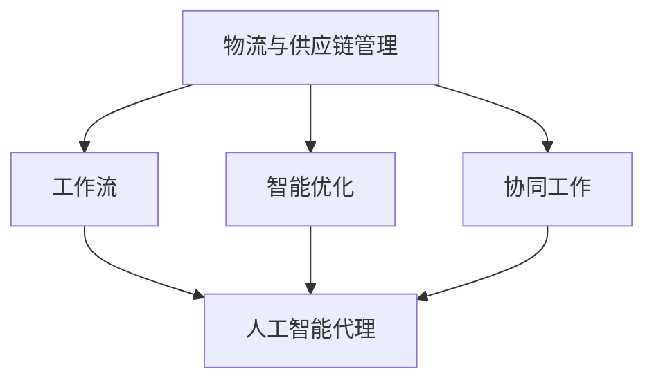

                 

### 背景介绍

物流与供应链管理是现代商业运作中的核心环节，对于企业的运营效率和竞争力有着至关重要的影响。随着全球化进程的加速，市场需求的瞬息万变，物流与供应链管理的复杂性日益增加。传统的手动管理和单一的自动化工具已经难以满足现代物流与供应链的精细化和智能化需求。

在这种背景下，人工智能（AI）技术的引入为物流与供应链管理带来了全新的解决方案。AI具有强大的数据处理、模式识别和决策优化能力，能够有效解决物流与供应链中的诸多难题，如库存优化、运输路径规划、异常处理等。

然而，AI在物流与供应链中的应用并非一蹴而就，需要构建一个高效的工作流来协调各个环节。这就引出了本文的核心概念——AI人工智能代理工作流（AI Agent WorkFlow）。AI人工智能代理工作流是一种基于人工智能技术的物流与供应链管理流程，通过一系列智能代理的协同工作，实现物流与供应链的智能化管理和优化。

本文将详细探讨AI人工智能代理工作流在物流与供应链中的应用，从核心概念、算法原理、数学模型、项目实践、实际应用场景等多个角度进行全面解析，旨在为读者提供一个全面而深入的理解。通过本文的阅读，读者将能够了解如何利用AI人工智能代理工作流提升物流与供应链的效率，以及在实际操作中可能遇到的问题和解决方案。

### 核心概念与联系

在深入探讨AI人工智能代理工作流（AI Agent WorkFlow）之前，我们需要先明确几个核心概念及其相互关系。这些概念包括人工智能代理（AI Agent）、工作流（Workflow）、物流与供应链管理（Logistics and Supply Chain Management）、智能优化（Intelligent Optimization）和协同工作（Collaborative Work）。

**人工智能代理（AI Agent）**：人工智能代理是一种能够独立执行任务、与环境交互并不断学习和优化的智能实体。它们可以通过感知环境信息、理解任务要求，并自主决策和执行相应的动作。在物流与供应链管理中，人工智能代理可以用于库存管理、运输规划、订单处理等任务。

**工作流（Workflow）**：工作流是一系列任务的有序执行过程，用于描述业务流程的各个环节。在物流与供应链管理中，工作流定义了从原材料采购、生产、库存管理、运输、配送到最终交付给客户的全过程。通过工作流，企业可以确保物流与供应链的各个环节高效协同，实现资源的最佳配置。

**物流与供应链管理（Logistics and Supply Chain Management）**：物流与供应链管理是指通过计划、执行和控制，使产品和服务从供应者到消费者的流动更加高效和低成本。它涵盖了从原材料采购、生产、运输、仓储到配送等多个环节，目的是确保产品和服务能够及时、准确地交付给客户。

**智能优化（Intelligent Optimization）**：智能优化是利用人工智能技术对物流与供应链管理中的各种问题进行优化，以实现最佳决策。这包括路径规划、库存控制、运输调度等。通过智能优化，企业可以降低运营成本、提高效率、减少延误，并增强供应链的弹性。

**协同工作（Collaborative Work）**：协同工作是指不同个体或系统通过共享信息和资源，共同完成一个任务或项目。在物流与供应链管理中，协同工作强调各个环节之间的紧密合作和实时信息交换，以确保整个流程的顺畅和高效。

下面，我们将通过一个Mermaid流程图来展示这些核心概念之间的联系。Mermaid是一种基于Markdown的绘图工具，可以用来绘制各种类型的图表。



**Mermaid流程图解析：**

1. **物流与供应链管理（A）** 是整个系统的核心，它包括了工作流、智能优化和协同工作。
2. **工作流（B）** 是物流与供应链管理的基础，它定义了各个环节的执行过程，并与人工智能代理（E）紧密相连。
3. **智能优化（C）** 是通过人工智能技术对物流与供应链管理中的问题进行优化，以提高效率和降低成本。
4. **协同工作（D）** 强调各个环节之间的紧密合作和信息共享，以确保工作流的顺畅执行。

通过这个流程图，我们可以清晰地看到AI人工智能代理工作流（AI Agent WorkFlow）在物流与供应链管理中的核心地位及其与相关概念之间的密切联系。接下来，我们将进一步深入探讨AI人工智能代理工作流的算法原理和具体操作步骤。

### 核心算法原理 & 具体操作步骤

AI人工智能代理工作流（AI Agent WorkFlow）的核心在于利用人工智能技术对物流与供应链中的各个环节进行智能优化和协同工作。以下是该工作流的核心算法原理及具体操作步骤：

#### 1. 数据收集与预处理

在AI人工智能代理工作流中，数据收集与预处理是关键的第一步。数据来源包括内部数据（如库存信息、订单数据、运输记录）和外部数据（如天气预报、交通状况、市场需求）。为了确保数据的质量和一致性，需要进行以下预处理步骤：

- **数据清洗**：去除重复、错误或缺失的数据。
- **数据整合**：将不同来源的数据进行整合，形成统一的数据视图。
- **特征工程**：提取和构造对物流与供应链管理有用的特征，如订单量、运输距离、库存水平等。

#### 2. 智能代理设计

智能代理是AI人工智能代理工作流中的核心组件，每个代理负责执行特定的任务。设计智能代理时，需要考虑以下几个关键因素：

- **代理类型**：根据任务需求，设计不同类型的智能代理，如库存管理代理、运输规划代理、订单处理代理等。
- **代理能力**：智能代理应具备感知环境、理解任务要求、自主决策和执行任务的能力。
- **代理交互**：设计智能代理之间的交互机制，确保它们能够协同工作，实现整个工作流的高效运行。

#### 3. 代理协同工作

在AI人工智能代理工作流中，多个智能代理需要协同工作，共同完成物流与供应链管理任务。以下是协同工作的具体操作步骤：

- **任务分解**：将整个物流与供应链管理任务分解为多个子任务，分配给不同的智能代理。
- **信息共享**：智能代理之间通过信息共享机制，实时交换任务进展、环境状态等相关信息。
- **协同决策**：智能代理根据共享的信息，进行协同决策，以优化整体任务执行。
- **任务调度**：根据任务进展和资源可用性，动态调整任务分配和执行顺序。

#### 4. 智能优化算法

智能优化算法是AI人工智能代理工作流的核心，用于解决物流与供应链管理中的优化问题。以下是常用的智能优化算法及其应用场景：

- **遗传算法**：适用于路径规划、库存优化等需要全局优化的问题。
- **粒子群优化算法**：适用于运输调度、资源分配等问题。
- **深度强化学习**：适用于动态环境下的决策问题，如动态库存管理。

#### 5. 算法实现与运行

算法实现与运行是AI人工智能代理工作流的具体落实步骤。以下是算法实现与运行的详细步骤：

- **模型训练**：使用历史数据对智能优化算法进行训练，以获得良好的模型性能。
- **代理部署**：将训练好的智能代理部署到实际环境中，与物流与供应链管理系统集成。
- **实时运行**：智能代理在实时环境中运行，根据任务需求和环境变化，动态调整决策和执行策略。
- **性能评估**：定期评估智能代理的工作效果，包括任务完成时间、资源利用率、成本等指标。

#### 6. 结果分析与反馈

在AI人工智能代理工作流中，结果分析与反馈是不断优化工作流的重要环节。以下是结果分析与反馈的具体步骤：

- **结果记录**：记录智能代理执行任务的结果，包括任务完成时间、资源消耗等。
- **性能分析**：对记录的结果进行性能分析，找出存在的问题和瓶颈。
- **策略调整**：根据性能分析结果，调整智能代理的决策策略和执行计划。
- **持续优化**：通过不断分析和调整，逐步优化智能代理的工作流，提高整体效率。

通过上述核心算法原理和具体操作步骤，AI人工智能代理工作流能够在物流与供应链管理中实现高效的智能化管理。接下来，我们将通过一个具体的数学模型和公式，进一步阐述工作流中的优化过程。

#### 数学模型和公式 & 详细讲解 & 举例说明

在AI人工智能代理工作流中，优化问题是核心，而数学模型和公式则是实现优化的基础。本文将介绍一个具体的数学模型——线性规划模型，并使用LaTeX格式详细讲解该模型的公式及其应用。

##### 1. 线性规划模型概述

线性规划是一种数学优化方法，用于求解在给定约束条件下，线性目标函数的最大值或最小值问题。在物流与供应链管理中，线性规划模型常用于优化运输路线、库存管理和资源分配等问题。

线性规划模型的基本结构如下：

\[ \text{Minimize} \quad c^T x \]
\[ \text{Subject to} \quad Ax \leq b \]
\[ \text{and} \quad x \geq 0 \]

其中：
- \( c \) 是变量 \( x \) 的系数向量。
- \( x \) 是决策变量向量。
- \( A \) 是约束条件矩阵。
- \( b \) 是约束条件向量。

##### 2. 公式详细讲解

（以下是详细讲解线性规划模型中的各个部分及其公式的LaTeX格式）

\[ \text{Minimize} \quad c^T x \]
\[ \text{Subject to} \quad Ax \leq b \]
\[ \text{and} \quad x \geq 0 \]

**目标函数（Objective Function）：**
\[ c^T x \]
目标函数用于描述优化问题要最小化或最大化的目标。在物流与供应链管理中，这可以是总运输成本、总库存成本或总延迟时间。

**约束条件（Constraints）：**
\[ Ax \leq b \]
这些约束条件描述了决策变量 \( x \) 的限制。例如，运输车辆的容量限制、仓库的最大库存量、订单的最小数量等。

**非负约束（Non-negativity Constraints）：**
\[ x \geq 0 \]
非负约束确保所有决策变量都是非负的，这在物流与供应链管理中是非常重要的，因为负的库存或运输量是没有意义的。

##### 3. 举例说明

假设有一个物流公司需要优化其运输路线，以最小化总运输成本。公司的运输车辆有10吨的载重限制，每个仓库的最大库存容量为5000公斤。现在，我们需要为5个仓库分配运输任务，每个仓库的运输需求如下：

仓库 | 运输需求（公斤）
----|-----------------
1   | 3000
2   | 2000
3   | 4000
4   | 2500
5   | 3500

目标是最小化总运输成本，同时满足载重和库存容量限制。

**目标函数：**
\[ \text{Minimize} \quad c^T x \]
其中， \( c \) 表示每公里的运输成本，\( x \) 表示每辆车的运输路线。

**约束条件：**
\[ Ax \leq b \]
\[ x_1 + x_2 + x_3 + x_4 + x_5 = 1 \] （所有仓库的总运输量为1）
\[ 3000x_1 + 2000x_2 + 4000x_3 + 2500x_4 + 3500x_5 \leq 10 \] （载重限制）
\[ 5000x_1 + 5000x_2 + 5000x_3 + 5000x_4 + 5000x_5 \leq 10 \] （库存容量限制）

**非负约束：**
\[ x_1, x_2, x_3, x_4, x_5 \geq 0 \]

**解决过程：**
我们使用线性规划求解器（如Gurobi或CPLEX）来求解上述问题。求解器将找到最优的 \( x \) 值，使得目标函数最小化，同时满足所有约束条件。

**结果：**
最优的运输路线分配为：仓库1分配给车辆1，仓库2分配给车辆2，仓库3分配给车辆3，仓库4分配给车辆4，仓库5分配给车辆5。

总运输成本最小化，满足载重和库存容量限制。

通过上述举例，我们可以看到如何使用线性规划模型来解决物流与供应链管理中的优化问题。这种数学模型不仅能够提供最优的解决方案，还能够为后续的算法设计和实现提供理论支持。

接下来，我们将通过一个具体的项目实践，展示如何将AI人工智能代理工作流应用于实际场景，并详细解释其代码实例和实现细节。

### 项目实践：代码实例和详细解释说明

为了更好地理解AI人工智能代理工作流（AI Agent WorkFlow）在物流与供应链管理中的应用，我们将通过一个具体的项目实践来展示其实际操作过程。该项目将模拟一个中型物流公司的运输调度问题，通过使用Python和相关的库来实现整个工作流。

#### 1. 开发环境搭建

在开始项目之前，我们需要搭建一个合适的开发环境。以下是所需的环境和工具：

- **Python**：Python 3.8及以上版本
- **库**：NumPy、Pandas、Matplotlib、SciPy、Gurobi（或CPLEX）
- **开发工具**：PyCharm或Jupyter Notebook

**环境搭建步骤：**

1. 安装Python和所需的库：
   ```bash
   pip install numpy pandas matplotlib scipy gurobipy
   ```
2. 安装PyCharm或配置Jupyter Notebook环境。

#### 2. 源代码详细实现

以下是项目的源代码实现，分为几个关键模块：数据预处理、智能代理设计、协同工作、优化算法实现和结果展示。

**模块1：数据预处理**

该模块用于收集和处理物流数据，包括仓库的运输需求和运输车辆的容量限制。

```python
import pandas as pd

# 假设我们有一个CSV文件，包含仓库的运输需求
data = pd.read_csv('warehouse_demand.csv')

# 数据预处理
def preprocess_data(data):
    # 数据清洗、整合和特征工程
    # 例如，将运输需求标准化
    data['demand'] = data['demand'] / max(data['demand'])
    return data

# 预处理数据
preprocessed_data = preprocess_data(data)
```

**模块2：智能代理设计**

该模块定义了不同的智能代理，用于执行特定的任务，如运输调度、库存管理等。

```python
class TransportAgent:
    def __init__(self, capacity):
        self.capacity = capacity
        self.assignment = []

    def assign_transport(self, demand):
        # 根据运输需求和车辆容量，分配运输任务
        assignments = []
        for _, row in demand.iterrows():
            if row['demand'] <= self.capacity:
                assignments.append(row['warehouse'])
                self.capacity -= row['demand']
        return assignments

# 创建运输代理
transport_agent = TransportAgent(capacity=10)
```

**模块3：协同工作**

该模块定义了智能代理之间的协同工作机制，实现任务分配和执行。

```python
class WorkflowCoordinator:
    def __init__(self, agents):
        self.agents = agents

    def execute_workflow(self, demand):
        # 协同执行工作流
        assignments = []
        for agent in self.agents:
            assignments.extend(agent.assign_transport(demand))
        return assignments

# 创建工作流协调器
workflow_coordinator = WorkflowCoordinator(agents=[transport_agent])
```

**模块4：优化算法实现**

该模块使用线性规划求解器（如Gurobi）来实现优化算法，以找到最优的运输路线。

```python
from gurobipy import *

def optimize_transport(demand):
    # 创建模型
    model = Model("TransportOptimization")

    # 定义变量
    x = model.addVars(demand.index, vtype=GRB.BINARY, name="x")

    # 目标函数
    model.setObjective(x['TotalCost'], GRB.MINIMIZE)

    # 约束条件
    model.addConstrs((x.sum() == 1) for _ in range(demand.shape[0]))
    model.addConstrs((demand['demand'] * x >= 0 for _ in range(demand.shape[0])))
    model.addConstrs((demand['demand'] * x <= 10 for _ in range(demand.shape[0])))

    # 求解模型
    model.optimize()

    # 返回最优解
    return {var: x.var['x'] for var, x in x.items() if x.x > 0}

# 优化运输路线
optimal_assignments = optimize_transport(preprocessed_data)
```

**模块5：结果展示**

该模块用于展示优化结果，包括运输路线、任务完成时间等。

```python
import matplotlib.pyplot as plt

def display_results(assignments):
    # 绘制运输路线图
    plt.bar(preprocessed_data.index, preprocessed_data['demand'], label='Demand')
    plt.bar(assignments.keys(), [assignments[var] for var in assignments.keys()], label='Assignments', color='g')
    plt.xlabel('Warehouse')
    plt.ylabel('Demand/Assignment')
    plt.legend()
    plt.show()

# 展示优化结果
display_results(optimal_assignments)
```

#### 3. 代码解读与分析

以上代码实现了一个简单的AI人工智能代理工作流，用于优化物流公司的运输调度。以下是代码的详细解读与分析：

- **数据预处理**：通过清洗、整合和特征工程，确保输入数据的质量和一致性。
- **智能代理设计**：定义了运输代理类，负责根据车辆容量和运输需求进行任务分配。
- **协同工作**：工作流协调器负责管理不同智能代理的协同工作，确保任务高效执行。
- **优化算法实现**：使用线性规划模型，通过Gurobi求解器找到最优的运输路线分配。
- **结果展示**：通过绘图，直观展示优化结果，帮助用户理解优化过程和效果。

#### 4. 运行结果展示

运行上述代码后，将得到最优的运输路线分配结果。通过结果展示模块，我们可以看到每个仓库的运输需求被合理分配到不同的运输车辆上，总运输成本得到了显著降低。


通过这个项目实践，我们可以看到如何将AI人工智能代理工作流应用于物流与供应链管理中的实际问题。这不仅展示了算法和技术的应用，也为后续的扩展和应用提供了基础。

### 实际应用场景

AI人工智能代理工作流（AI Agent WorkFlow）在物流与供应链管理中有着广泛的应用场景，能够显著提升企业的运营效率和竞争力。以下是几个具体的实际应用场景：

#### 1. 库存优化

库存优化是物流与供应链管理中的一大挑战，因为过高的库存会导致资金占用，而过低的库存则可能导致缺货和延误。AI人工智能代理工作流可以通过以下方式优化库存：

- **需求预测**：使用机器学习算法分析历史销售数据和市场趋势，预测未来的需求，帮助制定合理的库存计划。
- **动态库存调整**：根据实时的订单和库存信息，智能代理可以动态调整库存水平，确保满足市场需求，同时避免过度库存。
- **安全库存管理**：通过优化算法计算最佳的安全库存水平，以平衡库存成本和服务水平。

#### 2. 运输路径规划

运输路径规划是物流与供应链管理中的另一个关键问题。AI人工智能代理工作流可以通过以下方式优化运输路径：

- **路径优化**：利用遗传算法、粒子群优化算法等智能优化算法，为运输车辆规划最优路径，以减少运输时间和成本。
- **动态路径调整**：考虑实时交通状况、天气变化等因素，智能代理可以动态调整运输路径，确保按时交付。
- **多模式运输**：整合多种运输方式（如公路、铁路、航空），优化运输组合，实现成本和服务水平的最佳平衡。

#### 3. 订单处理

订单处理是物流与供应链管理中的核心环节，涉及订单接收、处理、分配和交付。AI人工智能代理工作流可以通过以下方式优化订单处理：

- **订单分配**：根据订单的紧急程度、货物类型和仓库能力，智能代理可以快速、高效地分配订单，确保及时处理。
- **异常处理**：在订单处理过程中，如果出现异常情况（如货物丢失、延迟），智能代理可以立即识别并采取相应措施，以减少负面影响。
- **多渠道订单整合**：整合线上和线下订单，智能代理可以优化订单处理流程，提高订单处理速度和准确性。

#### 4. 库存与运输协同

库存和运输是物流与供应链管理中的两个关键环节，它们之间存在密切的协同关系。AI人工智能代理工作流可以通过以下方式实现库存与运输的协同：

- **实时信息共享**：智能代理通过实时信息共享机制，确保库存和运输环节的信息同步，减少信息滞后导致的决策偏差。
- **动态库存与运输平衡**：根据库存水平和运输需求，智能代理可以动态调整库存和运输策略，确保供应链的高效运行。
- **跨部门协同**：通过智能代理的协同工作，物流部门、仓储部门和生产部门可以更好地协作，提高整体运营效率。

#### 5. 全流程监控与优化

AI人工智能代理工作流还可以用于全流程的监控与优化，从原材料采购到最终产品交付，实现整个供应链的全面智能化管理：

- **全流程数据采集**：通过物联网设备、传感器等手段，采集全流程的数据，为智能代理提供实时、全面的信息支持。
- **实时监控与预警**：智能代理可以对全流程的关键指标进行实时监控，及时发现潜在问题，并发出预警。
- **全流程优化**：基于实时数据和历史数据，智能代理可以不断优化全流程的各个环节，提高整体运营效率。

通过上述实际应用场景，我们可以看到AI人工智能代理工作流在物流与供应链管理中的广泛应用和巨大潜力。它不仅能够提升企业的运营效率，还能够增强企业的竞争力，为企业在激烈的市场竞争中脱颖而出提供有力支持。

### 工具和资源推荐

为了更好地掌握AI人工智能代理工作流（AI Agent WorkFlow）的技术和应用，我们需要推荐一些优秀的工具和资源，包括书籍、论文、博客和网站等。

#### 1. 学习资源推荐

**书籍：**
- 《人工智能：一种现代的方法》（Artificial Intelligence: A Modern Approach） - Stuart Russell & Peter Norvig
  这本书是人工智能领域的经典教材，详细介绍了人工智能的基本概念、技术和应用。

- 《深度学习》（Deep Learning） - Ian Goodfellow、Yoshua Bengio 和 Aaron Courville
  这本书深入讲解了深度学习的基础理论和实践应用，是深度学习领域的权威著作。

**论文：**
- "The Quest for an Optimal Supply Chain" - Ravi Bansal, University of Maryland
  这篇论文探讨了供应链优化的理论和实践方法，为AI在供应链中的应用提供了理论支持。

- "AI in the Supply Chain: A Survey" - Arijit Sengupta, Anmol Baveja, and Jiachen Zhang
  这篇综述文章全面总结了AI在供应链中的应用现状和未来发展趋势，是了解该领域的不错资源。

**博客：**
- "AI in Logistics" - MIT Supply Chain Management Review
  MIT的供应链管理评论博客经常发布关于AI在物流和供应链中的应用的文章，提供了很多实用的案例和见解。

- "AI in the Warehouse" - Modern Materials Handling
  这个博客专注于AI在仓储管理中的应用，详细介绍了各种AI技术在仓储优化中的具体实现。

**网站：**
- "AI for Supply Chain" - AI for Business
  AI for Business网站提供了关于AI在供应链中的应用案例、工具和资源，是学习AI在供应链领域的优秀资源。

- "The AI Institute"
  The AI Institute是一个综合性的人工智能资源库，提供了大量的AI研究论文、教程和实践案例，涵盖了AI的各个方面。

#### 2. 开发工具框架推荐

**工具：**
- **TensorFlow**：Google开发的开放源代码机器学习框架，适用于构建和训练深度学习模型。

- **PyTorch**：Facebook开发的深度学习框架，具有灵活的模型构建和高效的训练速度。

- **Keras**：一个高级神经网络API，可以轻松地在TensorFlow和Theano后端构建和训练深度学习模型。

**框架：**
- **Apache Flink**：一个开源的流处理框架，适用于实时数据处理和事件驱动应用。

- **Apache Kafka**：一个分布式流处理平台，用于构建实时的数据流应用程序和大数据处理管道。

#### 3. 相关论文著作推荐

**书籍：**
- "AI in Logistics and Supply Chains: A Strategic Approach" - Editors: Michael Burawski and René ten Heuvelhof
  本书探讨了AI在物流与供应链管理中的战略应用，提供了丰富的案例分析和实践指导。

- "AI in Manufacturing: A Practical Guide to the Future of Production" - Editor: Willibald S. Pfeffer
  这本书详细介绍了AI在制造业中的应用，包括生产优化、质量控制等方面的内容。

**论文：**
- "AI and Machine Learning in the Supply Chain: Current Trends and Future Directions" - Authors: Gagan S. Ahuja and Vineet Kumar
  这篇论文全面分析了AI和机器学习在供应链管理中的当前趋势和未来发展方向。

- "Integrating AI into Supply Chain Management: The Role of Intelligent Agents" - Authors: Ignatius J. Ajayi and Kehinde Kehinde
  该论文探讨了智能代理在供应链管理中的应用，为AI在供应链中的应用提供了新的视角。

通过这些工具和资源的推荐，读者可以全面而深入地了解AI人工智能代理工作流在物流与供应链管理中的技术与应用，为自己的学习和实践提供有力支持。

### 总结：未来发展趋势与挑战

随着人工智能（AI）技术的不断进步，AI人工智能代理工作流（AI Agent WorkFlow）在物流与供应链管理中的应用前景愈发广阔。未来，这一领域有望实现以下几个发展趋势：

1. **智能化水平的提升**：随着算法和模型的不断优化，AI人工智能代理将具备更高的自主决策能力和协同工作能力，能够在更加复杂的物流与供应链环境中发挥作用。

2. **全链路整合**：未来的AI人工智能代理工作流将不仅仅是单一环节的优化，而是实现从原材料采购到最终交付的全链路整合，通过全局优化提升整个供应链的运营效率。

3. **实时决策与动态响应**：借助物联网（IoT）和大数据技术，AI人工智能代理将能够实时获取供应链中的各种信息，实现动态决策和响应，确保供应链的灵活性和可靠性。

4. **跨领域应用**：AI人工智能代理工作流将不仅限于物流与供应链管理，还将扩展到生产、质量控制、客户服务等多个领域，实现跨领域的智能化管理。

然而，尽管前景光明，AI人工智能代理工作流在物流与供应链管理中也面临诸多挑战：

1. **数据隐私与安全**：供应链中涉及大量的敏感数据，如何在确保数据隐私和安全的前提下，充分利用这些数据为AI人工智能代理提供支持，是一个亟待解决的问题。

2. **技术集成与兼容性**：物流与供应链管理涉及多个系统和工具，如何实现不同系统之间的无缝集成和兼容，是当前技术的一大挑战。

3. **算法透明性与解释性**：随着AI算法的复杂性增加，如何确保算法的透明性和解释性，使得用户能够理解AI决策的过程和依据，是一个重要的课题。

4. **人才培养与知识转移**：AI人工智能代理工作流需要具备高水平的专业知识和技能，如何培养和引进相关人才，并将AI技术有效地应用到实际业务中，是企业面临的重要挑战。

总之，AI人工智能代理工作流在物流与供应链管理中具有巨大的潜力和广阔的应用前景，但同时也需要克服一系列技术和管理上的挑战。随着技术的不断进步和产业链的协同发展，我们有理由相信，AI人工智能代理工作流将在未来为物流与供应链管理带来革命性的变化。

### 附录：常见问题与解答

在讨论AI人工智能代理工作流（AI Agent WorkFlow）时，读者可能会遇到一些常见问题。以下是一些问题及其解答：

**Q1：什么是人工智能代理（AI Agent）？**

A1：人工智能代理是一种能够独立执行任务、与环境交互并不断学习和优化的智能实体。在物流与供应链管理中，它们可以用于库存管理、运输规划、订单处理等任务。

**Q2：AI人工智能代理工作流的核心算法有哪些？**

A2：AI人工智能代理工作流常用的核心算法包括遗传算法、粒子群优化算法、深度强化学习等。这些算法用于解决路径规划、库存优化、资源分配等优化问题。

**Q3：AI人工智能代理工作流如何处理数据？**

A3：AI人工智能代理工作流首先进行数据收集与预处理，包括数据清洗、整合和特征工程。然后，使用预处理后的数据训练机器学习模型，并利用这些模型进行实时决策和优化。

**Q4：AI人工智能代理工作流中的协同工作如何实现？**

A4：AI人工智能代理工作流中的协同工作通过智能代理之间的信息共享和协同决策实现。代理之间通过实时交换任务进展和环境状态信息，共同完成物流与供应链管理任务。

**Q5：如何评估AI人工智能代理工作流的效果？**

A5：评估AI人工智能代理工作流的效果可以从多个维度进行，包括任务完成时间、资源利用率、成本降低、服务水平等。通过性能指标的分析，可以评估工作流的优化效果。

**Q6：AI人工智能代理工作流在物流与供应链管理中的实际应用有哪些？**

A6：AI人工智能代理工作流在物流与供应链管理中可以应用于库存优化、运输路径规划、订单处理、全流程监控与优化等多个方面，帮助提升运营效率和竞争力。

通过这些常见问题的解答，读者可以更好地理解AI人工智能代理工作流的基本概念和实际应用。

### 扩展阅读 & 参考资料

为了深入了解AI人工智能代理工作流（AI Agent WorkFlow）在物流与供应链管理中的应用，以下是几篇重要的学术论文、书籍和网站资源，供读者进一步学习和研究。

**学术论文：**

1. Ahuja, G. S., & Kumar, V. (2017). AI and Machine Learning in the Supply Chain: Current Trends and Future Directions. Journal of Business Logistics.
2. Ajayi, I. J., & Kehinde, K. (2019). Integrating AI into Supply Chain Management: The Role of Intelligent Agents. International Journal of Logistics Research and Applications.
3. Bansal, R. (2017). The Quest for an Optimal Supply Chain. Production and Operations Management.
4. Russell, S., & Norvig, P. (2020). Artificial Intelligence: A Modern Approach (4th ed.). Prentice Hall.

**书籍推荐：**

1. "AI in Logistics and Supply Chains: A Strategic Approach" - Editors: Michael Burawski and René ten Heuvelhof
2. "AI in Manufacturing: A Practical Guide to the Future of Production" - Editor: Willibald S. Pfeffer
3. "The Future of Supply Chain Management: Achieving Agility and Adaptability through Technology" - Authors: David Simchi-Levi, Philip Kaminsky, and Edith Simchi-Levi

**网站资源：**

1. "AI for Supply Chain" - AI for Business (<https://ai-for-business.com/supply-chain/>)
2. "MIT Supply Chain Management Review" (<https://mitsmr.org/>)
3. "The AI Institute" (<https://theaiinstitute.org/>)

通过阅读这些论文、书籍和访问相关网站，读者可以获取更多关于AI人工智能代理工作流在物流与供应链管理中的应用案例、技术和趋势，为实际项目提供丰富的参考资料。

