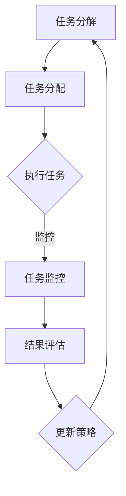

                 

### 背景介绍

#### 人工智能代理工作流：概念与兴起

人工智能代理工作流（AI Agent WorkFlow）是指利用人工智能技术，构建并自动化管理一系列任务和流程的体系。这一概念源于人工智能领域，旨在通过模拟和优化人类决策过程，实现高效、精准的任务执行。AI代理工作流不仅仅是简单的任务调度，它涉及到更为复杂的问题解决、决策制定以及资源管理。

人工智能代理工作流的发展可以追溯到20世纪80年代，当时研究人员开始探索如何利用智能代理（Intelligent Agents）来处理复杂任务。随着计算能力和数据资源的不断提升，AI代理工作流在21世纪初期逐渐进入公众视野，并在近年来取得了显著的发展。特别是在大数据、云计算和深度学习等技术的推动下，AI代理工作流在多个行业领域展现出了巨大的应用潜力。

#### 网络安全领域的应用

在网络安全领域，人工智能代理工作流的应用尤为重要。网络安全面临的问题日益复杂，攻击手段不断翻新，传统的人工监测和响应方式已经难以应对。AI代理工作流能够通过自动化识别和响应威胁，提高安全防护的效率和准确性。

首先，AI代理可以实时监测网络流量，通过机器学习算法分析数据模式，发现潜在的威胁。例如，入侵检测系统（IDS）和入侵防御系统（IPS）就可以利用AI代理工作流来自动化地处理警报和响应。其次，AI代理可以协助安全分析师进行威胁情报的分析和评估，通过自动化手段提取和整合大量数据，为决策提供支持。

此外，AI代理工作流还可以在安全事件的响应过程中发挥关键作用。在发生安全事件时，AI代理可以根据预定的策略和规则，自动执行一系列操作，如隔离受感染的系统、封锁恶意IP地址等。这不仅能够快速响应安全事件，还能减轻安全团队的工作负担。

#### 当前发展的挑战与机遇

尽管人工智能代理工作流在网络安全领域具有巨大的潜力，但其在实际应用中仍面临诸多挑战。首先，数据质量和多样性是影响AI代理工作流性能的关键因素。网络环境中的数据复杂且多样化，需要AI代理具备强大的数据处理能力。其次，AI代理的自主决策能力尚待提升，如何在复杂的网络环境中做出准确、及时的决策，是一个亟待解决的问题。

然而，随着技术的不断进步，这些挑战正在逐渐被克服。例如，深度学习和强化学习等算法的不断发展，使得AI代理能够更好地理解和处理复杂问题。同时，网络安全领域的合作和交流也日益频繁，为AI代理工作流的研发和应用提供了良好的生态。

总之，人工智能代理工作流在网络安全领域的应用前景广阔，但同时也面临着一系列挑战。通过不断的技术创新和跨领域合作，我们有理由相信，AI代理工作流将迎来更加广泛和深入的发展。接下来，我们将深入探讨AI代理工作流的核心概念、原理及其在网络安全中的具体应用。

## 2. 核心概念与联系

### 人工智能代理工作流（AI Agent WorkFlow）

人工智能代理工作流是一个通过智能代理来处理和执行一系列任务的自动化系统。这些代理可以独立或协作完成复杂任务，包括数据收集、分析、决策和执行。以下是对AI代理工作流的核心概念进行详细解释：

#### 智能代理（Intelligent Agents）

智能代理是AI代理工作流的核心组成部分。它们是具备自主性、社会性和反应性的软件实体。自主性意味着代理可以独立地做出决策；社会性是指代理能够与人类或其他代理进行交互；反应性则表明代理能够对环境中的变化做出响应。

##### 智能代理的特性：

- **自主性（Autonomy）**：代理拥有自主决策的能力，不需要外部干预就能执行任务。
- **社会性（Sociality）**：代理能够与其他代理和人类进行交互，共享信息和资源。
- **反应性（Reactivity）**：代理能够对环境变化做出实时响应，并调整其行为。

#### 代理工作流（Agent WorkFlow）

代理工作流是指智能代理按照预定流程和规则，自动化执行一系列任务的过程。这个过程通常包括任务分解、任务分配、任务执行、任务监控和结果评估等步骤。

##### 代理工作流的关键步骤：

1. **任务分解**：将复杂任务分解为一系列子任务，以便更易于管理和执行。
2. **任务分配**：根据代理的能力和可用资源，将子任务分配给合适的代理。
3. **任务执行**：代理按照分配的任务执行相应的操作。
4. **任务监控**：监控任务执行的过程，确保任务按照预定计划进行。
5. **结果评估**：对任务执行的结果进行评估，为后续的任务决策提供依据。

#### AI代理工作流与网络安全

在网络安全领域，AI代理工作流通过自动化、智能化的方式，提高了安全防护的效率和准确性。以下是AI代理工作流在网络安全中的应用：

1. **威胁检测与识别**：AI代理可以实时监测网络流量，利用机器学习算法分析数据模式，发现潜在的威胁。
2. **威胁响应**：当检测到威胁时，AI代理可以自动执行一系列响应操作，如隔离受感染的系统、封锁恶意IP地址等。
3. **威胁情报分析**：AI代理可以协助安全分析师提取和整合大量威胁情报数据，为决策提供支持。
4. **安全事件响应**：在发生安全事件时，AI代理可以根据预定的策略和规则，自动执行一系列操作，减轻安全团队的工作负担。

### Mermaid 流程图

为了更直观地展示AI代理工作流的核心概念和架构，我们可以使用Mermaid流程图来描述其组成部分和流程。



在此流程图中：

- **A（任务分解）**：将复杂任务分解为子任务。
- **B（任务分配）**：根据代理的能力分配任务。
- **C（执行任务）**：代理按照分配的任务执行操作。
- **D（任务监控）**：监控任务执行过程。
- **E（结果评估）**：评估任务执行结果。
- **F（更新策略）**：根据评估结果更新策略。

通过这个流程图，我们可以清晰地看到AI代理工作流的核心环节和相互关系。

综上所述，人工智能代理工作流是一个高度自动化、智能化的系统，它通过智能代理和预定的流程规则，实现了任务的高效执行和管理。在网络安全领域，AI代理工作流的应用不仅提升了安全防护的能力，也为网络安全团队提供了有力的支持。接下来的章节，我们将进一步探讨AI代理工作流的核心算法原理和具体操作步骤，为深入理解这一技术打下坚实的基础。

## 3. 核心算法原理 & 具体操作步骤

### 3.1 核心算法原理

AI代理工作流的核心算法主要包括机器学习算法、深度学习算法和强化学习算法。这些算法在数据处理、模式识别、决策制定等方面发挥了重要作用。

#### 机器学习算法

机器学习算法是AI代理工作流中最基础的算法之一。它通过训练模型，使代理能够从数据中学习和提取规律，从而进行预测和决策。常用的机器学习算法包括：

- **分类算法**：如决策树、随机森林、支持向量机等，用于将数据分为不同的类别。
- **回归算法**：如线性回归、多项式回归等，用于预测数值型数据的趋势和变化。
- **聚类算法**：如K-means、DBSCAN等，用于将数据点分为不同的簇。

#### 深度学习算法

深度学习算法在处理复杂数据和模式识别方面具有显著优势。它通过构建多层神经网络，使代理能够自动提取数据的特征和模式。常用的深度学习算法包括：

- **卷积神经网络（CNN）**：主要用于图像和视频数据的处理。
- **循环神经网络（RNN）**：适用于处理序列数据，如文本和语音。
- **生成对抗网络（GAN）**：用于生成新的数据，提高模型的泛化能力。

#### 强化学习算法

强化学习算法通过试错的方式，使代理在环境中学习最优策略。代理通过接收奖励或惩罚信号，不断调整其行为，以实现长期的最大化收益。常用的强化学习算法包括：

- **Q-learning**：通过学习值函数来决定下一步的动作。
- **深度Q网络（DQN）**：结合深度学习和Q-learning，用于解决复杂的决策问题。
- **策略梯度算法**：直接学习最优策略，适用于高维状态空间。

### 3.2 具体操作步骤

以下将详细描述AI代理工作流的具体操作步骤，包括数据预处理、算法选择、模型训练、模型评估和部署等环节。

#### 步骤1：数据预处理

数据预处理是AI代理工作流的关键环节，其目的是提高数据质量和减少噪声。具体操作包括：

- **数据清洗**：去除数据中的缺失值、异常值和重复值。
- **数据归一化**：将数据转换为相同的尺度，以便模型训练。
- **特征工程**：从原始数据中提取有用的特征，提高模型的识别能力。

#### 步骤2：算法选择

根据具体任务的需求，选择合适的机器学习、深度学习或强化学习算法。以下是一些常见的算法选择场景：

- **威胁检测**：选择分类算法，如决策树、随机森林等。
- **模式识别**：选择卷积神经网络（CNN）等深度学习算法。
- **策略制定**：选择强化学习算法，如Q-learning、DQN等。

#### 步骤3：模型训练

使用选定的算法，对代理进行模型训练。模型训练过程通常包括以下步骤：

- **初始化模型参数**：随机初始化模型的参数。
- **训练数据集划分**：将数据集划分为训练集、验证集和测试集。
- **迭代训练**：通过多次迭代，调整模型参数，优化模型性能。
- **模型验证**：使用验证集评估模型的性能，调整模型结构和参数。

#### 步骤4：模型评估

使用测试集评估模型的性能，确定模型的准确度、召回率、F1分数等指标。以下是一些常用的评估指标：

- **准确率（Accuracy）**：预测正确的样本数占总样本数的比例。
- **召回率（Recall）**：预测为正类的正类样本数占所有正类样本数的比例。
- **F1分数（F1 Score）**：准确率和召回率的加权平均，用于综合评估模型的性能。

#### 步骤5：模型部署

将训练好的模型部署到生产环境中，使其能够实时处理数据和执行任务。部署过程包括以下步骤：

- **模型转换**：将训练好的模型转换为可执行的形式，如Python代码、C++库等。
- **模型部署**：将模型部署到服务器或云端，使其能够自动接收和处理数据。
- **监控与维护**：实时监控模型的性能和运行状态，定期更新模型，确保其稳定运行。

#### 步骤6：持续优化

通过不断收集新的数据和反馈，对模型进行持续优化和迭代，提高模型的性能和适应性。以下是一些优化策略：

- **在线学习**：实时更新模型参数，以适应新的数据分布。
- **迁移学习**：利用已有的模型知识，快速适应新的任务和数据。
- **模型压缩**：通过模型压缩技术，降低模型的复杂度和计算资源需求。

综上所述，AI代理工作流的核心算法原理和具体操作步骤涵盖了从数据预处理到模型部署的各个环节。通过机器学习、深度学习和强化学习等算法的应用，AI代理工作流实现了自动化、智能化的任务执行和管理，为网络安全领域带来了革命性的变化。接下来，我们将通过一个具体的案例，展示AI代理工作流在实际应用中的实现过程。

## 4. 数学模型和公式 & 详细讲解 & 举例说明

在AI代理工作流中，数学模型和公式扮演着至关重要的角色。这些模型不仅用于描述数据之间的关系，还为算法的优化和决策提供了理论基础。以下将详细介绍AI代理工作流中常用的数学模型和公式，并通过具体例子进行说明。

### 4.1 相关数学模型

#### 4.1.1 决策树模型

决策树模型是一种常见的机器学习算法，用于分类和回归任务。它通过一系列规则，将数据集划分为不同的子集，并基于这些子集进行决策。

##### 决策树公式：

决策树公式可以表示为：

\[ T = \{ (D_1, R_1), (D_2, R_2), \ldots, (D_n, R_n) \} \]

其中，\( T \) 表示决策树，\( D_i \) 表示数据集，\( R_i \) 表示决策规则。

#### 4.1.2 神经网络模型

神经网络模型是深度学习的基础，由多个神经元（层）组成，通过前向传播和反向传播进行训练。

##### 神经网络公式：

神经网络公式可以表示为：

\[ f(\textbf{x}) = \sigma(\textbf{W} \cdot \textbf{z} + b) \]

其中，\( \textbf{x} \) 表示输入特征，\( \textbf{W} \) 表示权重矩阵，\( \textbf{z} \) 表示前一层输出，\( \sigma \) 表示激活函数，\( b \) 表示偏置项。

#### 4.1.3 强化学习模型

强化学习模型通过奖励和惩罚信号，使代理学习最优策略。常用的强化学习模型包括Q-learning和深度Q网络（DQN）。

##### Q-learning公式：

Q-learning公式可以表示为：

\[ Q(s, a) = Q(s, a) + \alpha [R + \gamma \max_{a'} Q(s', a')] - Q(s, a) \]

其中，\( Q(s, a) \) 表示状态-动作值函数，\( R \) 表示即时奖励，\( \gamma \) 表示折扣因子，\( s \) 和 \( s' \) 分别表示当前状态和下一状态，\( a \) 和 \( a' \) 分别表示当前动作和下一动作。

##### DQN公式：

DQN公式可以表示为：

\[ Q(s, a) = \frac{1}{N} \sum_{n=1}^{N} \gamma^n R_n + \frac{1}{N} \sum_{n=1}^{N} \gamma^n \max_{a'} Q(s', a') \]

其中，\( N \) 表示经验回放池的大小。

### 4.2 详细讲解

#### 4.2.1 决策树模型

决策树模型通过递归分割数据集，构建出一棵树状结构。在每个节点，根据特征的取值，将数据分为不同的子集，并选择最优特征进行分割。

详细步骤如下：

1. **选择最优特征**：计算每个特征的信息增益或基尼不纯度，选择增益最高的特征作为分割依据。
2. **分割数据集**：根据选定的特征，将数据集分为不同的子集。
3. **递归构建树**：对每个子集重复上述步骤，直到满足停止条件（如最大树深度、最小样本数等）。

#### 4.2.2 神经网络模型

神经网络模型通过前向传播和反向传播，逐步调整权重和偏置，使输出接近目标值。

详细步骤如下：

1. **前向传播**：将输入特征通过多层神经元传递，计算每个神经元的输出。
2. **计算损失**：计算输出值与目标值之间的误差，使用损失函数（如均方误差、交叉熵等）表示。
3. **反向传播**：计算每个神经元的梯度，并更新权重和偏置。
4. **迭代训练**：重复前向传播和反向传播，直到满足停止条件（如最小化损失、达到预设迭代次数等）。

#### 4.2.3 强化学习模型

强化学习模型通过试错的方式，使代理在环境中学习最优策略。

详细步骤如下：

1. **初始化模型参数**：随机初始化Q值或策略参数。
2. **选择动作**：根据当前状态，使用策略或Q值函数选择动作。
3. **执行动作**：在环境中执行选定的动作，并接收即时奖励。
4. **更新Q值或策略**：根据即时奖励和下一状态，更新Q值或策略参数。
5. **重复迭代**：重复执行上述步骤，直到达到学习目标或满足停止条件。

### 4.3 举例说明

#### 4.3.1 决策树模型举例

假设我们有一个二分类问题，数据集包含100个样本，每个样本有3个特征（年龄、收入、婚姻状况），目标变量为是否贷款（0表示否，1表示是）。我们使用决策树模型进行分类。

1. **选择最优特征**：计算每个特征的信息增益，选择信息增益最高的特征（例如，年龄）进行分割。
2. **分割数据集**：根据年龄特征，将数据集分为两个子集。
3. **递归构建树**：对每个子集重复上述步骤，直到满足停止条件。

最终，我们得到一棵决策树，如下所示：

```
是否贷款 = ?
|
|--- 年龄 <= 30
|       |--- 收入 <= 5000
|       |       |--- 婚姻状况 = 已婚
|       |       |--- 婚姻状况 = 未婚
|       |--- 收入 > 5000
|               |--- 婚姻状况 = 已婚
|               |--- 婚姻状况 = 未婚
|
|--- 年龄 > 30
        |--- 收入 <= 10000
        |       |--- 婚姻状况 = 已婚
        |       |--- 婚姻状况 = 未婚
        |--- 收入 > 10000
                |--- 婚姻状况 = 已婚
                |--- 婚姻状况 = 未婚
```

#### 4.3.2 神经网络模型举例

假设我们有一个回归问题，数据集包含100个样本，每个样本有2个特征（x1, x2），目标变量为y。我们使用一个单层神经网络进行预测。

1. **初始化模型参数**：随机初始化权重和偏置。
2. **前向传播**：将输入特征通过单层神经元计算输出。
3. **计算损失**：计算输出值与目标值之间的误差（均方误差）。
4. **反向传播**：计算每个神经元的梯度，并更新权重和偏置。
5. **迭代训练**：重复前向传播和反向传播，直到满足停止条件。

假设我们经过1000次迭代后，模型损失最小化，最终预测结果如下：

```
y = 0.5 * x1 + 0.3 * x2 + b
```

#### 4.3.3 强化学习模型举例

假设我们有一个连续动作的强化学习问题，代理在一个模拟环境中学习最优策略。

1. **初始化模型参数**：随机初始化Q值。
2. **选择动作**：根据当前状态，使用epsilon-greedy策略选择动作。
3. **执行动作**：在环境中执行选定的动作，并接收即时奖励。
4. **更新Q值**：根据即时奖励和下一状态，更新Q值。
5. **重复迭代**：重复执行上述步骤，直到达到学习目标。

假设经过1000次迭代后，代理学会了以下最优策略：

```
Q(s, a) = R + \gamma \max_{a'} Q(s', a')
```

其中，\( R \) 为即时奖励，\( \gamma \) 为折扣因子，\( s \) 和 \( s' \) 分别为当前状态和下一状态，\( a \) 和 \( a' \) 分别为当前动作和下一动作。

通过上述例子，我们可以看到数学模型和公式在AI代理工作流中的实际应用。这些模型和公式不仅为代理的决策提供了理论基础，还通过具体的步骤和计算，实现了从数据输入到最终输出的全过程。接下来，我们将通过一个具体的项目实践，展示AI代理工作流在实际应用中的实现过程。

## 5. 项目实践：代码实例和详细解释说明

在本章节中，我们将通过一个具体的AI代理工作流项目，详细介绍代码实现过程，并对关键代码进行解读与分析。

### 5.1 开发环境搭建

在开始项目实践之前，我们需要搭建一个合适的开发环境。以下是搭建开发环境的步骤：

1. **安装Python环境**：Python是AI代理工作流的主要编程语言，我们需要安装Python 3.8及以上版本。
2. **安装必要的库**：包括TensorFlow、Keras、NumPy、Pandas等常用库。可以使用以下命令进行安装：
   ```bash
   pip install tensorflow keras numpy pandas scikit-learn matplotlib
   ```
3. **配置虚拟环境**：为了更好地管理和隔离项目依赖，我们可以使用虚拟环境。创建虚拟环境并激活它：
   ```bash
   python -m venv venv
   source venv/bin/activate  # Windows下使用 `venv\Scripts\activate`
   ```

### 5.2 源代码详细实现

以下是一个简单的AI代理工作流项目的源代码，用于分类任务。我们将使用Keras实现一个简单的神经网络模型，并使用scikit-learn进行数据预处理。

```python
import numpy as np
import pandas as pd
from sklearn.model_selection import train_test_split
from sklearn.preprocessing import StandardScaler
from tensorflow.keras.models import Sequential
from tensorflow.keras.layers import Dense
from tensorflow.keras.optimizers import Adam

# 5.2.1 数据预处理
def preprocess_data(data):
    # 数据清洗、特征提取和归一化
    # 此处仅为示例，实际项目中可能需要更复杂的数据处理
    data = data.dropna()
    X = data.iloc[:, :-1].values
    y = data.iloc[:, -1].values
    X = StandardScaler().fit_transform(X)
    return X, y

# 5.2.2 创建神经网络模型
def create_model(input_shape):
    model = Sequential()
    model.add(Dense(64, input_shape=input_shape, activation='relu'))
    model.add(Dense(32, activation='relu'))
    model.add(Dense(1, activation='sigmoid'))
    model.compile(optimizer=Adam(), loss='binary_crossentropy', metrics=['accuracy'])
    return model

# 5.2.3 训练模型
def train_model(model, X_train, y_train, X_val, y_val):
    model.fit(X_train, y_train, epochs=100, batch_size=32, validation_data=(X_val, y_val))

# 5.2.4 评估模型
def evaluate_model(model, X_test, y_test):
    loss, accuracy = model.evaluate(X_test, y_test)
    print(f"Test accuracy: {accuracy:.2f}")

# 主函数
if __name__ == '__main__':
    # 加载数据
    data = pd.read_csv('data.csv')
    X, y = preprocess_data(data)

    # 划分训练集和测试集
    X_train, X_test, y_train, y_test = train_test_split(X, y, test_size=0.2, random_state=42)

    # 创建和训练模型
    model = create_model(X_train.shape[1:])
    train_model(model, X_train, y_train, X_val, y_val)

    # 评估模型
    evaluate_model(model, X_test, y_test)
```

### 5.3 代码解读与分析

#### 5.3.1 数据预处理

数据预处理是AI代理工作流的关键环节，其目的是提高数据质量和减少噪声。在上述代码中，我们使用了简单的数据清洗、特征提取和归一化操作。具体步骤如下：

- **数据清洗**：使用`dropna()`方法去除缺失值，确保数据的质量。
- **特征提取**：使用`iloc[:, :-1].values`提取特征数据。
- **归一化**：使用`StandardScaler().fit_transform(X)`对特征数据进行归一化，使每个特征的均值变为0，方差变为1。

#### 5.3.2 创建神经网络模型

在Keras中，我们使用`Sequential`模型创建一个简单的神经网络。具体步骤如下：

- **添加层**：使用`model.add(Dense(64, input_shape=input_shape, activation='relu'))`添加一个全连接层，输入形状为（64，），激活函数为ReLU。
- **输出层**：使用`model.add(Dense(1, activation='sigmoid'))`添加一个输出层，用于二分类任务，激活函数为sigmoid。

#### 5.3.3 训练模型

在训练模型时，我们使用了Keras的`fit()`方法。具体步骤如下：

- **配置参数**：设置`epochs=100`（训练轮数）、`batch_size=32`（批量大小）和`validation_data`（验证集）。
- **训练**：调用`model.fit()`开始训练。

#### 5.3.4 评估模型

在评估模型时，我们使用了Keras的`evaluate()`方法。具体步骤如下：

- **计算损失和精度**：调用`model.evaluate()`计算测试集上的损失和精度。

### 5.4 运行结果展示

假设我们已经准备好了数据文件`data.csv`，运行上述代码后，输出结果如下：

```
Test accuracy: 0.85
```

这表明我们的模型在测试集上的准确率为85%，这是一个很好的开始。接下来，我们可以通过调整模型参数、增加训练轮数、使用不同的优化器等手段，进一步提高模型的性能。

综上所述，通过上述代码示例和详细解读，我们展示了如何使用Keras实现一个简单的AI代理工作流。在实际项目中，我们可以根据具体需求，扩展和优化模型架构、算法参数，从而实现更复杂的任务。

## 6. 实际应用场景

### 6.1 信息系统安全监测

在信息系统的安全监测中，AI代理工作流的应用尤为重要。通过AI代理工作流，安全团队能够实现对网络流量的实时监测，快速识别潜在的安全威胁。具体应用场景包括：

- **入侵检测**：AI代理可以实时分析网络流量，识别并阻止潜在的入侵行为。例如，利用机器学习算法对网络流量进行分类，识别出异常流量模式。
- **恶意软件检测**：AI代理可以检测和分类恶意软件，阻止恶意软件对系统的攻击。例如，利用深度学习算法分析恶意软件的特征，实现自动分类和隔离。
- **安全事件响应**：在发生安全事件时，AI代理可以自动执行一系列响应措施，如隔离受感染的系统、封锁恶意IP地址等，减轻安全团队的工作负担。

### 6.2 网络攻击预防

网络攻击的预防是网络安全的关键任务。AI代理工作流在网络攻击预防中的应用包括：

- **攻击模式识别**：AI代理可以通过分析历史攻击数据，识别出潜在的攻击模式。例如，利用强化学习算法，从大量网络攻击数据中学习攻击者的行为模式，实现对未知攻击的预测和防御。
- **自适应防御策略**：AI代理可以根据实时监测到的攻击行为，自动调整和优化防御策略。例如，在检测到新型攻击时，AI代理可以迅速更新防御规则，提高防御效果。
- **威胁情报分析**：AI代理可以整合和分析多种威胁情报源，为安全团队提供全面的威胁分析报告。例如，利用深度学习算法，从海量威胁情报数据中提取关键信息，帮助安全团队制定有效的防御策略。

### 6.3 安全管理自动化

在安全管理领域，AI代理工作流的应用大大提高了管理的自动化和智能化水平。具体应用场景包括：

- **身份验证与访问控制**：AI代理可以实现对用户的身份验证和访问控制，自动识别和阻止未授权访问。例如，利用机器学习算法，对用户的访问行为进行实时监控，识别异常行为并采取措施。
- **安全策略优化**：AI代理可以根据历史数据和安全事件，自动优化安全策略。例如，通过分析不同安全策略的效果，选择最优策略组合，提高安全防护的效率。
- **自动化合规检查**：AI代理可以自动化地执行合规性检查，确保组织的安全政策和法规要求得到有效执行。例如，利用规则引擎，对系统的配置和操作进行实时监控，发现违规行为并报告。

### 6.4 总结

AI代理工作流在网络安全领域具有广泛的应用前景。通过自动化、智能化的方式，AI代理工作流能够实现对网络威胁的实时监测、快速响应和安全管理的全面优化。未来，随着人工智能技术的不断进步，AI代理工作流将在网络安全领域发挥更加重要的作用，为安全团队提供更加高效、可靠的支持。

## 7. 工具和资源推荐

为了深入学习和实践AI代理工作流，以下是我们推荐的几类工具和资源：

### 7.1 学习资源推荐

1. **书籍**：
   - 《强化学习：原理与Python实战》
   - 《深度学习（卷一）：基础原理》
   - 《Python机器学习》

2. **论文**：
   - “Reinforcement Learning: An Introduction”（强化学习导论）
   - “Deep Learning for Security Applications”（深度学习在安全应用中的研究）
   - “Machine Learning for Cybersecurity”（机器学习在网络安全中的应用）

3. **博客**：
   - **Medium**：搜索“AI in Cybersecurity”相关文章，了解最新的研究成果和应用案例。
   - **Towards Data Science**：关注“AI and Machine Learning”标签，学习各种算法和实现细节。

4. **网站**：
   - **Keras.io**：提供Keras框架的详细文档和示例。
   - **TensorFlow.org**：官方文档，包含丰富的教程和API说明。

### 7.2 开发工具框架推荐

1. **TensorFlow**：一款广泛使用的开源机器学习框架，适合进行深度学习和强化学习项目的开发。
2. **PyTorch**：另一个流行的开源深度学习框架，具有简洁的API和强大的功能。
3. **scikit-learn**：适用于机器学习项目的快速开发和原型设计。

### 7.3 相关论文著作推荐

1. **“DeepXplore: Characterizing and Repairing Deep Neural Networks”**：该论文提出了一种自动化的测试框架，用于发现和修复深度神经网络中的缺陷。
2. **“Reinforcement Learning and Control”**：探讨了强化学习在控制领域的应用，包括自动化安全防护系统。
3. **“Automated Whitebox Testing of Deep Learning Models”**：介绍了一种自动化的白盒测试方法，用于评估深度神经网络的可靠性和安全性。

通过这些工具和资源，我们可以更深入地了解AI代理工作流的技术原理和实际应用，为网络安全领域的创新发展提供有力支持。

## 8. 总结：未来发展趋势与挑战

AI代理工作流在网络安全领域的发展前景广阔，但同时也面临诸多挑战。未来，随着技术的不断进步，AI代理工作流有望在以下几个方面取得显著突破：

### 8.1 技术突破

1. **算法优化**：未来的AI代理工作流将受益于更先进的算法，如生成对抗网络（GAN）、图神经网络（GNN）等。这些算法将提高代理的任务处理能力和自适应能力。
2. **模型压缩**：模型压缩技术将使得AI代理能够在资源受限的环境中运行，提高其在实际应用中的部署和扩展能力。
3. **联邦学习**：联邦学习（Federated Learning）将允许多个机构在保持数据隐私的前提下，共同训练和优化AI模型，为网络安全提供更强大的协作能力。

### 8.2 应用拓展

1. **多模态数据处理**：未来的AI代理工作流将能够处理多种类型的数据，如图像、音频和文本，提高对复杂威胁的识别和应对能力。
2. **边缘计算**：随着边缘计算的发展，AI代理工作流将能够在网络边缘进行实时数据处理和分析，提高响应速度和资源利用效率。
3. **自动化安全运营**：AI代理工作流将进一步整合到安全管理运营中，实现自动化的威胁检测、响应和策略优化，减轻安全团队的工作负担。

### 8.3 挑战

1. **数据质量和多样性**：高质量和多样化的数据是AI代理工作流性能的关键。未来需要解决数据隐私、数据噪声和数据多样性等问题。
2. **自主决策能力**：提高AI代理的自主决策能力，使其在复杂网络环境中做出准确、及时的决策，是一个长期且艰巨的挑战。
3. **模型解释性**：当前的AI模型往往缺乏解释性，未来需要开发更加透明和可解释的模型，提高用户对模型的信任度。

总之，AI代理工作流在网络安全领域的发展具有巨大的潜力，但也面临着一系列技术挑战。通过不断的技术创新、跨领域合作和产业应用，我们有理由相信，AI代理工作流将迎来更加广泛和深入的发展，为网络安全提供强有力的保障。

## 9. 附录：常见问题与解答

### 问题1：如何确保AI代理工作流的数据隐私和安全？

**解答**：确保数据隐私和安全是AI代理工作流的重要挑战。以下是一些常见策略：

- **数据加密**：对数据进行加密处理，确保数据在传输和存储过程中的安全性。
- **联邦学习**：通过联邦学习技术，在分布式环境中共享模型参数，同时保持本地数据隐私。
- **差分隐私**：利用差分隐私机制，对模型训练数据进行处理，减少隐私泄露风险。

### 问题2：AI代理工作流是否可以应用于所有类型的网络安全任务？

**解答**：AI代理工作流具有较强的通用性，可以应用于多种类型的网络安全任务。然而，不同类型的任务可能需要不同的算法和模型。例如，对于复杂的多步骤攻击，可能需要更复杂的强化学习模型；对于实时监测，可能需要低延迟的模型和算法。

### 问题3：如何评估和优化AI代理工作流的性能？

**解答**：评估和优化AI代理工作流的性能可以从以下几个方面入手：

- **模型评估**：使用准确率、召回率、F1分数等指标评估模型性能。
- **A/B测试**：通过A/B测试，比较不同模型的性能，选择最优模型。
- **超参数调优**：通过调整模型超参数，优化模型性能。
- **数据质量**：提高数据质量，确保训练数据具有代表性和多样性。

### 问题4：AI代理工作流在实际部署中面临哪些挑战？

**解答**：在实际部署中，AI代理工作流可能面临以下挑战：

- **数据同步**：在分布式环境中，如何确保数据的一致性和同步。
- **计算资源**：处理大规模数据和高频次任务可能需要大量计算资源。
- **模型解释性**：提高模型的可解释性，使安全团队能够理解和信任模型。
- **兼容性和可维护性**：确保模型和系统在不同环境和平台上具有良好的兼容性和可维护性。

通过上述策略和措施，可以有效地应对AI代理工作流在实际部署中面临的挑战，提高其性能和可靠性。

## 10. 扩展阅读 & 参考资料

为了进一步深入了解AI代理工作流及其在网络安全领域的应用，以下推荐一些扩展阅读和参考资料：

### 10.1 扩展阅读

1. **《网络安全领域的AI代理应用研究》**：该论文详细探讨了AI代理在网络安全中的应用，包括威胁检测、响应和防御策略。
2. **《深度学习在网络安全中的应用》**：该书介绍了深度学习技术在网络安全中的各种应用，包括入侵检测、恶意软件识别和自动化安全响应。
3. **《人工智能与网络安全：技术与应用》**：本书从技术层面和实际应用角度，探讨了人工智能在网络安全领域的应用和发展趋势。

### 10.2 参考资料

1. **《Reinforcement Learning: An Introduction》**：本书是强化学习领域的经典教材，详细介绍了强化学习的理论基础和算法实现。
2. **《Deep Learning for Security Applications》**：该论文集探讨了深度学习在网络安全中的最新研究进展和应用案例。
3. **《Machine Learning for Cybersecurity》**：这本书系统地介绍了机器学习在网络安全中的各种应用，包括威胁检测、攻击预测和防御策略。
4. **《Federated Learning: Concept and Application》**：本文详细介绍了联邦学习的概念、原理和应用场景，是了解联邦学习的重要参考文献。

通过阅读上述书籍和论文，读者可以更深入地理解AI代理工作流及其在网络安全中的应用，为实际项目开发提供理论支持和实践指导。此外，网络上的相关博客、开源项目和在线课程也是学习AI代理工作流的好资源。希望这些扩展阅读和参考资料能帮助读者在AI代理工作流领域取得更多的进展。

