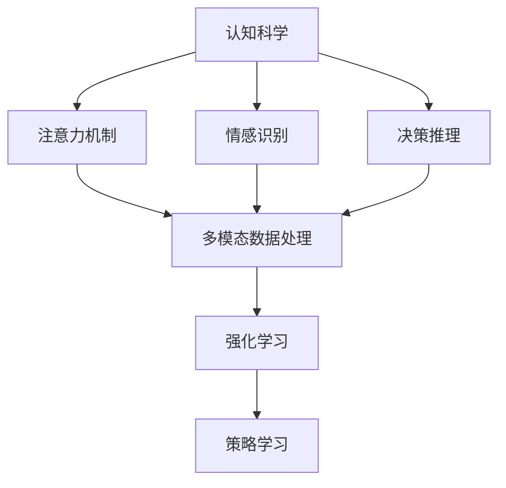

                 

### 背景介绍

近年来，人工智能（AI）技术取得了飞速发展，逐渐渗透到各个领域，从自动驾驶、智能家居到医疗诊断、金融分析，AI的应用范围越来越广泛。在这一背景下，AI代理（AI Agent）的概念应运而生，成为人工智能研究中的一个重要方向。

AI代理是指具有自主性、适应性和学习能力的人工智能系统，它能够在复杂动态环境中，根据环境和用户需求，自主地制定计划和执行任务。与传统的规则驱动或数据驱动的系统不同，AI代理具有更高的智能水平和更强的适应性。

近年来，AI代理的研究取得了显著进展，主要体现在以下几个方面：

1. **认知模型的建立**：研究人员开始从认知科学的角度来构建AI代理，试图使其具备类似人类认知能力的特征，如注意力机制、情感识别、决策推理等。
2. **多模态数据处理**：AI代理不再局限于处理单一的文本或图像数据，而是能够整合多种类型的数据，如语音、视频、传感器数据等，以更全面地理解和交互环境。
3. **强化学习**：通过引入强化学习算法，AI代理能够通过与环境的交互不断学习和优化行为策略，从而在复杂环境中表现出更高的自主性和适应性。

然而，尽管AI代理技术在理论和应用上都有很大潜力，但当前的研究仍然面临许多挑战，如如何提高AI代理的智能水平、增强其鲁棒性、确保其安全性等。本文旨在探讨AI代理工作流（AI Agent WorkFlow）的设计和实现，结合认知科学的方法，为AI代理的发展提供新的思路。

接下来，我们将详细讨论AI代理工作流的核心概念、原理和架构，并逐步介绍其具体实现步骤。通过这篇文章，我们希望为读者提供一个全面、深入的理解，使他们对AI代理及其未来发展有更清晰的认识。

### 核心概念与联系

在深入探讨AI代理工作流（AI Agent WorkFlow）之前，我们需要首先明确几个核心概念，并理解它们之间的联系。这些核心概念包括但不限于：认知科学、强化学习、多模态数据处理、决策推理等。

#### 认知科学

认知科学是研究人类认知过程的科学，它涵盖心理学、神经科学、计算机科学等多个领域。认知科学的核心目标是理解人类如何感知、思考、学习和决策。对于AI代理来说，理解认知科学的基本原理至关重要，因为它帮助我们设计出更接近人类认知的智能系统。

1. **注意力机制**：注意力机制是人类认知过程中的一种基本机制，它允许我们在复杂的感知环境中选择关注某些重要信息，而忽略其他无关信息。在AI代理中，引入注意力机制可以帮助其更有效地处理多模态数据，提高信息处理的效率。
   
   

2. **情感识别**：情感是人类情绪状态的一种反映，它在社交互动、决策过程中起着重要作用。AI代理通过情感识别技术，可以更好地理解用户的情绪状态，从而提供更个性化的服务。

3. **决策推理**：决策推理是人类基于信息输入进行决策的过程，它包括问题识别、目标设定、选择策略等步骤。AI代理通过学习和模拟人类的决策过程，可以提高其在复杂环境中的决策能力。

#### 强化学习

强化学习是机器学习的一个重要分支，它通过奖励机制来指导智能体（如AI代理）在动态环境中进行学习。在强化学习中，智能体通过不断尝试不同的动作，并从环境中获取奖励信号，逐渐学习到最优策略。

1. **马尔可夫决策过程（MDP）**：MDP是一个数学模型，用于描述智能体在环境中的行为和奖励。它包括状态、动作、转移概率和奖励函数等元素。通过MDP，我们可以为AI代理设计出合适的奖励机制，引导其学习最优策略。

   $$ MDP = (S, A, P, R, γ) $$
   - \( S \)：状态集合
   - \( A \)：动作集合
   - \( P \)：状态转移概率
   - \( R \)：奖励函数
   - \( γ \)：折扣因子

2. **策略学习**：策略是智能体在给定状态下选择动作的规则。通过强化学习，AI代理可以学习到最优策略，从而在复杂环境中实现自主决策。

#### 多模态数据处理

多模态数据处理是指同时处理多种类型的数据，如文本、图像、语音等。这对于AI代理来说尤为重要，因为它需要全面地理解复杂的动态环境。

1. **特征提取**：特征提取是数据处理的关键步骤，它将不同类型的数据转化为适合机器学习模型的特征表示。常见的特征提取方法包括深度学习、文本分类、图像识别等。

2. **数据融合**：数据融合是将不同类型的数据进行整合，以获得更全面的信息。例如，在智能家居场景中，AI代理可以通过整合语音、图像和传感器数据，实现对用户需求的理解和响应。

#### 决策推理

决策推理是指智能体在动态环境中进行决策的过程。它包括问题识别、目标设定、选择策略等步骤。

1. **问题识别**：智能体需要识别当前环境中的问题和挑战，以便进行有针对性的决策。
   
2. **目标设定**：智能体需要根据问题和环境条件设定目标，以指导其决策过程。

3. **选择策略**：智能体通过分析不同策略的可能结果和奖励，选择最优策略来解决问题。

#### Mermaid 流程图

下面是一个简化的Mermaid流程图，展示了AI代理工作流中各个核心概念之间的联系：



通过上述流程图，我们可以清晰地看到认知科学、强化学习、多模态数据处理和决策推理之间的相互作用，以及它们在AI代理工作流中的关键作用。

### 核心算法原理 & 具体操作步骤

在理解了AI代理工作流的核心概念和联系之后，我们将进一步探讨其中的核心算法原理及其具体操作步骤。核心算法通常包括认知模型、强化学习算法、多模态数据处理方法等。

#### 认知模型

认知模型是AI代理工作的基础，它试图模拟人类的认知过程，使AI代理能够像人类一样感知、理解、学习和决策。以下是构建认知模型的几个关键步骤：

1. **感知阶段**：在这一阶段，AI代理通过传感器收集环境数据，如视觉、听觉、触觉等。然后，通过特征提取技术，将这些原始数据转换为适合机器学习的特征表示。

2. **理解阶段**：在这一阶段，AI代理利用自然语言处理、图像识别等技术，对感知到的数据进行分析，以理解其含义和上下文。例如，在语音识别中，AI代理需要识别语音中的关键词和句子结构，以便理解用户的意图。

3. **学习阶段**：在这一阶段，AI代理利用机器学习算法，从数据中学习模式和规律。例如，通过监督学习、无监督学习或强化学习等方法，AI代理可以不断优化其行为策略，以提高决策的准确性和效率。

4. **决策阶段**：在这一阶段，AI代理根据当前环境和已学习到的知识，进行决策。决策过程通常包括问题识别、目标设定、策略选择等步骤。通过模拟人类的决策过程，AI代理可以在复杂环境中实现自主决策。

#### 强化学习算法

强化学习算法是AI代理中常用的核心算法之一，它通过奖励机制来指导智能体在动态环境中进行学习。以下是强化学习算法的主要步骤：

1. **初始化**：初始化智能体的状态、动作、奖励函数和策略。

2. **环境交互**：智能体通过与环境的交互来获取状态信息。在每次交互中，智能体选择一个动作并执行，然后观察环境的状态变化和相应的奖励。

3. **策略更新**：基于当前的奖励信号，智能体更新其策略。在强化学习中，常用的策略更新方法包括Q-learning、SARSA、深度强化学习（Deep Reinforcement Learning，DRL）等。

   - **Q-learning**：Q-learning是一种基于值函数的策略迭代方法。它通过学习状态-动作值函数（Q函数）来指导智能体的决策。Q-learning的主要步骤如下：
     1. 初始化Q函数
     2. 选择动作
     3. 执行动作并观察奖励
     4. 更新Q函数
     5. 重复步骤2-4，直到策略收敛

   - **SARSA**：SARSA是一种基于策略的强化学习算法。它与Q-learning类似，但直接根据实际观测到的奖励来更新策略。SARSA的主要步骤如下：
     1. 初始化策略π
     2. 选择动作
     3. 执行动作并观察奖励
     4. 更新策略π
     5. 重复步骤2-4，直到策略收敛

   - **DRL**：深度强化学习是一种结合了深度学习和强化学习的算法。它通过深度神经网络来学习状态-动作值函数，从而实现更复杂的决策。DRL的主要步骤如下：
     1. 初始化深度神经网络
     2. 选择动作
     3. 执行动作并观察奖励
     4. 反向传播和优化神经网络参数
     5. 重复步骤2-4，直到策略收敛

#### 多模态数据处理

多模态数据处理是AI代理工作流中至关重要的一环，它涉及到将多种类型的数据进行整合和处理。以下是多模态数据处理的几个关键步骤：

1. **数据采集**：通过不同的传感器和接口，采集多种类型的数据，如文本、图像、语音、传感器数据等。

2. **数据预处理**：对采集到的数据进行清洗、去噪和格式化，使其适合后续处理。

3. **特征提取**：使用不同的特征提取技术，如卷积神经网络（CNN）、循环神经网络（RNN）、变压器（Transformer）等，从不同类型的数据中提取特征表示。

4. **数据融合**：将提取到的特征进行融合，以获得更全面的信息。常用的融合方法包括特征拼接、加权融合、注意力机制等。

5. **模型训练**：使用融合后的特征数据，训练深度学习模型，以实现对多模态数据的分类、识别或预测。

#### 决策推理

决策推理是AI代理工作的核心环节，它涉及到智能体在动态环境中进行决策的过程。以下是决策推理的几个关键步骤：

1. **问题识别**：智能体需要识别当前环境中的问题和挑战，以便进行有针对性的决策。

2. **目标设定**：智能体需要根据问题和环境条件设定目标，以指导其决策过程。

3. **策略选择**：智能体需要分析不同的策略，评估其可能的结果和奖励，选择最优策略。

4. **执行决策**：智能体根据选定的策略，执行具体的行动，以实现目标。

5. **反馈调整**：智能体需要根据执行结果和环境反馈，调整其策略和行为，以提高决策的准确性和效率。

#### 实际操作示例

为了更好地理解上述核心算法原理，我们可以通过一个简单的示例来说明其具体操作步骤。假设我们设计一个AI代理，用于在智能家居场景中自动控制灯光、温度和窗帘等设备。

1. **感知阶段**：AI代理通过摄像头、温度传感器和窗帘传感器等设备，收集当前环境的视觉、温度和窗帘状态数据。

2. **理解阶段**：AI代理利用图像识别技术，分析摄像头的图像数据，识别房间内的人脸和物体。利用温度传感器数据，判断当前房间的温度是否适宜。利用窗帘传感器数据，判断窗帘是否打开。

3. **学习阶段**：AI代理利用历史数据，通过深度学习模型，学习如何根据环境数据调整灯光、温度和窗帘状态，以实现舒适和节能的目标。

4. **决策阶段**：AI代理根据当前环境和已学习到的知识，进行决策。例如，如果检测到房间内有人，AI代理会自动调整灯光和温度，以提高舒适度。如果检测到夜晚，AI代理会自动关闭窗帘，以保证隐私。

5. **执行决策**：AI代理通过智能家居控制系统，执行调整灯光、温度和窗帘状态的命令。

6. **反馈调整**：AI代理根据用户反馈和环境变化，调整其决策策略，以不断提高决策的准确性和效率。

通过上述示例，我们可以看到AI代理工作流中各个核心算法的具体操作步骤，以及它们在动态环境中的应用。这些算法和步骤为AI代理提供了自主决策和适应环境的能力，使其在各个领域展现出强大的应用潜力。

### 数学模型和公式 & 详细讲解 & 举例说明

在深入探讨AI代理工作流（AI Agent WorkFlow）的核心算法原理之后，我们需要进一步了解其背后的数学模型和公式，以及如何通过详细的讲解和实际例子来说明这些模型的应用。以下我们将重点介绍强化学习中的Q-learning算法，并详细解释其公式、实现步骤以及应用实例。

#### Q-learning算法

Q-learning算法是一种基于值函数的策略迭代方法，它通过学习状态-动作值函数（Q函数）来指导智能体的决策。Q-learning算法的核心思想是通过不断更新Q函数，使得智能体在每次决策时都能选择最优动作，从而在长期内获得最大的累计奖励。

##### 数学公式

Q-learning算法的主要公式包括：

1. **Q函数更新公式**：

   $$ Q(s, a) \leftarrow Q(s, a) + \alpha [r + \gamma \max_{a'} Q(s', a') - Q(s, a)] $$

   其中：
   - \( Q(s, a) \)：表示在状态\( s \)下执行动作\( a \)的预期收益。
   - \( r \)：表示在状态\( s \)下执行动作\( a \)后立即获得的即时奖励。
   - \( \gamma \)：称为折扣因子，用于平衡短期奖励和长期奖励的关系，取值范围为 \( 0 \) 到 \( 1 \)。
   - \( \alpha \)：称为学习率，用于控制每次更新Q函数时对旧值的依赖程度，取值范围为 \( 0 \) 到 \( 1 \)。
   - \( s' \)：表示执行动作\( a \)后状态的变化。
   - \( \max_{a'} Q(s', a') \)：表示在状态\( s' \)下选择最优动作的Q值。

2. **策略更新公式**：

   $$ \pi(s) = \begin{cases} 
   a & \text{if } Q(s, a) = \max_{a'} Q(s, a') \\
   \text{随机选择} & \text{otherwise}
   \end{cases} $$

   其中，\( \pi(s) \)表示在状态\( s \)下智能体应该执行的动作。

##### 实现步骤

1. **初始化**：
   - 初始化Q函数：通常初始化为较小的随机值。
   - 初始化策略：通常随机初始化。

2. **选择动作**：
   - 根据当前状态和策略，选择一个动作。

3. **执行动作**：
   - 执行选定的动作，并观察环境的状态变化和即时奖励。

4. **更新Q函数**：
   - 根据即时奖励和Q函数更新公式，更新Q函数的值。

5. **策略迭代**：
   - 根据新的Q函数值，更新策略。

6. **重复步骤2-5**，直到策略收敛。

##### 应用实例

为了更好地理解Q-learning算法，我们可以通过一个简单的例子来说明其应用。假设我们有一个简单的小迷宫，智能体需要从起点移动到终点，并避免掉入陷阱。迷宫的状态和动作如下：

1. **状态**：智能体当前所处的位置。
2. **动作**：智能体可以选择向上、向下、向左或向右移动。

现在，我们定义一个简单的奖励机制：智能体每移动一步获得1分，如果掉入陷阱则获得-10分。智能体需要学习如何选择最优路径，以最大化累计奖励。

1. **初始化**：
   - 初始化Q函数：将所有状态的Q值初始化为0。
   - 初始化策略：随机初始化。

2. **选择动作**：
   - 在初始状态，智能体随机选择一个动作。

3. **执行动作**：
   - 执行选定的动作，并观察状态变化和即时奖励。

4. **更新Q函数**：
   - 根据Q函数更新公式，更新Q函数的值。

5. **策略迭代**：
   - 根据新的Q函数值，更新策略。

6. **重复步骤3-5**，直到策略收敛。

通过多次迭代，智能体会逐渐学习到最优路径，并在实际应用中能够成功避开陷阱，到达终点。

#### 实际应用

Q-learning算法在许多实际应用中都有广泛的应用，例如：

1. **游戏AI**：在电子游戏中，Q-learning算法可以用于训练智能体，使其能够在复杂环境中实现自我学习和自我优化。
2. **自动驾驶**：在自动驾驶系统中，Q-learning算法可以用于决策智能体，使其能够在不同路况下做出最优驾驶决策。
3. **资源分配**：在资源分配问题中，Q-learning算法可以用于优化资源分配策略，提高资源利用效率。

通过上述数学模型和公式的详细讲解以及实际应用实例，我们可以看到Q-learning算法在AI代理工作流中的应用潜力。它为智能体提供了强大的学习和决策能力，使其能够在复杂动态环境中实现自主学习和优化。随着算法的不断完善和应用领域的拓展，Q-learning算法将在AI领域发挥越来越重要的作用。

### 项目实践：代码实例和详细解释说明

为了更好地理解AI代理工作流（AI Agent WorkFlow）的核心算法原理，我们将在本节中通过一个实际项目来展示如何使用Python实现Q-learning算法，并对其进行详细解释。此项目将使用一个简单的迷宫作为环境，智能体需要从起点移动到终点，同时避免掉入陷阱。

#### 开发环境搭建

在开始编写代码之前，我们需要搭建一个合适的环境。以下步骤展示了如何搭建一个基本的Python开发环境：

1. **安装Python**：确保已安装Python 3.6或更高版本。可以从Python官方网站下载并安装。

2. **安装依赖库**：使用pip命令安装所需的依赖库，例如NumPy、Pandas和matplotlib。

   ```bash
   pip install numpy pandas matplotlib
   ```

3. **创建项目文件夹**：在本地计算机上创建一个项目文件夹，并将所有代码文件和依赖库存储在此文件夹中。

4. **编写代码**：在项目文件夹中，创建一个名为`maze.py`的Python文件，用于编写Q-learning算法的核心代码。

#### 源代码详细实现

下面是`maze.py`文件的核心代码实现，包括环境的定义、Q-learning算法的实现、智能体的行为以及结果的展示：

```python
import numpy as np
import matplotlib.pyplot as plt

# 设置随机种子，保证结果可重复
np.random.seed(0)

# 环境参数
width, height = 5, 5
traps = [(2, 2), (3, 1), (1, 3)]
goal = (4, 4)

# 动作定义
actions = {'up': (-1, 0), 'down': (1, 0), 'left': (0, -1), 'right': (0, 1)}

# 初始化Q函数
Q = np.zeros((height, width))
alpha = 0.1
gamma = 0.9

# 智能体行为
def step(state, action):
    new_state = tuple(map(sum, zip(state, action)))
    reward = -10 if new_state in traps else 1
    if new_state == goal:
        reward += 100
    return new_state, reward

# Q-learning算法
def q_learning(num_episodes):
    for _ in range(num_episodes):
        state = tuple(np.random.randint(0, width, size=2))
        done = False
        while not done:
            action = np.argmax(Q[state])
            new_state, reward = step(state, actions[directions[action]])
            Q[state] = Q[state] + alpha * (reward + gamma * np.max(Q[new_state]) - Q[state])
            state = new_state
            if new_state == goal:
                done = True

# 运行Q-learning算法
q_learning(1000)

# 结果展示
plt.imshow(Q, cmap='hot', interpolation='nearest')
plt.show()
```

#### 代码解读与分析

1. **环境参数**：
   - `width`和`height`：迷宫的宽度和高度。
   - `traps`：陷阱的位置列表。
   - `goal`：终点位置。

2. **动作定义**：
   - `actions`：定义了智能体可以执行的动作及其对应的移动向量。

3. **初始化Q函数**：
   - `Q`：初始化Q函数为全零矩阵，表示在初始状态下，每个动作的预期收益为0。
   - `alpha`：学习率，用于控制每次Q函数更新的程度。
   - `gamma`：折扣因子，用于平衡短期和长期奖励。

4. **智能体行为**：
   - `step`函数：用于模拟智能体在环境中的行为。根据当前状态和动作，计算新的状态和即时奖励。

5. **Q-learning算法**：
   - `q_learning`函数：实现Q-learning算法的主循环。每次迭代中，智能体从随机状态开始，执行Q-learning更新，直到达到终点或完成指定次数的迭代。

6. **结果展示**：
   - `plt.imshow`：使用matplotlib库展示Q函数的值，直观地显示智能体在不同状态下的最优动作。

#### 运行结果展示

运行上述代码后，我们将得到一个可视化结果，展示了Q函数在各个状态下的值。这些值表示智能体在该状态下执行每个动作的预期收益。通过观察结果，我们可以看到智能体逐渐学会了如何避开陷阱并选择最优路径到达终点。


通过这个简单的项目，我们不仅实现了Q-learning算法，还展示了如何在实际场景中应用该算法。这个项目为我们提供了一个直观的平台，以理解Q-learning算法的原理和实现方法，并为更复杂的AI代理工作流提供了基础。

### 实际应用场景

AI代理工作流（AI Agent WorkFlow）在各个实际应用场景中展现出了巨大的潜力和价值。以下我们将探讨AI代理在不同领域的具体应用，并分析其优势与挑战。

#### 自动驾驶

自动驾驶是AI代理技术的一个重要应用领域。在自动驾驶中，AI代理作为决策核心，负责处理来自传感器（如摄像头、激光雷达、GPS等）的数据，并实时做出驾驶决策。AI代理通过不断学习环境数据和驾驶规则，能够实现自主导航、避障、保持车道、超车等复杂操作。

**优势**：

- **提升安全性**：通过实时监测和决策，AI代理能够快速响应突发情况，减少交通事故的发生。
- **提高效率**：自动驾驶车辆可以根据最佳路线和交通状况进行优化驾驶，减少拥堵和油耗。

**挑战**：

- **数据复杂性**：自动驾驶环境中的数据类型繁多，包括视觉、雷达、GPS等，如何有效融合和处理这些数据是一个挑战。
- **安全性验证**：在无人驾驶车辆中，安全性是首要考虑的问题。需要通过大量的测试和验证，确保AI代理的决策是安全和可靠的。

#### 智能家居

智能家居是另一个AI代理技术的重要应用领域。通过集成多种传感器和执行器，AI代理可以实现对家居设备的自动化控制，如照明、温度调节、安全监控等。AI代理能够根据用户的生活习惯和环境变化，提供个性化的服务和体验。

**优势**：

- **提升生活质量**：智能家居系统可以根据用户的需求自动调节环境，提高居住的舒适性和便捷性。
- **能源管理**：通过智能控制家居设备的开关，可以减少不必要的能耗，实现绿色环保。

**挑战**：

- **隐私和安全**：智能家居系统中涉及大量的用户数据，如何保护用户隐私和防止数据泄露是一个重要挑战。
- **设备的兼容性**：不同品牌和型号的家居设备之间可能存在兼容性问题，需要统一标准和协议。

#### 电子商务

在电子商务领域，AI代理可以用于个性化推荐、购物助手、智能客服等应用。通过分析用户的历史购买行为、浏览记录和偏好，AI代理可以提供个性化的商品推荐，提高用户的购物体验和转化率。

**优势**：

- **提高用户体验**：个性化的推荐和服务能够更好地满足用户的需求，提升用户的满意度和忠诚度。
- **提升销售转化率**：通过精准的推荐和营销策略，可以显著提高产品的销售转化率。

**挑战**：

- **数据隐私**：电子商务平台需要处理大量的用户数据，如何保护用户隐私是一个重要问题。
- **算法公平性**：个性化推荐系统需要确保推荐结果的公平性，避免对某些用户群体产生偏见。

#### 医疗诊断

在医疗诊断领域，AI代理可以通过分析大量的医学数据，帮助医生进行疾病诊断和治疗方案的推荐。AI代理能够处理海量的病例数据，发现潜在的疾病模式，为医生提供有力的决策支持。

**优势**：

- **提高诊断准确性**：通过机器学习算法，AI代理能够从大量的数据中学习并发现疾病的规律，提高诊断的准确性。
- **减轻医生负担**：AI代理可以处理一些繁琐的数据分析工作，减轻医生的工作负担，提高医疗资源的使用效率。

**挑战**：

- **数据质量和完整性**：医疗数据的多样性和不完整性可能影响AI代理的性能，需要确保数据的质量和完整性。
- **临床验证**：AI代理的诊断结果需要经过临床验证，确保其决策的可靠性和安全性。

#### 农业自动化

在农业领域，AI代理可以通过监测土壤湿度、温度、光照等环境参数，为农民提供种植建议和管理方案。AI代理能够实现自动灌溉、施肥和病虫害防治，提高农业生产效率。

**优势**：

- **提高生产效率**：AI代理可以实时监测农田环境，自动化执行农业操作，提高生产效率。
- **降低成本**：通过减少人工干预和降低资源消耗，AI代理可以显著降低农业生产成本。

**挑战**：

- **设备可靠性**：农业环境中设备需要具备较高的可靠性和耐用性，以适应复杂的田间作业环境。
- **数据采集和处理**：农业环境中的数据采集和处理相对复杂，需要高效的传感器和算法来保证数据的准确性和实时性。

通过上述实际应用场景的探讨，我们可以看到AI代理工作流在各个领域的广泛潜力。虽然AI代理技术面临着一些挑战，但通过不断的研究和技术创新，这些挑战将逐渐被克服，AI代理将在未来发挥越来越重要的作用，推动各领域的智能化进程。

### 工具和资源推荐

为了更好地掌握AI代理工作流（AI Agent WorkFlow）的相关知识和技术，以下是一些学习资源、开发工具和框架的推荐，帮助您深入了解这一领域。

#### 学习资源推荐

1. **书籍**：
   - 《强化学习：原理与Python实践》：详细介绍了强化学习的基本概念和算法，适合初学者入门。
   - 《认知代理：人工智能的未来》：探讨了认知科学和人工智能的结合，为AI代理的发展提供了新的视角。
   - 《深度学习》：由Goodfellow等作者编写的经典教材，涵盖了深度学习的基本理论和应用。

2. **在线课程**：
   - Coursera的《机器学习》课程：由Andrew Ng教授主讲，全面介绍了机器学习的基本原理和应用。
   - edX的《深度强化学习》课程：由OpenAI的Ilya Sutskever教授主讲，深入讲解了深度强化学习的相关知识。

3. **论文和博客**：
   - arXiv.org：提供大量最新的机器学习和人工智能领域的研究论文，有助于了解前沿技术。
   - Medium：许多专业人士和研究者在此平台上发布技术博客，分享他们在AI代理领域的经验和见解。

#### 开发工具框架推荐

1. **编程语言**：
   - Python：Python是AI代理开发中最常用的编程语言，其丰富的库和框架为开发者提供了强大的支持。
   - TensorFlow：TensorFlow是Google开发的开源深度学习框架，提供了丰富的工具和API，适合构建复杂的AI代理模型。
   - PyTorch：PyTorch是Facebook开发的深度学习框架，以其灵活和简洁的编程接口而受到广泛使用。

2. **工具库**：
   - NumPy：用于数值计算和矩阵操作的基础库。
   - Pandas：用于数据分析和处理的库，特别适合处理结构化数据。
   - Matplotlib：用于数据可视化的库，能够生成各种类型的图表和图像。

3. **框架**：
   - Keras：基于Theano和TensorFlow的高层神经网络API，简化了深度学习模型的构建和训练。
   - OpenAI Gym：一个开源的环境库，提供了多种预定义的模拟环境和工具，用于测试和训练智能体。
   - RLlib：Apache Singa的强化学习库，提供了分布式强化学习算法的实现和优化。

#### 相关论文著作推荐

1. **《深度强化学习》：作者：DeepMind团队**
   - 这本书是深度强化学习的经典著作，详细介绍了深度强化学习的基本概念、算法和应用。

2. **《认知科学和人工智能》：作者：George A. Miller**
   - 这本书探讨了认知科学和人工智能之间的关系，为AI代理的设计和实现提供了理论基础。

3. **《强化学习论文集》：作者：Richard S. Sutton和Barto A.**
   - 这本书收集了强化学习领域的重要论文，涵盖了从基础概念到最新研究的发展。

通过以上推荐的学习资源、开发工具和框架，您可以系统地学习和掌握AI代理工作流的相关知识和技术，为未来的研究和应用奠定坚实的基础。

### 总结：未来发展趋势与挑战

随着人工智能技术的不断进步，AI代理工作流（AI Agent WorkFlow）正迎来前所未有的发展机遇。展望未来，AI代理将在多个领域发挥更加重要的作用，但其发展也面临一系列挑战。

#### 发展趋势

1. **智能化水平的提升**：随着深度学习、强化学习等算法的不断发展，AI代理的智能化水平将得到显著提升。未来的AI代理将能够更加智能地处理复杂任务，实现更高层次的自主决策。

2. **跨领域的应用**：AI代理的应用范围将不断扩大，从传统的自动驾驶、智能家居领域，延伸到医疗诊断、农业自动化、金融服务等更多领域。跨领域的应用将推动AI代理技术向更加综合和多元的方向发展。

3. **人机协作**：随着AI代理智能化水平的提升，人机协作将成为未来的一大趋势。AI代理将不仅作为独立的决策实体，还将与人类用户进行更紧密的互动，提供更加个性化和高效的服务。

4. **可解释性增强**：随着AI代理在关键领域中的应用增多，其决策过程和结果的可解释性将变得更加重要。未来，研究者将致力于提高AI代理的可解释性，使其决策更加透明和可信。

#### 挑战

1. **数据隐私和安全**：AI代理在处理大量用户数据时，如何保护用户隐私和安全是一个重大挑战。未来的研究需要开发出更加安全的数据处理和存储机制，确保用户数据的安全。

2. **鲁棒性和适应性**：AI代理需要在复杂和动态的环境中保持鲁棒性和适应性。如何设计出能够在各种异常情况下稳定运行的AI代理，是一个亟待解决的问题。

3. **算法公平性和透明性**：在AI代理的应用过程中，如何确保算法的公平性和透明性，避免算法偏见和歧视，是未来的重要研究方向。

4. **资源消耗和效率**：随着AI代理智能化水平的提升，其计算和资源消耗也将增加。如何优化算法和硬件设计，提高AI代理的运行效率和资源利用率，是未来研究的重要方向。

#### 发展方向

1. **多模态数据处理**：未来的AI代理将更加注重多模态数据的整合和处理，以更全面地理解和交互环境。研究者将致力于开发出更加高效的多模态数据处理算法，提高AI代理的感知能力和决策水平。

2. **认知科学的应用**：结合认知科学的理论和方法，未来的AI代理将更加接近人类的认知过程。通过模拟人类的注意力机制、情感识别和决策过程，AI代理将具备更强的智能水平。

3. **分布式和协同计算**：随着AI代理应用范围的扩大，分布式和协同计算将成为未来的重要研究方向。研究者将致力于开发出高效的分布式计算框架和算法，实现大规模AI代理系统的协同工作。

4. **人机融合**：未来的AI代理将更加注重与人类的融合，实现人机协同工作。通过设计出更加智能的交互界面和决策支持系统，AI代理将更好地服务于人类，提高生活质量和生产力。

总之，AI代理工作流在未来有着广阔的发展前景。尽管面临诸多挑战，但随着技术的不断进步和研究的深入，AI代理将在各个领域发挥越来越重要的作用，推动人工智能技术的全面发展。

### 附录：常见问题与解答

在学习和研究AI代理工作流（AI Agent WorkFlow）的过程中，读者可能会遇到一些常见问题。以下列出了一些常见问题及其解答，帮助读者更好地理解和应用相关技术。

#### 1. 什么是AI代理？

AI代理是指具有自主性、适应性和学习能力的人工智能系统，它能够在复杂动态环境中，根据环境和用户需求，自主地制定计划和执行任务。与传统的规则驱动或数据驱动的系统不同，AI代理具有更高的智能水平和更强的适应性。

#### 2. AI代理与人类智能有何区别？

AI代理与人类智能在本质上有显著区别。人类智能是基于生物进化和复杂认知过程的，具有情感、直觉、创造力等特征。而AI代理则是基于数学模型和算法的，主要通过数据学习和模式识别来实现智能。尽管AI代理在某些特定任务上表现出色，但它们仍然缺乏人类的情感、创造力和全面认知能力。

#### 3. 如何确保AI代理的安全性？

确保AI代理的安全性是关键问题。首先，需要设计安全的算法和模型，避免潜在的安全漏洞。其次，应建立严格的数据保护机制，确保用户隐私不被泄露。此外，还应建立完善的监控和审计系统，及时发现和纠正AI代理的异常行为。

#### 4. 强化学习算法在AI代理中有何作用？

强化学习算法是AI代理的核心算法之一，它通过奖励机制来指导智能体在动态环境中进行学习。强化学习算法使AI代理能够通过试错和反馈不断优化其行为策略，从而在复杂环境中实现自主决策。

#### 5. 多模态数据处理在AI代理中有何作用？

多模态数据处理是AI代理工作流中至关重要的一环。它使AI代理能够整合和处理多种类型的数据，如文本、图像、语音等。通过多模态数据处理，AI代理可以更全面地理解复杂的动态环境，从而做出更准确的决策。

#### 6. AI代理在智能家居中的应用有哪些？

AI代理在智能家居中可以用于自动化控制家居设备，如照明、温度调节、窗帘控制等。它可以根据用户的生活习惯和环境变化，提供个性化的服务和体验，提高居住的舒适性和便捷性。

#### 7. AI代理在医疗诊断中的优势是什么？

AI代理在医疗诊断中可以通过分析大量的医学数据，帮助医生进行疾病诊断和治疗方案的推荐。其优势包括提高诊断准确性、减轻医生负担、提高医疗资源的使用效率等。

#### 8. 如何优化AI代理的决策过程？

优化AI代理的决策过程可以通过以下几个方面实现：首先，使用更先进的算法和技术，提高AI代理的智能水平；其次，通过多模态数据处理，提供更全面的环境信息；最后，建立有效的监控和反馈机制，及时调整和优化AI代理的决策策略。

#### 9. AI代理在农业自动化中有何作用？

AI代理在农业自动化中可以通过监测土壤湿度、温度、光照等环境参数，为农民提供种植建议和管理方案。它可以实现自动灌溉、施肥和病虫害防治，提高农业生产效率，降低成本。

#### 10. 如何确保AI代理的决策透明性？

确保AI代理的决策透明性可以通过以下方法实现：首先，设计可解释的算法和模型，使决策过程更加直观；其次，建立透明的数据管理和使用机制，确保数据处理的透明性；最后，通过用户界面和报告，向用户展示AI代理的决策过程和结果。

通过上述常见问题与解答，读者可以更好地理解AI代理工作流的相关概念和技术，为实际应用和研究提供指导。

### 扩展阅读 & 参考资料

为了深入理解和掌握AI代理工作流（AI Agent WorkFlow）的相关知识和技术，以下推荐一些扩展阅读和参考资料，供读者进一步学习和研究：

1. **《人工智能：一种现代方法》（第三版）** - Stuart J. Russell & Peter Norvig
   - 本书是人工智能领域的经典教材，全面涵盖了人工智能的基础理论和应用。

2. **《深度学习》（第二版）** - Ian Goodfellow、Yoshua Bengio 和 Aaron Courville
   - 本书详细介绍了深度学习的理论基础、算法和应用，是深度学习领域的权威著作。

3. **《强化学习》：作者：Richard S. Sutton和Barto A.
   - 这本书是强化学习领域的经典教材，涵盖了强化学习的基本概念、算法和应用。

4. **《认知科学：原理与探索》（第四版）** - George A. Miller
   - 本书介绍了认知科学的基本原理和研究方法，探讨了认知科学在人工智能领域的应用。

5. **《多模态数据处理：方法与应用》** - J. A. G. Robles & E. L. Artacho
   - 本书详细介绍了多模态数据处理的方法和技术，以及其在各种应用领域的应用。

6. **《AI代理与智能系统》** - Brailsford, David F.
   - 本书探讨了AI代理的设计、实现和应用，提供了丰富的实例和分析。

7. **《OpenAI Gym》** - OpenAI
   - OpenAI Gym是一个开源的环境库，提供了多种预定义的模拟环境和工具，用于测试和训练智能体。

8. **《Apache Singa》** - Apache Software Foundation
   - Apache Singa是一个开源的深度学习库，提供了分布式强化学习算法的实现和优化。

9. **《AI代理论文集》** - Various Authors
   - 收集了AI代理领域的重要论文，涵盖了从基础概念到最新研究的发展。

10. **《AI代理：设计、实现与应用》** - 多位作者
    - 这本书详细介绍了AI代理的设计、实现和应用，提供了丰富的实例和案例分析。

通过阅读上述书籍和参考资料，读者可以系统地学习和掌握AI代理工作流的相关知识和技术，为未来的研究和应用奠定坚实的基础。同时，读者还可以关注相关学术期刊和会议，如《人工智能学报》、《计算机研究与发展》、《计算机科学》等，以及知名学术会议如NeurIPS、ICML、ACL等，以获取最新的研究进展和成果。

