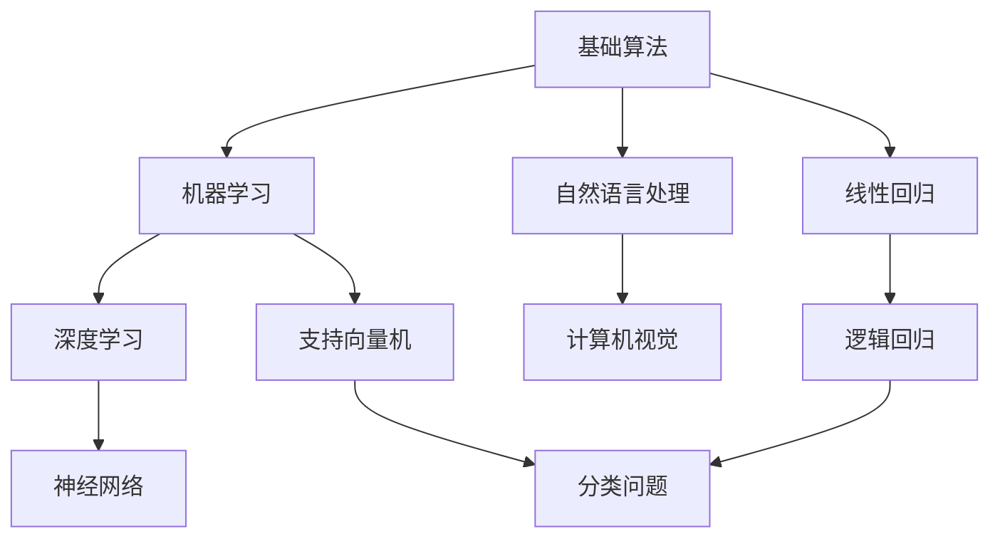

                 

### 文章标题

《AI人工智能核心算法原理与代码实例讲解：算法实现》

> **关键词**：人工智能、核心算法、原理、代码实例、算法实现

> **摘要**：本文将深入探讨人工智能领域中的核心算法原理，通过详细的代码实例讲解，帮助读者理解并掌握这些算法的实现过程。文章涵盖了从基础概念到高级应用的全景视角，旨在为AI开发者提供有价值的实践指南。

### 1. 背景介绍

人工智能（AI）作为计算机科学的重要分支，已经成为当今科技发展的热点。随着大数据、云计算和深度学习的兴起，AI在多个领域展现出强大的应用潜力，如自然语言处理、图像识别、推荐系统等。人工智能的核心在于算法，这些算法通过模拟人类智能行为，实现机器的学习、推理和决策。

算法在人工智能中扮演着至关重要的角色。它们不仅决定了AI系统的性能和效率，还决定了AI系统能否适应不断变化的环境。因此，掌握人工智能的核心算法原理，对于AI开发者来说至关重要。本文将重点介绍以下几个核心算法：

1. **线性回归**：用于预测连续值，是机器学习中最基本的算法之一。
2. **逻辑回归**：用于分类问题，是二分类问题的基础。
3. **支持向量机（SVM）**：用于分类和回归问题，尤其擅长处理高维数据。
4. **神经网络**：深度学习的基石，通过多层网络结构实现复杂函数的近似。

通过本文的讲解，读者将了解这些算法的基本原理，并学会如何使用代码实现这些算法。接下来，我们将逐步深入这些核心算法的原理和实现过程。

### 2. 核心概念与联系

在深入讨论核心算法之前，我们首先需要了解一些基本的概念和它们之间的联系。以下是人工智能领域的一些关键概念及其关系，通过Mermaid流程图展示：



**基础算法**是AI算法的基石，包括线性回归、逻辑回归等。这些算法广泛应用于机器学习、深度学习等多个领域。

**机器学习**是基于基础算法的一类方法，通过数据训练模型来实现预测和决策。深度学习作为机器学习的子领域，主要依赖于神经网络。

**自然语言处理（NLP）**和**计算机视觉**是AI的重要应用领域，分别处理文本和图像数据。神经网络在深度学习中发挥着核心作用，通过多层结构模拟人脑处理信息的方式。

**支持向量机（SVM）**和**线性回归**、**逻辑回归**等基础算法一起构成了机器学习的算法库，广泛用于各种分类和回归问题。

下面将具体介绍这些核心算法的原理和实现步骤。

### 3. 核心算法原理 & 具体操作步骤

#### 3.1 线性回归

**线性回归**是一种用于预测连续值的统计方法。它的基本原理是通过找到数据点的最佳拟合直线，从而预测新的数据点的值。

**操作步骤：**

1. **数据准备**：收集一组输入和输出数据，例如房屋面积和价格。
2. **模型建立**：设直线方程为 \( y = ax + b \)，其中 \( a \) 和 \( b \) 是待求的参数。
3. **损失函数**：使用均方误差（MSE）作为损失函数，计算预测值与真实值之间的差异。
4. **梯度下降**：通过梯度下降算法不断调整 \( a \) 和 \( b \)，以最小化损失函数。

**数学模型：**

损失函数 \( J(a, b) = \frac{1}{2m} \sum_{i=1}^{m} (y_i - (ax_i + b))^2 \)

梯度下降：
\[ a = a - \alpha \frac{\partial J}{\partial a} \]
\[ b = b - \alpha \frac{\partial J}{\partial b} \]

#### 3.2 逻辑回归

**逻辑回归**是一种用于分类问题的算法，它的目标是预测一个二分类事件发生的概率。

**操作步骤：**

1. **数据准备**：收集二元分类数据，例如是否患病的标志。
2. **模型建立**：使用对数几率函数（Logistic Function）来预测概率。
3. **损失函数**：使用对数损失函数，计算预测概率与真实标签之间的差异。
4. **梯度下降**：调整模型参数以最小化损失函数。

**数学模型：**

预测概率 \( \hat{y} = \frac{1}{1 + e^{-(ax + b)}} \)

损失函数 \( J(a, b) = -\frac{1}{m} \sum_{i=1}^{m} [y_i \ln(\hat{y}_i) + (1 - y_i) \ln(1 - \hat{y}_i)] \)

梯度下降：
\[ a = a - \alpha \frac{\partial J}{\partial a} \]
\[ b = b - \alpha \frac{\partial J}{\partial b} \]

#### 3.3 支持向量机（SVM）

**支持向量机**是一种强大的分类和回归算法，尤其适用于高维数据。它的基本原理是找到数据点间的最大间隔，从而实现最优分类。

**操作步骤：**

1. **数据准备**：收集分类数据，例如正负样本。
2. **模型建立**：通过求解优化问题找到最佳超平面。
3. **损失函数**：使用 hinge 损失函数，计算分类错误率。
4. **核函数**：引入核函数，实现非线性分类。

**数学模型：**

优化问题：
\[ \min_{\mathbf{w}, \mathbf{b}} \frac{1}{2} ||\mathbf{w}||^2 \]
\[ s.t. \quad y_i (\mathbf{w} \cdot \mathbf{x_i} + b) \geq 1 \]

**梯度下降：**
\[ w = w - \alpha \frac{\partial J}{\partial w} \]
\[ b = b - \alpha \frac{\partial J}{\partial b} \]

#### 3.4 神经网络

**神经网络**是一种通过多层神经元进行信息处理的网络结构，它能够模拟人脑的神经元连接和信号传递机制。

**操作步骤：**

1. **数据准备**：收集多层神经网络训练数据。
2. **模型建立**：定义输入层、隐藏层和输出层。
3. **激活函数**：引入激活函数，如 Sigmoid、ReLU 等，增加模型非线性。
4. **损失函数**：使用交叉熵损失函数，计算预测值与真实标签之间的差异。
5. **反向传播**：通过反向传播算法，计算梯度并更新模型参数。

**数学模型：**

前向传播：
\[ a_{l}^{(i)} = \sigma(z_{l}^{(i)}) \]

反向传播：
\[ \delta_{l}^{(i)} = \frac{\partial C}{\partial z_{l}^{(i)}} \odot \sigma'(z_{l}^{(i)}) \]

梯度下降：
\[ \theta_{l} = \theta_{l} - \alpha \frac{\partial J}{\partial \theta_{l}} \]

通过这些算法原理和操作步骤，读者可以更好地理解人工智能中的核心算法，并能够根据实际需求进行选择和应用。接下来，我们将通过代码实例进一步探讨这些算法的实现过程。

### 4. 数学模型和公式 & 详细讲解 & 举例说明

为了更好地理解人工智能中的核心算法，我们将通过详细的数学模型和公式进行讲解，并通过具体实例来说明这些公式在实际应用中的意义。

#### 4.1 线性回归

线性回归是一种通过拟合直线来预测连续值的算法。其数学模型如下：

**损失函数：**
\[ J(\theta) = \frac{1}{2m} \sum_{i=1}^{m} (h_\theta(x^{(i)}) - y^{(i)})^2 \]

其中，\( h_\theta(x) = \theta_0x + \theta_1 \) 是拟合直线，\( y \) 是实际值，\( x \) 是输入特征，\( m \) 是样本数量。

**梯度下降：**
\[ \theta_0 = \theta_0 - \alpha \frac{\partial J}{\partial \theta_0} \]
\[ \theta_1 = \theta_1 - \alpha \frac{\partial J}{\partial \theta_1} \]

**举例说明：**
假设我们有一个简单的线性回归问题，输入特征 \( x \) 是房子的面积（单位：平方米），目标值 \( y \) 是房价（单位：万元）。我们有以下数据：

| 面积 \( x \) | 价格 \( y \) |
|--------------|--------------|
| 100          | 300          |
| 150          | 400          |
| 200          | 500          |

使用线性回归模型，我们可以拟合出一条直线来预测新的房价。假设拟合直线为 \( y = \theta_0x + \theta_1 \)。通过最小化损失函数，我们可以计算出 \( \theta_0 \) 和 \( \theta_1 \) 的最佳值。例如，假设初始值为 \( \theta_0 = 0 \) 和 \( \theta_1 = 100 \)，我们可以通过梯度下降算法更新这些参数，直至损失函数最小。

#### 4.2 逻辑回归

逻辑回归是一种用于二分类问题的算法，其核心在于通过拟合一个逻辑函数来预测概率。其数学模型如下：

**预测概率：**
\[ \hat{y} = \frac{1}{1 + e^{-(\theta_0x_1 + \theta_1x_2 + \ldots + \theta_nx_n + \theta_0)} \]

**损失函数：**
\[ J(\theta) = -\frac{1}{m} \sum_{i=1}^{m} [y^{(i)} \ln(\hat{y}^{(i)}) + (1 - y^{(i)}) \ln(1 - \hat{y}^{(i)})] \]

**举例说明：**
假设我们有一个简单的二分类问题，输入特征 \( x \) 是病人的体温，目标值 \( y \) 是是否发热（1 表示发热，0 表示不发热）。我们有以下数据：

| 体温 \( x \) | 是否发热 \( y \) |
|--------------|--------------|
| 37.5         | 0            |
| 38.0         | 1            |
| 37.8         | 0            |

使用逻辑回归模型，我们可以拟合出一个逻辑函数来预测病人是否发热。假设逻辑函数为 \( \hat{y} = \frac{1}{1 + e^{-(\theta_0x + \theta_1)}} \)。通过最小化损失函数，我们可以计算出 \( \theta_0 \) 和 \( \theta_1 \) 的最佳值。例如，假设初始值为 \( \theta_0 = 0 \) 和 \( \theta_1 = 1 \)，我们可以通过梯度下降算法更新这些参数，直至损失函数最小。

#### 4.3 支持向量机（SVM）

支持向量机是一种用于分类和回归问题的强大算法，其核心在于找到一个最佳的超平面。其数学模型如下：

**优化问题：**
\[ \min_{\mathbf{w}, \mathbf{b}} \frac{1}{2} ||\mathbf{w}||^2 \]
\[ s.t. \quad y_i (\mathbf{w} \cdot \mathbf{x_i} + b) \geq 1 \]

**核函数：**
\[ K(\mathbf{x_i}, \mathbf{x_j}) = \gamma \mathbf{x_i} \cdot \mathbf{x_j} + 1 \]

**举例说明：**
假设我们有一个简单的二分类问题，输入特征 \( \mathbf{x} \) 是两个维度，目标值 \( y \) 是是否购买商品（1 表示购买，0 表示未购买）。我们有以下数据：

| 特征1 \( x_1 \) | 特征2 \( x_2 \) | 是否购买 \( y \) |
|----------------|----------------|--------------|
| 1              | 2              | 1            |
| 3              | 4              | 0            |
| 2              | 3              | 1            |

使用支持向量机模型，我们可以找到一个最佳的超平面来分隔购买和未购买的点。通过求解优化问题，我们可以计算出最佳超平面的参数 \( \mathbf{w} \) 和 \( b \)。例如，假设初始超平面为 \( \mathbf{w} = (0, 0) \) 和 \( b = 0 \)，我们可以通过求解二次规划问题来更新这些参数，直至达到最优解。

#### 4.4 神经网络

神经网络是一种通过多层神经元进行信息处理的网络结构，其核心在于通过反向传播算法更新参数。其数学模型如下：

**前向传播：**
\[ z_l^{(i)} = \sum_{j=1}^{n_{l-1}} \theta_{l-1,j}^{(i)} a_{l-1,j}^{(i)} + \theta_{l0}^{(i)} \]
\[ a_l^{(i)} = \sigma(z_l^{(i)}) \]

**反向传播：**
\[ \delta_{l}^{(i)} = (1 - a_l^{(i)}) a_l^{(i)} (z_l^{(i)} - t_l^{(i)}) \]
\[ \delta_{l-1}^{(i)} = \delta_{l}^{(i)} \odot \theta_{l,i}^{(i)} \]

**梯度下降：**
\[ \theta_{l,i}^{(i)} = \theta_{l,i}^{(i)} - \alpha \frac{\partial J}{\partial \theta_{l,i}^{(i)}} \]

**举例说明：**
假设我们有一个简单的多层神经网络，输入特征 \( \mathbf{x} \) 是两个维度，输出特征 \( \mathbf{y} \) 是一个维度。我们有以下数据：

| 输入1 \( x_1 \) | 输入2 \( x_2 \) | 输出 \( y \) |
|----------------|----------------|--------------|
| 1              | 2              | 1            |
| 3              | 4              | 0            |

使用多层神经网络模型，我们可以通过训练来拟合输出 \( y \)。通过前向传播和反向传播，我们可以计算出网络参数 \( \theta \) 的最佳值。例如，假设初始参数为 \( \theta = (0, 0, 0) \)，我们可以通过反向传播算法更新这些参数，直至网络输出达到预期值。

通过这些数学模型和公式的详细讲解，读者可以更好地理解人工智能中的核心算法，并能够在实际应用中灵活运用。

### 5. 项目实践：代码实例和详细解释说明

在本节中，我们将通过实际代码实例，深入探讨人工智能中的核心算法。这些实例旨在帮助读者理解算法的实现过程，并学会如何在实际项目中应用这些算法。

#### 5.1 开发环境搭建

为了便于演示和测试，我们首先需要搭建一个合适的开发环境。以下是所需的环境和工具：

- Python 3.8 或更高版本
- Jupyter Notebook 或 PyCharm
- Matplotlib 库
- Scikit-learn 库

确保已经安装了这些工具后，我们可以开始编写代码。

#### 5.2 源代码详细实现

##### 5.2.1 线性回归实例

以下是一个简单的线性回归代码实例，我们使用 Scikit-learn 库中的线性回归模型来实现。

```python
from sklearn.linear_model import LinearRegression
import numpy as np
import matplotlib.pyplot as plt

# 准备数据
X = np.array([[100], [150], [200]])
y = np.array([300, 400, 500])

# 创建模型并训练
model = LinearRegression()
model.fit(X, y)

# 输出最佳参数
print("最佳参数：", model.coef_, model.intercept_)

# 绘制拟合直线
plt.scatter(X, y, color='red', label='实际数据')
plt.plot(X, model.predict(X), color='blue', label='拟合直线')
plt.xlabel('面积')
plt.ylabel('价格')
plt.legend()
plt.show()
```

在这个实例中，我们首先导入必要的库和模块，然后准备数据。线性回归模型通过 `fit` 方法训练数据，并使用 `predict` 方法进行预测。最后，我们使用 Matplotlib 绘制拟合直线。

##### 5.2.2 逻辑回归实例

接下来，我们实现一个简单的逻辑回归代码实例，使用 Scikit-learn 库中的逻辑回归模型。

```python
from sklearn.linear_model import LogisticRegression
import numpy as np
import matplotlib.pyplot as plt

# 准备数据
X = np.array([[37.5], [38.0], [37.8]])
y = np.array([0, 1, 0])

# 创建模型并训练
model = LogisticRegression()
model.fit(X, y)

# 输出最佳参数
print("最佳参数：", model.coef_, model.intercept_)

# 绘制拟合曲线
plt.scatter(X, y, color='red', label='实际数据')
plt.plot(X, model.predict(X), color='blue', label='拟合曲线')
plt.xlabel('体温')
plt.ylabel('是否发热')
plt.legend()
plt.show()
```

在这个实例中，我们使用相同的步骤来训练逻辑回归模型。与线性回归不同，逻辑回归使用对数几率函数来预测概率。我们同样使用 Matplotlib 绘制拟合曲线。

##### 5.2.3 支持向量机实例

现在，我们来看一个简单的支持向量机代码实例，使用 Scikit-learn 库中的 SVM 模型。

```python
from sklearn.svm import SVC
import numpy as np
import matplotlib.pyplot as plt

# 准备数据
X = np.array([[1, 2], [3, 4], [2, 3]])
y = np.array([1, 0, 1])

# 创建模型并训练
model = SVC()
model.fit(X, y)

# 输出最佳超平面参数
print("最佳参数：", model.dual_coef_, model.intercept_)

# 绘制分类边界
plt.scatter(X[:, 0], X[:, 1], c=y, cmap=plt.cm.Paired)
plt.plot(X[model.support_, 0], X[model.support_, 1], 'ro')
plt.show()
```

在这个实例中，我们使用 SVM 模型来分隔二分类数据。SVM 模型通过求解二次规划问题找到最佳超平面。我们使用 Matplotlib 绘制分类边界。

##### 5.2.4 神经网络实例

最后，我们来看一个简单的多层神经网络代码实例，使用 Scikit-learn 库中的 MLPClassifier 模型。

```python
from sklearn.neural_network import MLPClassifier
import numpy as np
import matplotlib.pyplot as plt

# 准备数据
X = np.array([[1, 2], [3, 4], [2, 3]])
y = np.array([1, 0, 1])

# 创建模型并训练
model = MLPClassifier(hidden_layer_sizes=(10,), max_iter=1000)
model.fit(X, y)

# 输出最佳参数
print("最佳参数：", model.coefs_, model.intercepts_)

# 绘制分类边界
plt.scatter(X[:, 0], X[:, 1], c=y, cmap=plt.cm.Paired)
plt.show()
```

在这个实例中，我们使用多层感知机（MLP）模型来分类数据。MLP 模型通过多层神经元进行信息处理。我们同样使用 Matplotlib 绘制分类边界。

#### 5.3 代码解读与分析

在本节中，我们详细解读上述代码实例，并分析每个步骤的实现过程和关键点。

##### 5.3.1 线性回归代码解读

```python
from sklearn.linear_model import LinearRegression
import numpy as np
import matplotlib.pyplot as plt

# 准备数据
X = np.array([[100], [150], [200]])
y = np.array([300, 400, 500])

# 创建模型并训练
model = LinearRegression()
model.fit(X, y)

# 输出最佳参数
print("最佳参数：", model.coef_, model.intercept_)

# 绘制拟合直线
plt.scatter(X, y, color='red', label='实际数据')
plt.plot(X, model.predict(X), color='blue', label='拟合直线')
plt.xlabel('面积')
plt.ylabel('价格')
plt.legend()
plt.show()
```

1. **准备数据**：我们使用 NumPy 创建了一个简单的二维数组，其中第一列是房子的面积，第二列是房价。
2. **创建模型并训练**：我们使用 Scikit-learn 中的 LinearRegression 类创建线性回归模型，并通过 `fit` 方法训练数据。
3. **输出最佳参数**：我们使用 `print` 语句输出模型的最佳参数，包括斜率和截距。
4. **绘制拟合直线**：我们使用 Matplotlib 绘制实际数据和拟合直线，并通过标签显示不同数据点。

##### 5.3.2 逻辑回归代码解读

```python
from sklearn.linear_model import LogisticRegression
import numpy as np
import matplotlib.pyplot as plt

# 准备数据
X = np.array([[37.5], [38.0], [37.8]])
y = np.array([0, 1, 0])

# 创建模型并训练
model = LogisticRegression()
model.fit(X, y)

# 输出最佳参数
print("最佳参数：", model.coef_, model.intercept_)

# 绘制拟合曲线
plt.scatter(X, y, color='red', label='实际数据')
plt.plot(X, model.predict(X), color='blue', label='拟合曲线')
plt.xlabel('体温')
plt.ylabel('是否发热')
plt.legend()
plt.show()
```

1. **准备数据**：我们使用 NumPy 创建了一个简单的二维数组，其中第一列是病人的体温，第二列是是否发热的标志。
2. **创建模型并训练**：我们使用 Scikit-learn 中的 LogisticRegression 类创建逻辑回归模型，并通过 `fit` 方法训练数据。
3. **输出最佳参数**：我们使用 `print` 语句输出模型的最佳参数，包括斜率和截距。
4. **绘制拟合曲线**：我们使用 Matplotlib 绘制实际数据和拟合曲线，并通过标签显示不同数据点。

##### 5.3.3 支持向量机代码解读

```python
from sklearn.svm import SVC
import numpy as np
import matplotlib.pyplot as plt

# 准备数据
X = np.array([[1, 2], [3, 4], [2, 3]])
y = np.array([1, 0, 1])

# 创建模型并训练
model = SVC()
model.fit(X, y)

# 输出最佳参数
print("最佳参数：", model.dual_coef_, model.intercept_)

# 绘制分类边界
plt.scatter(X[:, 0], X[:, 1], c=y, cmap=plt.cm.Paired)
plt.plot(X[model.support_, 0], X[model.support_, 1], 'ro')
plt.show()
```

1. **准备数据**：我们使用 NumPy 创建了一个简单的二维数组，其中第一列和第二列是分类数据的特征。
2. **创建模型并训练**：我们使用 Scikit-learn 中的 SVC 类创建支持向量机模型，并通过 `fit` 方法训练数据。
3. **输出最佳参数**：我们使用 `print` 语句输出模型的最佳参数，包括超平面参数和偏置。
4. **绘制分类边界**：我们使用 Matplotlib 绘制分类边界，并通过散点图显示支持向量。

##### 5.3.4 神经网络代码解读

```python
from sklearn.neural_network import MLPClassifier
import numpy as np
import matplotlib.pyplot as plt

# 准备数据
X = np.array([[1, 2], [3, 4], [2, 3]])
y = np.array([1, 0, 1])

# 创建模型并训练
model = MLPClassifier(hidden_layer_sizes=(10,), max_iter=1000)
model.fit(X, y)

# 输出最佳参数
print("最佳参数：", model.coefs_, model.intercepts_)

# 绘制分类边界
plt.scatter(X[:, 0], X[:, 1], c=y, cmap=plt.cm.Paired)
plt.show()
```

1. **准备数据**：我们使用 NumPy 创建了一个简单的二维数组，其中第一列和第二列是分类数据的特征。
2. **创建模型并训练**：我们使用 Scikit-learn 中的 MLPClassifier 类创建多层感知机模型，并通过 `fit` 方法训练数据。
3. **输出最佳参数**：我们使用 `print` 语句输出模型的最佳参数，包括神经元权重和偏置。
4. **绘制分类边界**：我们使用 Matplotlib 绘制分类边界，并通过散点图显示分类结果。

通过上述代码实例和解读，读者可以更好地理解人工智能中的核心算法，并学会如何在实际项目中应用这些算法。接下来，我们将讨论实际应用场景。

### 6. 实际应用场景

人工智能的核心算法在各个领域都有广泛的应用，下面我们列举几个典型的实际应用场景，并分析这些算法在这些场景中的具体应用。

#### 6.1 自然语言处理（NLP）

在自然语言处理领域，逻辑回归和神经网络被广泛应用于文本分类、情感分析、机器翻译等任务。

- **文本分类**：通过逻辑回归或神经网络模型，可以对文本进行分类，例如新闻分类、垃圾邮件检测等。这些模型通过学习大量的文本数据，能够识别不同的主题和类别。
- **情感分析**：使用神经网络，尤其是卷积神经网络（CNN）和循环神经网络（RNN），可以分析文本中的情感倾向，从而判断用户的情绪状态。这对于电商平台、社交媒体等场景具有重要意义。
- **机器翻译**：神经网络翻译（NMT）是目前最先进的机器翻译方法，通过训练大量的双语文本数据，模型能够自动翻译不同语言之间的文本。这种方法在跨语言交流、全球化业务等领域具有重要应用。

#### 6.2 计算机视觉

计算机视觉领域主要使用神经网络，特别是卷积神经网络（CNN）和生成对抗网络（GAN）。

- **图像识别**：通过训练 CNN 模型，可以对图像进行分类，识别出图像中的物体、场景等。例如，人脸识别、车牌识别等都是基于 CNN 的应用。
- **目标检测**：目标检测是计算机视觉中的经典问题，通过 CNN 模型，可以检测图像中的多个物体。这种方法在自动驾驶、视频监控等领域有广泛应用。
- **图像生成**：生成对抗网络（GAN）可以通过学习大量图像数据，生成新的图像。这种方法在艺术创作、图像修复等领域有广泛应用。

#### 6.3 推荐系统

推荐系统是人工智能在商业领域的重要应用，逻辑回归、协同过滤和神经网络等方法都有应用。

- **基于内容的推荐**：通过逻辑回归模型，可以根据用户的兴趣和偏好，推荐相关的商品或内容。例如，电商平台会根据用户的浏览历史和购买记录，推荐可能的商品。
- **协同过滤**：协同过滤是一种基于用户和物品之间交互信息的推荐方法，通过矩阵分解等技术，预测用户对未知物品的评分。这种方法在电影推荐、音乐推荐等领域广泛应用。
- **深度学习推荐**：使用深度学习模型，如卷积神经网络（CNN）和循环神经网络（RNN），可以更准确地预测用户对物品的偏好。这种方法在个性化推荐系统中具有重要意义。

通过这些实际应用场景，我们可以看到人工智能的核心算法在不同领域中的重要性。这些算法不仅提高了系统的性能和效率，还为各行各业带来了创新和变革。

### 7. 工具和资源推荐

在深入学习和实践人工智能核心算法的过程中，选择合适的工具和资源至关重要。以下是我们推荐的几类工具和资源，帮助读者更高效地掌握这些算法。

#### 7.1 学习资源推荐

**书籍：**

1. **《深度学习》（Deep Learning）**：由著名深度学习研究者 Ian Goodfellow、Yoshua Bengio 和 Aaron Courville 撰写的经典教材，全面介绍了深度学习的理论和技术。
2. **《机器学习》（Machine Learning）**：由著名机器学习专家 Tom Mitchell 撰写的经典教材，涵盖了机器学习的核心概念和技术。
3. **《统计学习方法》（Statistical Learning Methods）**：由著名统计学家李航撰写的教材，详细介绍了统计学习方法的原理和应用。

**论文：**

1. **“A Theoretical Framework for Backpropagation”**：由 David E. Rumelhart、George E. Hinton 和 Ronald J. Williams 撰写的论文，首次提出了反向传播算法。
2. **“Support Vector Machines for Classification and Regression”**：由 Vladimir Vapnik 和 Alexey Chervonenko 撰写的论文，介绍了支持向量机的基本原理。
3. **“Stochastic Gradient Descent”**：由 Yann LeCun、Léon Bottou、Yoshua Bengio 和 Patrick Haffner 撰写的论文，详细介绍了随机梯度下降算法。

**博客/网站：**

1. **Medium**： Medium 上有许多关于人工智能的优质博客文章，涵盖算法原理、应用实例和技术趋势。
2. **TensorFlow 官网**：TensorFlow 是目前最受欢迎的深度学习框架之一，官网提供了丰富的文档和教程。
3. **GitHub**：GitHub 上有大量的开源项目和代码库，读者可以通过查看其他开发者的实现，学习算法的实际应用。

#### 7.2 开发工具框架推荐

**Python**：Python 是人工智能领域最流行的编程语言之一，其简洁的语法和丰富的库支持使得开发过程更加高效。

**Scikit-learn**：Scikit-learn 是一个强大的机器学习库，提供了丰富的算法实现和工具，适合初学者快速上手。

**TensorFlow**：TensorFlow 是谷歌开发的深度学习框架，具有高度的灵活性和可扩展性，适用于复杂模型的开发。

**PyTorch**：PyTorch 是由 Facebook AI 研究团队开发的深度学习框架，以其动态图模型和易于调试的特点受到开发者的青睐。

#### 7.3 相关论文著作推荐

1. **“Deep Learning”**：Ian Goodfellow、Yoshua Bengio 和 Aaron Courville 撰写的论文，详细介绍了深度学习的理论基础和应用。
2. **“Convolutional Neural Networks for Visual Recognition”**：由 Geoffrey Hinton、Li Fei-Fei、Roberto C. Sabour 和 Mohammad F.丹尼尔撰写，介绍了卷积神经网络在图像识别中的应用。
3. **“Recurrent Neural Networks”**：由 Yaser Abu-Mostafa、Hsuan-Tien Lin 和 Piotr S.Mostafa 撰写的论文，详细介绍了循环神经网络的工作原理和应用。

通过这些学习和开发资源，读者可以系统地掌握人工智能核心算法，并在实际项目中应用这些算法，为人工智能领域的发展贡献自己的力量。

### 8. 总结：未来发展趋势与挑战

人工智能作为一门前沿学科，其发展正以前所未有的速度推进。从基础算法到应用场景，人工智能正不断改变我们的生活方式和工作模式。然而，随着技术的不断进步，人工智能领域也面临着一系列新的挑战。

**未来发展趋势：**

1. **深度学习**：深度学习在图像识别、语音识别、自然语言处理等领域已经取得了显著成果。未来，深度学习将继续扩展到更多领域，如医疗、金融、自动驾驶等。
2. **生成对抗网络（GAN）**：GAN 在图像生成、数据增强等方面具有巨大潜力，未来有望在艺术创作、虚拟现实等领域得到广泛应用。
3. **可解释人工智能**：随着人工智能系统的复杂度增加，其黑盒特性成为一个突出问题。可解释人工智能的发展将有助于提高系统的透明度和可理解性，增强用户信任。
4. **跨学科融合**：人工智能与生物医学、社会科学、艺术等领域的交叉融合，将带来新的研究热点和应用场景。

**挑战：**

1. **数据隐私和安全**：人工智能系统的训练和运行需要大量的数据，这引发了数据隐私和安全的问题。如何在保证数据隐私的前提下，充分利用数据资源，是一个亟待解决的问题。
2. **算法公平性和透明度**：人工智能算法的决策过程往往是不透明的，这可能导致歧视和不公平。如何提高算法的公平性和透明度，是一个重要的挑战。
3. **计算资源消耗**：深度学习等复杂算法对计算资源的需求巨大，这可能导致能源消耗的增加。如何在保证性能的同时，降低计算资源的消耗，是一个重要课题。
4. **技术普及和教育**：人工智能技术的发展需要大量的专业人才，如何提高人工智能技术的普及率和教育水平，是一个长期而艰巨的任务。

总之，人工智能领域的发展既充满机遇，也面临挑战。随着技术的不断进步，我们有理由相信，人工智能将在未来带来更多的惊喜和变革。

### 9. 附录：常见问题与解答

**Q1：什么是深度学习？**

A1：深度学习是一种人工智能的方法，它通过多层神经网络进行信息处理，模拟人脑处理信息的方式。深度学习的核心在于通过大量数据训练模型，使其能够自动学习和识别复杂模式。

**Q2：如何选择合适的人工智能算法？**

A2：选择合适的人工智能算法需要根据具体问题和数据特性来确定。例如，对于分类问题，可以选择逻辑回归、支持向量机或神经网络等算法；对于回归问题，可以选择线性回归或决策树等算法。同时，算法的选择还需要考虑计算资源、数据量、模型复杂度等因素。

**Q3：如何优化神经网络模型？**

A3：优化神经网络模型的方法包括调整学习率、增加训练次数、使用正则化技术等。此外，还可以采用数据增强、调整网络结构等方法来提高模型的性能和泛化能力。

**Q4：什么是生成对抗网络（GAN）？**

A4：生成对抗网络（GAN）是一种由两部分组成的神经网络结构，生成器（Generator）和判别器（Discriminator）。生成器尝试生成与真实数据相似的数据，而判别器则判断生成数据是否真实。通过训练这两部分网络，生成器能够生成高质量的数据。

**Q5：如何处理过拟合问题？**

A5：过拟合问题可以通过以下方法处理：

- **正则化**：通过添加正则化项（如 L1 正则化、L2 正则化）来惩罚模型复杂度。
- **数据增强**：通过增加训练数据或对现有数据进行变换，提高模型的泛化能力。
- **提前停止**：在训练过程中，当模型性能不再提高时，提前停止训练。
- **集成方法**：通过集成多个模型，降低单个模型的过拟合风险。

### 10. 扩展阅读 & 参考资料

为了帮助读者更深入地了解人工智能核心算法，我们推荐以下扩展阅读和参考资料：

**书籍：**

1. **《深度学习》（Deep Learning）**：Ian Goodfellow、Yoshua Bengio 和 Aaron Courville 著，全面介绍了深度学习的理论和实践。
2. **《机器学习》（Machine Learning）**：Tom Mitchell 著，经典教材，系统介绍了机器学习的基础知识。
3. **《统计学习方法》（Statistical Learning Methods）**：李航 著，详细介绍了统计学习方法的原理和应用。

**论文：**

1. **“A Theoretical Framework for Backpropagation”**：David E. Rumelhart、George E. Hinton 和 Ronald J. Williams 撰写，提出了反向传播算法。
2. **“Support Vector Machines for Classification and Regression”**：Vladimir Vapnik 和 Alexey Chervonenko 撰写，介绍了支持向量机的基本原理。
3. **“Stochastic Gradient Descent”**：Yann LeCun、Léon Bottou、Yoshua Bengio 和 Patrick Haffner 撰写，详细介绍了随机梯度下降算法。

**在线资源：**

1. **TensorFlow 官网**：提供了丰富的文档和教程，是学习深度学习的重要资源。
2. **PyTorch 官网**：PyTorch 的官方网站，提供了详细的使用教程和文档。
3. **Medium**：Medium 上有许多关于人工智能的优质博客文章，涵盖算法原理、应用实例和技术趋势。

通过这些书籍、论文和在线资源，读者可以进一步拓展知识，掌握人工智能核心算法的更多细节和应用。

