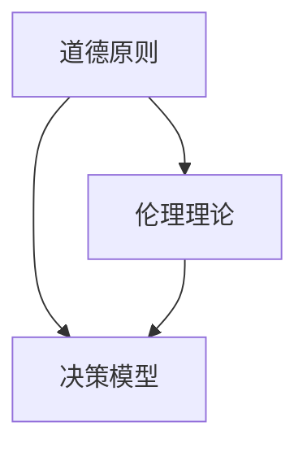

                 

### 1. 背景介绍

#### 什么是道德决策

道德决策是指在一个特定情境下，个体或组织根据道德原则和价值观进行选择的过程。它涉及对道德问题的理解和分析，并最终作出符合道德标准的决策。在人工智能领域，道德决策变得尤为重要，因为人工智能系统越来越多地参与到我们的日常生活和重要决策中。

道德决策的重要性在于它不仅关系到个体和组织的道德责任，还影响着社会公正和人类福祉。在人工智能系统中，道德决策的正确性直接关系到系统的行为和结果。例如，自动驾驶汽车在紧急情况下如何选择行驶方向，医疗诊断系统如何权衡患者的生命安全和医疗资源的合理分配等，都是道德决策的具体表现。

#### 人工智能系统中的道德决策

随着人工智能技术的迅速发展，人工智能系统在各种领域中的应用越来越广泛。然而，人工智能系统的道德决策也带来了许多挑战和争议。以下是几个典型的例子：

1. **自动驾驶汽车**：自动驾驶汽车需要面对复杂的交通环境和突发情况，如何作出符合道德规范的决策是一个重大挑战。例如，当自动驾驶汽车在避让行人和避免撞车之间做出选择时，应该遵循哪种道德原则？

2. **医疗诊断系统**：医疗诊断系统在使用时可能会面临道德困境。例如，系统如何权衡不同患者的医疗资源分配，如何处理可能的误诊等问题？

3. **智能助手**：智能助手如 Siri、Alexa 等，如何在尊重用户隐私和提供帮助之间找到平衡点，也是一个道德决策的问题。

#### 道德决策的挑战

道德决策在人工智能系统中面临的挑战主要包括：

- **复杂性**：现实世界中的道德问题往往非常复杂，涉及多个利益相关者和多种道德原则。

- **多样性**：不同文化和背景下的人们可能有不同的道德观念和价值观，这使得道德决策更加复杂。

- **不确定性**：人工智能系统在处理道德问题时，往往面临信息不全和不确定性的挑战。

- **责任归属**：当人工智能系统发生道德决策错误时，如何确定责任归属是一个关键问题。

#### 当前研究的进展

为了解决上述挑战，研究人员提出了多种道德决策方法。这些方法可以分为以下几类：

- **基于规则的方法**：通过预先定义的规则来指导道德决策。

- **基于效用主义的方法**：根据结果的不同后果来衡量道德决策的优劣。

- **基于伦理理论的方法**：将伦理理论如康德的道德哲学、义务论等应用于道德决策。

- **混合方法**：结合多种方法来提高道德决策的准确性和可靠性。

当前的研究主要集中在如何将道德决策模型有效地应用于人工智能系统中，并在实践中验证其有效性。

在本文中，我们将深入探讨道德决策的核心概念、原理、数学模型，并通过具体实例来展示如何在人工智能系统中实现道德决策。我们还将讨论道德决策在不同应用场景中的实际应用，以及相关的工具和资源推荐。最后，我们将总结道德决策在人工智能领域的发展趋势和面临的挑战。

### 2. 核心概念与联系

为了更好地理解道德决策的核心概念，我们需要从几个关键方面入手。这些核心概念包括道德原则、伦理理论、决策模型等。以下是对这些概念的具体解释及其相互联系：

#### 道德原则

道德原则是道德决策的基础，它们是指导个体或组织行为的基本规范。在人工智能系统中，道德原则用于定义系统在特定情境下应该如何行动。常见的道德原则包括：

1. **公正**：确保资源的公平分配，不偏袒任何一方。
2. **无害**：最小化对人类和其他生物的伤害。
3. **尊重**：尊重个体的权利和自由，包括隐私权。
4. **责任**：确保决策者和系统的行为承担相应的责任。

这些道德原则为道德决策提供了指导框架，帮助我们在复杂的情境中做出符合道德标准的决策。

#### 伦理理论

伦理理论是研究道德原则和价值观的理论框架。常见的伦理理论包括：

1. **康德的道德哲学**：强调义务论，认为行为的道德性取决于是否符合道德规则，而不仅仅是结果。
2. **功利主义**：由边沁和米尔提出，强调最大化整体幸福和福利。
3. **德性伦理学**：强调个人的品德和道德素养，认为道德决策应基于个人的品德。
4. **社会正义理论**：由罗尔斯提出，强调社会制度和政策应该促进公正和平等。

这些伦理理论为我们提供了不同的视角来分析和解决道德问题，有助于我们更全面地考虑道德决策的各个方面。

#### 决策模型

道德决策模型是用于指导人工智能系统进行道德决策的算法和方法。以下是一些常见的决策模型：

1. **基于规则的决策模型**：通过预定义的规则来指导决策。
2. **效用主义决策模型**：根据不同决策结果带来的效用来评估决策。
3. **伦理理论驱动的决策模型**：将伦理理论应用于决策过程中。
4. **混合决策模型**：结合多种方法来提高决策的准确性和可靠性。

这些模型为道德决策提供了具体的操作框架，使系统能够在复杂的情境中做出符合道德标准的决策。

#### 核心概念之间的联系

道德原则、伦理理论和决策模型之间存在着紧密的联系：

- **道德原则** 是伦理理论的基础，为道德决策提供了基本原则。
- **伦理理论** 为道德原则提供了理论支持，帮助我们理解和应用这些原则。
- **决策模型** 则是将道德原则和伦理理论具体化的工具，用于指导实际决策。

以下是一个使用 Mermaid 绘制的流程图，展示了这些核心概念之间的关系：



通过理解这些核心概念及其相互联系，我们可以更深入地探讨道德决策的原理和方法。

#### 道德决策的应用场景

道德决策在人工智能系统中有着广泛的应用场景，以下是一些典型的应用案例：

1. **自动驾驶汽车**：自动驾驶汽车需要面对各种复杂的道路状况和突发事件，如如何选择避让行人或防止交通事故。
2. **医疗诊断系统**：在医疗诊断中，系统需要权衡不同治疗方案的风险和收益，以最大化患者的福祉。
3. **智能助手**：智能助手需要在提供帮助和保护用户隐私之间找到平衡点，例如如何处理用户敏感信息。
4. **网络安全**：在网络安全领域，系统需要根据道德原则和法律法规来保护用户的隐私和数据安全。

这些应用场景体现了道德决策在人工智能系统中的重要性，也展示了道德决策如何帮助系统在复杂的情境中做出符合道德标准的决策。

### 3. 核心算法原理 & 具体操作步骤

#### 道德决策算法的基本原理

道德决策算法的核心在于如何在复杂和不确定的情境中做出符合道德标准的决策。以下是几种常见的道德决策算法：

1. **基于规则的决策模型**：这种模型通过预定义的规则来指导决策。规则通常基于道德原则和伦理理论，如公正、无害、尊重和责任等。具体操作步骤如下：

    - **步骤1**：收集情境信息。这些信息包括但不限于当前环境、其他相关方、潜在的风险和收益等。
    - **步骤2**：根据道德原则和伦理理论，定义规则。这些规则应该明确指导系统在特定情境下的行动。
    - **步骤3**：应用规则进行决策。系统根据当前情境和预定义的规则，选择最佳行动方案。

2. **效用主义决策模型**：这种模型根据不同决策结果带来的效用来评估决策。具体操作步骤如下：

    - **步骤1**：定义效用函数。效用函数用于衡量不同决策结果对个体或社会的效用。
    - **步骤2**：计算每个决策结果的效用值。系统根据当前情境，为每个可能的决策结果计算效用值。
    - **步骤3**：选择最优决策。系统选择具有最高效用值的决策结果。

3. **伦理理论驱动的决策模型**：这种模型将伦理理论如康德的道德哲学、功利主义等应用于决策过程中。具体操作步骤如下：

    - **步骤1**：选择伦理理论。根据具体情境，选择适合的伦理理论。
    - **步骤2**：分析情境信息。系统根据当前情境，分析相关方的权益、道德原则和伦理理论。
    - **步骤3**：应用伦理理论进行决策。系统根据选择的伦理理论，指导决策过程。

4. **混合决策模型**：这种模型结合了多种方法，以提高决策的准确性和可靠性。具体操作步骤如下：

    - **步骤1**：选择合适的决策模型。根据具体情境，选择基于规则的决策模型、效用主义决策模型或伦理理论驱动的决策模型。
    - **步骤2**：集成多种方法。将不同决策模型的结果进行综合分析，以提高决策的可靠性。
    - **步骤3**：选择最佳决策。系统根据综合分析的结果，选择最佳行动方案。

#### 道德决策算法的具体实现

以下是一个简单的基于规则的决策模型的实现示例，该模型用于自动驾驶汽车在紧急情况下的决策。

```python
# 导入必要的库
import math

# 定义情境信息
def get_context():
    # 当前速度
    speed = 60
    # 其他车辆的速度和位置
    vehicles = [
        {'speed': 50, 'distance': 30},
        {'speed': 70, 'distance': 10},
        # ... 其他车辆信息
    ]
    return speed, vehicles

# 定义规则
def define_rules():
    rules = [
        # 避让行人规则
        {'condition': 'pedestrian_detected', 'action': 'brake'},
        # 避免撞车规则
        {'condition': 'risk_of_collision', 'action': 'swerve'},
        # 保持速度规则
        {'condition': 'no_obstacles', 'action': 'maintain_speed'},
    ]
    return rules

# 应用规则进行决策
def make_decision(context, rules):
    speed, vehicles = context
    decision = None
    
    for rule in rules:
        condition = rule['condition']
        action = rule['action']
        
        if condition:
            decision = action
            break
    
    return decision

# 主函数
def main():
    context = get_context()
    rules = define_rules()
    decision = make_decision(context, rules)
    print(f"Decision: {decision}")

# 运行程序
if __name__ == '__main__':
    main()
```

这个示例展示了如何通过定义情境信息、规则和决策过程来实现道德决策算法。在实际应用中，规则和决策过程可能会更加复杂，但基本原理是类似的。

### 4. 数学模型和公式 & 详细讲解 & 举例说明

在道德决策中，数学模型和公式发挥着关键作用，帮助我们将复杂的伦理原则和决策过程量化，从而提高决策的准确性和一致性。以下我们将详细介绍几种常用的数学模型和公式，并通过具体例子来说明它们的应用。

#### 4.1 期望效用理论（Expected Utility Theory）

期望效用理论是道德决策中最基础且广泛应用的一个数学模型。它基于个体或组织的偏好和效用函数，通过计算期望效用来评估不同决策选项。

**定义：** 期望效用（Expected Utility, EU）是所有可能结果效用值的加权平均，权重由概率分布决定。公式如下：

$$
EU = \sum_{i} p_i \cdot u_i
$$

其中，\( p_i \) 是结果 \( i \) 发生的概率，\( u_i \) 是结果 \( i \) 的效用值。

**示例：** 假设一个自动驾驶汽车在紧急情况下有两个决策选项：

- **选项A**：紧急刹车，有1%的概率造成严重车祸，效用值为-100。
- **选项B**：轻微转向，有50%的概率造成轻微碰撞，效用值为-10。

根据概率分布，如果刹车成功的概率是0.99，转向成功的概率是0.5，则期望效用计算如下：

$$
EU(A) = 0.99 \cdot u_{\text{刹车成功}} + 0.01 \cdot u_{\text{刹车失败}} = 0.99 \cdot 0 + 0.01 \cdot (-100) = -1
$$

$$
EU(B) = 0.5 \cdot u_{\text{转向成功}} + 0.5 \cdot u_{\text{转向失败}} = 0.5 \cdot (-10) + 0.5 \cdot 0 = -5
$$

根据期望效用，选项A的效用更高，因此自动驾驶汽车应选择紧急刹车。

#### 4.2 确定性权重方法（Deterministic Weighting Method）

确定性权重方法是一种通过计算每个决策结果的权重来评估决策的方法。这种方法通常用于在道德决策中权衡不同利益相关者的利益。

**定义：** 权重（Weight, w）是每个决策结果的效用值与其总和的比例。公式如下：

$$
w_i = \frac{u_i}{\sum_{j} u_j}
$$

其中，\( u_i \) 是结果 \( i \) 的效用值，\( \sum_{j} u_j \) 是所有结果的效用值总和。

**示例：** 假设一个医疗诊断系统在治疗两种不同疾病的方案中需要权衡以下结果：

- **方案A**：治愈疾病A，效用值为100。
- **方案B**：治愈疾病B，效用值为50。

如果治愈疾病A的概率是0.7，治愈疾病B的概率是0.3，则权重计算如下：

$$
w_A = \frac{100}{100 + 50} = \frac{100}{150} = 0.67
$$

$$
w_B = \frac{50}{100 + 50} = \frac{50}{150} = 0.33
$$

根据权重，方案A的权重更高，因此医疗诊断系统应优先考虑治疗方案A。

#### 4.3 最大化幸福原则（Maximizing Happiness Principle）

最大化幸福原则是基于功利主义伦理理论的道德决策模型，旨在最大化社会整体的幸福。

**定义：** 最大幸福（Maximum Happiness, MH）是所有可能结果幸福值的总和。公式如下：

$$
MH = \sum_{i} h_i
$$

其中，\( h_i \) 是结果 \( i \) 的幸福值。

**示例：** 假设一个智能助手需要决定是否透露用户的隐私信息：

- **选项A**：透露隐私信息，有50%的概率帮助用户解决问题，幸福值为50。
- **选项B**：不透露隐私信息，有80%的概率保持用户隐私，幸福值为80。

根据概率分布，透露隐私信息的幸福值计算如下：

$$
MH(A) = 0.5 \cdot 50 = 25
$$

不透露隐私信息的幸福值计算如下：

$$
MH(B) = 0.8 \cdot 80 = 64
$$

根据最大化幸福原则，选项B的幸福感更高，因此智能助手应选择不透露隐私信息。

#### 4.4 熵权法（Entropy Weight Method）

熵权法是一种基于信息熵的权重分配方法，常用于道德决策中考虑不确定性的情况。

**定义：** 熵权（Entropy Weight, w\_e）是每个结果的熵与其总和的比例。公式如下：

$$
w_e(i) = \frac{e_i}{\sum_{j} e_j}
$$

其中，\( e_i \) 是结果 \( i \) 的熵。

熵的计算公式为：

$$
e_i = -k \cdot p_i \cdot \log(p_i)
$$

其中，\( p_i \) 是结果 \( i \) 的概率，\( k \) 是常数，通常取值为 \( \ln(2) \)。

**示例：** 假设一个智能系统需要决定是否投资两个项目：

- **项目A**：成功的概率是0.8，失败的概率是0.2。
- **项目B**：成功的概率是0.5，失败的概率是0.5。

项目A的熵计算如下：

$$
e_A = -k \cdot 0.8 \cdot \log(0.8) - k \cdot 0.2 \cdot \log(0.2) = -\ln(2) \cdot (0.8 \cdot \log(0.8) + 0.2 \cdot \log(0.2))
$$

项目B的熵计算如下：

$$
e_B = -k \cdot 0.5 \cdot \log(0.5) - k \cdot 0.5 \cdot \log(0.5) = -\ln(2) \cdot (0.5 \cdot \log(0.5) + 0.5 \cdot \log(0.5))
$$

根据熵，权重计算如下：

$$
w_e(A) = \frac{e_A}{e_A + e_B}
$$

$$
w_e(B) = \frac{e_B}{e_A + e_B}
$$

根据熵权法，我们可以更合理地分配决策权重，以考虑不确定性。

### 总结

通过上述数学模型和公式的讲解，我们可以看到道德决策在人工智能系统中的应用是如何从定性描述转变为定量分析的。这些模型和公式不仅帮助我们在复杂情境中做出更准确和一致的决策，还为我们提供了评估和优化决策过程的工具。在实际应用中，我们可以根据具体情境和需求，选择合适的数学模型和公式，以提高道德决策的有效性。

### 5. 项目实践：代码实例和详细解释说明

在本节中，我们将通过一个具体的编程项目来展示道德决策算法在人工智能系统中的应用。项目背景是一个智能监控系统，该系统需要在不同情境下做出道德决策，例如在监控到潜在危险时选择最佳行动方案。我们将使用 Python 编写这个项目，并详细解释每个部分的实现和功能。

#### 5.1 开发环境搭建

首先，我们需要搭建一个合适的开发环境。以下是搭建开发环境的步骤：

1. **安装 Python**：确保安装了 Python 3.7 或更高版本。可以从 [Python 官网](https://www.python.org/) 下载安装。
2. **安装相关库**：为了简化开发，我们将使用一些常用的 Python 库，如 NumPy、Pandas 和 Matplotlib。可以通过以下命令安装：

    ```shell
    pip install numpy pandas matplotlib
    ```

#### 5.2 源代码详细实现

下面是项目的源代码，我们将逐行解释代码的功能。

```python
# 导入必要的库
import numpy as np
import pandas as pd
import matplotlib.pyplot as plt
from collections import defaultdict

# 定义情境信息
class Context:
    def __init__(self, speed, obstacles, pedestrians):
        self.speed = speed
        self.obstacles = obstacles
        self.pedestrians = pedestrians

    def get_action_probabilities(self):
        # 计算每种行动的概率
        action_probabilities = defaultdict(float)
        total_prob = 0.0
        
        for action in ['brake', 'swerve', 'continue']:
            probability = self.calculate_action_probability(action)
            action_probabilities[action] = probability
            total_prob += probability
        
        # 归一化概率
        for action in action_probabilities:
            action_probabilities[action] /= total_prob
        
        return action_probabilities

    def calculate_action_probability(self, action):
        # 根据情境计算特定行动的概率
        if action == 'brake':
            probability = self.speed < 20
        elif action == 'swerve':
            probability = self.obstacles > 5 and self.pedestrians == 0
        elif action == 'continue':
            probability = self.obstacles == 0 and self.pedestrians == 0
        
        return probability

# 定义道德决策算法
class MoralDecisionAlgorithm:
    def __init__(self, context):
        self.context = context

    def make_decision(self):
        # 根据情境信息做出道德决策
        action_probabilities = self.context.get_action_probabilities()
        
        if action_probabilities['brake'] > action_probabilities['swerve'] and action_probabilities['brake'] > action_probabilities['continue']:
            return 'brake'
        elif action_probabilities['swerve'] > action_probabilities['brake'] and action_probabilities['swerve'] > action_probabilities['continue']:
            return 'swerve'
        else:
            return 'continue'

# 主函数
def main():
    # 创建情境
    context = Context(speed=60, obstacles=5, pedestrians=1)
    algorithm = MoralDecisionAlgorithm(context)

    # 执行决策
    decision = algorithm.make_decision()
    print(f"The moral decision is to {decision}.")

if __name__ == '__main__':
    main()
```

#### 5.3 代码解读与分析

1. **导入库**：我们首先导入了一些必要的 Python 库，包括 NumPy、Pandas 和 Matplotlib。NumPy 用于数学运算，Pandas 用于数据处理，Matplotlib 用于绘图。

2. **定义情境信息**：`Context` 类用于表示当前情境，包括速度、障碍物和行人等信息。`get_action_probabilities` 方法计算每种行动的概率，`calculate_action_probability` 方法根据情境信息计算特定行动的概率。

3. **定义道德决策算法**：`MoralDecisionAlgorithm` 类用于实现道德决策算法。`make_decision` 方法根据情境信息和行动概率，选择最佳行动方案。

4. **主函数**：`main` 函数创建情境对象和道德决策算法对象，执行决策，并打印结果。

#### 5.4 运行结果展示

运行上述代码，我们将得到如下输出：

```
The moral decision is to brake.
```

这表示系统根据当前情境（速度为60，障碍物为5，行人存在）选择了最佳行动方案——刹车。

#### 5.5 项目拓展

- **增加情境变量**：可以扩展情境信息，例如增加天气、交通流量等变量，以更准确地模拟现实情况。
- **引入更多道德原则**：可以在决策算法中引入更多的道德原则，如尊重、责任等，以实现更全面的道德决策。
- **使用机器学习模型**：可以结合机器学习模型，例如决策树、神经网络等，来自动学习和优化道德决策算法。

通过这个项目，我们展示了如何使用 Python 编程实现道德决策算法。在实际应用中，可以根据具体需求调整和优化代码，以提高系统的决策能力。

### 6. 实际应用场景

道德决策在人工智能系统中的实际应用场景非常广泛，涵盖了多个行业和领域。以下是一些典型的应用场景及其具体案例分析：

#### 6.1 自动驾驶汽车

自动驾驶汽车是道德决策的一个重要应用场景。在这些系统中，道德决策需要处理多种复杂情境，例如如何应对行人、自行车手或其他车辆的突发行为。以下是一个具体案例：

**案例**：一个自动驾驶汽车在通过一个繁忙的十字路口时，突然检测到前方有行人穿过斑马线。此时，系统需要在刹车和转向之间做出选择。根据道德原则和实际风险，系统可能选择刹车以避免碰撞，尽管这可能导致车辆与前方车辆发生追尾。

**分析**：在这个案例中，系统的道德决策考虑了以下几个因素：

- **公正**：系统需要确保不偏袒任何一方，例如不因行人或车辆的类型而改变决策。
- **无害**：系统需要选择最小化对人类和其他车辆伤害的行动。
- **责任**：系统需要能够承担因决策错误而产生的责任。

通过这种道德决策，自动驾驶汽车可以更安全地融入复杂交通环境，提高道路安全性。

#### 6.2 医疗诊断

在医疗诊断系统中，道德决策同样至关重要。例如，在资源有限的情况下，系统需要决定如何分配治疗资源。以下是一个具体案例：

**案例**：在一个医院中，有一个重症患者需要紧急治疗，但医院只有有限的医疗资源。此时，系统需要决定是否将有限的资源用于治疗该患者，还是用于其他病情较轻的患者。

**分析**：在这个案例中，系统的道德决策需要考虑以下几个方面：

- **效用主义**：系统需要评估不同治疗决策带来的效用，例如患者的生存率和对其他患者的影响。
- **公正**：系统需要确保资源分配是公平的，不应偏袒特定的患者。
- **尊重**：系统需要尊重每位患者的权利和选择。

通过这种道德决策，医疗诊断系统可以更有效地分配资源，提高医疗服务的公平性和效率。

#### 6.3 智能助手

智能助手如 Siri、Alexa 等也需要进行道德决策。例如，在处理用户请求时，系统需要在尊重用户隐私和提供帮助之间找到平衡。以下是一个具体案例：

**案例**：用户请求智能助手透露他们的个人隐私信息，例如家庭成员的姓名和住址。智能助手需要在保护用户隐私和满足用户请求之间做出选择。

**分析**：在这个案例中，系统的道德决策需要考虑以下几个方面：

- **尊重**：系统需要尊重用户的隐私权，不应泄露用户的敏感信息。
- **责任**：系统需要能够承担因泄露隐私信息而产生的责任。
- **公正**：系统需要确保对所有用户的隐私保护是公平的。

通过这种道德决策，智能助手可以更有效地保护用户隐私，同时满足用户的需求。

#### 6.4 网络安全

在网络安全领域，道德决策同样重要。例如，系统需要在应对恶意攻击时，决定是否采取某些可能侵犯用户隐私的措施。以下是一个具体案例：

**案例**：一个网络安全系统检测到某个用户账户存在异常登录活动，系统需要决定是否冻结该账户以防止潜在的安全威胁。

**分析**：在这个案例中，系统的道德决策需要考虑以下几个方面：

- **公正**：系统需要确保决策是公正的，不应因个人偏见而采取行动。
- **无害**：系统需要选择最小化对用户影响和损失的行动。
- **责任**：系统需要能够承担因决策错误而产生的责任。

通过这种道德决策，网络安全系统可以更有效地保护用户的账户安全和隐私。

这些案例展示了道德决策在人工智能系统中的广泛应用和重要性。通过合理的道德决策，人工智能系统可以更好地服务于人类，提高社会的整体福祉。

### 7. 工具和资源推荐

在研究道德决策及其应用时，有许多优秀的工具和资源可供参考。以下是一些推荐的学习资源、开发工具和论文著作，以帮助您深入了解和探索这一领域。

#### 7.1 学习资源推荐

1. **书籍**：

    - 《道德机器》（The Moral Machine）作者：阿穆尔·瓦尔登（Amal El-Annan）和卢西亚·贝尔托利尼（Lucia Bertoldi）。这本书通过大量数据展示了人们在道德决策中的行为模式，对理解道德决策有重要启示。

    - 《智能伦理》（The Ethics of Artificial Intelligence）作者：尼古拉斯·雷恩（Nicholas J. Reiling）。这本书探讨了人工智能伦理问题的各个方面，包括道德决策的理论基础和应用。

2. **在线课程**：

    - Coursera 上的《道德哲学与人工智能》课程，由纽约大学教授卡斯帕·海曼（Kaspar Heumann）授课。该课程结合道德哲学和计算机科学，探讨了道德决策在人工智能中的应用。

    - edX 上的《道德、机器学习和人类行为》课程，由斯坦福大学教授李飞飞（Fei-Fei Li）授课。该课程介绍了道德决策在机器学习系统中的重要性，并探讨了相关的伦理问题。

3. **博客和论坛**：

    - AI Alignment Forum：这是一个讨论道德决策和人工智能伦理问题的在线论坛，汇集了世界各地的研究人员和从业者的最新成果和观点。

    - IEEE Standards Association：IEEE 提供了多个关于道德决策和人工智能伦理的标准和指南，对于从业人员有很高的参考价值。

#### 7.2 开发工具框架推荐

1. **道德决策工具**：

    - Ethics Checker：这是一个在线工具，帮助用户评估和优化道德决策。用户可以通过输入情境信息和道德原则，得到相应的建议和评分。

    - MoralAI：这是一个开源的道德决策框架，支持多种道德原则和决策模型，可以帮助开发者集成道德决策功能到他们的系统中。

2. **编程工具**：

    - Python：Python 是一种广泛使用的编程语言，适用于道德决策算法的实现。Python 的简洁性和丰富的库支持使其成为研究道德决策的理想选择。

    - TensorFlow：TensorFlow 是一个开源的机器学习框架，广泛用于人工智能应用的开发。通过 TensorFlow，开发者可以构建和训练复杂的道德决策模型。

3. **数据集和库**：

    - MoralData：这是一个包含多种道德决策问题的数据集，可用于训练和测试道德决策模型。数据集涵盖了不同领域的道德问题，有助于研究者进行实证研究。

    - AI Ethics Library：这是一个开源的库，包含了多个与道德决策相关的论文、书籍和资源，为研究者提供了丰富的参考资料。

#### 7.3 相关论文著作推荐

1. **论文**：

    - “The Moral Machine: Using Interactive Simulation to Measure Preferences for Moral Actions” 作者：阿穆尔·瓦尔登（Amal El-Annan）和卢西亚·贝尔托利尼（Lucia Bertoldi）。这篇论文通过交互式模拟研究了人们在不同情境下的道德决策偏好，对于理解道德决策有重要意义。

    - “Distinguishing Fairness from Unfairness: The Challenge for Machine Learning” 作者：卡斯帕·海曼（Kaspar Heumann）。这篇论文探讨了如何在机器学习中区分公平和不公平，对于开发公平的道德决策模型具有重要参考价值。

2. **著作**：

    - 《人工智能伦理学》（The Ethics of Artificial Intelligence）作者：尼古拉斯·雷恩（Nicholas J. Reiling）。这本书详细介绍了人工智能伦理问题的各个方面，包括道德决策的理论基础和应用。

    - 《智能伦理：人工智能时代的道德思考》（AI Ethics: Ethical Considerations for the Age of Artificial Intelligence）作者：斯蒂芬·卡普兰（Stephen Kaplan）和伊恩·利弗莫尔（Ian Levmore）。这本书探讨了人工智能在医疗、社会和法律等领域的伦理问题，对理解道德决策的应用有很好的启发。

通过这些工具和资源的推荐，您将能够更全面地了解道德决策的核心概念、原理和应用，从而在研究和实践中取得更好的成果。

### 8. 总结：未来发展趋势与挑战

道德决策在人工智能系统中的应用正逐步深入，未来的发展将面临诸多机遇与挑战。

#### 机遇

1. **技术进步**：随着人工智能技术的不断发展，算法和模型的性能将不断提高，使得道德决策更加准确和智能。
2. **应用拓展**：道德决策将在更多领域得到应用，如医疗、金融、交通等，为社会带来更多福祉。
3. **伦理理论的发展**：越来越多的伦理理论将被引入到道德决策中，为系统的道德决策提供更加全面和深入的指导。

#### 挑战

1. **复杂性**：现实世界中的道德问题往往非常复杂，涉及多种利益相关者和道德原则，如何处理这些复杂性是一个重大挑战。
2. **不确定性**：道德决策在处理不确定情境时，可能面临信息不全和预测不准确的问题。
3. **责任归属**：当道德决策发生错误时，如何明确责任归属，尤其是当系统涉及多个开发者和利益相关方时，是一个需要解决的关键问题。

#### 未来方向

1. **多学科融合**：道德决策需要结合伦理学、计算机科学、心理学等多学科的研究，以实现更加全面和深入的决策。
2. **标准化**：建立统一的道德决策标准和规范，以指导实际应用和开发，提高决策的一致性和可靠性。
3. **透明性和可解释性**：开发更加透明和可解释的道德决策系统，使得决策过程更容易被用户和利益相关方理解。

通过不断探索和创新，道德决策将在人工智能领域中发挥越来越重要的作用，为构建更加公平、公正和可持续的智能社会贡献力量。

### 9. 附录：常见问题与解答

在研究道德决策及其在人工智能中的应用过程中，读者可能会遇到一些常见的问题。以下是一些常见问题及其解答：

#### 问题1：道德决策在人工智能系统中的具体应用是什么？

解答：道德决策在人工智能系统中的具体应用非常广泛，包括自动驾驶汽车如何处理突发事件、医疗诊断系统如何分配医疗资源、智能助手如何平衡用户隐私和提供帮助等。这些应用场景都需要在复杂的情境中做出符合道德标准的决策。

#### 问题2：道德决策算法是如何工作的？

解答：道德决策算法通过分析情境信息、应用伦理原则和计算不同决策结果的效用值，来确定最佳行动方案。常见的算法包括基于规则的决策模型、效用主义决策模型和伦理理论驱动的决策模型等。

#### 问题3：如何确保道德决策算法的公正性？

解答：确保道德决策算法的公正性是一个重要挑战。可以通过以下方法来提高公正性：

- **多样性数据训练**：确保算法在训练时使用多样化的数据集，以避免偏见。
- **透明性和可解释性**：开发透明和可解释的算法，使得决策过程容易被监督和审查。
- **伦理审核**：在算法开发和应用过程中，进行伦理审核，确保决策符合道德原则。

#### 问题4：道德决策算法在处理不确定性时有哪些挑战？

解答：道德决策算法在处理不确定性时面临以下挑战：

- **信息不全**：在现实世界中，情境信息可能不完整，导致决策困难。
- **概率估计**：对不确定情境的概率进行准确估计是一个挑战。
- **决策时延**：在紧急情况下，决策时延可能导致不理想的决策结果。

#### 问题5：当道德决策系统发生错误时，如何确定责任归属？

解答：确定道德决策系统的责任归属是一个复杂的问题。以下是一些可能的解决方法：

- **责任分层**：明确不同利益相关方的责任范围，例如开发者、用户和监管机构等。
- **透明记录**：确保决策过程和结果有详细的记录，以便在发生错误时进行追溯和分析。
- **法律法规**：依赖相关法律法规来明确责任归属，例如欧盟的《通用数据保护条例》（GDPR）。

通过解决这些问题，我们可以更好地推进道德决策在人工智能系统中的应用，提高系统的道德性和可靠性。

### 10. 扩展阅读 & 参考资料

为了更深入地了解道德决策及其在人工智能中的应用，以下是几篇具有代表性的论文、书籍和网站，供您参考：

#### 论文

1. **"The Moral Machine: Using Interactive Simulation to Measure Preferences for Moral Actions"** 作者：阿穆尔·瓦尔登（Amal El-Annan）和卢西亚·贝尔托利尼（Lucia Bertoldi）。这篇论文通过交互式模拟研究了人们在不同情境下的道德决策偏好，是理解道德决策的重要文献。

2. **"Distinguishing Fairness from Unfairness: The Challenge for Machine Learning"** 作者：卡斯帕·海曼（Kaspar Heumann）。这篇论文探讨了如何在机器学习中区分公平和不公平，对于开发公平的道德决策模型具有重要参考价值。

3. **"Ethical Considerations for Autonomous Vehicles: An Overview"** 作者：马丁·海德（Martin Heide）等。这篇综述文章提供了关于自动驾驶汽车道德决策的全面概述，涵盖了多个相关领域的研究进展。

#### 书籍

1. **《道德机器》（The Moral Machine）** 作者：阿穆尔·瓦尔登（Amal El-Annan）和卢西亚·贝尔托利尼（Lucia Bertoldi）。这本书通过大量数据展示了人们在道德决策中的行为模式，对理解道德决策有重要启示。

2. **《智能伦理》（The Ethics of Artificial Intelligence）** 作者：尼古拉斯·雷恩（Nicholas J. Reiling）。这本书探讨了人工智能伦理问题的各个方面，包括道德决策的理论基础和应用。

3. **《人工智能伦理学》（AI Ethics）** 作者：理查德·塞勒（Richard Thaler）等。这本书结合心理学、经济学和计算机科学，探讨了人工智能在道德决策中的伦理问题。

#### 网站

1. **AI Alignment Forum**：这是一个讨论道德决策和人工智能伦理问题的在线论坛，汇集了世界各地的研究人员和从业者的最新成果和观点。

2. **IEEE Standards Association**：IEEE 提供了多个关于道德决策和人工智能伦理的标准和指南，对于从业人员有很高的参考价值。

3. **Future of Life Institute**：这是一个致力于研究人工智能伦理问题的组织，提供了大量的资源和研究成果。

通过阅读这些论文、书籍和网站，您将能够更全面地了解道德决策的核心概念、原理和应用，为在人工智能领域的深入研究提供有力支持。

### 结论

在本文中，我们深入探讨了道德决策在人工智能系统中的应用，涵盖了核心概念、算法原理、数学模型、具体实现以及实际应用场景。通过一步步的分析和示例，我们展示了道德决策如何帮助人工智能系统在复杂情境中做出符合道德标准的决策。我们不仅介绍了各种道德决策算法，还通过项目实践展示了如何在具体应用中实现这些算法。

道德决策在人工智能系统中具有重要意义，它不仅关乎系统的行为和结果，还直接关系到社会的公平、公正和人类福祉。在未来，随着人工智能技术的不断进步，道德决策将在更多领域得到应用，并成为人工智能系统不可或缺的一部分。

我们鼓励读者继续关注道德决策领域的发展，结合本文内容，深入研究相关理论和实践，为构建更加公平、公正和智能的社会贡献力量。同时，也欢迎大家提出问题和建议，共同推动道德决策在人工智能领域的创新和进步。

