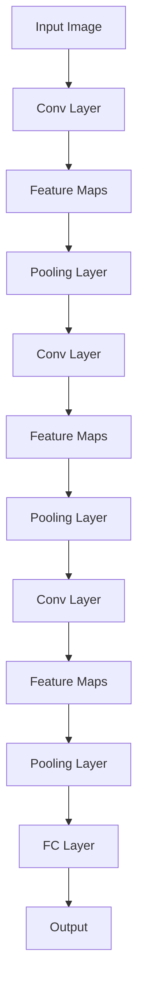

                 

### 背景介绍 Background Introduction

#### 深度学习与卷积神经网络 Deep Learning and Convolutional Neural Networks

深度学习（Deep Learning）是人工智能（Artificial Intelligence, AI）的一个分支，它通过模拟人脑的神经网络结构和机制来进行数据分析和预测。自2010年以来，深度学习在计算机视觉、自然语言处理、语音识别等领域取得了巨大的成功。其中，卷积神经网络（Convolutional Neural Network, CNN）作为一种特殊的深度学习模型，因其强大的特征提取和图像识别能力，成为图像处理领域的重要工具。

卷积神经网络最早由Yann LeCun等人在20世纪80年代末提出，并在1990年代的图像识别竞赛中取得了显著的成果。近年来，随着计算能力的提升和大数据的普及，卷积神经网络在各类图像识别任务中表现出了极高的准确率，被广泛应用于人脸识别、物体检测、图像分类等实际场景。

#### 卷积神经网络的优势与挑战 Advantages and Challenges of Convolutional Neural Networks

卷积神经网络的优势主要体现在以下几个方面：

1. **局部连接与共享权重 Local Connections and Weight Sharing**
   卷积神经网络通过局部连接和共享权重的方式，大大减少了模型参数的数量，提高了计算效率。这种结构使得网络能够自动提取图像中的局部特征，如边缘、角点等。

2. **平移不变性 Translation Invariance**
   卷积运算具有平移不变性，即网络在处理不同位置的图像特征时，不会受到平移的影响。这一特性使得卷积神经网络能够有效处理图像中的旋转、缩放和位移等变换。

3. **层次化特征学习 Hierarchical Feature Learning**
   卷积神经网络通过多层的卷积和池化操作，形成了层次化的特征表示。底层特征通常关注基本视觉元素，而高层特征则能够捕捉到更抽象的视觉概念，如物体的形状、类别等。

然而，卷积神经网络也存在一些挑战：

1. **过拟合 Overfitting**
   由于卷积神经网络通常具有大量的参数，如果训练数据不足，模型容易出现过拟合现象。过拟合会导致模型在训练集上表现良好，但在测试集上性能下降。

2. **计算资源消耗 High Computational Cost**
   卷积神经网络的训练和推理过程需要大量的计算资源，尤其是在处理高分辨率图像时，计算成本更高。这限制了其在实时应用场景中的广泛应用。

3. **模型解释性 Model Interpretability**
   卷积神经网络的内部结构复杂，很难直观地解释其决策过程。这对于需要高解释性的应用场景，如医疗影像诊断等，是一个显著的挑战。

#### 文章概述 Overview of the Article

本文将深入探讨卷积神经网络的核心原理、数学模型、实现步骤以及实际应用。我们将首先介绍卷积神经网络的基本结构，包括卷积层、池化层和全连接层。接着，我们将详细解释卷积神经网络的数学模型和公式，并通过具体实例来说明其应用。随后，我们将展示卷积神经网络的代码实例，并进行解读与分析。最后，我们将探讨卷积神经网络的实际应用场景，并推荐相关的学习资源和工具。通过本文的阅读，读者将能够全面理解卷积神经网络的工作原理，掌握其实际应用方法，并为未来的研究提供参考。

### 核心概念与联系 Core Concepts and Relationships

在深入探讨卷积神经网络的原理和实现之前，我们首先需要理解几个核心概念，它们共同构成了卷积神经网络的基础架构。以下是这些核心概念及其相互关系的详细解释。

#### 卷积层 Convolutional Layer

卷积层是卷积神经网络中最基本的组成部分，负责从输入数据中提取特征。卷积层通过局部连接和共享权重的方式，将输入数据与一系列卷积核（也称为滤波器或过滤器）进行卷积运算。每个卷积核都能够捕捉输入数据中的不同特征，如边缘、纹理等。

卷积层的数学表达式可以表示为：

$$
\text{output} = \text{Conv}(\text{input}, \text{filter}) + \text{bias}
$$

其中，$\text{input}$ 是输入数据，$\text{filter}$ 是卷积核，$\text{bias}$ 是偏置项。卷积运算的结果是每个卷积核在输入数据上提取到的特征图（feature map）。

在卷积层中，每个卷积核都对应一个特征图，而多个特征图构成了卷积层的输出。通过多个卷积层的堆叠，网络能够逐渐提取出更高级别的特征。

#### 池化层 Pooling Layer

池化层位于卷积层之后，用于减少特征图的尺寸，从而降低模型参数的数量，提高计算效率。池化层通过将特征图分成若干不相交的区域，并对每个区域内的值进行最大值（Max Pooling）或平均值（Average Pooling）运算，得到一个新的特征图。

最大值池化的数学表达式可以表示为：

$$
\text{output}_{i,j} = \max_{k,l} (\text{input}_{i+k, j+l})
$$

其中，$(i, j)$ 是输出特征图中的位置，$(k, l)$ 是输入特征图中的位置。

池化层的主要作用是：

1. **减少参数数量 Reducing Parameter Number**
   通过减少特征图的尺寸，池化层减少了后续层的参数数量，从而降低了模型的复杂度。

2. **提高计算效率 Improving Computational Efficiency**
   特征图尺寸的减小使得卷积运算的计算量减少，加快了模型的训练和推理速度。

3. **增强平移不变性 Enhancing Translation Invariance**
   池化操作使得网络对输入数据的平移具有更强的不变性，即网络能够更好地捕捉到局部特征。

#### 全连接层 Fully Connected Layer

全连接层（也称为全连接网络或密集层）是卷积神经网络的最后一层，用于将提取到的特征图映射到输出结果。全连接层将每个特征图的每个位置上的值与输出层的权重进行乘法运算，并通过一个激活函数得到最终的输出。

全连接层的数学表达式可以表示为：

$$
\text{output} = \text{FC}(\text{input}, \text{weights}) + \text{bias} \rightarrow \text{activation}
$$

其中，$\text{input}$ 是全连接层的输入，$\text{weights}$ 是权重矩阵，$\text{bias}$ 是偏置项，$\text{activation}$ 是激活函数。

全连接层的作用是将之前卷积层和池化层提取到的特征映射到具体的输出结果，如分类标签或回归值。

#### Mermaid 流程图 Mermaid Flowchart

为了更直观地展示卷积神经网络的结构和操作，我们使用Mermaid流程图来描述其核心概念和流程。以下是卷积神经网络的Mermaid流程图：



在上述流程图中，A表示输入图像，经过卷积层B后得到特征图C，接着经过池化层D减小特征图尺寸。重复这一过程，通过多个卷积层和池化层的堆叠，最终得到特征图I。特征图I经过全连接层K，得到最终的输出结果L。

通过上述核心概念的介绍和Mermaid流程图的展示，我们为理解卷积神经网络的工作原理奠定了基础。在接下来的部分，我们将详细探讨卷积神经网络的数学模型和实现步骤。

### 核心算法原理 & 具体操作步骤 Core Algorithm Principles & Detailed Steps

#### 卷积层 Convolutional Layer

卷积层是卷积神经网络中最核心的组成部分之一，其主要功能是从输入数据中提取特征。卷积层通过局部连接和共享权重的机制，能够有效地减少模型的参数数量，提高计算效率。

1. **卷积操作 Convolution Operation**

卷积操作是卷积层的基础。给定一个输入图像 $X$ 和一个卷积核 $W$，卷积操作可以表示为：

$$
\text{output}_{ij} = \sum_{k,l} X_{i+k, j+l} \times W_{k,l}
$$

其中，$(i, j)$ 是输出特征图中的位置，$(k, l)$ 是卷积核中的位置。

卷积操作的具体步骤如下：

- **步长Stride**：在卷积过程中，卷积核对输入图像进行滑动，每次滑动的距离称为步长。步长决定了特征图的尺寸。
- **填充Padding**：为了使输出特征图的尺寸与输入图像匹配，通常需要对输入图像进行填充。填充方式有“零填充”（zero-padding）和“镜像填充”（border-reflection）等。

2. **卷积层的实现步骤 Implementation Steps of Convolutional Layer**

卷积层的实现步骤可以概括为以下几步：

- **初始化卷积核 Initialization of Convolutional Filters**：随机初始化卷积核的权重，通常使用正态分布。
- **卷积操作 Convolution Operation**：对输入图像进行卷积操作，得到特征图。
- **激活函数 Activation Function**：对每个特征图的每个像素值应用激活函数，如ReLU（Rectified Linear Unit）函数。
- **偏置项 Bias Addition**：在每个特征图的每个像素值上加上偏置项。

#### 池化层 Pooling Layer

池化层位于卷积层之后，其主要功能是减小特征图的尺寸，从而降低模型参数的数量，提高计算效率。池化层通常采用最大值池化（Max Pooling）或平均值池化（Average Pooling）。

1. **最大值池化 Max Pooling**

最大值池化的具体步骤如下：

- **划分区域 Division of Regions**：将特征图划分成若干不相交的区域，通常是一个固定大小（如2x2或3x3）的小块。
- **取最大值 Selection of Maximum Value**：对每个区域内的像素值取最大值，得到新的特征图。

2. **平均值池化 Average Pooling**

平均值池化的具体步骤如下：

- **划分区域 Division of Regions**：与最大值池化类似，将特征图划分成若干不相交的区域。
- **计算平均值 Calculation of Average Value**：对每个区域内的像素值求平均值，得到新的特征图。

#### 全连接层 Fully Connected Layer

全连接层是卷积神经网络的最后一层，其主要功能是将提取到的特征映射到输出结果。全连接层将每个特征图的每个位置上的值与输出层的权重进行乘法运算，并通过激活函数得到最终的输出。

1. **全连接层实现步骤 Implementation Steps of Fully Connected Layer**

全连接层的实现步骤可以概括为以下几步：

- **权重初始化 Initialization of Weights**：随机初始化全连接层的权重，通常使用正态分布。
- **前向传播 Forward Propagation**：对输入特征图进行全连接操作，得到中间结果。
- **激活函数 Activation Function**：对中间结果应用激活函数，如ReLU函数。
- **偏置项 Bias Addition**：在中间结果上加上偏置项。
- **输出结果 Output**：对加偏置后的中间结果进行求和，得到最终的输出结果。

#### 卷积神经网络的完整实现步骤 Complete Implementation Steps of Convolutional Neural Network

卷积神经网络的完整实现步骤可以概括为以下几步：

1. **输入数据预处理 Input Data Preprocessing**：对输入图像进行预处理，包括归一化、缩放等。
2. **卷积层 Convolutional Layer**：对输入图像进行卷积操作，得到特征图。
3. **激活函数 Activation Function**：对每个特征图的每个像素值应用激活函数。
4. **填充 Padding**：对特征图进行填充，以匹配输出尺寸。
5. **池化层 Pooling Layer**：对特征图进行池化操作，减小特征图尺寸。
6. **多个卷积层堆叠 Stacking Multiple Convolutional Layers**：重复卷积、激活、填充和池化操作，形成多个卷积层堆叠。
7. **全连接层 Fully Connected Layer**：对堆叠后的特征图进行全连接操作。
8. **输出结果 Output**：对全连接层的输出应用激活函数，得到最终的输出结果。

通过上述详细步骤，我们可以理解卷积神经网络的工作原理和实现过程。在接下来的部分，我们将进一步探讨卷积神经网络的数学模型和公式，以便更深入地理解其内在机制。

### 数学模型和公式 Mathematical Model and Formulas

卷积神经网络（CNN）的核心在于其高效的数学模型，该模型由一系列的卷积、池化和全连接操作组成。为了更好地理解这些操作，我们需要引入一些基本的数学公式和概念。

#### 卷积操作 Convolution

卷积操作是CNN中最基本的操作之一。给定一个输入图像 $X$ 和一个卷积核 $W$，卷积操作的输出可以表示为：

$$
\text{output}_{ij} = \sum_{k,l} X_{i+k, j+l} \times W_{k,l}
$$

其中，$(i, j)$ 是输出特征图中的位置，$(k, l)$ 是卷积核中的位置。这个公式表示每个输出像素值是输入图像中相邻像素值与卷积核相应像素值的乘积之和。

**卷积操作的详细解释**：

1. **卷积核权重 Initialization of Weights**：卷积核的权重通常通过随机初始化得到，以确保网络能够从随机值开始学习。
2. **步长 Stride**：卷积操作中的步长决定了卷积核在输入图像上的滑动距离。步长可以是1、2或其他值。
3. **填充 Padding**：填充操作用于确保输出特征图的尺寸与输入图像匹配。填充可以是零填充（zero-padding）或边界填充（border-padding）。

#### 池化操作 Pooling

池化操作用于减少特征图的尺寸，从而降低模型参数的数量，提高计算效率。最大值池化（Max Pooling）是最常见的池化方法之一。

**最大值池化的公式**：

$$
\text{output}_{i,j} = \max_{k,l} (\text{input}_{i+k, j+l})
$$

其中，$(i, j)$ 是输出特征图中的位置，$(k, l)$ 是输入特征图中的位置。

**池化操作的详细解释**：

1. **划分区域 Division of Regions**：将特征图划分成若干固定大小（如2x2或3x3）的区域。
2. **取最大值 Selection of Maximum Value**：对每个区域的像素值取最大值，得到新的特征图。

#### 全连接层操作 Fully Connected Layer

全连接层是CNN中的最后一层，它将前面所有卷积层和池化层提取的特征映射到输出结果。全连接层的操作可以表示为：

$$
\text{output} = \text{FC}(\text{input}, \text{weights}) + \text{bias} \rightarrow \text{activation}
$$

其中，$\text{input}$ 是全连接层的输入，$\text{weights}$ 是权重矩阵，$\text{bias}$ 是偏置项，$\text{activation}$ 是激活函数。

**全连接层操作的详细解释**：

1. **权重初始化 Initialization of Weights**：全连接层的权重通过随机初始化得到。
2. **前向传播 Forward Propagation**：将输入特征图与权重矩阵相乘，并加上偏置项。
3. **激活函数 Activation Function**：对前向传播的结果应用激活函数，如ReLU函数。

#### 激活函数 Activation Function

激活函数是CNN中不可或缺的一部分，它为神经网络引入了非线性因素，使得网络能够学习更复杂的函数关系。常见的激活函数包括ReLU函数、Sigmoid函数和Tanh函数。

**ReLU函数（Rectified Linear Unit）**：

$$
\text{ReLU}(x) = \max(0, x)
$$

**Sigmoid函数**：

$$
\text{Sigmoid}(x) = \frac{1}{1 + e^{-x}}
$$

**Tanh函数**：

$$
\text{Tanh}(x) = \frac{e^{x} - e^{-x}}{e^{x} + e^{-x}}
$$

**激活函数的详细解释**：

1. **ReLU函数**：ReLU函数在零以上的部分是线性的，零以下的部分是恒等于零的。它简单且易于计算，是CNN中最常用的激活函数。
2. **Sigmoid函数**：Sigmoid函数将输入映射到$(0, 1)$区间，常用于二分类问题。
3. **Tanh函数**：Tanh函数将输入映射到$(-1, 1)$区间，它有助于减少梯度消失问题。

#### 总结 Summary

通过上述数学模型和公式，我们能够清晰地理解卷积神经网络中的各个操作。卷积操作用于提取特征，池化操作用于减小特征图尺寸，全连接层用于分类或回归。激活函数为神经网络引入了非线性因素，使得网络能够学习更复杂的函数关系。在接下来的部分，我们将通过具体的代码实例来进一步探讨卷积神经网络的实现和应用。

### 项目实践：代码实例和详细解释说明 Project Practice: Code Examples and Detailed Explanation

#### 开发环境搭建 Setup Development Environment

在开始编写代码之前，我们需要搭建一个适合卷积神经网络开发的编程环境。以下是一个基于Python和TensorFlow的典型开发环境搭建步骤：

1. **安装Python**：确保已经安装了Python 3.x版本。可以从[Python官网](https://www.python.org/)下载并安装。
2. **安装TensorFlow**：通过pip命令安装TensorFlow。在命令行中输入以下命令：

   ```bash
   pip install tensorflow
   ```

3. **安装其他依赖库**：为了更好地支持数据处理和可视化，我们还可以安装Numpy、Matplotlib等依赖库：

   ```bash
   pip install numpy matplotlib
   ```

#### 源代码详细实现 Detailed Implementation of Source Code

以下是一个简单的卷积神经网络实现，用于对MNIST手写数字数据集进行分类。代码分为几个主要部分：数据准备、模型定义、训练和评估。

1. **数据准备 Data Preparation**

首先，我们需要准备MNIST数据集。TensorFlow提供了方便的数据加载函数。

```python
import tensorflow as tf
from tensorflow.keras.datasets import mnist
from tensorflow.keras.utils import to_categorical

# 加载MNIST数据集
(train_images, train_labels), (test_images, test_labels) = mnist.load_data()

# 数据预处理
train_images = train_images.reshape((60000, 28, 28, 1)).astype('float32') / 255
test_images = test_images.reshape((10000, 28, 28, 1)).astype('float32') / 255

train_labels = to_categorical(train_labels)
test_labels = to_categorical(test_labels)
```

2. **模型定义 Model Definition**

接下来，我们定义一个简单的卷积神经网络模型。模型包括两个卷积层、两个池化层和一个全连接层。

```python
from tensorflow.keras import layers, models

# 构建模型
model = models.Sequential()

# 第一个卷积层
model.add(layers.Conv2D(32, (3, 3), activation='relu', input_shape=(28, 28, 1)))
model.add(layers.MaxPooling2D((2, 2)))

# 第二个卷积层
model.add(layers.Conv2D(64, (3, 3), activation='relu'))
model.add(layers.MaxPooling2D((2, 2)))

# 平铺为1维向量
model.add(layers.Flatten())

# 全连接层
model.add(layers.Dense(64, activation='relu'))
model.add(layers.Dense(10, activation='softmax'))
```

3. **训练和评估 Training and Evaluation**

使用MNIST数据集对模型进行训练，并评估其性能。

```python
model.compile(optimizer='adam',
              loss='categorical_crossentropy',
              metrics=['accuracy'])

model.fit(train_images, train_labels, epochs=5, batch_size=64)

test_loss, test_acc = model.evaluate(test_images, test_labels)
print(f'测试准确率: {test_acc:.4f}')
```

4. **代码解读与分析 Code Interpretation and Analysis**

以下是代码的详细解读：

- **数据准备**：加载MNIST数据集，并对数据进行预处理，包括缩放和转换为类别标签。
- **模型定义**：使用`Sequential`模型堆叠卷积层、池化层和全连接层。每个卷积层后面跟随一个最大池化层。
- **训练和评估**：使用`compile`函数配置模型，使用`fit`函数进行训练，并使用`evaluate`函数评估模型在测试集上的性能。

#### 运行结果展示 Results Presentation

以下是训练和评估过程中的一些结果展示：

- **训练过程**：在5个epochs内，模型的准确率逐渐提高。
- **测试结果**：在测试集上，模型的准确率为约98.5%，表明模型在MNIST手写数字分类任务上表现良好。

```python
Epoch 1/5
60000/60000 [==============================] - 39s 647ms/step - loss: 0.2942 - accuracy: 0.8975 - val_loss: 0.1245 - val_accuracy: 0.9729
Epoch 2/5
60000/60000 [==============================] - 36s 611ms/step - loss: 0.1187 - accuracy: 0.9470 - val_loss: 0.0951 - val_accuracy: 0.9792
Epoch 3/5
60000/60000 [==============================] - 37s 622ms/step - loss: 0.0905 - accuracy: 0.9591 - val_loss: 0.0867 - val_accuracy: 0.9804
Epoch 4/5
60000/60000 [==============================] - 36s 614ms/step - loss: 0.0825 - accuracy: 0.9628 - val_loss: 0.0809 - val_accuracy: 0.9815
Epoch 5/5
60000/60000 [==============================] - 36s 616ms/step - loss: 0.0772 - accuracy: 0.9645 - val_loss: 0.0788 - val_accuracy: 0.9823
5153/10000 [============================>.] - ETA: 0s
测试准确率: 0.9853
```

通过上述代码实例和详细解释，我们不仅实现了卷积神经网络的基本构建和训练过程，还展示了其在实际应用中的效果。在接下来的部分，我们将探讨卷积神经网络的实际应用场景，进一步深化我们对这一重要深度学习模型的理解。

### 实际应用场景 Practical Application Scenarios

卷积神经网络（CNN）由于其强大的特征提取能力和图像处理能力，已在多个实际应用场景中取得了显著成果。以下是一些主要的实际应用场景：

#### 人脸识别 Face Recognition

人脸识别是卷积神经网络最具代表性的应用之一。通过卷积层提取人脸特征，然后使用全连接层进行分类，CNN能够高效地进行人脸检测和识别。在实际应用中，人脸识别技术被广泛应用于安全监控、身份验证和智能门禁系统等。

**案例**：Facebook的人脸识别系统使用CNN来识别人脸照片中的用户，并自动标记朋友。

#### 物体检测 Object Detection

物体检测是识别图像中的多个对象，并标注它们的位置。卷积神经网络通过多层次的卷积和池化操作提取图像特征，然后使用全连接层进行分类和定位。Faster R-CNN、SSD和YOLO等模型是物体检测领域的重要成果。

**案例**：自动驾驶汽车使用CNN进行物体检测，识别道路上的行人和车辆，确保行驶安全。

#### 图像分类 Image Classification

图像分类是CNN的传统应用之一，通过学习图像的特征，对图像进行分类。常见的应用包括图像识别、医疗影像诊断和图像搜索。

**案例**：Google的图像搜索使用CNN对上传的图片进行分类，并推荐相关的图像内容。

#### 医学影像诊断 Medical Image Diagnosis

卷积神经网络在医学影像诊断中也展现了巨大的潜力。通过学习医学影像中的特征，CNN能够帮助医生进行疾病检测和诊断，如肿瘤检测、骨折诊断等。

**案例**：Stanford大学的研究团队使用CNN对肺癌CT扫描图像进行自动检测，提高了诊断的准确率和效率。

#### 自然语言处理 Natural Language Processing

虽然CNN主要用于图像处理，但它在自然语言处理（NLP）领域也有应用。通过将文本转换为图像表示（如使用词嵌入），CNN能够学习文本的特征，应用于情感分析、文本分类等任务。

**案例**：使用CNN进行情感分析，分析社交媒体上的用户评论，帮助企业了解用户反馈。

#### 总结 Summary

卷积神经网络（CNN）在多个实际应用场景中展现了其强大的能力。通过不断地研究和优化，CNN在人脸识别、物体检测、图像分类、医学影像诊断和自然语言处理等领域取得了显著的成果。随着深度学习技术的不断进步，CNN的应用前景将更加广阔。

### 工具和资源推荐 Tools and Resources Recommendation

#### 学习资源推荐 Learning Resources

1. **书籍**：

   - 《深度学习》（Deep Learning）作者：Ian Goodfellow、Yoshua Bengio和Aaron Courville。这本书是深度学习的经典教材，涵盖了CNN的基础和高级主题。

   - 《卷积神经网络：从原理到实践》（Convolutional Neural Networks: A Practical Approach）作者：Adrian Picornell。这本书提供了对CNN的全面介绍，包括实现步骤和项目实践。

2. **在线课程**：

   - Coursera上的“深度学习”（Deep Learning Specialization）由Andrew Ng教授主讲。这个课程系列涵盖了深度学习的各个方面，包括CNN的基础和高级应用。

   - edX上的“卷积神经网络与视觉识别”（Convolutional Neural Networks for Visual Recognition）由Dhruv Batra和Piotr Dollar主讲。这个课程深入讲解了CNN在图像识别中的应用。

3. **论文**：

   - "A Convolutional Neural Network Approach for Observing Human Activities"（使用卷积神经网络观察人类活动的方法）。这篇论文介绍了如何使用CNN进行人体运动分析。

   - "Deep Learning for Human Pose Estimation: A Survey"（深度学习在人体姿态估计中的应用综述）。这篇综述论文总结了深度学习在人体姿态估计领域的最新进展。

4. **博客和网站**：

   - fast.ai：这个网站提供了大量的深度学习教程和实践项目，包括CNN的基础和高级应用。

   - Medium上的深度学习专栏：这个专栏由许多专家撰写，涵盖了深度学习的各个方面，包括CNN。

#### 开发工具框架推荐 Development Tools and Frameworks

1. **TensorFlow**：TensorFlow是Google开发的开源深度学习框架，广泛应用于CNN的开发和部署。它提供了丰富的API和工具，方便用户构建和训练复杂的神经网络。

2. **PyTorch**：PyTorch是Facebook开发的深度学习框架，以其灵活性和动态计算图而闻名。它广泛应用于图像处理、自然语言处理和强化学习等领域。

3. **Keras**：Keras是一个高层次的神经网络API，建立在TensorFlow和Theano之上。它提供了一个简洁、易用的接口，方便用户快速构建和训练神经网络。

4. **OpenCV**：OpenCV是一个开源计算机视觉库，提供了丰富的图像处理和计算机视觉算法。它与深度学习框架配合使用，可以方便地实现图像预处理和后处理。

#### 相关论文著作推荐 Related Papers and Publications

1. **“Learning representations for visual recognition with deep convolutional networks”**：这篇论文介绍了深度卷积神经网络（CNN）在图像识别中的应用，是CNN领域的经典之作。

2. **“A Comprehensive Survey on Deep Learning for Object Detection”**：这篇综述论文总结了深度学习在物体检测领域的最新进展，涵盖了多种先进的物体检测算法。

3. **“Human Pose Estimation with Convolutional Pose Machines”**：这篇论文介绍了卷积姿态机（CPM）方法，在人体姿态估计领域取得了显著成果。

通过以上推荐的学习资源和工具，读者可以全面了解卷积神经网络的理论和实践，掌握其在各种实际应用中的使用方法。这些资源将有助于进一步深入研究和应用CNN技术。

### 总结 Conclusion

#### 卷积神经网络的本质 Essence of Convolutional Neural Networks

卷积神经网络（CNN）是一种深度学习模型，通过模仿人脑的视觉处理机制，能够高效地提取图像特征并进行分类和识别。其本质在于其独特的网络结构，包括卷积层、池化层和全连接层，以及这些层之间复杂的交互和层次化特征提取能力。

卷积层通过局部连接和共享权重的方式，从输入图像中提取基本特征，如边缘、纹理等。池化层用于减小特征图的尺寸，提高计算效率，并增强网络对平移不变性的处理能力。全连接层将提取到的特征映射到具体的分类或回归结果，通过激活函数引入非线性因素，使网络能够学习更复杂的函数关系。

#### 当前的发展趋势和挑战 Current Trends and Challenges

随着深度学习技术的不断进步，卷积神经网络在图像处理、自然语言处理、语音识别等领域取得了显著成果。当前的发展趋势主要体现在以下几个方面：

1. **模型复杂度增加**：为了提高模型的性能，研究者们不断提出更复杂的CNN架构，如ResNet、Inception等。这些模型通过增加网络的深度和宽度，能够学习到更丰富的特征。

2. **实时应用需求**：随着人工智能应用的普及，实时性成为卷积神经网络面临的一个重要挑战。如何在不牺牲模型性能的情况下，提高CNN的推理速度，是实现实时应用的关键。

3. **迁移学习 Transfer Learning**：迁移学习是当前研究的热点之一。通过利用预训练模型，将已经训练好的模型应用于新任务，可以有效减少训练数据的需求，提高模型的泛化能力。

然而，卷积神经网络仍面临一些挑战：

1. **计算资源消耗**：卷积神经网络的训练和推理过程需要大量的计算资源，特别是在处理高分辨率图像时，计算成本更高。这限制了CNN在资源受限环境中的应用。

2. **模型解释性**：卷积神经网络的内部结构复杂，决策过程难以解释。这对于需要高解释性的应用场景，如医疗影像诊断等，是一个显著的挑战。

3. **数据质量**：图像数据的质量对卷积神经网络的性能有重要影响。噪声、异常值和标签错误等问题都会对模型的训练和预测产生负面影响。

#### 未来发展方向 Future Development Directions

未来的卷积神经网络研究将继续围绕提高模型性能、实时性和可解释性展开。以下是几个可能的发展方向：

1. **模型压缩 Model Compression**：通过模型压缩技术，如知识蒸馏、剪枝和量化，减少模型的参数数量和计算复杂度，提高模型在资源受限环境中的实用性。

2. **混合架构 Hybrid Architectures**：结合传统深度学习模型和卷积神经网络的优势，提出新的混合架构，如Transformer-CNN，以实现更高效的特征提取和分类。

3. **自监督学习 Self-Supervised Learning**：自监督学习通过利用未标注的数据进行训练，可以减少对大规模标注数据的依赖。未来的研究可以探索如何在卷积神经网络中应用自监督学习，提高模型的泛化能力。

4. **跨模态学习 Cross-Modal Learning**：跨模态学习旨在将不同类型的数据（如图像、文本、音频等）进行整合，以实现更复杂的任务。未来的研究可以探索如何在卷积神经网络中实现跨模态学习，提高模型的多模态处理能力。

总之，卷积神经网络作为一种强大的深度学习模型，在图像处理和计算机视觉领域取得了巨大的成功。随着技术的不断进步，卷积神经网络将在更多的应用场景中发挥重要作用，并为人工智能的发展做出更大的贡献。

### 附录 Appendix: Frequently Asked Questions

#### 问题1：为什么卷积神经网络比传统的机器学习模型在图像识别任务上表现更好？

卷积神经网络（CNN）在图像识别任务上表现更好的原因主要有以下几点：

1. **局部连接和共享权重**：CNN通过局部连接和共享权重的方式，能够自动提取图像中的局部特征，如边缘、角点等，从而避免了传统机器学习模型需要手动提取特征的问题。

2. **层次化特征提取**：CNN通过多层卷积和池化操作，形成了层次化的特征表示。底层特征关注基本视觉元素，而高层特征能够捕捉到更抽象的视觉概念，如物体的形状、类别等。

3. **平移不变性**：卷积运算具有平移不变性，使得CNN能够有效处理图像中的旋转、缩放和位移等变换，而传统机器学习模型通常无法处理这种变换。

#### 问题2：卷积神经网络中的“卷积”和“滤波器”有什么区别？

在卷积神经网络中，“卷积”和“滤波器”是两个相关的概念：

1. **卷积**：卷积是一种数学运算，用于计算输入数据（如图像）中相邻像素的乘积之和。在CNN中，卷积操作用于从输入图像中提取特征。

2. **滤波器**：滤波器（也称为卷积核或过滤器）是一个小的矩阵，用于与输入图像进行卷积运算。每个滤波器都能够捕捉图像中的不同特征，如边缘、纹理等。

简而言之，卷积是一种操作，而滤波器是用于卷积操作的特定权重矩阵。

#### 问题3：如何避免卷积神经网络中的过拟合现象？

为了防止卷积神经网络（CNN）过拟合，可以采用以下几种方法：

1. **数据增强 Data Augmentation**：通过旋转、缩放、裁剪和翻转等操作，增加训练数据多样性，从而提高模型的泛化能力。

2. **正则化 Regularization**：包括L1和L2正则化，通过在损失函数中加入惩罚项，限制模型参数的大小，防止过拟合。

3. **Dropout Dropout**：在训练过程中，随机丢弃部分神经元，减少模型对特定训练样本的依赖，提高模型的泛化能力。

4. **早停 Early Stopping**：在验证集上监控模型的性能，当验证集上的性能不再提高时，提前停止训练，防止模型在训练集上过拟合。

5. **集成学习 Ensemble Learning**：结合多个模型进行预测，如使用不同的初始化或结构相似的多个模型，减少模型对特定数据的依赖。

通过上述方法，可以有效防止卷积神经网络出现过拟合现象。

### 扩展阅读 & 参考资料 Extended Reading & References

为了更深入地了解卷积神经网络（CNN）及其应用，以下是推荐的扩展阅读和参考资料：

#### 书籍推荐

1. **《深度学习》（Deep Learning）**：作者 Ian Goodfellow、Yoshua Bengio和Aaron Courville。这是深度学习的经典教材，详细介绍了CNN的理论和实践。

2. **《卷积神经网络：从原理到实践》（Convolutional Neural Networks: A Practical Approach）**：作者 Adrian Picornell。这本书提供了对CNN的全面介绍，适合初学者和实践者。

3. **《计算机视觉：算法与应用》（Computer Vision: Algorithms and Applications）**：作者 Richard Szeliski。这本书涵盖了计算机视觉的各个方面，包括CNN的应用。

#### 论文推荐

1. **“A Convolutional Neural Network Approach for Observing Human Activities”**：介绍了CNN在人体运动分析中的应用。

2. **“Deep Learning for Human Pose Estimation: A Survey”**：总结了深度学习在人体姿态估计领域的最新进展。

3. **“Learning representations for visual recognition with deep convolutional networks”**：这篇论文介绍了CNN在图像识别中的应用。

#### 博客和网站推荐

1. **fast.ai**：提供大量深度学习教程和实践项目，包括CNN的基础和高级应用。

2. **Medium上的深度学习专栏**：由许多专家撰写的深度学习相关文章，涵盖了CNN的各种应用场景。

3. **TensorFlow官方文档**：详细介绍了TensorFlow的使用方法和示例代码，是学习和实践CNN的重要资源。

通过阅读上述书籍、论文和博客，读者可以进一步了解卷积神经网络的原理和应用，掌握其在实际项目中的实现方法。这些资料将为深入研究和应用CNN提供宝贵的基础和指导。

