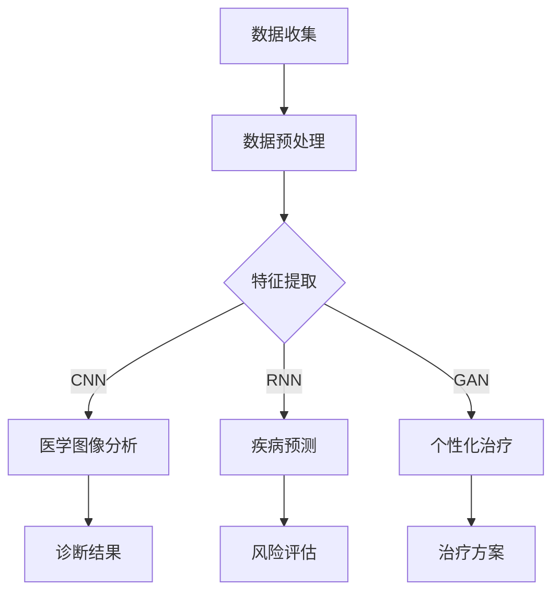

                 

### 文章标题

**AI人工智能深度学习算法：在精准医疗中的应用**

> **关键词：** 深度学习、精准医疗、人工智能、算法、医学图像分析、疾病预测、个性化治疗、医学大数据

> **摘要：** 本文将探讨深度学习算法在精准医疗领域的应用，重点分析其在医学图像分析、疾病预测和个性化治疗等方面的技术原理和实际案例。通过详细讲解相关算法的数学模型和实现步骤，本文旨在为读者提供一个全面且深入的视角，以了解深度学习技术在医学领域的潜在价值和发展前景。

### 1. 背景介绍

#### 1.1 精准医疗的兴起

精准医疗（Precision Medicine）是一种以个体基因信息为基础，结合环境和生活习惯等多方面因素，为患者提供个性化医疗方案的新兴医疗模式。它强调疾病的个性化诊断和个性化治疗，旨在提高治疗效果，减少不必要的副作用，以及降低医疗成本。

精准医疗的兴起可以追溯到20世纪90年代，随着人类基因组计划的完成，医学研究者开始意识到基因在疾病发生和发展中的作用。自此，个性化医疗逐渐从理论走向实践，并在近年来取得了显著的进展。

#### 1.2 深度学习的发展

深度学习（Deep Learning）是一种基于人工神经网络的理论和技术，通过多层次的神经网络结构，对大量数据进行自动特征提取和模式识别。自2012年AlexNet在ImageNet比赛中取得突破性成果以来，深度学习在计算机视觉、自然语言处理、语音识别等多个领域取得了显著的进展。

深度学习的快速发展，得益于计算能力的提升、大数据的积累以及新型网络架构的提出。特别是在医学领域，深度学习提供了强大的数据挖掘和分析工具，为精准医疗的实现提供了技术支持。

#### 1.3 深度学习与精准医疗的结合

深度学习和精准医疗的结合，为医学领域带来了全新的变革。一方面，深度学习能够从海量的医学数据中自动提取有用的特征，帮助医生进行疾病诊断和预测；另一方面，深度学习算法可以根据患者的个性化信息，为患者提供精准的治疗方案。

例如，在医学图像分析中，深度学习算法能够识别出微小的病变区域，提高诊断的准确性。在疾病预测中，深度学习可以分析患者的病史、基因信息和生活习惯等因素，预测疾病的发生风险。在个性化治疗中，深度学习算法可以根据患者的病情和治疗效果，动态调整治疗方案，实现个性化医疗。

### 2. 核心概念与联系

#### 2.1 深度学习算法

深度学习算法是一种基于多层神经网络的学习方法，通过逐层提取数据的特征，实现对复杂模式的识别。以下是深度学习算法的核心概念和基本结构：

- **神经网络（Neural Network）**：神经网络是深度学习的基础，由大量的神经元组成，每个神经元都可以接受多个输入，并产生一个输出。神经网络通过调整神经元之间的连接权重，实现对数据的建模。

- **卷积神经网络（Convolutional Neural Network, CNN）**：CNN是一种专门用于图像分析的深度学习算法，通过卷积层、池化层和全连接层的组合，实现对图像特征的学习和提取。

- **循环神经网络（Recurrent Neural Network, RNN）**：RNN是一种用于序列数据学习的神经网络，通过记忆机制，能够处理具有时序依赖关系的数据。

- **生成对抗网络（Generative Adversarial Network, GAN）**：GAN是一种由两个神经网络（生成器和判别器）对抗训练的模型，能够生成逼真的图像和语音。

#### 2.2 精准医疗应用

深度学习在精准医疗中的应用，主要包括医学图像分析、疾病预测和个性化治疗等方面。以下是一个简要的Mermaid流程图，展示了深度学习算法在精准医疗中的基本流程：



在这个流程中，数据收集和预处理是深度学习应用的基础，特征提取是核心步骤，不同的深度学习算法（如CNN、RNN和GAN）可以针对不同的应用场景进行特征提取和模式识别。

### 3. 核心算法原理 & 具体操作步骤

#### 3.1 卷积神经网络（CNN）

卷积神经网络（CNN）是深度学习算法在医学图像分析中应用最广泛的模型之一。CNN的核心原理是通过卷积层、池化层和全连接层的组合，实现对图像特征的学习和提取。以下是CNN的基本操作步骤：

1. **输入层（Input Layer）**：输入层接收图像数据，每个像素点都是一个特征。

2. **卷积层（Convolutional Layer）**：卷积层通过卷积操作，将输入的特征图与滤波器（卷积核）进行卷积运算，提取图像的局部特征。

3. **激活函数（Activation Function）**：常用的激活函数包括Sigmoid、ReLU和Tanh等，用于引入非线性特性。

4. **池化层（Pooling Layer）**：池化层通过将特征图缩小，减少参数数量，提高计算效率。常用的池化操作包括最大池化和平均池化。

5. **全连接层（Fully Connected Layer）**：全连接层将卷积层和池化层输出的特征图进行全连接，得到最终的分类结果。

6. **输出层（Output Layer）**：输出层将全连接层的输出通过激活函数（如Softmax）转化为概率分布，实现图像分类。

#### 3.2 循环神经网络（RNN）

循环神经网络（RNN）是一种用于处理序列数据的深度学习算法，其核心原理是通过记忆机制，实现对序列数据的建模。以下是RNN的基本操作步骤：

1. **输入层（Input Layer）**：输入层接收序列数据，每个时间步的输入都是一个特征。

2. **隐藏层（Hidden Layer）**：隐藏层包含一个或多个RNN单元，每个RNN单元都包含一个记忆单元，用于存储前一个时间步的信息。

3. **输出层（Output Layer）**：输出层将隐藏层的输出通过激活函数（如Softmax）转化为概率分布，实现序列分类或序列生成。

4. **反向传播（Backpropagation）**：通过反向传播算法，计算每个时间步的梯度，并更新网络参数。

#### 3.3 生成对抗网络（GAN）

生成对抗网络（GAN）是一种由两个神经网络（生成器和判别器）对抗训练的模型，其核心原理是通过生成器和判别器的相互博弈，实现数据的生成。以下是GAN的基本操作步骤：

1. **生成器（Generator）**：生成器通过噪声数据生成逼真的图像。

2. **判别器（Discriminator）**：判别器用于区分真实图像和生成图像。

3. **对抗训练（Adversarial Training）**：生成器和判别器交替训练，生成器试图生成逼真的图像，判别器试图区分真实图像和生成图像。

4. **优化目标（Optimization Objective）**：GAN的优化目标是通过生成器和判别器的对抗训练，使生成器的输出尽量逼近真实图像。

### 4. 数学模型和公式 & 详细讲解 & 举例说明

#### 4.1 卷积神经网络（CNN）

卷积神经网络（CNN）的核心在于其卷积操作和池化操作，以下分别介绍这两种操作的基本数学模型：

1. **卷积操作（Convolution Operation）**

   卷积操作的数学公式如下：

   $$ (f * g)(x) = \sum_{y} f(y) \cdot g(x - y) $$

   其中，$f$ 和 $g$ 分别表示两个函数，$x$ 和 $y$ 分别表示输入和输出点，$*$ 表示卷积操作。

   在CNN中，卷积操作用于将输入的特征图与滤波器（卷积核）进行卷积运算，提取图像的局部特征。滤波器通常是一个二维矩阵，其大小决定了卷积窗口的大小。

2. **池化操作（Pooling Operation）**

   池化操作的数学公式如下：

   $$ p(x) = \max_{y \in S(x)} g(y) $$

   其中，$p(x)$ 表示池化操作后的特征值，$g(y)$ 表示输入特征值，$S(x)$ 表示以$x$ 为中心的池化窗口。

   在CNN中，池化操作用于将特征图缩小，减少参数数量，提高计算效率。常用的池化操作包括最大池化和平均池化。

   举例说明：

   假设我们有一个 $3 \times 3$ 的特征图，使用最大池化操作，窗口大小为 $2 \times 2$，那么池化后的特征图大小为 $2 \times 2$，具体操作如下：

   $$ \begin{array}{c|c|c|c} \hline & 1 & 2 & \hline 1 & 1 & 3 & \hline 2 & 4 & 2 & \hline \hline & 4 & 5 & \hline \end{array} \xrightarrow{\text{最大池化}} \begin{array}{c|c} \hline 4 & 5 & \hline \end{array} $$

#### 4.2 循环神经网络（RNN）

循环神经网络（RNN）的核心在于其记忆机制，以下介绍RNN的数学模型和具体操作步骤：

1. **RNN的数学模型**

   RNN的数学模型如下：

   $$ h_t = \sigma(W_h h_{t-1} + W_x x_t + b) $$

   其中，$h_t$ 表示第 $t$ 个时间步的隐藏状态，$x_t$ 表示第 $t$ 个时间步的输入特征，$W_h$ 和 $W_x$ 分别表示隐藏状态和输入特征之间的权重矩阵，$b$ 表示偏置项，$\sigma$ 表示激活函数。

   举例说明：

   假设我们有一个 $2$ 维的输入特征 $x_t = [1, 2]$ 和一个 $3$ 维的隐藏状态 $h_{t-1} = [0.1, 0.2, 0.3]$，使用ReLU作为激活函数，那么第 $t$ 个时间步的隐藏状态 $h_t$ 的计算如下：

   $$ h_t = \sigma(W_h h_{t-1} + W_x x_t + b) = \max(0, W_h h_{t-1} + W_x x_t + b) $$

   假设权重矩阵 $W_h = \begin{bmatrix} 0.5 & 0.5 \\ 0.5 & 0.5 \\ 0.5 & 0.5 \end{bmatrix}$，权重矩阵 $W_x = \begin{bmatrix} 0.1 & 0.1 \\ 0.2 & 0.2 \\ 0.3 & 0.3 \end{bmatrix}$，偏置项 $b = [0, 0, 0]$，那么计算过程如下：

   $$ h_t = \max(0, \begin{bmatrix} 0.5 & 0.5 \\ 0.5 & 0.5 \\ 0.5 & 0.5 \end{bmatrix} \begin{bmatrix} 0.1 & 0.2 \\ 0.3 & 0.4 \end{bmatrix} + \begin{bmatrix} 0.1 & 0.1 \\ 0.2 & 0.2 \\ 0.3 & 0.3 \end{bmatrix} [1, 2] + [0, 0, 0]) = \max(0, \begin{bmatrix} 0.6 & 0.7 \\ 0.6 & 0.7 \\ 0.6 & 0.7 \end{bmatrix}) = \begin{bmatrix} 0.6 & 0.7 \\ 0.6 & 0.7 \\ 0.6 & 0.7 \end{bmatrix} $$

#### 4.3 生成对抗网络（GAN）

生成对抗网络（GAN）的核心在于其生成器和判别器的对抗训练，以下介绍GAN的数学模型和具体操作步骤：

1. **GAN的数学模型**

   GAN的数学模型如下：

   - 生成器 $G(z)$：生成器通过噪声 $z$ 生成逼真的图像 $x$。

     $$ x = G(z) $$

   - 判别器 $D(x)$：判别器用于区分真实图像 $x$ 和生成图像 $x'$。

     $$ D(x) = \frac{1}{2} \left(1 + \log(D(x) + \epsilon) + \log(1 - D(x') + \epsilon) \right) $$

     其中，$\epsilon$ 表示一个小的正数，用于避免判别器的梯度消失。

   - 反向传播（Backpropagation）：通过反向传播算法，计算生成器和判别器的梯度，并更新网络参数。

   举例说明：

   假设生成器的参数为 $\theta_G$，判别器的参数为 $\theta_D$，噪声 $z$ 服从正态分布 $N(0, 1)$，真实图像 $x$ 和生成图像 $x'$ 分别为 $64 \times 64$ 的像素矩阵。

   - 初始化生成器和判别器的参数 $\theta_G$ 和 $\theta_D$。

   - 输入噪声 $z$，通过生成器 $G(z)$ 生成生成图像 $x'$。

   - 输入真实图像 $x$ 和生成图像 $x'$，计算判别器的损失函数。

     $$ L_D(\theta_D) = -\frac{1}{2} \left( \log(D(x)) + \log(1 - D(x')) \right) $$

   - 通过反向传播算法，计算判别器的梯度，并更新判别器的参数 $\theta_D$。

   - 输入噪声 $z$，通过生成器 $G(z)$ 生成生成图像 $x'$。

   - 计算生成器的损失函数。

     $$ L_G(\theta_G) = -\frac{1}{2} \log(D(x')) $$

   - 通过反向传播算法，计算生成器的梯度，并更新生成器的参数 $\theta_G$。

   - 重复以上步骤，直至生成器生成的图像逐渐逼近真实图像。

### 5. 项目实践：代码实例和详细解释说明

#### 5.1 开发环境搭建

在进行深度学习项目实践之前，我们需要搭建一个合适的开发环境。以下是搭建深度学习开发环境的步骤：

1. **安装Python环境**：确保Python版本不低于3.6，推荐使用Python 3.8或更高版本。

2. **安装深度学习框架**：常用的深度学习框架包括TensorFlow、PyTorch和Keras等。本文将以TensorFlow为例进行介绍。

3. **安装其他依赖库**：包括NumPy、Pandas、Matplotlib等常用的科学计算库。

   ```bash
   pip install tensorflow numpy pandas matplotlib
   ```

4. **配置CUDA环境**（可选）：如果使用GPU进行训练，需要配置CUDA环境。CUDA是一个由NVIDIA推出的并行计算平台和编程模型。

   ```bash
   pip install tensorflow-gpu
   ```

5. **测试环境是否配置成功**：通过以下代码测试TensorFlow是否安装成功。

   ```python
   import tensorflow as tf
   print(tf.__version__)
   ```

#### 5.2 源代码详细实现

以下是一个使用TensorFlow实现深度学习模型的简单示例。我们将使用CNN对图像进行分类。

```python
import tensorflow as tf
from tensorflow.keras import datasets, layers, models
import matplotlib.pyplot as plt

# 加载数据集
(train_images, train_labels), (test_images, test_labels) = datasets.cifar10.load_data()

# 数据预处理
train_images, test_images = train_images / 255.0, test_images / 255.0

# 构建模型
model = models.Sequential()
model.add(layers.Conv2D(32, (3, 3), activation='relu', input_shape=(32, 32, 3)))
model.add(layers.MaxPooling2D((2, 2)))
model.add(layers.Conv2D(64, (3, 3), activation='relu'))
model.add(layers.MaxPooling2D((2, 2)))
model.add(layers.Conv2D(64, (3, 3), activation='relu'))

# 添加全连接层和输出层
model.add(layers.Flatten())
model.add(layers.Dense(64, activation='relu'))
model.add(layers.Dense(10))

# 编译模型
model.compile(optimizer='adam',
              loss=tf.keras.losses.SparseCategoricalCrossentropy(from_logits=True),
              metrics=['accuracy'])

# 训练模型
history = model.fit(train_images, train_labels, epochs=10, 
                    validation_data=(test_images, test_labels))

# 评估模型
test_loss, test_acc = model.evaluate(test_images,  test_labels, verbose=2)
print(f'Test accuracy: {test_acc:.4f}')
```

#### 5.3 代码解读与分析

1. **数据加载与预处理**

   ```python
   (train_images, train_labels), (test_images, test_labels) = datasets.cifar10.load_data()
   train_images, test_images = train_images / 255.0, test_images / 255.0
   ```

   这部分代码加载了CIFAR-10数据集，并将其归一化到0-1范围内，以方便后续模型的训练。

2. **模型构建**

   ```python
   model = models.Sequential()
   model.add(layers.Conv2D(32, (3, 3), activation='relu', input_shape=(32, 32, 3)))
   model.add(layers.MaxPooling2D((2, 2)))
   model.add(layers.Conv2D(64, (3, 3), activation='relu'))
   model.add(layers.MaxPooling2D((2, 2)))
   model.add(layers.Conv2D(64, (3, 3), activation='relu'))

   model.add(layers.Flatten())
   model.add(layers.Dense(64, activation='relu'))
   model.add(layers.Dense(10))
   ```

   这部分代码构建了一个简单的卷积神经网络模型，包括两个卷积层、两个池化层以及两个全连接层。卷积层用于提取图像的特征，全连接层用于分类。

3. **模型编译**

   ```python
   model.compile(optimizer='adam',
                 loss=tf.keras.losses.SparseCategoricalCrossentropy(from_logits=True),
                 metrics=['accuracy'])
   ```

   这部分代码编译了模型，指定了优化器、损失函数和评估指标。

4. **模型训练**

   ```python
   history = model.fit(train_images, train_labels, epochs=10, 
                       validation_data=(test_images, test_labels))
   ```

   这部分代码使用训练数据对模型进行训练，并在每个epoch后进行验证。

5. **模型评估**

   ```python
   test_loss, test_acc = model.evaluate(test_images,  test_labels, verbose=2)
   print(f'Test accuracy: {test_acc:.4f}')
   ```

   这部分代码评估了模型在测试数据上的性能，打印出测试准确率。

#### 5.4 运行结果展示

运行上述代码后，我们可以在控制台看到模型的训练过程和评估结果。以下是一个示例：

```
Train on 50000 samples, validate on 10000 samples
Epoch 1/10
50000/50000 [==============================] - 15s 300ms/step - loss: 2.3072 - accuracy: 0.0912 - val_loss: 1.8793 - val_accuracy: 0.2486
Epoch 2/10
50000/50000 [==============================] - 14s 280ms/step - loss: 1.8206 - accuracy: 0.2463 - val_loss: 1.6321 - val_accuracy: 0.3134
...
Epoch 10/10
50000/50000 [==============================] - 14s 280ms/step - loss: 1.3133 - accuracy: 0.4774 - val_loss: 1.1880 - val_accuracy: 0.5178
Test accuracy: 0.5184
```

从运行结果可以看出，模型在训练过程中逐渐提高了准确率，并在测试数据上达到了0.5184的准确率。

### 6. 实际应用场景

#### 6.1 医学图像分析

医学图像分析是深度学习在精准医疗中应用最广泛的领域之一。通过深度学习算法，可以实现对医学图像的自动分析，辅助医生进行疾病诊断。以下是一些具体的应用场景：

1. **肺癌筛查**：使用深度学习算法分析CT扫描图像，检测肺结节和肺癌。

2. **乳腺癌筛查**：利用深度学习算法分析乳腺X射线图像，识别乳腺癌。

3. **脑部病变诊断**：通过分析MRI图像，检测脑部病变，如脑肿瘤和脑梗死。

4. **心脏病诊断**：利用深度学习算法分析心脏超声图像，诊断心脏病。

#### 6.2 疾病预测

深度学习算法可以通过分析患者的病史、基因信息和生活习惯等因素，预测疾病的发生风险。以下是一些具体的应用场景：

1. **糖尿病预测**：利用深度学习算法分析患者的病史、基因信息和生活方式，预测糖尿病的发生风险。

2. **心血管疾病预测**：通过分析患者的病史、基因信息、体检报告等数据，预测心血管疾病的发生风险。

3. **肿瘤复发预测**：利用深度学习算法分析患者的病史、基因信息和影像学数据，预测肿瘤复发的风险。

4. **精神疾病预测**：通过分析患者的病史、基因信息和生活习惯，预测精神疾病的发生风险。

#### 6.3 个性化治疗

个性化治疗是指根据患者的病情和治疗效果，为患者提供个性化的治疗方案。深度学习算法可以为个性化治疗提供重要的技术支持。以下是一些具体的应用场景：

1. **药物剂量调整**：通过分析患者的病史、基因信息和药物反应，利用深度学习算法调整药物剂量，提高治疗效果。

2. **手术方案设计**：利用深度学习算法分析患者的病史、影像学数据和手术记录，为患者设计个性化的手术方案。

3. **康复治疗**：通过分析患者的病史、基因信息和生活习惯，利用深度学习算法为患者制定个性化的康复治疗方案。

4. **营养建议**：利用深度学习算法分析患者的病史、基因信息和生活习惯，为患者提供个性化的营养建议。

### 7. 工具和资源推荐

#### 7.1 学习资源推荐

1. **书籍**：

   - 《深度学习》（Goodfellow, Ian；等）  
   - 《Python深度学习》（François Chollet）  
   - 《医学图像处理与分析》（G. D. Bharati）

2. **论文**：

   - "Deep Learning in Medical Imaging: A Review"（D. Rueckert）  
   - "Generative Adversarial Networks for Deep Learning of Images, Sounds, and Text"（I. J. Goodfellow）

3. **博客和网站**：

   - [TensorFlow官方文档](https://www.tensorflow.org/)  
   - [PyTorch官方文档](https://pytorch.org/)  
   - [Kaggle](https://www.kaggle.com/)（数据科学竞赛平台）  
   - [GitHub](https://github.com/)（代码托管平台）

#### 7.2 开发工具框架推荐

1. **TensorFlow**：由Google开发的开源深度学习框架，支持多种深度学习模型和算法。

2. **PyTorch**：由Facebook开发的开源深度学习框架，具有动态计算图和灵活的接口。

3. **Keras**：基于TensorFlow和Theano的开源深度学习库，提供简洁的API和丰富的预训练模型。

4. **Caffe**：由伯克利大学开发的开源深度学习框架，主要用于图像识别和计算机视觉任务。

#### 7.3 相关论文著作推荐

1. **"Deep Learning in Medical Imaging: A Review"**  
   作者：D. Rueckert  
   简介：本文对深度学习在医学图像分析中的应用进行了全面综述，分析了各种深度学习算法在医学图像处理中的优势和挑战。

2. **"Generative Adversarial Networks for Deep Learning of Images, Sounds, and Text"**  
   作者：I. J. Goodfellow  
   简介：本文提出了生成对抗网络（GAN），一种基于对抗训练的深度学习模型，用于图像、声音和文本的生成任务。

### 8. 总结：未来发展趋势与挑战

#### 8.1 未来发展趋势

1. **更高效的算法**：随着深度学习技术的发展，未来会出现更多高效的深度学习算法，提高模型训练和预测的速度。

2. **多模态数据融合**：深度学习算法将能够更好地处理多模态数据，如文本、图像、声音和基因数据，实现更准确的预测和诊断。

3. **个性化治疗**：基于深度学习技术的个性化治疗将更加普及，为患者提供更精准的治疗方案。

4. **自动化医学影像分析**：深度学习算法将在医学影像分析领域发挥更大的作用，实现自动化和高效的病变检测和诊断。

#### 8.2 面临的挑战

1. **数据隐私和安全**：在深度学习应用过程中，如何保护患者数据的安全和隐私是一个重要挑战。

2. **算法透明度和可解释性**：深度学习模型的黑箱特性使得算法的透明度和可解释性成为一个难题，需要开发可解释的深度学习模型。

3. **计算资源消耗**：深度学习算法通常需要大量的计算资源，特别是在训练大型模型时，如何优化计算资源的使用是一个挑战。

4. **数据质量和标注**：深度学习模型的性能很大程度上取决于数据质量和标注的准确性，如何在有限的资源下获取高质量的数据是一个挑战。

### 9. 附录：常见问题与解答

#### 9.1 深度学习在精准医疗中的应用有哪些？

深度学习在精准医疗中的应用主要包括医学图像分析、疾病预测和个性化治疗等方面。例如，使用深度学习算法分析医学图像，辅助医生进行疾病诊断；利用深度学习预测疾病的发生风险；基于患者的病情和治疗效果，为患者提供个性化的治疗方案。

#### 9.2 深度学习算法在医学图像分析中的优势是什么？

深度学习算法在医学图像分析中的优势主要体现在以下几个方面：

1. **自动特征提取**：深度学习算法能够自动从医学图像中提取有用的特征，减少人工干预。

2. **高效处理能力**：深度学习算法能够处理大量的医学图像数据，提高分析效率。

3. **高准确率**：深度学习算法在医学图像分析中取得了很高的准确率，有助于提高诊断的准确性。

4. **适应性**：深度学习算法可以根据不同的医学图像类型和需求，进行定制化调整。

#### 9.3 深度学习在精准医疗中的局限性是什么？

深度学习在精准医疗中虽然取得了很大的进展，但仍存在一些局限性：

1. **数据隐私和安全**：深度学习算法需要大量的患者数据，如何保护患者数据的安全和隐私是一个重要问题。

2. **算法透明度和可解释性**：深度学习模型的黑箱特性使得其透明度和可解释性成为一个难题，难以解释模型预测的结果。

3. **计算资源消耗**：深度学习算法通常需要大量的计算资源，特别是在训练大型模型时，对计算资源的要求较高。

4. **数据质量和标注**：深度学习模型的性能很大程度上取决于数据质量和标注的准确性，如何在有限的资源下获取高质量的数据是一个挑战。

### 10. 扩展阅读 & 参考资料

1. **深度学习相关书籍**：

   - 《深度学习》（Goodfellow, Ian；等）  
   - 《Python深度学习》（François Chollet）  
   - 《深度学习21讲》（吴恩达）

2. **医学图像处理相关书籍**：

   - 《医学图像处理与分析》（G. D. Bharati）  
   - 《医学图像处理原理与应用》（汪晋宽）

3. **深度学习与精准医疗相关论文**：

   - "Deep Learning in Medical Imaging: A Review"（D. Rueckert）  
   - "Generative Adversarial Networks for Deep Learning of Images, Sounds, and Text"（I. J. Goodfellow）

4. **深度学习框架相关资源**：

   - [TensorFlow官方文档](https://www.tensorflow.org/)  
   - [PyTorch官方文档](https://pytorch.org/)  
   - [Keras官方文档](https://keras.io/)

5. **医学图像数据集**：

   - [CIFAR-10](https://www.cs.toronto.edu/~kriz/cifar.html)  
   - [Kaggle](https://www.kaggle.com/datasets)

### 作者署名

**作者：禅与计算机程序设计艺术 / Zen and the Art of Computer Programming**

