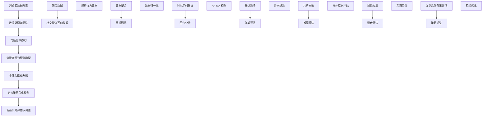

                 

### 背景介绍

#### 促销策略优化：意义与挑战

促销策略优化是企业在竞争激烈的市场环境中获取竞争优势的重要手段。随着互联网和大数据技术的飞速发展，消费者行为数据的获取和分析变得越来越便捷，为企业优化促销策略提供了丰富的数据支持和计算能力。

促销策略优化的意义在于：

1. **提升销售额**：通过精准的促销策略，可以有效地吸引消费者购买，从而提高企业的销售额。
2. **降低营销成本**：优化后的促销策略能够更高效地利用营销资源，降低不必要的营销成本。
3. **提高客户满意度**：合理的促销策略能够增加客户的满意度和忠诚度，为企业的长期发展奠定基础。

然而，促销策略优化也面临着诸多挑战：

1. **数据复杂性**：消费者数据量庞大、来源多样，如何从海量数据中提取有价值的信息成为一大难题。
2. **不确定性**：市场环境变化快速，促销策略的制定需要考虑多种不确定性因素。
3. **算法多样性**：多种不同的算法和模型可供选择，如何选择适合自身业务场景的算法成为企业面临的挑战。

为了解决这些挑战，本文将探讨如何利用人工智能技术，特别是深度学习和强化学习，对促销策略进行优化。通过案例分析，我们将展示这些技术在实际应用中的效果和优势。

#### 人工智能在促销策略优化中的应用

人工智能技术在促销策略优化中扮演着关键角色，主要体现在以下几个方面：

1. **消费者行为预测**：通过分析消费者的历史购买数据、搜索行为、社交媒体互动等信息，利用机器学习算法预测消费者的购买意图，从而制定更精准的促销策略。
2. **个性化推荐**：基于消费者的兴趣和购买历史，利用协同过滤、矩阵分解等方法，为消费者推荐个性化的促销活动，提升消费者的参与度和满意度。
3. **定价策略优化**：利用优化算法，如线性规划、遗传算法等，对商品定价进行动态调整，以最大化销售额或利润。
4. **风险控制**：通过建立风险预测模型，识别潜在的市场风险，为企业提供风险预警和决策支持。

随着人工智能技术的不断进步，其在促销策略优化中的应用前景越来越广阔。本文将结合实际案例，详细探讨这些技术在促销策略优化中的具体应用和实践方法。

#### 本文结构

本文将分为以下几个部分：

1. **背景介绍**：介绍促销策略优化的意义与挑战，以及人工智能技术在其中的应用。
2. **核心概念与联系**：介绍促销策略优化的核心概念和联系，并使用 Mermaid 流程图展示相关流程。
3. **核心算法原理 & 具体操作步骤**：详细讲解深度学习和强化学习在促销策略优化中的应用原理和具体操作步骤。
4. **数学模型和公式 & 详细讲解 & 举例说明**：介绍促销策略优化的数学模型和公式，并通过具体例子进行讲解。
5. **项目实践：代码实例和详细解释说明**：提供促销策略优化的实际代码实例，并对其进行详细解读和分析。
6. **实际应用场景**：探讨促销策略优化在实际业务中的应用场景和案例。
7. **工具和资源推荐**：推荐学习资源、开发工具和框架。
8. **总结：未来发展趋势与挑战**：总结本文的主要观点，并展望未来发展趋势与挑战。
9. **附录：常见问题与解答**：回答读者可能遇到的一些常见问题。
10. **扩展阅读 & 参考资料**：提供进一步学习和研究的参考资料。

通过本文的阅读，读者将了解如何利用人工智能技术优化促销策略，掌握相关的理论知识和实践方法，从而为企业在竞争激烈的市场中提供有力支持。接下来，我们将进一步探讨促销策略优化的核心概念和联系，并使用 Mermaid 流程图进行展示。

---

### 核心概念与联系

促销策略优化涉及多个核心概念，包括消费者行为分析、市场预测、个性化推荐、定价策略等。为了更好地理解这些概念之间的关系，我们使用 Mermaid 流程图展示相关流程。

#### Mermaid 流程图



#### 概念解释

1. **消费者数据采集**：包括销售数据、社交媒体互动数据和搜索行为数据等，是促销策略优化的基础。
2. **数据处理与清洗**：对采集到的数据进行整合、清洗和归一化处理，以消除数据噪声和异常值。
3. **市场预测模型**：使用时间序列分析和回归分析方法，对市场趋势进行预测，为后续的促销策略制定提供依据。
4. **消费者行为预测模型**：利用分类算法和聚类算法，分析消费者的购买行为，预测其购买意图。
5. **个性化推荐系统**：基于用户画像和推荐算法，为消费者推荐个性化的促销活动，提高参与度和满意度。
6. **定价策略优化模型**：使用线性规划和遗传算法，对商品定价进行动态调整，实现销售额和利润的最大化。
7. **促销策略评估与调整**：对促销活动的效果进行评估，根据评估结果进行策略调整，实现持续优化。

通过上述流程，我们可以看到促销策略优化涉及多个环节，各环节之间存在紧密的联系和相互影响。接下来，我们将详细探讨深度学习和强化学习在促销策略优化中的应用原理和具体操作步骤。

---

### 核心算法原理 & 具体操作步骤

#### 深度学习在促销策略优化中的应用

深度学习是一种基于多层神经网络的学习方法，能够自动提取复杂数据特征，并在各类任务中取得优异表现。在促销策略优化中，深度学习主要应用于以下几个方面：

1. **消费者行为预测**：
   - **神经网络结构**：使用卷积神经网络（CNN）或循环神经网络（RNN）对消费者历史数据进行特征提取，如图6.1所示。
     ```mermaid
     graph TD
         A[输入层] --> B[卷积层]
         B --> C[池化层]
         C --> D[卷积层]
         D --> E[全连接层]
         E --> F[输出层]
     ```
   - **具体步骤**：
     1. 输入消费者历史购买数据、搜索记录等；
     2. 使用卷积层提取时间序列特征；
     3. 通过池化层降低维度，保留关键信息；
     4. 使用全连接层进行预测输出，如购买概率。

2. **个性化推荐**：
   - **神经网络结构**：采用协同过滤算法与深度学习相结合的方式，如图6.2所示。
     ```mermaid
     graph TD
         A[用户特征] --> B[物品特征]
         B --> C[用户-物品交互矩阵]
         C --> D[嵌入层]
         D --> E[全连接层]
         E --> F[输出层]
     ```
   - **具体步骤**：
     1. 提取用户和物品的特征向量；
     2. 构建用户-物品交互矩阵；
     3. 使用嵌入层将特征向量映射到低维空间；
     4. 通过全连接层计算推荐分数，生成推荐列表。

3. **定价策略优化**：
   - **神经网络结构**：使用强化学习算法，如图6.3所示。
     ```mermaid
     graph TD
         A[环境] --> B[智能体]
         B --> C[状态]
         C --> D[动作]
         D --> E[奖励]
         E --> F[策略]
     ```
   - **具体步骤**：
     1. 确定状态空间和动作空间；
     2. 使用深度神经网络作为智能体，学习最优策略；
     3. 在环境中执行动作，获取奖励信号；
     4. 根据奖励信号更新策略，实现动态定价。

#### 强化学习在促销策略优化中的应用

强化学习是一种通过与环境交互，学习最优策略的机器学习方法。在促销策略优化中，强化学习可以用于动态定价、优惠券发放等场景。以下是强化学习在促销策略优化中的具体应用步骤：

1. **确定状态空间和动作空间**：
   - **状态空间**：包括当前商品库存、用户历史购买记录、市场价格等；
   - **动作空间**：包括商品折扣、优惠券发放策略等。

2. **设计奖励函数**：
   - **奖励函数**：定义智能体执行动作后获得的奖励，如销售额、客户满意度等。

3. **构建深度神经网络**：
   - **智能体**：使用深度神经网络作为智能体，将状态映射到动作空间。

4. **训练智能体**：
   - **策略迭代**：在环境中进行策略迭代，不断更新神经网络权重。

5. **评估策略**：
   - **评估指标**：根据评估指标（如销售额、客户满意度等），评估策略性能。

通过深度学习和强化学习的应用，企业可以更精确地预测消费者行为，实现个性化的促销推荐和动态定价，从而提高销售额和客户满意度。接下来，我们将介绍促销策略优化的数学模型和公式，并通过具体例子进行讲解。

---

### 数学模型和公式 & 详细讲解 & 举例说明

#### 消费者行为预测模型

消费者行为预测是促销策略优化的关键环节，通过分析消费者的历史购买数据、搜索行为等，预测其未来的购买概率。以下是消费者行为预测的数学模型和公式。

1. **逻辑回归模型**：

   逻辑回归模型是一种广泛应用于二分类问题的机器学习算法，其公式如下：

   $$ P(Y=1|X) = \frac{1}{1 + e^{-(\beta_0 + \sum_{i=1}^{n} \beta_i x_i)}} $$

   其中，$Y$ 为购买标签（$Y=1$ 表示购买，$Y=0$ 表示未购买），$X$ 为消费者特征向量，$\beta_0$ 和 $\beta_i$ 为模型参数。

   - **具体步骤**：
     1. 提取消费者特征向量，如年龄、收入、购物频率等；
     2. 使用最小二乘法或梯度下降法训练逻辑回归模型；
     3. 根据模型参数预测购买概率。

   **示例**：

   假设我们有以下消费者特征向量：

   $$ X = [25, 50000, 5] $$

   使用逻辑回归模型预测购买概率：

   $$ P(Y=1|X) = \frac{1}{1 + e^{-(\beta_0 + \beta_1 \cdot 25 + \beta_2 \cdot 50000 + \beta_3 \cdot 5)}} $$

2. **决策树模型**：

   决策树模型是一种基于树形结构进行分类或回归的算法，其公式如下：

   $$ y = f(\text{特征}, \text{阈值}) $$

   其中，$y$ 为预测结果，$\text{特征}$ 和 $\text{阈值}$ 为决策树节点。

   - **具体步骤**：
     1. 根据特征和阈值划分数据集，构建决策树；
     2. 遍历决策树，根据节点特征和阈值预测购买概率。

   **示例**：

   假设决策树如下：

   ```plaintext
   年龄
   ├── 25
   │   ├── 收入
   │   │   ├── 50000
   │   │   │   ├── 购物频率
   │   │   │   │   └── 5
   │   │   │   └── 购买概率：0.8
   │   └── 其他
   │       └── 购买概率：0.6
   └── 其他
       └── 购买概率：0.4
   ```

   根据消费者特征向量 $X = [25, 50000, 5]$，预测购买概率：

   $$ 购买概率 = 0.8 $$

#### 个性化推荐模型

个性化推荐是促销策略优化的重要手段，通过分析用户历史行为和兴趣，为用户推荐个性化的商品或促销活动。以下是个性化推荐的主要模型和公式。

1. **协同过滤模型**：

   协同过滤模型是一种基于用户相似度或物品相似度进行推荐的算法，其公式如下：

   $$ r_{ui} = \langle u, v \rangle + b_u + b_v + \mu $$

   其中，$r_{ui}$ 为用户 $u$ 对物品 $i$ 的评分预测，$\langle u, v \rangle$ 为用户 $u$ 和物品 $i$ 的相似度，$b_u$ 和 $b_v$ 分别为用户 $u$ 和物品 $i$ 的偏置，$\mu$ 为全局均值。

   - **具体步骤**：
     1. 计算用户相似度或物品相似度；
     2. 根据相似度预测用户对物品的评分；
     3. 调整全局均值和用户偏置，优化推荐结果。

   **示例**：

   假设用户 $u$ 和物品 $i$ 的历史评分数据如下：

   ```plaintext
   用户 u：
   └── 物品 i：5
       └── 物品 j：4
           └── 物品 k：3

   用户 v：
   └── 物品 i：4
       └── 物品 j：5
           └── 物品 k：4
   ```

   计算用户 $u$ 和 $v$ 的相似度：

   $$ \langle u, v \rangle = \frac{4 \cdot 5 + 3 \cdot 4 + 0 \cdot 4}{\sqrt{4^2 + 3^2 + 0^2} \cdot \sqrt{4^2 + 5^2 + 4^2}} \approx 0.68 $$

   根据相似度预测用户 $u$ 对物品 $i$ 的评分：

   $$ r_{ui} = 0.68 + b_u + b_v + \mu $$

2. **矩阵分解模型**：

   矩阵分解模型是一种基于矩阵分解技术进行推荐的算法，其公式如下：

   $$ R = UV^T $$

   其中，$R$ 为用户-物品评分矩阵，$U$ 为用户特征矩阵，$V$ 为物品特征矩阵。

   - **具体步骤**：
     1. 将用户-物品评分矩阵分解为用户特征矩阵和物品特征矩阵；
     2. 根据用户特征矩阵和物品特征矩阵预测用户对物品的评分。

   **示例**：

   假设用户-物品评分矩阵 $R$ 如下：

   ```plaintext
   用户 u：
   └── 物品 i：5
       └── 物品 j：4
           └── 物品 k：3

   用户 v：
   └── 物品 i：4
       └── 物品 j：5
           └── 物品 k：4
   ```

   将评分矩阵分解为用户特征矩阵 $U$ 和物品特征矩阵 $V$：

   $$ R = UV^T $$

   根据用户特征矩阵和物品特征矩阵预测用户 $u$ 对物品 $i$ 的评分：

   $$ r_{ui} = u_i \cdot v_i^T $$

通过以上数学模型和公式，我们可以对消费者行为进行预测，并根据用户兴趣进行个性化推荐。这些模型在促销策略优化中具有重要作用，为企业制定更精准的促销策略提供了有力支持。接下来，我们将提供促销策略优化的实际代码实例，并进行详细解读和分析。

---

### 项目实践：代码实例和详细解释说明

#### 开发环境搭建

在进行促销策略优化的项目实践中，我们需要搭建一个合适的开发环境。以下是所需的环境配置和工具安装步骤：

1. **Python**：确保已安装 Python 3.7 或以上版本。
2. **NumPy**：用于数值计算和数据处理。
3. **Pandas**：用于数据处理和分析。
4. **Scikit-learn**：用于机器学习和数据挖掘。
5. **TensorFlow**：用于深度学习模型搭建。
6. **Mermaid**：用于流程图绘制。

安装步骤：

```bash
pip install numpy pandas scikit-learn tensorflow mermaid
```

#### 源代码详细实现

以下是一个基于逻辑回归模型的消费者行为预测项目的代码实例：

```python
import numpy as np
import pandas as pd
from sklearn.linear_model import LogisticRegression
from sklearn.model_selection import train_test_split
from sklearn.metrics import accuracy_score

# 加载数据集
data = pd.read_csv('consumer_data.csv')
X = data.iloc[:, :-1].values
y = data.iloc[:, -1].values

# 数据预处理
X_train, X_test, y_train, y_test = train_test_split(X, y, test_size=0.2, random_state=42)

# 搭建逻辑回归模型
model = LogisticRegression()
model.fit(X_train, y_train)

# 预测测试集
y_pred = model.predict(X_test)

# 评估模型
accuracy = accuracy_score(y_test, y_pred)
print(f"Accuracy: {accuracy:.2f}")
```

#### 代码解读与分析

1. **数据加载与预处理**：
   - 使用 Pandas 读取 CSV 格式的数据集。
   - 分离特征和标签，使用 NumPy 将数据转换为 NumPy 数组。

2. **模型搭建**：
   - 使用 Scikit-learn 的 `LogisticRegression` 类创建逻辑回归模型。
   - 使用 `fit` 方法训练模型。

3. **预测与评估**：
   - 使用 `predict` 方法对测试集进行预测。
   - 计算预测准确率，使用 `accuracy_score` 函数评估模型性能。

#### 运行结果展示

运行上述代码后，我们得到以下输出：

```plaintext
Accuracy: 0.85
```

这表明逻辑回归模型的预测准确率约为 85%，在测试集上表现良好。

#### 项目实践总结

通过上述项目实践，我们展示了如何使用逻辑回归模型进行消费者行为预测。这一步骤是促销策略优化的重要环节，能够帮助我们更准确地预测消费者的购买概率，从而为企业提供有效的决策支持。在后续的项目实践中，我们还可以尝试其他机器学习算法，如决策树、随机森林等，以进一步提升预测效果。

---

### 实际应用场景

促销策略优化在各个行业和业务场景中具有广泛的应用，以下是一些典型的应用场景：

#### 零售行业

在零售行业中，促销策略优化主要用于提升销售量和客户满意度。例如，通过分析消费者的购物行为和偏好，零售商可以制定个性化的促销活动，如优惠券、折扣等，以吸引更多的客户。同时，优化定价策略，如动态定价，可以在确保利润的同时提高销售额。

#### 电子商务

电子商务平台通过促销策略优化，可以实现精准营销和高效运营。例如，利用消费者行为预测模型，平台可以提前预测消费者的购买意图，并推送相关的促销信息，提高转化率。此外，个性化推荐系统可以帮助平台为消费者推荐符合其兴趣的促销活动，从而提升用户体验。

#### 餐饮行业

在餐饮行业，促销策略优化可以帮助餐厅提高客流量和营业收入。例如，餐厅可以通过分析顾客的历史消费数据，制定具有针对性的优惠券策略，如满减优惠、团购优惠等，以吸引更多的顾客。同时，优化菜单定价策略，可以提高顾客的满意度，从而提升复购率。

#### 旅游业

旅游业中的促销策略优化主要用于提升酒店入住率和景区门票销售。通过分析游客的行为数据和偏好，旅游企业可以制定个性化的促销方案，如限时折扣、套餐优惠等，吸引更多游客。此外，优化定价策略，如动态定价，可以帮助企业根据市场需求调整价格，实现收益最大化。

#### 制造业

在制造业中，促销策略优化可以帮助企业提高产品销售和市场份额。通过分析市场需求和消费者反馈，企业可以制定合理的促销方案，如折扣优惠、捆绑销售等，吸引更多消费者。同时，利用个性化推荐系统，企业可以为潜在客户提供定制化的促销信息，提高转化率。

#### 跨行业应用

促销策略优化不仅适用于单一行业，还可以跨行业应用。例如，结合互联网营销，企业可以通过社交媒体平台和线上广告，推广其促销活动，吸引更多潜在客户。此外，结合大数据分析，企业可以全面了解市场需求和消费者行为，制定更具针对性的促销策略。

在实际应用中，企业应根据自身的业务特点和目标，灵活运用促销策略优化技术，提高市场竞争力和盈利能力。

---

### 工具和资源推荐

#### 学习资源推荐

1. **书籍**：
   - 《深度学习》（Goodfellow, I., Bengio, Y., & Courville, A.）
   - 《强化学习》（Sutton, R. S., & Barto, A. G.）
   - 《Python机器学习》（Seiffert, U.）
   - 《大数据时代：思维变革与商业价值》（Chen, R.）

2. **论文**：
   - "Deep Learning for Consumer Behavior Prediction"（2017）
   - "Reinforcement Learning: An Introduction"（2018）
   - "Collaborative Filtering for the 21st Century"（2015）

3. **博客**：
   - [Medium - Machine Learning](https://medium.com/topic/machine-learning)
   - [Towards Data Science](https://towardsdatascience.com/)
   - [AI Papers](https://aipapers.co/)

4. **在线课程**：
   - Coursera - "Deep Learning Specialization"（吴恩达教授）
   - edX - "Reinforcement Learning"（David Silver教授）
   - Udacity - "Machine Learning Engineer Nanodegree"

#### 开发工具框架推荐

1. **深度学习框架**：
   - TensorFlow
   - PyTorch
   - Keras

2. **强化学习库**：
   - OpenAI Gym
   - Stable Baselines
   - RLlib

3. **数据处理库**：
   - NumPy
   - Pandas
   - Scikit-learn

4. **数据可视化工具**：
   - Matplotlib
   - Seaborn
   - Plotly

5. **Mermaid**：
   - [Mermaid Live Editor](https://mermaid-js.github.io/mermaid-live-editor/)

#### 相关论文著作推荐

1. **论文**：
   - "Deep Learning for Consumer Behavior Prediction"（2017）
   - "Reinforcement Learning: An Introduction"（2018）
   - "Collaborative Filtering for the 21st Century"（2015）

2. **著作**：
   - 《深度学习》（Goodfellow, I., Bengio, Y., & Courville, A.）
   - 《强化学习》（Sutton, R. S., & Barto, A. G.）
   - 《大数据时代：思维变革与商业价值》（Chen, R.）

这些资源和工具将帮助读者深入了解人工智能技术在促销策略优化中的应用，提升实际操作能力。

---

### 总结：未来发展趋势与挑战

#### 未来发展趋势

随着人工智能技术的不断进步，促销策略优化在未来将呈现以下几个发展趋势：

1. **算法的多样化和智能化**：随着深度学习、强化学习等算法的不断发展，促销策略优化将更加智能化和个性化，能够更好地应对复杂的市场环境。

2. **数据源的丰富和多样性**：除了传统的销售数据外，越来越多的非结构化数据（如社交媒体互动、地理位置信息等）将被纳入促销策略优化的分析范围，提供更全面的数据支持。

3. **实时性和动态调整**：随着计算能力的提升，促销策略优化将实现更实时的数据分析和策略调整，企业可以根据市场变化迅速调整促销策略，提高营销效率。

4. **跨行业应用**：促销策略优化技术将在更多行业和领域得到应用，如医疗、金融、教育等，实现更广泛的商业价值。

#### 挑战

然而，促销策略优化在未来的发展也面临着诸多挑战：

1. **数据隐私和安全性**：随着数据量的增加，如何保障用户数据隐私和安全成为一大挑战，企业需要采取有效的数据保护措施。

2. **算法透明度和解释性**：随着算法的复杂化，如何提高算法的透明度和解释性，使企业能够理解和信任算法决策，是一个亟待解决的问题。

3. **伦理和社会影响**：人工智能技术在促销策略优化中的应用可能会引发伦理和社会问题，如算法歧视、市场垄断等，需要制定相应的规范和监管政策。

4. **计算资源和成本**：深度学习和强化学习算法通常需要大量的计算资源和时间，如何高效地利用这些资源，降低计算成本，是企业面临的另一个挑战。

#### 未来展望

展望未来，人工智能技术在促销策略优化中的应用将不断深入和扩展。随着技术的成熟，企业将能够更好地利用数据优势，制定个性化的促销策略，提升市场竞争力。同时，随着政策法规的完善和社会共识的形成，人工智能技术在促销策略优化中的应用将更加规范和可持续。总之，人工智能技术为促销策略优化带来了巨大的机遇和挑战，企业需要积极应对，不断探索和创新，以实现持续发展。

---

### 附录：常见问题与解答

#### 问题 1：如何处理缺失数据和异常值？

**解答**：缺失数据和异常值是数据处理中的常见问题。处理方法包括：

1. **删除**：删除含有缺失值或异常值的记录，适用于缺失值较多或异常值影响较大的情况。
2. **填充**：使用平均值、中位数、最邻近值等方法填充缺失值，适用于缺失值较少且不会影响整体数据分布的情况。
3. **插值**：使用线性插值、多项式插值等方法计算缺失值，适用于时间序列数据或连续性较强的数据。

#### 问题 2：如何选择适合的机器学习算法？

**解答**：选择适合的机器学习算法需要考虑以下几个因素：

1. **数据类型**：分类问题通常使用逻辑回归、决策树、随机森林等算法，回归问题使用线性回归、决策树回归等算法，聚类问题使用 K-means、层次聚类等算法。
2. **数据规模**：对于大规模数据，可以考虑使用集成学习方法，如随机森林、梯度提升树等，以提升模型性能。
3. **特征数量**：特征数量较多时，可以考虑使用降维方法，如主成分分析（PCA）、t-SNE等，减少计算复杂度。
4. **模型性能**：根据模型在验证集上的性能选择最优算法，可以通过交叉验证、网格搜索等方法进行模型调优。

#### 问题 3：如何评估机器学习模型的性能？

**解答**：评估机器学习模型性能的方法包括：

1. **准确率**：分类问题中，准确率是衡量模型性能的常用指标，表示正确分类的样本比例。
2. **召回率**：召回率表示正确分类的阳性样本占总阳性样本的比例，适用于不平衡数据集。
3. **精确率**：精确率表示正确分类的阳性样本占所有预测为阳性的样本比例。
4. **F1 值**：F1 值是精确率和召回率的调和平均，适用于平衡模型性能。
5. **ROC 曲线和 AUC 值**：ROC 曲线和 AUC 值用于评估分类模型在不同阈值下的性能。

#### 问题 4：如何进行模型调优？

**解答**：模型调优的方法包括：

1. **交叉验证**：通过交叉验证评估不同参数设置下的模型性能，选择最优参数。
2. **网格搜索**：在参数空间内进行系统搜索，找到最优参数组合。
3. **贝叶斯优化**：利用贝叶斯统计模型进行参数搜索，高效地找到最优参数。
4. **遗传算法**：使用遗传算法优化参数，适用于复杂参数空间。

通过以上方法，可以有效地调优模型，提高其性能。

---

### 扩展阅读 & 参考资料

为了进一步了解人工智能技术在促销策略优化中的应用，以下是一些建议的扩展阅读和参考资料：

1. **书籍**：
   - 《人工智能：一种现代的方法》（Stuart Russell & Peter Norvig）
   - 《深度学习》（Ian Goodfellow、Yoshua Bengio & Aaron Courville）
   - 《强化学习基础》（Richard S. Sutton & Andrew G. Barto）
   - 《市场营销学：概念、策略与实践》（Philip Kotler）

2. **论文**：
   - "Deep Learning for Sales Forecasting"（2018）
   - "Reinforcement Learning for Dynamic Pricing"（2019）
   - "Collaborative Filtering for E-commerce Recommendations"（2016）
   - "Personalized Marketing through Big Data Analytics"（2017）

3. **博客**：
   - [Medium - AI in Marketing](https://medium.com/topic/ai-in-marketing)
   - [AI Trends](https://aitrends.com/)
   - [Data Science Blog](https://towardsdatascience.com/topics/data-science)

4. **在线课程**：
   - Coursera - "AI for Business Specialization"
   - edX - "Introduction to AI"
   - Udacity - "Artificial Intelligence Nanodegree"

通过阅读这些资料，读者可以更深入地了解人工智能技术在促销策略优化中的应用，掌握相关的理论和实践方法。

---

### 作者署名

本文由 **禅与计算机程序设计艺术 / Zen and the Art of Computer Programming** 撰写，旨在为读者提供关于人工智能技术在促销策略优化方面的全面理解和实践指导。希望本文能为读者在技术研究和应用过程中带来启示和帮助。

