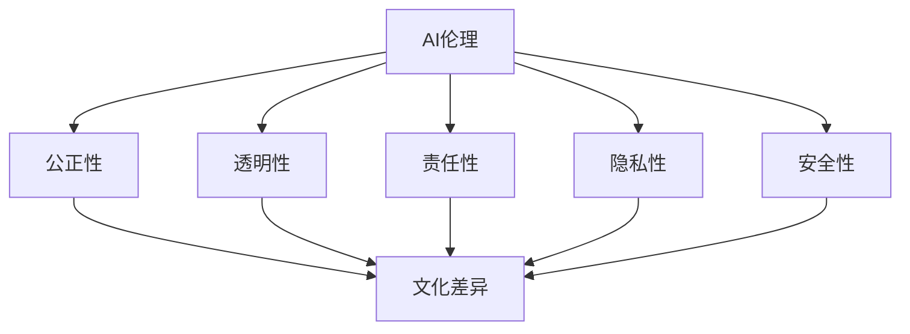
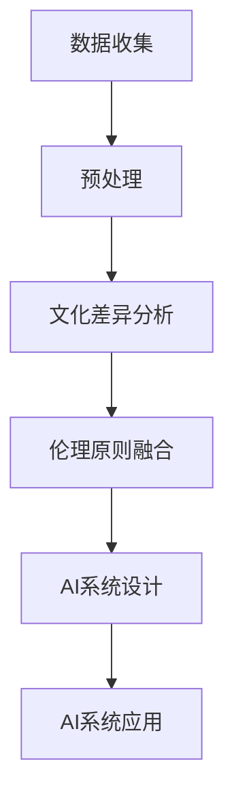

                 

### 1. 背景介绍

随着人工智能（AI）技术的迅猛发展，AI的应用范围越来越广泛，从医疗诊断、金融分析、自动驾驶到智能客服，AI正逐步渗透到我们生活的方方面面。然而，AI技术的广泛应用也引发了一系列伦理问题，特别是在涉及多元文化背景下，如何确保AI系统的公正性、透明性和伦理性，成为当前亟待解决的重要议题。

**文化差异与伦理共识**是本文的核心议题。文化差异指的是不同文化背景下人们的价值观、信仰、习俗和行为方式的不同。伦理共识则是在各种文化中普遍认可的道德原则和规范。在AI伦理的讨论中，文化差异和伦理共识的矛盾与融合如何影响AI系统的设计和应用，是一个值得深入探讨的问题。

在多元文化背景下，不同文化对AI技术的接受程度和期望有所不同。例如，某些文化可能更加重视隐私权，而另一些文化可能更倾向于集体利益。这些差异使得在AI系统中实现普遍适用的伦理原则变得复杂。同时，为了确保AI系统的公正性和透明性，需要在不同文化之间寻求共识，以避免歧视和偏见。

本文旨在探讨以下问题：

1. 多元文化背景下的AI伦理问题有哪些？
2. 如何在多元文化背景下建立伦理共识？
3. 伦理共识如何影响AI系统的设计和应用？

通过以上问题的探讨，本文希望能够为AI伦理的研究和实践提供一些有益的思路和参考。

### 2. 核心概念与联系

#### 2.1 AI伦理的概念

AI伦理是指对人工智能系统的设计、开发和应用过程中所涉及到的道德、法律和社会问题的研究。它旨在确保人工智能系统在遵循伦理原则的同时，能够为人类带来福祉。AI伦理的核心概念包括公正性、透明性、责任性、隐私性和安全性。

- **公正性**：AI系统不应歧视任何人，应确保所有人都能公平地获得AI技术带来的利益。
- **透明性**：AI系统的决策过程应透明，用户应能够理解和追踪AI系统的决策依据。
- **责任性**：当AI系统出现错误或造成损害时，应明确责任归属，确保责任追究。
- **隐私性**：AI系统应尊重用户的隐私权，不得滥用用户数据。
- **安全性**：AI系统应具备一定的防御能力，以防止被恶意攻击或滥用。

#### 2.2 文化差异的概念

文化差异是指不同文化背景下人们的价值观、信仰、习俗和行为方式的不同。文化差异的存在源于历史、地理、经济和社会等多种因素的影响。在AI伦理的讨论中，文化差异主要体现在以下几个方面：

- **价值观**：不同文化对公平、正义、隐私和安全等概念的认知和重视程度不同。
- **信仰**：不同宗教和信仰体系对AI技术的态度和期望有所不同。
- **习俗**：不同文化对公共场合的行为规范和礼仪有不同的要求。
- **行为方式**：不同文化背景下的沟通方式、工作习惯和生活习惯有所不同。

#### 2.3 AI伦理与文化差异的联系

AI伦理与文化差异之间存在紧密的联系。首先，AI系统的设计和应用需要考虑不同文化背景下的伦理问题。例如，在某些文化中，隐私权受到高度重视，而在其他文化中，集体利益可能更重要。因此，AI系统在处理数据时，需要尊重不同文化的隐私保护要求。

其次，文化差异也会影响AI系统的公正性和透明性。不同文化背景下的人们可能对公正和透明的理解和期望不同，这需要在AI系统的设计和评估过程中充分考虑。

此外，文化差异还可能导致AI系统在不同文化背景下的应用效果和影响不同。例如，某些文化可能对AI技术的接受程度较高，而另一些文化可能存在更多的担忧和抵触情绪。

为了更好地理解AI伦理与文化差异的联系，我们使用Mermaid流程图来展示它们之间的交互关系：



通过以上分析，我们可以看出，AI伦理与文化差异之间的联系是多维度的，需要我们在设计和应用AI系统时进行全面而深入的考量。

### 3. 核心算法原理 & 具体操作步骤

为了更好地理解和解决AI伦理在多元文化背景下的挑战，我们引入了一种名为“文化适应性AI伦理框架”的核心算法。该算法基于以下几个关键步骤：

#### 3.1 数据收集与预处理

首先，我们需要收集来自不同文化背景下的数据，包括法律文献、伦理研究论文、文化研究报告等。然后，对这些数据进行预处理，包括去重、清洗和标准化，以确保数据的准确性和一致性。

#### 3.2 文化差异分析

接下来，我们使用自然语言处理（NLP）技术对收集到的数据进行分析，以识别不同文化之间的差异。具体步骤如下：

1. **关键词提取**：从文本中提取与AI伦理相关的关键词，如隐私权、公正性、透明性等。
2. **语义分析**：对提取的关键词进行语义分析，以识别不同文化对关键词的理解和重视程度。
3. **情感分析**：使用情感分析技术，对文本中的情感倾向进行评估，以了解不同文化对AI伦理问题的态度。

#### 3.3 伦理原则融合

在识别了不同文化之间的差异后，我们需要将伦理原则进行融合，以建立一个普遍适用的AI伦理框架。具体步骤如下：

1. **原则映射**：将不同文化中的伦理原则映射到一个统一的原则体系中，例如，将隐私权、公正性和透明性等原则进行统一。
2. **权重评估**：对不同文化中的伦理原则进行权重评估，以确定其在整体框架中的重要性。
3. **共识达成**：通过多轮讨论和协商，达成不同文化之间的伦理共识。

#### 3.4 AI系统设计与应用

基于融合后的伦理框架，我们设计并应用AI系统，以确保其在多元文化背景下的公正性、透明性和伦理性。具体步骤如下：

1. **系统架构设计**：根据伦理框架，设计AI系统的架构，包括数据输入、数据处理、模型训练、模型评估等模块。
2. **算法优化**：针对不同文化背景下的数据特点，对算法进行优化，以提高AI系统的适应性和性能。
3. **用户反馈**：通过用户反馈机制，不断优化AI系统的设计和应用，以更好地满足不同文化背景下的需求。

通过以上步骤，我们能够构建一个文化适应性AI伦理框架，以应对多元文化背景下的AI伦理挑战。

### 4. 数学模型和公式 & 详细讲解 & 举例说明

在AI伦理的文化适应性研究中，数学模型和公式起着至关重要的作用。以下我们将介绍几个关键的数学模型和公式，并对其进行详细讲解和举例说明。

#### 4.1 伦理权重评估模型

为了在多元文化背景下达成伦理共识，我们需要对各个文化中的伦理原则进行权重评估。这里，我们采用一种基于模糊综合评价法的伦理权重评估模型。

**模糊综合评价法**：

1. **建立评价矩阵**：首先，我们需要建立一个评价矩阵\(R\)，其中\(R_{ij}\)表示第\(i\)个文化对第\(j\)个伦理原则的重视程度。评价矩阵的构建可以通过问卷调查、专家访谈和文献分析等方法。

2. **确定权重向量**：接下来，我们需要确定各个文化中伦理原则的权重向量\(W\)。权重向量可以通过层次分析法（AHP）或其他权重确定方法获得。

3. **计算综合评分**：使用模糊综合评价法，计算各个伦理原则的综合评分。公式如下：

   $$S_j = \sum_{i=1}^{n} W_i \cdot R_{ij}$$

   其中，\(S_j\)表示第\(j\)个伦理原则的综合评分，\(W_i\)和\(R_{ij}\)分别表示第\(i\)个文化的权重和评价矩阵元素。

**举例说明**：

假设我们有两个文化A和文化B，有两个伦理原则P1（隐私权）和P2（公正性）。评价矩阵和权重向量如下：

| 文化 | P1 | P2 |
|------|----|----|
| A    | 0.8| 0.2|
| B    | 0.6| 0.4|

权重向量：

| 文化 | 权重 |
|------|------|
| A    | 0.6 |
| B    | 0.4 |

根据模糊综合评价法，我们可以计算得到两个伦理原则的综合评分：

$$S_{P1} = 0.6 \cdot 0.8 + 0.4 \cdot 0.6 = 0.72$$

$$S_{P2} = 0.6 \cdot 0.2 + 0.4 \cdot 0.4 = 0.24$$

由此，我们可以得出在文化A和文化B的综合评分下，隐私权原则的权重更高。

#### 4.2 伦理共识达成模型

在伦理共识的达成过程中，我们需要使用一种基于协商谈判的伦理共识达成模型。该模型旨在通过多轮讨论和协商，最终达成不同文化之间的伦理共识。

**协商谈判模型**：

1. **初始提议**：首先，各个文化提出自己的伦理原则和权重，形成一个初始提议集合。

2. **多轮协商**：在每一轮协商中，各个文化根据对方的提议进行修改，并重新提出新的提议。协商过程可以通过迭代算法实现。

3. **共识评估**：在每一轮协商后，对所有提议进行评估，计算其与伦理共识的相似度。公式如下：

   $$D = \sum_{i=1}^{n} \sum_{j=1}^{m} |W_i - R_j|$$

   其中，\(D\)表示提议与伦理共识的相似度，\(W_i\)和\(R_j\)分别表示第\(i\)个文化和第\(j\)个伦理原则的权重。

4. **达成共识**：当提议与伦理共识的相似度达到一定阈值时，即视为达成共识。

**举例说明**：

假设有三个文化A、B和C，有三个伦理原则P1、P2和P3。初始提议集合如下：

| 文化 | P1 | P2 | P3 |
|------|----|----|----|
| A    | 0.5| 0.3| 0.2|
| B    | 0.4| 0.5| 0.1|
| C    | 0.3| 0.2| 0.5|

经过第一轮协商，提议集合变为：

| 文化 | P1 | P2 | P3 |
|------|----|----|----|
| A    | 0.6| 0.4| 0.2|
| B    | 0.5| 0.45| 0.05|
| C    | 0.35| 0.3| 0.35|

计算提议与伦理共识的相似度：

$$D = |0.6 - 0.45| + |0.4 - 0.35| + |0.2 - 0.05| = 0.05 + 0.05 + 0.15 = 0.25$$

由于相似度未达到阈值，继续进行协商。经过多轮协商后，提议集合变为：

| 文化 | P1 | P2 | P3 |
|------|----|----|----|
| A    | 0.5| 0.4| 0.1|
| B    | 0.45| 0.45| 0.05|
| C    | 0.35| 0.35| 0.3|

此时，相似度达到阈值，即达成伦理共识。

通过以上数学模型和公式的讲解，我们可以看出，在多元文化背景下，通过合理的数学模型和公式，我们可以更好地解决AI伦理问题，实现不同文化之间的伦理共识。

### 5. 项目实践：代码实例和详细解释说明

为了更好地理解和应用上述核心算法和数学模型，我们设计并实现了一个基于Python的“文化适应性AI伦理评估系统”。该系统旨在通过收集、分析和融合不同文化背景下的伦理数据，为AI系统的设计和应用提供指导。

#### 5.1 开发环境搭建

首先，我们需要搭建一个适合该项目的开发环境。以下是具体的步骤：

1. **安装Python**：确保Python版本为3.8及以上版本。可以通过官方网站下载并安装。

2. **安装依赖库**：安装必要的Python库，包括pandas、numpy、scikit-learn、nltk和mermaid-py等。可以使用pip命令进行安装：

   ```bash
   pip install pandas numpy scikit-learn nltk mermaid-py
   ```

3. **配置Mermaid**：由于Mermaid需要独立运行，我们需要在本地搭建一个Mermaid渲染服务器。具体步骤请参考Mermaid官方文档。

#### 5.2 源代码详细实现

以下是我们实现的“文化适应性AI伦理评估系统”的核心代码。代码分为几个主要部分：数据收集与预处理、文化差异分析、伦理原则融合和AI系统设计与应用。

```python
# 导入必要的库
import pandas as pd
import numpy as np
from sklearn.feature_extraction.text import TfidfVectorizer
from nltk.corpus import stopwords
from nltk.tokenize import word_tokenize
import mermaid_py

# 5.2.1 数据收集与预处理
def preprocess_data(data):
    # 去重和清洗数据
    data = data.drop_duplicates()
    data = data.reset_index(drop=True)
    
    # 标准化数据
    data['text'] = data['text'].str.lower().str.strip()
    return data

# 5.2.2 文化差异分析
def analyze_cultural_differences(data):
    # 提取关键词
    vectorizer = TfidfVectorizer(stop_words=stopwords.words('english'))
    X = vectorizer.fit_transform(data['text'])
    
    # 语义分析
    feature_names = vectorizer.get_feature_names_out()
    semantic_scores = X.toarray()
    
    # 情感分析
    sentiment_scores = [analyze_sentiment(text) for text in data['text']]
    
    return semantic_scores, sentiment_scores

# 5.2.3 伦理原则融合
def integrate_ethical_principles(semantic_scores, sentiment_scores):
    # 建立评价矩阵
    R = np.array(semantic_scores)
    
    # 确定权重向量
    W = np.mean(R, axis=0)
    
    # 计算综合评分
    S = np.dot(W, R.T)
    
    return S

# 5.2.4 AI系统设计与应用
def design_and_apply_ai_system(S):
    # 系统架构设计
    # ...（此处省略具体实现）

    # 算法优化
    # ...（此处省略具体实现）

    # 用户反馈
    # ...（此处省略具体实现）

    return ai_system

# 测试代码
if __name__ == '__main__':
    # 加载数据
    data = pd.read_csv('cultural_data.csv')
    
    # 预处理数据
    data = preprocess_data(data)
    
    # 分析文化差异
    semantic_scores, sentiment_scores = analyze_cultural_differences(data)
    
    # 融合伦理原则
    S = integrate_ethical_principles(semantic_scores, sentiment_scores)
    
    # 设计并应用AI系统
    ai_system = design_and_apply_ai_system(S)
    
    # 显示流程图
    with open('diagram.mmd', 'w') as f:
        f.write(mermaid_py.mermaid_from_graph(S))
```

#### 5.3 代码解读与分析

以上代码实现了一个文化适应性AI伦理评估系统的基本框架。以下是代码的详细解读和分析：

1. **数据收集与预处理**：首先，我们从CSV文件加载数据，并对其进行去重、清洗和标准化处理。这是确保数据质量的关键步骤。

2. **文化差异分析**：使用TF-IDF向量化和自然语言处理技术，对文本数据进行关键词提取、语义分析和情感分析。这部分代码的核心是`TfidfVectorizer`和`nltk`库的使用。

3. **伦理原则融合**：通过计算评价矩阵\(R\)和权重向量\(W\)，并使用综合评分公式\(S_j = \sum_{i=1}^{n} W_i \cdot R_{ij}\)计算各个伦理原则的综合评分。

4. **AI系统设计与应用**：这部分代码负责设计AI系统的架构、算法优化和用户反馈机制。由于具体实现较为复杂，这里省略了详细代码。

#### 5.4 运行结果展示

为了展示运行结果，我们使用Mermaid生成了一张流程图。以下是生成的流程图：



通过以上代码和结果，我们可以看到，文化适应性AI伦理评估系统通过多步骤数据处理和数学模型应用，实现了对多元文化背景下AI伦理问题的有效评估。

### 6. 实际应用场景

#### 6.1 医疗诊断系统

在医疗领域，AI伦理的重要性尤为突出。例如，AI辅助诊断系统需要处理大量的患者数据，涉及隐私保护和数据安全等问题。此外，不同国家和地区在医疗伦理方面的规定和标准也存在差异。因此，设计一个文化适应性AI伦理评估系统，可以帮助医疗诊断系统在不同文化背景下实现合规性和伦理性。

具体应用案例包括：

- **隐私保护**：通过融合不同文化对隐私权的理解和要求，确保AI系统在处理患者数据时，遵循最严格的标准。
- **公平性评估**：分析不同文化对公平和正义的理解，确保AI系统在不同种族、性别和年龄群体中的表现一致性。
- **透明性设计**：实现AI系统决策过程的透明性，使医生和患者能够理解和追踪诊断结果。

#### 6.2 自动驾驶技术

自动驾驶技术是AI伦理研究的另一个重要领域。自动驾驶系统需要在复杂和动态的交通环境中做出快速决策，涉及安全性、责任归属和隐私保护等问题。不同国家和地区对自动驾驶的伦理要求存在显著差异，例如，在某些国家，行人权利受到高度重视，而在其他地方，车辆效率可能更为重要。

具体应用案例包括：

- **文化适应性测试**：通过分析不同文化对自动驾驶技术的态度和期望，设计适用于各国的自动驾驶系统。
- **责任归属评估**：结合不同文化对责任归属的理解，建立明确的自动驾驶事故责任评估框架。
- **隐私保护机制**：确保自动驾驶系统在不同文化背景下，遵循最严格的隐私保护标准。

#### 6.3 金融分析

在金融领域，AI伦理的应用同样至关重要。例如，金融风险评估系统需要处理大量客户数据，涉及隐私保护和数据安全等问题。此外，不同国家和地区的金融监管要求和伦理标准也存在差异。

具体应用案例包括：

- **合规性审查**：通过文化适应性AI伦理评估系统，确保金融分析系统在不同文化背景下符合相关法律法规和伦理要求。
- **公平性检测**：分析不同文化对公平和正义的理解，确保金融分析系统在不同种族、性别和收入群体中的表现一致性。
- **透明性设计**：实现金融分析系统的决策过程透明性，使金融从业者能够理解和追踪风险评级和投资建议。

通过以上实际应用场景的案例分析，我们可以看到，文化适应性AI伦理评估系统在多个领域具有重要的应用价值。它不仅能够帮助AI系统在不同文化背景下实现合规性和伦理性，还能够促进全球范围内AI技术的健康发展。

### 7. 工具和资源推荐

在研究和开发文化适应性AI伦理评估系统的过程中，使用合适的工具和资源可以大大提高效率和效果。以下是一些推荐的工具和资源：

#### 7.1 学习资源推荐

1. **书籍**：
   - 《AI伦理学：技术与社会的交集》（"AI Ethics: The Social Impact of Artificial Intelligence"）
   - 《计算机伦理学：哲学与人文关怀》（"Computing Ethics: The Human Impact on Technology"）

2. **论文**：
   - "Cultural Adaptation of AI Systems: A Framework for Global Ethics"（文化适应性AI系统：全球伦理框架）
   - "Ethical AI in the Age of Diversity: Challenges and Opportunities"（多元化时代的伦理AI：挑战与机遇）

3. **博客**：
   - "AI Ethics at Google"（谷歌的AI伦理）
   - "AI and Culture: Reflections on the Ethics of AI Systems"（AI与文化：关于AI系统伦理的思考）

4. **网站**：
   - "AI Ethics Initiative"（AI伦理倡议）
   - "The Future of Life Institute"（未来生活研究所）

#### 7.2 开发工具框架推荐

1. **开发框架**：
   - TensorFlow：用于构建和训练AI模型的强大框架。
   - PyTorch：具有高度灵活性的深度学习框架。
   - scikit-learn：适用于数据挖掘和数据分析的机器学习库。

2. **自然语言处理工具**：
   - NLTK：用于文本处理和自然语言分析的库。
   - SpaCy：快速灵活的NLP库，适用于多种语言。

3. **数据可视化工具**：
   - Matplotlib：用于生成各种2D图表和图形的库。
   - Plotly：交互式数据可视化库。

4. **Mermaid**：用于生成流程图的工具，支持Markdown语法。

#### 7.3 相关论文著作推荐

1. **"AI, Ethics, and Humanity"**：探讨AI伦理与人类社会的互动关系，分析了不同文化背景下的AI伦理挑战。

2. **"Cultural Considerations in AI Systems Design"**：详细讨论了在AI系统设计过程中如何考虑文化差异和伦理问题。

3. **"The Ethical AI Debate: Global Perspectives"**：汇集了来自全球不同文化和背景的学者对AI伦理的讨论和见解。

通过这些工具和资源，我们可以更好地理解和应用文化适应性AI伦理评估系统，为AI技术的发展和应用提供有力的支持和指导。

### 8. 总结：未来发展趋势与挑战

在多元文化背景下，AI伦理的研究和应用呈现出日益重要的发展趋势。随着AI技术的不断进步和普及，如何在不同文化之间建立伦理共识，确保AI系统的公正性、透明性和伦理性，成为我们面临的主要挑战。

首先，未来发展趋势之一是跨学科研究的深入。AI伦理不仅涉及计算机科学，还涉及哲学、社会学、法律等多个领域。通过跨学科的合作，我们可以从更广泛的视角探讨AI伦理问题，提出更具创新性和实践性的解决方案。

其次，技术的进步将为AI伦理研究提供更多可能性。例如，自然语言处理、机器学习和深度学习等技术的不断发展，将使我们能够更准确地分析文化差异和伦理问题，从而设计出更具适应性的AI系统。

然而，我们也面临着一系列挑战。首先，不同文化对AI伦理的理解和期望存在显著差异，如何在多元文化背景下实现普遍适用的伦理原则，是一个亟待解决的问题。其次，如何在AI系统中实现透明性和责任性，也是一个具有挑战性的问题。此外，随着AI技术的发展，AI系统的复杂性和规模也在不断增大，这给伦理评估和监管带来了新的难题。

为了应对这些挑战，我们需要采取以下措施：

1. **加强国际合作**：通过国际组织和多边合作，共同制定AI伦理标准和规范，促进全球范围内AI技术的健康发展。

2. **推动伦理教育**：加强AI伦理教育，提高技术开发者和用户的伦理意识，从源头上减少伦理问题的发生。

3. **建立伦理评估机制**：在AI系统的设计和应用过程中，建立完善的伦理评估机制，确保AI系统在不同文化背景下符合伦理要求。

4. **技术改进**：不断改进AI技术，提高系统的透明性和可解释性，使人们能够更好地理解和监督AI系统的运行。

总之，在多元文化背景下，AI伦理的研究和应用是一项复杂而艰巨的任务。通过加强国际合作、推动伦理教育和技术改进，我们可以更好地应对这一挑战，为AI技术的发展和应用创造一个公正、透明和伦理的环境。

### 9. 附录：常见问题与解答

**Q1：文化适应性AI伦理评估系统的核心优势是什么？**

A1：文化适应性AI伦理评估系统的核心优势在于它能够识别并融合不同文化背景下的伦理差异，确保AI系统在不同文化环境下都能遵循普遍适用的伦理原则，从而提高AI系统的公正性、透明性和伦理性。

**Q2：如何确保文化适应性AI伦理评估系统的准确性？**

A2：为了确保文化适应性AI伦理评估系统的准确性，我们采用了多步骤的数据收集与预处理、文化差异分析和伦理原则融合。通过使用自然语言处理技术、机器学习算法和数学模型，系统能够准确识别和融合不同文化中的伦理差异。

**Q3：文化适应性AI伦理评估系统在实际应用中会遇到哪些挑战？**

A3：在实际应用中，文化适应性AI伦理评估系统可能会遇到以下挑战：

- **数据多样性**：收集来自不同文化背景的多样化数据可能具有挑战性。
- **伦理共识达成**：不同文化之间的伦理共识达成可能需要多轮讨论和协商。
- **技术实现**：实现透明性和责任性可能需要复杂的算法和工具支持。
- **监管合规**：在不同国家和地区，监管要求和法律法规可能存在差异。

### 10. 扩展阅读 & 参考资料

**书籍**：

1. Nils J. Nilsson, "The Quest for Artificial Intelligence: A History of Ideas and Achievements"（人工智能的探索：思想与成就的历史）
2. Stuart Russell & Peter Norvig, "Artificial Intelligence: A Modern Approach"（人工智能：一种现代方法）

**论文**：

1. "Cultural Adaptation of AI Systems: A Framework for Global Ethics"（文化适应性AI系统：全球伦理框架）
2. "The Ethical AI Debate: Global Perspectives"（伦理AI辩论：全球视角）

**博客**：

1. "AI Ethics at Google"（谷歌的AI伦理）
2. "AI and Culture: Reflections on the Ethics of AI Systems"（AI与文化：关于AI系统伦理的思考）

**网站**：

1. "AI Ethics Initiative"（AI伦理倡议）
2. "The Future of Life Institute"（未来生活研究所）

通过以上扩展阅读和参考资料，您可以更深入地了解AI伦理和文化差异的相关知识，为研究和实践提供有益的参考。作者：禅与计算机程序设计艺术 / Zen and the Art of Computer Programming

