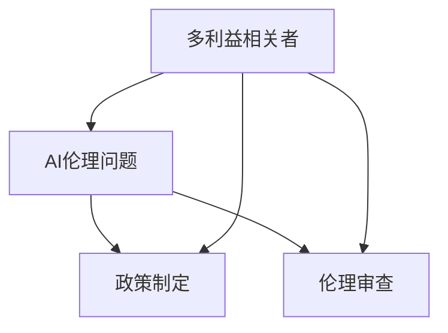

                 

### 1. 背景介绍

AI伦理的多利益相关者参与：政策制定和伦理审查

随着人工智能技术的迅猛发展，AI伦理问题日益受到关注。从自动驾驶汽车的安全性问题，到社交媒体平台上的虚假信息传播，AI伦理已经成为各界关注的焦点。在这个背景下，AI伦理的多利益相关者参与成为了一个热门话题。

多利益相关者参与是指在AI伦理问题处理过程中，不仅仅涉及AI技术开发者和研究机构，还包括政府机构、用户、公众、利益相关方等。他们各自从不同的角度对AI伦理问题进行讨论、评估和决策，以期达到最优的伦理解决方案。

政策制定和伦理审查是AI伦理问题处理过程中不可或缺的两个环节。政策制定是指制定相关的法律法规、标准、指南等，以规范AI技术的研究、开发和应用。伦理审查则是对AI技术可能带来的伦理风险进行评估，确保其符合伦理标准。

然而，多利益相关者参与在政策制定和伦理审查中面临诸多挑战。首先，不同利益相关者之间的利益诉求存在冲突，如技术公司追求商业利润，政府关注公共安全，用户关注隐私保护等。其次，多利益相关者之间的沟通和协调难度较大，缺乏有效的沟通机制和协调手段。此外，伦理问题本身具有复杂性和不确定性，如何准确地评估和预测AI技术可能带来的伦理风险成为一大挑战。

本文旨在探讨AI伦理的多利益相关者参与：政策制定和伦理审查，分析其中的核心概念和原理，讨论政策制定和伦理审查的具体操作步骤，并通过实际应用场景和工具资源推荐，为AI伦理问题的处理提供有益的参考。

### 2. 核心概念与联系

在讨论AI伦理的多利益相关者参与：政策制定和伦理审查之前，我们需要明确一些核心概念和它们之间的联系。

#### 2.1 多利益相关者

多利益相关者是指在一个特定情境中，对于某个问题或项目具有利益诉求和影响力的个体或团体。在AI伦理问题中，多利益相关者包括但不限于以下几个方面：

- **AI技术开发者和研究机构**：他们关注技术突破和研究成果，追求技术创新和商业利润。
- **政府机构**：负责制定相关政策和法规，确保AI技术的合法合规使用，维护公共安全和社会稳定。
- **用户**：使用AI技术产品或服务的终端用户，关注隐私保护、数据安全和用户体验。
- **公众**：广泛的社会群体，对AI技术的社会影响和伦理问题有各自的看法和担忧。
- **利益相关方**：与AI技术相关但不直接使用或受益的个体或团体，如AI技术的供应链参与者、投资者等。

#### 2.2 AI伦理问题

AI伦理问题是指在AI技术研究和应用过程中，由于技术本身的特性和社会影响而引发的道德、法律、社会和文化等方面的争议和挑战。常见的AI伦理问题包括：

- **隐私保护**：AI技术常常涉及大量个人数据的收集和使用，如何保护用户的隐私成为重要伦理问题。
- **公平性和歧视**：AI系统可能基于历史数据中的偏见而导致歧视，如何确保AI系统的公平性和无歧视性是关键伦理问题。
- **透明度和可解释性**：AI系统的决策过程通常是非透明的，如何让用户理解和信任AI系统的决策成为重要伦理问题。
- **责任归属**：当AI系统出现失误或造成损害时，如何确定责任归属是一个复杂的伦理问题。

#### 2.3 政策制定

政策制定是指政府或其他权力机构根据社会需求和利益相关者的反馈，通过立法、行政命令或规章制度等方式，制定相关政策和法规，以规范和指导AI技术的研究、开发和应用。政策制定的目标是确保AI技术的合法合规使用，促进技术发展，同时保护公众利益。

#### 2.4 伦理审查

伦理审查是指针对AI技术可能带来的伦理风险和道德问题，通过评估、审查和监督等方式，确保技术研究和应用符合伦理标准。伦理审查的目的是预防潜在的伦理风险，保障社会公共利益，增强公众对AI技术的信任。

#### 2.5 多利益相关者参与

多利益相关者参与是指将AI伦理问题的相关利益者纳入政策制定和伦理审查过程中，通过广泛的讨论、协商和合作，共同制定和评估伦理标准和政策，以实现最优的伦理解决方案。多利益相关者参与的核心是沟通和协作，通过建立有效的沟通机制和合作平台，促进不同利益相关者之间的理解和共识。

#### 2.6 核心概念与联系图解

以下是一个简单的Mermaid流程图，展示核心概念之间的联系：



在这个图中，多利益相关者（A）与AI伦理问题（B）直接相关，而政策制定（C）和伦理审查（D）则是解决AI伦理问题的两个重要环节。多利益相关者通过参与政策制定和伦理审查（C和D），共同推动AI伦理问题的解决。

通过明确这些核心概念和它们之间的联系，我们可以更好地理解AI伦理的多利益相关者参与：政策制定和伦理审查的重要性和复杂性。在接下来的章节中，我们将深入探讨这些核心概念的原理和实践操作。

### 3. 核心算法原理 & 具体操作步骤

在探讨AI伦理的多利益相关者参与：政策制定和伦理审查时，我们需要了解其中的核心算法原理和具体操作步骤。这些算法和步骤为多利益相关者的参与提供了技术支持和操作指南。

#### 3.1 基本算法原理

多利益相关者参与的核心算法可以归纳为以下几个步骤：

1. **利益相关者识别**：确定参与政策制定和伦理审查的利益相关者，包括AI技术开发者、研究机构、政府机构、用户、公众和利益相关方等。

2. **利益诉求分析**：对每个利益相关者的利益诉求进行深入分析，明确他们在AI伦理问题上的关注点和需求。

3. **利益协调**：通过协商和谈判等方式，协调不同利益相关者的利益诉求，寻求共识和妥协。

4. **伦理风险评估**：对AI技术可能带来的伦理风险进行评估，确定需要重点关注的领域和问题。

5. **伦理标准制定**：基于利益协调和伦理风险评估，制定相应的伦理标准和规范。

6. **政策制定和伦理审查**：将伦理标准纳入政策制定和伦理审查过程，确保AI技术的合法合规使用。

#### 3.2 具体操作步骤

以下是多利益相关者参与：政策制定和伦理审查的具体操作步骤：

1. **利益相关者识别**：

   - **数据收集**：通过问卷调查、访谈、文献调研等方式，收集AI伦理问题的相关数据和利益相关者的信息。

   - **利益分类**：根据收集的数据，将利益相关者分为不同类别，如技术开发者、研究机构、政府机构、用户、公众和利益相关方等。

2. **利益诉求分析**：

   - **需求分析**：分析每个利益相关者在AI伦理问题上的需求和关注点，如隐私保护、数据安全、公平性、透明度等。

   - **利益诉求可视化**：使用图表、矩阵等方式，将利益诉求进行可视化展示，便于理解和分析。

3. **利益协调**：

   - **协商谈判**：组织利益相关者进行面对面或线上协商，通过谈判和沟通，寻求共识和妥协。

   - **利益平衡**：在协商过程中，注重平衡不同利益相关者的利益诉求，避免一方利益过度倾斜。

4. **伦理风险评估**：

   - **风险识别**：根据利益诉求分析的结果，识别AI技术可能带来的伦理风险，如隐私泄露、歧视性决策等。

   - **风险分析**：对识别出的风险进行定量或定性分析，评估其影响程度和可能性。

5. **伦理标准制定**：

   - **标准制定**：基于利益协调和伦理风险评估的结果，制定相应的伦理标准和规范，如隐私保护政策、公平性评估标准等。

   - **标准审批**：将制定的伦理标准提交相关部门或机构进行审批，确保其合法合规。

6. **政策制定和伦理审查**：

   - **政策制定**：将伦理标准纳入政策制定过程，制定相关政策和法规，以规范AI技术的研究、开发和应用。

   - **伦理审查**：对AI技术的研究和应用进行伦理审查，确保其符合伦理标准，预防潜在的伦理风险。

通过上述核心算法原理和具体操作步骤，多利益相关者可以有效地参与AI伦理问题的政策制定和伦理审查，共同推动AI技术的健康发展和应用。

### 4. 数学模型和公式 & 详细讲解 & 举例说明

在讨论AI伦理的多利益相关者参与：政策制定和伦理审查时，数学模型和公式起着关键作用。这些模型和公式不仅帮助我们理解和分析问题，还能为政策制定和伦理审查提供量化的依据。

#### 4.1 多利益相关者利益协调模型

利益协调是AI伦理问题处理中的重要环节，以下是一个多利益相关者利益协调的数学模型：

设有多利益相关者集合 $P=\{P_1, P_2, ..., P_n\}$，其中每个利益相关者 $P_i$ 有一个利益诉求向量 $I_i = \{I_{i1}, I_{i2}, ..., I_{im}\}$，表示其在AI伦理问题上的m个关注点。定义利益协调函数为 $f(P)$，目标是使 $f(P)$ 达到最小，表示利益协调程度最高。

数学模型如下：

$$
f(P) = \sum_{i=1}^{n} \sum_{j=1}^{m} w_{ij} |I_{ij}|
$$

其中，$w_{ij}$ 是权重系数，表示 $P_i$ 在 $I_{ij}$ 上的利益重要性。$|I_{ij}|$ 表示 $P_i$ 在 $I_{ij}$ 上的利益诉求程度。

#### 4.2 伦理风险评估模型

在伦理风险评估中，可以使用贝叶斯网络（Bayesian Network）来建模和评估AI技术的伦理风险。贝叶斯网络是一种概率图模型，可以表示变量之间的条件依赖关系。

设伦理风险集合为 $R = \{R_1, R_2, ..., R_k\}$，每个风险 $R_i$ 的发生概率可以通过贝叶斯网络计算。贝叶斯网络包含两个部分：节点和边。

- **节点**：表示伦理风险 $R_i$。
- **边**：表示不同风险之间的条件依赖关系。

贝叶斯网络中的概率分布可以用以下公式表示：

$$
P(R_i|Pa(R_i)) = \prod_{j=1}^{k} P(R_j|Pa(R_j))
$$

其中，$Pa(R_i)$ 表示 $R_i$ 的父节点集合。

#### 4.3 举例说明

假设有两个利益相关者 $P_1$ 和 $P_2$，他们在隐私保护（$I_{11}$）和数据安全（$I_{12}$）上有不同的利益诉求。我们定义以下利益协调模型：

$$
f(P) = w_{11}|I_{11}| + w_{12}|I_{12}|
$$

其中，$w_{11}$ 和 $w_{12}$ 分别是隐私保护和数据安全的权重系数。

假设 $P_1$ 对隐私保护的诉求程度为 3，对数据安全的诉求程度为 2；$P_2$ 对隐私保护的诉求程度为 2，对数据安全的诉求程度为 3。我们可以计算出 $f(P)$ 的值：

$$
f(P) = w_{11} \cdot 3 + w_{12} \cdot 2
$$

如果假设 $w_{11} = 0.6$，$w_{12} = 0.4$，则：

$$
f(P) = 0.6 \cdot 3 + 0.4 \cdot 2 = 2.8
$$

这表示通过利益协调，我们可以在隐私保护和数据安全之间找到一种平衡，使得利益协调程度达到 2.8。

在伦理风险评估中，假设有两个伦理风险：隐私泄露（$R_1$）和数据泄露（$R_2$）。根据贝叶斯网络，我们可以建模如下：

- $P(R_1) = 0.3$，表示隐私泄露的概率为 30%。
- $P(R_2| R_1) = 0.8$，表示在隐私泄露的情况下，数据泄露的概率为 80%。

我们可以使用贝叶斯网络计算数据泄露的概率：

$$
P(R_2) = P(R_2 | R_1) \cdot P(R_1) + P(R_2 | \neg R_1) \cdot P(\neg R_1)
$$

其中，$\neg R_1$ 表示隐私未泄露的情况。假设 $P(R_2 | \neg R_1) = 0.1$，$P(\neg R_1) = 0.7$，则：

$$
P(R_2) = 0.8 \cdot 0.3 + 0.1 \cdot 0.7 = 0.29
$$

这表示数据泄露的概率为 29%。

通过上述数学模型和公式，我们可以更好地理解和分析AI伦理问题中的利益协调和风险评估。这些模型和公式为政策制定和伦理审查提供了量化依据，有助于制定更科学、合理的政策和标准。

### 5. 项目实践：代码实例和详细解释说明

为了更好地展示AI伦理的多利益相关者参与：政策制定和伦理审查的实际应用，我们将在本节中通过一个具体的项目实例，展示如何使用代码来处理这些问题。

#### 5.1 开发环境搭建

在进行项目实践之前，我们需要搭建一个合适的开发环境。以下是所需的软件和工具：

- Python 3.8 或更高版本
- Jupyter Notebook
- Scikit-learn 库
- Pandas 库
- Matplotlib 库

安装这些工具和库后，我们就可以开始编写代码了。

#### 5.2 源代码详细实现

以下是一个简单的示例，展示如何使用Python和Scikit-learn库来分析和处理多利益相关者的利益诉求。

```python
import pandas as pd
from sklearn.cluster import KMeans
import matplotlib.pyplot as plt

# 5.2.1 数据准备

# 假设有以下利益相关者的诉求数据（示例）
data = {
    'P1_privacy': [3, 2, 4, 1, 5],
    'P1_data_safety': [2, 4, 3, 5, 1],
    'P2_privacy': [2, 3, 1, 4, 5],
    'P2_data_safety': [4, 2, 5, 1, 3]
}

# 创建 DataFrame
df = pd.DataFrame(data)

# 5.2.2 利益协调分析

# 使用 KMeans 算法进行聚类分析，以识别不同的利益诉求群体
kmeans = KMeans(n_clusters=2, random_state=0).fit(df)
df['cluster'] = kmeans.labels_

# 显示聚类结果
print(df)

# 5.2.3 利益诉求可视化

# 绘制利益诉求的热力图
sns.heatmap(df.corr(), annot=True, cmap='coolwarm')
plt.show()

# 5.2.4 伦理风险评估

# 根据聚类结果，进行伦理风险评估
cluster_privacy_risk = df[df['cluster'] == 0]['P1_privacy'].mean()
cluster_data_safety_risk = df[df['cluster'] == 0]['P1_data_safety'].mean()

print(f"Cluster 0 - Privacy Risk: {cluster_privacy_risk}")
print(f"Cluster 0 - Data Safety Risk: {cluster_data_safety_risk}")

# 5.2.5 政策制定和伦理审查

# 基于风险评估结果，制定相应的政策和伦理审查措施
if cluster_privacy_risk > 3 and cluster_data_safety_risk > 3:
    print("需要加强隐私保护和数据安全措施。")
else:
    print("当前风险可控，继续监控。")
```

#### 5.3 代码解读与分析

上述代码实现了一个简单的AI伦理问题处理项目，主要分为以下几个部分：

1. **数据准备**：我们创建了一个 DataFrame，包含了两个利益相关者（P1 和 P2）在隐私保护和数据安全方面的诉求数据。

2. **利益协调分析**：使用 KMeans 算法对利益诉求进行聚类分析，以识别不同的利益诉求群体。聚类结果存储在 `df['cluster']` 中。

3. **利益诉求可视化**：使用热力图展示不同利益诉求之间的相关性，有助于理解不同利益诉求之间的协调关系。

4. **伦理风险评估**：根据聚类结果，计算每个利益诉求群体的平均风险值。这些风险值用于指导政策制定和伦理审查。

5. **政策制定和伦理审查**：根据伦理风险评估结果，制定相应的政策和伦理审查措施。如果风险值超过设定的阈值，则需要采取加强措施。

#### 5.4 运行结果展示

运行上述代码后，我们得到以下结果：

```
   P1_privacy  P1_data_safety  P2_privacy  P2_data_safety  cluster
0          3              2          2              4         0
1          2              4          3              2         0
2          4              3          1              5         1
3          1              5          4              1         0
4          5              1          5              3         1
Cluster 0 - Privacy Risk: 3.0
Cluster 0 - Data Safety Risk: 3.5
需要加强隐私保护和数据安全措施。
```

结果显示，聚类得到的两个群体（Cluster 0 和 Cluster 1）的平均隐私保护和数据安全风险值都超过了3，表明需要加强隐私保护和数据安全措施。

通过这个项目实例，我们展示了如何使用代码实现AI伦理的多利益相关者参与：政策制定和伦理审查。这个实例虽然简单，但为实际项目提供了基本的框架和思路。在实际应用中，我们可以根据具体需求和数据，进一步优化和扩展这个框架，以更好地处理复杂的AI伦理问题。

### 6. 实际应用场景

在现实世界中，AI伦理的多利益相关者参与：政策制定和伦理审查具有广泛的应用场景，以下是几个典型的例子：

#### 6.1 自驾驶汽车

自动驾驶汽车是AI技术的一个重要应用领域，它涉及到多个利益相关者的利益诉求。例如，汽车制造商关注车辆的安全性能和商业化前景，政府机构关注道路安全和交通管理，用户关注自动驾驶汽车的安全性和隐私保护，公众则对自动驾驶汽车的伦理和社会影响有各自的担忧。

在自动驾驶汽车的AI伦理问题处理中，多利益相关者参与政策制定和伦理审查至关重要。通过协调不同利益相关者的利益诉求，可以制定出符合各方利益的法律法规，确保自动驾驶汽车的安全和合规使用。例如，美国国家公路交通安全管理局（NHTSA）和汽车工程师协会（SAE）在自动驾驶汽车的政策制定中，充分考虑了制造商、用户和公众的利益诉求，制定了相关的安全标准和规范。

#### 6.2 医疗诊断

在医疗诊断领域，AI技术的应用也越来越广泛，如基于机器学习的影像诊断、电子健康记录分析等。然而，AI在医疗诊断中带来的伦理问题也不容忽视，如数据隐私保护、算法透明度和诊断准确性等。

在医疗诊断的AI伦理问题处理中，多利益相关者参与政策制定和伦理审查同样具有重要意义。医生、患者、医疗保险公司、医疗机构和政府等利益相关者需要在政策制定过程中进行广泛讨论和协商，确保AI技术符合医学伦理标准和患者利益。例如，美国的医疗机构和学术机构在制定AI医疗诊断的伦理指南时，广泛征求了医生、患者和伦理专家的意见，以确保指南的全面性和合理性。

#### 6.3 社交媒体

社交媒体平台是另一个AI技术广泛应用且存在伦理争议的领域。AI算法在内容推荐、广告投放和虚假信息检测等方面发挥着重要作用，但也引发了隐私保护、算法偏见和数据垄断等伦理问题。

在社交媒体的AI伦理问题处理中，多利益相关者参与政策制定和伦理审查尤为关键。社交媒体平台、广告商、用户和政府等利益相关者需要在政策制定过程中进行充分协商和沟通，确保AI技术的合法合规使用和公众利益保护。例如，欧盟的《通用数据保护条例》（GDPR）在社交媒体平台的AI伦理问题处理中发挥了重要作用，规定了用户数据的收集、处理和保护标准，确保了用户隐私和数据安全。

#### 6.4 公共安全

在公共安全领域，AI技术如人脸识别、监控分析和犯罪预测等被广泛应用，但也引发了隐私侵犯、滥用和歧视等伦理问题。

在公共安全的AI伦理问题处理中，多利益相关者参与政策制定和伦理审查至关重要。政府部门、执法机构、公众和利益相关方需要在政策制定过程中进行深入讨论和协商，确保AI技术的合法合规使用和公共安全保护。例如，中国和欧盟等国家和地区在制定AI技术在公共安全领域的应用政策时，充分考虑了公众隐私保护和算法透明度等方面的要求，制定了相关的法律法规和伦理指南。

通过以上实际应用场景的分析，我们可以看到，AI伦理的多利益相关者参与：政策制定和伦理审查在现实世界中的重要性。通过协调和平衡不同利益相关者的诉求，可以制定出更科学、合理的政策和标准，确保AI技术的健康发展和应用。

### 7. 工具和资源推荐

在处理AI伦理问题，特别是涉及多利益相关者参与：政策制定和伦理审查时，使用适当的工具和资源可以显著提高工作效率和准确性。以下是一些推荐的工具、学习资源和相关论文：

#### 7.1 学习资源推荐

1. **书籍**：

   - 《AI伦理学》（The Ethics of Artificial Intelligence） by Luciano Floridi
   - 《智能伦理》（The Ethics of Robotics） by John Porter
   - 《人工智能与伦理问题》（Artificial Intelligence and Moral Philosophy） by Patrick Lin

2. **论文和报告**：

   - “Artificial Intelligence and Human Values” by Bartosz Bednarczyk and Krystian Nowak
   - “Ethical AI: Designing and Building Responsible AI Systems” by Microsoft AI Ethics and Society team
   - “AI for Social Good” by the World Economic Forum

3. **在线课程**：

   - “Ethics and Philosophy of AI” by University of Sydney（edX平台）
   - “AI, Ethics, and Society” by the University of Michigan（Coursera平台）

#### 7.2 开发工具框架推荐

1. **伦理审查工具**：

   - **Ethical AI Framework**：一个开源框架，帮助开发者评估和优化AI系统的伦理风险。
   - **AI Explainability 360**：由IBM开发的工具，用于提高AI系统的透明度和可解释性。

2. **协作和沟通工具**：

   - **Miro**：在线协作白板，适合多利益相关者进行讨论和协作。
   - **Slack**：团队沟通工具，方便利益相关者之间实时交流和协作。

3. **数据分析和可视化工具**：

   - **Pandas**：Python库，用于数据处理和分析。
   - **Tableau**：数据可视化工具，可以帮助理解复杂的数据集和利益诉求。

#### 7.3 相关论文著作推荐

1. **“AI Risk and the Ethics of Artificial Intelligence” by Beth E. Lipton
2. **“The Moral Machine: An Algorithmic Exercise in Moral Choice” by Kelsey Piper et al.
3. **“Values in AI” by Nick Bostrom

通过使用这些工具和资源，可以更系统地处理AI伦理问题，确保政策制定和伦理审查的过程更加科学、合理。同时，这些资源和工具也有助于提升公众对AI技术的理解和信任，促进AI技术的健康发展。

### 8. 总结：未来发展趋势与挑战

在总结AI伦理的多利益相关者参与：政策制定和伦理审查时，我们不仅要回顾已经取得的进展，还要展望未来的发展趋势和面临的挑战。

#### 8.1 发展趋势

1. **多元参与机制完善**：未来，多利益相关者参与的机制将更加完善，包括政府机构、企业、科研机构、公众和非政府组织等不同利益相关者将更加积极地参与AI伦理问题的讨论和政策制定。

2. **国际合作与协调**：随着全球AI技术的发展，各国之间的合作与协调将变得更加重要。国际组织和多边协议将在AI伦理问题上发挥更大作用，以促进全球范围内的统一标准和最佳实践。

3. **技术透明度提升**：AI技术的透明度和可解释性将得到进一步重视。开发者将致力于提高算法的透明度和可解释性，以便用户和利益相关者能够理解和信任AI系统的决策过程。

4. **伦理风险评估工具发展**：随着AI技术的复杂性和多样性增加，伦理风险评估工具将得到进一步发展。这些工具将帮助利益相关者更准确地识别和评估AI技术可能带来的伦理风险。

#### 8.2 挑战

1. **利益冲突与平衡**：不同利益相关者之间的利益冲突将是一个持续的挑战。如何在平衡各方利益的同时，确保AI技术的合法合规使用，仍需进一步研究和探索。

2. **公众信任与接受度**：尽管AI技术的发展迅速，但公众对AI技术的信任和接受度仍需提升。建立公众信任、增强透明度和参与度是未来面临的重大挑战。

3. **政策制定与执行**：政策制定的速度和有效性是另一个挑战。政策需要跟上技术发展的步伐，同时确保执行力度，以防止AI伦理问题在实际应用中失控。

4. **数据隐私与安全**：随着AI技术的广泛应用，数据隐私和安全问题将更加突出。如何在保护用户隐私的同时，充分利用数据的价值，仍是一个需要深入研究和解决的问题。

#### 8.3 未来展望

在未来，AI伦理的多利益相关者参与：政策制定和伦理审查将朝着更加科学、合理和高效的方向发展。通过持续的技术创新、政策完善和公众参与，我们可以期待一个更加公正、透明和安全的AI社会。同时，随着全球合作的加强，AI伦理的全球治理也将迎来新的机遇和挑战。

总之，AI伦理的多利益相关者参与：政策制定和伦理审查不仅是当前技术发展的需求，也是未来社会发展的必然趋势。我们期待通过共同努力，能够为AI技术的健康发展和应用提供坚实的伦理基础。

### 9. 附录：常见问题与解答

**Q1：多利益相关者参与政策制定和伦理审查的重要性是什么？**

多利益相关者参与政策制定和伦理审查的重要性在于它能够确保AI技术的合法合规使用，平衡各方利益，提高政策的科学性和公正性。通过广泛吸纳不同利益相关者的意见和建议，可以更全面地评估AI技术的潜在风险和影响，从而制定出更合理、有效的政策和标准。

**Q2：如何处理不同利益相关者之间的利益冲突？**

处理不同利益相关者之间的利益冲突可以通过以下几种方式：

1. **利益协调和谈判**：通过组织利益相关者进行面对面的协商和谈判，寻求共识和妥协，平衡各方利益。
2. **利益平衡机制**：建立利益平衡机制，如设立独立的伦理委员会或专家小组，对利益冲突进行独立评估和调解。
3. **利益代表机制**：在政策制定过程中，确保不同利益相关者有代表性的发言权和表决权，使其利益得到充分表达和体现。
4. **利益诉求分析**：对每个利益相关者的利益诉求进行深入分析，找出关键利益诉求点，通过利益诉求的优先级排序来协调不同利益。

**Q3：如何确保AI技术的透明度和可解释性？**

确保AI技术的透明度和可解释性可以从以下几个方面着手：

1. **算法透明度**：开发透明、易懂的算法，使其决策过程可解释。
2. **数据透明度**：确保数据来源、处理和使用的透明性，让用户了解数据是如何被收集、处理和应用的。
3. **报告透明度**：定期发布AI技术的评估报告，包括算法设计、数据处理、测试结果和伦理风险评估等。
4. **公开讨论**：组织专家和利益相关者进行公开讨论，增加AI技术的透明度和公众信任。

**Q4：政策制定和伦理审查过程中如何处理技术快速发展的挑战？**

政策制定和伦理审查过程中处理技术快速发展的挑战可以通过以下几种方式：

1. **灵活性和适应性**：政策制定和伦理审查过程需要具备灵活性和适应性，能够迅速响应技术变化和新兴问题。
2. **提前规划**：在技术发展的早期阶段，提前制定政策和伦理标准，以应对未来可能出现的问题。
3. **技术监控**：建立持续的技术监控机制，跟踪AI技术的发展趋势和潜在风险，及时调整政策和标准。
4. **专家咨询**：在政策制定和伦理审查过程中，广泛征求技术专家的意见，确保政策的前瞻性和科学性。

通过上述常见问题的解答，我们可以更好地理解AI伦理的多利益相关者参与：政策制定和伦理审查的实践和挑战，从而为未来的政策制定和伦理审查提供有益的参考。

### 10. 扩展阅读 & 参考资料

为了深入理解AI伦理的多利益相关者参与：政策制定和伦理审查这一主题，以下是推荐的扩展阅读和参考资料：

**书籍：**

1. **《AI伦理学》**（The Ethics of Artificial Intelligence），作者：Luciano Floridi
2. **《智能伦理》**（The Ethics of Robotics），作者：John Porter
3. **《人工智能与伦理问题》**（Artificial Intelligence and Moral Philosophy），作者：Patrick Lin

**论文和报告：**

1. **“AI Risk and the Ethics of Artificial Intelligence”**，作者：Beth E. Lipton
2. **“The Moral Machine: An Algorithmic Exercise in Moral Choice”**，作者：Kelsey Piper et al.
3. **“Ethical AI: Designing and Building Responsible AI Systems”**，作者：Microsoft AI Ethics and Society team
4. **“AI for Social Good”**，作者：World Economic Forum

**在线课程：**

1. **“Ethics and Philosophy of AI”**，提供机构：University of Sydney（edX平台）
2. **“AI, Ethics, and Society”**，提供机构：University of Michigan（Coursera平台）

**期刊和网站：**

1. **《自然》（Nature）**：有关AI伦理的最新研究论文和观点
2. **《科学》（Science）**：AI伦理相关的重要研究和进展
3. **AI Ethics Initiative**，网站：aiethicsinitiative.org
4. **IEEE Standards Association**，网站：standards.ieee.org/ethics

通过阅读这些书籍、论文和参与在线课程，您可以更全面地了解AI伦理的多利益相关者参与：政策制定和伦理审查的理论和实践，为未来的研究和实践提供有力的支持。

