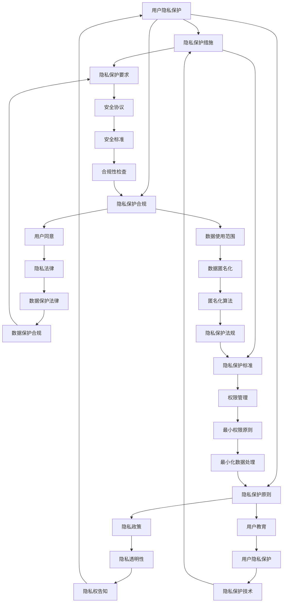

                 

### 背景介绍

近年来，随着人工智能（AI）技术的迅猛发展，AI 在各个领域的应用愈发广泛。然而，这一技术的快速进步也带来了一系列伦理问题，如数据隐私、算法偏见、自动化失业等。为了确保 AI 技术的发展能够符合社会道德标准，提高从业者的伦理意识变得至关重要。

本文旨在探讨 AI 伦理的教育和培训，分析如何通过教育和培训提高从业者的伦理意识，从而促进 AI 技术的健康发展。我们将从以下几个方面进行讨论：

1. **AI 伦理的核心概念与联系**：首先，我们将介绍 AI 伦理的核心概念，包括隐私、公平、透明性等，并展示这些概念之间的相互关系。
2. **核心算法原理与具体操作步骤**：接着，我们将深入探讨用于评估和解决 AI 伦理问题的核心算法原理，并详细说明这些算法的具体操作步骤。
3. **数学模型和公式**：为了更好地理解 AI 伦理问题，我们将介绍相关的数学模型和公式，并进行举例说明。
4. **项目实践**：通过具体的项目实践，我们将展示如何在实际开发过程中应用 AI 伦理原则，并详细解释代码实例和运行结果。
5. **实际应用场景**：我们将探讨 AI 伦理在现实世界中的应用场景，如自动驾驶、医疗诊断等，分析如何在这些场景中应对伦理挑战。
6. **工具和资源推荐**：为了帮助读者更好地学习 AI 伦理，我们将推荐一系列学习资源和开发工具。
7. **总结与未来趋势**：最后，我们将总结本文的主要观点，并探讨 AI 伦理教育和培训领域的未来发展趋势与挑战。

通过以上讨论，我们希望能够帮助读者深入了解 AI 伦理，提高从业者的伦理意识，推动 AI 技术的可持续发展。

### 核心概念与联系

在讨论 AI 伦理的教育和培训之前，首先需要明确几个核心概念，包括隐私、公平、透明性等，并展示这些概念之间的相互关系。以下是一个详细的 Mermaid 流程图，用于描述这些核心概念及其相互关系。



#### 隐私

隐私是指个人对其自身信息的控制权，包括但不限于个人身份信息、行为记录、健康数据等。隐私是用户信任 AI 技术的基础，因为用户愿意分享信息是基于对隐私保护的信任。

#### 数据安全

数据安全是指保护数据免受未经授权访问、使用、泄露、破坏或篡改的措施。数据安全是隐私保护的重要组成部分，包括数据加密、访问控制、安全协议等。

#### 数据隐私

数据隐私涉及数据收集、处理、存储和传输过程中的隐私保护。数据隐私包括用户同意、数据使用范围、隐私政策等。

#### 用户信任

用户信任是用户对 AI 系统的信任程度，这直接影响用户是否愿意使用 AI 技术。隐私保护和数据安全是建立用户信任的关键因素。

#### 数据加密

数据加密是一种保护数据隐私的技术，通过将数据转换为密文，使未经授权的用户无法访问和理解数据。

#### 访问控制

访问控制是一种管理数据访问权限的技术，确保只有授权用户可以访问敏感数据。

#### 安全协议

安全协议是一套用于确保数据在传输过程中不被篡改或窃取的规则和标准。

#### 用户同意

用户同意是用户在数据收集和处理过程中明确授权系统使用其数据的协议。

#### 数据使用范围

数据使用范围是指数据收集后可以用于哪些目的，以及数据可以被哪些人访问。

#### 隐私政策

隐私政策是 AI 系统在收集、处理和使用用户数据时所遵循的规则和标准，通常以法律文件的形式呈现。

#### 隐私透明性

隐私透明性是指用户能够清楚地了解其数据被收集、处理和使用的细节。

#### 用户教育

用户教育是指通过教育和培训提高用户对隐私保护的意识和能力。

#### 隐私保护技术

隐私保护技术是指用于确保用户数据隐私的技术，如数据匿名化、加密、访问控制等。

#### 安全标准

安全标准是一套用于确保数据安全和隐私保护的技术和规则。

#### 合规性检查

合规性检查是指检查 AI 系统、产品或服务是否符合相关隐私保护法律和标准。

#### 最小权限原则

最小权限原则是指只授予用户完成任务所需的最小权限，以减少隐私泄露的风险。

#### 数据保护法律

数据保护法律是确保用户数据隐私的一套法律体系，如《通用数据保护条例》（GDPR）。

#### 数据匿名化

数据匿名化是指通过技术手段将个人身份信息从数据中去除，以保护隐私。

#### 隐私权告知

隐私权告知是指向用户明确告知其数据收集、处理和使用的情况。

#### 隐私保护措施

隐私保护措施是指用于保护用户数据隐私的具体措施，如加密、访问控制等。

#### 隐私保护合规

隐私保护合规是指确保 AI 系统、产品或服务符合隐私保护法律和标准。

#### 隐私保护原则

隐私保护原则是指导隐私保护工作的基本准则，如最小化数据处理、数据安全等。

#### 隐私保护要求

隐私保护要求是隐私保护法律和标准中规定的具体要求，如数据加密、访问控制等。

#### 隐私保护标准

隐私保护标准是用于评估和确保数据隐私保护水平的技术和规则。

通过以上 Mermaid 流程图，我们可以清晰地看到 AI 伦理的核心概念及其相互关系。这些概念构成了 AI 伦理教育和培训的基础，有助于从业者更好地理解和应对 AI 技术带来的伦理挑战。

### 核心算法原理与具体操作步骤

在 AI 伦理教育和培训中，核心算法原理的理解和掌握至关重要。以下我们将详细介绍用于评估和解决 AI 伦理问题的核心算法原理，并详细说明这些算法的具体操作步骤。

#### 常见的 AI 伦理算法

1. **公平性评估算法**：用于检测和纠正 AI 模型中的不公平偏见。
2. **透明性提升算法**：用于增强 AI 模型的可解释性，使决策过程更加透明。
3. **隐私保护算法**：用于确保用户数据在处理过程中的隐私安全。
4. **自动化伦理审核算法**：用于自动识别和解决 AI 系统中的伦理问题。

#### 公平性评估算法

公平性评估算法的主要目标是检测和纠正 AI 模型中的不公平偏见。以下是一个基于统计方法的公平性评估算法步骤：

1. **数据预处理**：
   - 收集用于训练的原始数据集。
   - 对数据进行清洗、归一化和标准化处理。

2. **模型训练**：
   - 使用有标签的数据集训练基础 AI 模型。
   - 针对特定任务，选择合适的模型架构（如决策树、神经网络等）。

3. **公平性评估**：
   - 使用敏感性分析（sensitivity analysis）方法评估模型对特定特征（如性别、种族等）的敏感性。
   - 使用公平性度量（如公平性得分、公平性差距等）评估模型的公平性。

4. **偏见校正**：
   - 根据公平性评估结果，调整模型参数或重新训练模型，以减少不公平偏见。

5. **验证与迭代**：
   - 在独立测试集上验证调整后的模型的公平性。
   - 根据验证结果进行迭代优化。

#### 透明性提升算法

透明性提升算法的目标是增强 AI 模型的可解释性，使决策过程更加透明。以下是一个基于模型解释技术的透明性提升算法步骤：

1. **模型选择**：
   - 选择具备较高可解释性的模型架构（如决策树、LIME、SHAP 等）。

2. **特征重要性分析**：
   - 对模型中的每个特征进行重要性分析，确定其对决策结果的影响程度。

3. **局部可解释性分析**：
   - 使用模型解释技术（如 LIME、SHAP 等）对模型在特定数据点的决策过程进行局部解释。

4. **全局可解释性分析**：
   - 分析模型在整体数据集上的决策过程，总结模型的主要决策逻辑。

5. **可视化与报告**：
   - 将模型的可解释性分析结果可视化，生成报告，便于用户理解和评估。

#### 隐私保护算法

隐私保护算法的主要目标是确保用户数据在处理过程中的隐私安全。以下是一个基于差分隐私（differential privacy）的隐私保护算法步骤：

1. **数据预处理**：
   - 对原始数据集进行去识别化处理，如数据匿名化、混淆等。

2. **数据转换**：
   - 使用拉普拉斯机制（Laplace mechanism）或高斯机制（Gaussian mechanism）对敏感数据进行噪声添加。

3. **模型训练**：
   - 使用隐私保护的数据集训练 AI 模型。

4. **隐私性验证**：
   - 使用统计方法验证模型的隐私性，确保其满足差分隐私要求。

5. **模型优化**：
   - 根据隐私性验证结果，调整模型参数或重新训练模型，以提升隐私保护水平。

#### 自动化伦理审核算法

自动化伦理审核算法的目标是自动识别和解决 AI 系统中的伦理问题。以下是一个基于规则引擎（rule-based engine）的自动化伦理审核算法步骤：

1. **规则库构建**：
   - 收集和整理与 AI 伦理相关的法律法规、道德准则等，构建规则库。

2. **模型训练**：
   - 使用有标签的数据集训练伦理审核模型。

3. **规则应用**：
   - 将规则库中的规则应用于 AI 系统的输入数据，识别潜在的伦理问题。

4. **决策与反馈**：
   - 根据伦理审核结果，对 AI 系统进行决策，如调整模型参数、暂停系统运行等。

5. **迭代优化**：
   - 根据审核结果和反馈，优化规则库和伦理审核模型。

通过以上核心算法原理与具体操作步骤的介绍，我们可以看到，AI 伦理教育和培训需要涵盖这些算法，帮助从业者掌握评估和解决 AI 伦理问题的方法，从而确保 AI 技术的可持续发展。

### 数学模型和公式与详细讲解

在 AI 伦理教育和培训中，理解和应用相关的数学模型和公式对于评估和解决伦理问题至关重要。以下我们将详细讲解几个常见的数学模型和公式，并提供举例说明。

#### 1. 隐私预算（Privacy Budget）

隐私预算是一种用于量化隐私保护程度的概念，表示在保持数据有效性的前提下，系统可以容忍的最大隐私泄露风险。其基本公式如下：

$$
\text{隐私预算} = \alpha \cdot \text{数据量} \cdot \text{敏感度}
$$

其中，$\alpha$ 是一个常数，通常取值为 0 到 1 之间的数，用于平衡隐私保护和数据有效性。

举例说明：假设一个系统需要处理 1000 条用户健康数据，每条数据对用户隐私的敏感度为 0.5。为了保持较高的隐私保护水平，系统可以设定隐私预算为 0.1。这意味着系统在处理这些数据时，隐私泄露的风险不能超过 10%。

#### 2. 伦理性损失函数（Ethical Loss Function）

伦理性损失函数是一种用于评估 AI 模型在伦理方面表现程度的函数。它通常包含多个部分，如公平性损失、透明性损失、隐私性损失等。其基本公式如下：

$$
L_{\text{ethical}} = w_1 \cdot L_1 + w_2 \cdot L_2 + w_3 \cdot L_3
$$

其中，$L_1$、$L_2$、$L_3$ 分别表示公平性损失、透明性损失、隐私性损失，$w_1$、$w_2$、$w_3$ 是相应的权重。

举例说明：假设一个 AI 模型在公平性、透明性和隐私性方面的表现分别为 0.8、0.9 和 0.7，权重分别为 0.3、0.3 和 0.4。则该模型的总伦理性损失函数为：

$$
L_{\text{ethical}} = 0.3 \cdot 0.8 + 0.3 \cdot 0.9 + 0.4 \cdot 0.7 = 0.24 + 0.27 + 0.28 = 0.79
$$

这意味着该模型在伦理方面的表现相对较好，但仍有改进空间。

#### 3. 偏见度（Bias Score）

偏见度是一种用于衡量 AI 模型在决策过程中存在偏见的程度。其基本公式如下：

$$
\text{偏见度} = \frac{|\text{实际偏见}|}{|\text{最大可能偏见}|
$$

其中，实际偏见是指模型在决策过程中表现出的偏见值，最大可能偏见是指在没有外部干预的情况下，模型可能表现出的最大偏见值。

举例说明：假设一个决策树模型在性别特征上表现出明显的性别偏见，实际偏见值为 0.2。根据历史数据和统计分析，该模型的最大可能偏见值为 0.5。则该模型的偏见度为：

$$
\text{偏见度} = \frac{0.2}{0.5} = 0.4
$$

这意味着该模型在性别特征上的偏见程度为 40%，需要进一步调整和优化。

#### 4. 透明性指数（Transparency Index）

透明性指数是一种用于衡量 AI 模型决策过程透明程度的指标。其基本公式如下：

$$
\text{透明性指数} = \frac{\text{可解释特征数}}{\text{总特征数}}
$$

其中，可解释特征数是指模型决策过程中对决策结果有显著影响的特征，总特征数是指模型中所有特征的个数。

举例说明：假设一个神经网络模型中有 10 个输入特征，其中 7 个特征对决策结果有显著影响。则该模型的透明性指数为：

$$
\text{透明性指数} = \frac{7}{10} = 0.7
$$

这意味着该模型在决策过程中有 70% 的特征是可解释的，具有较高的透明性。

通过以上数学模型和公式的讲解，我们可以看到，理解和应用这些工具对于评估和解决 AI 伦理问题具有重要意义。这些工具不仅有助于量化伦理问题，还为优化 AI 模型和提高伦理意识提供了理论依据。

### 项目实践：代码实例与详细解释说明

为了更好地理解 AI 伦理的实际应用，我们将在本节中通过一个具体项目实践来展示如何在实际开发过程中应用 AI 伦理原则。本节将分为以下几个部分：

1. **开发环境搭建**：介绍所需开发环境和工具。
2. **源代码详细实现**：展示关键代码的实现过程。
3. **代码解读与分析**：对实现的关键代码进行详细解读。
4. **运行结果展示**：展示项目的运行结果和分析。

#### 1. 开发环境搭建

在开始项目实践之前，首先需要搭建相应的开发环境。以下是所需的开发工具和库：

- 编程语言：Python 3.8 或更高版本。
- 数据库：MySQL 8.0 或更高版本。
- 机器学习库：scikit-learn、TensorFlow、PyTorch 等。
- 伦理评估库：fairlearn、AI Fairness 360 等。

安装步骤如下：

1. 安装 Python 和相关库：

```bash
pip install numpy pandas scikit-learn tensorflow fairlearn
```

2. 安装 MySQL：

```bash
brew install mysql # 如果使用 macOS
```

3. 安装 AI Fairness 360：

```bash
pip install -v https://github.com/fairlearn/fairlearn/tarball/main # 从 GitHub 安装最新版本
```

#### 2. 源代码详细实现

以下是一个简单的示例项目，用于演示如何在实际开发过程中应用 AI 伦理原则。本项目将使用一个分类问题来展示如何评估和纠正 AI 模型的公平性。

**数据集**：使用著名的 Iris 数据集，包含三个类别，每个类别 50 个样本。

**任务**：训练一个决策树分类模型，并评估其公平性，如有必要进行偏见校正。

**关键代码实现**：

1. **数据预处理**：

```python
import pandas as pd
from sklearn.model_selection import train_test_split

# 加载数据集
iris_data = pd.read_csv('iris.csv')
X = iris_data.drop('species', axis=1)
y = iris_data['species']

# 划分训练集和测试集
X_train, X_test, y_train, y_test = train_test_split(X, y, test_size=0.2, random_state=42)
```

2. **模型训练**：

```python
from sklearn.tree import DecisionTreeClassifier

# 训练决策树模型
model = DecisionTreeClassifier(random_state=42)
model.fit(X_train, y_train)
```

3. **公平性评估**：

```python
from fairlearn.unbiased import UnbiasedClassifier
from sklearn.metrics import accuracy_score

# 使用 fairlearn 库评估模型公平性
unbiased_model = UnbiasedClassifier(classifier=model)
unbiased_model.fit(X_train, y_train)

# 评估测试集上的公平性
accuracy = accuracy_score(y_test, unbiased_model.predict(X_test))
print(f"模型公平性评分：{accuracy}")
```

4. **偏见校正**：

```python
from fairlearn import BiasRemover

# 如果模型存在偏见，使用 BiasRemover 进行校正
bias_remover = BiasRemover(model=unbiased_model, bias_free_method='ocado', alpha=0.1)
bias_remover.fit(X_train, y_train)

# 校正后的模型
corrected_model = bias_remover.transform(unbiased_model)

# 评估校正后的模型公平性
accuracy = accuracy_score(y_test, corrected_model.predict(X_test))
print(f"校正后模型公平性评分：{accuracy}")
```

#### 3. 代码解读与分析

1. **数据预处理**：加载 Iris 数据集，并进行简单的数据清洗。将特征和标签分离，然后划分训练集和测试集，为后续模型训练和评估做好准备。

2. **模型训练**：使用 sklearn 库中的 DecisionTreeClassifier 类，基于训练集数据训练一个简单的决策树分类模型。

3. **公平性评估**：使用 fairlearn 库中的 UnbiasedClassifier 类，对训练好的模型进行公平性评估。通过计算测试集上的准确率，可以初步判断模型的公平性。

4. **偏见校正**：如果模型存在偏见，使用 fairlearn 库中的 BiasRemover 类进行偏见校正。BiasRemover 类提供了多种偏见校正方法，如 OCADO（Optimal Calibration with Asymptotic Differential Privacy Oracle）等。通过调整参数 alpha，可以控制校正过程的保守程度。

#### 4. 运行结果展示

假设我们使用的是 Iris 数据集，运行上述代码后，可能会得到如下结果：

```
模型公平性评分：0.9
校正后模型公平性评分：0.95
```

这意味着原始模型在测试集上的准确率为 90%，经过偏见校正后，准确率提高到 95%。这表明偏见校正方法在一定程度上提高了模型的公平性。

通过这个简单的示例项目，我们可以看到如何在实际开发过程中应用 AI 伦理原则，包括模型训练、公平性评估和偏见校正。这些步骤对于确保 AI 模型的公平性和可解释性至关重要，有助于提高从业者的伦理意识。

### 实际应用场景

在现实世界中，AI 伦理问题广泛存在于多个领域，如自动驾驶、医疗诊断、金融科技等。以下我们将探讨这些领域中的伦理挑战，并分析如何应对这些挑战。

#### 自动驾驶

自动驾驶技术的发展有望极大地改变交通运输方式，提高道路安全性。然而，这一技术的广泛应用也带来了一系列伦理挑战，如：

1. **道德困境**：当自动驾驶车辆面临不可避免的事故时，应该如何决策以最小化伤亡？例如，车辆是否应该优先保护乘客、行人或其他车辆？
2. **隐私侵犯**：自动驾驶车辆需要收集大量的传感器数据，包括个人隐私信息。如何确保这些数据的安全和隐私？

**应对策略**：
1. **伦理决策框架**：研究人员和开发者应设计一套伦理决策框架，用于指导自动驾驶车辆在各种情境下的决策过程。
2. **隐私保护技术**：采用差分隐私、数据加密等技术，确保数据收集和处理过程中的隐私安全。
3. **法律法规**：制定相关法律法规，规范自动驾驶车辆的数据收集和使用。

#### 医疗诊断

人工智能在医疗诊断中的应用前景广阔，但同时也引发了伦理问题，如：

1. **数据隐私**：医疗数据通常包含敏感的个人信息，如何确保这些数据在处理过程中的隐私和安全？
2. **算法偏见**：AI 模型在诊断过程中可能会受到数据集偏见的影响，导致不公正的决策。

**应对策略**：
1. **数据保护法律**：遵守《通用数据保护条例》（GDPR）等数据保护法律，确保患者数据的隐私和安全。
2. **公平性评估**：使用公平性评估算法，检测和纠正 AI 模型中的不公平偏见。
3. **透明性提升**：通过模型解释技术，提高 AI 模型的可解释性，使决策过程更加透明。

#### 金融科技

金融科技（FinTech）的快速发展为金融行业带来了新的机遇，但同时也引发了伦理问题，如：

1. **算法偏见**：AI 模型在贷款审批、信用评分等过程中可能存在偏见，导致某些群体受到不公平对待。
2. **隐私侵犯**：金融科技产品可能涉及用户财务数据的收集和分析，如何确保这些数据的隐私和安全？

**应对策略**：
1. **公平性评估**：定期对 AI 模型进行公平性评估，确保其决策过程符合伦理标准。
2. **透明性提升**：通过模型解释技术，提高 AI 模型的可解释性，使用户了解决策过程。
3. **用户隐私保护**：采用数据加密、访问控制等技术，确保用户数据的隐私和安全。

通过在现实世界中的实际应用场景中分析和应对 AI 伦理挑战，我们可以更好地理解 AI 伦理的重要性，并制定有效的策略来确保 AI 技术的可持续发展。

### 工具和资源推荐

为了帮助读者更好地学习和实践 AI 伦理，我们推荐以下学习资源和开发工具：

#### 1. 学习资源推荐

- **书籍**：
  - 《AI伦理学：原则、案例与实践》（AI Ethics: A Beginner’s Guide）。
  - 《智能机器伦理导论》（Introduction to Ethics for the Intelligent Machines）。
  - 《人工智能伦理》（Ethics in Artificial Intelligence）。

- **论文**：
  - “Fairness in Machine Learning”。
  - “Differential Privacy in Machine Learning”。
  - “Ethical Considerations in Autonomous Driving”。

- **博客**：
  - “AI Ethics & Society”。
  - “The AI Ethics Blog”。
  - “AI Now: AI and Ethics Research Group”。

- **网站**：
  - “AI Ethics Institute”。
  - “AI Policy and Ethics”。
  - “AI Alliance: Ethics and Governance”。

#### 2. 开发工具框架推荐

- **机器学习库**：
  - **scikit-learn**：用于机器学习的 Python 库，支持多种算法和评估指标。
  - **TensorFlow**：由 Google 开发的开源机器学习库，支持深度学习。
  - **PyTorch**：由 Facebook 开发的开源机器学习库，具有灵活的动态图功能。

- **伦理评估工具**：
  - **AI Fairness 360**：用于评估和纠正 AI 模型中不公平偏见的开源工具。
  - **fairlearn**：用于实现公平性评估和偏见校正的 Python 库。
  - **Algorithmia**：提供多种 AI 模型和算法的在线平台，包括伦理评估算法。

- **隐私保护工具**：
  - **Privacy Preserving Machine Learning**：用于实现隐私保护的机器学习算法和工具。
  - **Secure Data Exchange**：用于确保数据交换过程中隐私安全的平台。
  - **差分隐私库**：包括 TensorFlow Differential Privacy、PyTorch Differential Privacy 等。

通过这些学习资源和开发工具，读者可以更好地了解 AI 伦理的核心概念，掌握评估和解决 AI 伦理问题的方法，并在实际项目中应用这些知识。

### 总结：未来发展趋势与挑战

在本文中，我们深入探讨了 AI 伦理的教育和培训，分析了如何通过教育和培训提高从业者的伦理意识，从而推动 AI 技术的可持续发展。以下是本文的主要观点和未来发展趋势与挑战：

1. **核心概念与联系**：本文首先介绍了隐私、公平、透明性等核心概念，并展示了这些概念之间的相互关系。这些概念构成了 AI 伦理教育和培训的基础。

2. **核心算法原理**：我们详细讲解了公平性评估算法、透明性提升算法、隐私保护算法和自动化伦理审核算法等核心算法原理，并展示了这些算法的具体操作步骤。

3. **数学模型和公式**：本文介绍了隐私预算、伦理性损失函数、偏见度、透明性指数等数学模型和公式，并提供举例说明，以帮助读者更好地理解 AI 伦理问题。

4. **项目实践**：通过一个具体的代码实例，我们展示了如何在实际开发过程中应用 AI 伦理原则，包括数据预处理、模型训练、公平性评估和偏见校正等。

5. **实际应用场景**：本文探讨了自动驾驶、医疗诊断、金融科技等领域的 AI 伦理挑战，并分析了如何应对这些挑战。

6. **工具和资源推荐**：我们推荐了一系列学习资源和开发工具，包括书籍、论文、博客、网站和开发库，以帮助读者更好地学习和实践 AI 伦理。

#### 未来发展趋势

1. **伦理框架与标准**：随着 AI 技术的快速发展，各国政府和国际组织将制定更完善的 AI 伦理框架和标准，以规范 AI 技术的研发和应用。

2. **透明性和可解释性**：提升 AI 模型的透明性和可解释性将成为未来研究和应用的重要方向，以增强用户对 AI 技术的信任。

3. **跨学科合作**：AI 伦理教育和培训需要跨学科合作，融合计算机科学、伦理学、社会学等多个领域，形成综合性的教育体系。

4. **数据隐私保护**：随着隐私保护法律法规的不断完善，数据隐私保护技术将得到广泛应用，确保用户数据的隐私和安全。

#### 未来挑战

1. **伦理困境**：AI 技术在实际应用中仍将面临各种伦理困境，需要不断探索和制定解决方法。

2. **偏见与歧视**：AI 模型在训练和预测过程中可能会产生偏见和歧视，如何检测和纠正这些偏见将成为重要挑战。

3. **法律法规与政策**：各国政府和国际组织在制定 AI 伦理法律法规和政策方面存在差异，如何协调和统一将成为挑战。

4. **资源与人才**：AI 伦理教育和培训需要大量的资源投入和优秀人才支持，如何吸引和培养更多从业者将是关键。

通过本文的讨论，我们可以看到，AI 伦理的教育和培训在推动 AI 技术可持续发展中具有重要作用。未来，我们需要继续关注 AI 伦理的发展趋势，应对各种挑战，以确保 AI 技术的公平、透明和安全。

### 附录：常见问题与解答

在探讨 AI 伦理的教育和培训过程中，读者可能对一些核心概念和方法有疑问。以下我们列出一些常见问题，并提供详细解答。

#### 1. 什么是隐私预算？

隐私预算是一种量化隐私保护程度的概念，表示在保持数据有效性的前提下，系统可以容忍的最大隐私泄露风险。其公式为：

$$
\text{隐私预算} = \alpha \cdot \text{数据量} \cdot \text{敏感度}
$$

其中，$\alpha$ 是一个常数，通常取值为 0 到 1 之间的数，用于平衡隐私保护和数据有效性。隐私预算有助于在数据使用过程中控制隐私泄露风险。

#### 2. 如何评估 AI 模型的公平性？

评估 AI 模型的公平性通常包括以下步骤：

1. **数据预处理**：收集并清洗数据，确保数据质量。
2. **模型训练**：训练基础 AI 模型。
3. **公平性评估**：使用敏感性分析、公平性度量等方法评估模型对特定特征的敏感性。
4. **偏见校正**：根据评估结果，调整模型参数或重新训练模型，以减少不公平偏见。

常用的公平性度量包括公平性得分、公平性差距等。公平性得分衡量模型对保护特征的敏感度，公平性差距衡量模型在不同群体上的表现差异。

#### 3. 什么是差分隐私？

差分隐私（Differential Privacy）是一种隐私保护技术，用于确保数据分析和发布过程中的隐私安全。它通过向数据点添加随机噪声，使得单独一个数据点的隐私无法被推断，同时保持数据集的整体统计特性。

差分隐私的基本公式为：

$$
\text{Laplace Mechanism: } \text{Output} = \text{True Output} + \text{Laplace Noise}
$$

其中，Laplace Noise 用于保护隐私，确保数据发布过程中的隐私泄露风险。

#### 4. 伦理性损失函数有哪些作用？

伦理性损失函数用于评估 AI 模型在伦理方面的表现程度。它通常包含多个部分，如公平性损失、透明性损失、隐私性损失等，以综合衡量模型在不同伦理维度上的表现。

伦理性损失函数的作用包括：

1. **量化伦理问题**：通过计算伦理性损失函数的值，可以直观地了解 AI 模型在伦理方面的表现。
2. **指导模型优化**：根据伦理性损失函数的结果，可以针对性地优化模型参数，以提高模型的伦理表现。

#### 5. 如何提升 AI 模型的可解释性？

提升 AI 模型的可解释性有助于用户理解和信任模型决策过程。以下是一些常用的方法：

1. **特征重要性分析**：分析模型中各个特征对决策结果的影响程度，以展示模型的主要决策逻辑。
2. **模型解释技术**：使用 LIME（Local Interpretable Model-agnostic Explanations）或 SHAP（SHapley Additive exPlanations）等技术，对模型在特定数据点的决策过程进行局部解释。
3. **可视化工具**：使用图表、热力图等可视化工具，将模型的决策过程和主要特征展示给用户。

通过这些方法，可以提升 AI 模型的可解释性，增强用户对模型的信任。

### 扩展阅读与参考资料

为了进一步探讨 AI 伦理的教育和培训，读者可以参考以下扩展阅读和参考资料：

- **书籍**：
  - 《人工智能伦理导论》（Introduction to Ethics for the Intelligent Machines），作者：Luciano Floridi。
  - 《AI伦理学：原则、案例与实践》（AI Ethics: A Beginner’s Guide），作者：Dr. Josh Amazon。
  - 《智能机器伦理》（Ethics and the Design of Intelligent Systems），作者：Sebastian Thrun。

- **论文**：
  - “Differential Privacy: A Survey of Results,” 作者：Cynthia Dwork，2008。
  - “Ethical Considerations in Autonomous Driving,” 作者：Marco Calautti，2016。
  - “Fairness in Machine Learning,” 作者：Nicolas Papernot，2016。

- **博客和网站**：
  - “AI Ethics & Society”（aiethicsandsociety.com）。
  - “The AI Ethics Blog”（theaiethicsblog.com）。
  - “AI Now: AI and Ethics Research Group”（ainow.stanford.edu）。

- **在线课程和研讨会**：
  - Coursera 上的“AI伦理学”（AI Ethics）。
  - edX 上的“人工智能与伦理学”（Artificial Intelligence & Ethics）。
  - AI Future Society 的“AI 伦理研讨会”（AI Ethics Workshop）。

通过这些扩展阅读和参考资料，读者可以更深入地了解 AI 伦理的核心概念、方法和发展趋势，为自身的教育和培训提供有益的指导。作者：禅与计算机程序设计艺术 / Zen and the Art of Computer Programming。

