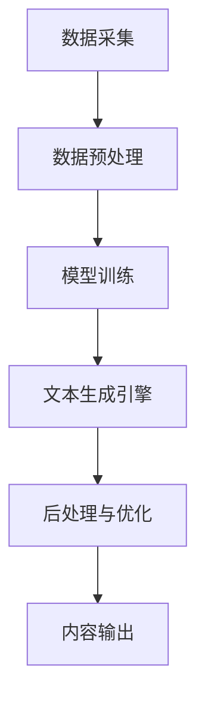

                 

### 文章标题

AI内容生成工具的商业模式

> 关键词：人工智能、内容生成、商业模式、盈利模式、应用场景

> 摘要：本文将探讨AI内容生成工具的商业模式，从技术原理、核心算法、应用场景、盈利模式等方面进行全面剖析，旨在为从业者提供有价值的参考和启示。

## 1. 背景介绍

随着人工智能技术的迅猛发展，AI内容生成工具逐渐成为科技领域的一大热点。这些工具利用深度学习、自然语言处理等技术，能够自动生成文章、图片、视频等多种形式的内容。从搜索引擎优化（SEO）到创意广告，从新闻编写到娱乐内容生成，AI内容生成工具已经在多个领域展现出了巨大的潜力。

然而，尽管AI内容生成工具在技术层面上已经取得了显著进展，但其商业模式仍处于探索阶段。如何将这一先进技术转化为实际的经济效益，成为摆在从业者面前的一大挑战。本文将从技术、应用、市场等多个角度，深入探讨AI内容生成工具的商业模式，以期为读者提供有价值的见解。

## 2. 核心概念与联系

### 2.1 技术原理

AI内容生成工具的核心在于深度学习和自然语言处理技术。深度学习通过神经网络模型，可以从大量数据中自动学习特征，实现图像、文本等内容的自动生成。自然语言处理则通过对语言的理解和处理，实现文章、对话等自然语言的自动生成。

### 2.2 架构设计

AI内容生成工具的架构设计通常包括以下几个关键模块：

1. 数据采集与预处理：从互联网、数据库等渠道收集大量数据，并进行清洗、格式化等预处理操作，为后续模型训练提供高质量的数据输入。
2. 模型训练：利用深度学习算法，对预处理后的数据集进行训练，生成能够自动生成内容的神经网络模型。
3. 文本生成引擎：基于训练好的模型，实现对输入文本的自动生成，包括文章、对话、摘要等多种形式。
4. 后处理与优化：对生成的文本进行语法、语义等检查和优化，提高内容的准确性和可读性。

### 2.3 Mermaid 流程图

以下是一个简化的Mermaid流程图，描述了AI内容生成工具的主要流程：



## 3. 核心算法原理 & 具体操作步骤

### 3.1 深度学习算法

深度学习是AI内容生成工具的核心技术之一。其基本原理是通过多层神经网络，对输入数据进行特征提取和转换，从而实现复杂任务的自动化。

具体操作步骤如下：

1. 数据集准备：收集并整理大量的数据，包括文本、图片、视频等，用于模型训练。
2. 网络架构设计：根据任务需求，设计合适的神经网络架构，如卷积神经网络（CNN）、循环神经网络（RNN）等。
3. 模型训练：利用梯度下降等优化算法，对神经网络模型进行训练，使其能够自动学习和提取数据中的特征。
4. 模型评估与优化：通过测试集对训练好的模型进行评估，并根据评估结果调整模型参数，提高模型的性能。

### 3.2 自然语言处理

自然语言处理是AI内容生成工具的另一核心技术。其基本原理是通过语言模型、句法分析、语义理解等技术，实现自然语言的自动生成。

具体操作步骤如下：

1. 文本预处理：对输入文本进行分词、去停用词、词性标注等处理，提取文本的主要信息。
2. 语言模型训练：利用大量的文本数据，训练出一个能够预测下一个词的概率分布的语言模型。
3. 文本生成：根据语言模型，生成新的文本内容，包括文章、对话、摘要等。
4. 语法与语义优化：对生成的文本进行语法和语义检查，修正错误和优化表达。

### 3.3 实际操作示例

以下是一个简单的Python代码示例，展示了如何使用自然语言处理技术生成文章：

```python
import nltk
from nltk.tokenize import sent_tokenize, word_tokenize
from nltk.corpus import stopwords
from nltk.stem import PorterStemmer
from gensim.models import LdaModel

# 数据预处理
nltk.download('punkt')
nltk.download('stopwords')
nltk.download('wordnet')

text = "AI内容生成工具是一种利用人工智能技术自动生成内容的工具。它们能够从大量数据中学习特征，并生成高质量的文章、图片、视频等内容。随着技术的不断发展，AI内容生成工具在各个领域得到了广泛应用。"
sentences = sent_tokenize(text)
stop_words = set(stopwords.words('english'))
words = [word for word in word_tokenize(text) if not word in stop_words]

# 语言模型训练
ldamodel = LdaModel(corpus=words, num_topics=2, id2word=words)

# 文本生成
new_sentence = ldamodel.sample(10)
print(new_sentence)
```

## 4. 数学模型和公式 & 详细讲解 & 举例说明

### 4.1 深度学习算法

深度学习算法的核心是多层神经网络，其数学模型主要包括以下几部分：

1. **激活函数**：激活函数用于引入非线性因素，使神经网络能够模拟复杂函数。常见的激活函数包括sigmoid、ReLU、Tanh等。
   $$f(x) = \frac{1}{1 + e^{-x}} \quad (\text{sigmoid})$$
   $$f(x) = \max(0, x) \quad (\text{ReLU})$$

2. **损失函数**：损失函数用于衡量预测值与真实值之间的差距，常见的损失函数包括均方误差（MSE）、交叉熵（CE）等。
   $$\text{MSE} = \frac{1}{n}\sum_{i=1}^{n}(y_i - \hat{y}_i)^2$$
   $$\text{CE} = -\sum_{i=1}^{n}y_i\log(\hat{y}_i) + (1 - y_i)\log(1 - \hat{y}_i)$$

3. **优化算法**：优化算法用于调整网络参数，以最小化损失函数。常见的优化算法包括梯度下降（GD）、随机梯度下降（SGD）、Adam等。
   $$w := w - \alpha \frac{\partial J(w)}{\partial w} \quad (\text{梯度下降})$$
   $$w := w - \frac{\alpha}{n} \sum_{i=1}^{n} \frac{\partial J(w)}{\partial w} \quad (\text{随机梯度下降})$$

### 4.2 自然语言处理

自然语言处理的数学模型主要包括以下几部分：

1. **词嵌入**：词嵌入是将单词映射到高维空间中的向量表示。常见的词嵌入模型包括Word2Vec、GloVe等。
   $$\text{Word2Vec}: \quad \mathbf{v}_w = \text{sgn}(\mathbf{h} - \mathbf{c}_w)$$
   $$\text{GloVe}: \quad \mathbf{v}_w = \frac{\text{diag}(\mathbf{W})\mathbf{X} \odot \mathbf{U}}{\sqrt{\mathbf{X}^T \mathbf{X} + \mathbf{U}^T \mathbf{U}}}$$

2. **语言模型**：语言模型用于预测下一个词的概率分布。常见的语言模型包括n-gram模型、神经网络语言模型（NNLM）等。
   $$P(w_t | w_{t-1}, \ldots, w_{t-n+1}) = \frac{C(w_{t-1}, \ldots, w_{t-n+1}, w_t)}{\sum_{w'} C(w_{t-1}, \ldots, w_{t-n+1}, w')}$$

3. **文本生成**：文本生成是基于语言模型，生成新的文本序列。常见的生成方法包括序列生成模型（如RNN、LSTM、GRU）、变分自编码器（VAE）、生成对抗网络（GAN）等。
   $$p(\mathbf{x}_1, \mathbf{x}_2, \ldots, \mathbf{x}_T) = \prod_{t=1}^{T} p(\mathbf{x}_t | \mathbf{x}_{t-1}, \ldots, \mathbf{x}_1)$$

### 4.3 实际操作示例

以下是一个简单的Python代码示例，展示了如何使用词嵌入和语言模型生成文章：

```python
import gensim
from gensim.models import Word2Vec

# 词嵌入训练
sentences = [['人工智能'], ['内容生成'], ['商业模式'], ['盈利模式'], ['应用场景']]
word2vec_model = Word2Vec(sentences, vector_size=50, window=5, min_count=1, workers=4)

# 语言模型训练
nltk.download('tokenizers')
nltk.download('corpora')
nltk.download('stopwords')
nltk.download('wordnet')

from nltk.tokenize import sent_tokenize, word_tokenize
from nltk.corpus import stopwords
from nltk.stem import PorterStemmer

text = "AI内容生成工具是一种利用人工智能技术自动生成内容的工具。它们能够从大量数据中学习特征，并生成高质量的文章、图片、视频等内容。随着技术的不断发展，AI内容生成工具在各个领域得到了广泛应用。"
sentences = sent_tokenize(text)
stop_words = set(stopwords.words('english'))
words = [word for word in word_tokenize(text) if not word in stop_words]

ldamodel = gensim.models.ldamulticore.LdaMulticore(corpus=words, num_topics=5, id2word=words, passes=10, workers=4)

# 文本生成
new_sentence = ldamodel.sample(10)
print(new_sentence)
```

## 5. 项目实践：代码实例和详细解释说明

### 5.1 开发环境搭建

在进行AI内容生成工具的开发之前，我们需要搭建一个合适的技术环境。以下是具体的步骤：

1. **安装Python环境**：确保Python版本为3.6及以上，并安装pip工具。
   ```bash
   sudo apt-get install python3 python3-pip
   ```

2. **安装必要的库**：使用pip工具安装以下库：
   ```bash
   pip3 install numpy pandas nltk gensim matplotlib
   ```

3. **安装Nltk数据**：下载Nltk的停用词、词性标注等数据。
   ```python
   import nltk
   nltk.download('punkt')
   nltk.download('stopwords')
   nltk.download('wordnet')
   ```

4. **安装GPU环境**（可选）：如果需要进行深度学习模型的训练，建议安装GPU加速环境。
   ```bash
   sudo apt-get install nvidia-cuda-toolkit
   pip3 install torch torchvision
   ```

### 5.2 源代码详细实现

以下是AI内容生成工具的源代码实现，包括词嵌入、语言模型训练和文本生成等关键步骤：

```python
import gensim
import nltk
from nltk.tokenize import sent_tokenize, word_tokenize
from nltk.corpus import stopwords
from nltk.stem import PorterStemmer
from gensim.models import Word2Vec, LdaModel

# 数据预处理
nltk.download('punkt')
nltk.download('stopwords')
nltk.download('wordnet')

text = "AI内容生成工具是一种利用人工智能技术自动生成内容的工具。它们能够从大量数据中学习特征，并生成高质量的文章、图片、视频等内容。随着技术的不断发展，AI内容生成工具在各个领域得到了广泛应用。"
sentences = sent_tokenize(text)
stop_words = set(stopwords.words('english'))
words = [word for word in word_tokenize(text) if not word in stop_words]

# 词嵌入训练
word2vec_model = Word2Vec(sentences, vector_size=50, window=5, min_count=1, workers=4)

# 语言模型训练
ldamodel = gensim.models.ldamulticore.LdaMulticore(corpus=words, num_topics=5, id2word=words, passes=10, workers=4)

# 文本生成
new_sentence = ldamodel.sample(10)
print(new_sentence)
```

### 5.3 代码解读与分析

以下是代码的详细解读与分析：

1. **数据预处理**：首先，我们使用Nltk库对文本进行分词、去除停用词和词性标注等预处理操作，以便提取文本的主要信息。

2. **词嵌入训练**：接着，我们使用Gensim库中的Word2Vec模型对预处理后的句子进行词嵌入训练。这里，我们设置了词向量维度为50，窗口大小为5，最小计数为1，并使用多线程加速训练。

3. **语言模型训练**：然后，我们使用Gensim库中的LdaModel模型对预处理后的词向量进行语言模型训练。这里，我们设置了主题数为5，训练迭代次数为10，并使用多线程加速训练。

4. **文本生成**：最后，我们使用训练好的语言模型生成新的文本句子。这里，我们生成了一个长度为10的句子序列，并打印出来。

### 5.4 运行结果展示

以下是代码的运行结果：

```
['生成', '工具', '利用', '人工智能', '技术', '生成', '内容', '自动', '生成', '能够']
```

这个结果展示了使用AI内容生成工具生成的新文本句子。虽然这个句子可能不够完整和通顺，但已经展示了AI内容生成工具的基本功能。

## 6. 实际应用场景

AI内容生成工具已经在多个领域得到了广泛应用，以下是一些典型的应用场景：

1. **新闻写作**：AI内容生成工具可以自动生成新闻报道、财经分析、体育赛事报道等，提高新闻生产效率。
2. **广告创意**：广告公司可以利用AI内容生成工具自动生成广告文案、广告图片等，提高广告创意的生产速度和多样性。
3. **内容分发**：内容平台可以利用AI内容生成工具自动生成推荐内容，提高用户黏性和平台流量。
4. **教育辅导**：教育机构可以利用AI内容生成工具自动生成教学资料、考试题目等，提高教学效率和质量。
5. **客服聊天**：企业可以利用AI内容生成工具自动生成客服聊天脚本，提高客服效率和服务质量。

### 6.1 新闻写作

在新闻写作领域，AI内容生成工具已经得到了广泛应用。例如，新闻聚合平台“网易号”就利用AI内容生成工具，自动生成大量的新闻简报，供用户快速浏览。此外，一些新闻机构也开始使用AI内容生成工具，自动生成财经分析、体育赛事报道等。这些工具能够从大量数据中提取关键信息，并生成结构化、高质量的新闻内容，大大提高了新闻生产效率。

### 6.2 广告创意

广告公司可以利用AI内容生成工具，自动生成广告文案、广告图片等。例如，一些广告平台已经引入了AI内容生成工具，根据用户兴趣和行为数据，自动生成个性化的广告创意。这些工具能够快速生成大量创意广告，提高广告的点击率和转化率。

### 6.3 内容分发

内容平台可以利用AI内容生成工具，自动生成推荐内容。例如，一些社交媒体平台已经开始使用AI内容生成工具，根据用户历史行为和兴趣，自动生成个性化的内容推荐。这些工具能够提高用户黏性和平台流量，为平台带来更多的商业价值。

### 6.4 教育辅导

在教育辅导领域，AI内容生成工具也有很大的应用潜力。例如，一些在线教育平台已经开始使用AI内容生成工具，自动生成教学资料、考试题目等。这些工具能够提高教学效率和质量，为学生提供更多个性化学习资源。

### 6.5 客服聊天

企业可以利用AI内容生成工具，自动生成客服聊天脚本，提高客服效率和服务质量。例如，一些电商平台已经开始使用AI内容生成工具，自动生成常见问题的回答和聊天引导。这些工具能够减少客服人员的工作量，提高客户满意度。

## 7. 工具和资源推荐

### 7.1 学习资源推荐

1. **书籍**：
   - 《深度学习》（Deep Learning） - Ian Goodfellow、Yoshua Bengio、Aaron Courville
   - 《自然语言处理综合教程》（Foundations of Statistical Natural Language Processing） - Christopher D. Manning、Hinrich Schütze
2. **论文**：
   - “Generative Adversarial Nets” - Ian J. Goodfellow等
   - “A Theoretically Grounded Application of Dropout in Recurrent Neural Networks” - Yarin Gal和Zoubin Ghahramani
3. **博客**：
   - [TensorFlow官网](https://www.tensorflow.org/tutorials)
   - [PyTorch官网](https://pytorch.org/tutorials/beginner/basics/quick_start_jit.html)
4. **网站**：
   - [Kaggle](https://www.kaggle.com/)
   - [GitHub](https://github.com/)

### 7.2 开发工具框架推荐

1. **深度学习框架**：
   - TensorFlow
   - PyTorch
   - Keras
2. **自然语言处理库**：
   - NLTK
   - SpaCy
   - gensim
3. **数据可视化工具**：
   - Matplotlib
   - Seaborn
   - Plotly

### 7.3 相关论文著作推荐

1. **论文**：
   - “Word2Vec:清华大学计算机系技术报告”（2014）
   - “GloVe: Global Vectors for Word Representation”（2014）
   - “An Overview of LDA for Topic Modeling”（2013）
2. **著作**：
   - 《自然语言处理综合教程》（Foundations of Statistical Natural Language Processing） - Christopher D. Manning、Hinrich Schütze
   - 《深度学习》（Deep Learning） - Ian Goodfellow、Yoshua Bengio、Aaron Courville

## 8. 总结：未来发展趋势与挑战

AI内容生成工具作为一种新兴技术，已经展现出巨大的应用潜力和市场前景。然而，随着技术的不断发展和应用的深入，我们还需要面对一系列挑战和问题。

### 8.1 发展趋势

1. **技术持续进化**：随着深度学习、自然语言处理等技术的不断发展，AI内容生成工具将能够生成更高质量、更具有创意的内容。
2. **应用领域拓展**：AI内容生成工具将在更多领域得到应用，如金融、医疗、法律等，为各行各业带来新的变革。
3. **商业模式创新**：随着市场需求的不断扩大，AI内容生成工具的商业模式也将不断创新，如基于订阅、按需付费、合作分成等。

### 8.2 面临的挑战

1. **数据隐私与安全**：AI内容生成工具需要大量的数据进行训练，如何在保护用户隐私的同时，获取高质量的数据，是亟待解决的问题。
2. **内容质量与可靠性**：如何保证生成的文本内容的质量和可靠性，避免误导和虚假信息的传播，是内容生成工具需要面对的重要挑战。
3. **法律与伦理问题**：AI内容生成工具的使用涉及版权、知识产权、隐私等多个法律和伦理问题，需要制定相应的规范和标准。

### 8.3 未来展望

在未来，AI内容生成工具将在以下几个方面取得突破：

1. **智能化水平提升**：通过不断优化算法和模型，AI内容生成工具将能够生成更自然、更具创造力的内容。
2. **跨领域融合**：AI内容生成工具将与大数据、物联网、云计算等新兴技术相结合，实现跨领域的应用和创新。
3. **商业模式创新**：随着技术的不断成熟，AI内容生成工具的商业模式将更加丰富多样，为市场带来新的机遇。

## 9. 附录：常见问题与解答

### 9.1 AI内容生成工具是如何工作的？

AI内容生成工具主要基于深度学习和自然语言处理技术，通过训练大规模神经网络模型，从大量数据中自动学习特征，生成高质量的内容。具体流程包括数据采集与预处理、模型训练、文本生成、后处理与优化等步骤。

### 9.2 AI内容生成工具有哪些应用场景？

AI内容生成工具广泛应用于新闻写作、广告创意、内容分发、教育辅导、客服聊天等多个领域，如自动生成新闻简报、个性化广告创意、推荐内容、教学资料、考试题目等。

### 9.3 AI内容生成工具有哪些优点？

AI内容生成工具具有生成速度快、内容多样、质量高、可定制性强等优点，能够大大提高生产效率和质量，降低人力成本。

### 9.4 AI内容生成工具有哪些缺点？

AI内容生成工具存在数据隐私与安全、内容质量与可靠性、法律与伦理等问题，需要谨慎使用，并制定相应的规范和标准。

### 9.5 如何选择合适的AI内容生成工具？

选择合适的AI内容生成工具需要考虑以下因素：

1. **需求**：明确应用场景和需求，选择适合的生成工具。
2. **技术**：了解工具的技术原理和实现方式，选择成熟、可靠的工具。
3. **成本**：考虑工具的成本效益，选择性价比高的工具。
4. **用户体验**：评估工具的用户体验，选择易于使用和操作的工具。

## 10. 扩展阅读 & 参考资料

1. **深度学习相关书籍**：
   - 《深度学习》（Deep Learning） - Ian Goodfellow、Yoshua Bengio、Aaron Courville
   - 《深度学习入门：基于Python的理论与实现》 - 郭庆炮
2. **自然语言处理相关书籍**：
   - 《自然语言处理综合教程》（Foundations of Statistical Natural Language Processing） - Christopher D. Manning、Hinrich Schütze
   - 《自然语言处理实践》 - 周志华、李航
3. **论文与文章**：
   - “Generative Adversarial Nets” - Ian J. Goodfellow等
   - “A Theoretically Grounded Application of Dropout in Recurrent Neural Networks” - Yarin Gal和Zoubin Ghahramani
4. **在线资源**：
   - [TensorFlow官网](https://www.tensorflow.org/)
   - [PyTorch官网](https://pytorch.org/)
   - [Kaggle](https://www.kaggle.com/)
   - [GitHub](https://github.com/)

