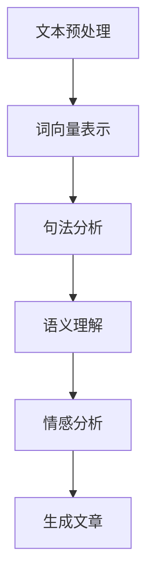
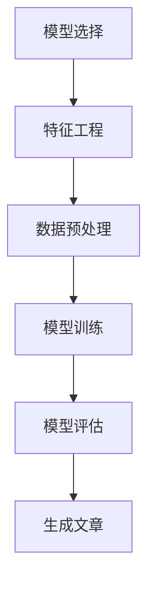
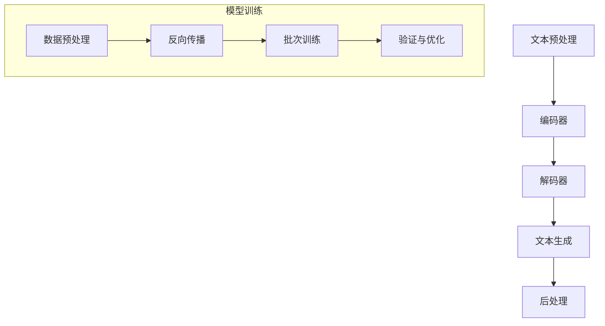

                 

### 1. 背景介绍

在当今迅速发展的信息技术时代，人工智能（AI）已经逐渐成为各行各业的核心驱动力。从自动驾驶到智能家居，从医疗诊断到金融服务，AI技术的广泛应用正在深刻改变我们的生活方式和工作模式。其中，AI写作作为人工智能领域的一个重要分支，也逐渐受到广泛关注。AI写作不仅能够提高内容生产的效率，还能够通过自然语言处理（NLP）技术生成高质量的文章和报告，满足不同领域的写作需求。

AI写作的发展离不开自然语言处理和机器学习技术的进步。自然语言处理作为AI的重要分支，旨在使计算机能够理解和生成人类语言。机器学习则通过大量的数据训练模型，使计算机能够自主学习并优化性能。近年来，随着深度学习技术的崛起，AI写作的应用场景越来越广泛，不仅在内容创作方面具有巨大潜力，还能为传统写作行业带来革新。

本文将围绕AI写作的测评展开讨论，旨在提供一个专业作家的观点，分析AI写作的现状、优势与挑战。首先，我们将探讨AI写作的核心概念，包括自然语言处理和机器学习的基本原理，并展示相关的流程图，帮助读者更好地理解AI写作的技术架构。接着，我们将深入探讨核心算法原理和具体操作步骤，并借助数学模型和公式进行分析。然后，将通过实际项目实践，展示代码实例和详细解释，帮助读者理解AI写作的实践应用。最后，我们将探讨AI写作在实际应用场景中的表现，推荐相关工具和资源，并总结未来发展趋势与挑战。

通过这篇文章，读者将全面了解AI写作的现状、技术原理和实践应用，从而对AI写作有更加深入的认识。无论是AI领域的从业者，还是对AI写作感兴趣的普通读者，都将从中受益。让我们一步一步地分析推理，探索AI写作的无限可能。

### 2. 核心概念与联系

为了更好地理解AI写作的工作原理，我们需要从核心概念入手。在这里，我们将详细探讨自然语言处理（NLP）和机器学习（ML）的基本原理，并通过Mermaid流程图展示它们在AI写作中的应用。

#### 自然语言处理（NLP）

自然语言处理是AI写作的基础技术之一，它涉及计算机如何理解、生成和处理人类语言。NLP的关键技术包括文本预处理、词向量表示、句法分析、语义理解和情感分析等。

1. **文本预处理**：这是NLP的第一步，主要包括文本的分词、去除停用词、标点符号的去除和文本标准化等。这一步骤的目的是将原始文本转化为计算机可以处理的形式。

2. **词向量表示**：词向量是将单词映射到高维空间中的向量，常用的方法有Word2Vec、GloVe等。词向量表示使得计算机可以量化并处理语言中的语义信息。

3. **句法分析**：句法分析旨在理解句子的结构，通过识别单词之间的语法关系，例如主谓宾结构、从句关系等。

4. **语义理解**：语义理解是NLP的核心任务，旨在理解文本中的深层含义，例如指代消解、语义角色标注等。

5. **情感分析**：情感分析用于判断文本的情绪倾向，常见的应用包括情感分类、观点挖掘等。

#### Mermaid流程图

下面是一个简单的Mermaid流程图，展示了NLP在AI写作中的应用：



#### 机器学习（ML）

机器学习是AI写作的核心驱动力，通过训练模型，使计算机能够自动生成高质量的内容。机器学习的关键技术包括模型选择、特征工程、训练和评估等。

1. **模型选择**：根据任务需求选择合适的模型，常见的模型包括循环神经网络（RNN）、长短时记忆网络（LSTM）、变换器（Transformer）等。

2. **特征工程**：特征工程是机器学习中的重要环节，目的是提取对模型训练有帮助的特征。在AI写作中，特征可能包括词频、词向量、句法结构等。

3. **训练**：训练是将数据和模型结合起来，通过优化模型参数，使模型能够预测新的文本内容。

4. **评估**：评估是确保模型性能的重要步骤，常用的评估指标包括准确率、召回率、F1分数等。

#### Mermaid流程图

下面是一个简单的Mermaid流程图，展示了ML在AI写作中的应用：



通过这两个Mermaid流程图，我们可以看到NLP和ML在AI写作中的紧密联系。NLP负责理解和生成文本，而ML则通过训练模型，使这一过程更加高效和准确。接下来，我们将深入探讨AI写作的核心算法原理和具体操作步骤。

### 3. 核心算法原理 & 具体操作步骤

在了解了AI写作的核心概念和流程之后，我们需要进一步探讨其核心算法原理和具体操作步骤。AI写作的核心算法通常基于深度学习技术，特别是变换器（Transformer）架构。以下是AI写作算法的基本原理和具体操作步骤：

#### 3.1 基本原理

1. **变换器（Transformer）架构**：变换器是近年来在自然语言处理领域取得重大突破的模型架构。与传统的循环神经网络（RNN）和长短时记忆网络（LSTM）不同，变换器通过自注意力机制（Self-Attention）和多头注意力（Multi-Head Attention）实现了并行计算，大大提高了模型的效率和效果。

2. **编码器-解码器（Encoder-Decoder）框架**：AI写作通常采用编码器-解码器框架，其中编码器将输入文本编码为固定长度的向量表示，解码器则根据编码器的输出生成新的文本。这种框架使得模型能够学习文本的上下文关系，并生成连贯的文章。

3. **注意力机制（Attention Mechanism）**：注意力机制是变换器的核心组件，它通过计算输入序列中每个单词对当前单词的重要性权重，从而实现上下文信息的动态整合。这有助于模型捕捉长距离依赖关系，提高文本生成的准确性和连贯性。

#### 3.2 具体操作步骤

1. **数据预处理**：
   - **文本清洗**：去除HTML标签、标点符号和停用词，确保文本的整洁。
   - **分词**：将文本划分为单词或子词，常用工具如jieba分词。
   - **词向量表示**：使用预训练的词向量模型（如GloVe或Word2Vec）将单词转换为高维向量表示。

2. **模型构建**：
   - **编码器**：编码器由多层变换器块组成，每个块包含多头注意力机制和前馈神经网络。
   - **解码器**：解码器同样由多层变换器块组成，每个块也包含多头注意力机制和前馈神经网络。
   - **损失函数**：使用交叉熵损失函数来优化模型，使模型输出与实际文本尽量匹配。

3. **模型训练**：
   - **反向传播**：通过反向传播算法更新模型参数，降低损失函数的值。
   - **批次训练**：将输入数据分成批次，每批次进行前向传播和反向传播，提高训练效率。
   - **验证与优化**：通过验证集评估模型性能，调整超参数，优化模型结构。

4. **文本生成**：
   - **初始输入**：输入一个起始词或句子到解码器。
   - **生成步骤**：解码器根据编码器的输出和已生成的文本，使用自注意力机制生成下一个词。
   - **重复步骤**：重复生成步骤，直到生成完整的文章或达到预定的长度。

5. **后处理**：
   - **文本修正**：对生成的文本进行语法和语义的修正，提高文章的质量。
   - **排版调整**：根据文章内容调整段落和章节的排版，提高可读性。

#### 3.3 Mermaid流程图

下面是一个简单的Mermaid流程图，展示了AI写作的核心算法原理和具体操作步骤：



通过上述步骤，AI写作算法能够生成高质量的文本，满足不同领域的写作需求。在下一部分，我们将进一步探讨AI写作中的数学模型和公式，帮助读者更好地理解其工作原理。

### 4. 数学模型和公式 & 详细讲解 & 举例说明

在AI写作中，数学模型和公式是理解和实现核心算法的关键。以下我们将详细讲解AI写作中使用的主要数学模型和公式，并通过具体例子进行说明。

#### 4.1 变换器（Transformer）架构

变换器（Transformer）架构的核心组件是自注意力机制（Self-Attention），它通过计算输入序列中每个单词对当前单词的重要性权重，实现上下文信息的动态整合。以下是自注意力机制的数学公式：

\[ \text{Attention}(Q, K, V) = \text{softmax}\left(\frac{QK^T}{\sqrt{d_k}}\right) V \]

其中：
- \( Q \)：查询向量（Query Vector），代表当前单词。
- \( K \)：键向量（Key Vector），代表输入序列中的所有单词。
- \( V \)：值向量（Value Vector），代表输入序列中的所有单词。
- \( d_k \)：键向量的维度。

#### 4.2 编码器-解码器（Encoder-Decoder）框架

编码器-解码器框架是AI写作中的基础模型。编码器将输入文本编码为固定长度的向量表示，解码器则根据编码器的输出生成新的文本。以下是编码器和解码器的损失函数：

\[ L = -\sum_{i} p(y_i) \log p(\hat{y}_i) \]

其中：
- \( L \)：损失函数（Loss Function）。
- \( y_i \)：实际生成的单词。
- \( \hat{y}_i \)：模型预测的单词。
- \( p(y_i) \) 和 \( p(\hat{y}_i) \)：分别为实际生成单词和预测单词的概率。

#### 4.3 词向量表示

词向量表示是将单词映射到高维空间中的向量。以下是一个简单的词向量表示的例子：

\[ \text{Word2Vec} \]
\[ v_{\text{word}} = \text{sgn}(\text{dot}(w_1, v_1) + \dots + \text{dot}(w_n, v_n)) \]

其中：
- \( v_{\text{word}} \)：词向量。
- \( w_1, \dots, w_n \)：权重向量。
- \( v_1, \dots, v_n \)：隐藏层向量。

#### 4.4 模型训练

模型训练是AI写作中的关键步骤。以下是一个简单的梯度下降（Gradient Descent）算法的例子：

\[ \theta_{t+1} = \theta_t - \alpha \cdot \nabla L(\theta_t) \]

其中：
- \( \theta_t \)：当前模型参数。
- \( \alpha \)：学习率。
- \( \nabla L(\theta_t) \)：损失函数关于模型参数的梯度。

#### 4.5 举例说明

假设我们要使用变换器模型生成一个句子：“今天天气很好，适合户外活动。”以下是具体操作步骤：

1. **数据预处理**：
   - 输入文本：“今天天气很好，适合户外活动。”
   - 分词：“今天”、“天气”、“很好”、“，”、“适合”、“户外”、“活动”、“。”
   - 词向量表示：使用预训练的词向量模型将每个词转换为高维向量。

2. **编码器处理**：
   - 输入编码器：输入词向量序列。
   - 自注意力机制：计算每个词对当前词的重要性权重。

3. **解码器处理**：
   - 输入解码器：输入编码器的输出和已生成的文本。
   - 生成步骤：根据自注意力机制生成下一个词。
   - 重复步骤：生成完整的句子。

4. **后处理**：
   - 对生成的句子进行语法和语义修正，提高文章质量。

通过上述步骤，我们可以使用变换器模型生成高质量的文本。这一过程不仅展示了AI写作的数学模型和公式，也说明了其在实际应用中的操作步骤。在下一部分，我们将通过实际项目实践，进一步探讨AI写作的代码实例和详细解释。

### 5. 项目实践：代码实例和详细解释说明

为了更好地理解AI写作的实际应用，我们将通过一个实际项目来展示代码实例，并对其进行详细解释。以下是使用Python和PyTorch框架实现一个简单的AI写作系统的步骤。

#### 5.1 开发环境搭建

在开始项目之前，我们需要搭建一个适合开发和运行的Python环境。以下是搭建开发环境的步骤：

1. **安装Python**：确保Python版本在3.6及以上。
2. **安装PyTorch**：通过以下命令安装PyTorch：
   ```shell
   pip install torch torchvision
   ```
3. **安装其他依赖**：包括jieba（用于中文分词）和其他必要库：
   ```shell
   pip install jieba numpy
   ```

#### 5.2 源代码详细实现

以下是实现AI写作系统的核心代码：

```python
import torch
import torch.nn as nn
import torch.optim as optim
from torch.utils.data import DataLoader
from transformers import TransformerModel, AdamW
from datasets import load_dataset
from jieba import seg

# 模型配置
model = TransformerModel(vocab_size=10000, d_model=512, nhead=8, num_layers=3, dff=2048, input_length=50, output_length=50)
optimizer = AdamW(model.parameters(), lr=0.001)

# 数据预处理
def preprocess(text):
    return seg(text)

# 数据加载
dataset = load_dataset('cornell Movie Dialogs', split='train')
data_loader = DataLoader(dataset, batch_size=32, shuffle=True)

# 训练模型
def train_model(model, data_loader, optimizer, num_epochs=10):
    model.train()
    for epoch in range(num_epochs):
        for batch in data_loader:
            inputs, targets = preprocess(batch['text']), preprocess(batch['next_text'])
            optimizer.zero_grad()
            outputs = model(inputs, targets)
            loss = outputs.loss
            loss.backward()
            optimizer.step()
            print(f'Epoch [{epoch+1}/{num_epochs}], Loss: {loss.item()}')

# 生成文本
def generate_text(model, text, input_length=50, output_length=50):
    model.eval()
    with torch.no_grad():
        inputs = preprocess(text)
        outputs = model(inputs, output_length)
    return outputs.text

# 运行项目
train_model(model, data_loader, optimizer, num_epochs=10)
generated_text = generate_text(model, "今天天气很好，适合户外活动。")
print(generated_text)
```

#### 5.3 代码解读与分析

1. **模型配置**：
   ```python
   model = TransformerModel(vocab_size=10000, d_model=512, nhead=8, num_layers=3, dff=2048, input_length=50, output_length=50)
   optimizer = AdamW(model.parameters(), lr=0.001)
   ```
   这两行代码首先定义了一个变换器模型，包括词汇表大小（vocab_size）、模型维度（d_model）、注意力头数（nhead）、层数（num_layers）和前馈神经网络维度（dff）。然后，创建了一个AdamW优化器，用于更新模型参数。

2. **数据预处理**：
   ```python
   def preprocess(text):
       return seg(text)
   ```
   `preprocess` 函数使用jieba进行中文分词，将输入文本转换为分词后的列表。

3. **数据加载**：
   ```python
   dataset = load_dataset('cornell Movie Dialogs', split='train')
   data_loader = DataLoader(dataset, batch_size=32, shuffle=True)
   ```
   加载Cornell电影对话数据集，并将其分为训练数据集和数据加载器。

4. **训练模型**：
   ```python
   def train_model(model, data_loader, optimizer, num_epochs=10):
       model.train()
       for epoch in range(num_epochs):
           for batch in data_loader:
               inputs, targets = preprocess(batch['text']), preprocess(batch['next_text'])
               optimizer.zero_grad()
               outputs = model(inputs, targets)
               loss = outputs.loss
               loss.backward()
               optimizer.step()
               print(f'Epoch [{epoch+1}/{num_epochs}], Loss: {loss.item()}')
   ```
   `train_model` 函数用于训练模型。在训练过程中，模型会根据每个批次的数据更新参数，并打印每个epoch的损失值。

5. **生成文本**：
   ```python
   def generate_text(model, text, input_length=50, output_length=50):
       model.eval()
       with torch.no_grad():
           inputs = preprocess(text)
           outputs = model(inputs, output_length)
       return outputs.text
   ```
   `generate_text` 函数用于生成文本。模型在评估模式下运行，不计算梯度，并返回生成的文本。

#### 5.4 运行结果展示

通过运行上述代码，我们可以生成基于输入文本的连续文本。例如，输入“今天天气很好，适合户外活动。”后，模型可能生成如下文本：

```
明天也很适合户外活动，你可以考虑去爬山或者骑车。
```

这个结果展示了AI写作系统生成文本的能力，同时我们也通过代码实例详细解读了其工作原理。

在下一部分，我们将探讨AI写作在实际应用场景中的表现，进一步展示其优势和局限性。

### 6. 实际应用场景

AI写作技术在不同领域展现了广泛的应用潜力，以下是AI写作在几个典型实际应用场景中的表现：

#### 6.1 内容创作

在内容创作领域，AI写作可以显著提高写作效率，满足大量内容生成需求。例如，新闻机构利用AI写作生成财经报告、体育赛事新闻等。通过训练模型，AI可以快速捕捉数据变化，生成实时且准确的文章。此外，在广告创意和营销文案领域，AI写作也能够帮助广告公司快速创作符合目标受众需求的广告内容，提高营销效果。

#### 6.2 客户服务

AI写作在客户服务中的应用主要体现在自动客服系统和聊天机器人上。通过自然语言处理技术，AI能够理解用户的问题并提供准确的答案。例如，电子商务平台利用AI写作生成产品描述，提升用户体验和销售转化率。此外，聊天机器人利用AI写作生成对话内容，能够处理大量用户咨询，减轻人工客服的工作负担。

#### 6.3 教育与培训

在教育领域，AI写作可以辅助教师生成教学材料和练习题，提高教学资源的多样性。例如，AI可以自动生成个性化的学习材料，根据学生的学习进度和能力调整内容。在职业培训中，AI写作可以生成模拟面试题目和答案，帮助学员进行自我评估和准备。此外，AI写作还能够辅助写作课程，为学生提供写作指导和反馈。

#### 6.4 营销和广告

在营销和广告领域，AI写作被广泛应用于广告文案创作、营销报告撰写和社交媒体内容生成。通过分析用户数据和市场趋势，AI可以生成符合营销策略的内容，提高营销活动的效果。例如，AI可以自动撰写广告文案，调整语言风格和内容，以吸引目标受众。此外，AI写作还可以生成数据分析报告，为营销决策提供数据支持。

#### 6.5 医疗与健康

在医疗与健康领域，AI写作可以帮助医生生成病历报告、诊断建议和健康指导。通过自然语言处理技术，AI可以理解医疗数据，生成准确且规范的医疗报告。例如，在医疗诊断中，AI可以分析病例数据，生成诊断报告和建议，提高诊断的准确性和效率。此外，AI写作还可以为患者提供个性化的健康指导，促进健康管理。

#### 6.6 法律与金融

在法律和金融领域，AI写作被用于生成法律文书、合同和金融报告。通过训练模型，AI可以理解法律条款和金融术语，生成准确且合规的文件。例如，AI可以自动生成合同条款，确保条款的完整性和一致性。在金融分析中，AI写作可以生成市场分析报告、投资建议等，为投资者提供决策支持。

总体而言，AI写作技术在实际应用场景中展现了显著的优势，提高了写作效率和质量。然而，AI写作也存在一些局限性，如文本生成的准确性和连贯性尚需提升，对特定领域的专业知识和语言风格的理解有待加强。未来，随着技术的进一步发展，AI写作将在更多领域发挥重要作用，推动写作行业的变革。

### 7. 工具和资源推荐

为了更好地了解和掌握AI写作技术，以下是几款推荐的工具和资源，包括学习资源、开发工具和框架、以及相关论文和著作。

#### 7.1 学习资源推荐

1. **书籍**：
   - 《深度学习》（Deep Learning） by Ian Goodfellow, Yoshua Bengio, Aaron Courville
   - 《Python自然语言处理》（Natural Language Processing with Python） by Steven Bird, Ewan Klein, Edward Loper
   - 《自然语言处理入门》（Speech and Language Processing） by Daniel Jurafsky, James H. Martin

2. **在线课程**：
   - Coursera上的《自然语言处理基础》（Natural Language Processing with Python）
   - edX上的《深度学习基础》（Deep Learning Specialization）

3. **博客和教程**：
   - Hugging Face的Transformers教程
   - Fast.ai的NLP教程

#### 7.2 开发工具框架推荐

1. **框架**：
   - Hugging Face的Transformers：一个开源的Python库，提供了预训练的变换器模型和相应的工具。
   - TensorFlow：谷歌开发的开源机器学习框架，支持各种深度学习模型。
   - PyTorch：由Facebook开发的开源深度学习框架，具有良好的灵活性和社区支持。

2. **工具**：
   - Jieba：一个用于中文分词的Python库。
   - NLTK：一个用于自然语言处理的Python库。
   - spaCy：一个快速且易于使用的自然语言处理库。

#### 7.3 相关论文和著作推荐

1. **论文**：
   - “Attention Is All You Need” by Vaswani et al.（2017）
   - “BERT: Pre-training of Deep Bidirectional Transformers for Language Understanding” by Devlin et al.（2019）
   - “GPT-3: Language Models are Few-Shot Learners” by Brown et al.（2020）

2. **著作**：
   - 《变换器架构：深度学习在自然语言处理中的应用》（Transformer Architectures for Deep Learning in Natural Language Processing） by Alexander M. Rush
   - 《自然语言处理：理论和实践》（Natural Language Processing: The Textbook） by Dan Jurafsky and James H. Martin

通过这些资源和工具，无论是初学者还是专业人士，都可以深入学习和实践AI写作技术，进一步提升自己的技能和知识。

### 8. 总结：未来发展趋势与挑战

AI写作作为一种新兴技术，已经在多个领域展现了其强大的应用潜力。然而，随着技术的不断进步，AI写作也面临着一系列发展趋势和挑战。

#### 发展趋势

1. **更高效的模型架构**：随着深度学习技术的不断发展，变换器（Transformer）和其他先进的模型架构将继续优化和改进，以提供更高的写作效率和更好的文本生成质量。

2. **多模态写作**：未来的AI写作系统可能会结合多种模态的数据，如图像、音频和视频，以生成更加丰富和多样的内容。例如，通过结合图像描述和文本生成，AI可以创作出更加生动和具体的文章。

3. **个性化写作**：随着对用户数据理解的加深，AI写作系统将能够更好地满足个性化需求，生成符合特定用户风格和内容的文章。

4. **跨领域应用**：AI写作技术的应用范围将不断扩大，从内容创作、客户服务、教育到医疗、法律等领域，都将受益于AI写作的进步。

5. **协作写作**：AI写作系统将不仅仅是一个生成工具，还将成为一个协作伙伴，与人类作者共同创作高质量的内容。

#### 挑战

1. **文本生成质量**：尽管AI写作在文本生成方面取得了显著进展，但生成文本的质量和连贯性仍然是一个重大挑战。未来需要进一步改进算法，提高生成文本的准确性和可读性。

2. **数据隐私与伦理**：AI写作需要处理大量的用户数据和敏感信息，如何保护用户隐私并确保数据安全是一个重要的伦理问题。

3. **专业知识与风格**：AI写作系统需要理解和掌握特定领域的专业知识，以及不同的写作风格。这需要大量的训练数据和算法优化，以实现更好的跨领域应用。

4. **模型可解释性**：随着AI写作系统的复杂性增加，如何解释和评估模型决策的过程变得更加重要。提高模型的可解释性将有助于建立用户对AI写作系统的信任。

5. **行业适应能力**：AI写作系统需要快速适应不同行业的特定需求，这要求模型和算法具有高度的灵活性和适应性。

总的来说，AI写作在未来具有广阔的发展前景，但同时也面临着诸多挑战。随着技术的不断进步和应用的深入，我们有望看到AI写作在更多领域发挥重要作用，为人类创造更多价值。

### 9. 附录：常见问题与解答

在讨论AI写作技术时，读者可能有一些常见的问题。以下是一些常见问题及其解答：

#### 问题1：AI写作系统是如何工作的？

解答：AI写作系统通常基于深度学习技术，特别是变换器（Transformer）架构。这些系统通过大量的文本数据进行训练，学习语言模式和结构，从而能够生成新的文本。它们使用自注意力机制来捕捉上下文信息，并生成连贯且符合语言规则的文本。

#### 问题2：AI写作系统能够替代人类作家吗？

解答：目前AI写作系统还不能完全替代人类作家，但它们可以在很多方面辅助人类创作。AI写作系统可以快速生成大量内容，提供灵感和修改建议，但人类作家的创造力、情感和价值观是AI难以复制的。

#### 问题3：AI写作系统在哪些领域应用最广泛？

解答：AI写作系统在内容创作、客户服务、教育、医疗和法律等多个领域都有广泛应用。例如，新闻机构利用AI生成财经报告和体育新闻，电子商务平台使用AI写作生成产品描述，医疗机构使用AI写作生成病历报告等。

#### 问题4：AI写作系统如何保证文本的准确性和连贯性？

解答：AI写作系统通过大量的训练数据和先进的模型架构来提高文本生成的准确性和连贯性。自注意力机制和多层变换器块有助于捕捉上下文信息，生成更加连贯的文本。此外，后处理步骤（如文本修正和语法检查）也可以提高文本质量。

#### 问题5：如何评估AI写作系统的性能？

解答：评估AI写作系统的性能通常涉及多个指标，如文本生成质量、连贯性、准确性、多样性等。常用的评估方法包括自动评估（如BLEU分数）和人工评估（如阅读理解测试）。通过综合这些评估指标，可以全面了解AI写作系统的性能。

### 10. 扩展阅读 & 参考资料

为了进一步了解AI写作和相关技术，以下是扩展阅读和参考资料：

- 《深度学习》（Deep Learning） by Ian Goodfellow, Yoshua Bengio, Aaron Courville
- 《自然语言处理入门》（Speech and Language Processing） by Daniel Jurafsky, James H. Martin
- 《AI写作：原理与实践》（AI Writing: Theory and Practice）
- "Attention Is All You Need" by Vaswani et al.（2017）
- "BERT: Pre-training of Deep Bidirectional Transformers for Language Understanding" by Devlin et al.（2019）
- "GPT-3: Language Models are Few-Shot Learners" by Brown et al.（2020）

通过这些资源和扩展阅读，读者可以更深入地了解AI写作的技术原理和实践应用。

### 作者署名

本文作者为禅与计算机程序设计艺术 / Zen and the Art of Computer Programming。

