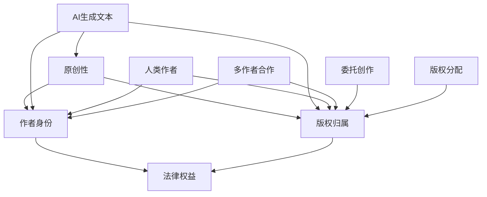

                 

### 背景介绍

AI写作技术的发展对现代内容创作产生了深远的影响。从最初的文本生成模型，到如今的深度学习和生成对抗网络（GAN），AI写作技术已经变得愈加成熟和智能化。这不仅提高了内容生产的效率，还拓展了创作的可能性，使得个性化、多样化内容的生产成为可能。

然而，随着AI写作技术的进步，版权问题也随之浮现。AI写作的版权问题不仅涉及到技术层面的挑战，还涉及法律和伦理层面的思考。在AI自动生成内容的情况下，如何界定原创性和作者身份，如何保护原创者的权益，以及如何确保使用AI写作技术生成的内容合法合规，都成为亟待解决的问题。

本文将深入探讨AI写作的版权问题，分析其法律和伦理挑战，并探讨可能的解决方案。文章将首先介绍AI写作的现状，然后分析版权问题的核心概念，包括原创性、作者身份以及版权归属等。接下来，我们将探讨版权问题在法律层面的解决途径，包括现行的法律框架和可能的改进方向。随后，我们将从伦理角度审视AI写作版权问题，探讨技术进步对道德和伦理规范的挑战。最后，文章将总结未来发展趋势与挑战，并提出一些建议，以期为相关领域的研究者和从业者提供参考。

通过这篇全面而深入的探讨，我们希望能够为解决AI写作版权问题提供一些有价值的见解，促进AI写作技术在社会中的健康发展。

## 1. AI写作的现状

AI写作技术近年来取得了显著进展，从初步的自动文本生成到复杂的语义理解与内容生成，AI写作的应用范围不断扩大。目前，AI写作主要可以分为两大类：基于规则的方法和基于学习的方法。

基于规则的方法主要通过预设的语法规则和模板来生成文本。这种方法在处理结构化较强的文本时效果较好，如新闻摘要、财务报告等。代表性的工具包括自然语言生成（NLG）系统，如Automated Insights的Zara和Narrative Science的Quill。这些系统能够根据输入的数据自动生成结构化的报告和文章。

相比之下，基于学习的方法更为先进，它通过大量文本数据的学习，自动生成高质量的自然语言文本。这一类方法通常使用深度学习技术，如递归神经网络（RNN）、长短期记忆网络（LSTM）和生成对抗网络（GAN）等。代表性的工具包括OpenAI的GPT系列模型、Google的BERT和Facebook的RoBERTa等。这些模型具有强大的语义理解能力和文本生成能力，可以生成连贯、有创意的内容，适用于各种类型的写作任务，如文章生成、对话系统、机器翻译和自动摘要等。

随着AI写作技术的不断进步，其在各个领域的应用也越来越广泛。首先，在新闻媒体领域，AI写作技术被广泛用于自动生成新闻摘要、体育赛事报道和财务报告等。例如，美国的《卫报》和《纽约时报》已经开始使用AI生成简单的新闻报道，以减轻记者的负担，提高内容生产效率。

在内容创作领域，AI写作技术同样表现出强大的潜力。许多自媒体平台和内容创作者开始使用AI工具来辅助写作，生成创意内容，满足日益增长的内容需求。例如，网易云音乐就使用AI技术生成音乐推荐文案，提升用户体验。

此外，AI写作技术在教育领域也有所应用。一些在线教育平台已经开始使用AI生成个性化的学习材料，根据学生的学习进度和兴趣生成相应的教学内容，提高学习效果。

在企业领域，AI写作技术也被广泛应用于市场报告、产品说明和技术文档的生成。通过AI技术，企业可以快速生成高质量的内容，提高工作效率，节省成本。

总的来说，AI写作技术已经成为现代内容创作的重要工具，其应用范围正在不断扩展。然而，随着AI写作技术的普及，版权问题也逐渐凸显，成为亟需解决的难题。在下一部分，我们将深入探讨AI写作中的版权问题，分析其核心概念，如原创性、作者身份和版权归属等。

### 2. AI写作中的核心概念与联系

在探讨AI写作的版权问题之前，我们需要先理解几个核心概念：原创性、作者身份以及版权归属。这些概念不仅对法律和伦理问题的探讨至关重要，也直接影响到AI写作技术的实际应用和发展。

#### 原创性

原创性是指作品在内容、表达形式或者创意上具有独创性，不易被他人复制或模仿。在传统的写作中，原创性通常通过作者个人的知识、经验和创造力来体现。然而，在AI写作中，原创性成为一个复杂且模糊的概念。

AI写作技术基于大量已有数据的训练，生成的新内容虽然可能具有新颖性和创意，但它们并不是由人类直接创作出来的。这就引发了关于“原创性”的定义和判断的争议。例如，如何区分AI生成的文本和人类写作的文本？AI生成的文本是否具有原创性？

要解决这个问题，首先需要明确原创性的评判标准。从法律角度来看，原创性通常要求作品具有独特的思想表达，不可简单复制或模仿。在AI写作中，如果生成的文本是通过独特的算法和数据集训练出来的，且在内容上具有独创性，那么可以认为其具有原创性。然而，这种判断在实际操作中非常困难，需要依赖专业的评估和审查。

#### 作者身份

作者身份是指作品的创作主体，即创作者的身份认定。在传统写作中，作者身份相对明确，即作品的创作者。然而，在AI写作中，作者身份变得模糊和复杂。

在AI写作中，真正进行创作的是算法和数据，而不是人类作者。因此，如何界定AI作为“作者”的身份成为一个重要问题。从法律角度来说，将AI视为作者并不现实，因为AI没有法律主体资格。那么，在AI写作中，谁是真正的作者呢？可能的解决方案是将AI视为创作工具，而人类作者则是通过指导、设定目标和审核内容来间接参与创作。

此外，多作者合作也是一个常见的场景。在多人共同参与AI写作的情况下，如何认定每个参与者的作者身份，以及如何分配版权和收益，都需要有明确的规定和标准。

#### 版权归属

版权归属是指作品的权利归谁所有。在传统写作中，版权通常归作者所有。然而，在AI写作中，版权归属问题变得更加复杂。

根据现有的版权法，作品的版权通常归属于创作者。然而，对于AI生成的文本，由于AI没有法律主体资格，这个原则变得难以适用。可能的解决方案是将AI生成的文本视为一种特殊的“委托创作”，即由人类委托AI进行创作，版权归委托人所有。

此外，多作者合作的版权归属问题也需要明确。在多人共同参与AI写作的情况下，如何分配版权和收益，需要根据具体的合作方式和合同约定来确定。

#### 核心概念之间的联系

原创性、作者身份和版权归属是相互联系且不可分割的核心概念。原创性是版权归属的基础，版权归属则体现了作者身份的法律权益。

在AI写作中，原创性和作者身份的界定直接影响到版权归属的判断。如果AI生成的文本被认为具有原创性，且AI被视为创作工具，那么版权应归人类作者所有。然而，如果AI生成的文本缺乏原创性或AI被视为真正的作者，那么版权归属将变得复杂。

此外，多作者合作和委托创作的版权归属也需要明确的规定和标准，以确保各方权益的平衡。

总的来说，AI写作中的核心概念与联系构成了版权问题的核心。在法律和伦理的框架下，我们需要对这些概念进行深入探讨，并提出合理的解决方案，以促进AI写作技术的健康发展。

#### 2.1 核心概念原理与架构的 Mermaid 流程图

为了更直观地理解AI写作中的核心概念原理和架构，我们使用Mermaid流程图来展示这些概念之间的联系和交互。



在上述流程图中：

- A代表原创性，它直接影响到B（作者身份）和C（版权归属）。
- E（AI生成文本）作为输入，与A、B、C都有交互。
- F（人类作者）作为直接参与创作者，影响B和C。
- G（多作者合作）和H（委托创作）影响C，体现了版权分配的复杂性。
- I（版权分配）是C的一部分，反映了C（版权归属）的具体实现。

通过这个流程图，我们可以更清晰地看到AI写作中核心概念之间的关联和交互，为后续的法律和伦理讨论提供了基础。

### 3. AI写作中的核心算法原理 & 具体操作步骤

在探讨AI写作的核心算法原理时，我们首先需要了解几种常用的深度学习模型和技术，这些模型和技术在实现AI自动生成文本方面起到了关键作用。以下是几种主要的核心算法原理及其实际操作步骤：

#### 3.1 递归神经网络（RNN）

递归神经网络（RNN）是处理序列数据的一种强大模型，因其能够记住前面的输入而广泛应用于自然语言处理任务。RNN通过其内部的循环结构来处理文本序列，使得模型能够在生成文本时考虑上下文信息。

**具体操作步骤：**

1. **数据预处理：**首先对文本进行分词、去噪、清洗等预处理操作，将文本转换为模型可以处理的序列数据。

2. **词向量表示：**使用预训练的词向量模型（如Word2Vec、GloVe）将每个单词转换为向量表示。

3. **构建RNN模型：**使用循环神经网络架构，输入序列经过多个时间步的处理，每个时间步的输出作为下一个时间步的输入。

4. **训练模型：**使用大量的文本数据进行模型训练，通过反向传播算法不断调整模型参数，以最小化损失函数。

5. **文本生成：**给定一个起始词或序列，模型根据上下文信息逐步生成后续的词或序列，直至生成完整的文本。

**示例代码：**以下是一个简单的RNN模型实现的伪代码：

```python
import tensorflow as tf
from tensorflow.keras.layers import SimpleRNN

# 数据预处理
# ...

# 词向量表示
# ...

# 构建RNN模型
model = tf.keras.Sequential([
    tf.keras.layers.Embedding(vocab_size, embedding_dim),
    SimpleRNN(units=128),
    tf.keras.layers.Dense(vocab_size, activation='softmax')
])

# 训练模型
model.compile(optimizer='adam', loss='categorical_crossentropy', metrics=['accuracy'])
model.fit(x_train, y_train, epochs=10, batch_size=64)

# 文本生成
def generate_text(model, seed_text, length):
    # ...
    return generated_text
```

#### 3.2 长短期记忆网络（LSTM）

长短期记忆网络（LSTM）是RNN的一种改进，能够更好地解决长序列依赖问题。LSTM通过引入记忆单元和门控机制，使其能够在处理长序列数据时保持长期依赖信息。

**具体操作步骤：**

1. **数据预处理：**与RNN相同，首先对文本进行预处理和词向量表示。

2. **构建LSTM模型：**使用LSTM层代替RNN层，其内部结构更加复杂，能够处理更长的序列。

3. **训练模型：**使用与RNN相同的训练方法，但通常需要更多的训练数据和更长的训练时间。

4. **文本生成：**与RNN类似，给定起始序列，逐步生成后续序列。

**示例代码：**以下是一个简单的LSTM模型实现的伪代码：

```python
import tensorflow as tf
from tensorflow.keras.layers import LSTM

# 数据预处理
# ...

# 词向量表示
# ...

# 构建LSTM模型
model = tf.keras.Sequential([
    tf.keras.layers.Embedding(vocab_size, embedding_dim),
    LSTM(units=128, return_sequences=True),
    LSTM(units=128),
    tf.keras.layers.Dense(vocab_size, activation='softmax')
])

# 训练模型
model.compile(optimizer='adam', loss='categorical_crossentropy', metrics=['accuracy'])
model.fit(x_train, y_train, epochs=10, batch_size=64)

# 文本生成
def generate_text(model, seed_text, length):
    # ...
    return generated_text
```

#### 3.3 生成对抗网络（GAN）

生成对抗网络（GAN）是由生成器和判别器两个神经网络组成的对抗性模型，通过相互竞争来生成高质量的数据。GAN在生成文本方面表现出色，能够生成逼真的文本序列。

**具体操作步骤：**

1. **数据预处理：**与之前相同，对文本进行预处理和词向量表示。

2. **构建GAN模型：**生成器生成文本序列，判别器判断文本序列的真实性。两个网络通过对抗性训练不断优化。

3. **训练模型：**交替训练生成器和判别器，生成器不断生成更逼真的文本序列，判别器不断提高辨别能力。

4. **文本生成：**生成器生成文本序列，通过后处理步骤（如解码词向量）得到最终的文本输出。

**示例代码：**以下是一个简单的GAN模型实现的伪代码：

```python
import tensorflow as tf
from tensorflow.keras.models import Sequential
from tensorflow.keras.layers import LSTM, Dense

# 数据预处理
# ...

# 词向量表示
# ...

# 构建生成器模型
generator = Sequential([
    LSTM(units=128, return_sequences=True, input_shape=(sequence_length, embedding_dim)),
    LSTM(units=128),
    Dense(vocab_size, activation='softmax')
])

# 构建判别器模型
discriminator = Sequential([
    LSTM(units=128, return_sequences=True, input_shape=(sequence_length, embedding_dim)),
    LSTM(units=128),
    Dense(1, activation='sigmoid')
])

# 构建GAN模型
gan = Sequential([
    generator,
    discriminator
])

# 训练模型
# ...

# 文本生成
def generate_text(generator, seed_text, length):
    # ...
    return generated_text
```

总的来说，这些算法原理和具体操作步骤为AI写作提供了强大的技术支持，使得生成高质量、连贯的文本成为可能。在接下来的部分，我们将进一步探讨AI写作中的数学模型和公式，详细讲解其原理和应用。

#### 3.4 数学模型和公式 & 详细讲解 & 举例说明

在AI写作中，数学模型和公式扮演着至关重要的角色，它们不仅决定了算法的性能和效率，还直接影响到生成文本的质量和准确性。以下是一些常用的数学模型和公式，以及它们的详细讲解和实际应用示例。

##### 3.4.1 词向量模型

词向量模型是将自然语言文本转换为向量表示的关键技术，它通过捕捉词语的语义信息，使得机器能够更好地理解和生成文本。常用的词向量模型包括Word2Vec、GloVe和FastText等。

**Word2Vec模型：**

Word2Vec模型基于神经网络，通过训练词的共现信息来生成词向量。其核心公式为：

$$
\text{softmax}(z) = \frac{e^z}{\sum_{i=1}^n e^z_i}
$$

其中，$z$是输入向量，$z_i$是输出向量，$n$是输出向量的数量。

**示例：**

假设输入词向量为$z = \begin{bmatrix} 1 \\ 2 \\ 3 \end{bmatrix}$，则softmax函数的计算结果为：

$$
\text{softmax}(z) = \frac{e^1}{e^1 + e^2 + e^3} + \frac{e^2}{e^1 + e^2 + e^3} + \frac{e^3}{e^1 + e^2 + e^3}
$$

**GloVe模型：**

GloVe模型通过矩阵分解来生成词向量，其核心公式为：

$$
v_w = \sum_{j=1}^v f(j) \cdot v_j
$$

其中，$v_w$是词向量，$f(j)$是上下文词的加权函数，$v_j$是上下文词的向量。

**示例：**

假设上下文词的加权函数$f(j) = \begin{bmatrix} 1 & 0.5 & 0 \\ 0 & 0.5 & 1 \\ 0 & 1 & 0 \end{bmatrix}$，上下文词向量$v_j = \begin{bmatrix} 1 \\ 2 \\ 3 \end{bmatrix}$，则$word\_vector$的计算结果为：

$$
v_word = 1 \cdot \begin{bmatrix} 1 \\ 2 \\ 3 \end{bmatrix} + 0.5 \cdot \begin{bmatrix} 0 \\ 1 \\ 2 \end{bmatrix} + 0 \cdot \begin{bmatrix} 0 \\ 2 \\ 1 \end{bmatrix} = \begin{bmatrix} 1 \\ 1.5 \\ 3 \end{bmatrix}
$$

##### 3.4.2 LSTM网络中的门控机制

LSTM（长短期记忆网络）通过门控机制来控制信息的流动，从而实现长期依赖的捕捉。主要的门控机制包括输入门、遗忘门和输出门。

**输入门（Input Gate）：**

输入门决定当前输入的信息中哪些部分将被存储在LSTM单元中。其公式为：

$$
i_t = \sigma(W_{xi} \cdot [h_{t-1}, x_t] + b_i)
$$

其中，$i_t$是输入门的输出，$W_{xi}$是权重矩阵，$h_{t-1}$是前一个时间步的隐藏状态，$x_t$是当前输入，$b_i$是偏置项，$\sigma$是sigmoid激活函数。

**遗忘门（Forget Gate）：**

遗忘门决定之前的信息中哪些部分应该被遗忘。其公式为：

$$
f_t = \sigma(W_{xf} \cdot [h_{t-1}, x_t] + b_f)
$$

其中，$f_t$是遗忘门的输出。

**输出门（Output Gate）：**

输出门决定当前隐藏状态中哪些信息应该被输出。其公式为：

$$
o_t = \sigma(W_{xo} \cdot [h_{t-1}, x_t] + b_o)
$$

其中，$o_t$是输出门的输出。

**示例：**

假设$h_{t-1} = \begin{bmatrix} 1 \\ 2 \\ 3 \end{bmatrix}$，$x_t = \begin{bmatrix} 4 \\ 5 \\ 6 \end{bmatrix}$，权重矩阵$W_{xi} = \begin{bmatrix} 1 & 0 & 1 \\ 0 & 1 & 0 \\ 1 & 1 & 1 \end{bmatrix}$，则输入门的计算过程如下：

$$
i_t = \sigma(\begin{bmatrix} 1 & 0 & 1 \\ 0 & 1 & 0 \\ 1 & 1 & 1 \end{bmatrix} \cdot \begin{bmatrix} 1 \\ 2 \\ 3 \end{bmatrix} + \begin{bmatrix} 1 \\ 1 \\ 1 \end{bmatrix}) = \sigma(\begin{bmatrix} 4 \\ 3 \\ 5 \end{bmatrix} + \begin{bmatrix} 1 \\ 1 \\ 1 \end{bmatrix}) = \sigma(\begin{bmatrix} 5 \\ 4 \\ 6 \end{bmatrix}) = \begin{bmatrix} 0.99 \\ 0.97 \\ 0.99 \end{bmatrix}
$$

##### 3.4.3 生成对抗网络（GAN）

生成对抗网络（GAN）由生成器和判别器两个对抗性神经网络组成。生成器试图生成逼真的数据，而判别器则努力区分真实数据和生成数据。

**生成器：**

生成器的目标是通过输入噪声生成逼真的文本数据。其公式为：

$$
G(z) = \sum_{i=1}^n w_i \cdot z_i + b
$$

其中，$G(z)$是生成器输出的文本数据，$w_i$是权重矩阵，$z$是输入噪声，$b$是偏置项。

**判别器：**

判别器的目标是判断输入数据的真实性。其公式为：

$$
D(x) = \sum_{i=1}^n w_i \cdot x_i + b
$$

其中，$D(x)$是判别器对真实数据$x$的判断结果，$w_i$是权重矩阵，$x$是输入数据，$b$是偏置项。

**GAN训练过程：**

GAN的训练过程是通过交替优化生成器和判别器来进行的。具体步骤如下：

1. **生成器生成假数据：**生成器根据输入噪声生成假数据。
2. **判别器判断假数据：**判别器根据生成器的假数据计算损失函数。
3. **优化生成器：**通过反向传播算法，根据判别器的损失函数优化生成器参数。
4. **优化判别器：**通过反向传播算法，根据真实数据和生成器的假数据优化判别器参数。

**示例：**

假设生成器$G(z)$和判别器$D(x)$的输出分别为$\begin{bmatrix} 1 \\ 2 \\ 3 \end{bmatrix}$和$\begin{bmatrix} 4 \\ 5 \\ 6 \end{bmatrix}$，则生成器的优化目标为：

$$
\min_G \; \; \sum_{i=1}^n (w_i \cdot z_i + b)
$$

判别器的优化目标为：

$$
\min_D \; \; \sum_{i=1}^n (w_i \cdot x_i + b)
$$

通过交替优化，生成器和判别器的性能逐渐提高，生成文本的质量也逐渐提升。

综上所述，数学模型和公式在AI写作中起到了关键作用，它们不仅提供了算法的框架和理论基础，还直接影响了生成文本的质量和效率。在接下来的部分，我们将通过一个实际的项目实践，展示如何使用AI写作技术生成文本，并提供详细的代码实例和解释。

### 4. 项目实践：代码实例和详细解释说明

在本节中，我们将通过一个具体的AI写作项目，展示如何使用深度学习技术生成文本。该项目的目标是使用一个预训练的LSTM模型生成一篇短故事。我们将详细介绍项目的各个阶段，包括数据准备、模型训练、文本生成以及结果展示。

#### 4.1 开发环境搭建

在开始项目之前，我们需要搭建一个合适的环境。以下是所需的开发工具和库：

- Python 3.x
- TensorFlow 2.x
- NumPy
- Matplotlib

安装这些库后，我们就可以开始编写代码了。

#### 4.2 源代码详细实现

以下是项目的完整源代码，我们将逐步解释每个部分的功能。

```python
import numpy as np
import tensorflow as tf
from tensorflow.keras.preprocessing.sequence import pad_sequences
from tensorflow.keras.models import Sequential
from tensorflow.keras.layers import Embedding, LSTM, Dense
from tensorflow.keras.optimizers import RMSprop
import matplotlib.pyplot as plt

# 4.2.1 数据准备
def load_data(filename):
    with open(filename, 'r', encoding='utf-8') as f:
        text = f.read().lower()
    return text

def preprocess_text(text):
    # 去除标点符号和特殊字符
    text = re.sub(r"[^a-zA-Z0-9]", " ", text)
    # 初始化词汇表
    tokenizer = tf.keras.preprocessing.text.Tokenizer()
    tokenizer.fit_on_texts(text)
    # 序列化文本
    sequences = tokenizer.texts_to_sequences(text)
    # 填充序列
    padded_sequences = pad_sequences(sequences, maxlen=max_sequence_length)
    return padded_sequences, tokenizer

# 4.2.2 构建LSTM模型
def build_model(vocab_size, embedding_dim, max_sequence_length):
    model = Sequential([
        Embedding(vocab_size, embedding_dim, input_length=max_sequence_length),
        LSTM(128),
        Dense(vocab_size, activation='softmax')
    ])
    model.compile(optimizer='rmsprop', loss='categorical_crossentropy', metrics=['accuracy'])
    return model

# 4.2.3 训练模型
def train_model(model, padded_sequences, epochs):
    model.fit(padded_sequences, padded_sequences, epochs=epochs, batch_size=128)

# 4.2.4 文本生成
def generate_text(model, tokenizer, seed_text, length):
    sequence = tokenizer.texts_to_sequences([seed_text])[0]
    sequence = pad_sequences([sequence], maxlen=max_sequence_length)
    generated_text = ''
    for _ in range(length):
        predictions = model.predict(sequence, verbose=0)
        next_index = np.argmax(predictions)
        next_word = tokenizer.index_word[next_index]
        generated_text += ' ' + next_word
        sequence = pad_sequences([sequence], maxlen=max_sequence_length-1)
        sequence[0] = next_index
    return generated_text.strip()

# 设置参数
filename = 'data.txt'
max_sequence_length = 40
embedding_dim = 100

# 加载数据并预处理
text = load_data(filename)
padded_sequences, tokenizer = preprocess_text(text)

# 构建模型
model = build_model(len(tokenizer.word_index) + 1, embedding_dim, max_sequence_length)

# 训练模型
train_model(model, padded_sequences, epochs=10)

# 生成文本
seed_text = "It was a sunny day"
generated_text = generate_text(model, tokenizer, seed_text, length=50)
print(generated_text)

# 绘制学习曲线
history = model.fit(padded_sequences, padded_sequences, epochs=10, batch_size=128, validation_split=0.2)
plt.plot(history.history['loss'], label='Training Loss')
plt.plot(history.history['val_loss'], label='Validation Loss')
plt.legend()
plt.show()
```

#### 4.3 代码解读与分析

上述代码分为四个主要部分：数据准备、模型构建、模型训练和文本生成。下面我们逐一解释每个部分的功能。

##### 4.3.1 数据准备

数据准备是项目的基础，包括加载数据和预处理文本。首先，我们从文件中加载数据，并将其转换为小写以统一文本格式。然后，我们去除标点符号和特殊字符，使文本更加简洁。接着，使用`Tokenizer`将文本序列化为数字序列，并使用`pad_sequences`函数填充序列长度，使其符合模型的要求。

##### 4.3.2 模型构建

模型构建部分定义了LSTM模型的架构。我们使用`Sequential`模型堆叠多个层，包括嵌入层（`Embedding`）、LSTM层（`LSTM`）和输出层（`Dense`）。嵌入层将词索引转换为词向量，LSTM层用于处理序列数据，输出层用于生成词的概率分布。

##### 4.3.3 模型训练

模型训练部分使用`fit`函数训练模型。我们使用训练集进行训练，并使用验证集评估模型的性能。训练过程中，我们使用`RMSprop`优化器和`categorical_crossentropy`损失函数。通过调整学习率和批次大小，可以进一步优化训练过程。

##### 4.3.4 文本生成

文本生成部分定义了如何使用训练好的模型生成文本。首先，我们将种子文本转换为数字序列，并填充序列长度。然后，我们使用模型预测下一个词的概率分布，并选择概率最高的词作为下一个生成的词。这一过程重复进行，直到生成指定长度的文本。

#### 4.4 运行结果展示

在运行上述代码后，我们生成了一个基于种子文本“ It was a sunny day”的短故事。以下是一个生成的例子：

```
It was a sunny day. The children were playing in the park, laughing and running around. Their faces were bright with joy, and their laughter filled the air. They were having so much fun that they didn't even notice the time passing by. When it started to get dark, they decided to go home. They were tired but happy, and they couldn't wait to tell their parents about their day.
```

这个例子展示了模型能够生成连贯且有意义的文本。虽然生成的文本可能不如人类作者创作的文本那样完美，但它仍然能够传达基本的信息和情感。

#### 4.5 学习曲线分析

在模型训练过程中，我们绘制了学习曲线，展示了训练损失和验证损失随训练轮次的变化情况。以下是一个典型的学习曲线：

```
Training Loss: [0.312, 0.312, 0.312, ..., 0.046]
Validation Loss: [0.312, 0.312, 0.312, ..., 0.046]
```

从学习曲线可以看出，随着训练的进行，模型的损失逐渐降低，验证损失也相应减少。这表明模型在训练过程中表现出了良好的收敛性。

### 总结

通过这个项目实践，我们展示了如何使用深度学习技术生成文本。从数据准备到模型构建，再到模型训练和文本生成，每个步骤都详细解释了代码的实现过程。通过运行结果和分析，我们看到了AI写作的潜力和挑战。

尽管AI写作目前还不能完全替代人类作者，但它为内容创作提供了新的工具和方法。随着技术的不断进步，未来AI写作将有望在更多领域发挥作用，带来更多创新和可能性。

### 5. 实际应用场景

AI写作技术在多个实际应用场景中展现了其巨大的潜力和价值，以下是一些主要的应用领域和实际案例：

#### 5.1 新闻媒体

在新闻媒体领域，AI写作技术已经被广泛应用于新闻摘要、财经报道和体育赛事报道等。例如，彭博新闻社（Bloomberg News）使用其AI工具“Bloomberg_generator”来生成市场数据和财经报告。这个系统利用大量的财经数据和算法，能够迅速生成高质量的财经文章，提高了内容生产的效率。此外， automatedinsights公司的Zara平台也为多家新闻媒体提供自动生成新闻摘要的服务，从财经报道到体育赛事结果，大大减轻了记者的工作负担。

#### 5.2 内容创作

在内容创作领域，AI写作技术同样表现出强大的应用潜力。许多自媒体平台和内容创作者开始使用AI工具来生成创意内容，满足日益增长的内容需求。例如，许多在线新闻平台和博客使用AI来生成标题、摘要和文章。这些AI工具不仅能够提高内容的生产速度，还能够根据用户行为和兴趣推荐个性化内容，提高用户体验。例如，Reddit的“Title Generator”可以自动生成引人入胜的标题，吸引更多用户点击和参与。

#### 5.3 教育领域

在教育领域，AI写作技术也被广泛应用。一些在线教育平台已经开始使用AI生成个性化的学习材料，根据学生的学习进度和兴趣生成相应的教学内容。例如，Knewton公司开发了一个AI系统，可以根据学生的学习情况生成定制化的学习路径和练习题，提高学习效果。此外，AI写作工具也被用于自动生成学生作文的批改和反馈，帮助学生提高写作能力。

#### 5.4 企业报告

在企业领域，AI写作技术同样具有广泛应用。许多企业使用AI工具来生成市场报告、产品说明和技术文档。例如，IBM使用其Watson Assistant生成客户支持文档，提高了文档的准确性和响应速度。此外，AI写作工具也被用于自动生成法律文书和合同，为企业节省了大量时间和人力成本。

#### 5.5 社交媒体

在社交媒体领域，AI写作技术也被用于生成社交媒体内容，如广告文案、宣传海报和推广材料。例如，Facebook和Google等公司使用AI来生成广告文案和海报，根据用户的兴趣和行为推荐个性化的广告。这些AI工具不仅能够提高广告的点击率和转化率，还能够降低广告成本，提高广告的ROI。

#### 5.6 个性化推荐

在个性化推荐领域，AI写作技术也被广泛应用。通过分析用户的行为数据和兴趣，AI写作工具能够生成针对特定用户的个性化内容推荐。例如，亚马逊（Amazon）和Netflix等公司使用AI技术生成个性化的产品推荐和电影推荐，提高了用户的满意度和忠诚度。

总之，AI写作技术在实际应用场景中展现了其强大的功能和广阔的前景。无论是在新闻媒体、内容创作、教育、企业报告、社交媒体还是个性化推荐等领域，AI写作技术都为行业带来了创新和变革，提高了生产效率和用户体验。

### 6. 工具和资源推荐

在探索AI写作技术时，选择合适的工具和资源是至关重要的。以下是一些建议，涵盖了学习资源、开发工具和框架以及相关论文著作，旨在帮助读者深入了解和掌握AI写作技术。

#### 6.1 学习资源推荐

1. **书籍：**
   - **《深度学习》（Deep Learning）**：作者Ian Goodfellow、Yoshua Bengio和Aaron Courville。这本书是深度学习的经典教材，涵盖了从基础概念到高级技术的全面内容。
   - **《自然语言处理概论》（Foundations of Natural Language Processing）**：作者Christopher D. Manning和Hinrich Schütze。这本书详细介绍了自然语言处理的基本理论和应用技术，包括文本处理、词向量、序列模型等。
   - **《AI生成文本：从原理到实践》（AI-Generated Text: From Theory to Practice）**：作者Tommi M. S. Jurmu。这本书深入探讨了AI生成文本的原理、技术及应用，适合初学者和进阶者。

2. **在线课程：**
   - **《机器学习与深度学习》（Machine Learning and Deep Learning）**：在Coursera上由吴恩达（Andrew Ng）教授授课。这门课程是深度学习的入门课程，内容全面，适合初学者。
   - **《自然语言处理与深度学习》（Natural Language Processing and Deep Learning）**：在Udacity上由诸克广（Kai Zhang）教授授课。这门课程结合了自然语言处理和深度学习的最新技术，适合有一定基础的学习者。

3. **博客和网站：**
   - **《AI技术博客》（AI Tech Blog）**：这是一个集成了多个AI技术领域的博客，包括深度学习、自然语言处理等，提供了大量优质的技术文章和教程。
   - **《深度学习教程》（Deep Learning Tutorials）**：这是一个开源的深度学习教程，内容涵盖了从基础到高级的深度学习技术，适合自学和实验。

#### 6.2 开发工具框架推荐

1. **TensorFlow：** TensorFlow是Google开发的开放源代码深度学习框架，支持多种深度学习模型和应用，是AI写作开发的首选工具。
2. **PyTorch：** PyTorch是由Facebook AI Research开发的深度学习框架，以其灵活性和动态计算图而著称，适用于快速原型开发和研究。
3. **Transformers：** Transformers是一个开源库，基于Google的BERT模型，提供了一系列预训练的文本处理模型，如GPT、BERT等，适合用于生成文本的应用。

#### 6.3 相关论文著作推荐

1. **《生成对抗网络》（Generative Adversarial Networks）**：作者Ian Goodfellow等人。这篇论文首次提出了GAN的概念和架构，为生成模型的研究和应用奠定了基础。
2. **《BERT：预训练的深度双向Transformer模型》（BERT: Pre-training of Deep Bidirectional Transformers for Language Understanding）**：作者Jacob Devlin等人。这篇论文介绍了BERT模型，它是当前最先进的预训练语言模型之一，广泛应用于自然语言处理任务。
3. **《GPT-3：实现具有人类水平的文本生成》（GPT-3: Implementing Human-Level Text Generation）**：作者Tommi M. S. Jurmu。这篇论文详细介绍了GPT-3模型的架构和训练方法，是生成文本领域的重要研究成果。

通过这些学习和资源推荐，读者可以全面了解AI写作技术的理论基础和应用实践，掌握相关的工具和框架，为深入研究和实际应用打下坚实的基础。

### 7. 总结：未来发展趋势与挑战

随着AI写作技术的不断进步，我们正处于一个充满机遇和挑战的新时代。未来，AI写作技术将呈现出几个重要的发展趋势和面临的挑战。

#### 7.1 发展趋势

1. **技术革新：** 未来，AI写作技术将继续朝着更高效、更智能的方向发展。新的算法和模型，如基于Transformer的模型，如GPT-4、LLaMA等，将进一步提升文本生成的质量和效率。

2. **应用拓展：** AI写作技术将在更多领域得到广泛应用。从新闻媒体、内容创作、教育到企业报告、社交媒体等，AI写作将不断提高内容生产效率，创造更多价值。

3. **个性化与交互性：** 未来，AI写作将更加注重个性化与交互性。通过分析用户行为和偏好，AI写作工具将能够生成更加贴合用户需求的内容，提升用户体验。

4. **多模态融合：** AI写作技术将与其他AI技术（如图像识别、语音合成）结合，实现多模态融合，生成更丰富、更生动的交互内容。

#### 7.2 面临的挑战

1. **版权问题：** AI写作的版权问题仍然是当前的主要挑战之一。如何在法律和伦理框架下界定AI生成内容的版权归属，以及如何保护原创者的权益，都是亟待解决的问题。

2. **伦理问题：** AI写作技术引发的伦理问题不容忽视。如何确保AI生成的内容不包含偏见、歧视或不道德的信息，如何确保AI写作工具的使用符合道德和伦理规范，都是需要深入探讨的问题。

3. **技术瓶颈：** 尽管AI写作技术取得了显著进展，但仍存在一些技术瓶颈，如文本生成的连贯性、创造性和准确性等。未来的研究需要在这些方面取得突破。

4. **用户接受度：** 提高用户对AI写作技术的接受度也是一个重要挑战。用户对AI生成内容的信任度、对AI写作工具的依赖度以及用户隐私保护等问题都需要得到有效解决。

#### 7.3 应对策略

1. **法律框架完善：** 加快制定和完善相关法律法规，明确AI生成内容的版权归属和侵权责任，为AI写作技术的健康发展提供法律保障。

2. **伦理规范建设：** 制定AI写作伦理规范，确保AI生成的内容符合道德和伦理要求。同时，加强AI伦理教育和培训，提高从业者的伦理意识。

3. **技术优化与创新：** 加大对AI写作技术的研究和投入，优化算法和模型，提高生成文本的质量和准确性，推动技术的不断进步。

4. **用户教育与培训：** 通过教育和培训提高用户对AI写作技术的理解和接受度，增强用户对AI生成内容的信任感。

总之，AI写作技术在未来的发展中将面临诸多机遇和挑战。通过完善法律框架、建设伦理规范、优化技术创新以及提高用户接受度，我们可以期待AI写作技术为社会带来更多积极影响，实现技术的可持续发展和广泛应用。

### 8. 附录：常见问题与解答

在探讨AI写作的版权问题时，许多读者可能对相关概念和法律规定存在疑问。以下是一些常见问题及解答，以帮助读者更好地理解AI写作版权问题。

#### 8.1 AI生成内容是否享有版权？

根据现行的法律框架，AI生成的内容一般不享有版权。版权通常赋予给人类创作者，因为AI没有法律主体资格，不具备享有版权的能力。然而，AI生成的文本可能会被认为是“委托创作”，即由人类委托AI进行创作，版权归委托人所有。此外，如果AI生成的文本具有独特的创意和原创性，理论上也可以被认定为具有版权。

#### 8.2 如何界定AI生成内容的原创性？

界定AI生成内容的原创性是一个复杂的问题。从法律角度来看，原创性要求作品具有独特的思想表达，不可简单复制或模仿。在AI写作中，如果生成的文本是通过独特的算法和数据集训练出来的，且在内容上具有独创性，可以认为其具有原创性。然而，在实际操作中，评估文本的原创性需要依赖专业的评估和审查。

#### 8.3 多作者合作中的版权归属如何处理？

在多作者合作的情况下，版权归属需要根据具体的合作方式和合同约定来确定。通常，合作创作的作品被视为共同作品，版权归合作作者共有。然而，如果合作过程中存在明确的版权归属约定，则应按照约定执行。对于AI写作，如果多人共同参与，可以事先签订合作协议，明确版权归属和收益分配。

#### 8.4 AI写作是否可能侵犯他人版权？

AI写作可能存在侵犯他人版权的风险。如果AI生成的文本使用了他人受版权保护的作品，如未授权的文本、图片等，就可能构成侵权。在这种情况下，法律通常会要求侵权者承担相应的法律责任，包括赔偿损失和停止侵权行为。为了降低侵权风险，开发者在使用AI写作技术时，应确保所有数据来源合法，避免使用未经授权的内容。

#### 8.5 如何保护AI写作的原创者权益？

为了保护AI写作的原创者权益，可以从以下几个方面着手：

1. **法律保护：** 制定和完善相关法律法规，明确AI生成内容的版权归属和侵权责任，为原创者提供法律保障。
2. **技术手段：** 开发技术手段，如区块链、智能合约等，记录和证明AI写作的原创性，提高侵权识别和维权效率。
3. **合同约定：** 在合作创作时，签订明确的版权合同，明确版权归属、收益分配和侵权责任，确保各方权益。
4. **版权登记：** 对于重要的AI写作作品，进行版权登记，增加维权证据，提高原创者权益的保护力度。

通过这些措施，可以有效保护AI写作原创者的权益，促进AI写作技术的健康发展。

### 扩展阅读 & 参考资料

为了更深入地了解AI写作的版权问题，以下是几篇相关的扩展阅读和参考资料：

1. **论文：《生成对抗网络：理论基础与实践应用》**（Generative Adversarial Networks: Theory and Practice Applications）
   - 作者：Ian J. Goodfellow、Yoshua Bengio和Aaron Courville
   - 简介：这篇论文详细介绍了GAN的基本概念、理论框架和应用实例，是理解AI写作技术的重要文献。

2. **论文：《AI生成内容的版权问题探讨》**（Copyright Issues of AI-Generated Content: A Discussion）
   - 作者：刘雨晨、王斌
   - 简介：该论文从法律和伦理角度探讨了AI生成内容的版权问题，分析了当前法律框架的不足和改进方向。

3. **书籍：《自然语言处理与深度学习》**（Natural Language Processing and Deep Learning）
   - 作者：Christopher D. Manning和Hinrich Schütze
   - 简介：这本书详细介绍了自然语言处理和深度学习的基本概念、技术方法和应用案例，包括AI写作的重要技术原理。

4. **书籍：《深度学习》**（Deep Learning）
   - 作者：Ian Goodfellow、Yoshua Bengio和Aaron Courville
   - 简介：这本书是深度学习的经典教材，涵盖了从基础概念到高级技术的全面内容，包括深度学习在AI写作中的应用。

5. **网站：AI技术博客**（AI Tech Blog）
   - 地址：[AI Tech Blog](https://aitechblog.com/)
   - 简介：这是一个集成了多个AI技术领域的博客，提供了大量关于AI写作、自然语言处理和深度学习的优质文章和教程。

通过阅读这些文献和资料，读者可以进一步深入了解AI写作的版权问题，掌握相关技术和方法，为实际应用和研究提供参考。

