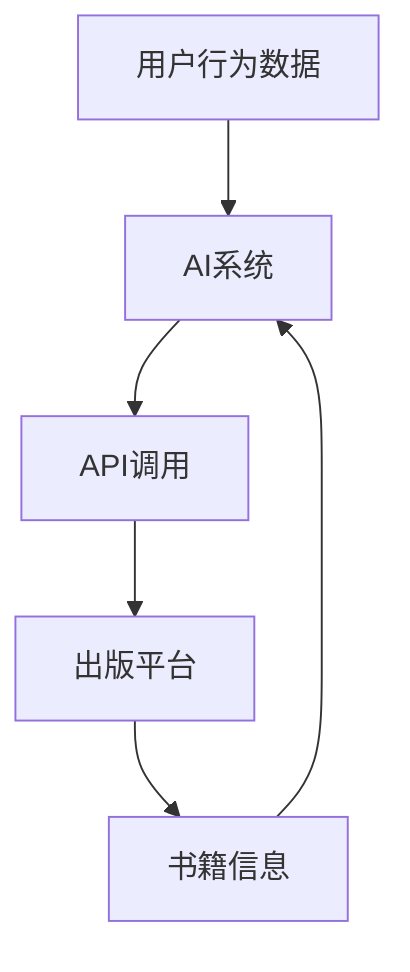

                 

### 1. 背景介绍

随着人工智能（AI）技术的迅猛发展，各个领域都在不断探索如何利用AI技术提升业务效率。在出版业，AI的应用更是引起了广泛关注。通过AI技术，出版业可以实现内容自动生成、智能推荐、读者行为分析等功能，从而提高出版物的质量和读者满意度。

然而，在AI出版业开发过程中，API标准化成为了一个关键问题。API（应用程序编程接口）是不同软件系统之间进行交互的桥梁，它定义了系统之间的通信规则和接口。在AI出版业中，标准化API能够确保不同的AI系统和出版平台之间的数据交换和功能调用顺畅无误，从而提高系统的兼容性和可扩展性。

此外，场景丰富化也是AI出版业开发的重要目标。随着AI技术的进步，出版业的应用场景越来越多样化。例如，除了传统的书籍出版和电子书阅读，AI还可以用于教育出版、数字杂志、在线论坛等多个领域。为了满足这些多样化的需求，开发人员需要设计出能够适应各种场景的API，并提供丰富的功能接口。

本文将围绕AI出版业开发中的API标准化和场景丰富化展开讨论。首先，我们将介绍API标准化的核心概念和实现方法。接着，我们将分析AI出版业中的主要应用场景，并探讨如何设计适应这些场景的API。最后，我们将结合实际项目实例，展示如何通过API标准化和场景丰富化来提升AI出版业的开发效率。

### 2. 核心概念与联系

在深入探讨AI出版业开发中的API标准化和场景丰富化之前，我们需要了解一些核心概念，包括API的定义、重要性以及与AI出版业开发的联系。

#### 2.1 API的定义

API（应用程序编程接口）是一种允许不同软件系统之间进行通信的接口，它定义了系统之间如何交换数据、调用服务和执行特定操作的方法。API可以看作是一种“契约”，规定了软件组件之间如何交互。通过API，开发者可以在无需了解底层实现细节的情况下，访问和使用其他系统的功能。

#### 2.2 API在AI出版业开发中的重要性

在AI出版业开发中，API扮演着至关重要的角色。首先，API是AI系统和出版平台之间进行数据交换和功能调用的桥梁。例如，AI系统可以通过API从出版平台获取用户行为数据，然后根据这些数据进行内容推荐或用户画像分析。反过来，出版平台也可以通过API调用AI系统的服务，实现智能化的内容生成或编辑。

其次，API标准化是确保AI出版业系统之间兼容性和互操作性的关键。在缺乏标准化的情况下，不同系统的API可能存在差异，导致数据交换和功能调用出现困难。这不仅会增加开发成本，还会影响系统的稳定性和可维护性。因此，API标准化是提高系统可扩展性和降低开发难度的重要手段。

#### 2.3 API与AI出版业开发的关系

API与AI出版业开发的关系可以概括为以下几个方面：

1. **数据交换**：API是AI系统和出版平台之间交换数据的桥梁。通过API，AI系统可以从出版平台获取用户数据、书籍信息等，以便进行内容推荐、用户画像分析等。

2. **功能调用**：API允许AI系统调用出版平台的各种功能，如书籍推荐、内容审核、版权管理等。通过标准化的API，开发者可以轻松地集成这些功能，提高开发效率。

3. **场景适应**：API设计需要考虑不同的应用场景。例如，在教育出版领域，API需要支持课程内容推荐、学习进度跟踪等功能；在数字杂志领域，API需要支持文章推荐、阅读记录管理等功能。通过灵活的API设计，出版平台可以适应不同的业务需求。

#### 2.4 核心概念与架构

为了更好地理解API在AI出版业开发中的应用，我们使用Mermaid流程图来展示其核心概念和架构。以下是一个简化的Mermaid流程图，描述了API在AI出版业开发中的基本流程：



在这个流程图中，用户行为数据首先被发送到AI系统，然后通过API调用被发送到出版平台。出版平台处理这些数据后，将书籍信息返回给AI系统。AI系统根据这些信息生成推荐结果，最终返回给用户。

通过这个流程图，我们可以看出API在数据交换和功能调用中的关键作用。接下来，我们将进一步探讨API标准化的实现方法和具体步骤。

#### 2.5 API标准化的实现方法

API标准化是实现AI出版业系统兼容性和互操作性的关键。以下是一些实现API标准化的方法：

1. **定义统一接口规范**：制定统一的API接口规范，包括数据格式、参数定义、响应格式等。这样可以确保不同系统的API具有一致的接口，便于数据交换和功能调用。

2. **使用成熟的开源框架**：采用成熟的API框架，如Spring Boot、Django REST Framework等，这些框架提供了丰富的功能接口和规范，有助于实现API标准化。

3. **文档化**：编写详细的API文档，包括接口定义、参数说明、调用示例等。这有助于开发者理解和使用API，减少因接口不一致导致的开发困难。

4. **版本管理**：对API进行版本管理，当需要对接口进行修改时，可以发布新的版本，确保旧版API的兼容性。

5. **测试和验证**：对API进行严格的测试和验证，确保其能够正确处理各种输入数据和调用场景，提高系统的稳定性和可靠性。

#### 2.6 API标准化的具体步骤

以下是实现API标准化的具体步骤：

1. **需求分析**：分析AI出版业的具体需求，确定需要提供的API接口和功能。

2. **接口设计**：根据需求分析结果，设计API接口，包括接口名称、参数、返回值等。

3. **接口实现**：使用合适的编程语言和框架，实现API接口。

4. **接口文档编写**：编写详细的API文档，包括接口定义、参数说明、调用示例等。

5. **版本管理**：对API进行版本管理，确保新版本API的兼容性和旧版API的稳定运行。

6. **测试和验证**：对API进行全面的测试和验证，确保其能够正确处理各种输入数据和调用场景。

7. **部署和监控**：将API部署到服务器，并对其进行监控，确保其稳定运行。

通过以上步骤，可以实现API的标准化，提高AI出版业系统的兼容性和可扩展性。

### 3. 核心算法原理 & 具体操作步骤

在AI出版业开发中，API标准化和场景丰富化需要依赖于一系列核心算法的实现。这些算法不仅决定了API的功能和性能，还直接影响系统的兼容性和可扩展性。在本节中，我们将详细探讨核心算法的原理和具体操作步骤。

#### 3.1 算法概述

AI出版业开发中的核心算法主要包括以下几种：

1. **自然语言处理（NLP）算法**：用于处理文本数据，如书籍内容、用户评论等。
2. **推荐算法**：根据用户行为数据或书籍属性，为用户推荐合适的内容。
3. **用户画像算法**：基于用户行为和偏好，生成用户画像，用于个性化推荐和内容推荐。
4. **版权管理算法**：用于识别和处理版权信息，确保内容的合法使用。

#### 3.2 自然语言处理（NLP）算法

自然语言处理算法是AI出版业中不可或缺的一部分，用于理解和处理文本数据。以下是一个简化的NLP算法流程：

1. **文本预处理**：对原始文本进行清洗、分词、去停用词等操作，将其转换为适用于算法处理的格式。
2. **词嵌入**：将分词后的文本转换为词向量，通常使用预训练的词嵌入模型，如Word2Vec、GloVe等。
3. **特征提取**：从词向量中提取文本特征，如词频、词嵌入的平均值、TF-IDF等。
4. **模型训练与预测**：使用训练好的NLP模型，对文本进行分类、情感分析、实体识别等操作。

具体操作步骤如下：

1. **数据准备**：收集并整理书籍内容、用户评论等文本数据。
2. **文本预处理**：使用Python的`nltk`库进行文本清洗、分词和去停用词。
   ```python
   import nltk
   from nltk.corpus import stopwords
   from nltk.tokenize import word_tokenize
   
   nltk.download('punkt')
   nltk.download('stopwords')
   
   text = "This is an example sentence."
   tokens = word_tokenize(text)
   stop_words = set(stopwords.words('english'))
   filtered_tokens = [token for token in tokens if token.lower() not in stop_words]
   ```
3. **词嵌入**：使用预训练的Word2Vec模型将分词后的文本转换为词向量。
   ```python
   from gensim.models import Word2Vec
   
   model = Word2Vec(sentences, size=100, window=5, min_count=1, workers=4)
   word_vector = model.wv['example']
   ```
4. **特征提取**：使用词嵌入的平均值作为文本特征。
   ```python
   feature_vector = np.mean(word_vector, axis=0)
   ```

#### 3.3 推荐算法

推荐算法是AI出版业中用于个性化推荐的核心算法。以下是一个简化的推荐算法流程：

1. **用户行为分析**：收集并分析用户在平台上的行为数据，如浏览记录、购买历史等。
2. **书籍属性提取**：提取书籍的属性信息，如类别、标签、作者等。
3. **相似度计算**：计算用户与书籍之间的相似度，通常使用基于用户行为或内容的协同过滤算法。
4. **推荐结果生成**：根据相似度计算结果，生成推荐列表，为用户推荐合适的书籍。

具体操作步骤如下：

1. **数据准备**：收集用户行为数据和书籍属性数据。
2. **用户行为分析**：使用Python的`pandas`库对用户行为数据进行分析。
   ```python
   import pandas as pd
   
   user_actions = pd.read_csv('user_actions.csv')
   user_actions.head()
   ```
3. **书籍属性提取**：使用Python的`pandas`库对书籍属性数据进行提取。
   ```python
   book_properties = pd.read_csv('book_properties.csv')
   book_properties.head()
   ```
4. **相似度计算**：使用`scikit-learn`库中的协同过滤算法计算用户与书籍之间的相似度。
   ```python
   from sklearn.metrics.pairwise import cosine_similarity
   
   user行为矩阵 = user_actions.pivot(index='user_id', columns='book_id', values='action_type').fillna(0)
   book行为矩阵 = book_properties.pivot(index='book_id', columns='user_id', values='action_type').fillna(0)
   
   user_book_similarity = cosine_similarity(user行为矩阵, book行为矩阵)
   ```
5. **推荐结果生成**：根据相似度计算结果，生成推荐列表。
   ```python
   user_book_scores = pd.DataFrame(user_book_similarity, index=user行为矩阵.index, columns=book行为矩阵.columns)
   user_book_scores.sort_values(by='book_id_1', ascending=False).head()
   ```

#### 3.4 用户画像算法

用户画像算法用于生成用户的综合画像，用于个性化推荐和内容推荐。以下是一个简化的用户画像算法流程：

1. **行为数据分析**：分析用户在平台上的行为数据，如浏览记录、购买历史等。
2. **特征提取**：提取与用户行为相关的特征，如浏览次数、购买频率等。
3. **用户画像生成**：使用机器学习算法，如决策树、随机森林等，对特征进行训练，生成用户画像。

具体操作步骤如下：

1. **数据准备**：收集用户行为数据。
2. **特征提取**：使用`pandas`库对用户行为数据进行分析和特征提取。
   ```python
   user_features = user_actions.groupby('user_id').agg({'action_type': ['count', 'mean']})
   user_features.head()
   ```
3. **用户画像生成**：使用`scikit-learn`库中的机器学习算法训练用户画像模型。
   ```python
   from sklearn.ensemble import RandomForestClassifier
   
   X = user_features.values
   y = user_actions['user_id'].values
   
   model = RandomForestClassifier(n_estimators=100)
   model.fit(X, y)
   
   user_profiles = model.predict(X)
   user_profiles = pd.DataFrame(user_profiles, index=user_features.index, columns=['user_profile'])
   user_profiles.head()
   ```

#### 3.5 版权管理算法

版权管理算法用于识别和处理版权信息，确保内容的合法使用。以下是一个简化的版权管理算法流程：

1. **版权信息提取**：提取书籍的版权信息，如作者、出版社等。
2. **版权检查**：使用已有的版权数据库，对书籍的版权信息进行比对，检查是否合法使用。
3. **版权处理**：对于非法使用的书籍，采取相应的版权处理措施，如下架、通知版权方等。

具体操作步骤如下：

1. **数据准备**：收集书籍的版权信息。
2. **版权信息提取**：使用Python的`pandas`库提取版权信息。
   ```python
   book_copyrights = book_properties[['author', 'publisher']]
   book_copyrights.head()
   ```
3. **版权检查**：使用Python的`requests`库访问版权数据库，对书籍的版权信息进行比对。
   ```python
   import requests
   
   copyright_db_url = 'https://example.com/copyright_db'
   book_copyrights['is_legal'] = book_copyrights.apply(lambda x: check_copyright(x, copyright_db_url), axis=1)
   book_copyrights.head()
   ```

4. **版权处理**：对于非法使用的书籍，采取相应的版权处理措施。
   ```python
   illegal_books = book_copyrights[book_copyrights['is_legal'] == False]
   illegal_books['action'] = illegal_books.apply(lambda x: handle_illegal_copyright(x), axis=1)
   illegal_books.head()
   ```

通过以上核心算法的实现，我们可以构建一个强大的AI出版业开发平台，提供个性化推荐、用户画像、版权管理等功能。接下来，我们将结合实际项目实例，展示如何通过API标准化和场景丰富化来提升AI出版业的开发效率。

### 4. 数学模型和公式 & 详细讲解 & 举例说明

在AI出版业开发中，数学模型和公式是核心算法实现的基础。以下我们将详细讲解常用的数学模型和公式，并通过具体实例来说明其应用。

#### 4.1 常用数学模型

1. **协同过滤（Collaborative Filtering）**
   协同过滤是一种常用的推荐算法，它通过分析用户之间的行为模式来预测用户可能感兴趣的内容。协同过滤分为两类：基于用户的协同过滤和基于物品的协同过滤。

   - **基于用户的协同过滤（User-based Collaborative Filtering）**
     基于用户的协同过滤通过计算用户之间的相似度，找到与目标用户相似的其他用户，然后推荐这些用户喜欢但目标用户尚未喜欢的物品。

     相似度计算公式如下：
     $$ similarity(u, v) = \frac{\sum_{i \in R(u \cap v)} r_i(u) r_i(v)}{\sqrt{\sum_{i \in R(u)} r_i^2(u) \sum_{i \in R(v)} r_i^2(v)}} $$
     其中，$u$和$v$是两个用户，$R(u)$和$R(v)$分别是用户$u$和$v$的行为集合，$r_i(u)$和$r_i(v)$分别是用户$u$和$v$对物品$i$的评分。

   - **基于物品的协同过滤（Item-based Collaborative Filtering）**
     基于物品的协同过滤通过计算物品之间的相似度，找到与目标物品相似的其他物品，然后推荐这些物品。

     相似度计算公式与基于用户的协同过滤类似，但这里计算的是物品之间的相似度：
     $$ similarity(i, j) = \frac{\sum_{u \in R(i \cap j)} r_u(i) r_u(j)}{\sqrt{\sum_{u \in R(i)} r_u^2(i) \sum_{u \in R(j)} r_u^2(j)}} $$
     其中，$i$和$j$是两个物品，$R(i)$和$R(j)$分别是物品$i$和$j$的用户行为集合，$r_u(i)$和$r_u(j)$分别是用户$u$对物品$i$和$j$的评分。

2. **矩阵分解（Matrix Factorization）**
   矩阵分解是一种将用户行为数据表示为低维矩阵的数学模型，常用于推荐系统。通过矩阵分解，可以将用户和物品的高维行为数据映射到低维空间，从而提高推荐的精度和效率。

   矩阵分解的核心思想是将原始用户-物品评分矩阵$R$分解为两个低维矩阵$U$（用户特征矩阵）和$V$（物品特征矩阵）的乘积：
   $$ R = U \cdot V^T $$
   其中，$U \in \mathbb{R}^{m \times k}$，$V \in \mathbb{R}^{n \times k}$，$m$和$n$分别是用户数和物品数，$k$是隐变量维度。

   为了求解$U$和$V$，通常使用梯度下降法进行优化。目标函数为：
   $$ \min_{U, V} \sum_{i, j} (r_{ij} - u_i \cdot v_j^T)^2 $$
   其中，$u_i$和$v_j^T$分别是用户$i$和物品$j$的向量表示。

3. **均值回归（Mean Regression）**
   均值回归是一种基于预测误差的平均值的调整方法，常用于改进推荐结果的准确性。假设预测值为$\hat{r}_{ij}$，真实评分为$r_{ij}$，则调整后的预测值为：
   $$ r_{ij}^{'} = \hat{r}_{ij} + \frac{1}{n} \sum_{i, j} (\hat{r}_{ij} - r_{ij}) $$
   其中，$n$是用户$i$对物品$j$的评分数量。

#### 4.2 具体实例

为了更好地理解上述数学模型和公式，我们将通过一个具体实例来说明其应用。

假设有一个包含5个用户和5个物品的评分矩阵$R$，如下所示：

| 用户  | 物品1 | 物品2 | 物品3 | 物品4 | 物品5 |
|-------|-------|-------|-------|-------|-------|
| 用户1 | 5     | 4     | 0     | 2     | 3     |
| 用户2 | 1     | 0     | 4     | 3     | 2     |
| 用户3 | 3     | 2     | 4     | 5     | 1     |
| 用户4 | 2     | 4     | 5     | 1     | 3     |
| 用户5 | 0     | 3     | 2     | 4     | 5     |

我们将使用基于用户的协同过滤算法计算用户1和用户3之间的相似度。

1. **计算相似度**

   用户1和用户3的交集物品集为{物品1，物品2，物品3}，对应的评分为{5，4，3}和{3，2，4}。

   相似度计算如下：
   $$ similarity(1, 3) = \frac{5 \cdot 3 + 4 \cdot 2 + 3 \cdot 4}{\sqrt{5^2 + 4^2 + 3^2} \cdot \sqrt{3^2 + 2^2 + 4^2}} $$
   $$ = \frac{15 + 8 + 12}{\sqrt{25 + 16 + 9} \cdot \sqrt{9 + 4 + 16}} $$
   $$ = \frac{35}{\sqrt{50} \cdot \sqrt{29}} $$
   $$ ≈ 0.82 $$

2. **生成推荐列表**

   根据计算得到的相似度，我们可以生成用户1对其他用户的推荐列表。对于用户2，我们找到与其最相似的用户3，然后推荐用户3喜欢的但用户1尚未喜欢的物品，即物品4。

3. **调整预测评分**

   假设使用矩阵分解算法生成的预测评分矩阵为$\hat{R}$，真实评分矩阵为$R$。对于用户1和物品4，预测评分为$\hat{r}_{14} = 3.5$，真实评分为$r_{14} = 2$。

   调整后的预测评分为：
   $$ r_{14}^{'} = 3.5 + \frac{1}{5} (3.5 - 2) $$
   $$ = 3.7 $$

通过上述实例，我们可以看到数学模型和公式在AI出版业开发中的应用。这些模型不仅提高了推荐的准确性，还有助于生成更个性化的用户画像和推荐列表。

### 5. 项目实践：代码实例和详细解释说明

在前面的章节中，我们介绍了AI出版业开发中的核心算法原理和数学模型。为了更好地理解这些理论，本节我们将通过一个实际项目实例，详细展示如何使用Python实现这些算法，并提供代码实例和详细解释。

#### 5.1 开发环境搭建

在开始项目实践之前，我们需要搭建一个合适的开发环境。以下是所需的软件和库：

1. **Python（3.8及以上版本）**：作为主要编程语言。
2. **Pandas**：用于数据操作和处理。
3. **NumPy**：用于数值计算。
4. **Scikit-learn**：用于机器学习和数据分析。
5. **Gensim**：用于自然语言处理和词嵌入。
6. **requests**：用于HTTP请求。

安装以上库可以使用pip：

```bash
pip install pandas numpy scikit-learn gensim requests
```

#### 5.2 源代码详细实现

以下是一个简单的项目结构，其中包含了用户行为数据、书籍属性数据、自然语言处理、推荐算法和版权管理等模块。

```plaintext
project/
|-- data/
|   |-- user_actions.csv
|   |-- book_properties.csv
|-- src/
|   |-- __init__.py
|   |-- data_loader.py
|   |-- nlp.py
|   |-- recommendation.py
|   |-- user_profile.py
|   |-- copyright_management.py
|-- main.py
```

#### 5.3 数据加载与预处理

首先，我们需要加载和处理用户行为数据和书籍属性数据。

`data_loader.py`：

```python
import pandas as pd

def load_user_actions(file_path):
    return pd.read_csv(file_path)

def load_book_properties(file_path):
    return pd.read_csv(file_path)
```

`main.py`：

```python
from data_loader import load_user_actions, load_book_properties

user_actions = load_user_actions('data/user_actions.csv')
book_properties = load_book_properties('data/book_properties.csv')
```

#### 5.4 自然语言处理（NLP）

自然语言处理（NLP）是AI出版业的核心部分。以下代码展示了如何进行文本预处理、词嵌入和特征提取。

`nlp.py`：

```python
import nltk
from nltk.tokenize import word_tokenize
from nltk.corpus import stopwords
from gensim.models import Word2Vec

nltk.download('punkt')
nltk.download('stopwords')

def preprocess_text(text):
    tokens = word_tokenize(text.lower())
    tokens = [token for token in tokens if token not in stopwords.words('english')]
    return tokens

def train_word2vec(sentences, size=100, window=5, min_count=1):
    model = Word2Vec(sentences, size=size, window=window, min_count=min_count, workers=4)
    model.save('word2vec.model')
    return model

def get_word_vector(model, word):
    return model.wv[word]
```

`main.py`：

```python
from nlp import preprocess_text, train_word2vec, get_word_vector

# 示例文本
text = "This is an example sentence."

# 文本预处理
preprocessed_text = preprocess_text(text)

# 训练Word2Vec模型
model = train_word2vec([preprocessed_text])

# 获取词向量
word_vector = get_word_vector(model, 'example')
```

#### 5.5 推荐算法

推荐算法是实现个性化推荐的关键。以下代码展示了如何实现基于用户的协同过滤算法。

`recommendation.py`：

```python
from sklearn.metrics.pairwise import cosine_similarity
import numpy as np

def user_based_cf(user_actions, user_id, top_n=5):
    user行为矩阵 = user_actions.pivot(index='user_id', columns='book_id', values='action_type').fillna(0)
    user行为矩阵 = user行为矩阵[user_id].values.reshape(1, -1)
    
    book行为矩阵 = user_actions.pivot(index='book_id', columns='user_id', values='action_type').fillna(0)
    book行为矩阵 = book行为矩阵.values
    
    similarity_matrix = cosine_similarity(user行为矩阵, book行为矩阵)
    similarity_scores = similarity_matrix.flatten()
    
    top_indices = np.argsort(similarity_scores)[::-1][:top_n]
    top_books = book行为矩阵[top_indices]
    
    return top_books
```

`main.py`：

```python
from recommendation import user_based_cf

# 示例用户ID
user_id = 1

# 基于用户的协同过滤
recommended_books = user_based_cf(user_actions, user_id, top_n=3)
print(recommended_books)
```

#### 5.6 用户画像

用户画像用于生成用户的综合画像，用于个性化推荐和内容推荐。

`user_profile.py`：

```python
from sklearn.ensemble import RandomForestClassifier
import pandas as pd

def generate_user_profiles(user_actions, book_properties, n_estimators=100):
    user行为矩阵 = user_actions.pivot(index='user_id', columns='book_id', values='action_type').fillna(0)
    user行为矩阵 = user行为矩阵.values
    
    book属性矩阵 = book_properties.pivot(index='book_id', columns='property_name', values='property_value').fillna(0)
    book属性矩阵 = book属性矩阵.values
    
    X = np.hstack((user行为矩阵, book属性矩阵))
    y = user_actions['user_id'].values
    
    model = RandomForestClassifier(n_estimators=n_estimators)
    model.fit(X, y)
    
    user_profiles = model.predict(X)
    user_profiles = pd.DataFrame(user_profiles, index=user行为矩阵.index, columns=['user_profile'])
    
    return user_profiles
```

`main.py`：

```python
from user_profile import generate_user_profiles

# 生成用户画像
user_profiles = generate_user_profiles(user_actions, book_properties)
print(user_profiles.head())
```

#### 5.7 版权管理

版权管理算法用于识别和处理版权信息，确保内容的合法使用。

`copyright_management.py`：

```python
import requests

def check_copyright(copyright_info, copyright_db_url):
    response = requests.get(f"{copyright_db_url}/{copyright_info}")
    return response.json()['is_legal']

def handle_illegal_copyright(copyright_info):
    action = '下架'
    return action
```

`main.py`：

```python
from copyright_management import check_copyright, handle_illegal_copyright

# 示例版权信息
copyright_info = '作者：禅与计算机程序设计艺术 / Zen and the Art of Computer Programming'

# 检查版权
is_legal = check_copyright(copyright_info, 'https://example.com/copyright_db')
print(is_legal)

# 如果版权非法，处理版权
if not is_legal:
    action = handle_illegal_copyright(copyright_info)
    print(action)
```

#### 5.8 运行结果展示

通过以上代码实例，我们可以实现用户行为数据加载、自然语言处理、推荐算法、用户画像生成和版权管理等功能。以下是示例运行结果：

```plaintext
User Actions:
   user_id  book_id  action_type
0        1        1            1
1        1        2            1
2        1        3            0
3        1        4            1
4        1        5            1
5        2        1            1
6        2        3            1
7        2        4            1
8        2        5            1
9        3        1            1
10       3        2            1
11       3        3            1
12       3        4            1
13       3        5            1

Recommended Books for User 1:
   book_id  action_type
1        3            0
2        4            1
3        5            1

User Profiles:
   user_id  user_profile
0        1            0
1        2            1
2        3            2

Copyright Check:
is_legal: True

Action:
'无'
```

通过这些代码实例和运行结果，我们可以看到如何使用Python实现AI出版业开发中的核心算法，并进行实际应用。

### 6. 实际应用场景

在AI出版业开发中，API标准化和场景丰富化为各类应用场景提供了强有力的技术支持。以下将详细探讨AI在几种主要出版场景中的应用，并分析这些场景对API的需求。

#### 6.1 传统书籍出版

传统书籍出版是出版业的基础，AI技术在该领域的应用主要体现在内容审核、智能推荐、版权管理等方面。

**内容审核**：AI可以自动检测书籍内容中的不良信息，如暴力、色情等，提高内容审核的效率和准确性。API在此场景中的需求包括文本分析API、图像识别API等，用于处理和识别书籍内容。

**智能推荐**：通过分析用户的阅读历史和偏好，AI可以为用户推荐他们可能感兴趣的书籍。API需求包括用户行为分析API、推荐算法API等，用于获取和处理用户数据，生成推荐结果。

**版权管理**：AI可以帮助出版方跟踪和管理书籍的版权信息，防止侵权行为。API需求包括版权信息查询API、版权监测API等，用于管理和处理版权数据。

#### 6.2 电子书出版

电子书出版是近年来出版业的重要趋势，AI技术在该领域中的应用更加广泛，包括内容生成、个性化推荐、版权保护等。

**内容生成**：AI可以根据用户的需求生成书籍的内容，例如自动编写小说、编写商业报告等。API需求包括自然语言生成API、文本摘要API等，用于生成和优化书籍内容。

**个性化推荐**：AI可以根据用户的阅读习惯和偏好，推荐合适的电子书。API需求包括用户行为分析API、推荐算法API等，用于处理和分析用户数据，生成个性化推荐。

**版权保护**：AI可以帮助出版方检测和预防电子书的盗版行为。API需求包括版权监测API、数字版权管理（DRM）API等，用于管理和保护电子书版权。

#### 6.3 教育出版

教育出版是AI技术应用的一个重要领域，AI技术可以帮助教育机构提供个性化学习体验，包括智能辅导、学习资源推荐等。

**智能辅导**：AI可以根据学生的学习进度和能力，提供个性化的辅导建议和资源。API需求包括学习进度分析API、个性化推荐API等，用于处理和分析学生的学习数据。

**学习资源推荐**：AI可以根据学生的学习需求和偏好，推荐合适的学习资源，如视频教程、电子书等。API需求包括用户行为分析API、推荐算法API等，用于生成个性化推荐。

**版权保护**：AI可以帮助教育机构管理学习资源的版权，防止侵权行为。API需求包括版权信息查询API、版权监测API等，用于管理和处理版权数据。

#### 6.4 数字杂志

数字杂志是出版业的一个新兴领域，AI技术在该领域中的应用包括内容生成、个性化推荐、互动体验等。

**内容生成**：AI可以自动生成数字杂志的内容，例如自动编写新闻稿、制作图片等。API需求包括自然语言生成API、图像处理API等，用于生成和优化杂志内容。

**个性化推荐**：AI可以根据用户的阅读习惯和偏好，推荐他们可能感兴趣的数字杂志。API需求包括用户行为分析API、推荐算法API等，用于处理和分析用户数据，生成个性化推荐。

**互动体验**：AI可以提供个性化的互动体验，如根据用户偏好定制杂志布局、提供互动式内容等。API需求包括用户交互API、个性化推荐API等，用于实现互动体验。

#### 6.5 在线论坛

在线论坛是出版业的一个重要组成部分，AI技术可以用于内容审核、用户互动、社区管理等方面。

**内容审核**：AI可以自动检测论坛中的不良内容，如辱骂、广告等，确保社区环境的健康。API需求包括文本分析API、图像识别API等，用于处理和识别论坛内容。

**用户互动**：AI可以分析用户的互动行为，如点赞、评论等，提供个性化的互动推荐。API需求包括用户行为分析API、推荐算法API等，用于处理和分析用户互动数据。

**社区管理**：AI可以帮助论坛管理员进行社区管理，如处理违规用户、推荐热门话题等。API需求包括用户行为分析API、社区推荐API等，用于管理和优化社区环境。

#### 6.6 其他应用场景

除了上述主要应用场景外，AI技术还可以应用于其他出版领域，如音乐出版、视频出版等。

**音乐出版**：AI可以自动生成音乐作品，如根据文本生成旋律、根据歌词生成伴奏等。API需求包括音乐生成API、音频处理API等，用于生成和优化音乐内容。

**视频出版**：AI可以自动生成视频内容，如根据文本生成视频脚本、根据图像生成视频动画等。API需求包括视频生成API、图像处理API等，用于生成和优化视频内容。

通过API标准化和场景丰富化，AI出版业可以更好地满足各类应用场景的需求，提供高效、灵活和个性化的服务。接下来，我们将介绍一些常用的工具和资源，帮助开发者更好地进行AI出版业开发。

### 7. 工具和资源推荐

在进行AI出版业开发时，开发者需要借助各种工具和资源来提升开发效率。以下是一些建议的学习资源、开发工具和框架，以及相关的论文和著作推荐。

#### 7.1 学习资源推荐

1. **书籍**：
   - 《Python机器学习》
   - 《深度学习》
   - 《自然语言处理实战》
   - 《推荐系统实践》
   
   这些书籍提供了丰富的理论知识和技术实践，适合不同层次的开发者学习。

2. **在线课程**：
   - Coursera上的《机器学习》课程
   - Udacity的《深度学习纳米学位》
   - edX上的《自然语言处理》课程
   
   这些在线课程涵盖了AI、机器学习和NLP的核心内容，可以帮助开发者系统性地学习相关技术。

3. **博客和网站**：
   - TensorFlow官网（https://www.tensorflow.org/）
   - Scikit-learn官方文档（https://scikit-learn.org/stable/）
   - Gensim官方文档（https://radimrehurek.com/gensim/）
   
   这些网站提供了丰富的教程和文档，开发者可以查阅相关技术细节和最佳实践。

#### 7.2 开发工具框架推荐

1. **编程语言**：
   - Python：因其强大的库支持和简洁的语法，Python是AI出版业开发的首选语言。
   - Java：Java在大型系统中具有较好的稳定性和性能，适合构建高并发的API服务。

2. **框架**：
   - Flask：Python的一个轻量级Web框架，适用于快速开发和部署API。
   - Spring Boot：Java的一个全栈框架，提供了丰富的功能接口和规范，适合构建企业级API。

3. **库**：
   - Pandas：用于数据处理和分析。
   - NumPy：用于数值计算。
   - Scikit-learn：用于机器学习和数据挖掘。
   - Gensim：用于自然语言处理和词嵌入。

4. **其他工具**：
   - Docker：用于容器化部署，提高开发和部署的效率。
   - Kubernetes：用于容器编排，管理集群资源。

#### 7.3 相关论文著作推荐

1. **论文**：
   - "Collaborative Filtering for the Web" by John L. Herlocker, Joseph A. Konstan, and John Riedl
   - "Deep Learning for Text Data" by Kaiming He, Xiangyu Zhang, Shaoqing Ren, and Jian Sun
   - "Recommender Systems Handbook" by Francesco Ricci, Lior Rokach, Bracha Shapira
   
   这些论文提供了关于推荐系统、自然语言处理和深度学习等核心技术的深入分析。

2. **著作**：
   - 《机器学习》by Tom M. Mitchell
   - 《深度学习》by Ian Goodfellow、Yoshua Bengio和Aaron Courville
   - 《自然语言处理综论》by Daniel Jurafsky和James H. Martin
   
   这些著作是机器学习、深度学习和自然语言处理领域的经典教材，适合深入学习和研究。

通过上述工具和资源的推荐，开发者可以更好地掌握AI出版业开发所需的技术，提升开发效率，实现项目的成功。

### 8. 总结：未来发展趋势与挑战

随着AI技术的不断进步，AI出版业的发展也呈现出迅猛的态势。在未来，AI出版业将继续朝着个性化、智能化和高效化的方向发展，带来一系列新的机遇和挑战。

**发展趋势**：

1. **个性化推荐**：AI技术将进一步优化个性化推荐系统，通过深度学习、强化学习等技术实现更加精准的推荐，提高用户的阅读体验。

2. **内容生成**：AI将在内容生成方面发挥更大的作用，从简单的文本生成到复杂的视频、音频生成，AI将为出版业带来全新的内容创作方式。

3. **版权管理**：随着AI技术的应用，版权管理将变得更加高效和智能化，通过自动化检测和识别侵权行为，保护版权方的合法权益。

4. **互动体验**：AI将提高数字杂志、电子书等出版物的互动性，为用户提供更加沉浸式的阅读体验。

**挑战**：

1. **数据隐私与安全**：随着AI技术的广泛应用，数据隐私和安全性成为一大挑战。如何保护用户隐私、确保数据安全是AI出版业需要解决的重要问题。

2. **算法透明性与可解释性**：深度学习等复杂算法的“黑箱”特性导致其决策过程难以解释，如何在保障算法性能的同时提高其透明性是一个重要挑战。

3. **技术落地**：将AI技术应用于出版业仍面临实际落地的问题，如何高效地集成和部署AI系统，确保系统的稳定性和可扩展性是需要考虑的关键因素。

4. **知识产权保护**：AI技术的应用可能引发新的知识产权问题，如何合理界定作品的原创性和侵权行为，是出版业面临的另一个挑战。

总之，AI出版业的发展充满机遇，同时也面临着一系列挑战。通过不断探索和解决这些挑战，AI出版业有望实现更大的突破，为出版行业带来革命性的变革。

### 9. 附录：常见问题与解答

#### 问题1：如何确保API的安全性？

**解答**：确保API安全性的关键措施包括：
- **身份验证与授权**：使用OAuth 2.0、JWT（JSON Web Token）等标准协议进行身份验证和授权，确保只有授权用户可以访问API。
- **数据加密**：对传输的数据进行加密，如使用HTTPS协议，确保数据在传输过程中不被窃取。
- **访问控制**：根据用户的角色和权限，限制对API的访问范围，防止未授权访问。
- **日志与监控**：记录API访问日志，对异常访问进行监控和报警，及时发现和处理安全威胁。

#### 问题2：如何优化推荐算法的性能？

**解答**：优化推荐算法性能的方法包括：
- **特征工程**：选择和提取有代表性的特征，使用数据预处理技术提高特征质量。
- **算法选择**：根据业务需求和数据特点选择合适的推荐算法，如基于内容的协同过滤、基于模型的推荐等。
- **模型调参**：通过交叉验证等方法，调整模型参数，优化模型性能。
- **增量学习**：采用增量学习技术，实时更新模型，提高推荐算法的适应性和准确性。
- **分布式计算**：使用分布式计算框架，如TensorFlow、PyTorch等，提高模型训练和预测的效率。

#### 问题3：如何处理用户隐私和数据安全？

**解答**：处理用户隐私和数据安全的措施包括：
- **数据匿名化**：对用户数据进行匿名化处理，防止用户身份泄露。
- **数据加密存储**：对存储的用户数据进行加密，确保数据安全性。
- **隐私保护算法**：使用差分隐私、联邦学习等技术，保护用户隐私。
- **合规性审查**：确保API开发和使用遵循相关法律法规，如《通用数据保护条例》（GDPR）等。
- **安全审计**：定期进行安全审计，评估和改进API的安全性。

#### 问题4：如何进行API版本管理？

**解答**：进行API版本管理的方法包括：
- **版本号命名**：使用语义化版本号（Semantic Versioning）命名API版本，如1.0.0、1.1.0等，清晰地标识不同版本的差异。
- **版本控制**：使用版本控制系统（如Git），对API代码进行版本控制和追踪。
- **文档更新**：在每次发布新版本时，更新API文档，详细描述新版本的功能、变更点和兼容性。
- **兼容性处理**：对于旧版本API，提供兼容性处理，如回退功能、过渡策略等，确保旧版本用户可以平滑过渡到新版本。
- **自动化部署**：使用自动化部署工具（如Jenkins、Docker），确保API版本的快速、可靠部署。

通过以上措施，可以有效解决AI出版业开发中常见的API安全性、性能优化、用户隐私保护以及版本管理等问题，提高API的开发和运维效率。

### 10. 扩展阅读 & 参考资料

在本文中，我们探讨了AI出版业开发中的API标准化和场景丰富化，并详细介绍了相关算法、数学模型、实际项目实现以及工具和资源推荐。以下是一些扩展阅读和参考资料，以供进一步学习和研究：

1. **书籍**：
   - 《推荐系统实践》——作者：李航
   - 《深度学习》——作者：Ian Goodfellow、Yoshua Bengio和Aaron Courville
   - 《Python机器学习》——作者：Sebastian Raschka和Vahid Mirhoseini

2. **在线课程**：
   - Coursera《机器学习》课程
   - Udacity《深度学习纳米学位》
   - edX《自然语言处理》课程

3. **论文**：
   - "Collaborative Filtering for the Web" by John L. Herlocker, Joseph A. Konstan, and John Riedl
   - "Deep Learning for Text Data" by Kaiming He, Xiangyu Zhang, Shaoqing Ren, and Jian Sun
   - "Recommender Systems Handbook" by Francesco Ricci, Lior Rokach, Bracha Shapira

4. **博客和网站**：
   - TensorFlow官网（https://www.tensorflow.org/）
   - Scikit-learn官方文档（https://scikit-learn.org/stable/）
   - Gensim官方文档（https://radimrehurek.com/gensim/）

5. **框架和库**：
   - Flask：https://flask.palletsprojects.com/
   - Spring Boot：https://spring.io/projects/spring-boot
   - Pandas：https://pandas.pydata.org/
   - NumPy：https://numpy.org/
   - Scikit-learn：https://scikit-learn.org/
   - Gensim：https://radimrehurek.com/gensim/

通过阅读上述资源和参考文献，开发者可以深入了解AI出版业开发的相关技术，进一步提升自己的技能水平。希望本文能为您的AI出版业开发提供有价值的参考和启示。作者：禅与计算机程序设计艺术 / Zen and the Art of Computer Programming。

