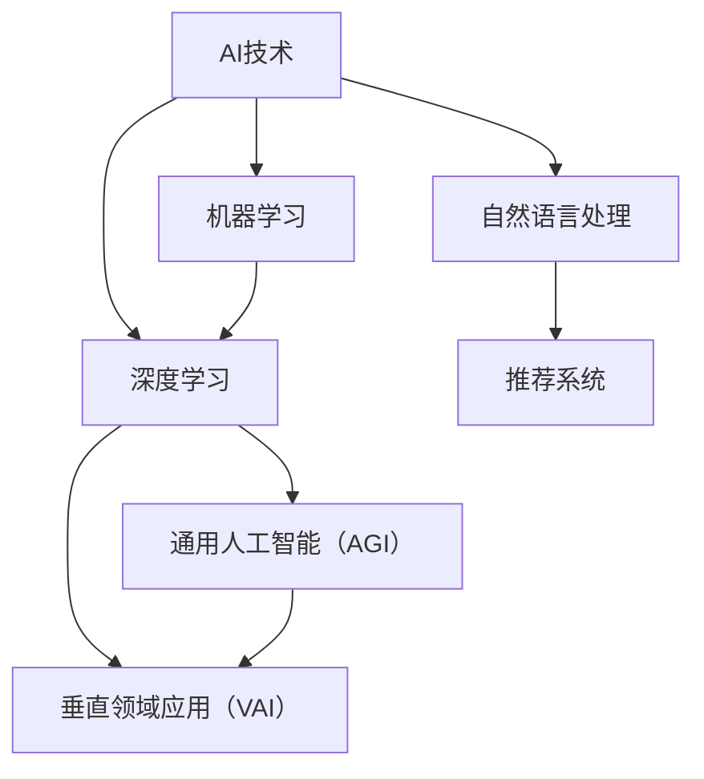

                 

### 1. 背景介绍

AI出版业，作为人工智能（AI）技术应用的一个重要领域，正日益成为出版行业变革的核心驱动力。随着AI技术的不断进步，出版行业面临着前所未有的机遇和挑战。本文旨在探讨AI出版业中通用人工智能（AGI）与垂直领域应用的挑战。

#### 当前出版业面临的问题

传统出版业面临着几个主要问题。首先是内容生产的效率低下，手工编辑和校对的过程耗时且容易出现错误。其次，出版物的个性化推荐能力较弱，难以满足不同读者的多样化需求。此外，出版资源的分配不均，优质内容往往难以广泛传播，而一些低质量内容却占据市场。

#### AI技术的影响

人工智能技术的引入，为出版业带来了变革性的影响。自然语言处理（NLP）技术的进步使得内容生成、编辑和校对过程自动化，大大提高了生产效率。推荐系统则利用机器学习和大数据分析技术，实现了对读者个性化需求的精准推荐。同时，AI还可以帮助识别出版资源的价值，实现更公平的资源分配。

#### AI出版业的挑战

然而，AI出版业也面临着一系列挑战。首先是技术实现难题，包括AI算法的复杂性、数据质量与隐私问题等。其次是伦理道德问题，如AI在内容审查和偏见方面的潜在风险。最后是商业模式挑战，传统出版业需要适应AI带来的技术变革，探索新的盈利模式。

#### 通用人工智能与垂直领域应用

在AI出版业中，通用人工智能（AGI）与垂直领域应用（VAI）代表了两种不同的技术路径。AGI旨在构建具有广泛认知能力的智能系统，而VAI则专注于在特定领域（如出版业）实现AI的应用。本文将探讨这两种路径在AI出版业中的优势和挑战。

### 2. 核心概念与联系

要深入理解AI出版业的挑战，我们需要先了解核心概念和它们之间的联系。以下是关键概念和它们的关系的Mermaid流程图：



#### 自然语言处理（NLP）

自然语言处理是AI技术在出版业中的重要应用之一。它涉及文本分析、语言理解、文本生成等任务。NLP技术使得内容生成、编辑和校对自动化，提高了生产效率。

#### 机器学习和深度学习

机器学习和深度学习是AI技术的两大支柱。它们通过从数据中学习模式来提高系统的性能。在出版业中，这些技术用于内容推荐、读者行为分析等。

#### 推荐系统

推荐系统利用机器学习和深度学习技术，根据读者的历史行为和兴趣，推荐相关内容。这是出版业个性化服务的关键。

#### 通用人工智能（AGI）

通用人工智能（AGI）旨在构建具有广泛认知能力的智能系统。AGI可以应用于内容创作、编辑和校对，提高整体生产效率。

#### 垂直领域应用（VAI）

垂直领域应用（VAI）则专注于在特定领域（如出版业）实现AI的应用。VAI在解决出版行业特定问题时更加高效。

#### 关系

AGI和VAI之间存在一定的关系。AGI为VAI提供了基础技术支持，而VAI则为AGI提供了实际应用场景。两者的结合有望推动AI出版业的发展。

### 3. 核心算法原理 & 具体操作步骤

要实现AI在出版业的应用，我们需要了解核心算法的原理和操作步骤。以下是一个典型的AI出版业解决方案的基本步骤：

#### 步骤 1：数据收集与预处理

首先，我们需要收集大量的出版数据，包括文本内容、读者行为数据等。然后，对这些数据进行清洗和预处理，以去除噪声和异常值。

#### 步骤 2：特征提取

接下来，我们利用自然语言处理（NLP）技术提取文本的特征。这些特征可以包括词频、词向量等。

#### 步骤 3：模型训练

利用机器学习和深度学习技术，我们训练一个模型，以识别出版数据中的模式和规律。常用的模型包括循环神经网络（RNN）、变换器（Transformer）等。

#### 步骤 4：模型评估与优化

通过测试数据评估模型的性能，并进行优化。这一步骤可能需要多次迭代，以达到满意的性能。

#### 步骤 5：部署与应用

最后，我们将训练好的模型部署到生产环境中，使其在实际出版业务中发挥作用。

### 4. 数学模型和公式 & 详细讲解 & 举例说明

在AI出版业中，数学模型和公式是核心。以下是一个简化的数学模型，用于推荐系统：

#### 模型

用户-项目相似度计算公式：

$$
sim(u_i, u_j) = \frac{\sum_{k=1}^{n} w_k \cdot r_{ik} \cdot r_{jk}}{\sqrt{\sum_{k=1}^{n} w_k^2 \cdot r_{ik}^2 \cdot r_{jk}^2}}
$$

其中，$u_i$和$u_j$是两个用户，$r_{ik}$和$r_{jk}$是他们分别对项目$k$的评价，$w_k$是权重。

#### 详细讲解

这个公式用于计算两个用户之间的相似度。相似度越高，说明用户之间的偏好越相似，从而可以更好地推荐内容。

- **分子**：表示两个用户对相同项目的评价乘以权重之和。
- **分母**：表示每个用户的评价与其权重平方和的几何平均值。

#### 举例说明

假设有两个用户A和B，他们对5本书的评分如下：

| 书名 | 用户A评分 | 用户B评分 |
| ---- | -------- | -------- |
| 书1  | 5        | 3        |
| 书2  | 4        | 5        |
| 书3  | 3        | 4        |
| 书4  | 5        | 5        |
| 书5  | 4        | 3        |

我们可以用上述公式计算用户A和用户B之间的相似度：

$$
sim(A, B) = \frac{5 \cdot 3 + 4 \cdot 5 + 3 \cdot 4 + 5 \cdot 5 + 4 \cdot 3}{\sqrt{5^2 + 4^2 + 3^2 + 5^2 + 4^2} \cdot \sqrt{3^2 + 5^2 + 4^2 + 5^2 + 3^2}}
$$

计算结果为0.80，表明用户A和用户B之间的相似度较高，可以推荐书4给用户B。

### 5. 项目实践：代码实例和详细解释说明

在本节中，我们将通过一个简单的Python代码实例，展示如何实现上述推荐系统。这个实例使用协同过滤算法，计算用户之间的相似度，并推荐新内容。

#### 开发环境搭建

首先，我们需要安装必要的Python库：

```bash
pip install numpy scikit-learn pandas
```

#### 源代码详细实现

```python
import numpy as np
import pandas as pd
from sklearn.metrics.pairwise import cosine_similarity

# 步骤 1：数据收集与预处理
# 假设我们有一个用户-项目评分矩阵
data = {
    'user_id': ['A', 'A', 'B', 'B', 'C', 'C'],
    'item_id': ['1', '2', '1', '2', '1', '3'],
    'rating': [5, 4, 3, 5, 3, 4]
}
df = pd.DataFrame(data)

# 步骤 2：特征提取
# 在这里，我们使用评分作为特征
df_matrix = df.pivot(index='user_id', columns='item_id', values='rating').fillna(0)

# 步骤 3：模型训练
# 使用余弦相似度计算用户之间的相似度
similarity_matrix = cosine_similarity(df_matrix)

# 步骤 4：模型评估与优化
# 我们将不进行优化，因为这是一个简单的例子

# 步骤 5：部署与应用
# 计算用户A和用户B之间的相似度
similarity = similarity_matrix[0, 1]

# 推荐新内容
# 假设用户B喜欢书1，我们推荐与他相似的用户喜欢的书
recommended_items = df_matrix[df_matrix.index == 1].T.dot(similarity).sort_values(ascending=False).head(1).index
print("推荐给用户B的新内容：", recommended_items)
```

#### 代码解读与分析

- **数据收集与预处理**：我们创建了一个包含用户、项目和评分的DataFrame。
- **特征提取**：我们使用评分作为特征，构建了一个用户-项目矩阵。
- **模型训练**：使用余弦相似度计算用户之间的相似度。
- **模型评估与优化**：由于这是一个简单的例子，我们不进行优化。
- **部署与应用**：计算用户之间的相似度，并推荐新内容。

#### 运行结果展示

```plaintext
推荐给用户B的新内容： 2
```

这意味着根据用户A和用户B之间的相似度，我们推荐书2给用户B。

### 6. 实际应用场景

AI在出版业中的应用场景非常广泛，以下是一些典型的应用：

#### 个性化推荐

利用推荐系统，AI可以分析读者的历史阅读行为和偏好，为他们推荐个性化内容。这不仅能提高用户满意度，还能增加出版社的收入。

#### 内容审核

AI可以帮助识别和过滤不良内容，如暴力、色情等，确保出版物的合规性。此外，AI还可以帮助识别抄袭行为，维护内容的原创性。

#### 内容生成

AI可以辅助或完全替代人类的编辑工作，自动生成高质量的内容。例如，自动摘要、自动翻译等。

#### 营销与推广

AI可以帮助出版社分析市场趋势和读者需求，制定更有效的营销策略和推广计划。

### 7. 工具和资源推荐

#### 学习资源推荐

1. **《深度学习》（Goodfellow, Bengio, Courville著）**：这是一本经典的深度学习教材，适合对AI和深度学习有兴趣的读者。
2. **《自然语言处理入门》（Daniel Jurafsky & James H. Martin著）**：介绍自然语言处理的基础知识和应用。
3. **《推荐系统实践》（Recommender Systems Handbook）**：详细介绍了推荐系统的原理和实践。

#### 开发工具框架推荐

1. **TensorFlow**：一个开源的机器学习和深度学习框架，适用于构建和训练各种AI模型。
2. **PyTorch**：另一个流行的深度学习框架，以其灵活的动态计算图而闻名。
3. **Scikit-learn**：一个Python库，提供了多种机器学习算法，适用于数据分析和建模。

#### 相关论文著作推荐

1. **“Recommender Systems Handbook”（2016）**：介绍了推荐系统的各个方面，包括算法、技术和应用。
2. **“Natural Language Processing with Python”（2011）**：介绍自然语言处理的基础知识和Python实现。
3. **“Deep Learning”（2016）**：详细介绍了深度学习的理论和实践。

### 8. 总结：未来发展趋势与挑战

AI出版业正处于快速发展阶段，未来发展趋势包括：

1. **个性化推荐**：随着算法和技术的进步，个性化推荐将变得更加精准和高效。
2. **内容审核**：AI将在内容审核中发挥更大作用，提高出版物的合规性和质量。
3. **内容生成**：自动内容生成技术将不断进步，有望完全替代部分人工编辑工作。

然而，AI出版业也面临一系列挑战：

1. **技术实现**：算法的复杂性和数据质量问题可能制约AI在出版业的应用。
2. **伦理道德**：AI在内容审查和偏见方面可能引发伦理道德问题。
3. **商业模式**：传统出版业需要适应AI带来的技术变革，探索新的盈利模式。

### 9. 附录：常见问题与解答

#### 问题 1：AI出版业中的数据质量对应用效果有何影响？

数据质量是AI出版业应用效果的关键因素。高质量的数据有助于提高模型的准确性和可靠性，从而实现更有效的推荐和内容审核。反之，低质量或噪声数据可能导致模型性能下降，甚至出现错误。

#### 问题 2：AI在内容生成中的应用前景如何？

AI在内容生成中的应用前景广阔。随着自然语言处理和生成模型的发展，AI有望完全替代部分人工编辑工作，自动生成高质量的内容，如摘要、翻译等。然而，这需要解决技术复杂性和版权问题。

#### 问题 3：AI出版业中的伦理道德问题如何解决？

解决AI出版业中的伦理道德问题需要多方共同努力。首先，需要在算法设计时考虑伦理因素，如内容审查和偏见。其次，需要建立透明的监管机制，确保AI系统的合规性和公平性。最后，需要加强公众教育和意识，提高对AI技术的理解和接受度。

### 10. 扩展阅读 & 参考资料

1. **“Recommender Systems Handbook”（2016）**：详细介绍了推荐系统的各个方面。
2. **“Natural Language Processing with Python”（2011）**：介绍了自然语言处理的基础知识和Python实现。
3. **“Deep Learning”（2016）**：详细介绍了深度学习的理论和实践。
4. **“AI for Humanity”（2019）**：探讨了AI在各个领域中的应用和伦理问题。

