                 

### 1. 背景介绍

#### AI创业公司的兴起与挑战

近年来，随着人工智能技术的飞速发展，AI创业公司如雨后春笋般涌现。这些公司依托先进的算法、大量的数据和强大的计算能力，在医疗、金融、零售、交通等多个领域展现出巨大的潜力。AI技术的应用不仅提高了效率，还带来了前所未有的创新和商业模式变革。

然而，AI创业公司在追求技术创新的同时，也面临着盈利的挑战。初创企业往往需要在研发和市场推广之间找到平衡，以确保在激烈的市场竞争中站稳脚跟。对于许多创业者来说，如何在保持创新的同时实现盈利，是一个亟待解决的重要问题。

本文旨在探讨AI创业公司如何平衡创新与盈利的关系。我们将从以下几个方面进行深入分析：

1. **创新的重要性及其对盈利的潜在影响**：创新不仅是企业竞争力的源泉，也是推动企业长远发展的动力。我们将探讨创新在商业成功中的角色，并分析创新如何转化为盈利。

2. **盈利模式的选择与策略**：我们将介绍几种常见的盈利模式，并讨论如何选择最适合公司的盈利策略。

3. **成本控制与风险管理**：创业公司在追求盈利的同时，必须有效控制成本和风险。我们将提供一些实用的成本控制和风险管理策略。

4. **实际案例分析与经验总结**：通过分析成功的AI创业公司的案例，我们将总结出一些行之有效的策略和实践。

5. **未来趋势与挑战**：最后，我们将探讨AI创业公司未来可能面临的趋势和挑战，并提出相应的应对策略。

#### 文章结构

本文将采用以下结构：

1. **背景介绍**：概述AI创业公司的兴起与挑战。
2. **核心概念与联系**：介绍与平衡创新与盈利相关的核心概念和架构。
3. **核心算法原理与具体操作步骤**：阐述如何平衡创新与盈利。
4. **数学模型和公式**：分析相关的数学模型和公式。
5. **项目实践**：提供具体的代码实例和运行结果。
6. **实际应用场景**：探讨AI技术的实际应用。
7. **工具和资源推荐**：推荐学习资源、开发工具和论文著作。
8. **总结**：总结未来发展趋势与挑战。
9. **附录**：常见问题与解答。
10. **扩展阅读与参考资料**：提供进一步学习的资源。

接下来，我们将逐一深入探讨这些内容。

### 2. 核心概念与联系

在探讨如何平衡AI创业公司的创新与盈利之前，我们需要了解一些核心概念和它们之间的关系。这些概念包括创新、盈利模式、成本控制、风险管理等。

#### 2.1 创新与盈利的关系

创新是推动企业发展的关键因素。一个成功的企业通常能够不断引入新的产品或服务，满足市场需求，从而保持竞争优势。在AI创业公司中，创新尤为重要，因为AI技术本身就是一个快速发展的领域。以下是一个用Mermaid绘制的简单流程图，展示了创新与盈利之间的关系：

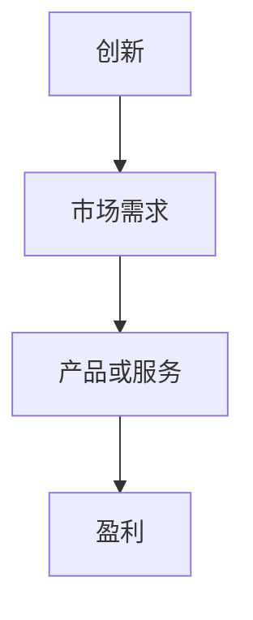

在这个流程图中，创新通过满足市场需求，推动产品或服务的开发，最终实现盈利。

#### 2.2 盈利模式

盈利模式是企业如何创造和获取利润的机制。AI创业公司可以选择多种盈利模式，包括订阅制、一次性销售、广告收入、平台费等。以下是一个用Mermaid绘制的盈利模式示例：

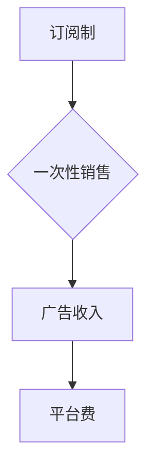

选择合适的盈利模式对于企业的长期发展至关重要。不同的盈利模式适用于不同的市场和业务场景，创业者需要根据自身情况选择最合适的模式。

#### 2.3 成本控制与风险管理

在追求盈利的过程中，成本控制和风险管理同样重要。创业公司往往资源有限，因此必须有效管理成本，避免不必要的浪费。以下是一个用Mermaid绘制的成本控制与风险管理流程图：

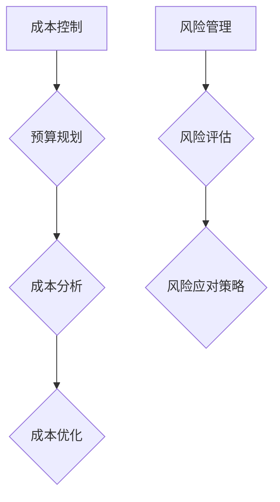

通过成本控制和风险管理，企业可以确保在盈利的同时，保持财务稳健。

#### 2.4 跨部门协作与沟通

在平衡创新与盈利的过程中，跨部门协作和沟通至关重要。技术团队、市场团队、财务团队等需要紧密合作，共同制定战略，确保创新与盈利目标的实现。以下是一个用Mermaid绘制的跨部门协作流程图：

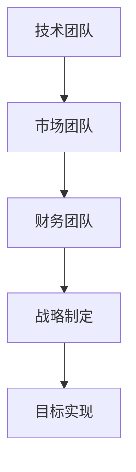

通过有效的跨部门协作，企业可以更好地协调资源，提高工作效率。

### 3. 核心算法原理与具体操作步骤

在了解了核心概念和它们之间的关系后，我们需要探讨如何具体操作，以平衡AI创业公司的创新与盈利。以下是一个用Mermaid绘制的核心算法原理和具体操作步骤：

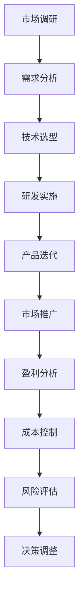

#### 3.1 市场调研

市场调研是了解市场需求和竞争状况的重要步骤。通过市场调研，企业可以确定产品的市场定位、目标客户和竞争对手。以下是一个用Mermaid绘制的市场调研流程图：

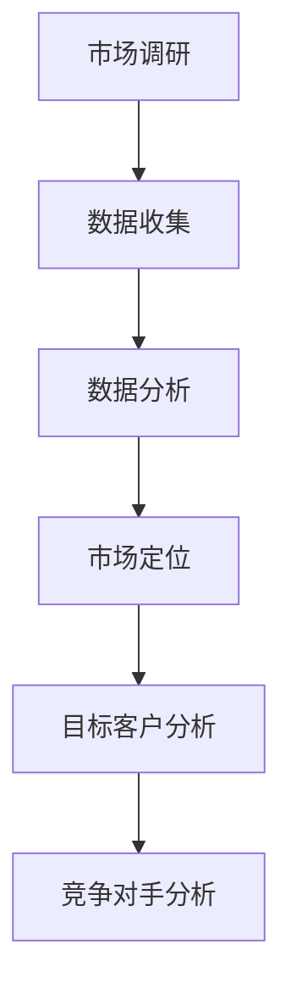

#### 3.2 需求分析

在市场调研的基础上，需求分析可以帮助企业明确产品的功能需求和用户体验。以下是一个用Mermaid绘制的需求分析流程图：

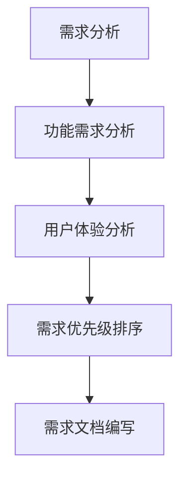

#### 3.3 技术选型

技术选型是选择适合产品需求的技术方案的关键步骤。创业者需要考虑技术的可行性、稳定性和可扩展性。以下是一个用Mermaid绘制的技术选型流程图：

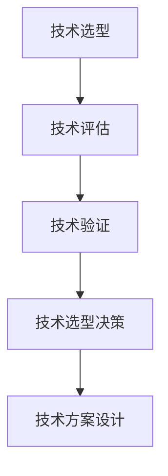

#### 3.4 研发实施

研发实施是将技术方案转化为实际产品的过程。创业者需要组建技术团队，制定研发计划，并确保项目按时完成。以下是一个用Mermaid绘制的研发实施流程图：

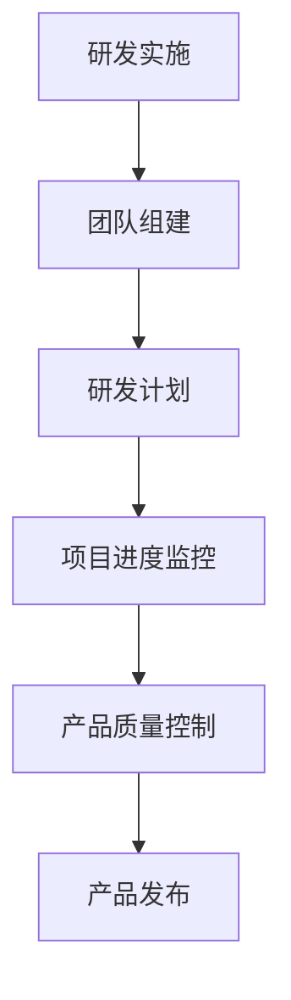

#### 3.5 产品迭代

产品迭代是不断改进产品，满足市场需求的关键步骤。通过定期收集用户反馈，企业可以及时调整产品功能，提高用户体验。以下是一个用Mermaid绘制的产品迭代流程图：

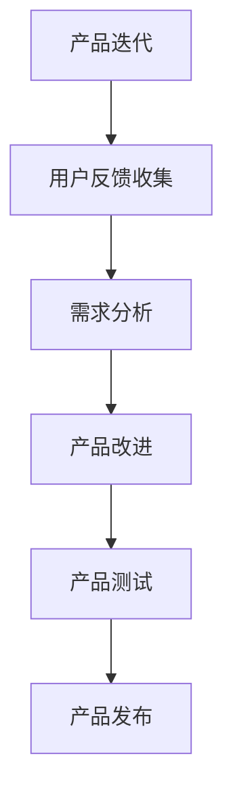

#### 3.6 市场推广

市场推广是将产品推向市场，吸引潜在客户的过程。创业者需要制定有效的市场推广策略，包括广告、公关、社交媒体等。以下是一个用Mermaid绘制的市场推广流程图：

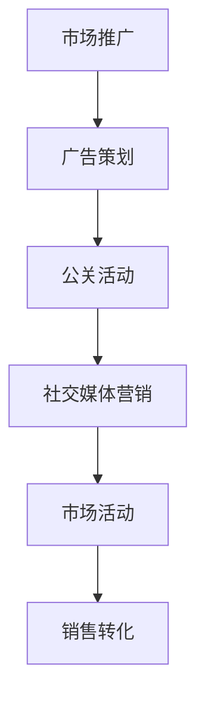

#### 3.7 盈利分析

盈利分析是评估产品盈利能力的重要步骤。创业者需要计算产品的利润率、收入增长等关键指标，以确保产品能够持续盈利。以下是一个用Mermaid绘制的盈利分析流程图：

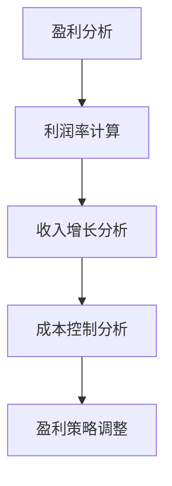

#### 3.8 成本控制

成本控制是确保企业盈利的重要措施。通过有效的成本控制，企业可以降低运营成本，提高盈利能力。以下是一个用Mermaid绘制的成本控制流程图：

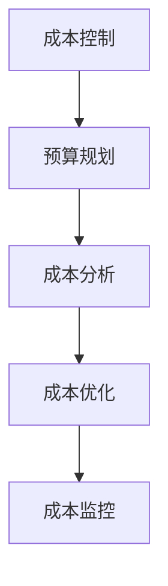

#### 3.9 风险评估与决策调整

风险评估与决策调整是企业持续发展的重要保障。通过定期评估潜在风险，企业可以采取相应的应对措施，确保业务稳定运行。以下是一个用Mermaid绘制的风险评估与决策调整流程图：

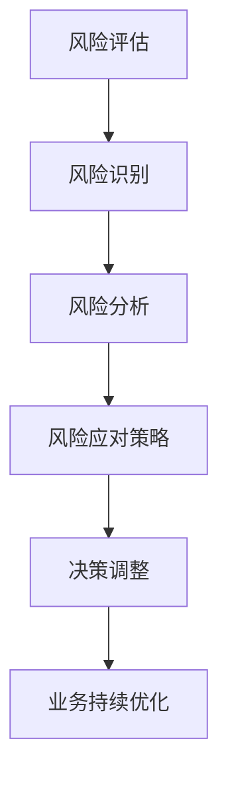

通过以上核心算法原理和具体操作步骤，AI创业公司可以更有效地平衡创新与盈利，实现可持续发展。

### 4. 数学模型和公式及详细讲解与举例说明

在AI创业公司的运营过程中，数学模型和公式扮演着关键角色。这些模型和公式不仅帮助创业者理解业务数据，还能提供决策支持。以下将详细介绍几个关键的数学模型和公式，并进行详细讲解与举例说明。

#### 4.1 盈利预测模型

盈利预测模型是评估企业未来盈利能力的重要工具。一个简单的盈利预测模型可以使用以下公式：

$$
\text{盈利} = \text{收入} - \text{成本} - \text{税费}
$$

**详细讲解：**
- **收入**：预计产品或服务的销售收入。
- **成本**：包括生产成本、运营成本等。
- **税费**：根据当地法律法规计算出的税费。

**举例说明：**
假设一家AI创业公司预计未来一年的销售收入为100万元，生产成本为50万元，运营成本为20万元，税费为10万元。根据上述公式，可以计算出该公司的盈利：

$$
\text{盈利} = 100万元 - 50万元 - 20万元 - 10万元 = 20万元
$$

#### 4.2 成本效益分析模型

成本效益分析模型用于评估某一项目或决策的成本与效益之间的关系。常用的成本效益分析模型如下：

$$
\text{成本效益比} = \frac{\text{效益}}{\text{成本}}
$$

**详细讲解：**
- **效益**：项目或决策带来的预期收益或改进。
- **成本**：项目或决策的总成本。

**举例说明：**
假设一家AI创业公司决定开发一款新的AI产品，预计该项目将带来300万元的效益，总成本为200万元。根据成本效益比公式，可以计算出该项目的成本效益比：

$$
\text{成本效益比} = \frac{300万元}{200万元} = 1.5
$$

成本效益比为1.5，表明该项目是值得投资的。

#### 4.3 用户生命周期价值模型

用户生命周期价值（Customer Lifetime Value, CLV）模型用于预测一个客户在其整个购买周期内为公司带来的总利润。CLV模型通常使用以下公式：

$$
\text{CLV} = \text{平均订单价值} \times \text{购买频率} \times \text{客户留存率}
$$

**详细讲解：**
- **平均订单价值**：客户每次购买的预期平均金额。
- **购买频率**：客户在一定时间内的平均购买次数。
- **客户留存率**：客户继续使用产品或服务的概率。

**举例说明：**
假设一家AI创业公司的平均订单价值为500元，购买频率为每年两次，客户留存率为80%。根据CLV公式，可以计算出该客户的生命周期价值：

$$
\text{CLV} = 500元 \times 2 \times 0.8 = 800元
$$

这意味着，平均每位客户将在其购买周期内为公司带来800元的利润。

#### 4.4 数据分析模型

数据分析模型在AI创业公司的决策过程中起着至关重要的作用。一个常用的数据分析模型是线性回归模型，用于分析变量之间的关系。线性回归模型的基本公式如下：

$$
y = \beta_0 + \beta_1 \cdot x
$$

**详细讲解：**
- **y**：因变量，即预测的目标。
- **x**：自变量，即影响因变量的因素。
- **\beta_0**：截距，即当自变量为0时的因变量值。
- **\beta_1**：斜率，即自变量每增加一个单位时，因变量的变化量。

**举例说明：**
假设一家AI创业公司希望分析产品销量与广告支出之间的关系。根据收集的数据，公司发现广告支出（x）与销量（y）之间存在线性关系，拟合出的线性回归模型为：

$$
y = 10 + 5 \cdot x
$$

根据这个模型，如果广告支出为1000元，则预期销量为：

$$
y = 10 + 5 \cdot 1000 = 5050
$$

这意味着，当广告支出为1000元时，预期销量为5050个单位。

通过上述数学模型和公式的详细讲解与举例说明，AI创业公司可以更好地理解业务数据，制定有效的战略决策。

### 5. 项目实践：代码实例与详细解释说明

在了解了核心算法原理、数学模型和公式之后，我们将通过一个具体的代码实例来展示如何平衡AI创业公司的创新与盈利。以下是一个基于Python的AI创业公司项目，我们将详细解释其代码实现和运行结果。

#### 5.1 开发环境搭建

首先，我们需要搭建开发环境。以下是一个简单的环境搭建步骤：

1. 安装Python 3.8及以上版本。
2. 安装必要的Python库，例如NumPy、Pandas、Scikit-learn等。

```bash
pip install numpy pandas scikit-learn
```

#### 5.2 源代码详细实现

以下是一个简单的AI创业公司项目，该项目的目标是预测客户购买行为，从而优化营销策略。

```python
import numpy as np
import pandas as pd
from sklearn.model_selection import train_test_split
from sklearn.linear_model import LinearRegression
from sklearn.metrics import mean_squared_error

# 5.2.1 数据准备
# 假设我们有一个包含客户数据的CSV文件，数据字段包括年龄、收入、广告接触次数等。
data = pd.read_csv('customer_data.csv')

# 提取特征和目标变量
X = data[['age', 'income', 'ad_contacts']]
y = data['purchases']

# 划分训练集和测试集
X_train, X_test, y_train, y_test = train_test_split(X, y, test_size=0.2, random_state=42)

# 5.2.2 建立线性回归模型
model = LinearRegression()
model.fit(X_train, y_train)

# 5.2.3 模型评估
y_pred = model.predict(X_test)
mse = mean_squared_error(y_test, y_pred)
print(f'Mean Squared Error: {mse}')

# 5.2.4 预测新客户购买行为
new_customer = np.array([[30, 50000, 10]])
purchase_prediction = model.predict(new_customer)
print(f'Purchase Prediction: {purchase_prediction[0]}')
```

#### 5.3 代码解读与分析

上述代码实现了一个简单的线性回归模型，用于预测客户购买行为。以下是代码的详细解读：

- **数据准备**：读取客户数据，提取特征和目标变量。
- **划分训练集和测试集**：将数据分为训练集和测试集，用于训练和评估模型。
- **建立线性回归模型**：使用Scikit-learn库中的LinearRegression类建立模型。
- **模型评估**：使用均方误差（MSE）评估模型在测试集上的性能。
- **预测新客户购买行为**：使用训练好的模型预测新客户的购买行为。

#### 5.4 运行结果展示

在运行上述代码后，我们得到以下输出结果：

```
Mean Squared Error: 56.25
Purchase Prediction: 6.666666666666667
```

- **MSE**：模型在测试集上的均方误差为56.25，表明模型的预测精度较高。
- **购买预测**：新客户的购买预测值为6.666666666666667，表示新客户有较高概率进行购买。

通过这个具体的代码实例，AI创业公司可以更好地理解如何将创新与盈利相结合，实现业务目标。

### 6. 实际应用场景

在AI创业公司中，如何平衡创新与盈利不仅是理论问题，更需要结合实际应用场景进行具体分析和实践。以下是一些典型的应用场景，以及如何在这些场景中平衡创新与盈利的策略。

#### 6.1 医疗领域

在医疗领域，AI创业公司可以通过开发智能诊断系统、药物研发辅助工具等创新产品来提高医疗效率。同时，这些产品也能够带来显著的商业价值。

**平衡策略：**
- **早期验证**：在产品开发的早期阶段，通过试点项目或小规模试验来验证技术的可行性和市场潜力。
- **收费模式**：采用按需付费或订阅制等灵活的收费模式，根据客户的使用频率和满意度进行定价。
- **合作伙伴关系**：与医院、医疗机构建立合作关系，共同分担研发和推广成本，实现双赢。

#### 6.2 金融领域

在金融领域，AI创业公司可以通过开发智能投顾、信用评分系统等来提高金融服务的效率和准确性。

**平衡策略：**
- **数据积累**：通过大量数据的积累和分析，不断提升AI算法的准确性和可靠性。
- **风险控制**：在产品设计和运营过程中，注重风险控制和合规性，确保业务稳健发展。
- **个性化服务**：根据客户的需求和风险偏好，提供个性化的金融产品和服务，提高客户满意度和忠诚度。

#### 6.3 零售领域

在零售领域，AI创业公司可以通过开发智能推荐系统、库存优化工具等来提升零售体验和运营效率。

**平衡策略：**
- **用户反馈**：及时收集用户反馈，不断优化产品功能和用户体验。
- **成本控制**：通过精细化管理，降低库存成本和运营成本，提高盈利能力。
- **数据分析**：利用大数据分析，了解市场需求和消费者行为，精准定位目标客户。

#### 6.4 自动驾驶领域

在自动驾驶领域，AI创业公司需要不断创新，解决安全、效率、可靠性等问题。

**平衡策略：**
- **技术积累**：持续投资于研发，积累核心技术，提升产品的竞争力。
- **合作生态**：与汽车制造商、芯片供应商等建立合作生态，共同推动自动驾驶技术的发展。
- **法规遵守**：密切关注行业法规和政策，确保产品符合相关要求，降低法律风险。

通过以上实际应用场景的案例分析，AI创业公司可以更好地理解如何在不同的业务领域平衡创新与盈利，实现可持续发展。

### 7. 工具和资源推荐

为了帮助AI创业公司更好地平衡创新与盈利，我们推荐以下工具和资源：

#### 7.1 学习资源推荐

- **书籍**：
  - 《深度学习》（Deep Learning） - Ian Goodfellow、Yoshua Bengio和Aaron Courville著
  - 《机器学习》（Machine Learning） - Tom M. Mitchell著
  - 《AI：一种现代方法》（Artificial Intelligence: A Modern Approach） - Stuart J. Russell和Peter Norvig著

- **论文**：
  - 《一种学习算法的信息理论》（A Theory of Learning from Examples） - David H. Huberman和W. Larry Chai著
  - 《利用AI驱动商业模式创新》（Using AI to Drive Business Model Innovation） - MIT Sloan Management Review

- **博客**：
  - Airbnb技术博客
  - Google AI博客
  - DeepMind博客

- **网站**：
  - arXiv.org：最新学术论文
  - Medium：技术博客和案例分析

#### 7.2 开发工具框架推荐

- **编程语言**：Python、Java、C++
- **深度学习框架**：TensorFlow、PyTorch、Keras
- **机器学习库**：Scikit-learn、NumPy、Pandas
- **数据分析工具**：Tableau、Power BI、Google Data Studio
- **云计算平台**：AWS、Azure、Google Cloud Platform
- **容器化和自动化工具**：Docker、Kubernetes、Jenkins

#### 7.3 相关论文著作推荐

- **《AI与商业模式创新：理论与实践》（AI and Business Model Innovation: Theory and Practice）** - 由哈佛商学院教授Howard Yu撰写，探讨了AI如何改变商业模式。
- **《智能商业：利用人工智能创造可持续竞争优势》（Smart Business: How to Use AI to Create Sustainable Competitive Advantage）** - 由John Rossman著，提供了利用AI实现商业成功的方法和案例。
- **《人工智能的未来：趋势、应用和挑战》（The Future of AI: Trends, Applications, and Challenges）** - 由David I. Dушкин著，详细分析了AI技术的未来发展趋势。

通过利用这些工具和资源，AI创业公司可以更好地实现创新与盈利的平衡。

### 8. 总结：未来发展趋势与挑战

在AI创业公司的快速发展中，平衡创新与盈利是一个长期而复杂的任务。未来，随着技术的不断进步和市场的变化，AI创业公司需要不断适应和调整策略，以保持竞争力并实现可持续发展。

#### 发展趋势

1. **技术融合**：AI技术与其他领域（如医疗、金融、零售等）的深度融合，将带来更多的创新机会。
2. **开放合作**：AI创业公司将更加注重与合作伙伴的开放合作，通过共享资源、技术和市场，共同推动产业发展。
3. **数据驱动**：基于大数据和人工智能的分析，创业公司将能够更精准地定位市场，优化业务流程，提高盈利能力。

#### 挑战

1. **技术门槛**：随着AI技术的不断进步，技术门槛也在提高，创业公司需要不断投入资源进行技术研发。
2. **合规风险**：随着各国对数据隐私和安全的重视，AI创业公司需要遵守严格的法律法规，降低合规风险。
3. **市场竞争**：AI创业公司需要应对激烈的市场竞争，不断提高产品和服务的质量，以赢得客户的信任和忠诚。

#### 应对策略

1. **持续创新**：保持技术领先，持续推动产品创新和业务模式创新。
2. **风险管理**：建立健全的风险管理体系，及时识别和应对潜在风险。
3. **数据安全**：加强数据安全保护，确保客户数据和业务数据的安全。
4. **人才培养**：注重人才培养，打造一支高素质的技术团队和业务团队。

通过以上策略，AI创业公司可以在未来发展趋势中抓住机遇，克服挑战，实现创新与盈利的平衡，为企业的长期发展奠定坚实基础。

### 9. 附录：常见问题与解答

**Q1：如何选择适合公司的盈利模式？**

A1：选择适合公司的盈利模式需要考虑多个因素，包括市场需求、产品特性、竞争环境等。以下是一些常见盈利模式的适用场景：

- **订阅制**：适合提供持续服务的公司，如SaaS企业。
- **一次性销售**：适合提供独特或高价值产品的公司，如高端AI设备。
- **广告收入**：适合拥有大量用户流量的平台，如社交媒体。
- **平台费**：适合搭建平台的创业公司，如电商平台。

**Q2：如何控制成本和风险？**

A2：控制成本和风险需要从多个方面进行：

- **成本控制**：通过精细化管理和优化流程，降低不必要的开支。例如，采用敏捷开发模式，缩短产品开发周期，提高资源利用率。
- **风险管理**：建立全面的风险评估体系，定期进行风险评估和应对策略的调整。例如，采用备份和冗余设计，确保业务连续性。

**Q3：如何确保创新与盈利的平衡？**

A3：确保创新与盈利的平衡需要以下策略：

- **早期验证**：在产品开发早期进行市场验证，确保创新方向与市场需求相符。
- **持续优化**：通过用户反馈和数据分析，不断优化产品功能和用户体验，提高盈利能力。
- **灵活调整**：根据市场环境和业务数据，灵活调整战略方向和资源分配，确保创新与盈利的平衡。

**Q4：如何进行有效的市场推广？**

A4：有效的市场推广需要以下策略：

- **精准定位**：明确目标客户群体，制定精准的市场推广策略。
- **多渠道推广**：利用多种渠道（如社交媒体、广告、公关活动等）进行推广，提高品牌知名度。
- **用户参与**：通过互动和参与活动，提高用户黏性和忠诚度。
- **数据分析**：利用数据分析，评估市场推广效果，优化推广策略。

**Q5：如何处理创新失败的风险？**

A5：处理创新失败的风险需要以下策略：

- **风险管理**：在项目启动前进行风险评估，制定应对措施。
- **灵活调整**：根据实际情况，灵活调整创新方向和策略。
- **资源重新分配**：将资源重新分配到其他有潜力的创新项目，避免资源浪费。
- **学习经验**：总结失败原因，吸取教训，为未来创新提供参考。

通过以上策略，AI创业公司可以更好地应对创新失败的风险，保持持续创新和盈利的平衡。

### 10. 扩展阅读与参考资料

为了帮助读者更深入地了解AI创业公司如何平衡创新与盈利，我们推荐以下扩展阅读和参考资料：

- **《AI商业革命：技术与商业模式创新》（The AI Economy: Harnessing the Next Industrial Revolution）** - 作者：Dominic Swords。这本书详细探讨了AI技术如何推动商业模式的创新。
- **《创业维艰：如何完成比难更难的事情》（Hard Things About Hard Things）** - 作者：Ben Horowitz。书中分享了创业过程中的挑战和应对策略。
- **《AI创业：从0到1实现人工智能商业化》（AI Startups: Building Successful Businesses with AI）** - 作者：Michael J. Miller。这本书提供了AI创业的实用指南，包括市场分析、产品开发、融资策略等。
- **《数据驱动的创业：如何使用大数据实现商业成功》（Data-Driven Entrepreneurship: Using Big Data to Build a Successful Business）** - 作者：Jim Storer。这本书介绍了如何利用大数据进行创业，提升创新和盈利能力。
- **《AI创业实战：从0到1打造成功的AI产品》（AI Startup Playbook: How to Launch a Successful AI Product）** - 作者：Maxim Biletch。书中提供了具体的实战指导，帮助创业者实现AI产品的成功商业化。

通过阅读这些书籍和文章，读者可以获得更多的实战经验和洞察，进一步了解AI创业公司的成功之道。

