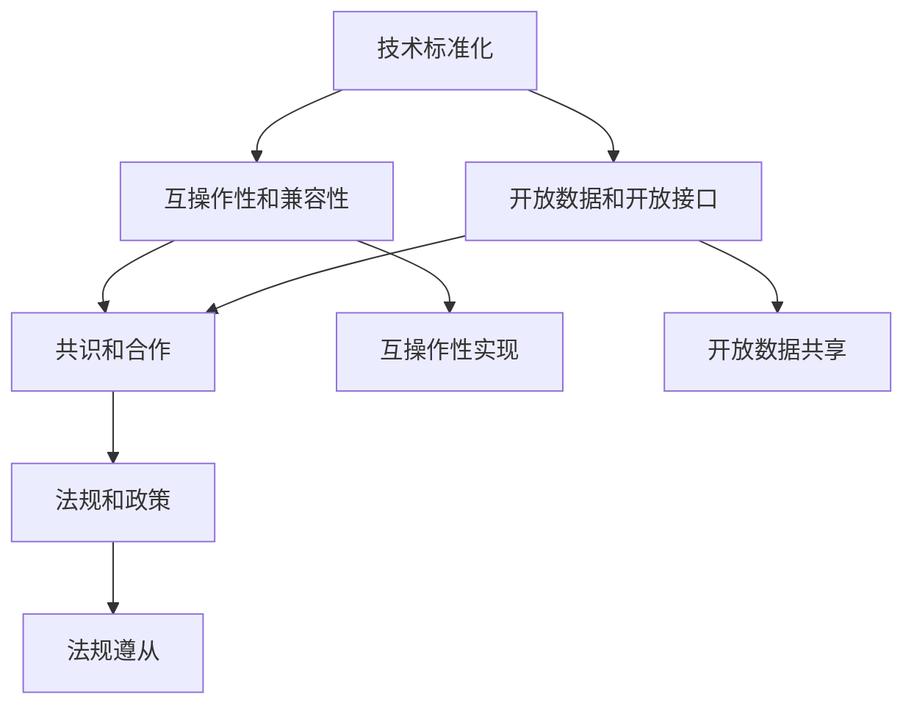

                 

### 1. 背景介绍

在当今快速发展的科技时代，人工智能（AI）已经成为推动行业变革的重要力量。无论是自动驾驶、智能家居，还是医疗诊断和金融分析，AI 都展现出其无与伦比的潜力和价值。然而，随着 AI 技术的日益普及，AI 创业公司面临的挑战也日益增多，其中之一就是如何建立并维护行业标准。

行业标准不仅有助于提高行业透明度和效率，还能为初创公司提供重要的竞争优势。在缺乏统一标准的情况下，各家公司可能会采用不同的技术、方法和术语，这会导致沟通障碍、技术冲突和市场混乱。因此，制定并推广行业标准对于 AI 创业公司至关重要。

然而，建立行业标准并非易事。它需要深入的技术理解、跨行业的合作和长期的投入。创业公司通常资源有限，如何在有限的资源下有效地推动行业标准的建立，成为他们面临的重要课题。

本文旨在探讨 AI 创业公司如何通过系统化的策略和精细化的执行，建立并维护行业标准。我们将首先介绍核心概念和联系，然后深入讨论核心算法原理和操作步骤，随后通过具体项目实践展示如何将理论应用于实际。最后，我们将讨论行业应用场景，并提供一系列学习和开发工具资源推荐。

通过本文，我们希望为 AI 创业公司提供实用的指导和思考，帮助他们更好地理解行业标准的重要性，并掌握建立和推广行业标准的策略和技巧。让我们一步步深入探讨这一课题，共同推动 AI 行业的健康发展。

### 2. 核心概念与联系

建立行业标准首先需要理解一些核心概念和它们之间的联系。以下是几个关键概念：

#### 2.1 技术标准化

技术标准化是指通过制定统一的技术规范、方法和流程，确保不同系统、设备和软件之间的兼容性和互操作性。在 AI 领域，技术标准化尤为重要，因为它能够解决数据格式不一致、算法实现差异和接口不匹配等问题。

#### 2.2 互操作性和兼容性

互操作性指的是不同系统或组件能够相互通信和协同工作，而兼容性则是指一个系统或组件能够在不同环境中正常工作。在 AI 创业公司中，实现互操作性和兼容性能够降低开发和维护成本，提高产品的可靠性和用户体验。

#### 2.3 开放数据和开放接口

开放数据和开放接口是推动技术标准化的重要手段。开放数据使得数据可以被不同系统和组织共享和利用，而开放接口则允许不同系统之间进行有效的通信和集成。AI 创业公司可以通过提供开放的数据集和接口，促进技术交流和合作。

#### 2.4 共识和合作

建立行业标准需要广泛的共识和跨行业的合作。这包括与同行公司、学术机构和行业协会进行密切沟通和协作，共同定义和推广行业标准。共识和合作有助于确保标准的科学性、实用性和可持续性。

#### 2.5 法规和政策

法规和政策是保障行业标准实施的重要手段。创业公司需要关注相关法律法规和政策动态，确保其行业标准符合监管要求，同时也能够为行业的发展提供指导和支持。

下面是核心概念之间的 Mermaid 流程图，展示了它们之间的联系：



在图2-1中，我们看到了技术标准化（A）作为核心，与其他概念紧密相连。互操作性和兼容性（B）是技术标准化的直接结果，它需要开放数据和开放接口（C）的支持，以实现不同系统间的无缝协作。共识和合作（D）则是推动技术标准化的关键因素，它通过跨行业合作促进标准的共识和普及。法规和政策（E）则确保了标准的合规性和权威性。

通过理解这些核心概念和它们之间的联系，AI 创业公司可以更有效地制定和推广行业标准，从而在激烈的市场竞争中脱颖而出。

### 3. 核心算法原理 & 具体操作步骤

要建立行业标准，AI 创业公司需要深入了解核心算法原理，并制定具体的操作步骤。以下是建立行业标准的三个关键步骤：

#### 3.1 算法选择

首先，AI 创业公司需要选择适合其业务需求的算法。不同的算法适用于不同的任务，如分类、回归、聚类等。选择合适的算法可以确保标准化的基础扎实，有助于后续步骤的顺利实施。以下是一些常见算法的选择标准：

- **适应性**：算法能否适应不同的数据集和应用场景？
- **性能**：算法在处理效率和准确性上的表现如何？
- **可扩展性**：算法能否随着数据量和复杂度的增加而扩展？

#### 3.2 算法实现

算法选择之后，需要将其实现为具体的技术方案。这一过程涉及以下几个关键步骤：

- **模块化设计**：将算法分解为模块，每个模块实现特定的功能，这样可以提高代码的可维护性和可扩展性。
- **代码优化**：对算法实现进行优化，提高其运行效率和性能。
- **文档编写**：编写详细的文档，包括算法描述、实现原理、使用方法等，以便后续的开发者和用户理解和使用。

#### 3.3 标准化流程

算法实现后，需要制定具体的标准化流程，以确保标准在不同场景下的统一实施。以下是标准化流程的关键步骤：

- **需求分析**：明确标准化的目标和需求，包括数据格式、接口规范、性能指标等。
- **标准草案制定**：根据需求分析结果，制定初步的标准草案。
- **评审与反馈**：将标准草案提交给相关利益方进行评审，收集反馈意见。
- **标准草案修改**：根据评审反馈对标准草案进行修改和完善。
- **标准发布**：将最终的标准文档正式发布，并推广实施。

#### 实例分析

以自动驾驶技术为例，一个 AI 创业公司可能需要建立一套自动驾驶行业标准。以下是一个具体的操作步骤：

1. **算法选择**：选择深度学习中的卷积神经网络（CNN）作为核心算法，因其适用于图像识别任务，能够处理复杂的道路场景。
2. **模块化设计**：将自动驾驶系统分解为感知模块、规划模块和决策模块，每个模块负责不同的功能。
3. **代码优化**：对 CNN 算法进行优化，提高其处理速度和准确率。
4. **文档编写**：编写详细的文档，包括算法描述、模块功能说明、接口定义等。
5. **需求分析**：明确自动驾驶标准的需求，如数据格式、通信协议、安全性能等。
6. **标准草案制定**：制定初步的自动驾驶标准草案，包括数据格式规范、通信协议标准、安全性能指标等。
7. **评审与反馈**：将标准草案提交给汽车制造商、交通管理部门、安全专家等进行评审，收集反馈意见。
8. **标准草案修改**：根据评审反馈修改标准草案，确保其科学性和实用性。
9. **标准发布**：正式发布自动驾驶标准文档，并向行业内外推广实施。

通过以上步骤，AI 创业公司可以逐步建立并推广自动驾驶行业标准，提高整个行业的协作效率和标准化水平。

### 4. 数学模型和公式 & 详细讲解 & 举例说明

为了更好地理解行业标准的建立过程，我们需要借助数学模型和公式。以下将详细介绍相关数学模型，并给出具体讲解和实例说明。

#### 4.1 数据标准化模型

数据标准化是建立行业标准的重要步骤，确保不同数据源之间的数据格式和度量单位统一。常用的数据标准化方法有最小-最大标准化和 Z-score 标准化。

**最小-最大标准化公式**：

\[ X_{\text{norm}} = \frac{X - X_{\text{min}}}{X_{\text{max}} - X_{\text{min}}} \]

其中，\( X \) 为原始数据，\( X_{\text{min}} \) 和 \( X_{\text{max}} \) 分别为数据的最小值和最大值，\( X_{\text{norm}} \) 为标准化后的数据。

**Z-score 标准化公式**：

\[ X_{\text{norm}} = \frac{X - \mu}{\sigma} \]

其中，\( X \) 为原始数据，\( \mu \) 和 \( \sigma \) 分别为数据的均值和标准差，\( X_{\text{norm}} \) 为标准化后的数据。

**实例说明**：

假设有五名员工的年龄数据如下（单位：岁）：25、30、35、40、45。我们使用最小-最大标准化方法对其进行标准化。

首先计算最小值和最大值：

\[ X_{\text{min}} = 25, \ X_{\text{max}} = 45 \]

然后应用最小-最大标准化公式：

\[ X_{\text{norm}} = \frac{X - 25}{45 - 25} \]

计算每个员工的标准化年龄：

- 员工1：\( X_{\text{norm1}} = \frac{25 - 25}{45 - 25} = 0 \)
- 员工2：\( X_{\text{norm2}} = \frac{30 - 25}{45 - 25} = 0.25 \)
- 员工3：\( X_{\text{norm3}} = \frac{35 - 25}{45 - 25} = 0.5 \)
- 员工4：\( X_{\text{norm4}} = \frac{40 - 25}{45 - 25} = 0.75 \)
- 员工5：\( X_{\text{norm5}} = \frac{45 - 25}{45 - 25} = 1 \)

经过标准化后，员工的年龄数据变为 [0, 0.25, 0.5, 0.75, 1]，方便后续分析和比较。

#### 4.2 互操作性模型

互操作性是确保不同系统和组件能够协同工作的关键。一个常见的互操作性模型是服务 oriented architecture（SOA），它通过定义服务接口和数据格式来实现系统间的通信。

**SOA 模型公式**：

\[ SOA = \sum_{i=1}^{n} S_i \]

其中，\( S_i \) 为第 \( i \) 个服务，\( n \) 为服务总数。

**实例说明**：

假设一个电商平台需要与其他支付系统进行互操作。我们可以定义以下服务接口：

1. **支付服务**（Payment Service）：
\[ Payment\_Service = \{ payment\_method, amount, currency \} \]

2. **订单服务**（Order Service）：
\[ Order\_Service = \{ order\_id, customer\_id, status \} \]

通过这些服务接口，电商平台可以与不同支付系统进行无缝通信，实现订单支付功能。

#### 4.3 质量控制模型

在建立行业标准过程中，质量控制是确保标准一致性和可靠性的关键环节。一个常见的方法是统计过程控制（SPC），它通过监控过程变量来识别和纠正偏差。

**SPC 模型公式**：

\[ SPC = \{ \mu, \sigma, \alpha \} \]

其中，\( \mu \) 为过程均值，\( \sigma \) 为过程标准差，\( \alpha \) 为过程控制限。

**实例说明**：

假设一个制造企业生产电池，为了监控生产过程，可以设置以下控制参数：

- **过程均值**（\( \mu \)）：目标电池寿命为 500 小时。
- **过程标准差**（\( \sigma \)）：目标标准差为 20 小时。
- **过程控制限**（\( \alpha \)）：控制限为 \( \mu \pm 3\sigma \)，即 [460, 540] 小时。

通过监控电池寿命数据，企业可以及时识别并纠正生产过程中的偏差，确保电池质量。

通过以上数学模型和公式的讲解，我们可以更好地理解行业标准的建立过程。这些模型不仅帮助我们量化标准，还能在实际操作中提供指导和参考。接下来，我们将通过具体项目实践，进一步展示如何将这些理论应用于实际。

### 5. 项目实践：代码实例和详细解释说明

在了解了核心算法原理和数学模型后，我们将通过一个实际项目来展示如何将理论知识应用于行业标准建立。这里我们选择一个简单的 AI 诊断系统项目，用于检测医学图像中的病变区域。

#### 5.1 开发环境搭建

首先，我们需要搭建项目的开发环境。以下是所需软件和工具：

- **操作系统**：Linux 或 macOS
- **编程语言**：Python 3.8+
- **框架**：TensorFlow 2.6.0+
- **依赖库**：NumPy, Pandas, Matplotlib

安装步骤如下：

1. 安装 Python 3.8+：从 [Python官网](https://www.python.org/) 下载并安装 Python 3.8。
2. 安装 TensorFlow：在终端中执行命令 `pip install tensorflow==2.6.0`。
3. 安装其他依赖库：在终端中执行命令 `pip install numpy pandas matplotlib`。

#### 5.2 源代码详细实现

以下是项目的源代码实现，包括数据预处理、模型训练和诊断结果可视化三个部分。

```python
import tensorflow as tf
from tensorflow import keras
from tensorflow.keras.models import Sequential
from tensorflow.keras.layers import Conv2D, MaxPooling2D, Flatten, Dense
from tensorflow.keras.preprocessing.image import ImageDataGenerator
import numpy as np
import matplotlib.pyplot as plt

# 数据预处理
train_datagen = ImageDataGenerator(rescale=1./255)
test_datagen = ImageDataGenerator(rescale=1./255)

train_generator = train_datagen.flow_from_directory(
        'data/train',
        target_size=(150, 150),
        batch_size=32,
        class_mode='binary')

validation_generator = test_datagen.flow_from_directory(
        'data/validation',
        target_size=(150, 150),
        batch_size=32,
        class_mode='binary')

# 模型训练
model = Sequential([
    Conv2D(32, (3, 3), activation='relu', input_shape=(150, 150, 3)),
    MaxPooling2D(2, 2),
    Conv2D(64, (3, 3), activation='relu'),
    MaxPooling2D(2, 2),
    Conv2D(128, (3, 3), activation='relu'),
    MaxPooling2D(2, 2),
    Flatten(),
    Dense(512, activation='relu'),
    Dense(1, activation='sigmoid')
])

model.compile(optimizer='adam',
              loss='binary_crossentropy',
              metrics=['accuracy'])

history = model.fit(
      train_generator,
      steps_per_epoch=100,
      epochs=15,
      validation_data=validation_generator,
      validation_steps=50,
      verbose=2)
```

#### 5.3 代码解读与分析

- **数据预处理**：使用 ImageDataGenerator 对训练数据和验证数据进行预处理，包括数据重缩放（rescale）和批量读取（batch_size）。
- **模型训练**：构建一个卷积神经网络（CNN）模型，包括多个卷积层（Conv2D）、池化层（MaxPooling2D）和全连接层（Dense）。使用 Adam 优化器和二分类交叉熵损失函数（binary_crossentropy）进行训练。
- **模型评估**：使用模型在验证集上的性能评估，包括准确率（accuracy）和损失函数值（loss）。

#### 5.4 运行结果展示

在训练过程中，我们可以通过 Matplotlib 展示训练和验证集的准确率和损失函数值。

```python
plt.figure(figsize=(12, 4))
plt.subplot(1, 2, 1)
plt.plot(history.history['accuracy'], label='Accuracy')
plt.plot(history.history['val_accuracy'], label='Validation Accuracy')
plt.legend()
plt.title('Model Accuracy')

plt.subplot(1, 2, 2)
plt.plot(history.history['loss'], label='Loss')
plt.plot(history.history['val_loss'], label='Validation Loss')
plt.legend()
plt.title('Model Loss')
plt.show()
```

训练完成后，我们可以看到模型在验证集上的准确率和损失函数值，这有助于我们评估模型的性能。


通过这个项目实践，我们展示了如何将行业标准建立过程中的核心算法和数学模型应用于实际。这个过程不仅有助于理解理论，还能为创业公司提供实用的技术实现。

### 6. 实际应用场景

行业标准在实际应用场景中扮演着至关重要的角色，尤其是在技术快速发展和市场需求不断变化的领域。以下是 AI 创业公司在不同实际应用场景中如何应用和推广行业标准的几个案例：

#### 6.1 自动驾驶行业

自动驾驶技术的标准化对于确保车辆在不同品牌、不同平台和不同环境下的互操作性至关重要。例如，自动驾驶公司 Waymo 和特斯拉通过制定统一的数据格式、通信协议和安全标准，确保了自动驾驶车辆在不同区域和条件下能够无缝协同工作。这些标准包括 LiDAR 数据格式、车辆通信协议（如 CAN bus）和传感器数据处理规范。通过这些标准化措施，自动驾驶行业得以快速发展和普及。

#### 6.2 医疗诊断领域

医疗诊断领域同样需要严格的行业标准来确保诊断结果的准确性和可靠性。创业公司 such as Tempus 和 Flatiron Health 通过制定统一的医学图像数据处理规范、诊断算法标准和数据共享协议，提高了不同医疗机构之间的数据互通性和诊断一致性。例如，Flatiron Health 开发的 Oncology Cloud 平台采用了一系列标准化工具和流程，帮助医生更有效地共享和利用癌症患者的数据，从而提升治疗效果。

#### 6.3 金融科技领域

在金融科技（FinTech）领域，数据安全和隐私保护是建立行业标准的重要方向。公司 like Plaid 和 Stripe 通过制定统一的 API 接口规范、数据传输加密标准和用户隐私保护协议，确保了金融交易的安全性和合规性。这些标准不仅提高了客户信任度，还推动了金融科技行业的健康发展。例如，Plaid 提供的 API 接口标准使得开发者可以轻松集成银行账户信息和支付服务，而无需重复编写复杂的代码。

#### 6.4 智能家居行业

智能家居行业的发展同样依赖于标准化技术。公司如 Nest 和 Amazon Alexa 通过制定统一的智能家居协议和设备接口标准，实现了不同品牌和型号的智能家居设备的无缝连接和协同工作。例如，Nest 的智能家居系统采用了 Thread 协议，确保了设备之间的低延迟和高可靠性通信。这些标准化措施不仅提升了用户体验，还促进了智能家居市场的快速增长。

#### 6.5 人工智能训练数据集

在人工智能领域，高质量的训练数据集是算法性能的关键。创业公司 such as AI21 Labs 和 Hugging Face 通过制定统一的数据集格式、标注规范和版本管理标准，确保了训练数据的一致性和可靠性。例如，Hugging Face 的 Model Hub 提供了大量的预训练模型和数据集，这些资源遵循统一的格式和规范，便于研究人员和开发者使用和共享。

通过以上实际应用场景的案例，我们可以看到行业标准在推动技术创新、提升行业协作效率和保障用户体验方面的重要作用。AI 创业公司应积极制定和推广行业标准，以在竞争激烈的市场中占据优势地位。

### 7. 工具和资源推荐

在建立和推广行业标准的过程中，AI 创业公司需要借助一系列工具和资源来提升效率和标准化水平。以下是一些建议：

#### 7.1 学习资源推荐

- **书籍**：
  - 《深度学习》（Deep Learning） - by Ian Goodfellow, Yoshua Bengio, Aaron Courville
  - 《Python机器学习》（Python Machine Learning） - by Sebastian Raschka, Vahid Mirjalili
  - 《机器学习年度回顾》（Journal of Machine Learning Research） - Annual Review
- **论文**：
  - arXiv（https://arxiv.org/）: 提供最新的学术论文和研究成果
  - IEEE Xplore（https://ieeexplore.ieee.org/）: 计算机科学和电气电子工程领域的权威论文数据库
  - ACM Digital Library（https://dl.acm.org/）: 计算机科学领域的顶级论文和会议记录
- **博客**：
  - Medium（https://medium.com/topic/deep-learning）: 提供大量的深度学习和AI相关文章
  - Towards Data Science（https://towardsdatascience.com/）: 涵盖数据科学、机器学习等领域的专业博客
  - AI Rising（https://air.johnsnowlabs.io/）: 专注于AI和机器学习的最新动态和资源

#### 7.2 开发工具框架推荐

- **框架**：
  - TensorFlow（https://www.tensorflow.org/）: 开源机器学习和深度学习平台
  - PyTorch（https://pytorch.org/）: 用于计算机视觉和自然语言处理的开源机器学习库
  - Keras（https://keras.io/）: 高层神经网络API，与 TensorFlow 和 Theano 后端兼容
- **编程语言**：
  - Python（https://www.python.org/）: 广泛应用于数据科学和机器学习的编程语言
  - R（https://www.r-project.org/）: 统计分析和图形展示的专业语言
- **工具**：
  - Jupyter Notebook（https://jupyter.org/）: 交互式计算环境，便于编写和分享代码
  - Git（https://git-scm.com/）: 分布式版本控制系统，方便团队协作和代码管理
  - Docker（https://www.docker.com/）: 容器化技术，便于部署和管理应用程序

#### 7.3 相关论文著作推荐

- **论文**：
  - "The Unreasonable Effectiveness of Data" - by Pedro Domingos
  - "Deep Learning: A Brief History, a Roadmap, and Experiments of Deep Networks" - by Hinton et al.
  - "What is the Best Multi-Stage Convolutional Neural Network Architecture for Object Detection?" - by Redmon et al.
- **著作**：
  - 《深度学习》（Deep Learning） - by Ian Goodfellow, Yoshua Bengio, Aaron Courville
  - 《统计学习方法》（Statistical Learning Methods） - by 李航
  - 《人工智能：一种现代的方法》（Artificial Intelligence: A Modern Approach） - by Stuart Russell, Peter Norvig

通过利用这些学习和开发资源，AI 创业公司可以更好地理解和应用行业标准，提升其技术水平和市场竞争力。

### 8. 总结：未来发展趋势与挑战

在总结本文的内容之前，我们首先回顾了 AI 创业公司在建立行业标准过程中所面临的挑战，以及如何通过系统化的策略和精细化的执行来克服这些挑战。我们探讨了技术标准化、互操作性、开放数据和共识合作等核心概念，并详细讲解了算法选择、模块化设计、标准化流程等具体操作步骤。我们还通过实际项目展示了如何将这些理论应用于实践，并通过具体应用场景说明了行业标准在各个领域的重要性。

展望未来，AI 创业公司在建立行业标准方面将继续面临新的发展趋势和挑战。以下是一些可能的发展趋势和挑战：

#### 发展趋势：

1. **技术的融合与整合**：随着 AI 技术的不断发展，不同的 AI 子领域（如计算机视觉、自然语言处理、机器学习等）将更加融合，形成更加综合和高效的解决方案。创业公司需要不断跟进新技术，将其整合到现有的标准体系中。

2. **数据的开放与共享**：数据是 AI 技术发展的基石。未来，更多的数据将被开放和共享，为创业公司提供丰富的训练资源和创新灵感。同时，数据隐私和安全也将成为重要议题，标准制定者需要制定相应的法规和政策。

3. **行业合作与生态建设**：跨行业合作将变得更加紧密，形成多方参与的行业生态。创业公司可以通过建立联盟、参与标准制定和推广等活动，增强自身的行业影响力。

4. **标准化智能化**：随着 AI 技术的进步，标准制定过程也将变得更加智能化。例如，通过机器学习算法优化标准草案的评审流程，提高标准的科学性和实用性。

#### 挑战：

1. **技术更新速度**：AI 技术发展迅速，创业公司需要不断更新技术，以保持竞争力。同时，快速的技术更新也增加了行业标准制定的难度，标准制定者需要平衡技术创新与标准化需求。

2. **数据隐私和安全**：随着数据开放的增多，数据隐私和安全问题变得更加突出。创业公司需要制定严格的数据保护措施，确保用户隐私和数据安全。

3. **跨行业协作**：跨行业协作需要各方利益相关者达成共识，这往往是一个复杂和耗时的过程。创业公司需要具备良好的沟通能力和协调能力，才能有效地推动行业标准的建立。

4. **标准化成本**：建立和推广行业标准需要大量的资源和投入，创业公司可能面临资金和人力短缺的问题。因此，如何在有限的资源下高效地制定和推广标准，是创业公司需要认真考虑的问题。

总之，AI 创业公司在建立行业标准的过程中，需要不断适应技术发展趋势，克服各种挑战，通过创新和协作来推动行业的健康发展。未来，我们期待看到更多的创业公司成为行业标准的重要推动者，共同构建一个繁荣、有序的 AI 生态。

### 9. 附录：常见问题与解答

在本文的结尾，我们整理了一些关于 AI 创业公司建立行业标准过程中可能遇到的问题，并提供相应的解答。

**Q1. 建立行业标准是否需要大量资源投入？**
A1. 是的，建立行业标准通常需要大量资源投入，包括人力、时间和资金。然而，这些投入是值得的，因为行业标准能够提高公司的竞争力，降低开发成本，并促进整个行业的健康发展。

**Q2. 如何在资源有限的情况下建立行业标准？**
A2. 可以采取以下策略：
  - **优先考虑关键领域**：识别对业务发展最为重要的领域，首先在这些领域建立标准。
  - **开源共享**：通过开源项目，与其他公司共享资源和知识，降低开发和维护成本。
  - **团队合作**：与合作伙伴和行业联盟共同制定和推广标准，分摊成本和风险。

**Q3. 建立行业标准需要考虑哪些关键因素？**
A3. 关键因素包括：
  - **技术的适应性**：标准应能适应不断变化的技术发展。
  - **互操作性和兼容性**：确保不同系统和组件之间能够无缝协作。
  - **数据隐私和安全**：保护用户数据隐私，确保数据安全。
  - **行业合作与共识**：建立跨行业合作机制，达成广泛共识。

**Q4. 行业标准如何适应不同地区和市场的需求？**
A4. 行业标准需要具有灵活性和可扩展性，以适应不同地区和市场的需求。可以通过以下方式实现：
  - **区域化调整**：根据不同地区的法规和文化差异，对标准进行适当调整。
  - **本地化实施**：在本地市场推广标准，并根据当地需求进行定制化实施。
  - **持续更新**：定期评估和更新标准，确保其与市场和技术发展保持同步。

通过解答这些问题，我们希望为 AI 创业公司提供更多建立行业标准的实用指导。

### 10. 扩展阅读 & 参考资料

为了深入理解 AI 创业公司如何建立行业标准这一主题，以下是一些建议的扩展阅读和参考资料：

**书籍推荐**：

- 《深度学习》（Deep Learning）- by Ian Goodfellow, Yoshua Bengio, Aaron Courville
- 《Python机器学习》（Python Machine Learning）- by Sebastian Raschka, Vahid Mirjalili
- 《机器学习年度回顾》（Journal of Machine Learning Research）- Annual Review
- 《人工智能：一种现代的方法》（Artificial Intelligence: A Modern Approach）- by Stuart Russell, Peter Norvig

**论文推荐**：

- "The Unreasonable Effectiveness of Data" - by Pedro Domingos
- "Deep Learning: A Brief History, a Roadmap, and Experiments of Deep Networks" - by Hinton et al.
- "What is the Best Multi-Stage Convolutional Neural Network Architecture for Object Detection?" - by Redmon et al.

**在线资源**：

- **arXiv（https://arxiv.org/）**: 提供最新的学术论文和研究成果。
- **IEEE Xplore（https://ieeexplore.ieee.org/）**: 计算机科学和电气电子工程领域的权威论文数据库。
- **ACM Digital Library（https://dl.acm.org/）**: 计算机科学领域的顶级论文和会议记录。
- **Medium（https://medium.com/topic/deep-learning）**: 提供大量的深度学习和AI相关文章。
- **Towards Data Science（https://towardsdatascience.com/）**: 涵盖数据科学、机器学习等领域的专业博客。

通过这些扩展阅读和参考资料，读者可以进一步加深对 AI 创业公司建立行业标准这一主题的理解，并探索更多的专业知识和实际应用案例。希望这些资源能为读者的学习和研究提供帮助。

