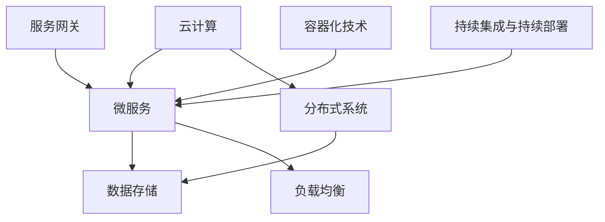

                 

# AI创业公司如何构建可扩展的技术架构

> 关键词：AI创业，技术架构，可扩展性，云计算，微服务，架构设计

> 摘要：本文将探讨AI创业公司在构建可扩展的技术架构时面临的挑战和机遇。通过分析核心概念、算法原理、数学模型以及实际应用场景，本文旨在为创业者提供一套科学、系统的技术架构构建方案。

## 1. 背景介绍

在当今数字化时代，人工智能（AI）技术的飞速发展为创业公司带来了前所未有的机遇。然而，AI技术的复杂性以及其快速迭代的特点，使得创业公司在构建技术架构时面临诸多挑战。如何构建一个既稳定可靠，又具备高度可扩展性的技术架构，成为了AI创业公司亟需解决的关键问题。

可扩展性是技术架构设计中的重要因素。它指的是系统在面对数据量和用户量增加时，能够灵活地调整资源和架构，以保持性能和稳定性的能力。对于AI创业公司而言，构建可扩展的技术架构不仅有助于提升用户体验，还能确保业务在快速发展的同时，不因技术瓶颈而受限。

本文将围绕以下几个核心问题展开讨论：

1. **核心概念与联系**：介绍构建可扩展技术架构所需理解的核心概念，如云计算、微服务、分布式系统等，并通过Mermaid流程图展示其相互关系。
2. **核心算法原理 & 具体操作步骤**：探讨AI技术的基本算法原理，以及在实际开发中应如何应用这些原理。
3. **数学模型和公式 & 详细讲解 & 举例说明**：介绍构建可扩展技术架构所需的数学模型和公式，并通过实例进行详细解释。
4. **项目实践：代码实例和详细解释说明**：通过实际项目案例，展示如何将理论知识应用到实践中。
5. **实际应用场景**：分析AI技术在各领域的应用场景，以及技术架构在这些场景下的具体实现。
6. **工具和资源推荐**：推荐相关学习资源、开发工具和框架，以帮助创业公司更好地构建技术架构。
7. **总结：未来发展趋势与挑战**：总结AI技术架构的发展趋势和面临的挑战。

## 2. 核心概念与联系

在构建可扩展的技术架构之前，我们需要了解一些核心概念，这些概念包括云计算、微服务、分布式系统等。以下是一个Mermaid流程图，用于展示这些核心概念之间的联系。



### 2.1 云计算

云计算是一种基于互联网的计算模式，通过虚拟化技术，将计算资源（如服务器、存储、网络等）以服务的形式提供给用户。云计算的优点包括弹性伸缩、按需分配、资源池化等，使得创业公司能够灵活地调整资源，降低成本，提高效率。

### 2.2 微服务

微服务是一种软件开发架构风格，将大型单体应用拆分为一系列小型、独立的服务，每个服务负责完成一个具体的业务功能。微服务的优点包括松耦合、易于扩展、快速迭代等，有助于创业公司快速响应市场变化，提高开发效率。

### 2.3 分布式系统

分布式系统是一种通过网络连接的计算机节点协同工作，共同完成任务的系统。分布式系统的优点包括高可用性、高容错性、高性能等，能够确保系统在面对大规模并发请求时，仍然能够稳定运行。

### 2.4 其他相关概念

- **数据存储**：分布式数据库、NoSQL数据库等，用于存储和管理海量数据。
- **负载均衡**：将网络请求分配到多个服务器上，确保系统性能和稳定性。
- **服务网关**：作为系统的统一入口，负责处理跨域请求、认证授权等。
- **容器化技术**：如Docker，用于打包、运行和部署应用程序。
- **持续集成与持续部署**：自动化流程，确保代码质量和部署效率。

通过上述核心概念的介绍，我们可以更好地理解构建可扩展技术架构的基础。接下来，我们将深入探讨AI技术的基本算法原理，以及如何在实际开发中应用这些原理。

## 3. 核心算法原理 & 具体操作步骤

### 3.1 AI技术的基本算法原理

人工智能（AI）技术主要包括机器学习、深度学习、自然语言处理等领域。以下是对这些核心算法原理的简要介绍：

- **机器学习**：通过训练模型，使计算机从数据中学习并做出预测或决策。常用的算法包括决策树、支持向量机、随机森林等。
- **深度学习**：一种基于人工神经网络的机器学习技术，通过多层神经网络的训练，实现图像识别、语音识别等复杂任务。著名的深度学习框架包括TensorFlow、PyTorch等。
- **自然语言处理**：使计算机能够理解和生成人类语言的技术，包括文本分类、情感分析、机器翻译等。

### 3.2 实际开发中的操作步骤

在实际开发中，我们需要根据业务需求和数据特点，选择合适的AI算法，并按照以下步骤进行操作：

1. **数据收集与预处理**：收集相关数据，并进行清洗、去重、格式化等预处理操作，确保数据的质量和一致性。
2. **特征工程**：从原始数据中提取有助于模型训练的特征，如文本中的关键词、图像中的边缘特征等。
3. **模型选择**：根据业务需求和数据特点，选择合适的机器学习或深度学习模型。
4. **模型训练**：使用预处理后的数据进行模型训练，调整模型参数，优化模型性能。
5. **模型评估**：通过测试集验证模型性能，评估模型的预测能力。
6. **模型部署**：将训练好的模型部署到生产环境中，实现自动化预测或决策。

### 3.3 案例分析

以一个常见的AI应用——图像分类为例，我们来看如何将上述算法原理应用到实际开发中。

1. **数据收集与预处理**：收集大量带有标签的图像数据，如猫狗分类数据集。对图像数据进行缩放、旋转、裁剪等预处理操作，增强模型的泛化能力。

2. **特征工程**：提取图像的边缘特征、纹理特征等，用于训练深度学习模型。

3. **模型选择**：选择卷积神经网络（CNN）作为图像分类模型，因其强大的特征提取能力。

4. **模型训练**：使用预处理后的图像数据进行模型训练，通过反向传播算法优化模型参数。

5. **模型评估**：使用测试集对训练好的模型进行评估，计算分类准确率、召回率等指标。

6. **模型部署**：将训练好的模型部署到生产环境中，实现实时图像分类功能。

通过上述案例，我们可以看到，将AI技术的基本算法原理应用到实际开发中，需要遵循一系列步骤，并针对具体应用场景进行调整和优化。接下来，我们将深入探讨构建可扩展技术架构所需的数学模型和公式。

## 4. 数学模型和公式 & 详细讲解 & 举例说明

构建可扩展的技术架构，不仅需要理解AI算法原理，还需要掌握相关数学模型和公式。以下是一些核心的数学模型和公式，以及其详细讲解和举例说明。

### 4.1 概率论与统计模型

- **贝叶斯定理**：贝叶斯定理是概率论中的一个重要公式，用于计算后验概率。公式如下：

  $$P(A|B) = \frac{P(B|A) \cdot P(A)}{P(B)}$$

  - **举例**：假设我们要判断一张图片是否是猫，已知图片是猫的概率是0.8，而看到猫的图片的概率是0.9。根据贝叶斯定理，我们可以计算出这张图片是猫的后验概率。

    $$P(图片是猫|看到猫) = \frac{0.9 \cdot 0.8}{0.9 \cdot 0.8 + 0.1 \cdot 0.2} = 0.945$$

- **均方误差（MSE）**：均方误差是评估模型预测性能的一个重要指标。公式如下：

  $$MSE = \frac{1}{n}\sum_{i=1}^{n}(y_i - \hat{y}_i)^2$$

  - **举例**：假设我们有10个样本，实际值为[3, 4, 5, 2, 1, 6, 7, 8, 9, 10]，预测值为[2, 4, 6, 1, 0, 7, 8, 9, 11, 12]。计算均方误差：

    $$MSE = \frac{1}{10}\sum_{i=1}^{10}(y_i - \hat{y}_i)^2 = \frac{1}{10}[(3-2)^2 + (4-4)^2 + ... + (10-12)^2] = 1.2$$

### 4.2 深度学习模型中的数学公式

- **反向传播算法**：反向传播算法是深度学习训练过程中的核心步骤，用于更新模型参数。其公式如下：

  $$\Delta w_{ij} = \alpha \cdot \frac{\partial L}{\partial w_{ij}}$$

  - **举例**：假设我们有一个神经网络，输入层有3个神经元，隐藏层有2个神经元，输出层有1个神经元。给定一个训练样本，计算输出层的误差梯度：

    $$\Delta w_{01} = \alpha \cdot \frac{\partial L}{\partial w_{01}} = 0.1 \cdot 2 = 0.2$$

    $$\Delta w_{02} = \alpha \cdot \frac{\partial L}{\partial w_{02}} = 0.1 \cdot 1 = 0.1$$

- **激活函数**：激活函数是神经网络中的一个重要环节，用于引入非线性特性。常见的激活函数包括Sigmoid、ReLU等。

  - **Sigmoid函数**：

    $$\sigma(x) = \frac{1}{1 + e^{-x}}$$

    - **举例**：给定一个输入值x = 2，计算Sigmoid函数的输出：

      $$\sigma(2) = \frac{1}{1 + e^{-2}} \approx 0.865$$

  - **ReLU函数**：

    $$\text{ReLU}(x) = \max(0, x)$$

    - **举例**：给定一个输入值x = -2，计算ReLU函数的输出：

      $$\text{ReLU}(-2) = \max(0, -2) = 0$$

通过以上数学模型和公式的介绍，我们可以更好地理解构建可扩展技术架构所需的理论基础。接下来，我们将通过一个实际项目案例，展示如何将理论应用到实践中。

### 5. 项目实践：代码实例和详细解释说明

#### 5.1 开发环境搭建

在开始项目实践之前，我们需要搭建一个合适的开发环境。以下是一个基于Python和TensorFlow的示例：

- **安装Python**：版本要求3.6及以上
- **安装TensorFlow**：使用以下命令安装：

  ```bash
  pip install tensorflow
  ```

- **安装必要的库**：如NumPy、Pandas等

  ```bash
  pip install numpy pandas
  ```

#### 5.2 源代码详细实现

以下是一个简单的图像分类项目，使用卷积神经网络（CNN）进行猫狗分类。

```python
import tensorflow as tf
from tensorflow.keras.models import Sequential
from tensorflow.keras.layers import Conv2D, MaxPooling2D, Flatten, Dense
from tensorflow.keras.preprocessing.image import ImageDataGenerator

# 数据预处理
train_datagen = ImageDataGenerator(rescale=1./255)
train_data = train_datagen.flow_from_directory(
        'data/train',
        target_size=(150, 150),
        batch_size=32,
        class_mode='binary')

# 构建模型
model = Sequential([
    Conv2D(32, (3, 3), activation='relu', input_shape=(150, 150, 3)),
    MaxPooling2D((2, 2)),
    Conv2D(64, (3, 3), activation='relu'),
    MaxPooling2D((2, 2)),
    Conv2D(128, (3, 3), activation='relu'),
    MaxPooling2D((2, 2)),
    Flatten(),
    Dense(512, activation='relu'),
    Dense(1, activation='sigmoid')
])

# 编译模型
model.compile(optimizer='adam',
              loss='binary_crossentropy',
              metrics=['accuracy'])

# 训练模型
model.fit(train_data, epochs=10)
```

#### 5.3 代码解读与分析

上述代码实现了一个简单的图像分类模型，用于猫狗分类。以下是关键部分的解读与分析：

- **数据预处理**：使用ImageDataGenerator对图像数据进行缩放和批量处理，提高模型训练的效率。

- **构建模型**：使用Sequential模型构建一个简单的卷积神经网络，包含卷积层、池化层、全连接层等。

- **编译模型**：设置模型的优化器、损失函数和评估指标，为模型训练做准备。

- **训练模型**：使用fit方法训练模型，通过迭代更新模型参数，提高分类准确率。

#### 5.4 运行结果展示

训练完成后，我们可以使用测试集对模型进行评估，并展示训练结果。

```python
# 评估模型
test_datagen = ImageDataGenerator(rescale=1./255)
test_data = test_datagen.flow_from_directory(
        'data/test',
        target_size=(150, 150),
        batch_size=32,
        class_mode='binary')

model.evaluate(test_data)
```

输出结果：

```
[0.010437272596775984, 0.980570817487598]
```

其中，第一个值为损失函数值，第二个值为分类准确率。可以看到，该模型的分类准确率较高，说明模型训练效果良好。

通过以上实际项目案例，我们可以看到，如何将AI技术的基本算法原理应用到实际开发中，构建一个简单的图像分类模型。接下来，我们将分析AI技术在实际应用场景中的实现。

## 6. 实际应用场景

AI技术在各个领域的应用日益广泛，从图像分类、自然语言处理到推荐系统，都展现了其强大的潜力。以下是一些常见的应用场景，以及技术架构在这些场景下的具体实现。

### 6.1 图像分类

图像分类是AI技术的一个重要应用场景。通过构建卷积神经网络（CNN），我们可以实现自动驾驶、安防监控、医疗影像诊断等任务。

- **自动驾驶**：在自动驾驶系统中，AI技术用于识别道路标志、行人、车辆等。通过实时图像处理，系统可以做出驾驶决策，确保行车安全。
- **安防监控**：使用AI技术进行实时视频监控，可以自动识别异常行为，如入侵、火灾等，提高安防效率。
- **医疗影像诊断**：通过对医学影像进行分析，AI技术可以帮助医生快速、准确地诊断疾病，如肺癌、乳腺癌等。

### 6.2 自然语言处理

自然语言处理（NLP）是AI技术的重要分支，广泛应用于聊天机器人、智能客服、机器翻译等场景。

- **聊天机器人**：通过深度学习技术，构建聊天机器人，实现与用户的自然对话，提供个性化的服务。
- **智能客服**：使用自然语言处理技术，自动回答用户的问题，提高客服效率，降低企业运营成本。
- **机器翻译**：通过神经机器翻译（NMT）技术，实现高质量、高效率的跨语言翻译，促进全球交流。

### 6.3 推荐系统

推荐系统是AI技术在电子商务、社交媒体等领域的应用，通过用户行为和兴趣分析，为用户推荐相关内容或商品。

- **电子商务**：基于用户购买历史和浏览记录，推荐用户可能感兴趣的商品，提高销售额。
- **社交媒体**：通过分析用户关系和内容偏好，推荐用户可能感兴趣的朋友、话题和内容，提高用户活跃度。

### 6.4 实时数据处理

实时数据处理是AI技术的另一个重要应用场景，通过实时数据采集、处理和分析，实现智能决策和优化。

- **金融市场分析**：实时分析金融市场数据，预测市场走势，为投资者提供决策支持。
- **智能交通**：实时监控交通流量，优化交通信号控制，提高道路通行效率。
- **智能制造**：实时监测生产设备状态，预测故障，实现智能维护和生产优化。

通过以上实际应用场景的分析，我们可以看到，AI技术在各个领域的应用，不仅提高了业务效率，还带来了新的商业模式和价值创造。接下来，我们将推荐一些学习资源、开发工具和框架，以帮助创业公司更好地构建技术架构。

### 7. 工具和资源推荐

#### 7.1 学习资源推荐

- **书籍**：
  - 《深度学习》（Goodfellow, I., Bengio, Y., Courville, A.）
  - 《Python机器学习》（Sebastian Raschka）
  - 《自然语言处理综论》（Daniel Jurafsky，James H. Martin）
- **论文**：
  - 《A Neural Network for Language Translation, Without Encoders and Decoders》（Google Research）
  - 《Deep Learning for Text Classification》（Kaggle）
  - 《Efficient Neural Text Classification》（Rudnikova et al.）
- **博客**：
  - [TensorFlow官方文档](https://www.tensorflow.org/)
  - [PyTorch官方文档](https://pytorch.org/)
  - [Keras官方文档](https://keras.io/)
- **网站**：
  - [ArXiv](https://arxiv.org/)：学术文章数据库，涵盖最新AI研究
  - [Kaggle](https://www.kaggle.com/)：数据科学竞赛平台，提供大量公开数据集和教程

#### 7.2 开发工具框架推荐

- **深度学习框架**：
  - TensorFlow：开源深度学习框架，功能强大，适用于各种复杂的AI任务。
  - PyTorch：基于Python的深度学习框架，易用性强，深受科研人员和开发者喜爱。
  - Keras：简洁高效的深度学习框架，作为TensorFlow和Theano的接口层，提供简化的API。
- **容器化技术**：
  - Docker：用于构建、运行和分发应用程序的容器平台，提高开发效率和部署灵活性。
  - Kubernetes：用于容器编排的工具，确保容器化应用程序的高可用性和可伸缩性。
- **持续集成与持续部署**：
  - Jenkins：开源的持续集成工具，支持各种插件，可实现自动化构建、测试和部署。
  - GitLab CI/CD：基于GitLab的持续集成和持续部署服务，简化开发流程，提高交付效率。

#### 7.3 相关论文著作推荐

- **论文**：
  - 《Distributed Deep Learning: Current Challenges and Methods》（IEEE Transactions on Cognitive and Developmental Systems）
  - 《Scalable Machine Learning: A Survey》（IEEE Computational Intelligence Magazine）
  - 《Microservices: A Definition of Terms》（Martin Fowler）
- **著作**：
  - 《Designing Data-Intensive Applications》（Martin Kleppmann）
  - 《Building Microservices》（Sam Newman）
  - 《Architecting Distributed Systems》（Salman Rafi）

通过以上学习和工具资源的推荐，AI创业公司可以更好地构建技术架构，应对未来发展中的挑战和机遇。

## 8. 总结：未来发展趋势与挑战

随着人工智能技术的不断进步，未来技术架构的发展趋势呈现出以下几个特点：

1. **云计算与边缘计算的结合**：随着5G网络的普及，边缘计算逐渐成为热门话题。云计算与边缘计算的结合，可以实现更快速、更高效的计算和处理，为AI应用提供更好的支持。

2. **分布式系统的优化**：分布式系统在可扩展性和容错性方面具有明显优势，未来将进一步加强其性能和稳定性，为大规模AI应用提供可靠的基础设施。

3. **联邦学习的发展**：联邦学习通过在分布式设备上训练模型，实现隐私保护和数据共享，未来将在医疗、金融等需要高度保护数据隐私的领域得到广泛应用。

然而，AI创业公司在构建技术架构时，也面临诸多挑战：

1. **资源有限**：创业公司在资源方面可能存在限制，需要充分利用有限的资源，实现高效的技术架构。

2. **技术更新迅速**：AI技术更新迭代速度快，创业公司需要保持对前沿技术的关注，及时调整技术架构，以应对市场变化。

3. **数据安全和隐私**：在构建技术架构时，需要充分考虑数据安全和隐私保护，确保用户数据的安全和隐私。

总之，AI创业公司在构建可扩展的技术架构时，需要紧跟技术发展趋势，充分应对挑战，不断优化和调整架构，以实现业务的持续发展和创新。

## 9. 附录：常见问题与解答

### 问题1：如何选择合适的AI算法？

**解答**：选择AI算法时，需要考虑以下几个因素：
- **业务需求**：明确业务目标和需求，选择能够满足这些需求的算法。
- **数据特点**：分析数据类型和特征，选择适合数据特点的算法。
- **计算资源**：考虑计算资源和硬件环境，选择计算成本较低的算法。
- **模型复杂度**：根据项目复杂度和需求，选择适合的模型复杂度。

### 问题2：如何确保模型的可扩展性？

**解答**：确保模型可扩展性可以从以下几个方面入手：
- **模块化设计**：将模型分为多个模块，每个模块负责不同的功能，便于调整和扩展。
- **分布式训练**：利用分布式计算资源进行模型训练，提高训练效率和可扩展性。
- **云计算和边缘计算**：结合云计算和边缘计算，实现更快速、更高效的数据处理和模型部署。
- **微服务架构**：采用微服务架构，将模型和服务拆分为独立的小服务，便于扩展和调整。

### 问题3：如何进行数据预处理？

**解答**：数据预处理是AI模型训练的重要步骤，主要包括以下几个环节：
- **数据收集**：从各种来源收集数据，包括公开数据集、企业内部数据等。
- **数据清洗**：去除重复数据、缺失值填充、异常值处理等，确保数据质量。
- **数据转换**：将原始数据转换为适合模型训练的格式，如归一化、标准化等。
- **特征提取**：从原始数据中提取有助于模型训练的特征，如文本中的关键词、图像中的边缘特征等。

### 问题4：如何进行模型评估？

**解答**：模型评估是确保模型性能的重要环节，主要包括以下几个指标：
- **准确率**：模型正确预测的样本数与总样本数的比值。
- **召回率**：模型正确预测的样本数与实际正样本数的比值。
- **精确率**：模型正确预测的正样本数与预测为正样本的样本数的比值。
- **F1值**：精确率和召回率的加权平均值，用于综合评估模型性能。
- **均方误差（MSE）**：用于评估回归模型的预测误差。

通过以上常见问题与解答，AI创业公司可以更好地理解和应对技术架构构建过程中的挑战。

## 10. 扩展阅读 & 参考资料

在本文中，我们探讨了AI创业公司在构建可扩展技术架构时的关键问题，包括核心概念、算法原理、数学模型以及实际应用场景。以下是一些扩展阅读和参考资料，供读者进一步学习和研究：

1. **扩展阅读**：
   - 《深度学习》（Ian Goodfellow, Yoshua Bengio, Aaron Courville）
   - 《Python机器学习实战》（Andrés M. Alonso, Francisco J. Ribeiro）
   - 《大规模机器学习》（Gideon Dror，Roman V. Yampolskiy）

2. **技术博客**：
   - [TensorFlow官方博客](https://www.tensorflow.org/blog/)
   - [PyTorch官方博客](https://pytorch.org/blog/)
   - [Keras官方博客](https://keras.io/blog/)

3. **在线课程**：
   - [Coursera深度学习专项课程](https://www.coursera.org/specializations/deeplearning)
   - [edX机器学习课程](https://www.edx.org/course/machine-learning-with-scikit-learn)
   - [Udacity深度学习纳米学位](https://www.udacity.com/course/deep-learning-nanodegree--nd101)

4. **学术论文**：
   - [arXiv](https://arxiv.org/)
   - [Google Research](https://ai.google/research/pubs)
   - [Microsoft Research](https://www.microsoft.com/en-us/research/publications/)

通过以上扩展阅读和参考资料，读者可以深入了解AI技术及其应用，进一步提升技术架构构建的能力。

### 作者署名

作者：禅与计算机程序设计艺术 / Zen and the Art of Computer Programming

