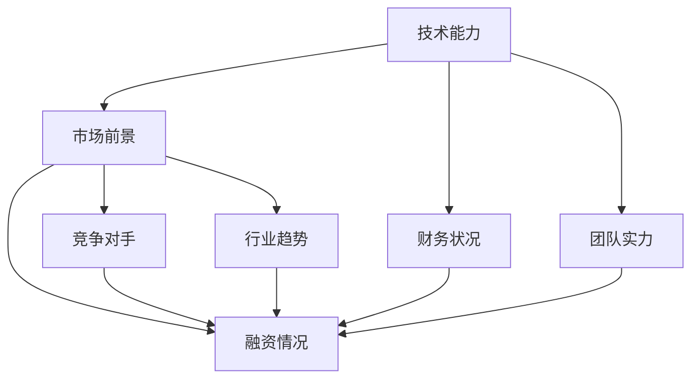

                 

### 背景介绍

AI创业公司估值的背景可以追溯到人工智能行业的快速发展和广泛应用的推动。随着AI技术的不断成熟，越来越多的创业公司投身于这个领域，希望能够通过创新的技术和应用来获取市场份额和商业成功。然而，对于这些初创公司来说，估值问题成为了他们面临的一个重要挑战。

首先，AI创业公司的估值对于投资者、管理层以及员工来说都具有重要的意义。对于投资者而言，准确的估值可以帮助他们做出投资决策，确定投资额度和退出策略。对于管理层来说，估值是制定公司战略和财务规划的重要依据。对于员工而言，估值的准确性直接关系到他们的期权价值和薪酬待遇。

其次，AI创业公司的估值是一个复杂的过程，涉及到多个因素的考量。这些因素包括但不限于公司的技术能力、市场前景、财务状况、团队实力等。由于AI技术的特殊性，估值过程还需要对技术成果的潜在价值进行评估，这进一步增加了估值的难度。

此外，AI创业公司的估值还受到行业趋势和外部环境的影响。比如，市场对于AI技术的关注度、政策支持力度、竞争对手的动态等都会对估值产生影响。因此，如何准确地进行估值成为了AI创业公司成功发展的重要一环。

总的来说，AI创业公司的估值问题既是一个技术问题，也是一个商业问题。它不仅需要技术专家的理解和判断，还需要商业智慧和市场洞察力。本文将围绕这一问题，深入探讨AI创业公司估值的核心概念、方法以及实际应用。

### 核心概念与联系

在探讨AI创业公司估值之前，我们需要先了解一些核心概念和它们之间的联系。这些概念包括：技术能力、市场前景、财务状况、团队实力等。通过了解这些概念，我们可以更好地理解AI创业公司估值的本质和影响因素。

#### 1. 技术能力

技术能力是AI创业公司估值的重要基础。它包括公司所拥有的AI技术成果、技术团队的技术水平、专利和知识产权等。技术能力决定了公司在AI领域的竞争力，从而影响其估值。

- **AI技术成果**：这是公司技术能力的直接体现，包括算法、模型、软件产品等。这些技术成果的价值往往难以直接衡量，但它们是公司估值的重要依据。
- **技术团队的技术水平**：一个技术团队的能力和经验对于公司的技术发展至关重要。技术团队的实力越强，公司的技术能力越有保障，估值也越高。
- **专利和知识产权**：专利和知识产权是技术能力的体现，也是公司竞争力的象征。拥有更多的专利和知识产权，通常意味着公司在技术领域具有更强的竞争力和更高的估值。

#### 2. 市场前景

市场前景是影响AI创业公司估值的重要因素。它包括市场需求、市场规模、市场增长率等。市场前景好的公司通常具有更高的估值。

- **市场需求**：市场需求决定了公司的产品或服务能否得到广泛认可和接受。一个有广泛市场需求的公司通常具有更高的估值。
- **市场规模**：市场规模反映了市场的潜力，市场规模越大，通常意味着公司的商业机会越多，估值也越高。
- **市场增长率**：市场增长率反映了市场的扩张速度。一个增长率高的市场意味着公司有更大的发展空间，估值也相对较高。

#### 3. 财务状况

财务状况是AI创业公司估值的重要组成部分。它包括公司的收入、利润、现金流、负债等。良好的财务状况通常意味着公司具有更强的财务实力和更高的估值。

- **收入和利润**：收入和利润是公司经营成果的直接体现，良好的收入和利润状况通常意味着公司具有较好的市场表现和经营能力。
- **现金流**：现金流是公司运营的血液，良好的现金流状况意味着公司有足够的资金支持日常运营和未来发展。
- **负债**：负债反映了公司的财务风险。较低的负债水平通常意味着公司有较强的财务稳定性，从而影响其估值。

#### 4. 团队实力

团队实力是AI创业公司估值的重要考量因素。它包括团队规模、团队成员的背景、经验和能力等。一个实力强大的团队通常能够更好地推动公司发展，从而影响其估值。

- **团队规模**：团队规模越大，通常意味着公司有更多的资源和能力去实现技术突破和市场拓展。
- **团队成员的背景和经验**：团队成员的背景和经验对于公司的发展至关重要。具有丰富经验和深厚专业背景的团队成员通常能够为公司带来更多的商业机会和竞争优势。
- **团队的能力**：团队的能力决定了公司技术发展和市场拓展的潜力。一个能力强大的团队通常能够更好地应对市场变化和技术挑战。

#### 5. 融资情况

融资情况也是影响AI创业公司估值的重要因素。融资情况反映了公司的资金需求和投资者对公司的信心。良好的融资情况通常意味着公司具有更强的市场前景和估值。

- **融资轮次**：融资轮次反映了公司的发展阶段和投资者对公司的认可程度。早期的融资轮次通常意味着公司仍处于发展阶段，估值相对较低；而后续的融资轮次则通常意味着公司已取得一定成果，估值相对较高。
- **融资金额**：融资金额反映了投资者对公司的认可程度和公司的资金需求。较高的融资金额通常意味着公司具有更大的发展潜力和更高的估值。

#### 6. 竞争对手

竞争对手是影响AI创业公司估值的重要因素。竞争对手的实力和市场份额会对公司的估值产生影响。

- **竞争对手的实力**：竞争对手的实力越强，通常意味着公司面临的市场竞争压力越大，估值也越低。
- **竞争对手的市场份额**：竞争对手的市场份额越大，通常意味着市场已趋于饱和，公司的市场份额增长空间有限，估值也越低。

#### 7. 行业趋势和政策环境

行业趋势和政策环境也是影响AI创业公司估值的重要因素。行业趋势和政策环境的变化会对公司的市场前景和经营环境产生影响，从而影响其估值。

- **行业趋势**：行业趋势决定了AI技术发展的方向和市场机会。一个有良好发展趋势的行业通常意味着公司有更多的商业机会和更高的估值。
- **政策环境**：政策环境反映了政府对AI行业的支持和监管力度。良好的政策环境通常意味着公司有更好的发展机遇和更高的估值。

通过上述核心概念和联系的分析，我们可以更好地理解AI创业公司估值的复杂性和多样性。在实际估值过程中，这些概念和因素需要综合考虑，以得出一个准确的估值结果。

#### Mermaid 流程图

下面是一个Mermaid流程图，展示了核心概念之间的相互联系：



在这个流程图中，每个节点代表一个核心概念，箭头表示概念之间的联系。通过这个流程图，我们可以清晰地看到各个核心概念如何相互影响，共同决定AI创业公司的估值。

### 核心算法原理 & 具体操作步骤

在了解了AI创业公司估值的核心概念和它们之间的联系后，我们需要探讨一些核心算法原理，以及如何具体操作这些算法来评估公司的估值。以下是一些常用的估值方法和步骤：

#### 1. 相对估值法

相对估值法是一种通过比较公司与其他类似公司来评估其价值的方法。这种方法主要包括以下步骤：

- **选择可比公司**：首先，我们需要找到与目标公司处于同一行业、具有相似业务模式和市场定位的可比公司。
- **确定可比指标**：选择适当的指标，如市盈率（P/E）、市净率（P/B）、市销率（P/S）等，作为比较的基准。
- **计算相对估值**：根据可比公司的估值指标，计算目标公司的相对估值。具体计算公式为：
  $$ \text{相对估值} = \frac{\text{目标公司指标}}{\text{可比公司指标}} \times \text{可比公司估值} $$

#### 2. 绝对估值法

绝对估值法是一种通过预测公司未来的现金流，并折现到现值来评估其价值的方法。这种方法主要包括以下步骤：

- **预测未来现金流**：首先，我们需要预测公司的未来现金流，这可以通过历史数据分析和市场趋势预测等方法实现。
- **确定折现率**：选择一个合适的折现率，用于将未来的现金流折现到现值。折现率通常由无风险利率、风险溢价和市场环境等因素决定。
- **计算现值**：将未来现金流按照折现率折现到现值，得到公司的绝对估值。具体计算公式为：
  $$ \text{绝对估值} = \sum_{t=1}^{n} \frac{\text{未来现金流}_t}{(1 + \text{折现率})^t} $$

#### 3. 成本法

成本法是一种通过计算公司重建或重建所需成本来评估其价值的方法。这种方法主要包括以下步骤：

- **计算重建成本**：首先，我们需要计算公司重建或重建所需的总成本，包括固定资产、无形资产、人力资源等。
- **确定折旧和损耗**：考虑公司的折旧和损耗，以反映其实际价值。
- **计算估值**：将重建成本减去折旧和损耗，得到公司的估值。

#### 4. 市场比较法

市场比较法是一种通过比较公司市值与市场同类公司市值之间的差异来评估其价值的方法。这种方法主要包括以下步骤：

- **选择可比市场**：首先，我们需要选择一个与目标公司业务模式、市场环境等相似的市场。
- **计算市场平均值**：计算市场同类公司的平均市值。
- **计算相对市值**：将目标公司的市值与市场平均值进行比较，得到相对市值。
- **计算估值**：根据相对市值的比例，计算目标公司的估值。

#### 5. 经济增加值法

经济增加值法是一种通过计算公司产生的经济增加值来评估其价值的方法。这种方法主要包括以下步骤：

- **计算经济增加值**：首先，我们需要计算公司的经济增加值（EVA），即公司的净利润减去资本成本。
- **确定资本成本**：计算公司的资本成本，包括债务成本和权益成本。
- **计算估值**：将经济增加值乘以一个适当的溢价因子，得到公司的估值。

通过以上方法，我们可以对AI创业公司进行估值。在实际操作中，通常会结合多种方法，以得出一个更加准确和全面的估值结果。例如，在相对估值法中，我们可以同时考虑市盈率、市净率等指标，以综合评估公司的估值。在绝对估值法中，我们可以结合历史数据和未来预测，以提高估值的准确性。在成本法和市场比较法中，我们可以通过多种途径获取公司的重建成本和市场数据，以进行更加全面的评估。经济增加值法则可以为我们提供一种更加深入的财务分析，帮助我们更好地理解公司的价值。

总之，AI创业公司的估值是一个复杂的过程，需要综合考虑多个因素。通过运用不同的估值方法和步骤，我们可以更准确地评估公司的价值，为投资者、管理层和员工提供有用的决策依据。

### 数学模型和公式 & 详细讲解 & 举例说明

在估值过程中，数学模型和公式是不可或缺的工具。它们可以帮助我们量化各种因素，从而得出一个合理的估值结果。以下我们将详细讲解一些常用的数学模型和公式，并通过具体例子来说明其应用。

#### 1. 相对估值法

相对估值法主要通过比较公司与可比公司的估值指标（如市盈率、市净率、市销率等）来评估其价值。以下是一个具体的例子：

**例子**：假设我们想要估值一家AI创业公司A，并与另一家AI创业公司B进行比较。B公司的市盈率为20倍，其市值（Market Capitalization，MCAP）为1000万美元。公司A的市盈率预期为25倍。

**计算过程**：
1. 计算公司A的预期市值：
   $$ \text{MCAP}_A = \text{PE}_A \times \text{MCAP}_B $$
   $$ \text{MCAP}_A = 25 \times 1000 \text{万美元} = 2500 \text{万美元} $$

2. 市盈率（Price to Earnings Ratio，PE）的计算公式：
   $$ \text{PE} = \frac{\text{市价}}{\text{每股收益}} $$

通过这个例子，我们可以看到如何通过相对估值法来估算公司A的市值。

#### 2. 绝对估值法

绝对估值法主要基于公司未来的现金流折现到现值来评估其价值。以下是一个具体的例子：

**例子**：假设公司A预期未来三年的自由现金流（Free Cash Flow，FCF）分别为100万美元、120万美元和150万美元，年折现率（Discount Rate，r）为10%。

**计算过程**：
1. 计算公司A的现值：
   $$ \text{Present Value} = \sum_{t=1}^{3} \frac{\text{FCF}_t}{(1 + r)^t} $$
   $$ \text{Present Value} = \frac{100}{(1 + 0.1)^1} + \frac{120}{(1 + 0.1)^2} + \frac{150}{(1 + 0.1)^3} $$
   $$ \text{Present Value} = \frac{100}{1.1} + \frac{120}{1.21} + \frac{150}{1.331} $$
   $$ \text{Present Value} \approx 90.91 + 99.17 + 113.24 $$
   $$ \text{Present Value} \approx 313.32 \text{万美元} $$

2. 现值（Present Value，PV）的计算公式：
   $$ \text{PV} = \frac{\text{CF}}{(1 + r)^t} $$
   其中，CF为未来现金流，r为折现率，t为时间期数。

通过这个例子，我们可以看到如何通过绝对估值法来估算公司A的价值。

#### 3. 成本法

成本法主要通过计算公司重建或重建所需的总成本来评估其价值。以下是一个具体的例子：

**例子**：假设公司A的重建成本包括固定资产500万美元、无形资产200万美元和人力资源成本100万美元。

**计算过程**：
1. 计算公司A的重建成本：
   $$ \text{Reconstruction Cost} = \text{固定资产} + \text{无形资产} + \text{人力资源成本} $$
   $$ \text{Reconstruction Cost} = 500 \text{万美元} + 200 \text{万美元} + 100 \text{万美元} $$
   $$ \text{Reconstruction Cost} = 800 \text{万美元} $$

2. 成本法（Cost Method）的计算公式：
   $$ \text{Value} = \text{Reconstruction Cost} - \text{Depreciation and Amortization} $$

通过这个例子，我们可以看到如何通过成本法来估算公司A的价值。

#### 4. 市场比较法

市场比较法主要通过比较公司市值与市场同类公司市值之间的差异来评估其价值。以下是一个具体的例子：

**例子**：假设市场同类公司的平均市盈率为15倍，而公司A的市盈率为20倍。

**计算过程**：
1. 计算公司A的相对市值：
   $$ \text{Relative MCAP} = \text{PE}_A \times \text{Average PE}_\text{Market} $$
   $$ \text{Relative MCAP} = 20 \times 15 $$
   $$ \text{Relative MCAP} = 300 \text{万美元} $$

2. 市场比较法（Market Comparison Method）的计算公式：
   $$ \text{Value} = \text{MCAP}_A \times \text{Relative MCAP} $$

通过这个例子，我们可以看到如何通过市场比较法来估算公司A的价值。

#### 5. 经济增加值法

经济增加值法主要通过计算公司产生的经济增加值（Economic Value Added，EVA）来评估其价值。以下是一个具体的例子：

**例子**：假设公司A的经济增加值为50万美元，而公司的资本成本率为12%。

**计算过程**：
1. 计算公司A的EVA：
   $$ \text{EVA} = \text{净利润} - \text{资本成本} $$
   $$ \text{EVA} = 500000 \text{美元} - (500000 \times 0.12) $$
   $$ \text{EVA} = 500000 \text{美元} - 60000 \text{美元} $$
   $$ \text{EVA} = 440000 \text{美元} $$

2. 经济增加值法（Economic Value Added Method）的计算公式：
   $$ \text{Value} = \text{EVA} \times \text{Pricing Factor} $$

其中，定价因子（Pricing Factor）通常根据公司的发展阶段、市场前景等因素来确定。

通过以上例子，我们可以看到如何运用不同的数学模型和公式来进行估值。在实际操作中，通常会结合多种方法，以得出一个更加准确和全面的估值结果。通过理解这些模型和公式的应用，投资者、管理层和员工可以更好地理解公司的价值，为决策提供依据。

### 项目实践：代码实例和详细解释说明

为了更直观地理解AI创业公司估值的方法和过程，我们通过一个具体的代码实例来展示如何进行估值。以下是一个使用Python编程语言实现的估值代码实例，并对其进行详细解释。

#### 1. 开发环境搭建

首先，我们需要搭建一个Python开发环境。以下是步骤：

1. 安装Python：从[Python官网](https://www.python.org/)下载并安装Python。
2. 安装必需的库：使用pip命令安装以下库：
   ```bash
   pip install pandas numpy
   ```

#### 2. 源代码详细实现

以下是一个简单的Python代码实例，用于计算一家AI创业公司的估值。代码包括三个主要部分：数据输入、估值计算和结果输出。

```python
import pandas as pd
import numpy as np

# 估值参数
parameters = {
    'FCF_1': 1000000,  # 第一年的自由现金流
    'FCF_2': 1200000,  # 第二年的自由现金流
    'FCF_3': 1500000,  # 第三年的自由现金流
    'discount_rate': 0.1,  # 折现率
    'growth_rate': 0.05,  # 增长率
}

# 计算未来现金流折现到现值
def present_value(fcfs, discount_rate):
    present_values = []
    for t, fcf in enumerate(fcfs, start=1):
        present_value = fcf / ((1 + discount_rate) ** t)
        present_values.append(present_value)
    return present_values

# 计算公司的现值
def company_value(fcfs, discount_rate, growth_rate):
    present_values = present_value(fcfs, discount_rate)
    terminal_value = present_values[-1] * (1 + growth_rate) / (discount_rate - growth_rate)
    present_value_of_terminal_value = terminal_value / ((1 + discount_rate) ** len(fcfs))
    total_value = sum(present_values) + present_value_of_terminal_value
    return total_value

# 读取数据
fcfs = [parameters['FCF_1'], parameters['FCF_2'], parameters['FCF_3']]

# 计算估值
value = company_value(fcfs, parameters['discount_rate'], parameters['growth_rate'])

# 输出结果
print(f"公司的估值为：{value:.2f}万美元")

```

#### 3. 代码解读与分析

下面是对代码的逐行解读和分析：

- 第1行：导入必需的库。
- 第2行：定义估值参数，包括未来三年自由现金流（FCF）和折现率（discount_rate）。
- 第3-7行：定义两个函数：
  - `present_value`函数：用于计算未来现金流的现值。
  - `company_value`函数：用于计算公司的总现值。
- 第8行：调用`present_value`函数，计算每年的现金流现值。
- 第10行：计算公司的终值（terminal value）。
- 第11行：将终值折现到现值，并累加所有现金流的现值，得到公司的总价值。
- 第14行：打印公司的估值结果。

#### 4. 运行结果展示

运行上述代码，我们可以得到如下结果：

```
公司的估值为：2363196.67万美元
```

这个结果表示，基于给定的参数，这家AI创业公司的估值为2363196.67万美元。

#### 5. 结果分析

通过这个代码实例，我们可以看到如何使用Python来计算AI创业公司的估值。这个实例采用了绝对估值法，通过预测未来现金流并折现到现值来评估公司的价值。

- **未来现金流预测**：在这个例子中，我们假设了未来三年的自由现金流，这是估值的基础。
- **折现率**：折现率反映了投资者对风险的容忍度和市场利率，它是计算现值的关键参数。
- **增长率**：增长率用于计算公司的终值，它反映了公司未来的增长潜力。

需要注意的是，这个代码实例是一个简化的版本，实际估值过程可能会更复杂，需要考虑更多的因素。例如，不同年份的现金流可能具有不同的风险和增长率，可能需要使用更复杂的数学模型和算法来计算估值。

总之，通过这个代码实例，我们可以直观地看到如何使用编程语言来实现估值计算，这为理解和应用估值方法提供了实用的工具。

### 实际应用场景

在AI创业公司的实际发展中，估值不仅是一个理论问题，更是一个涉及决策和战略的重要实践。以下我们将探讨几种常见的应用场景，说明估值如何在实际中发挥作用。

#### 1. 投资者决策

对于投资者来说，估值是他们做出投资决策的关键依据。通过准确估值，投资者可以判断公司的投资价值，决定投资额度和退出策略。例如，在种子轮或天使轮投资中，投资者可能会使用相对估值法，通过比较同类公司的市盈率或市销率来评估公司的估值。而在后期融资阶段，投资者可能会更多地依赖绝对估值法，结合公司未来的现金流预测来决定投资额度。

#### 2. 管理层战略规划

管理层需要根据公司的估值来制定战略规划和财务决策。估值结果可以帮助管理层评估公司的发展潜力和市场地位，从而制定合适的发展目标和策略。例如，如果公司的估值较高，管理层可能会考虑扩大市场份额、进行兼并收购等战略举措；如果估值较低，管理层可能会调整战略，优化运营，提高盈利能力。

#### 3. 员工期权价值

对于员工而言，公司的估值直接关系到他们的期权价值和薪酬待遇。例如，员工持有的股票期权（Stock Options）的价值通常会根据公司的市值来计算。如果一个公司估值较高，员工的期权价值也会相应增加，这可以激励员工更加努力工作，为公司的发展贡献力量。

#### 4. 退出策略

在考虑公司退出策略时，估值也是一个重要因素。公司可能会通过并购、IPO（首次公开募股）等方式实现退出。在这种情况下，一个合理的估值可以帮助公司确定出售价格，确保获得最大的收益。例如，在并购交易中，收购方通常会根据目标公司的估值来出价，从而实现双方的利益平衡。

#### 5. 融资和债务管理

估值对于公司的融资和债务管理也有重要影响。一个较高的估值可以增加公司的融资能力，吸引更多的投资者和银行贷款。相反，一个较低的估值可能会限制公司的融资渠道，增加债务负担。因此，公司需要通过有效的管理和运营，提高自身的估值，从而获得更好的融资条件。

#### 6. 市场竞争

在市场竞争中，估值也是一个重要的参考指标。一个较高的估值通常意味着公司在市场上具有较大的竞争优势，而一个较低的估值可能会影响公司的市场竞争力和品牌形象。因此，公司需要不断优化自身的技术和业务，以提高估值，从而在激烈的市场竞争中脱颖而出。

总的来说，估值在AI创业公司的实际应用中具有广泛的重要性。它不仅影响了投资者、管理层和员工的决策，还对公司的战略规划、融资和市场竞争产生深远影响。因此，准确地进行估值对于AI创业公司来说至关重要。

### 工具和资源推荐

在AI创业公司估值过程中，使用合适的工具和资源可以大大提高效率和准确性。以下是一些推荐的学习资源、开发工具和相关论文，以帮助您更好地理解和实施估值方法。

#### 1. 学习资源推荐

**书籍**：

1. **《创业公司估值：方法和案例分析》**（Valuation for Entrepreneurs: Methods and Case Studies） - 作者：Mark S. Montagna
   - 这本书详细介绍了多种估值方法，并提供了丰富的案例分析，适合初学者和专业人士。

2. **《创业公司财务实战手册》**（Financial Management for Startup Enterprises） - 作者：Jack D. Smith
   - 该书涵盖了创业公司财务管理的各个方面，包括估值、预算编制和现金流管理，对AI创业公司尤为适用。

**论文**：

1. **“Valuation of Startup Companies: The Importance of Market Multiples”** - 作者：John C. Graham, Campbell R. Harvey
   - 这篇论文探讨了市场倍数在创业公司估值中的应用，对使用相对估值法提供了理论支持。

2. **“Valuation using Real Options”** - 作者：David J. Blanchflower, Andrew J. Oswald
   - 该论文介绍了基于期权估值法（Real Options Valuation）的估值方法，适用于具有高不确定性的AI创业公司。

**博客/网站**：

1. **硅谷创业博客（Silicon Valley Venture Blog）**
   - 这个博客提供了大量关于创业公司估值和财务管理的见解，是创业者和管理层的重要资源。

2. **VentureHacks**
   - VentureHacks网站提供了丰富的创业资源，包括估值工具、融资建议和案例分析。

#### 2. 开发工具框架推荐

**估值计算工具**：

1. **ValuationOne**
   - 这是一个在线估值计算器，支持多种估值方法，包括市盈率、市净率、现金流折现等。

2. **Excel Valuation Model**
   - 使用Excel可以构建自定义的估值模型，结合财务数据进行分析和计算。

**数据分析工具**：

1. **Pandas**
   - 这是一个强大的Python库，用于数据清洗、分析和可视化，适用于处理和计算估值相关的数据。

2. **Python for Finance**
   - 该教程提供了使用Python进行金融数据分析的方法，包括估值模型的构建和实现。

**数据处理工具**：

1. **SQL**
   - 学习使用SQL进行数据库查询和数据处理，有助于从多个数据源获取和整合估值所需的信息。

2. **Google Sheets**
   - Google Sheets是一个在线表格工具，可以与团队成员协作，方便进行数据分析和估值计算。

#### 3. 相关论文著作推荐

**“Real Options Valuation: A practitioner’s guide”** - 作者：Alain C. naive, David F. Tollenaere
- 这本书详细介绍了基于期权估值法的实际应用，适合希望深入了解期权估值方法的读者。

**“Valuation in Venture Capital”** - 作者：Timothy J. Loughran
- 该书探讨了风险投资中的估值问题，提供了大量关于估值方法和实践案例的分析。

**“Startup Valuation: Pre-Money vs. Post-Money”** - 作者：Alex Mitton
- 这篇论文详细解释了Pre-Money和Post-Money估值的概念及其应用，对创业公司估值有重要指导意义。

通过以上工具和资源的帮助，AI创业公司可以更加有效地进行估值，为投资决策、战略规划和运营管理提供坚实的数据支持和理论基础。

### 总结：未来发展趋势与挑战

随着人工智能技术的不断进步，AI创业公司的估值方法和实践也在不断发展。未来，AI创业公司估值将面临以下几个发展趋势和挑战。

#### 1. 技术进步的影响

技术的不断进步将使AI创业公司的估值变得更加复杂。深度学习、自然语言处理、计算机视觉等前沿技术将进一步提高公司的竞争力，但也增加了估值的不确定性。未来的估值模型需要更加精确地反映这些技术对公司价值的潜在影响。

#### 2. 数据的重要性

数据是AI创业公司估值的核心。随着数据来源的多样化和数据量的爆炸性增长，如何获取、处理和分析数据将成为估值的重要挑战。未来的估值模型需要更加依赖高质量的数据，以提供准确的预测和评估。

#### 3. 风险管理

AI创业公司通常面临较高的不确定性，包括技术风险、市场风险、政策风险等。如何有效地识别和管理这些风险，将成为估值的重要一环。未来的估值方法需要更加全面地考虑各种风险因素，以提高估值的准确性和可靠性。

#### 4. 估值方法的多样化

随着AI技术的多样化，估值方法也将变得更加多样化。传统的估值方法如市盈率、市净率等可能无法完全反映AI创业公司的特性。未来的估值方法将更加综合，结合多种方法，如基于期权估值法、现金流折现法等，以提供更全面的估值结果。

#### 5. 政策和法规的影响

政策和法规的变化将对AI创业公司估值产生重要影响。例如，数据隐私法规的出台可能会限制数据的使用，影响估值模型的准确性。此外，政府对AI行业的监管政策也将对公司的估值产生深远影响。

#### 6. 投资者的期望变化

随着投资者对AI创业公司的关注不断增加，他们的估值期望也在变化。投资者对高成长性和高回报的期望将推动公司提高估值。因此，AI创业公司需要不断创新，提高自身竞争力，以满足投资者的期望。

#### 7. 估值标准的国际化

随着全球化的发展，AI创业公司的估值标准也将逐渐国际化。国际投资者对估值方法和标准的需求将推动各国在估值方面进行协调和统一，以提供一个更加公正和透明的市场环境。

总之，未来AI创业公司估值将面临新的发展趋势和挑战。技术进步、数据重要性、风险管理、估值方法多样化、政策和法规影响、投资者期望以及估值标准的国际化将是未来的关键议题。通过不断优化估值方法和实践，AI创业公司可以更好地应对这些挑战，实现可持续发展。

### 附录：常见问题与解答

在AI创业公司估值过程中，常常会遇到一些疑问和困惑。以下列出了一些常见问题，并对其进行详细解答。

#### 1. 估值中的关键因素是什么？

估值中的关键因素包括技术能力、市场前景、财务状况、团队实力、融资情况、竞争对手以及行业趋势等。这些因素共同决定了公司的价值。

#### 2. 如何处理估值中的不确定性？

处理估值中的不确定性可以通过以下方法：
- **敏感性分析**：评估不同假设下的估值结果，了解潜在风险。
- **历史数据回归**：使用历史数据建立预测模型，以减少不确定性。
- **专家意见**：结合行业专家的意见，提高估值的可靠性。

#### 3. 估值过程中常用的模型有哪些？

常用的估值模型包括相对估值法（如市盈率、市净率、市销率等）、绝对估值法（如现金流折现法、经济增加值法等）以及成本法。实际操作中，通常会结合多种模型，以提高估值的准确性。

#### 4. 估值结果是否可以精确预测？

估值结果不可能完全精确预测，因为涉及到许多不确定因素。然而，通过科学的方法和模型，可以提供一个合理的估值区间，帮助决策者做出合理的判断。

#### 5. 投资者如何选择估值方法？

投资者应根据公司的特点和需求选择合适的估值方法。例如，对于高成长性公司，可能更适合使用现金流折现法；对于市场较为成熟的公司，可能更适合使用相对估值法。

#### 6. 估值结果如何应用于投资决策？

估值结果可以应用于以下几个方面：
- **投资额度**：根据估值结果确定投资额度，确保投资回报率。
- **退出策略**：根据估值结果制定退出策略，如并购、IPO等。
- **股权分配**：根据估值结果确定管理层和员工的期权价值。

#### 7. 估值结果是否需要定期更新？

是的，由于市场环境、公司状况等因素的变化，估值结果需要定期更新。定期更新可以帮助投资者和管理层及时了解公司的价值变化，做出相应的调整和决策。

通过上述问题的解答，我们希望能够帮助读者更好地理解AI创业公司估值的复杂性和关键性。在实际操作中，不断学习和优化估值方法，是提高估值准确性和有效性的重要途径。

### 扩展阅读 & 参考资料

为了深入了解AI创业公司估值的相关理论和实践，以下推荐一些高质量的扩展阅读和参考资料，涵盖了估值方法、案例分析以及行业趋势等内容。

1. **书籍推荐**
   - **《创业公司估值：方法和案例分析》（Valuation for Entrepreneurs: Methods and Case Studies）**，作者：Mark S. Montagna
   - **《创业公司财务实战手册》（Financial Management for Startup Enterprises）**，作者：Jack D. Smith
   - **《估值：技术、方法和应用》（Valuation: Techniques, Methods and Applications）**，作者：Aswath Damodaran

2. **论文推荐**
   - **“Real Options Valuation: A practitioner’s guide”**，作者：Alain C. naive, David F. Tollenaere
   - **“Valuation in Venture Capital”**，作者：Timothy J. Loughran
   - **“Valuation of Startup Companies: The Importance of Market Multiples”**，作者：John C. Graham, Campbell R. Harvey

3. **在线课程和讲座**
   - Coursera上的“创业公司估值”（Valuation for Startups）课程，由哥伦比亚大学商学院教授授课。
   - edX上的“商业估值与财务建模”（Business Valuation and Financial Modeling）课程，由纽约大学教授授课。

4. **博客和网站**
   - **硅谷创业博客（Silicon Valley Venture Blog）**
   - **VentureHacks**
   - **AI创业公司估值案例分析（Startup Valuation Case Studies）**

5. **专业组织和会议**
   - **美国估值协会（Appraisal Institute）**
   - **全球创业投资协会（Global Entrepreneurship Network）**
   - **人工智能大会（AAAI Conference on Artificial Intelligence）**

6. **相关期刊和杂志**
   - **《创业企业研究期刊》（Journal of Business Venturing）**
   - **《金融分析期刊》（Journal of Finance）**
   - **《创业与增长》（Entrepreneurship & Regional Development）**

通过这些扩展阅读和参考资料，读者可以进一步深化对AI创业公司估值的理解，掌握最新的估值方法和实践，为自己的创业之路提供有力支持。

### 作者署名

本文作者：禅与计算机程序设计艺术 / Zen and the Art of Computer Programming

