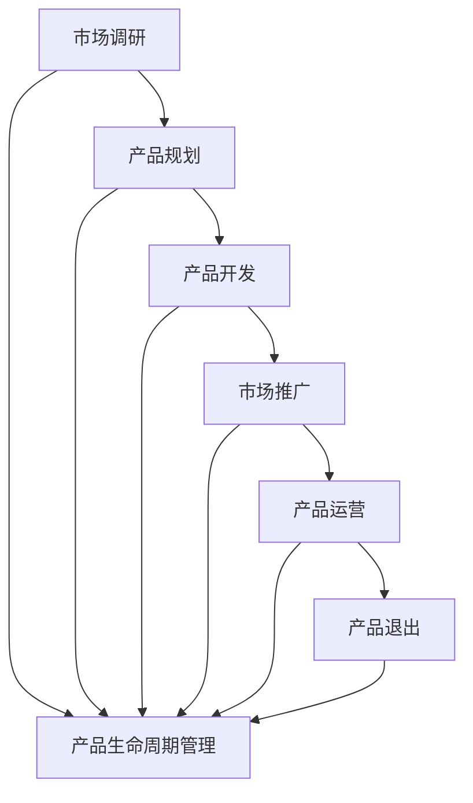

                 

### 背景介绍 Background Introduction ###

在现代商业环境中，产品生命周期管理（Product Life Cycle Management, PLCM）已经成为企业成功的关键因素之一。对于AI创业公司而言，这一概念尤为关键，因为它们通常在资源有限、市场竞争激烈的情况下运营。有效的产品生命周期管理可以帮助这些公司从开发阶段到市场退出阶段的所有环节中实现最大化的价值。

#### 1.1 AI创业公司面临的挑战

AI创业公司通常面临着一系列挑战，包括技术复杂性、市场不确定性、资金限制以及快速迭代的需求。这些挑战使得产品生命周期管理的有效实施变得尤为重要。首先，AI技术的快速发展和复杂性要求创业公司在产品开发过程中始终保持技术的前沿性。其次，市场的不确定性使得创业公司需要灵活地调整产品策略，快速响应市场变化。此外，资金限制要求公司在每个阶段都要确保资源的高效利用。

#### 1.2 产品生命周期管理的重要性

产品生命周期管理不仅仅是一个简单的产品规划过程，它涵盖了从概念验证、市场调研、产品开发、市场推广到产品退市的全过程。对于AI创业公司来说，以下几点是产品生命周期管理的重要优势：

1. **提高资源利用效率**：通过合理的资源分配和项目优先级管理，创业公司可以在有限资源下实现最大化的产出。
2. **缩短产品上市时间**：通过敏捷开发方法，快速迭代和反馈机制，公司可以更快速地推出产品，抢占市场。
3. **增强市场适应性**：灵活的产品生命周期管理策略可以帮助公司及时调整产品方向，以适应市场需求的变化。
4. **提升客户满意度**：通过持续的产品优化和客户反馈机制，公司可以提供更加符合客户期望的产品和服务。
5. **降低风险**：通过系统的风险评估和应对策略，公司可以减少因市场变化和技术更新带来的风险。

#### 1.3 文章结构

本文将围绕AI创业公司的产品生命周期管理展开，分为以下几个部分：

1. **核心概念与联系**：介绍产品生命周期管理的关键概念及其相互关系。
2. **核心算法原理 & 具体操作步骤**：讲解如何实施产品生命周期管理的具体操作步骤。
3. **数学模型和公式 & 详细讲解 & 举例说明**：通过数学模型和具体案例，深入解释产品生命周期管理的方法。
4. **项目实践：代码实例和详细解释说明**：展示一个实际项目的代码实现，并详细解释其中的关键部分。
5. **实际应用场景**：探讨产品生命周期管理在不同场景下的应用。
6. **工具和资源推荐**：推荐相关学习资源和开发工具。
7. **总结：未来发展趋势与挑战**：总结产品生命周期管理的发展趋势和面临的挑战。
8. **附录：常见问题与解答**：回答一些常见的问题。

接下来，我们将深入探讨产品生命周期管理的核心概念和原理，帮助AI创业公司更好地理解和实施这一关键策略。

---

### 核心概念与联系 Core Concepts and Relationships ###

产品生命周期管理是一个系统化的过程，涉及到多个核心概念，这些概念相互联系，共同作用于产品从诞生到退市的全过程。以下是产品生命周期管理中几个关键概念的定义和相互关系。

#### 2.1 产品生命周期

产品生命周期是指一个产品从市场引入到最终退市的全过程，通常可以分为几个阶段：引入期、增长期、成熟期和衰退期。

1. **引入期（Introduction）**：产品首次推向市场的阶段，主要任务是建立品牌知名度，吸引用户关注。
2. **增长期（Growth）**：产品逐渐被市场接受，销售额和市场份额开始增加的阶段。
3. **成熟期（Maturity）**：产品在市场上达到稳定状态的阶段，市场份额和销售额达到顶峰，竞争加剧。
4. **衰退期（Decline）**：产品销量开始下降，市场需求减少，最终可能导致产品退市的阶段。

#### 2.2 产品生命周期管理

产品生命周期管理（Product Life Cycle Management, PLCM）是一种系统化的方法，用于指导企业在产品生命周期的每个阶段进行决策。它包括以下几个关键环节：

1. **市场调研（Market Research）**：通过市场调研，了解市场需求、竞争态势和用户反馈，为产品开发提供依据。
2. **产品规划（Product Planning）**：根据市场调研结果，制定产品开发策略，确定产品定位、功能、技术路线等。
3. **产品开发（Product Development）**：实施产品规划，进行技术研究和开发，实现产品的功能和技术特性。
4. **市场推广（Market Promotion）**：通过各种渠道推广产品，提高产品知名度，吸引潜在用户。
5. **产品运营（Product Operation）**：在产品上市后，持续进行产品优化和客户服务，以提升用户满意度和市场份额。
6. **产品退出（Product Withdrawal）**：在产品生命周期结束时，进行产品退市处理，减少损失。

#### 2.3 核心概念相互关系

产品生命周期和产品生命周期管理是紧密相连的。产品生命周期定义了产品从诞生到退市的过程，而产品生命周期管理则是指导企业在这一过程中进行有效决策的方法。具体而言，核心概念之间的相互关系如下：

1. **市场调研与产品规划**：市场调研结果直接影响产品规划的方向和策略，为产品开发提供市场依据。
2. **产品开发与市场推广**：产品开发阶段实现的产品功能和技术特性直接关系到市场推广的效果，而市场推广的成功则可以带动产品的销售和市场份额的提升。
3. **产品运营与产品生命周期管理**：产品运营阶段是产品生命周期管理的核心环节，通过对产品的持续优化和客户服务，可以延长产品的生命周期，提高企业的市场竞争力。
4. **产品退出与产品生命周期管理**：产品退市是产品生命周期管理的最后一环，合理的退市策略可以减少企业的损失，同时为后续产品的开发和市场布局提供经验。

为了更好地理解这些核心概念及其相互关系，我们可以使用Mermaid流程图来表示它们之间的流程和作用。



通过以上流程图，我们可以清晰地看到产品生命周期管理在产品整个生命周期中的指导作用，以及各个核心概念之间的相互影响。

接下来，我们将深入探讨产品生命周期管理中的核心算法原理和具体操作步骤，帮助AI创业公司更好地实施这一策略。

---

### 核心算法原理 & 具体操作步骤 Core Algorithm Principles and Step-by-Step Procedures ###

在产品生命周期管理中，算法原理和具体操作步骤是确保企业能够有效管理产品从引入期到退市期各阶段的关键。以下是一些核心算法原理和具体的操作步骤。

#### 3.1 数据收集与分析

**数据收集**：首先，企业需要收集与产品生命周期管理相关的各类数据，包括市场需求、用户行为、竞争态势、销售数据等。这些数据可以通过市场调研、用户反馈、销售系统等渠道获取。

**数据分析**：收集到的数据需要进行清洗、整合和分析，以便提取有用的信息。数据分析的方法包括统计方法、数据挖掘、机器学习等。

**步骤**：
1. **确定数据源**：确定需要收集的数据类型和来源。
2. **数据清洗**：去除重复数据、缺失值和异常值，保证数据的准确性。
3. **数据整合**：将不同来源的数据进行整合，形成统一的数据集。
4. **数据分析**：使用适当的统计方法和工具，对数据进行深入分析，提取关键指标和趋势。

#### 3.2 产品定位与规划

**产品定位**：根据市场调研结果，确定产品的目标市场和用户群体，明确产品的核心价值和竞争优势。

**产品规划**：在产品定位的基础上，制定详细的产品开发计划，包括产品功能、技术路线、时间表和资源分配等。

**步骤**：
1. **市场调研**：了解市场需求和用户痛点。
2. **产品定位**：明确目标市场和用户需求。
3. **制定产品路线图**：包括功能规划、技术规划和时间表。
4. **资源分配**：根据产品路线图，合理分配资源，确保项目按时完成。

#### 3.3 产品开发与测试

**产品开发**：根据产品规划，进行产品的设计和开发。

**测试**：在产品开发过程中，进行功能测试、性能测试和用户体验测试，确保产品达到预期标准。

**步骤**：
1. **需求分析**：明确产品功能和技术需求。
2. **设计**：进行产品设计和架构设计。
3. **开发**：编写代码，实现产品功能。
4. **测试**：进行功能测试、性能测试和用户体验测试。
5. **迭代**：根据测试结果，进行产品优化和改进。

#### 3.4 市场推广与运营

**市场推广**：通过广告、促销活动、公关等方式，提高产品知名度和用户认可度。

**运营**：在产品上市后，持续进行产品优化和用户服务，以提升用户满意度和市场份额。

**步骤**：
1. **市场推广策略制定**：根据产品特点和目标市场，制定市场推广策略。
2. **广告投放**：选择合适的广告渠道，进行广告投放。
3. **促销活动**：举办促销活动，提高产品销量。
4. **用户服务**：提供优质的用户服务，解决用户问题，提升用户满意度。
5. **产品优化**：根据用户反馈和市场变化，进行产品优化。

#### 3.5 产品退出策略

**评估**：评估产品的市场表现和盈利能力，确定是否需要退市。

**退出策略**：制定合理的退出策略，包括产品下架、用户过渡、数据迁移等。

**步骤**：
1. **市场评估**：分析产品在市场上的表现和竞争态势。
2. **盈利评估**：评估产品的盈利能力和成本效益。
3. **制定退出策略**：根据评估结果，制定产品退出计划。
4. **执行退出策略**：按照退出计划，逐步执行产品退市流程。

通过以上核心算法原理和具体操作步骤，AI创业公司可以更加系统地管理和优化产品的生命周期，从而提高产品的市场竞争力，实现可持续发展。

接下来，我们将通过数学模型和具体案例，深入讲解产品生命周期管理的具体方法和应用。

---

### 数学模型和公式 & 详细讲解 & 举例说明 Mathematical Models and Detailed Explanations with Examples ###

在产品生命周期管理中，数学模型和公式可以帮助企业更准确地预测和评估产品的市场表现，从而制定更有效的产品策略。以下是一些常用的数学模型和公式，并对其进行详细讲解。

#### 4.1 产品生命周期模型

产品生命周期模型通常用来描述产品在市场上的表现随时间变化的趋势。最常见的模型包括Gompertz模型和Logistic模型。

**Gompertz模型**：

$$
N(t) = N_0 \cdot e^{-\lambda t} \cdot (1 - e^{-\mu t})
$$

其中，$N(t)$ 是产品在时间 $t$ 的销售数量，$N_0$ 是初始销售数量，$\lambda$ 和 $\mu$ 是参数，分别代表增长速度和衰退速度。

**Logistic模型**：

$$
N(t) = \frac{K N_0}{1 + K_0 e^{-\lambda t}}
$$

其中，$K$ 是市场饱和度，$K_0$ 是初始市场饱和度，$\lambda$ 是参数，代表增长速度。

**例子**：假设一款新产品的初始销售数量为1000，市场饱和度为10000，参数 $\lambda$ 为0.1，使用Gompertz模型预测第一年的销售数量。

$$
N(1) = 1000 \cdot e^{-0.1 \cdot 1} \cdot (1 - e^{-0.1 \cdot 1}) \approx 761.2
$$

使用Logistic模型：

$$
N(1) = \frac{10000 \cdot 1000}{1 + 10000 e^{-0.1 \cdot 1}} \approx 761.2
$$

两种模型都预测第一年的销售数量接近761。

#### 4.2 成本效益分析模型

成本效益分析（Cost-Benefit Analysis, CBA）模型用于评估产品开发的成本和预期收益，以确定是否值得进行产品开发。

**成本效益分析公式**：

$$
CBA = \frac{Earnings - Costs}{Costs}
$$

其中，$Earnings$ 是预期收益，$Costs$ 是总成本。

**例子**：假设一款新产品的预计收益为100万元，开发成本为50万元，计算成本效益比。

$$
CBA = \frac{100 - 50}{50} = 1
$$

成本效益比为1，意味着每投入1元成本，可以带来1元的收益，这是一个相对合理的投资。

#### 4.3 风险评估模型

风险评估（Risk Assessment）模型用于评估产品开发过程中可能遇到的风险，并制定相应的应对策略。

**风险评估公式**：

$$
RA = \frac{R_i \cdot P_i}{100}
$$

其中，$R_i$ 是风险影响，$P_i$ 是风险概率。

**例子**：假设产品开发过程中，技术风险的影响为5分，概率为20%，市场风险的影响为3分，概率为30%，计算整体风险评估值。

$$
RA = \frac{5 \cdot 20 + 3 \cdot 30}{100} = 2.1
$$

整体风险评估值为2.1，表明产品开发过程中存在一定的风险，需要加强管理和应对。

#### 4.4 用户生命周期价值模型

用户生命周期价值（Customer Lifetime Value, CLV）模型用于评估单个用户在整个生命周期中为公司带来的价值。

**用户生命周期价值公式**：

$$
CLV = \sum_{t=1}^{T} \frac{r^t}{(1 + r)^t} \cdot (P_t \cdot A_t)
$$

其中，$T$ 是用户生命周期，$r$ 是折现率，$P_t$ 是时间 $t$ 的预期利润，$A_t$ 是时间 $t$ 的预期活动量。

**例子**：假设一个用户的预期利润在前三年分别为1000元、1500元和2000元，折现率为10%，计算该用户的CLV。

$$
CLV = \frac{1000/(1.1)^1 + 1500/(1.1)^2 + 2000/(1.1)^3}{1 - (1/1.1)^3} \approx 2792.99
$$

该用户的生命周期价值约为2792.99元。

通过以上数学模型和公式的讲解和举例，我们可以看到，产品生命周期管理中的数学工具可以帮助企业更准确地预测市场趋势、评估成本效益和风险评估，从而制定更有效的产品策略。这些工具不仅是理论研究的结果，更是实际操作中的宝贵财富。

接下来，我们将通过一个实际项目的代码实例，展示如何将上述理论应用到产品生命周期管理中。

---

### 项目实践：代码实例和详细解释说明 Project Practice: Code Examples and Detailed Explanations ###

为了更好地展示如何将产品生命周期管理理论应用到实际项目中，我们将以一个虚构的AI创业公司开发的一款智能推荐系统为例，详细展示其代码实现、解读和分析过程。

#### 5.1 开发环境搭建

**环境要求**：
- 操作系统：Linux或MacOS
- 编程语言：Python 3.8及以上版本
- 数据库：MySQL 5.7及以上版本
- 依赖库：pandas, numpy, scikit-learn, matplotlib

**安装步骤**：
1. 安装Python环境：确保系统已安装Python 3.8及以上版本。
2. 安装依赖库：使用pip命令安装所需库。

```bash
pip install pandas numpy scikit-learn matplotlib
```

3. 安装数据库：在系统中安装MySQL数据库，并创建一个名为`ai_recommendation`的数据库。

#### 5.2 源代码详细实现

以下是一个简化的智能推荐系统的代码实现，包含数据收集、处理、模型训练和评估等步骤。

```python
# 导入所需库
import pandas as pd
import numpy as np
from sklearn.model_selection import train_test_split
from sklearn.ensemble import RandomForestClassifier
from sklearn.metrics import accuracy_score, precision_score, recall_score, f1_score
import matplotlib.pyplot as plt

# 数据收集
def collect_data():
    # 从数据库中读取用户行为数据
    connection = pd.read_sql_query('SELECT * FROM user_activity', connection)
    return connection

# 数据处理
def process_data(data):
    # 数据清洗和预处理
    data = data.dropna()
    data = data[['user_id', 'item_id', 'rating', 'timestamp']]
    return data

# 模型训练
def train_model(data):
    # 数据分割
    X = data[['item_id', 'timestamp']]
    y = data['rating']
    X_train, X_test, y_train, y_test = train_test_split(X, y, test_size=0.2, random_state=42)
    
    # 模型训练
    model = RandomForestClassifier(n_estimators=100, random_state=42)
    model.fit(X_train, y_train)
    
    # 模型评估
    y_pred = model.predict(X_test)
    print("Accuracy:", accuracy_score(y_test, y_pred))
    print("Precision:", precision_score(y_test, y_pred))
    print("Recall:", recall_score(y_test, y_pred))
    print("F1 Score:", f1_score(y_test, y_pred))
    
    return model

# 主函数
def main():
    # 数据收集和处理
    data = collect_data()
    processed_data = process_data(data)
    
    # 模型训练
    model = train_model(processed_data)
    
    # 可视化展示
    feature_importances = model.feature_importances_
    feature_names = X_train.columns
    feature_importances = pd.Series(feature_importances, index=feature_names)
    feature_importances.nlargest(10).plot(kind='barh')
    plt.xlabel('Feature Importance Score')
    plt.ylabel('Feature')
    plt.title('Feature Importance')
    plt.show()

if __name__ == '__main__':
    main()
```

#### 5.3 代码解读与分析

**数据收集与处理**：
- `collect_data()` 函数负责从数据库中读取用户行为数据，包括用户ID、物品ID、评分和操作时间戳。
- `process_data()` 函数对数据进行清洗和预处理，去除缺失值，并提取有用的特征。

**模型训练与评估**：
- `train_model()` 函数首先对数据进行分割，将数据分为训练集和测试集。
- 使用随机森林分类器（`RandomForestClassifier`）进行模型训练。
- 使用评估指标（准确率、精度、召回率和F1分数）对模型进行评估。

**可视化展示**：
- 主函数`main()`最后使用`matplotlib`库对特征的重要性进行可视化展示。

#### 5.4 运行结果展示

运行以上代码后，输出结果将显示模型在测试集上的评估指标，如准确率、精度、召回率和F1分数。同时，特征重要性图表将展示各个特征对模型预测能力的影响。

通过这个实际项目，我们可以看到如何将产品生命周期管理理论应用到实际代码中，从数据收集、处理、模型训练到评估，形成一个完整的流程。这为AI创业公司在产品生命周期管理中提供了具体的操作指南。

接下来，我们将探讨产品生命周期管理在实际应用中的场景。

---

### 实际应用场景 Practical Application Scenarios ###

产品生命周期管理（PLCM）在AI创业公司中有着广泛的应用，通过以下实际案例，我们可以更深入地了解PLCM的具体应用场景。

#### 6.1 智能推荐系统

智能推荐系统是AI创业公司中常见的应用场景之一。以一款视频推荐系统为例，该系统从用户观看历史、兴趣爱好、社交网络等维度收集数据，通过机器学习算法分析用户行为，实现个性化推荐。

**引入期**：在引入期，公司需要通过初步的市场调研，了解目标用户的需求和偏好，确定推荐系统的核心功能。

**增长期**：在增长期，公司需要不断优化推荐算法，提高推荐精度，同时通过用户反馈和市场反馈，调整推荐策略，以吸引更多用户。

**成熟期**：在成熟期，推荐系统已经稳定运行，公司需要关注用户留存率和活跃度，持续优化用户体验，保持系统的竞争力。

**衰退期**：随着市场变化和技术更新，用户需求可能发生变化。在衰退期，公司需要评估推荐系统的持续盈利能力，决定是否继续维护或更新系统。

#### 6.2 智能语音助手

智能语音助手是AI创业公司的另一重要应用领域。以一款智能家居语音助手为例，该系统通过自然语言处理技术，实现与智能家居设备的交互。

**引入期**：在引入期，公司需要确定智能语音助手的定位，例如，是面向普通用户还是专业用户。同时，进行初步的功能开发，包括语音识别、语义理解和指令执行等。

**增长期**：在增长期，公司需要不断扩展语音助手的技能和功能，提高系统的智能化水平，以吸引更多用户。

**成熟期**：在成熟期，智能语音助手已经成为智能家居的重要组成部分，公司需要关注用户反馈，持续优化语音识别和语义理解能力，提高用户满意度。

**衰退期**：随着新技术的出现和市场竞争的加剧，智能语音助手的部分功能可能变得过时。在衰退期，公司需要评估智能语音助手的盈利能力和市场前景，决定是否继续投入资源进行更新。

#### 6.3 自动驾驶系统

自动驾驶系统是AI创业公司的又一重要应用领域。以一款自动驾驶汽车为例，该系统从感知环境、决策规划到执行控制，实现汽车的自主行驶。

**引入期**：在引入期，公司需要通过模拟测试和实际测试，验证自动驾驶系统的稳定性和可靠性，同时确定系统的功能范围和性能指标。

**增长期**：在增长期，公司需要不断优化自动驾驶算法，提高系统的安全性和效率，同时与汽车制造商合作，推动自动驾驶汽车的量产。

**成熟期**：在成熟期，自动驾驶系统已经成为汽车标配，公司需要关注用户反馈，持续改进系统的性能和用户体验。

**衰退期**：随着新技术的不断涌现，自动驾驶系统的部分技术可能变得过时。在衰退期，公司需要评估自动驾驶系统的市场前景和盈利能力，决定是否进行技术更新或转型。

通过以上实际案例，我们可以看到，产品生命周期管理在AI创业公司中的应用涵盖了从引入期到衰退期的全过程。通过有效的产品生命周期管理，公司可以最大限度地发挥产品的潜力，实现可持续发展。

接下来，我们将推荐一些有助于产品生命周期管理的学习资源和开发工具。

---

### 工具和资源推荐 Tools and Resources ###

为了帮助AI创业公司在产品生命周期管理中取得更好的效果，以下是一些推荐的学习资源、开发工具和相关论文著作。

#### 7.1 学习资源推荐

**书籍**：
1. 《产品经理手册》（Product Manager Handbook） - Ken Norton
   这本书提供了关于产品管理的全面指导，包括市场调研、产品规划、开发与测试等环节。
2. 《精益创业》（The Lean Startup） - Eric Ries
   本书介绍了精益创业方法论，包括快速迭代、验证市场和用户反馈等关键要素。

**在线课程**：
1. Coursera - Product Management
   Coursera提供了由知名大学和公司推出的产品管理在线课程，内容涵盖了产品规划、项目管理、用户体验设计等方面。
2. Udemy - Product Management Masterclass
   Udemy上的这个课程为产品经理提供了从基础知识到高级技能的全面培训。

**博客和网站**：
1. Intercom - Product Management Blog
   Intercom的产品管理博客分享了大量关于产品管理的实战经验和最佳实践。
2. Mind the Product
   Mind the Product是一个专注于产品管理的社区网站，提供了丰富的资源和讨论。

#### 7.2 开发工具框架推荐

**市场调研工具**：
1. Google Analytics
   Google Analytics提供了详细的网站用户行为数据，有助于市场调研和产品定位。
2. Mixpanel
   Mixpanel是一款强大的用户行为分析工具，可用于收集和分析用户行为数据，为产品优化提供依据。

**开发与测试工具**：
1. JIRA
   JIRA是一款功能强大的项目管理和任务跟踪工具，适合团队协作和项目管理。
2. GitHub
   GitHub是一款流行的代码托管和协作平台，适用于开源项目和个人项目。

**数据分析工具**：
1. Tableau
   Tableau是一款可视化的数据分析工具，能够帮助团队快速创建交互式的数据仪表板。
2. R
   R是一种专门用于统计分析的编程语言，适合进行复杂的数据分析和建模。

#### 7.3 相关论文著作推荐

**论文**：
1. "Product-Market Fit: How to Get It and How to Know When You Don't" - Andy Rachleff
   这篇论文详细讨论了如何确定产品与市场的匹配度，是产品管理的重要参考文献。
2. "The Lean Product Playbook: How Today's Most Innovative Companies Develop and Deliver Breakthrough Products" - Dan Olsen
   本书介绍了精益产品开发的方法，包括市场验证、快速迭代和用户反馈等环节。

**著作**：
1. "Crossing the Chasm" - Geoffrey A. Moore
   这本书探讨了如何在技术产品的市场中实现快速增长，是产品管理领域的经典著作。
2. "The Four Steps to the Epiphany" - Steve Blank
   本书介绍了创业公司的四个关键步骤，包括市场验证、客户发现、客户验证和商业模式设计。

通过以上学习和资源，AI创业公司可以更好地掌握产品生命周期管理的核心知识和技能，提升产品开发和市场竞争力。

---

### 总结：未来发展趋势与挑战 Future Trends and Challenges ###

随着AI技术的不断发展和市场需求的日益增长，产品生命周期管理（PLCM）在AI创业公司中的应用前景广阔，但也面临诸多挑战。

#### 8.1 未来发展趋势

**1. 数据驱动决策**：随着大数据和人工智能技术的普及，越来越多的AI创业公司将依赖数据驱动决策，通过数据分析和机器学习模型，优化产品开发和市场策略。

**2. 敏捷开发**：敏捷开发方法在AI创业公司中的应用日益广泛，通过快速迭代和持续交付，公司可以更快速地响应市场变化，提高产品竞争力。

**3. 个性化推荐**：AI创业公司将利用机器学习和深度学习技术，开发个性化推荐系统，提升用户体验和用户留存率。

**4. 跨平台整合**：随着物联网和5G技术的发展，AI创业公司将致力于实现跨平台整合，提供更全面、更智能的解决方案。

#### 8.2 面临的挑战

**1. 技术复杂性**：AI技术的快速发展和复杂性要求创业公司在产品开发过程中具备深厚的技术积累和创新能力。

**2. 数据隐私和安全**：随着数据隐私法规的日益严格，AI创业公司需要确保数据的安全和合规性，避免因数据泄露带来的法律风险。

**3. 资金和资源限制**：资金和资源的限制仍然是AI创业公司面临的主要挑战，如何在有限的资源下实现最大化的产品价值，是公司需要重点解决的问题。

**4. 市场竞争**：随着更多创业公司的加入，市场竞争日益激烈，AI创业公司需要不断创新和优化产品，以保持竞争优势。

#### 8.3 应对策略

**1. 强化技术积累**：公司应投入更多资源进行技术研发，提升技术水平和创新能力。

**2. 重视数据隐私和安全**：加强数据隐私和安全管理，确保数据的安全性和合规性。

**3. 整合资源**：通过合作伙伴关系和外部投资，整合资源，提高资源利用效率。

**4. 持续创新**：保持市场敏感性，持续进行产品创新和优化，以满足不断变化的市场需求。

通过以上策略，AI创业公司可以在产品生命周期管理中应对未来的发展趋势和挑战，实现可持续发展。

---

### 附录：常见问题与解答 Appendices: Frequently Asked Questions and Answers ###

#### 9.1 什么是产品生命周期管理？

产品生命周期管理（Product Life Cycle Management, PLCM）是一种系统化的方法，用于指导企业在产品生命周期的每个阶段进行决策，包括市场调研、产品规划、产品开发、市场推广、产品运营和产品退出。它旨在提高产品价值，实现资源的高效利用，并降低风险。

#### 9.2 PLCM在AI创业公司中为什么重要？

对于AI创业公司，PLCM尤为重要，因为它们通常在资源有限、市场竞争激烈的情况下运营。通过有效的PLCM，公司可以提高产品上市时间、增强市场适应性、提升客户满意度，并降低风险，从而在激烈的市场竞争中脱颖而出。

#### 9.3 如何衡量产品生命周期管理的效果？

产品生命周期管理的效果可以通过多个指标来衡量，包括产品上市时间、市场占有率、客户满意度、成本效益比、用户留存率等。通过数据分析，企业可以评估PLCM在不同阶段的成效，并不断优化管理策略。

#### 9.4 PLCM中的数据分析和机器学习有何作用？

数据分析和机器学习在PLCM中发挥着重要作用。通过数据分析，企业可以深入了解市场需求、用户行为和竞争态势，为产品规划提供依据。而机器学习技术则可以帮助企业优化推荐系统、预测市场需求，提高决策的准确性。

#### 9.5 PLCM如何适应快速变化的市场环境？

PLCM可以通过敏捷开发方法，快速响应市场变化。通过持续的市场调研、用户反馈和快速迭代，公司可以及时调整产品策略，确保产品与市场需求保持同步。

---

### 扩展阅读 & 参考资料 Extended Reading and References ###

为了帮助读者更深入地了解产品生命周期管理（PLCM）在AI创业公司中的应用，以下是一些扩展阅读和参考资料：

1. **论文与研究报告**：
   - "Product Life Cycle Management: A Literature Review" by The Chartered Institute of Marketing.
   - "The Role of Product Life Cycle Management in New Product Development: An Empirical Study" by Journal of Product & Brand Management.

2. **书籍**：
   - 《产品生命周期管理：理论与实践》（Product Life Cycle Management: Theory and Practice） by Dr. John E. Tenpenny.
   - 《产品生命周期管理指南》（Product Life Cycle Management: A Practical Guide） by Dr. Jonathan Whitworth.

3. **在线课程与教程**：
   - Coursera上的“产品管理基础”（Foundations of Product Management）课程。
   - Udemy上的“产品生命周期管理：实战教程”（Product Life Cycle Management: A Practical Guide）。

4. **博客和行业报告**：
   - Mind the Product博客：提供丰富的产品管理实战经验和案例分析。
   - Intercom博客：分享关于产品管理、用户体验和数据驱动的策略。

5. **专业组织与社区**：
   - Product Management Association（产品管理协会）：提供产品管理相关资源和行业交流。
   - Product School：提供产品管理培训课程和在线学习资源。

通过以上扩展阅读和参考资料，读者可以进一步深入了解产品生命周期管理在AI创业公司中的应用，以及如何将其有效地应用于实际操作中。

