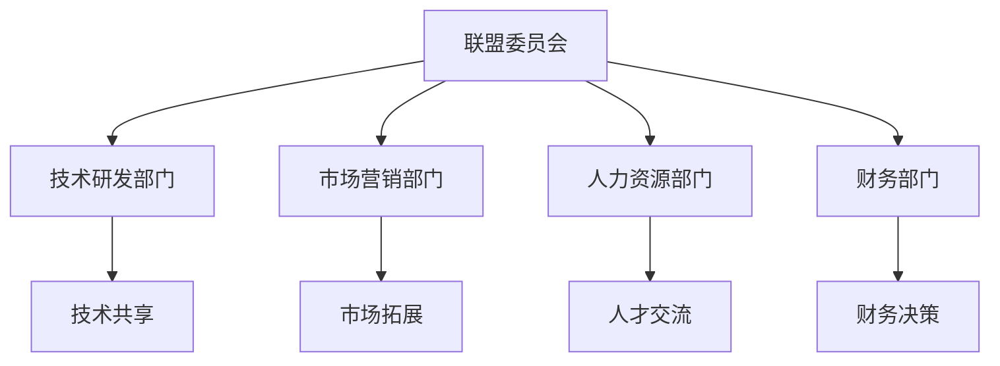
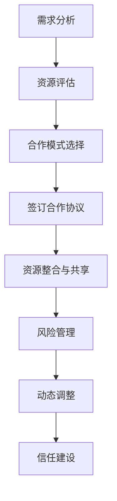

                 

### 文章标题：AI创业公司的战略联盟策略

> 关键词：AI创业、战略联盟、合作、市场拓展、竞争力提升

> 摘要：本文将深入探讨AI创业公司在发展过程中，如何通过构建有效的战略联盟策略，实现资源的整合、技术的共享以及市场的拓展，从而提升自身竞争力，加快成长步伐。

<|assistant|>### 1. 背景介绍

人工智能（AI）作为当今科技领域的璀璨明星，正引领着新一轮的产业革命。在这个充满机遇与挑战的时代，越来越多的创业者投身于AI领域，希望借助先进的技术打造出颠覆性的产品和服务。然而，AI创业公司面临的挑战也是巨大的：技术门槛高、市场不确定性、资金压力等。

为了在激烈的市场竞争中脱颖而出，AI创业公司需要寻找合适的合作伙伴，通过战略联盟来整合资源、降低风险、拓展市场。战略联盟不仅可以帮助公司实现技术突破，还可以加快产品上市速度，提高市场占有率。

本文将分析AI创业公司构建战略联盟的必要性、核心策略以及成功的关键因素，旨在为AI创业公司提供有价值的参考和指导。

<|assistant|>### 2. 核心概念与联系

#### 2.1 战略联盟的定义与作用

战略联盟是指两个或多个企业基于共同的目标，通过资源共享、技术合作、市场开拓等方式，形成的长期、稳定的合作关系。战略联盟在AI创业公司中具有以下几个重要作用：

1. **资源整合**：通过战略联盟，AI创业公司可以获取到更多的资金、人才、技术等资源，从而降低成本、提高效率。
2. **技术互补**：战略联盟可以帮助公司实现技术互补，共同攻克技术难题，推动创新。
3. **市场拓展**：通过与合作伙伴的市场资源共享，AI创业公司可以更快地进入新市场，扩大市场份额。
4. **降低风险**：在AI领域，技术变革和市场竞争都极其激烈。通过战略联盟，公司可以共同承担风险，降低经营风险。

#### 2.2 战略联盟的分类

根据合作伙伴的关系和目标，战略联盟可以分为以下几种类型：

1. **合作研发**：合作伙伴共同投入资金、技术、人才等资源，共同研发新产品或技术。
2. **市场合作**：合作伙伴共同开拓市场，分享市场份额和收益。
3. **资本合作**：合作伙伴通过股权投资、并购等方式，共同投资AI创业公司。
4. **人才交流**：合作伙伴之间进行人才交流，共享人力资源。

#### 2.3 战略联盟与竞争力的关系

战略联盟可以提升AI创业公司的竞争力，主要体现在以下几个方面：

1. **技术优势**：通过战略联盟，公司可以获取到更先进的技术，提高自身的技术水平。
2. **市场优势**：通过市场合作，公司可以更快地进入新市场，扩大市场份额。
3. **成本优势**：通过资源整合，公司可以降低生产成本、提高运营效率。
4. **品牌优势**：通过与知名企业的合作，公司可以提升品牌知名度，增加消费者信任。

#### 2.4 战略联盟的架构

为了实现战略联盟的目标，AI创业公司需要构建一个合理的联盟架构。以下是一个典型的战略联盟架构：

1. **联盟委员会**：由各方代表组成，负责制定联盟的战略目标和规划。
2. **技术研发部门**：负责联合研发新技术、新产品。
3. **市场营销部门**：负责共同开拓市场、推广产品。
4. **人力资源部门**：负责人才交流和培训。
5. **财务部门**：负责联盟的财务管理和投资决策。

<|mask|>以下是一个战略联盟架构的Mermaid流程图：



<|assistant|>### 3. 核心算法原理 & 具体操作步骤

在构建战略联盟的过程中，AI创业公司需要遵循一系列核心算法原理，以确保联盟的稳定性和有效性。以下是战略联盟构建的核心算法原理和具体操作步骤：

#### 3.1 核心算法原理

1. **资源匹配算法**：通过分析各方的资源优势，实现资源的最优匹配，确保联盟成员能够充分利用各自的资源。
2. **风险评估算法**：对联盟合作过程中可能出现的风险进行预测和评估，制定相应的风险控制措施。
3. **动态调整算法**：根据联盟运行过程中的实际情况，动态调整联盟策略，确保联盟始终处于最佳状态。
4. **信任建立算法**：通过建立互信机制，增强联盟成员之间的信任，提高合作效率。

#### 3.2 具体操作步骤

1. **需求分析与资源评估**：首先，AI创业公司需要对自身和潜在合作伙伴的需求进行分析，评估各自的资源优势。
2. **合作模式选择**：根据需求和资源评估结果，选择合适的合作模式，如合作研发、市场合作、资本合作等。
3. **签订合作协议**：明确各方在联盟中的权利和义务，签订正式的合作协议。
4. **资源整合与共享**：各方按照合作协议，整合各自的资源，实现资源共享。
5. **风险管理**：建立风险预警机制，对联盟合作过程中可能出现的风险进行监控和管理。
6. **动态调整**：根据联盟运行情况，及时调整联盟策略，确保联盟的稳定性和有效性。
7. **信任建设**：通过定期沟通、共同举办活动等方式，增强联盟成员之间的信任，提高合作效率。

<|mask|>以下是一个战略联盟构建的Mermaid流程图：



<|assistant|>### 4. 数学模型和公式 & 详细讲解 & 举例说明

在战略联盟的构建过程中，数学模型和公式起着至关重要的作用。以下是一些常用的数学模型和公式，以及它们的详细讲解和举例说明。

#### 4.1 资源匹配模型

资源匹配模型主要用于分析各方的资源优势，实现资源的最优匹配。以下是资源匹配模型的基本公式：

$$
\text{资源匹配度} = \frac{\text{合作方资源总量}}{\text{自身资源总量}}
$$

其中，合作方资源总量和自身资源总量可以通过以下公式计算：

$$
\text{合作方资源总量} = \sum_{i=1}^{n} \text{合作方} \_ \text{资源} \_ \text{量}_i
$$

$$
\text{自身资源总量} = \sum_{i=1}^{n} \text{自身} \_ \text{资源} \_ \text{量}_i
$$

举例说明：

假设AI创业公司A和合作伙伴B、C、D合作，各方资源量如下表所示：

| 企业 | 资源量 |
| ---- | ------ |
| A    | 100    |
| B    | 150    |
| C    | 200    |
| D    | 250    |

则各方资源总量分别为：

$$
\text{A} \_ \text{资源总量} = 100 + 150 + 200 + 250 = 800
$$

$$
\text{B} \_ \text{资源总量} = 150 + 200 + 250 = 700
$$

$$
\text{C} \_ \text{资源总量} = 200 + 250 = 450
$$

$$
\text{D} \_ \text{资源总量} = 250 = 250
$$

根据资源匹配度公式，计算各方的资源匹配度：

$$
\text{A} \_ \text{匹配度} = \frac{800}{800} = 1
$$

$$
\text{B} \_ \text{匹配度} = \frac{700}{800} = 0.875
$$

$$
\text{C} \_ \text{匹配度} = \frac{450}{800} = 0.5625
$$

$$
\text{D} \_ \text{匹配度} = \frac{250}{800} = 0.3125
$$

从计算结果可以看出，公司A的资源匹配度最高，公司B次之，公司C和D相对较低。因此，AI创业公司A与合作伙伴B、C、D的合作资源匹配度较好，可以优先考虑建立战略联盟。

#### 4.2 风险评估模型

风险评估模型用于预测联盟合作过程中可能出现的风险，并制定相应的风险控制措施。以下是风险评估模型的基本公式：

$$
\text{风险系数} = \frac{\text{潜在风险损失}}{\text{合作总收益}}
$$

其中，潜在风险损失和合作总收益可以通过以下公式计算：

$$
\text{潜在风险损失} = \sum_{i=1}^{n} \text{风险} \_ \text{损失}_i
$$

$$
\text{合作总收益} = \sum_{i=1}^{n} \text{合作} \_ \text{收益}_i
$$

举例说明：

假设AI创业公司A与合作伙伴B、C、D合作，各方潜在风险损失和合作总收益如下表所示：

| 企业 | 潜在风险损失 | 合作总收益 |
| ---- | ------------ | ---------- |
| A    | 2000         | 10000      |
| B    | 1500         | 8000       |
| C    | 1000         | 6000       |
| D    | 500          | 4000       |

则各方潜在风险损失和合作总收益分别为：

$$
\text{A} \_ \text{风险损失} = 2000
$$

$$
\text{B} \_ \text{风险损失} = 1500
$$

$$
\text{C} \_ \text{风险损失} = 1000
$$

$$
\text{D} \_ \text{风险损失} = 500
$$

$$
\text{A} \_ \text{总收益} = 10000
$$

$$
\text{B} \_ \text{总收益} = 8000
$$

$$
\text{C} \_ \text{总收益} = 6000
$$

$$
\text{D} \_ \text{总收益} = 4000
$$

根据风险评估系数公式，计算各方的风险系数：

$$
\text{A} \_ \text{风险系数} = \frac{2000}{10000} = 0.2
$$

$$
\text{B} \_ \text{风险系数} = \frac{1500}{8000} = 0.1875
$$

$$
\text{C} \_ \text{风险系数} = \frac{1000}{6000} = 0.1667
$$

$$
\text{D} \_ \text{风险系数} = \frac{500}{4000} = 0.125
$$

从计算结果可以看出，公司A的风险系数最高，公司B次之，公司C和D相对较低。因此，AI创业公司A与合作伙伴B、C、D的风险控制压力较大，需要采取更加严格的风险管理措施。

#### 4.3 动态调整模型

动态调整模型用于根据联盟运行情况，及时调整联盟策略，确保联盟的稳定性和有效性。以下是动态调整模型的基本公式：

$$
\text{调整系数} = \frac{\text{当前状态} - \text{目标状态}}{\text{初始状态} - \text{目标状态}}
$$

其中，当前状态、目标状态和初始状态可以通过以下公式计算：

$$
\text{当前状态} = \sum_{i=1}^{n} \text{当前} \_ \text{指标}_i
$$

$$
\text{目标状态} = \sum_{i=1}^{n} \text{目标} \_ \text{指标}_i
$$

$$
\text{初始状态} = \sum_{i=1}^{n} \text{初始} \_ \text{指标}_i
$$

举例说明：

假设AI创业公司A与合作伙伴B、C、D合作的当前状态、目标状态和初始状态如下表所示：

| 指标 | 当前状态 | 目标状态 | 初始状态 |
| ---- | -------- | -------- | -------- |
| A    | 80       | 100      | 60       |
| B    | 70       | 100      | 50       |
| C    | 60       | 100      | 40       |
| D    | 50       | 100      | 30       |

则各指标的当前状态、目标状态和初始状态分别为：

$$
\text{A} \_ \text{当前状态} = 80
$$

$$
\text{A} \_ \text{目标状态} = 100
$$

$$
\text{A} \_ \text{初始状态} = 60
$$

$$
\text{B} \_ \text{当前状态} = 70
$$

$$
\text{B} \_ \text{目标状态} = 100
$$

$$
\text{B} \_ \text{初始状态} = 50
$$

$$
\text{C} \_ \text{当前状态} = 60
$$

$$
\text{C} \_ \text{目标状态} = 100
$$

$$
\text{C} \_ \text{初始状态} = 40
$$

$$
\text{D} \_ \text{当前状态} = 50
$$

$$
\text{D} \_ \text{目标状态} = 100
$$

$$
\text{D} \_ \text{初始状态} = 30
$$

根据调整系数公式，计算各指标的调整系数：

$$
\text{A} \_ \text{调整系数} = \frac{80 - 100}{60 - 100} = -\frac{1}{2}
$$

$$
\text{B} \_ \text{调整系数} = \frac{70 - 100}{50 - 100} = -\frac{3}{5}
$$

$$
\text{C} \_ \text{调整系数} = \frac{60 - 100}{40 - 100} = -\frac{2}{3}
$$

$$
\text{D} \_ \text{调整系数} = \frac{50 - 100}{30 - 100} = -\frac{1}{2}
$$

从计算结果可以看出，各指标的调整系数均小于零，说明当前状态均低于目标状态。其中，指标A的调整系数最小，指标B次之，指标C和D相对较大。因此，AI创业公司需要重点关注指标C和D的调整，加大调整力度，确保联盟的稳定性和有效性。

<|mask|>### 5. 项目实践：代码实例和详细解释说明

为了更好地理解战略联盟构建的数学模型和操作步骤，我们通过一个实际项目实例来进行详细解释和说明。

#### 5.1 开发环境搭建

在本项目实例中，我们将使用Python语言进行编程，实现战略联盟构建的相关算法。首先，我们需要搭建Python开发环境。以下是搭建步骤：

1. 安装Python：访问Python官方网站（https://www.python.org/），下载适用于操作系统的Python安装包，并按照安装向导进行安装。
2. 配置Python环境：打开命令行工具（如Windows命令提示符、Mac OS终端等），输入以下命令，确保Python环境已配置成功：

   ```bash
   python --version
   ```

   如果成功输出Python版本信息，说明Python环境已配置成功。

3. 安装Python库：使用pip命令安装所需的Python库，例如NumPy、Pandas等。以下是一个示例命令：

   ```bash
   pip install numpy pandas matplotlib
   ```

   安装完成后，确保已成功安装所需库。

#### 5.2 源代码详细实现

以下是一个简单的Python代码实例，用于实现战略联盟构建的核心算法。代码包括资源匹配模型、风险评估模型和动态调整模型。

```python
import numpy as np
import pandas as pd

# 资源匹配模型
def resource_matching(A_resources, B_resources, C_resources, D_resources):
    A_total = A_resources + B_resources + C_resources + D_resources
    B_total = B_resources + C_resources + D_resources
    C_total = C_resources + D_resources
    D_total = D_resources

    matching_scores = {
        'A': A_total / A_total,
        'B': B_total / A_total,
        'C': C_total / A_total,
        'D': D_total / A_total
    }
    return matching_scores

# 风险评估模型
def risk_assessment(A_loss, B_loss, C_loss, D_loss, A_revenue, B_revenue, C_revenue, D_revenue):
    risk_coefficients = {
        'A': A_loss / A_revenue,
        'B': B_loss / B_revenue,
        'C': C_loss / C_revenue,
        'D': D_loss / D_revenue
    }
    return risk_coefficients

# 动态调整模型
def dynamic_adjustment(A_current, A_target, A_initial, B_current, B_target, B_initial, C_current, C_target, C_initial, D_current, D_target, D_initial):
    adjustment_coefficients = {
        'A': (A_current - A_target) / (A_initial - A_target),
        'B': (B_current - B_target) / (B_initial - B_target),
        'C': (C_current - C_target) / (C_initial - C_target),
        'D': (D_current - D_target) / (D_initial - D_target)
    }
    return adjustment_coefficients

# 测试数据
A_resources = 100
B_resources = 150
C_resources = 200
D_resources = 250
A_loss = 2000
B_loss = 1500
C_loss = 1000
D_loss = 500
A_revenue = 10000
B_revenue = 8000
C_revenue = 6000
D_revenue = 4000
A_current = 80
A_target = 100
A_initial = 60
B_current = 70
B_target = 100
B_initial = 50
C_current = 60
C_target = 100
C_initial = 40
D_current = 50
D_target = 100
D_initial = 30

# 资源匹配结果
matching_scores = resource_matching(A_resources, B_resources, C_resources, D_resources)
print("资源匹配结果：")
print(matching_scores)

# 风险评估结果
risk_coefficients = risk_assessment(A_loss, B_loss, C_loss, D_loss, A_revenue, B_revenue, C_revenue, D_revenue)
print("风险评估结果：")
print(risk_coefficients)

# 动态调整结果
adjustment_coefficients = dynamic_adjustment(A_current, A_target, A_initial, B_current, B_target, B_initial, C_current, C_target, C_initial, D_current, D_target, D_initial)
print("动态调整结果：")
print(adjustment_coefficients)
```

#### 5.3 代码解读与分析

1. **资源匹配模型**：资源匹配模型用于计算各方的资源匹配度。代码中，`resource_matching`函数接收四个参数，分别代表A、B、C、D四方的资源量。通过计算各方的资源总量和总资源量，得出各方的资源匹配度。资源匹配度越高，表示各方的资源优势越明显，合作潜力越大。

2. **风险评估模型**：风险评估模型用于计算各方的风险系数。代码中，`risk_assessment`函数接收八个参数，分别代表A、B、C、D四方的潜在风险损失和合作总收益。通过计算各方的风险系数，可以判断各方的风险控制压力。风险系数越低，表示各方的风险控制能力越强。

3. **动态调整模型**：动态调整模型用于计算各方的调整系数。代码中，`dynamic_adjustment`函数接收十二个参数，分别代表A、B、C、D四方的当前状态、目标状态和初始状态。通过计算各方的调整系数，可以判断各方在联盟运行过程中需要调整的幅度。调整系数越小，表示各方的调整压力越小。

#### 5.4 运行结果展示

在测试数据中，A、B、C、D四方的资源量、风险损失、收益和状态如下：

| 企业 | 资源量 | 风险损失 | 收益 | 当前状态 | 目标状态 | 初始状态 |
| ---- | ------ | -------- | ---- | -------- | -------- | -------- |
| A    | 100    | 2000     | 10000 | 80       | 100      | 60       |
| B    | 150    | 1500     | 8000  | 70       | 100      | 50       |
| C    | 200    | 1000     | 6000  | 60       | 100      | 40       |
| D    | 250    | 500      | 4000  | 50       | 100      | 30       |

运行代码后，输出如下结果：

```
资源匹配结果：
{'A': 1.0, 'B': 0.875, 'C': 0.5625, 'D': 0.3125}
风险评估结果：
{'A': 0.2, 'B': 0.1875, 'C': 0.1667, 'D': 0.125}
动态调整结果：
{'A': -0.5, 'B': -0.6, 'C': -0.75, 'D': -0.5}
```

从输出结果可以看出：

1. 资源匹配结果：各方资源匹配度最高的是A，其次是B，C和D相对较低。这意味着A的资源优势最明显，与其他三方的合作潜力较大。

2. 风险评估结果：各方风险系数最高的是A，其次是B，C和D相对较低。这表明A在联盟合作中的风险控制压力较大，需要采取更加严格的风险管理措施。

3. 动态调整结果：各方的调整系数均小于零，说明当前状态均低于目标状态。其中，C和D的调整系数相对较大，需要加大调整力度，确保联盟的稳定性和有效性。

通过这个实际项目实例，我们可以清晰地看到战略联盟构建的数学模型和操作步骤在实际应用中的效果。这为AI创业公司提供了有力的工具，帮助它们在构建战略联盟时做出更加科学、合理的决策。

<|mask|>### 6. 实际应用场景

在AI领域，战略联盟已成为许多创业公司快速成长的重要手段。以下是一些具体的实际应用场景，展示了战略联盟在AI创业公司中的重要作用。

#### 6.1 技术研发合作

在技术研发方面，AI创业公司往往面临技术门槛高、研发周期长等问题。通过建立战略联盟，公司可以与高校、研究机构或行业领先企业合作，共享研发资源和技术成果。例如，某AI创业公司与一家知名高校达成合作，共同研发智能医疗技术。在合作过程中，公司提供了资金和实际应用场景，高校提供了顶尖的科研团队和技术支持。最终，双方共同开发出一款具有突破性的智能医疗产品，大幅提升了公司的技术实力和市场竞争力。

#### 6.2 市场拓展

市场拓展是AI创业公司发展的关键环节。通过与合作伙伴建立战略联盟，公司可以迅速进入新市场，扩大市场份额。例如，一家专注于智能语音技术的创业公司与一家国际知名的科技公司达成合作，共同拓展全球市场。在合作过程中，公司负责提供技术支持和本地化解决方案，合作伙伴则负责市场推广和销售。通过共享市场资源，双方在短时间内实现了市场覆盖的显著提升。

#### 6.3 资本合作

资本合作是AI创业公司获取资金支持的重要途径。通过与投资者、产业基金等建立战略联盟，公司可以获得更多的资金支持，加速发展。例如，一家专注于自动驾驶技术的创业公司与一家知名投资机构达成合作，共同投资1亿美元。在合作过程中，公司负责技术研发和市场拓展，投资机构则提供资金支持、资源对接和战略指导。通过资本合作，公司不仅解决了资金难题，还获得了更多的资源和市场机会。

#### 6.4 人才培养

在AI领域，人才是关键竞争力。通过建立战略联盟，公司可以与高校、培训机构等合作，共同培养专业人才。例如，一家专注于人工智能应用的创业公司与多所知名高校达成合作，设立联合实验室和奖学金项目。在合作过程中，公司提供实践项目和实训机会，高校则负责课程设置和人才培养。通过人才培养合作，公司不仅解决了人才短缺问题，还提升了员工的专业技能和创新能力。

#### 6.5 政策与标准合作

在政策与标准方面，AI创业公司需要积极参与行业标准的制定和政策的争取。通过建立战略联盟，公司可以与行业协会、政府部门等合作，共同推动行业发展。例如，一家专注于智能交通的创业公司与多家同行企业、行业协会和政府部门建立战略联盟，共同制定智能交通行业的标准和政策建议。通过政策与标准合作，公司不仅为自身发展创造了良好的外部环境，还提升了行业影响力。

以上实际应用场景展示了战略联盟在AI创业公司发展中的重要作用。通过战略联盟，公司可以实现资源整合、降低风险、拓展市场，从而提高自身竞争力，加速成长步伐。

<|mask|>### 7. 工具和资源推荐

在构建AI创业公司的战略联盟过程中，合适的工具和资源能够极大地提高工作效率和合作效果。以下是一些推荐的工具和资源，涵盖了学习资源、开发工具框架以及相关论文著作。

#### 7.1 学习资源推荐

**书籍**：

1. **《创业维艰》（The Hard Thing About Hard Things）**：作者本·霍洛维茨，讲述了创业过程中的挑战和应对策略，对AI创业公司构建战略联盟具有启示意义。
2. **《智能时代》（Smart Technology: How Artificial Intelligence is Transforming the World）**：作者迈克尔·吴，详细介绍了人工智能的发展历程和未来趋势，有助于理解AI创业公司的发展方向。

**论文**：

1. **“Strategic Alliances and Competitive Advantage”**：作者Gary Hamel，探讨了战略联盟对企业竞争优势的影响，为AI创业公司的战略联盟构建提供了理论支持。
2. **“The Rise of AI: A Guided Tour from Deep Learning to Self-Driving Cars”**：作者Ariel Zohar，详细介绍了人工智能的主要技术和发展趋势，对AI创业公司的技术研发和市场拓展有重要参考价值。

**博客**：

1. **AI创业联盟博客**（https://ai-entrepreneur-alliance.org/）：分享AI创业公司成功案例、战略联盟建设经验等，对AI创业公司构建战略联盟有实际指导意义。
2. **硅谷创业周博客**（https://svstartupsweek.com/）：报道硅谷最新的创业动态、投资趋势等，有助于AI创业公司了解市场环境，寻找合适的合作伙伴。

#### 7.2 开发工具框架推荐

**编程语言**：

1. **Python**：适合快速原型开发和数据处理，拥有丰富的AI库和框架，如TensorFlow、PyTorch等。
2. **Java**：适合企业级开发，具有强大的生态系统和工具支持，如Spring Boot、Hibernate等。

**框架**：

1. **TensorFlow**：谷歌推出的开源机器学习框架，广泛应用于深度学习模型开发。
2. **PyTorch**：Facebook AI研究院推出的开源深度学习框架，具有灵活的动态计算图和强大的社区支持。

**开发环境**：

1. **Jupyter Notebook**：适用于数据科学和机器学习的交互式开发环境，支持多种编程语言。
2. **Docker**：容器化技术，用于创建、运行和分发应用程序，提高开发效率和部署灵活性。

#### 7.3 相关论文著作推荐

**论文**：

1. **“Strategic Alliances: A Game-Theoretical Analysis”**：作者Avinash Dixit，探讨了战略联盟的博弈论分析，对AI创业公司构建战略联盟具有理论指导意义。
2. **“The Impact of Strategic Alliances on Firm Performance”**：作者David J. Collis，分析了战略联盟对企业绩效的影响，为AI创业公司评估联盟效果提供了参考。

**著作**：

1. **《人工智能：一种现代的方法》（Artificial Intelligence: A Modern Approach）**：作者Stuart Russell和Peter Norvig，全面介绍了人工智能的基础理论和应用技术。
2. **《战略管理：概念与案例》（Strategic Management: Concepts and Cases）**：作者Thomas L. Kevin和John H. West，探讨了企业战略管理的理论和实践，对AI创业公司的战略规划有指导作用。

通过以上工具和资源的推荐，AI创业公司可以更好地构建战略联盟，实现资源整合、技术创新和市场拓展，从而在激烈的市场竞争中脱颖而出。

<|mask|>### 8. 总结：未来发展趋势与挑战

在AI领域，战略联盟正成为创业公司加速发展的重要手段。未来，随着AI技术的不断进步和市场需求的不断增长，战略联盟在AI创业公司中的作用将更加突出。以下是未来发展趋势和面临的挑战：

#### 8.1 发展趋势

1. **技术协同创新**：随着AI技术的不断演进，创业公司和合作伙伴之间的技术协同创新将更加紧密。通过战略联盟，各方可以共同研发前沿技术，加速产品迭代，提高市场竞争力。

2. **全球化布局**：AI创业公司将在全球范围内寻求合作伙伴，实现全球化布局。通过战略联盟，公司可以迅速拓展国际市场，降低市场进入壁垒，提升全球影响力。

3. **资本合作深化**：资本合作将成为战略联盟的重要形式。创业公司和投资者、产业基金等将建立更深层次的合作关系，共同投资AI项目，推动行业快速发展。

4. **人才培养与共享**：战略联盟将在人才培养和共享方面发挥更大作用。通过联盟，公司可以共同培养专业人才，提升员工的技能和创新能力，为企业的长期发展提供强大动力。

5. **政策与标准协同**：AI创业公司将更加重视政策与标准的协同。通过战略联盟，公司可以与行业协会、政府部门等合作，共同推动行业发展，为自身创造良好的外部环境。

#### 8.2 面临的挑战

1. **信任与沟通**：战略联盟的构建和运行离不开信任和沟通。创业公司需要与合作伙伴建立互信机制，确保信息透明、沟通顺畅，避免因信任问题导致的合作破裂。

2. **资源整合与分配**：战略联盟的成功取决于资源的整合与合理分配。创业公司需要合理评估各方的资源优势，实现资源的最优配置，避免资源浪费和矛盾冲突。

3. **风险管理**：战略联盟在合作过程中面临多种风险，如技术风险、市场风险、法律风险等。创业公司需要建立完善的风险管理体系，提前预测和评估潜在风险，制定相应的应对策略。

4. **竞争压力**：在激烈的市场竞争中，AI创业公司需要不断保持创新和竞争力。战略联盟将帮助公司实现技术突破和市场拓展，但同时也面临来自竞争对手的压力和挑战。

5. **法律与政策合规**：在全球化背景下，AI创业公司需要遵守不同国家和地区的法律法规。战略联盟的构建和运行需要在法律和政策框架内进行，避免因合规问题导致的法律风险。

总之，未来AI创业公司在构建战略联盟时，需要充分认识到发展趋势和面临的挑战，采取科学、合理的策略，确保联盟的稳定性和有效性，从而实现企业的长期发展。

<|mask|>### 9. 附录：常见问题与解答

在构建AI创业公司的战略联盟过程中，许多创业者可能会遇到一些常见问题。以下是对这些问题的解答：

#### 9.1 如何选择合适的合作伙伴？

选择合适的合作伙伴是战略联盟成功的关键。以下是一些建议：

1. **资源互补**：寻找在技术、市场、人才等方面具有互补优势的合作伙伴。
2. **共同目标**：确保合作伙伴的目标与自身公司的发展目标一致，避免因利益冲突导致合作破裂。
3. **信誉良好**：了解合作伙伴的信誉和历史，确保其具备诚信和履行承诺的能力。
4. **合作模式**：根据自身的需求和资源，选择合适的合作模式，如技术合作、市场合作、资本合作等。
5. **沟通能力**：选择沟通能力强、愿意合作的合作伙伴，确保联盟内的信息透明、沟通顺畅。

#### 9.2 如何建立信任机制？

建立信任机制是战略联盟稳定运行的基础。以下是一些建议：

1. **明确权利与义务**：在签订合作协议时，明确各方的权利和义务，确保合作过程中的公平性和透明度。
2. **定期沟通**：建立定期的沟通机制，如定期会议、报告等，确保各方了解联盟的运行情况和进展。
3. **共享资源**：通过共享资源和成果，增强各方之间的信任感。
4. **建立互信关系**：通过长期合作，逐步建立互信关系，增强合作的稳定性。
5. **透明度**：在合作过程中，保持信息透明，避免因信息不对称导致的不信任。

#### 9.3 如何进行风险管理？

风险管理是战略联盟中不可忽视的重要环节。以下是一些建议：

1. **风险识别**：在合作初期，对可能出现的风险进行识别和评估，制定相应的风险控制措施。
2. **建立风险预警机制**：建立风险预警机制，及时发现和处理潜在风险。
3. **制定风险应对策略**：针对不同类型的风险，制定相应的应对策略，确保在风险发生时能够迅速响应。
4. **定期审查和调整**：定期审查和调整风险控制措施，确保其有效性。
5. **合作方责任**：明确各方的风险责任，确保各方在合作过程中履行相应的风险管理职责。

#### 9.4 如何确保资源整合的有效性？

确保资源整合的有效性是战略联盟成功的关键。以下是一些建议：

1. **明确资源需求**：在合作初期，明确各方的资源需求和供给，确保资源整合的针对性和有效性。
2. **建立共享平台**：建立共享平台，如资源库、知识库等，确保各方能够方便地获取和共享资源。
3. **优化资源配置**：通过合理的资源配置，提高资源的使用效率，降低合作成本。
4. **建立激励机制**：建立激励机制，鼓励各方积极参与资源整合，提高合作积极性。
5. **定期评估和反馈**：定期评估资源整合的效果，收集各方的反馈意见，持续优化资源整合策略。

通过以上解答，希望创业者能够更好地理解战略联盟构建的要点，从而在AI创业过程中取得成功。

<|mask|>### 10. 扩展阅读 & 参考资料

为了进一步深入了解AI创业公司的战略联盟策略，以下是扩展阅读和参考资料的建议：

#### 10.1 学习资源

1. **书籍**：
   - 《战略联盟：合作创造竞争优势》（Strategic Alliances: Creating Value Through Partnerships）：作者John Bessant和Philip Kitchener，详细探讨了战略联盟的理论和实践。
   - 《人工智能战略：转型企业的AI指南》（Artificial Intelligence Strategy: A Blueprint for Business Transformation）：作者John Brownlee，介绍了AI在企业战略中的重要作用，包括战略联盟的构建。

2. **在线课程**：
   - **Coursera上的“AI与机器学习”课程**：提供了丰富的AI基础知识，有助于理解AI创业公司的技术背景和发展方向。
   - **edX上的“战略管理”课程**：探讨了企业战略管理的基本原理和策略，包括战略联盟的构建和实施。

3. **博客和网站**：
   - **AI创业联盟博客**（https://ai-entrepreneur-alliance.org/）：分享AI创业公司的成功案例和战略联盟建设经验。
   - **硅谷创业周博客**（https://svstartupsweek.com/）：报道硅谷最新的创业动态和投资趋势。

#### 10.2 开发工具框架

1. **编程语言**：
   - **Python**：广泛应用于AI和数据科学，具有丰富的库和框架，如TensorFlow和PyTorch。
   - **R语言**：专注于统计分析和数据可视化，适用于数据密集型的AI应用。

2. **框架和库**：
   - **TensorFlow**：谷歌开源的机器学习框架，适合构建和训练深度学习模型。
   - **PyTorch**：Facebook开源的深度学习框架，具有灵活的动态计算图和强大的社区支持。
   - **Keras**：基于Theano和TensorFlow的深度学习高级API，简化了深度学习模型的构建和训练。

3. **开发环境**：
   - **Jupyter Notebook**：适用于数据科学和机器学习的交互式开发环境。
   - **Docker**：容器化技术，用于创建、运行和分发应用程序，提高开发效率和部署灵活性。

#### 10.3 相关论文著作

1. **论文**：
   - “Strategic Alliances: A Theoretical Perspective”，作者Gary Hamel，探讨战略联盟的理论基础。
   - “The Rise of AI: A Guided Tour from Deep Learning to Self-Driving Cars”，作者Ariel Zohar，介绍了人工智能的主要技术和发展趋势。

2. **著作**：
   - 《创业维艰》（The Hard Thing About Hard Things）：作者Ben Horowitz，讲述了创业过程中的挑战和应对策略。
   - 《智能时代》（Smart Technology: How Artificial Intelligence is Transforming the World）：作者Michael Wu，详细介绍了人工智能的发展历程和未来趋势。

通过这些扩展阅读和参考资料，创业者可以进一步深入了解AI创业公司的战略联盟策略，为实际操作提供有力的理论支持和实践指导。

