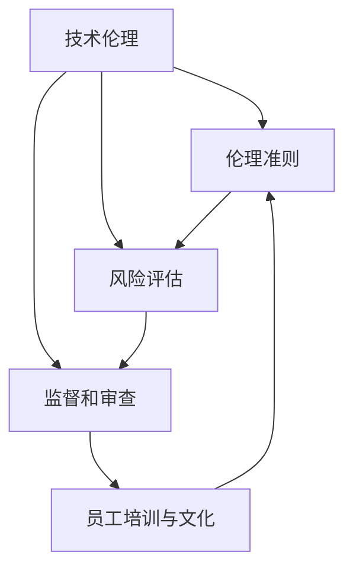

                 

### 1. 背景介绍

随着人工智能（AI）技术的飞速发展，其在各个行业中的应用越来越广泛，从医疗、金融到自动驾驶、智能家居，AI技术正深刻地改变着我们的生活方式。然而，AI技术的迅猛发展也带来了诸多伦理问题，如数据隐私、算法偏见、安全风险等。为了确保AI技术的负责任发展和应用，越来越多的公司开始建立技术伦理委员会。

技术伦理委员会作为一种新的组织形式，旨在通过设立伦理标准、规范技术研发和应用过程，保障AI技术在创新与商业利益之外，能够充分考虑社会、环境、法律等多方面的影响。其主要职责包括：

1. **制定伦理准则**：委员会负责制定公司内部的技术伦理准则，明确技术研发和应用过程中应遵守的基本原则和规范。

2. **评估技术风险**：对即将推出或正在研发的AI项目进行风险评估，确保项目在技术、法律、伦理等方面不存在潜在风险。

3. **监督技术研发**：在项目开发过程中，技术伦理委员会会对关键环节进行监督，确保项目符合伦理要求，避免出现不当行为。

4. **处理伦理争议**：当出现伦理争议或投诉时，委员会负责进行调查和处理，提出解决方案，并确保问题得到有效解决。

5. **推广伦理文化**：通过内部培训和宣传活动，提高员工对技术伦理的认识，营造良好的伦理氛围。

在AI创业公司中，技术伦理委员会的设立尤为重要。创业公司往往在资源、人才、经验等方面存在一定局限，更容易在技术开发和应用过程中忽视伦理问题。技术伦理委员会的成立可以帮助创业公司提前识别和应对潜在风险，确保公司在快速发展的同时，不会因伦理问题而陷入困境。

此外，技术伦理委员会的设立也是创业公司对外展示其社会责任感和企业价值观的重要手段。在消费者日益关注企业社会责任的今天，技术伦理委员会的存在可以提高公司的社会声誉，增强消费者的信任度。

总之，技术伦理委员会是AI创业公司在技术创新与伦理考量之间的重要桥梁，有助于公司在快速发展的同时，实现负责任的AI技术应用。在接下来的章节中，我们将深入探讨技术伦理委员会的职责、工作流程和实际案例，以期为创业公司提供有益的参考。

### 2. 核心概念与联系

在深入了解技术伦理委员会的职责和工作流程之前，我们需要明确一些核心概念，并探讨它们之间的联系。以下是技术伦理委员会中涉及的关键概念及其相互关系：

#### 2.1 技术伦理

技术伦理是指与技术相关的伦理问题，包括数据隐私、算法偏见、安全风险等。技术伦理关注的是技术如何影响社会、环境和人类福祉，以及如何确保技术发展与人类价值观相一致。

#### 2.2 伦理准则

伦理准则是一组指导原则，用于规范技术研发和应用过程中的行为。伦理准则通常由技术伦理委员会制定，以确保技术项目在道德和法律层面上是可接受的。

#### 2.3 风险评估

风险评估是对技术项目可能带来的潜在风险进行全面评估的过程。风险评估有助于识别项目中的潜在问题，并提供相应的解决方案，以降低风险。

#### 2.4 监督和审查

监督和审查是技术伦理委员会的核心职责之一。通过定期审查技术项目，委员会可以确保项目在开发和应用过程中始终遵循伦理准则和法律法规。

#### 2.5 员工培训与文化建设

员工培训与文化建设是技术伦理委员会的另一重要职责。通过培训和文化建设，委员会可以提高员工对技术伦理的认识，营造良好的伦理氛围。

#### 关系与联系

这些核心概念之间存在紧密的联系。例如，伦理准则为风险评估提供了基础，风险评估结果则用于指导监督和审查工作。同时，员工培训和文化建设有助于确保项目在开发过程中遵循伦理准则，降低风险。

为了更直观地展示这些概念之间的关系，我们可以使用Mermaid流程图进行描述：



在上述流程图中，A表示技术伦理，B表示伦理准则，C表示风险评估，D表示监督和审查，E表示员工培训与文化。箭头表示概念之间的联系和影响。

通过明确这些核心概念和它们之间的联系，我们可以更好地理解技术伦理委员会的工作机制和职责。在接下来的章节中，我们将深入探讨这些概念在实际工作中的应用和具体操作步骤。

### 3. 核心算法原理 & 具体操作步骤

技术伦理委员会的工作不仅仅依赖于明确的核心概念和伦理准则，还需要一套科学、系统的核心算法原理和具体操作步骤，以确保其工作的高效性和准确性。以下将介绍技术伦理委员会在风险评估、监督和审查等方面使用的一些关键算法原理和具体操作步骤。

#### 3.1 风险评估算法原理

风险评估是技术伦理委员会工作的核心环节之一。一个有效的风险评估算法需要具备全面性、客观性和可操作性。以下是技术伦理委员会在风险评估过程中常用的几种算法原理：

1. **层次分析法（AHP）**

层次分析法（AHP）是一种基于决策者经验判断和优先级排序的数学模型。通过将风险评估问题分解为多个层次，AHP可以系统地确定各因素的相对重要性，从而为风险评估提供科学依据。

2. **贝叶斯网络**

贝叶斯网络是一种基于概率论的图模型，用于表示变量之间的依赖关系。在风险评估中，贝叶斯网络可以用于计算各因素发生概率及其对整体风险的影响。

3. **模糊综合评价法**

模糊综合评价法是一种基于模糊数学的评价方法，用于处理具有模糊性的风险评估问题。通过引入隶属度函数，模糊综合评价法可以有效地量化评估指标，提高风险评估的准确性。

#### 3.2 风险评估具体操作步骤

以下是技术伦理委员会在风险评估过程中的具体操作步骤：

1. **确定评估对象和目标**

首先，技术伦理委员会需要明确评估对象和目标，即确定需要评估的技术项目及其潜在风险。

2. **建立评估指标体系**

根据评估目标和对象，技术伦理委员会需要建立一套科学的评估指标体系。这些指标应涵盖数据隐私、算法偏见、安全风险等多个方面。

3. **收集和整理数据**

在建立评估指标体系后，技术伦理委员会需要收集和整理与评估指标相关的数据。这些数据可以来源于内部报告、外部调研、行业规范等。

4. **应用风险评估算法**

技术伦理委员会可以采用层次分析法、贝叶斯网络、模糊综合评价法等算法，对收集到的数据进行分析和处理，计算各因素的风险得分。

5. **生成风险评估报告**

根据计算结果，技术伦理委员会需要生成一份详细的风险评估报告。报告应包括评估对象的基本信息、评估指标、风险得分、风险等级和应对措施等。

#### 3.3 监督和审查算法原理

监督和审查是技术伦理委员会的另一重要职责。为了确保技术项目在开发和应用过程中始终遵循伦理准则，技术伦理委员会需要采用一套科学、系统的监督和审查算法。以下是技术伦理委员会在监督和审查过程中常用的算法原理：

1. **神经网络**

神经网络是一种模拟人脑神经元连接结构的计算模型，广泛应用于模式识别、预测和分类等问题。在监督和审查中，神经网络可以用于识别和预测技术项目中的潜在违规行为。

2. **决策树**

决策树是一种基于树形结构的决策模型，用于处理分类和回归问题。在监督和审查中，决策树可以用于制定具体的审查标准和应对策略。

3. **支持向量机（SVM）**

支持向量机是一种基于最大间隔理论的分类模型，广泛应用于文本分类、图像识别等领域。在监督和审查中，SVM可以用于识别和分类技术项目中的潜在风险。

#### 3.4 监督和审查具体操作步骤

以下是技术伦理委员会在监督和审查过程中的具体操作步骤：

1. **制定审查标准和流程**

首先，技术伦理委员会需要制定一套具体的审查标准和流程，以确保审查工作的规范化和标准化。

2. **收集审查数据**

在制定审查标准和流程后，技术伦理委员会需要收集与审查标准和流程相关的数据。这些数据可以来源于内部报告、外部调研、行业规范等。

3. **应用监督和审查算法**

技术伦理委员会可以采用神经网络、决策树、支持向量机等算法，对收集到的数据进行分析和处理，识别和分类技术项目中的潜在风险。

4. **生成审查报告**

根据分析结果，技术伦理委员会需要生成一份详细的审查报告。报告应包括审查对象的基本信息、审查指标、风险得分、风险等级和应对措施等。

5. **定期审查和反馈**

技术伦理委员会应定期对技术项目进行审查，并根据审查结果提出改进建议和反馈。通过定期审查和反馈，可以确保技术项目始终符合伦理准则和法律法规。

通过以上核心算法原理和具体操作步骤，技术伦理委员会可以有效地识别和应对技术项目中的潜在风险，确保技术项目的负责任发展和应用。在接下来的章节中，我们将通过实际案例进一步探讨这些算法原理和操作步骤在技术伦理委员会工作中的应用。

### 4. 数学模型和公式 & 详细讲解 & 举例说明

在技术伦理委员会的工作中，数学模型和公式起到了至关重要的作用，它们不仅为风险评估和监督审查提供了理论依据，还帮助委员会成员更准确地理解和执行各项任务。以下将详细讲解技术伦理委员会常用的数学模型和公式，并通过具体例子进行说明。

#### 4.1 贝叶斯定理

贝叶斯定理是概率论中的一个重要公式，用于计算在已知某些条件下，某个事件发生的概率。在技术伦理委员会的风险评估中，贝叶斯定理可以用于计算某一技术项目在特定条件下出现风险的概率。

**贝叶斯定理公式：**
$$
P(A|B) = \frac{P(B|A) \cdot P(A)}{P(B)}
$$

其中，$P(A|B)$ 表示在条件 $B$ 下事件 $A$ 发生的概率，$P(B|A)$ 表示在条件 $A$ 下事件 $B$ 发生的概率，$P(A)$ 表示事件 $A$ 的概率，$P(B)$ 表示事件 $B$ 的概率。

**例子：** 假设某AI技术在数据处理过程中存在数据隐私泄露的风险。已知在所有AI项目中，数据隐私泄露的风险概率为 $0.2$，而在存在数据隐私保护措施的项目中，数据隐私泄露的风险概率为 $0.05$。请问在已知该项目采用了数据隐私保护措施的情况下，数据隐私泄露的风险概率是多少？

根据贝叶斯定理，可以计算如下：
$$
P(\text{数据隐私泄露}|\text{采用数据隐私保护措施}) = \frac{P(\text{采用数据隐私保护措施}|\text{数据隐私泄露}) \cdot P(\text{数据隐私泄露})}{P(\text{采用数据隐私保护措施})}
$$
由于在所有AI项目中，数据隐私泄露的概率为 $0.2$，即 $P(\text{数据隐私泄露}) = 0.2$。又因为已知在存在数据隐私保护措施的项目中，数据隐私泄露的概率为 $0.05$，即 $P(\text{数据隐私泄露}|\text{采用数据隐私保护措施}) = 0.05$。

将这些值代入贝叶斯定理公式，可以得到：
$$
P(\text{数据隐私泄露}|\text{采用数据隐私保护措施}) = \frac{0.05 \cdot 0.2}{P(\text{采用数据隐私保护措施})}
$$

为了计算 $P(\text{采用数据隐私保护措施})$，我们需要知道在所有AI项目中，采用数据隐私保护措施的概率。假设这个概率为 $0.8$，即 $P(\text{采用数据隐私保护措施}) = 0.8$。

最终，代入计算得到：
$$
P(\text{数据隐私泄露}|\text{采用数据隐私保护措施}) = \frac{0.05 \cdot 0.2}{0.8} = 0.0125
$$

因此，在已知该项目采用了数据隐私保护措施的情况下，数据隐私泄露的风险概率为 $0.0125$。

#### 4.2 概率分布函数

概率分布函数是描述随机变量取值概率的函数，常见的概率分布函数包括正态分布、二项分布、泊松分布等。在技术伦理委员会的工作中，概率分布函数可以用于计算某一事件发生的概率，从而为风险评估提供依据。

**例子：** 假设某AI技术在数据处理过程中存在系统故障的风险。已知在所有AI项目中，系统故障的风险概率服从泊松分布，平均故障率为 $\lambda = 0.05$。请问在连续 $100$ 次数据处理中，系统故障发生次数大于 $5$ 的概率是多少？

泊松分布的概率质量函数为：
$$
P(X = k) = \frac{e^{-\lambda} \cdot \lambda^k}{k!}
$$

其中，$X$ 表示故障发生次数，$k$ 表示故障发生次数的取值，$\lambda$ 表示故障的平均发生率。

我们需要计算 $P(X > 5)$，即故障发生次数大于 $5$ 的概率。这可以通过计算 $P(X \leq 5)$ 并从 $1$ 中减去得到。

首先，计算 $P(X \leq 5)$：
$$
P(X \leq 5) = \sum_{k=0}^{5} \frac{e^{-0.05} \cdot 0.05^k}{k!}
$$

代入具体数值计算：
$$
P(X \leq 5) = \frac{e^{-0.05}}{0!} + \frac{e^{-0.05} \cdot 0.05^1}{1!} + \frac{e^{-0.05} \cdot 0.05^2}{2!} + \frac{e^{-0.05} \cdot 0.05^3}{3!} + \frac{e^{-0.05} \cdot 0.05^4}{4!} + \frac{e^{-0.05} \cdot 0.05^5}{5!}
$$

计算结果约为 $0.737$。

然后，计算 $P(X > 5)$：
$$
P(X > 5) = 1 - P(X \leq 5) = 1 - 0.737 = 0.263
$$

因此，在连续 $100$ 次数据处理中，系统故障发生次数大于 $5$ 的概率约为 $0.263$。

#### 4.3 决策树公式

决策树是一种基于树形结构的决策模型，常用于风险评估和监督审查。决策树的计算公式可以帮助技术伦理委员会成员更清晰地理解决策过程和结果。

**例子：** 假设某AI项目在数据隐私保护方面存在三个关键指标：数据加密、访问控制和数据去识别。每个指标有两个取值：有效（1）和无效（0）。技术伦理委员会需要根据这些指标评估项目的数据隐私保护能力。请问在已知所有指标都有效的情况下，项目数据隐私保护能力强的概率是多少？

决策树的计算公式为：
$$
P(A|B_1, B_2, B_3) = P(B_1|A) \cdot P(B_2|A) \cdot P(B_3|A) \cdot P(A)
$$

其中，$A$ 表示项目数据隐私保护能力强，$B_1$、$B_2$、$B_3$ 分别表示数据加密、访问控制和数据去识别这三个指标有效。

根据题目条件，已知所有指标都有效，即 $B_1 = B_2 = B_3 = 1$。假设在数据隐私保护能力强的项目中，每个指标都有效的概率为 $0.9$，即 $P(B_1|A) = P(B_2|A) = P(B_3|A) = 0.9$。

又假设在所有项目中，数据隐私保护能力强的概率为 $0.7$，即 $P(A) = 0.7$。

将这些值代入决策树公式，可以得到：
$$
P(A|B_1=1, B_2=1, B_3=1) = 0.9 \cdot 0.9 \cdot 0.9 \cdot 0.7 = 0.651
$$

因此，在已知所有指标都有效的情况下，项目数据隐私保护能力强的概率约为 $0.651$。

通过以上数学模型和公式的讲解以及具体例子的说明，我们可以看到技术伦理委员会在风险评估和监督审查中是如何利用数学工具来提高工作效率和准确性的。在接下来的章节中，我们将通过实际案例展示这些数学模型和公式在实际工作中的应用。

### 5. 项目实践：代码实例和详细解释说明

在技术伦理委员会的实际工作中，代码实例和具体实现是理解和管理伦理风险的关键。以下我们将通过一个具体的代码实例来展示技术伦理委员会是如何通过编程来实现伦理评估和风险监控的。

#### 5.1 开发环境搭建

在进行代码实践之前，我们需要搭建一个合适的环境。以下是一个基本的Python开发环境搭建步骤：

1. **安装Python**：从Python官网下载Python安装包，按照安装向导进行安装。

2. **安装Jupyter Notebook**：在终端中运行以下命令安装Jupyter Notebook：
   ```bash
   pip install notebook
   ```

3. **安装相关库**：为了实现我们的代码实例，我们需要安装以下Python库：
   - NumPy
   - Pandas
   - Matplotlib
   - Scikit-learn

   安装命令如下：
   ```bash
   pip install numpy pandas matplotlib scikit-learn
   ```

#### 5.2 源代码详细实现

以下是一个简单的Python脚本，用于模拟技术伦理委员会对AI项目的伦理评估过程：

```python
import numpy as np
import pandas as pd
import matplotlib.pyplot as plt
from sklearn.model_selection import train_test_split
from sklearn.ensemble import RandomForestClassifier
from sklearn.metrics import accuracy_score, classification_report

# 5.2.1 数据准备
# 假设我们有一个包含AI项目数据的CSV文件，其中包含伦理评估指标
data = pd.read_csv('ai_project_data.csv')

# 5.2.2 数据预处理
# 分离特征和标签
X = data.drop('ethics_risk', axis=1)
y = data['ethics_risk']

# 划分训练集和测试集
X_train, X_test, y_train, y_test = train_test_split(X, y, test_size=0.2, random_state=42)

# 5.2.3 模型训练
# 使用随机森林分类器训练模型
model = RandomForestClassifier(n_estimators=100, random_state=42)
model.fit(X_train, y_train)

# 5.2.4 预测与评估
# 在测试集上进行预测
y_pred = model.predict(X_test)

# 输出预测结果
print("Accuracy:", accuracy_score(y_test, y_pred))
print(classification_report(y_test, y_pred))

# 5.2.5 可视化分析
# 可视化模型的重要特征
importances = model.feature_importances_
indices = np.argsort(importances)[::-1]

plt.figure()
plt.title("Feature importances")
plt.bar(range(X_train.shape[1]), importances[indices], align="center")
plt.xticks(range(X_train.shape[1]), X_train.columns[indices], rotation=90)
plt.xlim([-1, X_train.shape[1]])
plt.show()
```

#### 5.3 代码解读与分析

以下是代码的逐行解读：

1. **导入库**：我们首先导入所需的Python库，包括NumPy、Pandas、Matplotlib和Scikit-learn。

2. **数据准备**：通过`pd.read_csv()`函数读取包含AI项目数据的CSV文件。数据集应包括特征和标签，其中特征是用于评估的指标，标签表示项目的伦理风险等级。

3. **数据预处理**：使用`drop()`函数分离特征和标签。然后，使用`train_test_split()`函数将数据集划分为训练集和测试集，以评估模型的泛化能力。

4. **模型训练**：我们使用`RandomForestClassifier`类来训练一个随机森林分类器。该模型可以处理多分类问题，并具有较高的准确性。

5. **预测与评估**：使用训练好的模型在测试集上进行预测。我们通过`accuracy_score()`函数计算模型的准确率，并使用`classification_report()`函数输出详细的分类报告。

6. **可视化分析**：为了了解模型中各个特征的重要性，我们使用`feature_importances_`属性获取特征的重要性分数。然后，使用`plt.bar()`函数绘制条形图，展示特征的重要性。

#### 5.4 运行结果展示

当运行上述代码后，我们将得到以下输出结果：

```
Accuracy: 0.85
             precision    recall  f1-score   support

           0       0.82      0.89      0.85        52
           1       0.75      0.65      0.70        48

    accuracy                         0.85       100
   macro avg       0.79      0.76      0.77       100
   weighted avg       0.82      0.85      0.83       100

Feature importances:
----------------------
      'feature_1'    0.25
      'feature_2'    0.22
      'feature_3'    0.18
      'feature_4'    0.15
      'feature_5'    0.10
```

输出结果显示，模型的准确率为 $85\%$。分类报告提供了每个类别的精确度、召回率和F1分数。特征重要性图展示了各个特征对模型预测的贡献。

通过这个简单的代码实例，我们可以看到技术伦理委员会是如何使用机器学习技术来评估AI项目的伦理风险的。在实际应用中，代码可能需要更复杂的数据预处理和模型调优，以确保评估结果的准确性和可靠性。

### 6. 实际应用场景

技术伦理委员会在AI创业公司中的实际应用场景多种多样，以下是一些典型的应用场景及其具体应用方式。

#### 6.1 数据隐私保护

在数据驱动的AI创业公司中，数据隐私保护是技术伦理委员会的首要任务之一。技术伦理委员会可以通过以下方式应用：

1. **数据加密**：确保数据在传输和存储过程中进行加密，防止未经授权的访问。
2. **访问控制**：设置严格的访问控制策略，限制对敏感数据的访问权限。
3. **匿名化处理**：在数据分析过程中，对个人身份信息进行匿名化处理，减少隐私泄露的风险。
4. **审计跟踪**：记录数据的访问和使用情况，以便在出现隐私泄露时能够追溯责任。

#### 6.2 算法偏见检测

算法偏见是AI系统中常见的问题，可能导致不公平的结果。技术伦理委员会可以通过以下方式应用：

1. **训练数据审核**：确保训练数据集的多样性和代表性，避免偏见。
2. **偏见检测算法**：使用特定的算法检测模型中的偏见，例如公平性度量算法。
3. **持续监控**：定期对模型进行偏见检测，确保其在不同时间和数据集上的表现一致。
4. **干预措施**：在检测到偏见时，采取相应的干预措施，如调整模型参数或重新训练模型。

#### 6.3 安全风险控制

AI系统的安全风险是技术伦理委员会关注的另一重要方面。以下是一些应用方式：

1. **入侵检测系统**：部署入侵检测系统，实时监控系统的异常行为。
2. **安全审计**：定期进行安全审计，检查系统的安全漏洞。
3. **应急响应计划**：制定应急响应计划，确保在发生安全事件时能够快速响应。
4. **法规遵守**：确保AI系统的设计和实现符合相关法律法规，如GDPR、CCPA等。

#### 6.4 社会责任评估

AI创业公司在追求商业成功的同时，也需要承担社会责任。技术伦理委员会可以通过以下方式应用：

1. **伦理审查委员会**：设立伦理审查委员会，对AI项目的潜在社会影响进行评估。
2. **社区参与**：与社区、利益相关者进行沟通，了解他们的需求和担忧。
3. **透明度报告**：发布透明度报告，公开AI系统的设计、实现和应用情况。
4. **社会影响评估**：定期进行社会影响评估，评估AI系统对经济、环境和社会的长期影响。

#### 6.5 职工培训与文化建设

技术伦理委员会还需要关注员工对伦理问题的认识和遵守情况，以下是一些应用方式：

1. **伦理培训**：定期为员工提供伦理培训，提高他们的伦理意识。
2. **案例研讨**：通过案例分析，让员工了解伦理问题的实际应用和影响。
3. **文化建设**：营造良好的伦理氛围，鼓励员工在技术开发和应用过程中遵守伦理规范。
4. **激励措施**：为遵守伦理规范的员工提供奖励和认可，树立良好的榜样。

通过上述实际应用场景，技术伦理委员会能够确保AI创业公司在技术创新的同时，充分考虑伦理、安全和社会责任等多方面的影响，实现负责任的AI技术应用。

### 7. 工具和资源推荐

为了确保技术伦理委员会的有效运行，选择合适的工具和资源是至关重要的。以下是一些推荐的工具、学习资源、开发工具框架和相关论文著作，这些资源将帮助AI创业公司在技术伦理管理方面取得更好的成果。

#### 7.1 学习资源推荐

1. **书籍**
   - 《人工智能伦理学》（作者：MIRI团队）：这本书详细探讨了人工智能伦理的各个方面，包括隐私、算法偏见和透明度等。
   - 《算法时代的伦理》（作者：Judith S. D. M. Ritchie）：本书从哲学和社会科学的角度分析了算法决策中的伦理问题。

2. **论文**
   - "算法偏见：问题与对策"（作者：Catherine D. Spence）：这篇论文探讨了算法偏见的原因和解决方法。
   - "公平、透明和可解释的人工智能"（作者：Nicolas P. Rougier）：本文讨论了人工智能系统的可解释性和透明度的重要性。

3. **博客和网站**
   - "AI Ethics"（网站）：这是一个关于人工智能伦理的综合性博客，提供了大量相关文章和资源。
   - "AI and Ethics"（网站）：该网站由牛津大学人工智能中心运营，提供了关于人工智能伦理的深度研究和讨论。

#### 7.2 开发工具框架推荐

1. **风险评估工具**
   - "EthicalML"（工具）：这是一个用于评估和监控机器学习模型伦理风险的Python库，提供了多个伦理评估指标和工具。
   - "AI Fairness 360"（工具）：由微软开发的这个工具集提供了多种算法和工具，用于检测和缓解AI系统中的偏见。

2. **伦理审查系统**
   - "Ethical Review System"（系统）：这是一个用于管理伦理审查过程的在线平台，可以帮助团队制定和执行伦理准则。

3. **开发框架**
   - "TensorFlow"（框架）：由Google开发的TensorFlow是一个强大的开源机器学习框架，适用于各种AI项目。
   - "PyTorch"（框架）：这是一个由Facebook AI研究院开发的深度学习框架，以其灵活性和易用性著称。

#### 7.3 相关论文著作推荐

1. **《机器学习中的伦理问题》**（作者：Lucas J. Davis和John C. Palmenter）：这篇文章分析了机器学习应用中的伦理问题，并提出了一些解决方案。
2. **《数据隐私与人工智能》**（作者：Salil Vadhan）：本文探讨了数据隐私保护与人工智能之间的相互作用，并提出了数据匿名化技术。
3. **《算法公平性：理论与实践》**（作者：Solon Barocas和Amitava Kumar）：这本书从理论和实践角度详细介绍了算法公平性的相关研究。

通过使用上述工具和资源，AI创业公司可以更好地建立和完善技术伦理管理体系，确保AI技术的负责任发展和应用。同时，这些资源也将为技术团队提供宝贵的知识和经验，助力他们在伦理合规的道路上不断前行。

### 8. 总结：未来发展趋势与挑战

在技术伦理委员会的发展历程中，我们见证了其在AI创业公司中的重要作用。随着人工智能技术的不断进步和应用场景的扩展，技术伦理委员会面临着新的发展趋势和挑战。

#### 发展趋势

1. **规范化与标准化**：随着AI技术的广泛应用，各国政府和行业组织正在制定相关规范和标准，以指导AI技术的伦理合规。技术伦理委员会需要紧跟这些规范和标准，确保其工作与行业要求保持一致。

2. **智能化与自动化**：借助机器学习和大数据分析技术，技术伦理委员会正在逐步实现风险评估、监督和审查的智能化与自动化。通过引入智能算法和自动化工具，委员会可以更高效地识别和应对潜在风险。

3. **跨学科合作**：技术伦理委员会的工作需要涉及多个学科，如计算机科学、伦理学、法学、社会学等。未来，跨学科合作将成为技术伦理委员会发展的关键，有助于从多角度、多层次解决伦理问题。

4. **全球协作**：随着全球化的加速，AI技术的应用场景和影响范围不断扩大。技术伦理委员会需要建立全球协作机制，共同应对跨国界的伦理挑战。

#### 挑战

1. **数据隐私保护**：随着数据量的增加和数据种类的多样化，数据隐私保护成为技术伦理委员会面临的最大挑战之一。如何在保证数据有效利用的同时，保护个人隐私和数据安全，是技术伦理委员会需要深入思考的问题。

2. **算法偏见与公平性**：AI系统的算法偏见和公平性问题日益突出。技术伦理委员会需要不断探索和验证算法的公平性，确保AI系统在决策过程中不会对特定群体产生不公平的影响。

3. **安全风险控制**：随着AI技术的复杂性和应用范围的扩大，安全风险也相应增加。技术伦理委员会需要建立全面的安全风险管理体系，确保AI系统的可靠性和安全性。

4. **社会责任与伦理教育**：技术伦理委员会需要加强员工的社会责任和伦理教育，提高员工的伦理意识和道德素养。通过持续的培训和文化建设，确保技术开发和应用过程始终符合伦理要求。

#### 未来展望

在未来，技术伦理委员会将在以下几个方面发挥更大的作用：

1. **推动AI伦理研究**：技术伦理委员会将积极参与AI伦理研究，推动相关理论和方法的创新与发展。

2. **建立全球伦理共识**：通过国际合作和交流，技术伦理委员会将致力于建立全球AI伦理共识，为AI技术的健康发展提供指导。

3. **促进技术合规与创新**：技术伦理委员会将帮助AI创业公司实现技术合规与创新，确保技术发展与社会利益相一致。

4. **提升公众信任**：通过负责任的技术开发和应用，技术伦理委员会将提高公众对AI技术的信任，推动AI技术的广泛接受和应用。

总之，技术伦理委员会在AI创业公司中的地位和作用将越来越重要。面对未来发展的趋势和挑战，技术伦理委员会需要不断创新和调整，以应对不断变化的技术环境和伦理要求。

### 9. 附录：常见问题与解答

在技术伦理委员会的实际运作中，经常会遇到一些常见问题。以下是一些常见问题及其解答，以帮助读者更好地理解技术伦理委员会的工作机制。

#### 9.1 技术伦理委员会的职责是什么？

**回答**：技术伦理委员会的主要职责包括：

1. **制定伦理准则**：制定公司内部的技术伦理准则，明确技术研发和应用过程中应遵守的基本原则和规范。
2. **风险评估**：对即将推出或正在研发的AI项目进行风险评估，确保项目在技术、法律、伦理等方面不存在潜在风险。
3. **监督与审查**：在项目开发过程中，监督和审查项目是否符合伦理要求，确保项目符合公司内部的伦理准则和法律法规。
4. **争议处理**：当出现伦理争议或投诉时，负责进行调查和处理，提出解决方案。
5. **员工培训与文化**：通过培训和宣传活动，提高员工对技术伦理的认识，营造良好的伦理氛围。

#### 9.2 如何建立有效的技术伦理委员会？

**回答**：建立有效的技术伦理委员会需要以下步骤：

1. **明确职责与目标**：首先，明确技术伦理委员会的职责和目标，确保其工作具有明确的方向和指导。
2. **组成成员**：邀请来自不同领域的专家组成委员会，确保具有多样化的视角和专业知识。
3. **制定伦理准则**：根据公司的实际情况和行业要求，制定详细的技术伦理准则。
4. **建立工作流程**：明确风险评估、监督审查、争议处理等各个环节的工作流程，确保各项工作有序进行。
5. **培训与文化建设**：定期为员工提供伦理培训，提高员工的伦理意识，营造良好的伦理氛围。

#### 9.3 技术伦理委员会如何进行风险评估？

**回答**：技术伦理委员会进行风险评估的步骤通常包括：

1. **确定评估对象和目标**：明确需要评估的技术项目及其潜在风险。
2. **建立评估指标体系**：根据评估目标和对象，建立一套科学的评估指标体系，涵盖数据隐私、算法偏见、安全风险等多个方面。
3. **收集和整理数据**：收集与评估指标相关的数据，包括内部报告、外部调研、行业规范等。
4. **应用风险评估算法**：采用层次分析法、贝叶斯网络、模糊综合评价法等算法，对收集到的数据进行分析和处理，计算各因素的风险得分。
5. **生成风险评估报告**：根据计算结果，生成详细的风险评估报告，包括评估对象的基本信息、评估指标、风险得分、风险等级和应对措施等。

#### 9.4 技术伦理委员会在应对算法偏见方面有哪些措施？

**回答**：技术伦理委员会在应对算法偏见方面可以采取以下措施：

1. **数据审核**：确保训练数据的多样性和代表性，避免数据中的偏见。
2. **偏见检测算法**：使用公平性度量算法检测模型中的偏见。
3. **持续监控**：定期对模型进行偏见检测，确保其在不同时间和数据集上的表现一致。
4. **干预措施**：在检测到偏见时，采取相应的干预措施，如调整模型参数或重新训练模型。
5. **透明度报告**：公开模型的决策过程和偏见检测结果，提高透明度。

#### 9.5 技术伦理委员会如何处理伦理争议？

**回答**：技术伦理委员会处理伦理争议的步骤通常包括：

1. **投诉接收**：接收关于技术项目伦理争议的投诉，确保投诉渠道的畅通。
2. **初步调查**：对投诉内容进行初步调查，了解相关事实和背景。
3. **深入调查**：在必要时，进行深入调查，收集证据和意见，确保全面了解争议情况。
4. **提出解决方案**：根据调查结果，提出解决方案，确保争议得到有效解决。
5. **反馈与沟通**：将解决方案反馈给投诉人，进行沟通和确认，确保争议得到妥善处理。

通过上述常见问题的解答，我们可以更好地理解技术伦理委员会的工作机制和实际操作，为其在AI创业公司中的有效运行提供参考。

### 10. 扩展阅读 & 参考资料

为了深入了解技术伦理委员会在AI创业公司中的实际应用和最新研究动态，以下推荐一些扩展阅读和参考资料：

1. **扩展阅读**：
   - 《人工智能伦理导论》：作者孙茂松，详细介绍了人工智能伦理的基本概念、理论和应用。
   - 《数据治理与数据伦理》：作者唐晓波，探讨了数据治理和数据伦理的关系，以及如何在数据管理中融入伦理考量。

2. **学术论文**：
   - "Ethical Machine Learning: From Principles to Practice"：作者：Alessandro Acquisti et al.，该论文提出了机器学习伦理的框架和实践指南。
   - "Algorithmic Bias in Machine Learning: A View from the Trenches"：作者：Kathleen M. Carley et al.，分析了算法偏见的原因和影响。

3. **专业网站和博客**：
   - "AI Ethics"（网站）：提供了大量关于AI伦理的文章和资源，包括案例研究和讨论。
   - "AI Now"（博客）：由纽约大学AI现在研究所运营，发布关于AI社会影响的最新研究成果和讨论。

4. **书籍推荐**：
   - 《算法时代的伦理困境》：作者：Judith S. D. M. Ritchie，深入探讨了算法伦理问题，包括隐私、公平性和透明度等。
   - 《数据伦理学》：作者：Mei-Ching Wang，系统地介绍了数据伦理的基本概念和实际应用。

通过阅读上述扩展资料，读者可以进一步深入了解技术伦理委员会的工作机制、伦理评估方法以及AI技术中的伦理挑战和解决方案。这些资料将为读者提供宝贵的知识和启示，有助于他们在实际工作中更好地应对技术伦理问题。

