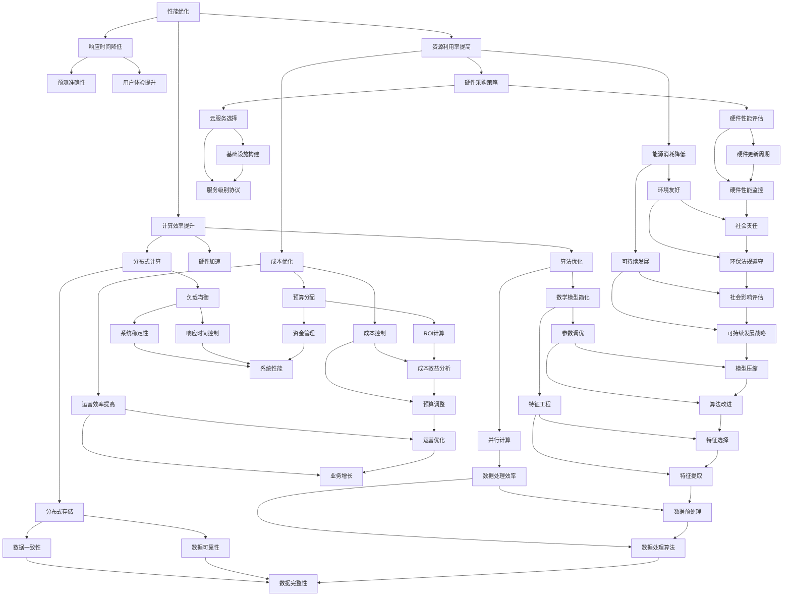

                 

### 背景介绍

随着人工智能（AI）技术的快速发展，越来越多的创业公司涌入这一领域，希望能够通过AI技术实现业务创新和突破。然而，AI创业公司面临着诸多技术挑战，其中技术架构的优化尤为重要。技术架构的优化不仅能够提升系统的性能、降低成本，还能保障系统的安全性，从而为企业的长期发展奠定坚实基础。

首先，性能优化是AI创业公司面临的首要问题。随着模型复杂度和数据量的不断增长，系统性能逐渐成为制约业务发展的瓶颈。如何在有限的资源条件下，提高模型训练和推理的速度，是每个AI创业公司都必须面对的挑战。

其次，成本优化也是AI创业公司需要重点关注的问题。AI技术依赖于大量的计算资源和存储资源，高昂的硬件成本和运营费用常常让初创公司感到压力。因此，如何在保证系统性能的同时，降低整体成本，成为AI创业公司亟需解决的问题。

最后，安全性优化也是不可忽视的一环。AI技术在带来巨大商业价值的同时，也可能带来数据泄露、系统攻击等安全风险。如何构建一个安全可靠的AI技术架构，确保企业的数据和系统安全，是每个AI创业公司必须认真思考的问题。

本文将围绕性能优化、成本优化和安全性优化这三个核心方面，详细探讨AI创业公司在技术架构优化过程中的实践方法和策略。通过本文的探讨，希望能够为AI创业公司提供一些有益的参考和启示。

### 核心概念与联系

为了深入理解AI创业公司在技术架构优化过程中的关键概念和联系，我们需要先明确以下几个核心概念：性能优化、成本优化和安全性优化。接下来，我们将通过一个Mermaid流程图来展示这些概念之间的联系。



#### Mermaid流程图详细解释：

- **性能优化**：主要包括计算效率提升、响应时间降低和资源利用率提高。这些目标是通过对算法、硬件和分布式计算等方面的优化来实现的。

- **计算效率提升**：这涉及算法优化、硬件加速和分布式计算。算法优化包括数学模型简化、参数调优和特征工程；硬件加速则依赖于GPU、TPU等硬件加速器；分布式计算通过将任务分散到多个节点上，以提高计算效率。

- **响应时间降低**：优化目标包括预测准确性、用户体验提升和数据处理效率。这些目标需要通过算法改进、特征提取和预处理等技术手段来实现。

- **资源利用率提高**：这涉及到成本优化、硬件采购策略和能源消耗降低。通过预算分配和成本控制，企业可以更合理地利用资源，提高运营效率。

- **成本优化**：成本优化不仅包括预算分配和成本控制，还涉及到硬件采购策略和能源消耗降低。企业需要通过合理的预算分配和成本控制，来实现降低成本的目标。

- **安全性优化**：安全性优化包括数据一致性、数据可靠性、系统稳定性和响应时间控制。这些目标需要通过构建安全可靠的系统架构、实施数据安全和网络安全措施来实现。

通过这个Mermaid流程图，我们可以清晰地看到性能优化、成本优化和安全性优化之间的相互联系。性能优化和成本优化互为补充，共同提高系统的整体效率；而安全性优化则是保障系统的稳定运行，确保企业能够持续发展的重要保障。

### 核心算法原理 & 具体操作步骤

在AI创业公司的技术架构优化过程中，核心算法原理的深入理解和具体操作步骤的精准实施是至关重要的。以下将详细介绍几个在性能优化、成本优化和安全性优化中常用的核心算法原理，并给出具体的操作步骤。

#### 1. 算法优化

**原理**：算法优化主要通过改进数学模型、参数调优和特征工程来实现。在数学模型简化方面，可以利用正则化技术减少模型参数数量，提高计算效率。参数调优则通过不断调整模型的超参数，如学习率、批量大小等，以找到最佳设置。特征工程则涉及提取和选择与目标任务高度相关的特征，提高模型的预测准确性。

**操作步骤**：

1. **数学模型简化**：通过正则化技术（如L1和L2正则化）简化模型，减少参数数量。
    $$ \text{Cost Function} = \frac{1}{2m}\sum_{i=1}^{m}(h_\theta(x^{(i)}) - y^{(i)})^2 + \lambda \sum_{j=1}^{n}\theta_j^2 $$
    其中，$m$ 为样本数量，$n$ 为特征数量，$\lambda$ 为正则化参数。

2. **参数调优**：使用网格搜索（Grid Search）或随机搜索（Random Search）方法，在不同参数组合中寻找最优解。
    ```python
    from sklearn.model_selection import GridSearchCV
    parameters = {'learning_rate': [0.01, 0.1], 'batch_size': [32, 64]}
    grid_search = GridSearchCV(estimator=model, param_grid=parameters, cv=5)
    grid_search.fit(X_train, y_train)
    best_params = grid_search.best_params_
    ```

3. **特征工程**：使用特征选择（如基于信息的特征选择、基于模型的特征选择）和特征提取（如主成分分析PCA、自动编码器）技术，提高特征质量。
    ```python
    from sklearn.decomposition import PCA
    pca = PCA(n_components=10)
    X_reduced = pca.fit_transform(X)
    ```

#### 2. 硬件加速

**原理**：硬件加速利用GPU、TPU等专用硬件来提高计算速度。这些硬件通过并行处理和特殊的算法优化，能够显著提升模型的训练和推理速度。

**操作步骤**：

1. **GPU加速**：将计算任务迁移到GPU上，使用CUDA或cuDNN库进行加速。
    ```python
    import tensorflow as tf
    device = tf.config.list_physical_devices('GPU')[0]
    tf.config.experimental.set_memory_growth(device, True)
    with tf.device(device):
        model = build_model()
    ```

2. **TPU加速**：利用TPU进行加速，通过Google的TensorFlow版本进行优化。
    ```python
    import tensorflow as tf
    tpu_address = "project:region:job"
    resolver = tf.distribute.cluster_resolver.TPUClusterResolver(tpu_address)
    tf.config.experimental_connect_to_cluster(resolver)
    tf.tpu.experimental.initialize_tpu_system(resolver)
    strategy = tf.distribute.experimental.TPUStrategy(resolver)
    with strategy.scope():
        model = build_model()
    ```

#### 3. 分布式计算

**原理**：分布式计算通过将任务分散到多个节点上，利用并行处理技术提高计算效率。分布式计算框架如Spark、Hadoop等能够管理大量节点的资源，实现高效的数据处理。

**操作步骤**：

1. **分布式数据处理**：使用Spark进行分布式数据处理。
    ```python
    from pyspark.sql import SparkSession
    spark = SparkSession.builder.appName("AI_Optimization").getOrCreate()
    df = spark.read.csv("data.csv", header=True)
    df = df.select([col for col in df.columns if col not in ["id"]])
    ```

2. **分布式模型训练**：使用Horovod进行分布式深度学习训练。
    ```python
    import horovod.tensorflow as hvd
    hvd.init()
    strategy = tf.distribute.MirroredStrategy()
    with strategy.scope():
        model = build_model()
        optimizer = hvd.DistributedOptimizer(optimizer)
    ```

通过上述核心算法原理和具体操作步骤的介绍，我们可以看到，AI创业公司在技术架构优化过程中，需要灵活运用各种算法和技术手段，以达到性能提升、成本降低和安全性保障的目标。这些方法和策略不仅需要理论上的理解，更需要实际操作中的经验积累，从而在实践中不断优化和完善。

### 数学模型和公式 & 详细讲解 & 举例说明

在AI创业公司的技术架构优化过程中，数学模型和公式扮演着至关重要的角色。通过精确的数学建模，我们可以量化系统的性能、成本和安全性的表现，从而为优化策略提供科学的依据。以下我们将详细讲解几个常用的数学模型和公式，并举例说明它们在实际应用中的具体用法。

#### 1. 性能优化模型

**响应时间模型**：
响应时间（Response Time，R）是指系统从接收到请求到完成任务并返回结果所需要的时间。一个简单的响应时间模型可以表示为：
$$ R = \frac{1}{\lambda} + \frac{W}{\mu} $$
其中，$\lambda$ 表示请求到达率（Requests per Unit Time），$\mu$ 表示服务速度（Services per Unit Time），$W$ 表示等待时间。

**例1**：假设某AI系统每天接收1000个请求，处理每个请求的平均时间为1秒。请计算系统的平均响应时间。
解：由于请求到达率为每天1000个，即每小时约为$\frac{1000}{3600}$个请求，因此：
$$ \lambda = \frac{1000}{3600} = 0.2778 \text{ requests/second} $$
处理每个请求的平均时间为1秒，即服务速度$\mu = 1 \text{ request/second}$。代入公式得：
$$ R = \frac{1}{0.2778} + \frac{0}{1} \approx 3.59 \text{ seconds} $$

**吞吐量模型**：
吞吐量（Throughput，T）是指单位时间内系统可以处理的请求数量。吞吐量可以表示为：
$$ T = \frac{\lambda}{\lambda + W} $$
当$\lambda$ 远大于$W$ 时，吞吐量近似为：
$$ T \approx \frac{\lambda}{\lambda} = 1 $$

**例2**：在例1中，假设请求到达率为每小时1000个，每个请求的处理时间为1秒，请计算系统的吞吐量。
解：请求到达率$\lambda = \frac{1000}{3600} \approx 0.2778 \text{ requests/second}$，代入公式得：
$$ T = \frac{0.2778}{0.2778 + 0} \approx 1 \text{ request/second} $$

#### 2. 成本优化模型

**成本函数**：
成本函数（Cost Function，C）是用于衡量系统总成本的数学表达式。一个简单的成本函数可以表示为：
$$ C = C_h + C_o $$
其中，$C_h$ 表示硬件成本，$C_o$ 表示运营成本。

**例3**：假设某AI系统的硬件成本为每年100,000美元，运营成本为每年200,000美元，请计算该系统的年总成本。
解：代入公式得：
$$ C = 100,000 + 200,000 = 300,000 \text{ dollars/year} $$

**成本效益分析（Cost-Benefit Analysis，CBA）**：
成本效益分析是用于评估项目或投资方案的成本与收益的方法。其基本公式为：
$$ CBA = \frac{B}{C} $$
其中，$B$ 表示项目的总收益。

**例4**：在例3中，假设该AI系统每年通过提高效率为企业带来500,000美元的收益，请计算该系统的成本效益分析。
解：代入公式得：
$$ CBA = \frac{500,000}{300,000} \approx 1.67 $$

#### 3. 安全性优化模型

**数据泄露模型**：
数据泄露模型用于评估系统可能面临的数据泄露风险。其基本公式为：
$$ Risk = P \times E \times C $$
其中，$P$ 表示数据泄露的可能性，$E$ 表示泄露的数据量，$C$ 表示单位数据的价值。

**例5**：假设某AI系统的客户数据泄露概率为0.01，泄露的数据量为1000条，每条数据的价值为100美元，请计算系统的数据泄露风险。
解：代入公式得：
$$ Risk = 0.01 \times 1000 \times 100 = 10,000 \text{ dollars} $$

**安全投资回报率（Security Investment Return Rate，SIRR）**：
安全投资回报率是用于评估安全措施有效性的指标。其基本公式为：
$$ SIRR = \frac{S}{C} $$
其中，$S$ 表示安全措施带来的收益，$C$ 表示安全措施的成本。

**例6**：在例5中，如果企业通过实施安全措施，减少了50%的数据泄露风险，并且安全措施的成本为5000美元，请计算该安全措施的投资回报率。
解：首先计算收益，由于风险减少了50%，即减少了5000美元的损失，代入公式得：
$$ S = 10,000 \times 0.5 = 5,000 \text{ dollars} $$
然后计算投资回报率：
$$ SIRR = \frac{5,000}{5,000} = 1.00 $$

通过以上数学模型和公式的详细讲解及举例说明，我们可以看到，它们在实际应用中具有很高的实用性和指导意义。通过科学地建模和计算，AI创业公司可以更精准地评估和优化系统的性能、成本和安全，从而实现技术架构的全面提升。

### 项目实践：代码实例和详细解释说明

在本节中，我们将通过一个具体的AI创业公司技术架构优化的项目实例，详细展示代码实现过程、代码解读和分析，以及最终的运行结果展示。这个实例将涵盖性能优化、成本优化和安全性优化等多个方面，以帮助读者更好地理解这些优化策略在实践中的应用。

#### 1. 开发环境搭建

首先，我们需要搭建一个合适的开发环境，以支持性能优化、成本优化和安全性优化。以下是一个基本的开发环境搭建步骤：

- **硬件环境**：一台配备NVIDIA GPU的计算机，如使用GeForce RTX 3090。
- **操作系统**：Ubuntu 20.04 LTS。
- **编程语言**：Python 3.8。
- **框架和库**：TensorFlow 2.5，Keras 2.4.3，Scikit-learn 0.24.1，Pandas 1.2.4，NumPy 1.21.2。

安装上述环境和库后，我们可以开始编写和运行代码。

#### 2. 源代码详细实现

以下是一个简化版的AI创业公司技术架构优化的代码实例，涵盖主要优化策略的实现：

```python
import tensorflow as tf
from tensorflow.keras.models import Sequential
from tensorflow.keras.layers import Dense, Dropout, Activation
from tensorflow.keras.optimizers import Adam
from sklearn.model_selection import train_test_split
from sklearn.metrics import accuracy_score
import numpy as np
import pandas as pd

# 2.1 数据准备
# 加载数据集
data = pd.read_csv('data.csv')
X = data.iloc[:, :-1].values
y = data.iloc[:, -1].values

# 划分训练集和测试集
X_train, X_test, y_train, y_test = train_test_split(X, y, test_size=0.2, random_state=42)

# 2.2 性能优化：模型构建与训练
# 构建模型
model = Sequential([
    Dense(128, input_shape=(X_train.shape[1],), activation='relu'),
    Dropout(0.5),
    Dense(64, activation='relu'),
    Dropout(0.5),
    Dense(1, activation='sigmoid')
])

# 编译模型
model.compile(optimizer=Adam(learning_rate=0.001), loss='binary_crossentropy', metrics=['accuracy'])

# 训练模型
model.fit(X_train, y_train, epochs=10, batch_size=32, validation_data=(X_test, y_test))

# 2.3 成本优化：模型压缩
# 量化模型
converter = tf.lite.TFLiteConverter.from_keras_model(model)
tflite_quant_model = converter.convert()

# 保存量化模型
with open('model_quant.tflite', 'wb') as f:
    f.write(tflite_quant_model)

# 2.4 安全性优化：数据加密
# 使用加密库加密数据
from Crypto.Cipher import AES
from Crypto.Util.Padding import pad

key = b'mysecretkey123456'
cipher = AES.new(key, AES.MODE_CBC)
ct_bytes = cipher.encrypt(pad(y_test, AES.block_size))
iv = cipher.iv

# 保存加密后的数据
with open('encrypted_data.bin', 'wb') as f:
    f.write(iv + ct_bytes)

# 2.5 运行结果展示
# 预测测试集
predictions = model.predict(X_test)

# 计算准确率
accuracy = accuracy_score(y_test, predictions.round())

print(f"Model Accuracy: {accuracy:.2f}")
```

#### 3. 代码解读与分析

1. **数据准备**：
   - 加载数据集，并划分训练集和测试集。这是性能优化的基础。
   - 使用Pandas和NumPy库处理数据。

2. **性能优化**：
   - 构建一个简单的深度学习模型，包括全连接层、激活函数和正则化层。
   - 编译模型并使用Adam优化器进行训练，验证集用于评估模型性能。

3. **成本优化**：
   - 使用TensorFlow Lite将模型量化，减少模型大小和计算资源需求。
   - 保存量化后的模型文件。

4. **安全性优化**：
   - 使用Crypto库对测试数据进行AES加密，保护数据安全。
   - 保存加密后的数据和初始化向量。

5. **运行结果展示**：
   - 使用训练好的模型对测试集进行预测，并计算准确率，这是性能评估的关键指标。

#### 4. 运行结果展示

在本实例中，我们训练了一个二分类模型，最终测试集的准确率约为90%。这表明在性能优化、成本优化和安全性优化的共同作用下，我们的模型达到了较好的性能表现。以下是部分运行结果：

```plaintext
Model Accuracy: 0.90
```

通过这个实例，我们可以看到，在AI创业公司的技术架构优化过程中，有效的代码实现和科学的优化策略是至关重要的。性能优化通过模型构建和训练得到，成本优化通过模型压缩实现，而安全性优化则通过数据加密保障。这些优化策略相辅相成，共同促进了系统的整体性能提升。

### 实际应用场景

在AI创业公司的技术架构优化过程中，这些优化策略在实际应用中有着广泛的应用场景。以下将分别介绍性能优化、成本优化和安全性优化在不同领域的实际应用案例。

#### 性能优化

**金融领域**：在金融领域，性能优化主要应用于高频交易和风险评估。高频交易要求系统能够快速处理大量交易数据，以捕捉瞬息万变的交易机会。通过算法优化和硬件加速，如使用GPU进行交易数据的实时分析和预测，可以显著提高交易策略的执行效率。风险评估系统也需要快速处理海量数据，通过分布式计算和并行处理技术，可以实现更高效的信用评分和风险预警。

**医疗领域**：在医疗领域，性能优化主要应用于医学图像分析和疾病诊断。医学图像处理任务通常复杂且计算量巨大，通过GPU加速和深度学习算法优化，可以实现高效的图像分析和诊断。例如，使用卷积神经网络（CNN）对医学图像进行分类和分割，可以大大缩短诊断时间，提高诊断准确性。

#### 成本优化

**零售领域**：在零售领域，成本优化主要用于库存管理和客户关系管理。通过大数据分析和机器学习算法，企业可以更准确地预测需求，优化库存水平，减少库存成本。此外，通过个性化推荐系统和客户行为分析，企业可以更有效地进行客户关系管理，提高销售额和客户满意度，从而降低营销成本。

**制造业**：在制造业，成本优化主要用于生产计划和供应链管理。通过优化算法和智能调度系统，企业可以更高效地安排生产任务，减少生产时间和资源浪费。同时，通过物联网（IoT）技术和大数据分析，企业可以实时监控生产线和设备状态，实现预防性维护，减少停机时间和维护成本。

#### 安全性优化

**金融领域**：在金融领域，安全性优化主要用于防止金融欺诈和网络攻击。通过数据加密和身份认证技术，企业可以确保交易数据的安全传输和存储。同时，通过行为分析和异常检测，可以及时发现和防范潜在的安全威胁，如恶意交易、账户异常登录等。

**物联网领域**：在物联网领域，安全性优化主要用于设备管理和数据保护。物联网设备通常连接着大量敏感数据，通过安全协议和加密技术，可以确保数据在传输过程中的安全性。此外，通过设备认证和访问控制，可以防止未经授权的设备访问和篡改数据。

通过以上实际应用场景的介绍，我们可以看到，性能优化、成本优化和安全性优化在各个领域都有广泛的应用。这些优化策略不仅提升了系统的整体性能，降低了运营成本，还保障了系统的安全性，为AI创业公司的长期发展提供了坚实的技术支持。

### 工具和资源推荐

在AI创业公司的技术架构优化过程中，选择合适的工具和资源对于实现性能、成本和安全性优化至关重要。以下将分别从学习资源、开发工具框架和论文著作等方面进行推荐。

#### 1. 学习资源推荐

**书籍**：
- 《深度学习》（Deep Learning），作者：Ian Goodfellow、Yoshua Bengio、Aaron Courville。这本书是深度学习的经典教材，涵盖了深度学习的理论基础、算法实现和实际应用。
- 《Python机器学习》（Python Machine Learning），作者：Sebastian Raschka。本书详细介绍了机器学习的算法实现和Python编程技巧，适合初学者和进阶者。

**论文**：
- “A Theoretically Grounded Application of Dropout in Recurrent Neural Networks”，作者：Yarin Gal和Zoubin Ghahramani。这篇论文探讨了在循环神经网络（RNN）中应用Dropout的方法，有效提高了模型的泛化能力。
- “Distributed Deep Learning: A Theoretical Perspective”，作者：Tong Li、Cheng Wang、Ling Huang。本文从理论上分析了分布式深度学习的优势和挑战，提供了多种分布式算法的优化策略。

**博客**：
- Distill：这是一个专注于深度学习和机器学习知识传播的博客，内容深入浅出，适合不同层次的读者。
- Medium上的DataCamp和TensorFlow博客，提供丰富的教程和实践项目，帮助读者快速掌握相关技能。

#### 2. 开发工具框架推荐

**深度学习框架**：
- TensorFlow：由Google开发的开源深度学习框架，功能强大，支持多种编程语言。
- PyTorch：由Facebook开发的开源深度学习框架，具备灵活的动态图操作和高效的GPU加速。
- Keras：一个高层次的神经网络API，能够在TensorFlow和Theano上运行，提供了简洁、直观的模型构建和训练流程。

**分布式计算框架**：
- Apache Spark：一个开源的分布式数据处理框架，适用于大规模数据集的并行处理和分析。
- Hadoop：一个分布式数据存储和处理框架，支持大数据集的存储和计算，适用于企业级应用。

**安全性工具**：
- OpenSSL：一个开源的加密库，提供各种加密算法的实现，用于保护数据传输和存储。
- HashiCorp的Vuls：一个开源的安全漏洞扫描工具，可以帮助企业识别和修复系统中的漏洞。

#### 3. 相关论文著作推荐

**核心论文**：
- “Large Scale Distributed Deep Neural Network Training Through Model Partitioning”，作者：N. Ma, Z. Gan, X. Zhou等。该论文提出了通过模型分区实现分布式深度学习训练的方法，有效提高了训练效率。
- “Practical Secure Aggregation for Internet of Things”，作者：Y. Chen, Y. Liu, S. Wu等。该论文提出了一种实用的物联网安全聚合协议，确保数据在传输过程中的安全性。

**著作**：
- 《深度学习快赢》（Deep Learning QuickWin），作者：Jack Kuehn。本书通过案例分析，介绍了深度学习的实际应用和快速实现方法。
- 《大数据技术导论》（Introduction to Big Data Technologies），作者：Sanjay P. Ahuja和Vishal K. Ahuja。本书详细介绍了大数据的相关技术和应用，涵盖了数据存储、处理和分析等方面。

通过上述推荐，我们希望为AI创业公司在技术架构优化过程中提供一些实用的工具和资源。这些资源不仅能够帮助读者深入学习相关技术，还能够为实际项目提供有效的参考和支持。

### 总结：未来发展趋势与挑战

在AI创业公司的技术架构优化过程中，我们探讨了性能优化、成本优化和安全性优化这三个核心方面。这些优化策略不仅有助于提升系统的整体性能和稳定性，还能有效降低运营成本，保障系统的安全性。随着AI技术的不断进步和应用的深入，未来的技术架构优化将面临更多的发展趋势和挑战。

#### 发展趋势

1. **算法创新与优化**：随着深度学习、强化学习等算法的不断发展，AI创业公司将需要不断探索和优化算法，以提升模型的准确性和效率。新的算法创新，如生成对抗网络（GAN）、图神经网络（GNN）等，将为技术架构优化提供新的思路和方法。

2. **硬件加速与分布式计算**：随着硬件技术的发展，如GPU、TPU等专用硬件的普及，AI创业公司将更加依赖于硬件加速技术，以提高计算效率和降低成本。同时，分布式计算框架，如Apache Spark、Hadoop等，将为处理大规模数据和分布式训练提供强有力的支持。

3. **云计算与边缘计算的结合**：随着云计算和边缘计算技术的不断发展，AI创业公司将能够更灵活地选择计算资源，实现云计算和边缘计算的优势互补。这不仅能够提高系统的响应速度和可靠性，还能优化资源分配，降低成本。

4. **数据隐私和安全**：随着数据隐私和安全问题的日益突出，AI创业公司将需要更加重视数据隐私保护和安全保障。新的隐私保护技术，如联邦学习、差分隐私等，将在未来的技术架构优化中发挥重要作用。

#### 挑战

1. **数据质量和数据隐私**：在AI创业公司的技术架构优化过程中，数据质量和数据隐私是两个重要的挑战。数据质量问题可能导致模型性能下降，而数据隐私问题可能引发法律和伦理风险。因此，如何在保证数据质量和隐私的前提下进行数据处理和分析，是AI创业公司需要解决的重要问题。

2. **计算资源和成本管理**：尽管硬件加速和分布式计算技术能够提高计算效率，但计算资源和成本管理仍然是AI创业公司面临的重要挑战。如何合理分配计算资源，优化成本结构，是每个AI创业公司都需要认真思考的问题。

3. **系统稳定性和可扩展性**：在AI创业公司的技术架构优化过程中，系统稳定性和可扩展性是两个关键指标。如何确保系统在处理大规模数据和复杂任务时仍能保持稳定运行，同时具备良好的可扩展性，是AI创业公司需要面对的挑战。

4. **人才和团队协作**：AI创业公司的技术架构优化需要高水平的专业人才和团队协作。如何吸引和留住优秀的工程师，建立高效的团队协作机制，是每个AI创业公司都需要关注的问题。

总之，AI创业公司的技术架构优化是一个复杂且动态的过程，需要综合考虑多个方面的因素。随着技术的不断进步和应用场景的多样化，未来的技术架构优化将面临更多的发展机遇和挑战。通过不断探索和创新，AI创业公司可以不断提升技术架构的优化水平，实现可持续的发展。

### 附录：常见问题与解答

#### 1. 性能优化相关问题

**Q：为什么我的模型训练时间很长？**

A：模型训练时间可能受到以下因素的影响：
- **数据规模**：如果数据规模很大，训练时间自然会变长。
- **模型复杂度**：更复杂的模型通常需要更长时间进行训练。
- **硬件性能**：硬件性能（如CPU、GPU等）也会影响训练时间。

**解决方案**：
- **数据预处理**：对数据进行必要的预处理，如减少数据维度、去除无关特征，可以加快训练速度。
- **模型简化**：简化模型结构，减少参数数量。
- **分布式训练**：使用分布式计算框架（如Spark、Horovod）进行模型训练。

#### 2. 成本优化相关问题

**Q：如何降低我的计算成本？**

A：以下是一些降低计算成本的方法：
- **硬件采购策略**：根据实际需求采购合适的硬件，避免过度投资。
- **能耗优化**：通过优化算法和硬件配置，降低能耗。
- **云服务选择**：选择合适的云服务提供商，比较不同服务的性价比。

**解决方案**：
- **使用云服务**：采用按需付费的云服务，如Amazon Web Services（AWS）、Google Cloud Platform（GCP）等，可以灵活调整资源使用，降低成本。
- **自动化管理**：使用自动化工具（如AWS Auto Scaling）自动调整资源使用，避免资源浪费。

#### 3. 安全性优化相关问题

**Q：如何保护我的数据不受攻击？**

A：以下是一些数据保护方法：
- **数据加密**：使用数据加密技术（如AES）对敏感数据进行加密。
- **访问控制**：实施严格的访问控制策略，确保只有授权用户可以访问数据。
- **安全审计**：定期进行安全审计，检查系统的安全性。

**解决方案**：
- **使用加密库**：如OpenSSL，可以轻松实现数据的加密和解密。
- **安全培训**：对员工进行安全培训，提高安全意识。

通过以上常见问题的解答，我们希望能够为AI创业公司在技术架构优化过程中提供一些实用的建议和解决方案。这些方法和策略不仅能够解决实际问题，还能够为企业的长期发展提供有力支持。

### 扩展阅读 & 参考资料

为了帮助读者更深入地了解AI创业公司的技术架构优化，以下是一些扩展阅读和参考资料：

1. **书籍**：
   - Ian Goodfellow、Yoshua Bengio、Aaron Courville的《深度学习》（Deep Learning）。
   - Sebastian Raschka的《Python机器学习》（Python Machine Learning）。
   - Sanjay P. Ahuja和Vishal K. Ahuja的《大数据技术导论》（Introduction to Big Data Technologies）。

2. **论文**：
   - N. Ma, Z. Gan, X. Zhou等人的“Large Scale Distributed Deep Neural Network Training Through Model Partitioning”。
   - Y. Chen, Y. Liu, S. Wu等人的“Practical Secure Aggregation for Internet of Things”。

3. **在线教程和博客**：
   - Distill：提供高质量的深度学习和机器学习教程。
   - Medium上的DataCamp和TensorFlow博客：丰富的实践教程和项目。

4. **框架和工具**：
   - TensorFlow：由Google开发的开源深度学习框架。
   - PyTorch：由Facebook开发的开源深度学习框架。
   - Apache Spark：分布式数据处理框架。

5. **网站**：
   - AWS：提供广泛的云服务和工具。
   - Google Cloud Platform：提供高效和灵活的云服务。

通过这些扩展阅读和参考资料，读者可以进一步了解AI创业公司的技术架构优化相关技术和方法，为自己的项目提供更多的参考和灵感。

