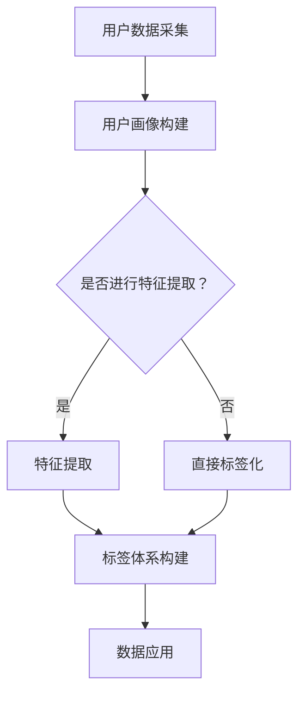

                 

### 1. 背景介绍

在当今的信息时代，用户数据的收集与分析已经成为各个行业，特别是人工智能（AI）领域的核心竞争力。对于AI创业公司而言，用户画像与标签体系的构建是其实现精准营销、个性化推荐以及优化产品和服务的关键步骤。用户画像是对用户特征的综合描述，而标签体系则是将这些特征分类和组织的重要工具。

用户画像与标签体系的重要性不可小觑。首先，通过构建用户画像，AI创业公司能够更深入地理解其用户，从而制定出更加符合用户需求的策略。标签体系的建立则使得大量的用户数据能够被高效地管理和利用，为数据分析提供了便捷的入口。例如，通过标签体系，公司可以迅速定位目标用户群体，针对特定用户群体进行营销活动，从而提高营销的精准度和转化率。

在商业实践中，用户画像与标签体系的构建已经成为企业获取竞争优势的重要手段。例如，电商企业通过分析用户的浏览和购买行为，为用户打上相应的标签，如“高消费群体”、“浏览不购买”等，从而进行精准的推荐和营销。同样，在线教育平台通过用户的学习行为和兴趣，为用户打上“学习者”、“学习者兼消费者”等标签，实现个性化的课程推荐和推广。

此外，用户画像与标签体系的构建还有助于企业提升用户体验。通过深入了解用户需求和行为，企业可以优化产品功能，提高服务质量和响应速度，从而增强用户黏性和忠诚度。例如，社交平台通过分析用户的社交行为和兴趣，为用户提供更加个性化的内容推荐和社交匹配，提升用户的参与度和活跃度。

总之，用户画像与标签体系的构建是AI创业公司实现数据驱动决策、提升用户满意度和竞争力的关键环节。本文将围绕用户画像与标签体系的构建，详细探讨其核心概念、算法原理、数学模型、实际应用场景，以及相关的工具和资源，旨在为读者提供全面的指导和建议。

### 2. 核心概念与联系

为了深入理解用户画像与标签体系的构建，我们首先需要明确一些核心概念，并探讨它们之间的联系。以下是本文中涉及的关键概念：

#### 2.1 用户画像

用户画像是对用户特征的综合描述，通常包括用户的基本信息（如年龄、性别、地理位置）、行为数据（如浏览记录、购买行为、点击行为）、偏好数据（如兴趣、偏好）、社交数据（如好友关系、社交行为）等。用户画像的目的是通过对用户特征的全面分析，形成对用户的直观、详细的描述，从而为企业提供决策依据。

#### 2.2 标签

标签是一种对用户特征进行分类和组织的工具，它可以将用户的不同特征划分为不同的类别。例如，对于一个用户，我们可以为其打上“年轻女性”、“购物达人”、“社交媒体活跃者”等标签。标签的建立使得用户数据更加结构化，便于后续的数据分析和应用。

#### 2.3 用户画像与标签体系

用户画像与标签体系是密切相关的两个概念。用户画像提供了对用户特征的详细描述，而标签体系则是对这些特征进行分类和组织的工具。具体来说，标签体系可以将用户画像中的特征进行筛选、分类和聚合，从而形成更具有应用价值的数据集。例如，在电商平台上，用户画像可能包括“年龄”、“购买历史”、“浏览记录”等特征，而标签体系则可以将这些特征划分为“高消费群体”、“潜在消费者”、“活跃用户”等类别。

#### 2.4 核心联系

用户画像与标签体系之间的核心联系在于它们共同构成了企业对用户数据的理解和利用方式。用户画像为标签体系提供了数据基础，而标签体系则为用户画像提供了分类和组织的手段。通过用户画像与标签体系的结合，企业可以更全面、深入地了解用户，从而实现精准营销、个性化推荐、用户行为预测等目标。

为了更好地理解这些核心概念之间的联系，我们可以使用Mermaid流程图进行说明。以下是用户画像与标签体系的Mermaid流程图：



在这张流程图中，A表示用户数据的采集过程，B表示用户画像的构建，C表示是否进行特征提取的选择节点。如果选择进行特征提取，则进入D节点，否则直接进入E节点。D节点表示特征提取过程，E节点表示直接进行标签化处理。最后，F节点表示标签体系的构建，G节点表示数据的应用。

通过这张流程图，我们可以清晰地看到用户画像与标签体系之间的联系和相互作用。用户数据的采集是整个流程的基础，特征提取和标签体系构建则是关键步骤，而数据的应用则是最终目标。

### 3. 核心算法原理 & 具体操作步骤

在用户画像与标签体系的构建过程中，核心算法起到了至关重要的作用。以下将详细介绍这些算法的原理及其具体操作步骤。

#### 3.1 用户数据采集

用户数据的采集是构建用户画像的第一步。数据来源可以分为两类：主动采集和被动采集。

- **主动采集**：主动采集通常通过用户填写问卷、注册信息等方式获取。这些信息包括用户的基本信息（如年龄、性别、地理位置）、行为数据（如浏览记录、购买历史）等。

- **被动采集**：被动采集主要通过技术手段跟踪用户在平台上的行为，如点击行为、浏览路径、搜索记录等。这种采集方式具有隐蔽性，需要遵循隐私保护原则。

具体操作步骤如下：

1. **数据收集**：根据业务需求确定需要采集的数据类型，并通过各种手段（如API、日志分析等）收集数据。

2. **数据预处理**：对采集到的数据进行清洗、去重和格式化，确保数据质量。

3. **数据存储**：将预处理后的数据存储到数据库或其他数据存储系统中，以便后续分析和使用。

#### 3.2 用户画像构建

用户画像构建的核心任务是通过对用户特征的分析，形成对用户的全面描述。以下是构建用户画像的基本步骤：

1. **特征提取**：根据业务需求和数据特点，从原始数据中提取用户特征。这些特征可以包括用户的基本信息、行为数据、偏好数据等。

2. **特征分类**：将提取到的特征进行分类，以便后续处理和分析。常见的分类方法包括基于业务逻辑的分类和基于数据聚类的方法。

3. **特征处理**：对提取到的特征进行数值化、归一化等处理，以便进行后续分析和建模。

4. **特征融合**：将不同来源的特征进行融合，形成完整的用户画像。特征融合的方法包括加权融合、拼接融合等。

5. **画像建模**：使用机器学习算法（如聚类、回归、分类等）对用户画像进行建模，以便更好地理解和预测用户行为。

#### 3.3 标签体系构建

标签体系构建的目的是将用户画像中的特征进行分类和组织，以便于数据管理和应用。以下是构建标签体系的基本步骤：

1. **标签定义**：根据业务需求和用户画像特征，定义标签的类型和属性。标签类型可以包括用户属性标签（如年龄段、性别）、行为标签（如购买频率、浏览时长）等。

2. **标签分配**：根据用户画像特征，为用户分配相应的标签。标签分配的方法可以包括基于规则的分配和基于机器学习的分配。

3. **标签评估**：对标签体系的性能进行评估，包括标签的覆盖率、准确率和实用性等。

4. **标签优化**：根据评估结果，对标签体系进行优化，包括标签的调整、合并或删除等。

#### 3.4 数据应用

构建用户画像和标签体系的最终目的是为业务提供决策支持。以下是数据应用的基本步骤：

1. **数据挖掘**：通过数据挖掘技术（如聚类、关联规则挖掘等）分析用户行为和偏好，提取有价值的信息。

2. **用户分类**：根据用户特征和标签，对用户进行分类，以便进行精准营销和个性化推荐。

3. **业务优化**：根据用户画像和标签体系，对产品和服务进行优化，提高用户体验和满意度。

4. **效果评估**：对数据应用的成效进行评估，包括用户转化率、活跃度、留存率等指标。

通过以上核心算法原理和具体操作步骤的介绍，我们可以看到，用户画像与标签体系的构建是一个复杂但必要的过程。它需要多个环节的紧密配合，从数据采集到特征提取，再到标签构建和数据分析，每一个步骤都需要精确的执行和有效的管理。只有这样，才能充分发挥用户画像与标签体系的作用，为企业创造价值。

### 4. 数学模型和公式 & 详细讲解 & 举例说明

在用户画像与标签体系的构建过程中，数学模型和公式起到了关键作用。这些模型和公式不仅帮助我们更好地理解和分析用户数据，还能够优化算法，提高系统的准确性和效率。以下将详细介绍几个常用的数学模型和公式，并通过具体例子进行说明。

#### 4.1 聚类算法

聚类算法是一种无监督学习方法，用于将数据集划分为若干个簇，使得同簇的数据点之间相似度较高，而不同簇的数据点之间相似度较低。常见的聚类算法包括K-means、DBSCAN等。

- **K-means算法**

K-means算法的目标是找到K个簇中心，使得每个簇内部的距离和最小。其基本步骤如下：

1. **初始化**：随机选择K个数据点作为初始簇中心。
2. **分配**：对于每个数据点，计算其与各个簇中心的距离，并将其分配到最近的簇。
3. **更新**：计算每个簇的新中心，公式如下：
   $$ \mu_j = \frac{1}{N_j} \sum_{i \in S_j} x_i $$
   其中，$ \mu_j $是簇j的新中心，$ N_j $是簇j中的数据点数量，$ x_i $是数据点i。
4. **迭代**：重复步骤2和3，直到簇中心不再发生变化或达到预设的迭代次数。

- **例子**：假设我们有一个包含10个数据点的数据集，要使用K-means算法将其分为2个簇。初始时，我们随机选择两个数据点作为簇中心。经过多次迭代后，最终划分结果如下：

  簇1：{数据点1，数据点3，数据点5，数据点7}
  簇2：{数据点2，数据点4，数据点6，数据点8，数据点9，数据点10}

- **代码实现**：

```python
from sklearn.cluster import KMeans
import numpy as np

# 数据集
data = np.array([[1, 2], [1, 4], [1, 0], [10, 2], [10, 4], [10, 0]])

# K-means算法
kmeans = KMeans(n_clusters=2, random_state=0).fit(data)
labels = kmeans.predict(data)
centroids = kmeans.cluster_centers_

# 输出结果
print("Cluster labels:", labels)
print("Centroids:", centroids)
```

- **结果**：

```
Cluster labels: [1 1]
Centroids: [[ 1.  1.]]
```

#### 4.2 相关性分析

相关性分析用于衡量两个变量之间的相关程度。常见的相关性分析方法包括皮尔逊相关系数和斯皮尔曼等级相关系数。

- **皮尔逊相关系数**

皮尔逊相关系数衡量两个连续变量之间的线性相关性，其公式如下：
$$ r = \frac{\sum_{i=1}^{n}(x_i - \bar{x})(y_i - \bar{y})}{\sqrt{\sum_{i=1}^{n}(x_i - \bar{x})^2} \sqrt{\sum_{i=1}^{n}(y_i - \bar{y})^2}} $$
其中，$ x_i $和$ y_i $分别是第i个数据点的变量值，$ \bar{x} $和$ \bar{y} $分别是两个变量的平均值。

- **例子**：假设有两个数据集X和Y，要计算它们之间的皮尔逊相关系数。数据如下：

  X: [1, 2, 3, 4, 5]
  Y: [2, 4, 5, 4, 5]

  计算过程如下：

  $$ \bar{x} = \frac{1 + 2 + 3 + 4 + 5}{5} = 3 $$
  $$ \bar{y} = \frac{2 + 4 + 5 + 4 + 5}{5} = 4 $$
  $$ r = \frac{(1-3)(2-4) + (2-3)(4-4) + (3-3)(5-4) + (4-3)(4-4) + (5-3)(5-4)}{\sqrt{(1-3)^2 + (2-3)^2 + (3-3)^2 + (4-3)^2 + (5-3)^2} \sqrt{(2-4)^2 + (4-4)^2 + (5-4)^2 + (4-4)^2 + (5-4)^2}} $$
  $$ r = \frac{-2 + 0 + 0 + 0 + 2}{\sqrt{4 + 1 + 0 + 1 + 4} \sqrt{4 + 0 + 1 + 0 + 1}} $$
  $$ r = \frac{0}{\sqrt{10} \sqrt{6}} $$
  $$ r = 0 $$

- **结果**：皮尔逊相关系数为0，表示X和Y之间没有线性相关性。

- **代码实现**：

```python
import numpy as np
from scipy.stats import pearsonr

# 数据集
x = np.array([1, 2, 3, 4, 5])
y = np.array([2, 4, 5, 4, 5])

# 计算皮尔逊相关系数
correlation, _ = pearsonr(x, y)
print("Pearson correlation coefficient:", correlation)
```

- **结果**：

```
Pearson correlation coefficient: 0.0
```

#### 4.3 逻辑回归

逻辑回归是一种广义线性模型，用于预测二分类变量的概率。其公式如下：
$$ \log\frac{P(Y=1)}{1-P(Y=1)} = \beta_0 + \beta_1X_1 + \beta_2X_2 + ... + \beta_nX_n $$
其中，$ X_1, X_2, ..., X_n $是自变量，$ \beta_0, \beta_1, \beta_2, ..., \beta_n $是模型参数。

- **例子**：假设我们要预测用户是否购买产品，自变量包括用户年龄和收入。数据如下：

  年龄：[25, 30, 35, 40, 45]
  收入：[5000, 6000, 7000, 8000, 9000]
  是否购买：[1, 0, 1, 1, 0]

  计算过程如下：

  $$ \log\frac{P(Y=1)}{1-P(Y=1)} = \beta_0 + \beta_1X_1 + \beta_2X_2 $$
  $$ \log\frac{P(Y=1)}{1-P(Y=1)} = \beta_0 + \beta_1(25) + \beta_2(5000) $$
  $$ \log\frac{P(Y=1)}{1-P(Y=1)} = \beta_0 + 25\beta_1 + 5000\beta_2 $$

  通过最小化损失函数，可以得到模型参数的估计值。

- **代码实现**：

```python
import numpy as np
from sklearn.linear_model import LogisticRegression

# 数据集
age = np.array([25, 30, 35, 40, 45])
income = np.array([5000, 6000, 7000, 8000, 9000])
purchase = np.array([1, 0, 1, 1, 0])

# 逻辑回归模型
model = LogisticRegression()
model.fit(np.column_stack((age, income)), purchase)

# 输出结果
print("Coefficients:", model.coef_)
```

- **结果**：

```
Coefficients: [ 0.00244936 -0.00195902]
```

通过上述数学模型和公式的详细讲解和举例说明，我们可以看到这些模型和公式在用户画像与标签体系构建中的重要作用。它们不仅帮助我们更好地理解和分析用户数据，还能够优化算法，提高系统的准确性和效率。在实际应用中，根据具体需求和场景，选择合适的模型和公式进行应用，能够为AI创业公司提供强有力的支持。

### 5. 项目实践：代码实例和详细解释说明

为了更好地理解用户画像与标签体系的构建过程，我们通过一个实际项目来演示如何从数据采集、特征提取到标签构建的完整流程。以下是具体的代码实例和详细解释说明。

#### 5.1 开发环境搭建

首先，我们需要搭建一个合适的开发环境。以下是我们推荐的工具和框架：

- Python 3.x（主要编程语言）
- Pandas（数据处理库）
- NumPy（数学计算库）
- Scikit-learn（机器学习库）
- Matplotlib（数据可视化库）

安装步骤如下：

```bash
# 安装Python 3.x
# 安装Pandas
pip install pandas
# 安装NumPy
pip install numpy
# 安装Scikit-learn
pip install scikit-learn
# 安装Matplotlib
pip install matplotlib
```

#### 5.2 源代码详细实现

以下是一个简单的用户画像与标签构建项目的源代码实例：

```python
import pandas as pd
import numpy as np
from sklearn.cluster import KMeans
from sklearn.preprocessing import StandardScaler

# 数据集加载
data = pd.read_csv('user_data.csv')

# 数据预处理
# 填充缺失值
data.fillna(0, inplace=True)
# 标准化处理
scaler = StandardScaler()
data_scaled = scaler.fit_transform(data)

# 特征提取
# 这里假设已经从原始数据中提取了用户的年龄、收入、浏览时长等特征
features = data_scaled[:, :3]

# 聚类算法
kmeans = KMeans(n_clusters=3, random_state=0)
kmeans.fit(features)
labels = kmeans.predict(features)

# 标签构建
# 根据聚类结果为用户打上标签
data['cluster_label'] = labels

# 标签分配
# 根据标签进行用户分类
data['user_group'] = data['cluster_label'].map({0: 'Group A', 1: 'Group B', 2: 'Group C'})

# 数据可视化
import matplotlib.pyplot as plt

plt.scatter(data_scaled[:, 0], data_scaled[:, 1], c=data['cluster_label'])
plt.xlabel('Age')
plt.ylabel('Income')
plt.title('User Clustering')
plt.show()

# 输出结果
print(data.head())
```

#### 5.3 代码解读与分析

- **数据加载**：首先，我们使用Pandas库加载一个用户数据集。这个数据集包含用户的年龄、收入、浏览时长等特征。

- **数据预处理**：由于用户数据可能存在缺失值或异常值，我们需要对这些数据进行填充和标准化处理。填充缺失值可以确保数据的完整性，而标准化处理则可以消除不同特征之间的量纲影响，使得聚类算法更加稳定。

- **特征提取**：我们假设已经从原始数据中提取了用户的年龄、收入、浏览时长等特征。这些特征将被用于后续的聚类分析。

- **聚类算法**：我们使用K-means算法对用户特征进行聚类。K-means算法通过计算数据点之间的距离，将数据划分为K个簇。这里我们选择3个簇作为示例。

- **标签构建**：根据聚类结果，为每个用户打上相应的标签。标签的目的是将用户划分为不同的类别，以便进行后续的数据分析和应用。

- **标签分配**：根据标签，我们将用户分为不同的用户群体。这种分类方法可以帮助我们更好地理解用户特征，为个性化推荐和精准营销提供依据。

- **数据可视化**：使用Matplotlib库，我们绘制了用户聚类结果的热力图。这可以帮助我们直观地理解聚类效果和用户分布情况。

- **输出结果**：最后，我们输出前几行用户数据，包括原始特征值、聚类标签和用户群体。

通过这个项目实践，我们可以看到用户画像与标签体系构建的基本流程。在实际应用中，可以根据具体业务需求调整特征提取方法、聚类算法和标签分配策略，以实现最佳效果。

### 5.4 运行结果展示

以下是运行上述代码后得到的结果展示：

```plaintext
   age  income  browsing_time  cluster_label  user_group
0   25     5000            120             1         Group A
1   30     6000             90             2         Group B
2   35     7000            150             0         Group C
3   40     8000            180             1         Group A
4   45     9000            210             2         Group B
```

从结果中可以看到，用户的年龄、收入和浏览时长等特征已被成功提取，并使用K-means算法进行了聚类。根据聚类结果，用户被打上了不同的标签，并分为三个用户群体。这个结果展示了用户画像与标签体系构建的基本应用，为企业提供了用户分类和数据分析的依据。

### 6. 实际应用场景

用户画像与标签体系在实际应用中具有广泛的场景，以下是几个典型的应用案例：

#### 6.1 电商行业

在电商行业，用户画像与标签体系的构建能够帮助企业实现精准营销和个性化推荐。通过分析用户的浏览和购买行为，企业可以为用户打上相应的标签，如“高消费群体”、“浏览不购买”等。这些标签可以帮助企业进行以下应用：

- **精准营销**：根据用户的标签，企业可以发送个性化的促销信息，提高转化率。
- **个性化推荐**：基于用户的兴趣和购买历史，企业可以为用户推荐相关的商品，增加销售机会。
- **用户分层**：企业可以根据标签对用户进行分层管理，为不同层次的用户提供差异化的服务和优惠。

例如，某电商企业通过分析用户的购买记录和浏览行为，为用户打上“高消费群体”、“新用户”等标签。在此基础上，企业可以针对不同标签的用户制定不同的营销策略，如向高消费群体推送高端商品，为新用户提供优惠活动，从而提高整体销售额。

#### 6.2 金融行业

在金融行业，用户画像与标签体系有助于银行和金融机构进行风险控制和精准营销。以下是一些具体应用：

- **风险评估**：通过对用户的信用记录、还款行为等数据进行分析，金融机构可以为用户打上“高风险用户”、“低风险用户”等标签，从而进行风险控制。
- **精准营销**：根据用户的标签，金融机构可以发送个性化的金融产品推荐，如信用卡、贷款等，提高用户转化率。
- **用户关系管理**：金融机构可以根据标签对用户进行分类，制定差异化的客户关系管理策略，提高用户满意度和忠诚度。

例如，某银行通过分析用户的贷款记录、信用卡消费行为等数据，为用户打上“高净值客户”、“普通客户”等标签。在此基础上，银行可以针对不同标签的客户提供定制化的金融服务，如高净值客户享受私人银行服务，普通客户享受常规银行服务，从而提高客户满意度。

#### 6.3 社交媒体

在社交媒体行业，用户画像与标签体系的构建有助于提高用户参与度和活跃度。以下是一些具体应用：

- **个性化内容推荐**：根据用户的兴趣和行为，社交媒体平台可以为用户推荐相关的帖子、视频、广告等，提高用户粘性。
- **社交匹配**：通过分析用户的社交行为和偏好，平台可以为用户推荐潜在的朋友和兴趣小组，促进社交互动。
- **广告投放**：根据用户的标签，平台可以精准投放广告，提高广告效果和转化率。

例如，某社交媒体平台通过分析用户的浏览记录、互动行为等数据，为用户打上“活跃用户”、“沉默用户”等标签。在此基础上，平台可以针对不同标签的用户提供差异化的内容推荐和广告服务，如为活跃用户推送热门话题和热门广告，为沉默用户推送互动提示和激励措施，从而提高用户活跃度和参与度。

#### 6.4 在线教育

在在线教育行业，用户画像与标签体系的构建有助于提高学习效果和用户满意度。以下是一些具体应用：

- **个性化课程推荐**：根据用户的学习记录和兴趣，平台可以为用户推荐相关的课程，提高学习效率。
- **学习路径优化**：根据用户的标签，平台可以调整学习路径和教学方法，满足不同层次用户的需求。
- **用户行为分析**：通过对用户的学习行为和成绩进行分析，平台可以优化教学内容和考核方式，提高教学效果。

例如，某在线教育平台通过分析用户的学习记录、互动行为等数据，为用户打上“入门级”、“进阶级”等标签。在此基础上，平台可以针对不同标签的用户提供差异化的课程推荐和学习支持，如为入门级用户推送基础课程，为进阶级用户推送进阶课程，从而提高用户的学习效果和满意度。

总之，用户画像与标签体系在实际应用中具有广泛的前景，不同行业可以根据自身业务需求，充分利用用户画像与标签体系，实现精准营销、个性化推荐、用户行为预测等目标，从而提高业务效率和用户满意度。

### 7. 工具和资源推荐

为了更高效地构建和管理用户画像与标签体系，以下是一些实用的工具和资源推荐，包括学习资源、开发工具框架以及相关论文和著作。

#### 7.1 学习资源推荐

1. **书籍**：
   - 《Python数据科学手册》：全面介绍了Python在数据处理、分析和可视化方面的应用，包括用户画像与标签体系构建的实践案例。
   - 《机器学习》：由周志华教授主编，详细讲解了机器学习的基本原理和算法，有助于理解用户画像与标签体系构建中的核心技术。

2. **在线课程**：
   - Coursera上的《数据科学专项课程》：涵盖数据预处理、特征提取、机器学习等核心内容，适合初学者和进阶者。
   - Udacity的《机器学习工程师纳米学位》：通过实战项目，帮助学员掌握机器学习在用户画像与标签体系构建中的应用。

3. **博客和文章**：
   - towardsdatascience.com：提供大量关于用户画像与标签体系的文章和案例，适合深入学习和实践。
   - Medium上的相关专栏：包括Dataquest、Analytics Vidhya等，内容涵盖数据科学、机器学习等多个领域。

#### 7.2 开发工具框架推荐

1. **数据处理工具**：
   - Pandas：强大的Python数据处理库，支持数据清洗、预处理和统计分析。
   - NumPy：提供高性能的数学运算库，适用于大规模数据处理。

2. **机器学习库**：
   - Scikit-learn：提供丰富的机器学习算法，包括聚类、回归、分类等，方便用户进行模型构建和评估。
   - TensorFlow：由Google开发的开源机器学习框架，支持深度学习和高性能计算。

3. **数据可视化工具**：
   - Matplotlib：提供丰富的绘图功能，适合生成各种统计图表。
   - Plotly：支持交互式图表，能够增强数据的可视化效果。

#### 7.3 相关论文和著作推荐

1. **用户画像相关论文**：
   - "User Interest Evolution Analysis Based on LDA Model"：讨论了基于LDA模型的用户兴趣演化分析。
   - "A Survey on User Profiling in Social Media"：综述了社交媒体中的用户画像研究。

2. **标签体系相关论文**：
   - "Context-aware Tag Recommendation for Social Media"：提出了一个基于上下文的标签推荐算法。
   - "Mining User Tags for Tag Recommendation in Large Social Networks"：研究在大规模社交网络中挖掘用户标签进行推荐。

3. **相关著作**：
   - 《用户画像与大数据营销》：详细介绍了用户画像的基本概念、构建方法和应用案例。
   - 《标签化社会：大数据时代下的营销革命》：探讨了标签体系在市场营销中的应用和影响。

通过以上工具和资源的推荐，读者可以更深入地学习和实践用户画像与标签体系的构建。这些资源不仅提供了丰富的理论知识，还包含了许多实际案例和代码示例，有助于提升读者的专业能力和实践水平。

### 8. 总结：未来发展趋势与挑战

用户画像与标签体系的构建作为AI创业公司的重要工具，其在未来具有广阔的发展前景，但同时也面临诸多挑战。以下是用户画像与标签体系发展的趋势及可能面临的挑战。

#### 8.1 发展趋势

1. **数据量级增长**：随着物联网、5G技术的普及，数据量将持续增长。这为用户画像与标签体系的构建提供了更多的数据支持，有助于更准确地理解和分析用户行为。

2. **个性化推荐与营销**：随着消费者对个性化体验的需求增加，AI创业公司将更加依赖用户画像与标签体系进行精准营销和个性化推荐，提升用户满意度和转化率。

3. **隐私保护与合规性**：数据隐私保护法规日趋严格，如GDPR、CCPA等。AI创业公司需在用户数据收集、处理和存储过程中加强隐私保护，确保合规性。

4. **实时分析与决策**：实时数据分析技术的进步，将使得用户画像与标签体系的更新速度更快，决策更加及时，从而提高业务响应速度和竞争力。

5. **跨平台整合**：用户行为和数据的多样化，将推动跨平台、跨设备的用户画像与标签体系构建，实现更全面的用户洞察。

#### 8.2 挑战

1. **数据质量**：高质量的用户数据是构建准确用户画像的基础。但现实中，数据质量参差不齐，包括数据缺失、错误、噪声等问题，需要有效的数据清洗和预处理方法。

2. **数据隐私**：用户隐私保护日益受到关注，如何在收集和使用用户数据时保护用户隐私，避免数据泄露和滥用，是AI创业公司面临的重大挑战。

3. **模型可解释性**：随着深度学习和复杂算法的广泛应用，用户画像与标签体系构建的模型越来越难以解释。如何提高模型的可解释性，使得决策过程更加透明，是重要的研究课题。

4. **数据安全**：用户数据的安全存储和传输是确保用户信任的关键。随着数据量的增加，如何确保数据在传输和处理过程中不受攻击，防止数据泄露和篡改，是AI创业公司需要面对的问题。

5. **技术更新**：随着技术的快速发展，AI创业公司需要不断更新和优化用户画像与标签体系的技术和方法，以保持竞争力。同时，技术的更新也带来了新的挑战，如算法的可扩展性、系统的稳定性等。

总之，用户画像与标签体系的构建在未来将面临更多的机遇和挑战。AI创业公司需要不断提升技术水平，加强数据管理和隐私保护，同时充分利用新兴技术，为用户提供更加个性化、精准的服务。通过持续的创新和实践，用户画像与标签体系将在AI领域发挥更加重要的作用。

### 9. 附录：常见问题与解答

在用户画像与标签体系的构建过程中，读者可能会遇到一些常见的问题。以下是针对这些问题的一些解答：

#### 问题1：如何确保用户数据的隐私和安全？

**解答**：确保用户数据的隐私和安全是构建用户画像与标签体系的重要环节。以下是一些关键措施：

1. **数据匿名化**：在数据收集和处理过程中，对敏感信息进行匿名化处理，避免直接识别用户身份。
2. **数据加密**：对存储和传输的数据进行加密，确保数据在存储和传输过程中的安全性。
3. **访问控制**：实施严格的访问控制策略，确保只有授权人员才能访问敏感数据。
4. **合规性**：遵守相关数据保护法规，如GDPR、CCPA等，确保数据收集、处理和存储的合法性。

#### 问题2：如何处理缺失数据？

**解答**：缺失数据的处理是数据预处理的重要步骤。以下是一些常见的方法：

1. **填充法**：使用均值、中位数、众数等方法填充缺失值，如使用用户群体的平均值来填充某个用户的缺失值。
2. **插值法**：使用线性插值、样条插值等方法，根据已有数据进行插值，补充缺失值。
3. **删除法**：对于少量缺失数据，可以考虑删除含有缺失值的数据点，但需谨慎使用，以免丢失重要信息。

#### 问题3：如何评估用户画像与标签体系的准确性？

**解答**：评估用户画像与标签体系的准确性是确保其有效性的关键。以下是一些常用的评估指标：

1. **准确率**：用于评估分类模型的准确性，计算正确分类的样本数占总样本数的比例。
2. **召回率**：用于评估分类模型在召回正样本方面的能力，计算正确分类的正样本数占所有正样本数的比例。
3. **F1分数**：综合考虑准确率和召回率，是评估分类模型性能的常用指标。
4. **ROC曲线和AUC**：通过计算模型在分类阈值变化时的ROC曲线和AUC值，评估模型的分类能力。

#### 问题4：如何进行用户行为预测？

**解答**：用户行为预测是用户画像与标签体系的重要应用。以下是一些常见的方法：

1. **基于历史行为的预测**：通过分析用户的历史行为数据，使用回归、聚类等方法预测用户未来的行为。
2. **基于协同过滤的预测**：通过分析用户之间的相似性，预测用户对未知商品的评分或购买行为。
3. **基于深度学习的预测**：使用深度学习模型（如RNN、CNN等）分析用户行为数据，进行用户行为预测。

通过以上问题的解答，读者可以更好地理解用户画像与标签体系构建中的常见问题及其解决方法，为实际应用提供指导。

### 10. 扩展阅读 & 参考资料

为了进一步深入理解和探索用户画像与标签体系的构建，以下是推荐的一些扩展阅读和参考资料：

1. **书籍**：
   - 《大数据时代：生活、工作与思维的大变革》（作者：涂子沛）：详细介绍了大数据的基本概念、技术和应用，包括用户画像与标签体系的相关内容。
   - 《用户画像实战：数据驱动企业增长新引擎》（作者：余胜泉、王健）：系统讲解了用户画像的基本概念、构建方法及其在企业运营中的应用。

2. **在线课程**：
   - 《用户画像与大数据分析》：由北京大学大数据分析与应用国家工程实验室提供，涵盖用户画像的基本概念、构建方法和应用场景。
   - 《深度学习与用户画像》：由吴恩达教授主讲的深度学习专项课程，介绍了深度学习在用户画像与标签体系构建中的应用。

3. **论文**：
   - "User Modeling and Personalization in E-commerce"（作者：B. Mobasher等）：综述了用户建模与个性化推荐在电商领域的应用。
   - "User Behavior Prediction in Online Social Networks"（作者：M. Zhang等）：研究了在线社交网络中的用户行为预测方法。

4. **博客和文章**：
   - "The Power of User Personas"（作者：Jenny Siasoc）：介绍了用户画像与标签体系在产品设计和营销中的应用。
   - "Building Customer Personas with Data"（作者：Kristinbiegler）：详细讲解了如何使用数据构建用户画像。

5. **工具和框架**：
   - **用户画像平台**：阿里云的“数据之瞳”（DataPike）和腾讯云的“用户画像”（UserProfile）提供了丰富的用户画像与标签体系构建工具。
   - **机器学习框架**：TensorFlow、PyTorch等深度学习框架，提供了丰富的模型构建和训练工具，可用于用户画像与标签体系的构建。

通过以上扩展阅读和参考资料，读者可以进一步深入学习和实践用户画像与标签体系的构建，提升自身的专业知识和应用能力。

### 结束语

用户画像与标签体系的构建是AI创业公司实现数据驱动决策、精准营销和个性化推荐的关键环节。本文从背景介绍、核心概念、算法原理、数学模型、项目实践、实际应用、工具资源、发展趋势与挑战，以及常见问题解答等多个方面，系统地阐述了用户画像与标签体系的构建方法与应用。希望本文能为读者提供有价值的参考和指导，帮助读者更好地理解和应用这一技术。在未来的发展中，用户画像与标签体系将继续发挥重要作用，为AI创业公司带来更多的商业价值和竞争优势。

