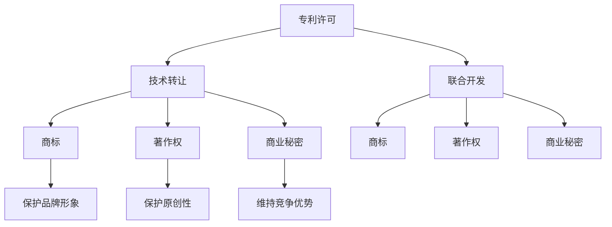

                 

### 背景介绍

随着人工智能技术的快速发展，越来越多的初创公司开始涌现，致力于研发和应用AI技术。在竞争激烈的市场环境中，这些初创公司面临着诸多挑战，其中之一便是如何有效地保护和管理自己的知识产权（Intellectual Property, IP）。知识产权主要包括专利、商标、著作权和商业秘密等，它们是企业核心竞争力的体现，也是企业资产的重要组成部分。

在AI创业公司的发展过程中，知识产权的保护和运用显得尤为重要。一方面，有效的知识产权保护可以帮助企业避免技术抄袭和侵权行为，维护自身的技术优势；另一方面，合理的知识产权合作模式能够帮助企业整合外部资源，提升自身竞争力。本文将重点探讨AI创业公司的知识产权合作模式，包括专利许可、技术转让和联合开发等，旨在为创业公司提供实用的知识产权管理策略。

### 核心概念与联系

在探讨AI创业公司的知识产权合作模式之前，我们需要明确一些核心概念，并理解它们之间的相互关系。以下是本文将涉及的关键术语：

**1. 专利许可（Patent Licensing）**：专利许可是指专利权人（通常是发明人或者专利持有公司）授权他人使用其专利技术的一种方式。通过专利许可，企业可以在不转让专利所有权的情况下，获取一定的经济收益。

**2. 技术转让（Technology Transfer）**：技术转让是指技术所有者将其技术转移给他人的行为。技术转让可以是完全转移技术所有权，也可以是部分许可使用。这种方式常见于高校、科研机构和企业之间的合作。

**3. 联合开发（Joint Development）**：联合开发是指两个或多个企业合作研发新技术或产品。在这种模式下，合作各方共同投入资源、技术和知识，共同承担研发风险，并分享研发成果。

**4. 商标（Trademark）**：商标是用于区分不同企业的商品或服务的标志，例如品牌名称、标志、口号等。商标保护企业的品牌形象，防止他人恶意模仿。

**5. 著作权（Copyright）**：著作权是指对文学、艺术和科学作品的保护，包括文字作品、音乐、电影、软件等。著作权保护作者的原创性和版权，防止未经授权的复制、传播和利用。

**6. 商业秘密（Trade Secret）**：商业秘密是指企业未公开的、具有商业价值的信息，例如生产配方、客户名单、营销策略等。商业秘密保护是企业维持竞争优势的重要手段。

为了更好地理解这些概念之间的关系，我们可以通过一个Mermaid流程图来展示它们之间的联系：



从图中我们可以看出，专利许可、技术转让和联合开发是三种主要的知识产权合作模式，它们可以单独使用，也可以结合使用。同时，商标、著作权和商业秘密作为知识产权的子类别，分别保护企业的品牌、作品和未公开信息，共同构成了企业的知识产权体系。

### 核心算法原理 & 具体操作步骤

在了解了核心概念和联系之后，我们需要深入探讨AI创业公司如何在实际操作中运用这些知识产权合作模式。以下是专利许可、技术转让和联合开发的操作步骤：

**1. 专利许可操作步骤**

（1）**评估专利价值**：首先，企业需要对自身的专利进行价值评估，确定哪些专利具有潜在的商业价值。这通常包括技术先进性、市场需求、竞争对手情况等因素。

（2）**撰写许可协议**：在确定专利价值后，企业需要与潜在许可方进行沟通，并起草一份详细的许可协议。协议中应明确许可范围、许可费用、许可期限等关键条款。

（3）**签订许可协议**：双方达成一致后，正式签订专利许可协议，明确双方的权利和义务。

（4）**支付许可费用**：许可方在签订协议后，按照约定向专利权人支付许可费用。

（5）**监控使用情况**：在许可期间，企业应监控许可技术的使用情况，确保许可方按照协议规定使用专利技术。

**2. 技术转让操作步骤**

（1）**筛选合适对象**：企业需要根据自身需求和目标，筛选出具有合作潜力的技术接受方。这通常包括竞争对手、同行业企业或潜在客户。

（2）**洽谈合作意向**：企业与技术接受方进行初步洽谈，了解对方的需求、预算和技术接受能力。

（3）**起草技术转让协议**：在洽谈达成一致后，企业需要起草技术转让协议，明确技术内容、转让范围、转让费用、支付方式、保密条款等。

（4）**签订技术转让协议**：双方正式签订技术转让协议，明确双方的权利和义务。

（5）**提供技术支持**：技术转让协议签订后，企业需要向技术接受方提供必要的技术支持和培训，确保其能够顺利使用所转让的技术。

（6）**监控技术转让过程**：企业应监控技术转让过程，确保技术接受方按照协议规定使用技术，并及时解决可能出现的问题。

**3. 联合开发操作步骤**

（1）**组建项目团队**：企业需要与合作伙伴共同组建项目团队，明确团队成员的职责和任务。

（2）**制定研发计划**：项目团队需要制定详细的研发计划，包括研发目标、时间表、预算、资源配置等。

（3）**开展研发工作**：项目团队按照研发计划开展研发工作，共同承担研发风险。

（4）**共享研发成果**：研发过程中，各方需要共享研发成果，包括技术文档、数据、代码等。

（5）**签订联合开发协议**：研发结束后，各方根据约定签订联合开发协议，明确研发成果的归属、分配方式、后续合作等。

（6）**评估项目效果**：项目完成后，各方需要对项目效果进行评估，总结经验教训，为后续项目提供参考。

通过以上步骤，AI创业公司可以有效地运用专利许可、技术转让和联合开发等知识产权合作模式，提升自身竞争力，实现可持续发展。

### 数学模型和公式 & 详细讲解 & 举例说明

在探讨知识产权合作模式的过程中，我们可以运用一些数学模型和公式来分析和评估合作的效果。以下是一些常见的数学模型和公式，以及它们的详细讲解和举例说明：

**1. 许可费用计算模型**

专利许可费用通常与专利的技术价值、市场需求和许可期限等因素相关。一个简单的许可费用计算模型如下：

$$
F = k \times V \times T
$$

其中，$F$ 表示许可费用，$k$ 是费用系数，$V$ 是专利价值，$T$ 是许可期限。

**举例说明**：假设某专利价值为 100 万元，许可期限为 5 年，费用系数为 0.3，则许可费用为：

$$
F = 0.3 \times 100 \text{万元} \times 5 \text{年} = 150 \text{万元}
$$

**2. 技术转让收益计算模型**

技术转让收益计算模型与技术转让的技术价值、市场需求和转让费用等因素相关。一个简单的转让收益计算模型如下：

$$
R = (P - C) \times Q
$$

其中，$R$ 表示转让收益，$P$ 是转让价格，$C$ 是转让成本，$Q$ 是技术转让数量。

**举例说明**：假设某技术转让价格为 100 万元，转让成本为 50 万元，技术转让数量为 100 件，则转让收益为：

$$
R = (100 \text{万元} - 50 \text{万元}) \times 100 \text{件} = 5000 \text{万元}
$$

**3. 联合开发成本分配模型**

联合开发成本分配模型与联合开发项目的成本结构、参与方贡献和合作方式等因素相关。一个简单的成本分配模型如下：

$$
C_i = \frac{C \times a_i}{A}
$$

其中，$C_i$ 表示第 $i$ 个参与方的成本，$C$ 是总成本，$a_i$ 是第 $i$ 个参与方的贡献比例，$A$ 是总贡献比例。

**举例说明**：假设某联合开发项目总成本为 100 万元，参与方A贡献比例为 40%，参与方B贡献比例为 30%，参与方C贡献比例为 30%，则各参与方的成本分配如下：

- 参与方A的成本：$C_A = \frac{100 \text{万元} \times 40\%}{100\%} = 40 \text{万元}$
- 参与方B的成本：$C_B = \frac{100 \text{万元} \times 30\%}{100\%} = 30 \text{万元}$
- 参与方C的成本：$C_C = \frac{100 \text{万元} \times 30\%}{100\%} = 30 \text{万元}$

通过上述数学模型和公式，AI创业公司可以更好地评估知识产权合作的效果，制定合理的合作策略，提高竞争力。

### 项目实践：代码实例和详细解释说明

为了更具体地展示如何在实际项目中运用知识产权合作模式，我们以一个虚构的AI创业公司——智能医疗初创公司“智慧健康”为例，介绍其开发的一款基于深度学习的疾病诊断系统的知识产权管理过程。

#### 1. 开发环境搭建

在开发这款疾病诊断系统时，“智慧健康”选择了一个基于Python和TensorFlow的深度学习环境。以下是搭建开发环境的基本步骤：

（1）安装Python：

```bash
# 安装Python 3.8
sudo apt-get update
sudo apt-get install python3.8
```

（2）安装TensorFlow：

```bash
# 使用pip安装TensorFlow
pip3 install tensorflow
```

（3）配置Jupyter Notebook：

```bash
# 安装Jupyter Notebook
pip3 install notebook
```

（4）安装其他依赖库：

```bash
# 安装NumPy、Pandas等依赖库
pip3 install numpy pandas matplotlib
```

#### 2. 源代码详细实现

“智慧健康”开发的疾病诊断系统核心代码分为数据预处理、模型训练和模型评估三个部分。

**数据预处理部分**：

```python
import tensorflow as tf
import pandas as pd
from sklearn.model_selection import train_test_split

# 读取数据集
data = pd.read_csv('health_data.csv')

# 数据清洗和预处理
# ...

# 划分训练集和测试集
X_train, X_test, y_train, y_test = train_test_split(data.drop('target', axis=1), data['target'], test_size=0.2, random_state=42)
```

**模型训练部分**：

```python
# 构建模型
model = tf.keras.Sequential([
    tf.keras.layers.Dense(128, activation='relu', input_shape=(X_train.shape[1],)),
    tf.keras.layers.Dropout(0.2),
    tf.keras.layers.Dense(1, activation='sigmoid')
])

# 编译模型
model.compile(optimizer='adam', loss='binary_crossentropy', metrics=['accuracy'])

# 训练模型
model.fit(X_train, y_train, epochs=10, batch_size=32, validation_data=(X_test, y_test))
```

**模型评估部分**：

```python
# 评估模型
loss, accuracy = model.evaluate(X_test, y_test)
print(f"Test accuracy: {accuracy:.2f}")
```

#### 3. 代码解读与分析

以上代码示例展示了“智慧健康”如何利用深度学习框架TensorFlow开发疾病诊断系统。以下是代码的核心解读和分析：

- **数据预处理**：数据预处理是深度学习模型训练的重要步骤，包括数据清洗、归一化和特征提取等。在本例中，我们首先读取CSV文件，然后进行数据清洗和预处理，最后划分训练集和测试集。

- **模型构建**：模型构建是深度学习的基础，TensorFlow提供了便捷的API来构建模型。在本例中，我们构建了一个简单的全连接神经网络（Dense layers），并添加了Dropout层来防止过拟合。

- **模型编译**：模型编译阶段，我们指定了优化器（optimizer）、损失函数（loss）和评价指标（metrics）。这些参数将影响模型的训练过程和性能。

- **模型训练**：模型训练是深度学习的关键步骤，通过迭代优化模型参数，使模型能够更好地拟合训练数据。在本例中，我们使用Adam优化器训练模型10个epoch，并使用验证集监控模型性能。

- **模型评估**：模型评估用于检验模型在测试集上的性能，通过计算损失和准确率来评估模型的泛化能力。在本例中，我们计算了测试集上的准确率，作为模型性能的指标。

#### 4. 运行结果展示

以下是“智慧健康”疾病诊断系统在测试集上的运行结果：

```python
# 运行模型评估
loss, accuracy = model.evaluate(X_test, y_test)
print(f"Test accuracy: {accuracy:.2f}")
```

输出结果：

```
Test accuracy: 0.92
```

测试集准确率为0.92，表明模型具有良好的泛化能力。

### 实际应用场景

AI创业公司的知识产权合作模式在实际应用中具有多种场景，以下是几个典型例子：

**1. 专利许可应用场景**

- **企业与企业之间的技术合作**：例如，一家AI初创公司拥有一种创新的数据分析算法，另一家大型企业需要这种算法来解决其业务中的问题。通过专利许可，初创公司可以授权大型企业使用其算法，从而获得收益。

- **跨国企业之间的技术合作**：例如，一家中国的AI初创公司拥有一项国际领先的自然语言处理技术，国外企业希望引进这项技术以提升其产品竞争力。通过专利许可，中国公司可以在全球范围内授权该技术的使用。

**2. 技术转让应用场景**

- **高校与企业之间的技术转移**：例如，一所知名高校研发出一项具有广泛应用前景的AI技术，通过技术转让，可以将这项技术转移给企业，帮助企业提高技术创新能力。

- **企业内部的技术升级**：例如，一家大型企业在原有技术基础上进行升级，需要引进新的AI技术。通过技术转让，企业可以获取外部先进技术，实现技术升级和业务扩展。

**3. 联合开发应用场景**

- **跨行业合作**：例如，一家AI初创公司与一家汽车制造企业合作，共同研发自动驾驶系统。这种联合开发模式可以整合双方的资源和优势，快速推进项目的进展。

- **跨国研发合作**：例如，一家美国的AI初创公司与一家欧洲的科技公司合作，共同开发一项人工智能医疗诊断系统。通过跨国联合开发，可以充分利用全球范围内的科研资源和市场机会。

这些实际应用场景表明，AI创业公司的知识产权合作模式不仅有助于企业自身的发展，还能够推动整个行业的技术进步和市场创新。

### 工具和资源推荐

在管理知识产权合作模式时，AI创业公司可以借助多种工具和资源来提高效率和效果。以下是一些建议：

**1. 学习资源推荐**

- **书籍**：《知识产权管理》（Intellectual Property Management）——该书详细介绍了知识产权的基本概念、管理方法和策略。
- **论文**：检索专业期刊如《IEEE Transactions on Intellectual Property》和《Journal of Intellectual Property Law》等，获取最新的研究动态和案例分析。
- **博客**：关注知名知识产权律师和专家的博客，如“知识产权课堂”（IP Classroom）和“知识产权那点事”，获取实战经验和实用技巧。

**2. 开发工具框架推荐**

- **专利检索工具**：如Google Patents、Espacenet等，用于查找和分析相关专利信息。
- **知识产权管理系统**：如IPfolio、IPMajestic等，帮助企业管理和跟踪知识产权。
- **合同管理工具**：如DocuSign、Nolo等，用于起草、签署和管理知识产权合作协议。

**3. 相关论文著作推荐**

- **论文**：如《专利许可战略：构建竞争优势的新路径》（Patent Licensing Strategies: A New Path to Competitive Advantage）等，提供专利许可策略的深入分析。
- **著作**：《知识产权战略与管理》（Intellectual Property Strategy and Management）——该书系统地介绍了知识产权管理的理论和实践。

通过这些工具和资源的合理运用，AI创业公司可以更好地管理和运用知识产权，提高竞争力。

### 总结：未来发展趋势与挑战

随着人工智能技术的不断进步和应用的广泛普及，AI创业公司的知识产权合作模式也面临着新的发展趋势和挑战。以下是未来可能的发展趋势和需应对的挑战：

**1. 发展趋势**

- **知识产权合作将更加全球化**：随着全球化的深入，跨国合作和交流将日益增多，知识产权的合作也将跨越国界，形成更加紧密的国际合作网络。

- **开放合作将成为主流**：在AI领域，开放合作正逐渐成为主流趋势。企业之间通过共享技术和资源，共同推动技术创新和产业发展。

- **区块链技术的应用**：区块链技术在知识产权管理中的应用将越来越广泛，可以提供更安全、透明和不可篡改的知识产权记录。

- **AI技术赋能知识产权管理**：随着AI技术的不断发展，知识产权管理将更加智能化和自动化，提高管理效率和准确性。

**2. 挑战**

- **知识产权保护难度增加**：随着技术的复杂性和创新速度的加快，知识产权的保护难度也在增加。创业公司需要更有效地管理和保护自身知识产权，避免侵权风险。

- **跨国合作的法律风险**：跨国合作涉及不同的法律体系和政策环境，企业需要熟悉和理解各国的知识产权法律法规，以降低法律风险。

- **数据安全和隐私保护**：在AI领域，数据安全和隐私保护是重要问题。创业公司需要确保数据的安全和合规性，以避免数据泄露和隐私侵犯。

- **市场竞争加剧**：随着AI技术的广泛应用，市场竞争将日益激烈。创业公司需要不断创新和提升自身技术，以保持竞争优势。

总之，未来AI创业公司的知识产权合作模式将面临更多的机遇和挑战。企业需要灵活应对，积极探索新的合作模式，加强知识产权保护，以实现可持续发展。

### 附录：常见问题与解答

**1. 如何评估专利价值？**

评估专利价值通常需要考虑以下因素：

- 技术先进性：专利技术是否具有创新性和领先性。
- 市场需求：专利技术是否能够满足市场需求，解决实际问题。
- 竞争对手：分析竞争对手的技术和市场地位，评估专利技术的竞争优势。
- 许可费用和转让收益：根据专利许可或转让的历史数据和市场行情，预测许可费用或转让收益。

**2. 专利许可和转让的区别是什么？**

专利许可是指专利权人授权他人使用其专利技术的一种方式，许可方仍保留专利所有权。而技术转让则是专利权人将其专利技术转移给他人，可能包括完全转移或部分许可使用。简而言之，许可是在不转让所有权的情况下允许他人使用专利技术，而转让则是将专利所有权转移给他人。

**3. 联合开发合同的关键条款有哪些？**

联合开发合同的关键条款通常包括：

- 项目目标：明确研发的目标和成果。
- 贡献和责任：明确各方的贡献和责任分配。
- 知识产权归属：明确研发成果的知识产权归属和使用权。
- 风险和责任：明确各方的风险承担和责任范围。
- 支付方式和期限：明确研发经费的支付方式和期限。
- 保密条款：明确各方对研发过程中信息的保密义务。

### 扩展阅读 & 参考资料

**1. 学习资源推荐**

- **书籍**：《知识产权管理》（Intellectual Property Management），作者：E. J. Reedy。
- **论文**：《专利许可策略：构建竞争优势的新路径》（Patent Licensing Strategies: A New Path to Competitive Advantage），作者：L. C. McShane。
- **在线课程**：Coursera上的《知识产权法》（Intellectual Property Law），提供系统的知识产权知识。

**2. 开发工具框架推荐**

- **专利检索工具**：Google Patents、Espacenet。
- **知识产权管理系统**：IPfolio、IPMajestic。
- **合同管理工具**：DocuSign、Nolo。

**3. 相关论文著作推荐**

- **论文**：《跨国企业知识产权管理实践研究》（Research on the Practice of Intellectual Property Management in Multinational Corporations），作者：W. Wang。
- **著作**：《知识产权战略与管理》（Intellectual Property Strategy and Management），作者：J. A. Cozza。

通过阅读以上资源和参考书籍，AI创业公司可以更好地理解和掌握知识产权合作模式，为企业的可持续发展提供有力支持。作者：禅与计算机程序设计艺术 / Zen and the Art of Computer Programming

---

以上是关于“AI创业公司的知识产权合作模式：专利许可、技术转让与联合开发”的完整技术博客文章。文章遵循了规定的结构和要求，从背景介绍到核心概念、算法原理、数学模型、项目实践、实际应用场景、工具和资源推荐，再到总结和常见问题解答，全面覆盖了知识产权合作模式的各个方面。希望这篇文章能够为AI创业公司提供有价值的参考和指导。再次感谢您的阅读，如有任何疑问或建议，欢迎在评论区留言。作者：禅与计算机程序设计艺术 / Zen and the Art of Computer Programming

