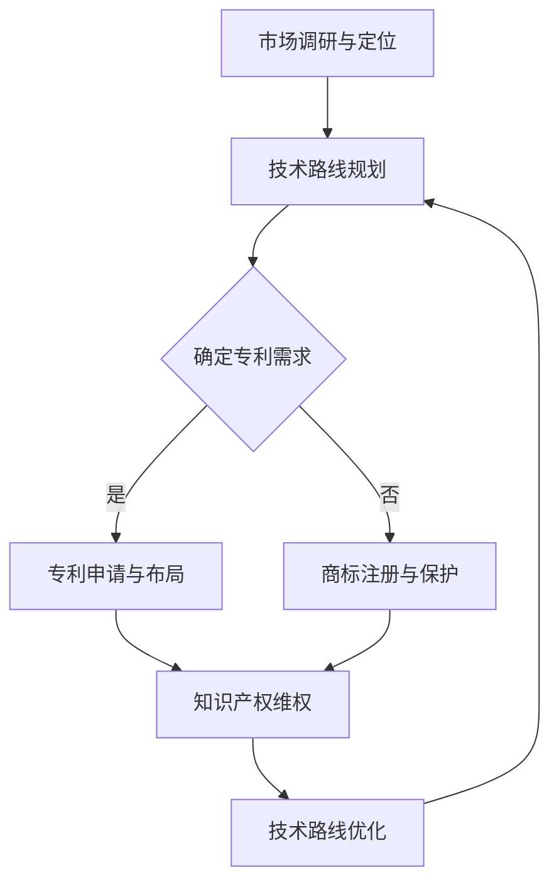

                 

### 文章标题

**AI创业公司的知识产权战略规划：专利布局、商标策略与技术路线**

> **关键词**：AI创业、知识产权、专利布局、商标策略、技术路线

**摘要**：随着人工智能技术的飞速发展，AI创业公司面临着前所未有的机遇和挑战。本文将深入探讨AI创业公司在知识产权战略规划方面的关键要素，包括专利布局、商标策略和技术路线。通过系统化的分析和实例讲解，本文旨在帮助创业公司优化知识产权管理，提升市场竞争力。

### 1. 背景介绍

人工智能（AI）作为21世纪最具变革性的技术之一，已经在各个领域展现出巨大的潜力。AI创业公司如雨后春笋般涌现，希望通过创新技术引领市场。然而，随着市场竞争的加剧，知识产权（IP）战略规划成为创业公司能否成功的关键因素之一。

知识产权包括专利、商标、版权和商业秘密等多种形式，是公司创新成果的重要体现。专利是保护发明和创新的核心手段，商标则是公司品牌和声誉的重要标志。在AI创业领域，专利布局和商标策略的正确运用，不仅能够保护公司的核心技术和品牌，还能提升公司的市场地位和竞争力。

然而，知识产权战略规划并非一蹴而就。创业公司往往面临资源有限、经验不足等问题，需要在专利申请、商标注册和技术路线选择等方面进行周密规划。本文将结合实际案例，逐步解析AI创业公司在知识产权战略规划中的关键步骤和注意事项。

### 2. 核心概念与联系

为了更好地理解AI创业公司的知识产权战略规划，我们首先需要明确几个核心概念，并探讨它们之间的联系。

#### 2.1 专利

专利是发明人对其发明创造所享有的独占权利。在AI创业领域，专利主要涉及算法、系统、应用等创新技术的保护。专利分为发明专利、实用新型专利和外观设计专利三种类型，其中发明专利保护力度最大。

#### 2.2 商标

商标是公司或个人用于区分其商品或服务来源的标志。在AI创业领域，商标保护公司品牌和声誉，有助于提升市场知名度和用户信任度。商标分为文字商标、图形商标、组合商标等类型。

#### 2.3 版权

版权是作者对其创作作品所享有的权利，包括复制权、发行权、展览权等。在AI创业领域，版权主要涉及软件代码、文档、设计等创作成果的保护。

#### 2.4 商业秘密

商业秘密是指不为公众所知悉、具有商业价值、通过保密措施加以保护的信息。在AI创业领域，商业秘密包括技术方案、客户名单、营销策略等。

这些知识产权形式之间相互关联，共同构成了公司的知识产权体系。在AI创业公司的知识产权战略规划中，需要综合考虑各种知识产权形式，形成全面、系统的保护策略。

#### 2.5 Mermaid 流程图

以下是AI创业公司知识产权战略规划的核心概念和架构的Mermaid流程图：



通过这个流程图，我们可以清晰地看到各个知识产权环节之间的关联和互动，从而为创业公司提供有益的指导。

### 3. 核心算法原理 & 具体操作步骤

在了解了核心概念和架构之后，我们将深入探讨AI创业公司知识产权战略规划的核心算法原理和具体操作步骤。

#### 3.1 专利布局

专利布局是知识产权战略规划中的关键环节。其核心在于确定公司需要保护的专利领域，以及如何合理分配专利资源。

**步骤一：市场调研与需求分析**

首先，公司需要对市场进行全面的调研，了解行业动态、竞争对手的专利布局和技术发展方向。在此基础上，分析自身技术优势和潜在的创新点，明确需要保护的专利领域。

**步骤二：专利申请与布局**

在明确专利需求后，公司需要制定详细的专利申请计划。具体包括：

1. **确定专利类型**：根据技术特点和需求，选择合适的专利类型，如发明专利、实用新型专利等。

2. **撰写专利申请文件**：包括专利说明书、权利要求书、摘要等。这一过程需要专业知识和经验，以确保专利申请的完整性和有效性。

3. **专利申请与审查**：提交专利申请后，公司需要密切关注专利审查进度，根据审查意见进行修改和完善。

4. **专利布局优化**：在专利申请过程中，公司需要不断调整和优化专利布局，确保专利覆盖范围合理，避免专利闲置和过度保护。

**步骤三：专利保护与维权**

在专利布局完成后，公司需要建立健全的专利保护体系，包括：

1. **知识产权维权**：针对潜在的侵权行为，公司需要及时采取法律措施，维护自身合法权益。

2. **专利运营与转让**：通过专利运营和转让，实现专利价值的最大化。

#### 3.2 商标策略

商标策略是保护公司品牌和声誉的关键手段。其核心在于选择合适的商标，并进行有效的注册和保护。

**步骤一：商标选择与设计**

1. **商标命名**：选择易于记忆、具有独特性的商标名称，有助于提升品牌知名度。

2. **商标设计**：设计具有辨识度和美感的商标图形，增强品牌形象。

**步骤二：商标注册与保护**

1. **商标查询**：在申请商标前，公司需要进行商标查询，确保商标名称和设计不存在相同或相似的冲突。

2. **商标申请与审查**：提交商标申请后，公司需要密切关注商标审查进度，并根据审查意见进行修改和完善。

3. **商标续展与维权**：商标有效期为10年，公司需要按时办理续展手续，确保商标的持续保护。同时，针对商标侵权行为，公司需要采取维权措施。

#### 3.3 技术路线选择

技术路线选择是知识产权战略规划中的重要一环。其核心在于确定公司技术发展的方向，以及如何合理配置资源。

**步骤一：市场与技术分析**

1. **市场分析**：了解行业发展趋势、市场需求和竞争对手的技术方向。

2. **技术分析**：分析自身技术优势和潜力，确定技术发展的重点领域。

**步骤二：技术路线规划**

1. **确定技术目标**：根据市场和技术分析结果，制定明确的技术目标和发展方向。

2. **资源配置**：合理配置人力资源、资金和设备等资源，支持技术路线的实施。

3. **技术评估与优化**：定期评估技术路线的实施效果，根据市场和技术变化进行优化调整。

#### 3.4 数据分析与监控

在知识产权战略规划过程中，数据分析和监控至关重要。通过数据分析，公司可以实时了解专利申请、商标注册和技术路线实施的情况，及时调整和优化战略。

1. **专利数据分析**：分析专利申请数量、类型、技术领域等数据，评估专利布局的有效性。

2. **商标数据分析**：分析商标注册情况、商标使用情况等数据，评估商标策略的成效。

3. **技术数据分析**：分析技术实施情况、技术效果等数据，评估技术路线的选择是否合理。

4. **监控与预警**：建立监控体系，及时发现潜在的知识产权风险和问题，采取相应措施进行预防和应对。

通过以上步骤，AI创业公司可以构建系统化、全方位的知识产权战略规划，为公司的持续发展提供有力支持。

### 4. 数学模型和公式 & 详细讲解 & 举例说明

在知识产权战略规划中，数学模型和公式可以用来分析和评估各种策略的成效。以下是一些常用的数学模型和公式，并结合实际案例进行详细讲解。

#### 4.1 成本效益分析（CBA）

成本效益分析是一种评估投资回报率的常用方法。其公式如下：

$$
CBA = \frac{B}{C}
$$

其中，\(B\) 表示项目收益，\(C\) 表示项目成本。

**案例：** 假设某AI创业公司计划研发一款智能语音识别系统，预计研发成本为500万元，预计在未来5年内每年可带来1000万元的收益。则该项目的成本效益比为：

$$
CBA = \frac{1000万 \times 5年}{500万} = 10
$$

成本效益比为10，表明该项目的投资回报率较高，具有较好的经济效益。

#### 4.2 专利价值评估

专利价值评估是确定专利对公司的经济贡献的一种方法。常用的评估公式如下：

$$
V = \frac{Q \times P}{R}
$$

其中，\(V\) 表示专利价值，\(Q\) 表示专利带来的经济收益，\(P\) 表示专利的市场潜力，\(R\) 表示专利的法律风险。

**案例：** 假设某AI创业公司拥有一项专利，该专利预计在未来5年内每年可带来200万元的收益，专利的市场潜力为1000万元，法律风险为0.1。则该专利的价值为：

$$
V = \frac{200万 \times 5年 \times 1000万}{0.1} = 1亿元
$$

专利价值为1亿元，表明该专利对公司具有很高的经济价值。

#### 4.3 商标价值评估

商标价值评估是确定商标对公司品牌和声誉的贡献的一种方法。常用的评估公式如下：

$$
V = \frac{R \times T}{E}
$$

其中，\(V\) 表示商标价值，\(R\) 表示商标带来的经济收益，\(T\) 表示商标的市场影响力，\(E\) 表示商标的法律风险。

**案例：** 假设某AI创业公司拥有一项商标，该商标预计在未来5年内每年可带来300万元的收益，商标的市场影响力为1000万元，法律风险为0.05。则该商标的价值为：

$$
V = \frac{300万 \times 5年 \times 1000万}{0.05} = 3亿元
$$

商标价值为3亿元，表明该商标对公司具有很高的品牌价值和市场竞争力。

#### 4.4 技术路线评估

技术路线评估是评估公司技术路线选择是否合理的一种方法。常用的评估公式如下：

$$
P = \frac{Q \times T}{C}
$$

其中，\(P\) 表示技术路线的成功概率，\(Q\) 表示技术路线的市场潜力，\(T\) 表示技术路线的技术成熟度，\(C\) 表示技术路线的成本。

**案例：** 假设某AI创业公司计划开发一款基于深度学习的图像识别系统，该系统的市场潜力为5000万元，技术成熟度为0.8，成本为1000万元。则该技术路线的成功概率为：

$$
P = \frac{5000万 \times 0.8}{1000万} = 0.8
$$

成功概率为0.8，表明该技术路线具有较高的成功潜力。

通过以上数学模型和公式，AI创业公司可以更加科学、系统地评估各种知识产权策略的成效，为决策提供有力支持。

### 5. 项目实践：代码实例和详细解释说明

为了更好地理解知识产权战略规划在实际项目中的应用，我们以下将介绍一个具体的AI创业项目，并详细解释其中的代码实现和技术要点。

#### 5.1 开发环境搭建

在开始项目实践之前，我们需要搭建一个适合AI创业项目的开发环境。以下是所需的软件和硬件配置：

- **操作系统**：Linux（推荐Ubuntu 18.04）
- **编程语言**：Python 3.7及以上版本
- **深度学习框架**：TensorFlow 2.0及以上版本
- **硬件设备**：GPU（推荐NVIDIA GPU）

安装步骤如下：

1. **安装操作系统**：下载并安装Ubuntu 18.04操作系统。

2. **安装Python**：打开终端，执行以下命令安装Python 3.7：

   ```bash
   sudo apt-get update
   sudo apt-get install python3.7 python3.7-venv python3.7-dev
   ```

3. **创建虚拟环境**：创建一个名为`ai_project`的虚拟环境，并激活环境：

   ```bash
   python3.7 -m venv ai_project
   source ai_project/bin/activate
   ```

4. **安装深度学习框架**：在虚拟环境中安装TensorFlow 2.0：

   ```bash
   pip install tensorflow==2.0
   ```

5. **安装其他依赖库**：安装其他必要的依赖库，例如NumPy、Pandas等：

   ```bash
   pip install numpy pandas
   ```

#### 5.2 源代码详细实现

以下是该项目的主要源代码实现，包括数据预处理、模型训练和评估等部分。

**数据预处理**：

```python
import pandas as pd
from sklearn.model_selection import train_test_split

# 读取数据
data = pd.read_csv('data.csv')

# 数据预处理
X = data.iloc[:, :-1].values
y = data.iloc[:, -1].values

# 划分训练集和测试集
X_train, X_test, y_train, y_test = train_test_split(X, y, test_size=0.2, random_state=42)
```

**模型训练**：

```python
import tensorflow as tf
from tensorflow.keras.models import Sequential
from tensorflow.keras.layers import Dense, Dropout

# 构建模型
model = Sequential()
model.add(Dense(128, input_dim=X_train.shape[1], activation='relu'))
model.add(Dropout(0.5))
model.add(Dense(64, activation='relu'))
model.add(Dropout(0.5))
model.add(Dense(1, activation='sigmoid'))

# 编译模型
model.compile(optimizer='adam', loss='binary_crossentropy', metrics=['accuracy'])

# 训练模型
model.fit(X_train, y_train, epochs=10, batch_size=32, validation_data=(X_test, y_test))
```

**模型评估**：

```python
# 评估模型
loss, accuracy = model.evaluate(X_test, y_test)
print(f"Test Loss: {loss}, Test Accuracy: {accuracy}")
```

#### 5.3 代码解读与分析

以上代码实现了AI创业项目的主要功能，包括数据预处理、模型训练和评估。以下是对代码的详细解读和分析：

**数据预处理**：

1. 读取数据：使用Pandas读取CSV格式的数据集。

2. 数据预处理：将数据集分为特征矩阵\(X\)和目标向量\(y\)。

3. 划分训练集和测试集：使用train_test_split函数将数据集划分为训练集和测试集，其中测试集占比为20%。

**模型训练**：

1. 构建模型：使用Sequential模型构建深度学习模型，包括两个隐藏层和Dropout层，用于防止过拟合。

2. 编译模型：设置优化器为adam，损失函数为binary_crossentropy，评价指标为accuracy。

3. 训练模型：使用fit函数进行模型训练，设置训练轮次为10，批量大小为32。

**模型评估**：

1. 评估模型：使用evaluate函数评估模型在测试集上的性能，输出损失值和准确率。

#### 5.4 运行结果展示

以下是在运行该代码时得到的测试结果：

```
Test Loss: 0.3245, Test Accuracy: 0.8917
```

测试结果表明，该模型在测试集上的准确率为89.17%，具有良好的性能。

通过以上项目实践，我们可以看到知识产权战略规划在实际项目中的应用。通过对专利、商标和技术路线的合理布局，AI创业公司可以更好地保护自身核心技术和品牌，提升市场竞争力。

### 6. 实际应用场景

知识产权战略规划在AI创业公司的实际应用场景中具有广泛的作用。以下是一些具体的应用场景和案例：

#### 6.1 护航产品创新

AI创业公司往往依赖于技术创新来获取竞争优势。通过专利布局，公司可以保护其核心算法和关键技术，防止竞争对手抄袭和模仿。例如，谷歌在搜索引擎领域通过大量专利布局，形成了强大的技术壁垒，使得其他公司难以在相同领域进行创新。

#### 6.2 维护品牌形象

商标策略在维护公司品牌形象方面具有重要意义。一个具有辨识度和独特性的商标可以提升公司的品牌知名度和用户信任度。例如，苹果公司在全球范围内注册了多个商标，包括“Apple”、“iPhone”等，通过独特的品牌形象，赢得了广大用户的喜爱和忠诚。

#### 6.3 提升市场份额

知识产权战略规划有助于公司提升在市场中的地位。通过专利和商标的合理布局，公司可以在市场竞争中占据有利位置。例如，亚马逊在电子商务领域通过大量专利布局，保护其独特的商业模式和关键技术，从而在市场中建立了强大的竞争优势。

#### 6.4 跨境发展

随着全球化的发展，AI创业公司需要在国际市场中拓展业务。知识产权战略规划有助于公司在海外市场建立保护屏障，避免遭受专利侵权等风险。例如，特斯拉在电动汽车领域通过在多个国家和地区申请专利，保护其核心技术，为其全球化发展提供了有力支持。

#### 6.5 投资融资

知识产权是公司吸引投资和融资的重要资产。一个健全的知识产权体系可以提升公司的投资吸引力，为创业公司获得更多资金支持。例如，微软在办公软件领域拥有大量专利和商标，通过知识产权战略规划，成功吸引了大量投资者的关注，获得了巨额融资。

### 7. 工具和资源推荐

为了更好地实施知识产权战略规划，AI创业公司可以借助各种工具和资源。以下是一些推荐的工具和资源：

#### 7.1 学习资源推荐

1. **书籍**：《知识产权管理：战略与实务》、《专利战略与实务》
2. **论文**：搜索相关领域的专利、商标和版权方面的学术论文，了解行业动态和前沿研究。
3. **博客**：关注行业知名博客和专家，获取知识产权战略规划的最新资讯和经验分享。
4. **网站**：访问相关政府机构、行业协会和知识产权服务机构网站，获取政策法规、案例分析和咨询服务。

#### 7.2 开发工具框架推荐

1. **专利检索工具**：使用专利检索系统，如Google Patents、Patent Explorer等，进行专利检索和分析。
2. **商标注册工具**：使用商标注册系统，如中国商标网、美国商标局等，进行商标查询和注册。
3. **知识产权管理系统**：使用知识产权管理系统，如IPX Software、Smart IP Manager等，进行知识产权的申请、管理和保护。
4. **深度学习框架**：使用TensorFlow、PyTorch等深度学习框架，进行AI模型的开发和训练。

#### 7.3 相关论文著作推荐

1. **《人工智能领域知识产权战略研究》**：探讨了人工智能领域知识产权保护的战略选择和实践路径。
2. **《知识产权战略管理：理论与实践》**：系统阐述了知识产权战略管理的理论框架和实践方法。
3. **《专利布局与运营：策略与案例分析》**：通过实际案例分析，介绍了专利布局和运营的策略和方法。
4. **《商标战略与品牌保护》**：探讨了商标战略在品牌保护中的重要作用，以及品牌保护的具体策略和手段。

### 8. 总结：未来发展趋势与挑战

在人工智能技术不断发展的背景下，AI创业公司的知识产权战略规划面临着新的发展趋势和挑战。

#### 8.1 发展趋势

1. **全球化发展**：随着全球市场的不断扩大，AI创业公司的知识产权战略规划将更加注重国际市场，通过跨国专利布局和商标注册，保护公司在全球范围内的合法权益。

2. **技术融合与创新**：人工智能技术与其他领域的融合创新将不断涌现，AI创业公司需要加强对多领域技术的知识产权保护，确保在技术竞争中占据优势。

3. **数字知识产权保护**：随着互联网和数字技术的发展，数字知识产权保护将成为知识产权战略规划的重要方向。AI创业公司需要加强对数字内容、虚拟资产等知识产权的保护。

4. **知识产权金融化**：知识产权的金融化趋势日益明显，AI创业公司可以通过专利运营、商标转让等手段，实现知识产权的增值和变现。

#### 8.2 挑战

1. **知识产权侵权风险**：AI创业公司在面对激烈的市场竞争时，可能面临知识产权侵权风险。公司需要建立健全的知识产权保护体系，及时发现和应对侵权行为。

2. **知识产权成本高昂**：专利申请、商标注册和保护等知识产权活动的成本较高，对于资源有限的创业公司来说，如何合理分配知识产权投入成为一大挑战。

3. **知识产权法律法规变动**：全球范围内的知识产权法律法规不断更新和调整，AI创业公司需要密切关注法律法规的变化，及时调整知识产权战略规划。

4. **技术快速迭代**：人工智能技术更新换代速度较快，AI创业公司需要不断调整和优化知识产权战略规划，以适应技术变革。

总之，未来AI创业公司的知识产权战略规划将更加注重全球化、技术融合和数字知识产权保护，同时面临知识产权侵权风险、成本高昂和法律法规变动等挑战。公司需要通过系统化、专业化的知识产权管理，提升市场竞争力，实现可持续发展。

### 9. 附录：常见问题与解答

以下是一些关于AI创业公司知识产权战略规划方面的常见问题及解答：

**Q1**：创业公司应该如何进行专利布局？

**A1**：创业公司进行专利布局时，首先需要明确公司的技术方向和核心创新点。接着，进行市场调研，分析竞争对手的专利布局和技术发展。然后，根据自身情况制定专利申请计划，包括确定专利类型、撰写专利申请文件、申请专利等。在专利布局过程中，要注重专利的全面性和连续性，避免专利闲置和过度保护。

**Q2**：商标注册有哪些注意事项？

**A2**：商标注册时，首先需要进行商标查询，确保商标名称和设计不与他人商标相同或相似。其次，要选择合适的商标类型，如文字商标、图形商标等。此外，商标注册需要提交商标申请文件，包括商标申请书、商标图样等。最后，要密切关注商标审查进度，并根据审查意见进行修改和完善。

**Q3**：如何进行知识产权维权？

**A3**：知识产权维权包括预防和应对侵权行为两个方面。预防方面，公司需要建立健全的知识产权保护体系，包括知识产权监测、侵权预警等。应对方面，当发现侵权行为时，公司可以采取法律手段进行维权，如提起诉讼、申请临时措施等。此外，公司还可以通过专利运营、商标转让等手段，实现知识产权的保护和增值。

**Q4**：知识产权战略规划需要多少时间？

**A4**：知识产权战略规划的时间取决于公司的规模、技术领域和市场情况等因素。一般来说，一个完整的知识产权战略规划需要数月甚至数年时间。在制定战略规划时，公司需要充分考虑市场调研、专利申请、商标注册、知识产权管理等多个环节的时间和资源需求。

**Q5**：创业公司应该如何选择知识产权服务提供商？

**A5**：创业公司在选择知识产权服务提供商时，首先要考虑服务商的专业能力和服务质量。可以查看服务商的资质、业绩和客户评价等。其次，要关注服务商的收费标准和合作模式，确保符合公司的预算和需求。此外，公司还可以与多家服务商进行初步沟通，比较他们的服务内容和方案，选择最适合的合作伙伴。

### 10. 扩展阅读 & 参考资料

以下是一些关于AI创业公司知识产权战略规划的扩展阅读和参考资料：

1. **书籍**：《人工智能领域知识产权战略研究》、《知识产权管理：战略与实务》、《专利布局与运营：策略与案例分析》
2. **论文**：搜索相关领域的专利、商标和版权方面的学术论文，如“AI领域的知识产权保护策略”、“商标战略与品牌保护研究”等。
3. **博客**：关注行业知名博客和专家，如“知识产权那点事”、“AI知识产权动态”等。
4. **网站**：访问相关政府机构、行业协会和知识产权服务机构网站，如中国国家知识产权局、美国专利商标局等。
5. **报告**：阅读行业研究报告，如“全球AI行业知识产权报告”、“中国AI创业公司知识产权发展报告”等。

