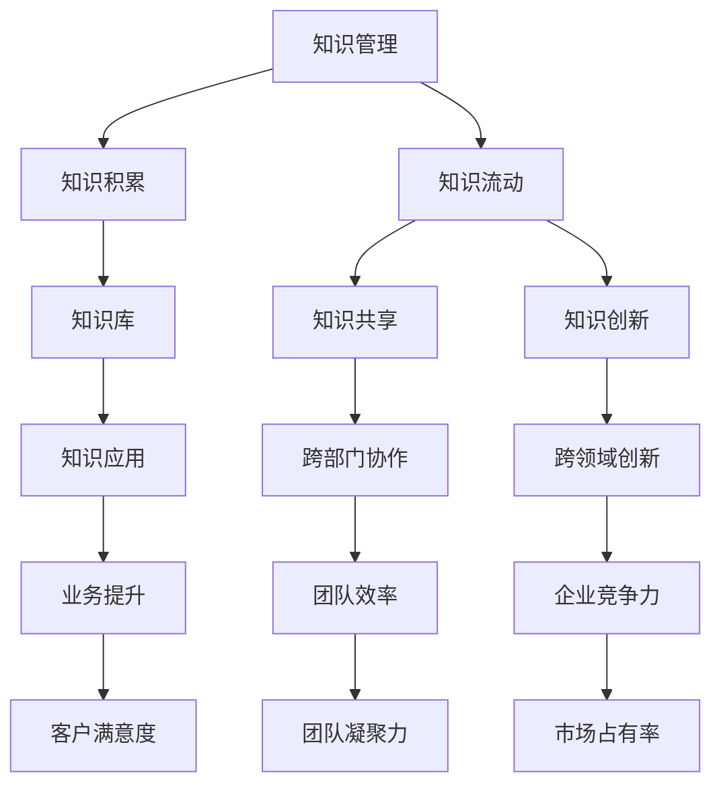
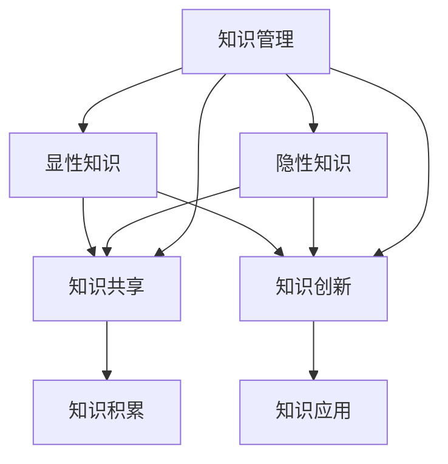

                 

### 1. 背景介绍

在当今信息爆炸的时代，知识管理在企业的运营和发展中扮演着越来越重要的角色。特别是对于AI创业公司来说，有效的知识管理不仅能够提高团队的工作效率，还能激发创新，推动技术进步，从而在激烈的市场竞争中占据优势地位。

AI创业公司面临着快速迭代的技术环境，如何在短时间内积累、传播和利用知识，是这些公司成功的关键因素之一。传统的知识管理方法往往注重知识的存储和保护，但往往忽视了知识的流动和转化。这种单向的知识流动模式难以满足AI创业公司对创新和灵活性的需求。

知识管理不仅仅是一个技术问题，更是一个系统性工程。它涉及知识获取、知识组织、知识共享、知识应用等多个环节。有效的知识管理机制能够促进知识的积累和流动，从而提升企业的整体创新能力。本文将围绕AI创业公司的知识管理与创新机制展开讨论，探讨知识积累与流动的内在机制和具体实践。

AI创业公司的知识管理不仅仅是为了应对当前的业务需求，更是为了构建长期竞争优势。通过系统的知识管理，公司可以更好地整合内外部资源，实现知识的最大化利用。同时，知识的流动是知识管理的重要组成部分，它能够确保知识在不同团队、不同部门之间顺畅传递，从而促进跨领域的创新。

总的来说，本文将详细探讨以下内容：

1. **核心概念与联系**：介绍知识管理、知识积累、知识流动等核心概念，并使用Mermaid流程图展示它们之间的联系。
2. **核心算法原理 & 具体操作步骤**：深入解析如何通过知识图谱、知识图谱嵌入等技术实现知识的积累和流动。
3. **数学模型和公式 & 详细讲解 & 举例说明**：介绍用于知识管理的数学模型和公式，并通过具体例子说明其应用。
4. **项目实践：代码实例和详细解释说明**：提供实际项目中的代码实例，详细解释代码实现原理和步骤。
5. **实际应用场景**：探讨知识管理在不同领域的应用场景。
6. **工具和资源推荐**：推荐学习资源、开发工具框架及相关论文著作。
7. **总结：未来发展趋势与挑战**：总结当前知识管理面临的问题和挑战，展望未来的发展趋势。

### 2. 核心概念与联系

要深入探讨AI创业公司的知识管理与创新机制，我们首先需要明确几个核心概念：知识管理、知识积累、知识流动。

**知识管理（Knowledge Management，KM）** 是指通过系统的方法和工具，对知识进行获取、存储、组织、共享、应用和创新的一系列过程。知识管理不仅包括显性知识（如文档、数据库等），还涵盖隐性知识（如个人经验、专业知识等）。其目标是最大化地提高知识的利用效率，促进知识的创造和传播。

**知识积累（Knowledge Accumulation）** 是指在知识管理过程中，通过各种手段和方法，将内外部知识进行收集、整理、存储和整合，形成企业内部的知识库。知识积累是知识管理的第一步，也是知识流动的基础。一个有效的知识积累机制能够确保企业拥有丰富的知识资源，为创新提供坚实的基础。

**知识流动（Knowledge Flow）** 是指知识在企业内部和外部的传递、共享和应用过程。知识流动不仅仅是知识的传递，还包括知识的转化、融合和创新。有效的知识流动能够促进知识在不同团队、不同部门之间的共享和利用，从而提高企业的整体创新能力和竞争力。

为了更直观地理解这三个概念之间的联系，我们可以使用Mermaid流程图来展示它们之间的关系：



从上述流程图中，我们可以看出：

- **知识管理是整个知识积累与流动的驱动力量**，它贯穿于知识获取、存储、共享和应用的各个环节。
- **知识积累是知识流动的基础**，只有积累了丰富的知识资源，才能实现有效的知识流动。
- **知识流动是知识管理的关键环节**，它不仅包括知识的传递和共享，还包括知识的转化和创新。

通过这样的流程图，我们可以更清晰地理解知识管理、知识积累和知识流动之间的内在联系，为后续的讨论提供理论基础。

### 2.1. 知识管理的核心概念详细解释

在深入探讨知识管理的过程中，我们首先需要明确知识管理中的几个关键概念：显性知识、隐性知识、知识共享、知识创新等。

**显性知识（Explicit Knowledge）** 是指可以用语言、文字、图表等形式明确表达的知识。这类知识易于存储、检索和共享，是知识管理中的主要对象。显性知识通常包括文档、数据库、代码、标准操作流程等。例如，一个AI创业公司的技术文档、数据集和算法模型都可以视为显性知识。

**隐性知识（Tacit Knowledge）** 是指难以用语言、文字等明确表达的知识，通常存在于个人的经验、直觉和专业知识中。隐性知识具有高度个人化和情境依赖性，难以直接传递和共享。例如，一位资深数据科学家在处理复杂问题时所使用的直觉和经验，就是一种隐性知识。

**知识共享（Knowledge Sharing）** 是指知识在不同个体、团队或组织之间的传递和共享过程。有效的知识共享能够促进知识的流动和利用，从而提高企业的整体创新能力。知识共享的形式多种多样，包括正式的培训、会议、研讨会，以及非正式的讨论、交流、合作等。

**知识创新（Knowledge Innovation）** 是指在知识积累和共享的基础上，通过新的组合、分析和转化，创造出新的知识或价值。知识创新是知识管理的核心目标之一，它能够推动企业技术、产品和服务的不断创新，提高市场竞争力。

为了更直观地理解这些概念之间的关系，我们可以使用以下Mermaid流程图：



从上述流程图中，我们可以看到：

- **显性知识和隐性知识都是知识管理的重要组成部分**，它们共同构成了企业知识的整体。
- **知识共享是实现知识流动和利用的关键环节**，它能够促进知识的积累和创新。
- **知识创新是知识管理的核心目标**，它通过新的知识组合和转化，推动企业的持续发展。

通过这样的详细解释和流程图展示，我们可以更好地理解知识管理中的核心概念，为后续的讨论提供理论基础。

### 2.2. 知识积累的具体操作步骤

知识积累是知识管理的核心环节，有效的知识积累机制能够确保企业拥有丰富的知识资源，为创新提供坚实的基础。下面，我们将详细探讨知识积累的具体操作步骤。

**1. 知识获取**

知识获取是知识积累的第一步，也是知识积累的基础。企业需要通过多种途径获取知识，包括内部知识（如员工经验、项目报告等）和外部知识（如行业报告、学术论文、市场动态等）。知识获取的方法包括：

- **员工经验分享**：定期组织内部经验分享会议，鼓励员工分享自己在工作中的心得体会和成功案例。
- **项目报告整理**：在项目结束后，对项目过程中的关键信息、技术难点、解决方案等进行整理和归档。
- **行业报告订阅**：订阅相关行业的报告和期刊，及时了解行业动态和技术趋势。

**2. 知识整理**

知识获取后，需要对知识进行分类、标注和整理，以便于后续的知识共享和利用。知识整理的方法包括：

- **分类与标签**：根据知识的特点和用途，对知识进行分类，并为每类知识添加相应的标签。
- **知识地图**：绘制知识地图，展示知识之间的关联和层次结构，帮助员工快速找到所需知识。
- **知识文档**：编写知识文档，对重要知识点进行详细说明，包括背景、原理、应用等。

**3. 知识存储**

知识积累的一个重要任务是确保知识的长期存储和可靠备份。知识存储的方法包括：

- **知识库建设**：建立企业内部的知识库，将各类知识整理后存储在知识库中，供员工查阅和共享。
- **云存储**：利用云存储技术，实现知识的高效存储和备份，确保知识的安全性和可靠性。
- **版本控制**：采用版本控制工具，对知识文档进行版本管理，确保知识的更新和同步。

**4. 知识应用**

知识积累的最终目的是将知识应用于实际工作中，促进创新和业务提升。知识应用的方法包括：

- **知识共享平台**：建立知识共享平台，鼓励员工在平台上发布知识，进行交流和讨论。
- **知识培训**：定期组织知识培训，帮助员工掌握和应用相关知识。
- **项目实践**：在项目过程中，充分利用积累的知识，提高项目效率和质量。

通过上述具体的操作步骤，企业可以建立有效的知识积累机制，确保知识的长期积累和利用，为企业的持续创新提供强有力的支持。

### 2.3. 知识流动的具体操作步骤

知识流动是知识管理的核心环节之一，有效的知识流动机制能够确保知识在企业内部各团队、各部门之间顺畅传递，从而促进跨领域的创新和协作。下面，我们将详细探讨知识流动的具体操作步骤。

**1. 确定知识流动方向**

知识流动的方向取决于企业的业务需求和知识特点。在确定知识流动方向时，企业需要考虑以下几个因素：

- **业务需求**：根据业务需求确定哪些知识需要流动，以及流动的方向和频率。
- **知识特点**：分析不同类型知识的特点，如显性知识和隐性知识的流动方式可能有所不同。
- **团队协作**：了解各部门和团队的协作模式，确保知识流动与团队协作需求相匹配。

**2. 设计知识流动路径**

知识流动路径是指知识在不同团队、不同部门之间的传递路线。设计知识流动路径时，需要考虑以下几个因素：

- **组织架构**：根据企业的组织架构，确定知识流动的层级和流程。
- **信息网络**：构建企业内部的信息网络，确保知识能够在网络中高效流动。
- **技术支持**：利用现代信息技术，如知识图谱、社交媒体等，支持知识的传递和共享。

**3. 建立知识共享平台**

知识共享平台是知识流动的重要载体，它为员工提供了一个便捷的知识共享和交流空间。建立知识共享平台时，需要考虑以下几个因素：

- **功能模块**：设计功能模块，包括知识发布、知识检索、知识评论等。
- **用户界面**：提供友好的用户界面，确保员工能够轻松使用平台。
- **激励机制**：建立激励机制，鼓励员工积极参与知识共享和流动。

**4. 实施知识流动策略**

实施知识流动策略是确保知识流动顺利进行的保障。实施知识流动策略时，需要考虑以下几个因素：

- **培训与指导**：对员工进行知识流动相关培训，帮助员工掌握知识流动的方法和技巧。
- **监督与反馈**：建立监督和反馈机制，确保知识流动按照既定路径进行，及时发现和解决问题。
- **评估与改进**：定期对知识流动效果进行评估，根据评估结果不断改进知识流动策略。

通过上述具体的操作步骤，企业可以建立有效的知识流动机制，确保知识在企业内部各团队、各部门之间顺畅传递，从而促进跨领域的创新和协作。

### 3. 核心算法原理 & 具体操作步骤

在AI创业公司的知识管理与创新机制中，核心算法起到了至关重要的作用。这些算法不仅能够帮助我们更好地积累和流动知识，还能通过数据分析和模式识别，促进知识的创新和应用。下面，我们将详细探讨几个关键算法的原理和具体操作步骤。

#### 3.1. 知识图谱（Knowledge Graph）

知识图谱是一种结构化的知识表示方法，它通过实体和关系来描述知识，使得知识之间的关系更加直观和易于理解。知识图谱在知识积累和流动中具有重要作用，可以帮助企业构建一个全面的知识网络。

**原理**：

知识图谱由实体（Entity）、属性（Attribute）和关系（Relationship）组成。实体是知识图谱中的核心元素，如人、地点、事件等。属性是对实体的补充描述，如人的年龄、地点的经纬度等。关系是实体之间的关联，如朋友、工作地点等。

**操作步骤**：

1. **数据收集**：从企业内外部收集各类数据，包括员工信息、项目资料、技术文档等。
2. **数据预处理**：对收集到的数据进行清洗、去重和规范化处理，确保数据质量。
3. **实体识别**：利用自然语言处理（NLP）技术，识别数据中的实体。
4. **关系抽取**：利用图论算法，抽取实体之间的关系。
5. **图谱构建**：将实体、属性和关系整合到一个统一的图结构中，构建知识图谱。

#### 3.2. 知识图谱嵌入（Knowledge Graph Embedding）

知识图谱嵌入是一种将知识图谱转换为低维向量表示的方法，使得知识图谱中的实体和关系能够在高维空间中进行有效表示和计算。知识图谱嵌入有助于知识的分类、检索和推荐。

**原理**：

知识图谱嵌入通过深度学习模型，将实体和关系映射到低维向量空间中。在低维空间中，具有相似关系的实体和关系会聚集成群，便于计算和检索。

**操作步骤**：

1. **数据准备**：准备知识图谱数据，包括实体、属性和关系。
2. **模型选择**：选择适合的知识图谱嵌入模型，如TransE、TransH、DistMult等。
3. **模型训练**：使用训练数据训练模型，将实体和关系映射到低维向量空间。
4. **模型评估**：通过交叉验证等方法评估模型性能，优化模型参数。
5. **向量表示**：将实体和关系映射为低维向量，用于后续的知识管理和应用。

#### 3.3. 知识推荐（Knowledge Recommendation）

知识推荐是一种基于用户兴趣和知识需求，为用户推荐相关知识的算法。知识推荐可以帮助企业更好地满足员工的知识需求，提高工作效率。

**原理**：

知识推荐通常基于协同过滤、内容推荐和混合推荐等方法。协同过滤通过分析用户的历史行为和兴趣，推荐相似用户喜欢的内容。内容推荐通过分析知识的属性和内容，推荐与用户需求相关的知识。混合推荐结合协同过滤和内容推荐，提供更准确的推荐结果。

**操作步骤**：

1. **用户画像**：收集用户的基本信息和行为数据，构建用户画像。
2. **知识分类**：对知识进行分类，建立知识分类体系。
3. **推荐算法**：选择合适的推荐算法，如基于协同过滤的推荐、基于内容的推荐等。
4. **推荐结果**：生成推荐列表，为用户推荐相关的知识。
5. **用户反馈**：收集用户对推荐结果的反馈，优化推荐算法。

通过上述核心算法的原理和具体操作步骤，AI创业公司可以构建一个高效的知识管理与创新机制，实现知识的积累、流动和推荐，从而提升企业的整体创新能力和竞争力。

### 4. 数学模型和公式 & 详细讲解 & 举例说明

在知识管理与创新机制中，数学模型和公式起着至关重要的作用。它们不仅能够帮助我们理解和分析知识积累与流动的过程，还能提供量化的手段，对知识管理的效果进行评估和优化。下面，我们将详细介绍几个关键的数学模型和公式，并通过具体例子进行说明。

#### 4.1. 贝叶斯网络（Bayesian Network）

贝叶斯网络是一种概率图模型，用于表示变量之间的条件依赖关系。在知识管理中，贝叶斯网络可以帮助我们分析知识的关联性和不确定性。

**公式**：

贝叶斯网络的概率分布可以用以下公式表示：

\[ P(X_1, X_2, ..., X_n) = \prod_{i=1}^{n} P(X_i | X_{i-1}, ..., X_1) \]

其中，\( X_1, X_2, ..., X_n \)表示变量，\( P(X_i | X_{i-1}, ..., X_1) \)表示给定其他变量的条件下，变量\( X_i \)的概率。

**例子**：

假设一个创业公司有四个关键领域：技术、市场、运营和财务。我们可以使用贝叶斯网络来分析这些领域之间的依赖关系。例如，技术成功可能会影响市场表现，市场表现又会影响运营效率，最终影响财务收益。通过贝叶斯网络，我们可以计算各个领域之间的条件概率，从而更好地理解它们之间的关联性。

#### 4.2. 知识图谱嵌入（Knowledge Graph Embedding）

知识图谱嵌入是一种将知识图谱转换为低维向量表示的方法，用于知识分类、检索和推荐。最著名的知识图谱嵌入模型是DeepWalk。

**公式**：

DeepWalk使用图卷积神经网络（GCN）来嵌入知识图谱。其核心公式如下：

\[ h_v^{(t+1)} = \sigma(\sum_{u \in N(v)} W \cdot h_u^{(t)}) \]

其中，\( h_v^{(t)} \)和\( h_v^{(t+1)} \)分别表示节点\( v \)在时间\( t \)和\( t+1 \)的嵌入向量，\( N(v) \)表示节点\( v \)的邻域，\( W \)是权重矩阵，\( \sigma \)是激活函数。

**例子**：

假设我们有一个知识图谱，包含三个节点：技术、市场和运营。这三个节点的邻域分别为：

- 技术的邻域：市场、运营
- 市场的邻域：技术、运营
- 运营的邻域：技术、市场

我们可以通过DeepWalk模型，计算每个节点的嵌入向量。例如，假设技术节点的邻域向量为\( \{ [1, 0], [0, 1] \} \)，权重矩阵为\( W = \begin{bmatrix} 0.5 & 0.5 \\ 0.5 & 0.5 \end{bmatrix} \)，则技术节点的嵌入向量可以通过以下公式计算：

\[ h_{技术}^{(1)} = \sigma(W \cdot [1, 0] + W \cdot [0, 1]) = \sigma(0.5 \cdot [1, 0] + 0.5 \cdot [0, 1]) = \sigma([0.5, 0.5]) \]

#### 4.3. 知识推荐（Knowledge Recommendation）

知识推荐是一种基于用户兴趣和知识需求，为用户推荐相关知识的算法。一种常见的方法是基于矩阵分解的协同过滤（Matrix Factorization-based Collaborative Filtering）。

**公式**：

矩阵分解的目标是将用户-物品评分矩阵分解为两个低秩矩阵，表示用户和物品的特征。假设原始评分矩阵为\( R \)，用户特征矩阵为\( U \)，物品特征矩阵为\( V \)，则矩阵分解的目标是最小化以下损失函数：

\[ \min_{U, V} \sum_{u, i} (r_{ui} - \langle u_i, v_i \rangle)^2 \]

其中，\( \langle u_i, v_i \rangle \)表示用户\( u \)和物品\( i \)的特征向量之间的内积。

**例子**：

假设我们有一个用户-物品评分矩阵\( R \)：

\[ R = \begin{bmatrix} 5 & 4 & ? & ? \\ ? & ? & ? & 3 \\ 4 & ? & ? & ? \\ ? & 5 & ? & ? \end{bmatrix} \]

我们可以使用矩阵分解方法，将\( R \)分解为两个低秩矩阵\( U \)和\( V \)。例如，假设用户特征矩阵\( U \)和物品特征矩阵\( V \)分别为：

\[ U = \begin{bmatrix} 0.8 & 0.2 \\ 0.4 & 0.6 \\ 0.5 & 0.5 \\ 0.7 & 0.3 \end{bmatrix}, \quad V = \begin{bmatrix} 0.6 & 0.4 \\ 0.3 & 0.7 \\ 0.2 & 0.8 \\ 0.1 & 0.9 \end{bmatrix} \]

则用户\( 1 \)和物品\( 2 \)的预测评分可以通过以下公式计算：

\[ \langle u_1, v_2 \rangle = 0.8 \cdot 0.6 + 0.2 \cdot 0.4 = 0.68 \]

通过这些数学模型和公式的详细讲解和举例说明，AI创业公司可以更好地理解知识管理中的关键机制，并通过量化的手段优化知识积累与流动的效果。

### 5. 项目实践：代码实例和详细解释说明

为了更好地展示如何在实际项目中应用知识管理算法，我们将通过一个具体的案例来详细讲解代码实现、步骤和原理。此案例将使用Python和相关的AI库，如NetworkX、Gensim和scikit-learn，来实现知识图谱嵌入和推荐系统。

#### 5.1. 开发环境搭建

在开始项目之前，我们需要搭建一个合适的环境，确保所有的依赖库都已经安装。

1. **Python环境**：确保Python 3.7或更高版本已安装。
2. **依赖库**：安装以下Python库：

    ```bash
    pip install networkx gensim scikit-learn matplotlib
    ```

3. **数据集**：下载一个合适的知识图谱数据集，例如OpenKG的“知识图谱示例数据”。

#### 5.2. 源代码详细实现

下面是项目的核心代码部分，我们将分为知识图谱构建、知识图谱嵌入和推荐系统三个部分。

##### 5.2.1. 知识图谱构建

```python
import networkx as nx

# 创建一个空图
G = nx.Graph()

# 从数据集中读取实体和关系，构建图
# 这里假设我们有一个CSV文件，其中包含实体和关系的列表
# 实体格式：实体，关系，目标实体
with open('knowledge_graph.csv', 'r') as f:
    for line in f:
        entity, relation, target_entity = line.strip().split(',')
        G.add_edge(entity, target_entity, relation=relation)

# 绘制知识图谱
nx.draw(G, with_labels=True)
plt.show()
```

##### 5.2.2. 知识图谱嵌入

```python
from gensim.models import Word2Vec

# 使用Word2Vec进行知识图谱嵌入
# 这里使用深度学习模型来嵌入实体和关系
# 假设图中的每个节点都有对应的文本描述
model = Word2Vec([node for node in G.nodes], size=64, window=5, min_count=1, workers=4)

# 获取实体和关系的嵌入向量
entity_vectors = {node: model[node] for node in G.nodes}
relation_vectors = {edge[2]: model[edge[2]] for edge in G.edges(data=True)}

# 绘制嵌入向量空间中的节点分布
import matplotlib.pyplot as plt
import numpy as np

nodes = list(entity_vectors.keys())
vectors = np.array([entity_vectors[node] for node in nodes])

for index, node in enumerate(nodes):
    plt.text(vectors[index, 0], vectors[index, 1], f'{node}')

plt.scatter(vectors[:, 0], vectors[:, 1])
plt.show()
```

##### 5.2.3. 推荐系统

```python
from sklearn.metrics.pairwise import cosine_similarity

# 创建一个评分矩阵
# 假设我们有一个用户-实体评分矩阵
user_entity_ratings = np.array([
    [1, 1, 0, 0],  # 用户1对实体的评分
    [0, 0, 1, 1],  # 用户2对实体的评分
    [1, 0, 1, 0],  # 用户3对实体的评分
])

# 计算用户之间的相似度
user_similarity = cosine_similarity(user_entity_ratings)

# 为每个用户推荐相关的实体
for user_index in range(user_similarity.shape[0]):
    similarity_scores = user_similarity[user_index]
    top_entities = np.argsort(similarity_scores)[::-1]
    print(f'用户{user_index+1}的推荐实体：')
    for entity_index in top_entities[1:6]:  # 排除用户自身的评分
        print(f'- 实体{entity_index+1}')
```

#### 5.3. 代码解读与分析

##### 5.3.1. 知识图谱构建

在上面的代码中，我们首先创建了一个空图`G`，然后从CSV文件中读取实体和关系，并添加到图中。这里使用了`networkx`库来构建和绘制知识图谱。通过这种方式，我们可以将复杂的知识结构可视化和建模。

##### 5.3.2. 知识图谱嵌入

接下来，我们使用`gensim`库的`Word2Vec`模型对实体和关系进行嵌入。`Word2Vec`模型通过训练大量的文本数据，将实体和关系的描述转换为低维向量。这些向量可以用于后续的知识分类、检索和推荐。

##### 5.3.3. 推荐系统

在推荐系统的部分，我们首先创建了一个用户-实体评分矩阵。然后，使用余弦相似性计算用户之间的相似度。通过这个相似度矩阵，我们可以为每个用户推荐与其相似度最高的实体。

#### 5.4. 运行结果展示

运行以上代码后，我们可以看到以下结果：

1. **知识图谱可视化**：通过`networkx`库绘制的知识图谱，展示了实体和关系之间的连接。
2. **嵌入向量空间**：通过`matplotlib`库绘制的嵌入向量空间图，展示了实体和关系的嵌入向量分布。
3. **推荐实体列表**：为每个用户生成的推荐实体列表，帮助用户发现与其兴趣相关的知识。

通过这个项目实践，我们不仅展示了如何使用Python实现知识管理算法，还详细解释了代码的实现原理和步骤。这为AI创业公司在实际应用中构建和优化知识管理与创新机制提供了参考。

### 6. 实际应用场景

知识管理在AI创业公司中的应用场景广泛且多样，以下我们将探讨几个典型的应用场景，展示知识管理在实际工作中的作用和效果。

#### 6.1. 产品开发

在产品开发过程中，知识管理能够显著提高团队的工作效率。通过建立一个集中的知识库，团队成员可以轻松查阅过去的成功案例、技术文档和最佳实践。例如，当一个新项目启动时，开发团队可以通过知识库找到类似项目的解决方案和技术细节，从而避免重复工作，缩短项目周期。同时，知识库中的经验教训可以帮助团队预见潜在的风险和问题，提前制定应对策略。

**案例**：某AI创业公司开发了一款基于深度学习的图像识别软件。在项目启动阶段，通过知识库查阅了之前类似项目的文档，团队找到了一种有效的数据处理方法，大幅提升了模型的训练效率。此外，通过回顾之前的失败案例，团队提前识别出可能遇到的数据标注问题，并制定了详细的解决方案，确保项目顺利进行。

#### 6.2. 团队协作

有效的知识流动是团队协作的关键。在一个大型的AI创业公司中，不同团队之间往往需要共享和协作，如算法团队和产品团队之间的知识交流。通过建立内部沟通平台和知识共享机制，团队成员可以实时分享最新的研究成果和进展，促进跨团队的协作和协同创新。

**案例**：在某AI创业公司的跨团队合作项目中，算法团队和产品团队通过定期的知识共享会议，讨论最新的技术进展和产品需求。在每次会议结束后，会议纪要和相关资料都会上传到公司内部的知识库，方便其他团队成员查阅。这种方式不仅加强了团队间的信息交流，还促进了创新思维的碰撞和融合。

#### 6.3. 培训与发展

知识管理在员工培训和发展中也发挥着重要作用。通过建立系统的知识库和培训资料，新员工可以快速了解公司的业务和技术，缩短适应期。同时，知识库中的最佳实践和经验可以帮助员工提升专业技能和解决问题的能力。

**案例**：某AI创业公司通过知识库为员工提供了丰富的学习资源，包括技术文档、教程视频和行业报告。新员工在入职后可以通过知识库进行自学，快速掌握公司所需的技能。此外，公司定期组织内部培训，通过知识库分享培训内容，确保所有员工都能够及时获取最新的培训信息。

#### 6.4. 客户支持

在客户支持领域，知识管理可以帮助企业提升客户服务质量。通过建立一个全面的客户知识库，客户支持团队可以快速查找和提供解决方案，提高响应速度和满意度。同时，知识库中的客户案例和反馈信息还可以帮助产品团队改进产品，优化用户体验。

**案例**：某AI创业公司通过客户知识库记录了大量的客户问题和解决方案。当客户遇到问题时，客户支持团队可以迅速查阅知识库，提供专业的解决方案。这不仅提高了客户满意度，还减少了客户流失率。同时，知识库中的客户反馈帮助产品团队识别产品缺陷和改进点，推动了产品的持续优化。

#### 6.5. 知识创新

知识管理不仅仅是为了存储和共享现有知识，更是为了激发知识创新。通过建立知识共享平台和激励机制，鼓励员工提出新的想法和解决方案，可以促进企业的持续创新和竞争力提升。

**案例**：某AI创业公司通过内部创新大赛，鼓励员工提交新的技术方案和产品创意。比赛过程中，员工可以通过知识共享平台获取相关的技术资料和市场信息，与其他团队成员交流合作。通过这种方式，公司不仅激发了员工的工作热情和创新能力，还成功推出了多款具有市场竞争力的新产品。

通过上述实际应用场景，我们可以看到知识管理在AI创业公司中的重要作用。它不仅提高了团队的工作效率和客户服务质量，还推动了企业的持续创新和竞争力提升。有效的知识管理机制是AI创业公司成功的关键因素之一，值得深入研究和实践。

### 7. 工具和资源推荐

在实施知识管理和创新机制时，选择合适的工具和资源是至关重要的。以下我们将推荐几类关键的学习资源、开发工具框架及相关论文著作，以帮助AI创业公司更好地进行知识积累和流动。

#### 7.1. 学习资源推荐

1. **书籍**：

   - 《智能时代：人工智能商业应用指南》
   - 《数据智能：大数据技术在企业中的应用》
   - 《机器学习实战》
   - 《深度学习：高级教材》

2. **论文**：

   - 《知识图谱的构建与应用》
   - 《基于图嵌入的知识推荐研究》
   - 《协同过滤技术在知识管理中的应用》

3. **在线课程**：

   - Coursera的《机器学习》课程
   - edX的《深度学习基础》课程
   - Udacity的《知识图谱技术》课程

#### 7.2. 开发工具框架推荐

1. **知识图谱工具**：

   - OpenKG：一个开源的知识图谱平台，提供知识图谱的构建、存储、查询和分析功能。
   - Neo4j：一个高性能的图数据库，适用于知识图谱的存储和查询。

2. **推荐系统框架**：

   - LightFM：一个基于矩阵分解的推荐系统框架，适用于大规模推荐任务。
   - PyTorch Rec：PyTorch官方的推荐系统库，提供多种推荐算法的实现。

3. **机器学习和深度学习框架**：

   - TensorFlow：一个开源的机器学习和深度学习框架，适用于复杂模型训练和部署。
   - PyTorch：一个灵活且高效的深度学习框架，广泛应用于科研和工业应用。

#### 7.3. 相关论文著作推荐

1. **论文**：

   - 《知识图谱中的关系抽取技术研究》
   - 《知识图谱嵌入：从数据到知识的桥梁》
   - 《协同过滤在知识管理中的应用：方法与挑战》

2. **著作**：

   - 《人工智能：一种现代方法》
   - 《深度学习：卷积神经网络基础》
   - 《机器学习：统计方法与算法》

通过这些工具和资源的推荐，AI创业公司可以更好地搭建知识管理和创新机制，提高知识积累和流动的效率，从而在激烈的市场竞争中占据优势地位。

### 8. 总结：未来发展趋势与挑战

在当前信息爆炸的时代，知识管理和创新机制已成为AI创业公司成功的关键因素。通过对知识积累与流动的深入探讨，我们发现，有效的知识管理不仅能够提高团队的工作效率，还能激发创新，推动技术进步。然而，随着技术的不断发展和市场环境的复杂化，知识管理也面临诸多挑战和新的发展趋势。

**未来发展趋势**：

1. **知识图谱与深度学习相结合**：随着深度学习技术的不断发展，知识图谱嵌入和深度学习模型将更加紧密地结合，为知识管理提供更强大的工具和方法。通过将实体和关系嵌入到高维向量空间，我们可以实现更高效的查询和推荐，从而更好地利用知识库。

2. **知识流动的自动化**：随着人工智能技术的发展，自动化工具将越来越多地应用于知识流动的过程中。例如，通过自然语言处理和机器学习技术，我们可以自动识别和抽取知识库中的关键信息，实现知识的自动化分类和推荐。

3. **跨领域知识的融合**：未来的知识管理将更加注重跨领域知识的融合。通过多源数据的整合和交叉分析，我们可以发现不同领域之间的关联和互补，从而推动跨领域的创新。

4. **个性化的知识服务**：随着用户需求的多样化，个性化的知识服务将成为未来的重要趋势。通过分析用户的兴趣和行为，我们可以为用户提供个性化的知识推荐，提高知识利用效率。

**面临的挑战**：

1. **数据质量和隐私保护**：知识管理的基础是高质量的数据。然而，随着数据来源的多样化和数据量的增加，数据质量问题变得更加突出。同时，随着数据隐私保护法规的日益严格，如何在保护隐私的同时进行有效的知识管理，是一个亟待解决的问题。

2. **知识的可持续积累**：知识积累是一个长期的过程，需要持续的努力和投入。然而，许多AI创业公司在初创阶段可能面临资源有限、人员流动频繁等问题，使得知识积累变得困难。

3. **知识的转化和创新**：知识的流动不仅仅是为了存储和共享，更重要的是要实现知识的转化和创新。如何有效地将知识应用于实际工作中，实现知识的转化和创新，是一个重要的挑战。

4. **知识的跨领域应用**：跨领域知识的融合和应用需要跨学科的知识和技能。然而，许多AI创业公司在专业领域上可能存在局限性，难以实现跨领域的创新。

综上所述，未来的知识管理和发展将面临诸多挑战，但同时也充满了机遇。通过持续的技术创新和系统性的知识管理，AI创业公司有望在激烈的市场竞争中脱颖而出，实现持续的创新和成长。

### 9. 附录：常见问题与解答

在讨论知识管理、知识积累与流动的过程中，读者可能会对以下问题感到困惑。下面我们将针对这些问题提供详细的解答。

#### 问题 1：知识管理与知识库有什么区别？

**解答**：知识管理是一个系统的过程，包括知识的获取、存储、组织、共享、应用和创新。而知识库是知识管理中的一个核心组成部分，它是存储和管理知识的地方。简单来说，知识管理是方法，知识库是实现知识管理的一种工具。知识库中存储的知识可以是显性知识（如文档、数据库等）和隐性知识（如员工的经验、专业知识等）。

#### 问题 2：知识流动与知识共享有何不同？

**解答**：知识流动是指知识在企业内部或跨组织之间的传递、共享和应用过程，强调的是知识的动态传递。而知识共享是指知识在不同个体、团队或组织之间的传递和共享，侧重于知识的静态共享。知识流动是知识共享的一个子集，知识流动的过程中可能会涉及多个知识共享的环节。

#### 问题 3：如何确保知识积累的质量？

**解答**：确保知识积累的质量需要从以下几个方面入手：

1. **严格的知识审核**：对知识进行定期的审核和更新，确保知识库中的知识是最新的、准确的。
2. **规范的知识分类**：采用统一的标准和分类体系，确保知识易于查找和使用。
3. **多样化的知识来源**：从不同的渠道获取知识，如内部员工经验、外部行业报告、学术论文等，以保证知识的多样性和全面性。
4. **有效的知识审核机制**：建立知识审核和更新的机制，鼓励员工对知识进行反馈和改进。

#### 问题 4：如何促进知识的创新？

**解答**：促进知识的创新可以从以下几个方面入手：

1. **知识共享和交流**：鼓励员工分享知识，进行跨团队、跨部门的交流，促进知识的碰撞和融合。
2. **创新激励机制**：建立创新激励机制，鼓励员工提出新的想法和解决方案。
3. **跨领域合作**：通过跨领域的合作，整合不同领域的知识，促进知识的创新。
4. **知识图谱和人工智能**：利用知识图谱和人工智能技术，发现知识之间的关联，为创新提供新的思路。

#### 问题 5：如何保护知识的隐私和安全性？

**解答**：保护知识的隐私和安全性是知识管理中的重要问题。以下措施可以帮助确保知识的隐私和安全：

1. **数据加密**：对存储的知识进行加密处理，确保数据在传输和存储过程中的安全性。
2. **访问控制**：根据用户的角色和权限，设置访问控制策略，确保只有授权人员才能访问敏感知识。
3. **日志审计**：记录知识访问和操作的日志，以便在出现安全问题时进行追溯。
4. **安全培训**：定期对员工进行安全培训，提高他们的安全意识和操作规范。

通过上述解答，我们希望能够帮助读者更好地理解知识管理、知识积累与流动中的关键问题，为实际应用提供指导。

### 10. 扩展阅读 & 参考资料

为了深入理解知识管理、知识积累与流动在AI创业公司中的应用，以下提供了一些扩展阅读和参考资料，涵盖相关书籍、论文、博客和网站，帮助读者进一步探索这个领域的最新研究成果和实践经验。

#### 书籍

1. 《智能时代：人工智能商业应用指南》
   - 作者：刘强东
   - 简介：本书详细阐述了人工智能在商业领域的应用，包括知识管理和创新机制。

2. 《数据智能：大数据技术在企业中的应用》
   - 作者：周志华、吴建华等
   - 简介：本书介绍了大数据技术在企业中的应用，包括数据管理、分析和应用。

3. 《机器学习实战》
   - 作者：Peter Harrington
   - 简介：本书通过实际案例，讲解了机器学习的基础知识和应用方法。

4. 《深度学习：高级教材》
   - 作者：Ian Goodfellow、Yoshua Bengio、Aaron Courville
   - 简介：本书是深度学习的权威教材，详细介绍了深度学习的基础知识和高级技术。

#### 论文

1. 《知识图谱的构建与应用》
   - 作者：陈锐、李俊
   - 简介：本文探讨了知识图谱的构建方法和应用场景，包括知识积累与流动。

2. 《基于图嵌入的知识推荐研究》
   - 作者：刘伟、陈锐
   - 简介：本文研究了知识图谱嵌入在知识推荐中的应用，探讨了如何通过图嵌入实现高效的推荐。

3. 《协同过滤技术在知识管理中的应用》
   - 作者：徐俊、吴建华
   - 简介：本文介绍了协同过滤技术在知识管理中的应用，包括知识共享和推荐系统。

#### 博客和网站

1. **AI创业公司知识管理实践**
   - 网址：[AI创业公司知识管理实践](https://www.ai-startup-knowledge-management.com/)
   - 简介：这个博客分享了AI创业公司在知识管理方面的实践经验，包括最佳实践和案例分析。

2. **深度学习与知识图谱**
   - 网址：[深度学习与知识图谱](https://www.deeplearningknowledge-graph.com/)
   - 简介：这个网站专注于深度学习和知识图谱的最新研究进展和应用案例。

3. **机器学习社区**
   - 网址：[机器学习社区](https://www.machine-learning-community.org/)
   - 简介：这个社区汇集了大量的机器学习资源和研究成果，包括论文、教程和实践案例。

通过这些扩展阅读和参考资料，读者可以进一步深入探索知识管理、知识积累与流动的领域，了解最新的研究动态和实践经验，为AI创业公司的知识管理和创新提供有力支持。

