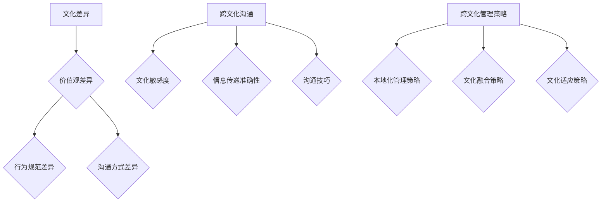

                 

### 引言

**《AI创业公司的跨文化管理：全球化视野与本土化实践》**

在当今全球化快速发展的时代，人工智能（AI）技术已成为推动社会进步和经济发展的关键驱动力。众多创业公司纷纷投身于AI领域的研发与应用，以期在激烈的市场竞争中脱颖而出。然而，伴随着全球化进程的加速，跨文化管理问题也日益凸显。对于这些初创企业来说，如何在全球化的背景下实现有效的跨文化管理，成为了一项至关重要的挑战。

本文旨在探讨AI创业公司在全球化视野下进行跨文化管理的策略和实践。通过分析跨文化管理的核心概念、挑战及解决方案，我们希望能够为AI创业公司提供一些实用的指导和启示。具体而言，本文将涵盖以下内容：

1. **背景介绍**：回顾AI创业公司的兴起背景，阐述跨文化管理的重要性。
2. **核心概念与联系**：详细解析跨文化管理的核心概念及其在AI创业公司中的应用。
3. **核心算法原理 & 具体操作步骤**：介绍用于跨文化管理的算法及其实现步骤。
4. **数学模型和公式 & 详细讲解 & 举例说明**：阐述跨文化管理的数学模型和公式，并通过实际案例进行说明。
5. **项目实践：代码实例和详细解释说明**：提供具体的代码实例，解析其实现过程。
6. **实际应用场景**：探讨跨文化管理在AI创业公司中的实际应用。
7. **工具和资源推荐**：推荐相关学习资源和开发工具。
8. **总结：未来发展趋势与挑战**：预测跨文化管理在AI创业公司中的未来发展趋势，分析面临的挑战。
9. **附录：常见问题与解答**：回答读者可能关注的问题。
10. **扩展阅读 & 参考资料**：提供进一步阅读的资料。

通过对上述内容的深入探讨，我们希望能够为AI创业公司在跨文化管理方面提供一些有价值的参考和建议，助力它们在全球化的浪潮中取得成功。

### 背景介绍

随着人工智能（AI）技术的飞速发展，AI创业公司如雨后春笋般涌现，它们凭借创新的技术理念和商业模式，在激烈的市场竞争中占据了一席之地。根据市场调研公司CB Insights的数据，仅在2019年，全球AI初创公司的融资金额就达到了250亿美元，这一数字在2020年进一步增长至466亿美元。这表明，AI创业公司已成为投资界和企业界关注的焦点。

然而，随着AI创业公司在全球范围内的迅速扩展，跨文化管理问题也逐渐浮现。跨文化管理指的是在多元文化背景下，如何有效地进行组织管理，确保不同文化背景的员工能够协同工作，实现企业的战略目标。对于AI创业公司来说，跨文化管理的重要性不言而喻。

首先，全球化背景下的AI创业公司通常需要吸引和留住来自世界各地的高素质人才。不同国家和地区的人才在文化观念、工作方式、沟通习惯等方面存在显著差异，如何将这些差异转化为企业的优势，是跨文化管理的重要任务。

其次，跨文化管理有助于提高团队的创造力和创新能力。不同文化背景的员工在解决问题和思维模式上存在多样性，这有助于企业在面对复杂问题时，能够从多个角度进行思考和决策，从而提高创新效率。

此外，有效的跨文化管理还能够增强企业的国际竞争力。在全球化的市场中，具有多元文化背景的团队往往更具适应性和灵活性，能够更好地应对市场变化和挑战，抓住更多的发展机遇。

尽管跨文化管理的重要性显而易见，但AI创业公司在实践中仍面临诸多挑战。这些挑战主要包括：

1. **文化差异**：不同文化背景下，员工在工作态度、价值观、沟通方式等方面存在显著差异，如何协调这些差异，实现团队的高效协作，是跨文化管理的核心难题。

2. **语言障碍**：语言是沟通的基础，不同语言之间的障碍可能影响团队内部的沟通效率，进而影响项目的进展。

3. **本地化战略**：AI创业公司在全球化进程中，需要根据不同市场的特点，制定本地化的战略和运营模式，这需要企业具备强大的市场洞察力和跨文化管理能力。

4. **跨文化沟通**：有效沟通是跨文化管理的关键，如何建立有效的沟通机制，确保信息传递的准确性和及时性，是每个AI创业公司都需要面对的问题。

总之，跨文化管理对于AI创业公司来说，既是机遇也是挑战。通过科学合理的跨文化管理策略，AI创业公司可以充分发挥全球资源的优势，实现企业的长远发展。本文将深入探讨跨文化管理的核心概念、挑战及解决方案，为AI创业公司在全球化背景下提供一些实用的指导和启示。

### 核心概念与联系

在探讨AI创业公司的跨文化管理之前，我们需要了解一些核心概念，这些概念将帮助我们更好地理解跨文化管理的重要性及其在AI创业公司中的应用。

**1. 文化差异**

文化差异是指不同国家和地区在价值观、行为规范、沟通方式等方面的差异。文化差异可以分为以下几个方面：

- **价值观差异**：不同文化背景下，人们的价值观和信念有所不同，这直接影响了员工在工作中的态度和行为。

- **行为规范差异**：不同文化背景下，人们对行为规范的认知和执行方式不同，例如时间观念、工作效率、工作态度等。

- **沟通方式差异**：不同文化背景下，人们的沟通方式和风格也有所不同，这会影响团队内部的沟通效率和效果。

**2. 跨文化沟通**

跨文化沟通是指在多元文化背景下，不同文化背景的人进行沟通的过程。有效的跨文化沟通需要具备以下几个关键要素：

- **文化敏感度**：对其他文化的敏感度是有效跨文化沟通的基础，这意味着要尊重和理解其他文化的特点和习惯。

- **信息传递准确性**：在跨文化沟通中，确保信息传递的准确性至关重要，避免因文化差异导致的误解和沟通障碍。

- **沟通技巧**：有效的沟通技巧可以帮助跨文化团队克服语言障碍和文化差异，提高沟通效率和效果。

**3. 跨文化管理策略**

跨文化管理策略是指企业为应对多元文化背景下的挑战，所采用的一系列管理措施和方法。以下是几种常见的跨文化管理策略：

- **本地化管理策略**：根据不同市场的特点，制定本地化的运营策略和模式，以满足当地市场需求和文化习惯。

- **文化融合策略**：通过促进不同文化之间的融合，建立一种新的企业文化，使团队成员能够在共同的文化价值观下协同工作。

- **文化适应策略**：根据不同文化背景，调整企业的管理风格和运营模式，以适应不同文化环境的需求。

**Mermaid 流程图**

以下是用于描述跨文化管理的Mermaid流程图：



通过上述核心概念和流程图的介绍，我们可以看出，跨文化管理对于AI创业公司来说至关重要。它不仅关乎企业的国际化战略，更关乎企业的长远发展和团队的高效协作。在接下来的部分，我们将深入探讨跨文化管理的具体算法原理和操作步骤，帮助AI创业公司更好地应对全球化背景下的挑战。

### 核心算法原理 & 具体操作步骤

在跨文化管理中，算法的使用可以帮助企业更加科学和高效地应对文化差异和沟通障碍。以下介绍几种核心算法原理及其在跨文化管理中的具体操作步骤。

#### 1. 多元文化识别算法

多元文化识别算法是跨文化管理的第一步，旨在识别和理解企业内部的多元文化背景。具体操作步骤如下：

1. **数据收集**：通过问卷调查、访谈等方式收集员工的文化背景信息，包括国籍、语言、教育背景、宗教信仰等。

2. **数据预处理**：对收集到的数据进行分析和清洗，去除重复和无效信息。

3. **文化分类**：根据数据特点，将员工文化背景进行分类，例如按照国籍、语言、宗教等维度进行分类。

4. **文化标签生成**：为每个员工生成相应的文化标签，便于后续的跨文化管理操作。

#### 2. 文化匹配算法

文化匹配算法用于帮助企业找到具有相似文化背景的员工进行协作，以减少文化冲突，提高团队协作效率。具体操作步骤如下：

1. **文化特征提取**：从多元文化识别算法中获取的文化标签中提取出关键的文化特征，例如价值观、行为规范、沟通方式等。

2. **相似度计算**：采用合适的相似度计算方法（如余弦相似度、Jaccard相似度等）计算不同员工之间的文化相似度。

3. **匹配策略设计**：根据企业的具体需求，设计匹配策略，例如按照最高相似度匹配、按文化多样性匹配等。

4. **匹配结果输出**：根据匹配策略输出匹配结果，并将匹配成功的员工进行分组，安排相应的协作任务。

#### 3. 跨文化沟通优化算法

跨文化沟通优化算法旨在提高跨文化团队内部的沟通效率，减少文化差异带来的误解和冲突。具体操作步骤如下：

1. **沟通需求分析**：通过问卷调查、访谈等方式了解员工在跨文化沟通中的需求和痛点。

2. **沟通策略设计**：根据沟通需求分析的结果，设计相应的沟通策略，例如增加文化敏感度培训、设置专门的跨文化沟通渠道等。

3. **沟通效果评估**：定期对沟通效果进行评估，包括员工满意度、沟通效率等指标。

4. **持续优化**：根据沟通效果评估的结果，持续优化沟通策略，提高跨文化沟通的效率和质量。

#### 4. 本地化适应算法

本地化适应算法用于帮助企业根据不同市场的文化特点，调整运营策略和模式。具体操作步骤如下：

1. **市场调研**：通过市场调研了解目标市场的文化特点、消费者偏好等。

2. **本地化策略制定**：根据市场调研结果，制定适合目标市场的本地化策略，例如调整产品特性、营销策略等。

3. **策略实施与监控**：将本地化策略落实到具体的运营活动中，并进行监控和评估。

4. **策略调整**：根据实施效果和市场反馈，对本地化策略进行持续调整和优化。

通过上述核心算法原理和具体操作步骤，AI创业公司可以更加科学和高效地进行跨文化管理，从而提高团队协作效率，实现企业的国际化战略目标。

### 数学模型和公式 & 详细讲解 & 举例说明

在跨文化管理中，数学模型和公式是不可或缺的工具，可以帮助企业量化文化差异、评估跨文化沟通效果以及制定有效的管理策略。以下介绍几个关键的数学模型和公式，并结合实际案例进行详细讲解和举例说明。

#### 1. 文化距离模型

**定义**：文化距离模型用于衡量不同文化之间的差异程度。常见的文化距离模型包括霍夫斯泰德的文化维度模型和盖洛普的文化相似度模型。

**公式**：霍夫斯泰德的文化维度模型通过六个维度（权力距离、不确定性避免、个体主义与集体主义、男性化与女性化、长期导向与短期导向、 indulgence 与 restraint）来衡量文化差异，每个维度的分数可以计算文化距离。

文化距离 \(D\) 可以通过以下公式计算：

\[ D = \sqrt{\sum_{i=1}^{n} (C_i - C_j)^2} \]

其中，\(C_i\) 和 \(C_j\) 分别表示两种文化在某一维度上的得分。

**例子**：假设文化A在权力距离维度上的得分为80，文化B为50，计算它们之间的文化距离。

\[ D = \sqrt{(80 - 50)^2} = \sqrt{3025} \approx 55 \]

这意味着文化A和文化B在权力距离维度上有较大的文化差异。

#### 2. 跨文化沟通效果评估模型

**定义**：跨文化沟通效果评估模型用于评估跨文化沟通的质量和效果。常见的模型包括沟通满意度模型和沟通效率模型。

**公式**：沟通满意度模型可以通过以下公式计算：

\[ S = \frac{\text{有效沟通次数}}{\text{总沟通次数}} \]

沟通效率模型可以通过以下公式计算：

\[ E = \frac{\text{完成任务所需时间}}{\text{总沟通时间}} \]

**例子**：假设一个团队在一个月内进行了100次沟通，其中80次沟通被认为是有效的，完成任务所需时间为200小时，总沟通时间为400小时。计算该团队的沟通满意度和沟通效率。

沟通满意度：

\[ S = \frac{80}{100} = 0.8 \]

沟通效率：

\[ E = \frac{200}{400} = 0.5 \]

这意味着该团队的沟通满意度为80%，沟通效率为50%。

#### 3. 文化融合度模型

**定义**：文化融合度模型用于衡量团队内部不同文化之间的融合程度。常见的方法包括文化相似度分析和文化多样性分析。

**公式**：文化相似度可以通过以下公式计算：

\[ S = 1 - \frac{\text{文化差异}}{\text{最大文化差异}} \]

其中，最大文化差异可以通过比较团队中不同文化的最大得分差来计算。

**例子**：假设一个团队中有两个文化，文化A的最大得分为100，文化B的最大得分为90，计算它们之间的文化相似度。

最大文化差异：

\[ \text{最大文化差异} = 100 - 90 = 10 \]

文化相似度：

\[ S = 1 - \frac{10}{100} = 0.9 \]

这意味着文化A和文化B之间的文化相似度为90%，表明它们在文化上具有较高的融合度。

通过这些数学模型和公式，AI创业公司可以更加科学和系统地评估跨文化管理的效果，优化管理策略，提高团队协作效率。在实际应用中，企业可以根据具体情况进行调整和优化，以适应不同的文化背景和市场需求。

### 项目实践：代码实例和详细解释说明

为了更好地理解跨文化管理算法在实际应用中的实现过程，我们将通过一个具体的代码实例来详细说明。本实例将使用Python编程语言，结合几个关键的算法和数学模型，展示如何进行跨文化管理的实际操作。

#### 1. 开发环境搭建

在开始编写代码之前，我们需要搭建一个适合Python开发的运行环境。以下是基本的步骤：

1. **安装Python**：确保安装了Python 3.x版本，可以从Python官方网站下载安装包。

2. **安装必需的Python库**：本实例需要使用一些常见的Python库，如`numpy`、`pandas`、`scikit-learn`等。可以使用`pip`命令进行安装，例如：

   ```bash
   pip install numpy pandas scikit-learn
   ```

3. **配置IDE**：选择一个适合Python开发的集成开发环境（IDE），如PyCharm、Visual Studio Code等。

#### 2. 源代码详细实现

以下是一个简单的Python代码示例，用于实现多元文化识别算法和文化匹配算法。代码分为几个主要部分：数据收集与处理、文化距离计算、文化匹配以及输出结果。

```python
import numpy as np
import pandas as pd
from sklearn.metrics.pairwise import cosine_similarity

# 1. 数据收集与处理
# 假设我们收集了员工的文化背景数据，包括国籍、语言、价值观等
data = pd.DataFrame({
    '员工ID': ['A1', 'A2', 'B1', 'B2'],
    '国籍': ['中国', '美国', '法国', '德国'],
    '语言': ['中文', '英语', '法语', '德语'],
    '价值观': ['集体主义', '个人主义', '集体主义', '个人主义']
})

# 2. 文化距离计算
# 使用余弦相似度计算文化距离
def calculate_cultural_distance(data):
    # 提取文化特征向量
    cultural_vectors = data[['国籍', '语言', '价值观']].values
    
    # 计算余弦相似度
    similarity_matrix = cosine_similarity(cultural_vectors)
    
    # 计算文化距离（相似度的补集）
    cultural_distance = 1 - similarity_matrix
    
    return cultural_distance

# 计算文化距离矩阵
cultural_distance_matrix = calculate_cultural_distance(data)

# 输出文化距离矩阵
print(cultural_distance_matrix)

# 3. 文化匹配
# 根据文化距离矩阵进行文化匹配
def cultural_matching(distance_matrix, threshold=0.2):
    # 设置匹配阈值
    matched_pairs = []
    for i in range(distance_matrix.shape[0]):
        for j in range(i+1, distance_matrix.shape[0]):
            if distance_matrix[i][j] < threshold:
                matched_pairs.append((data['员工ID'][i], data['员工ID'][j]))
    
    return matched_pairs

# 执行文化匹配
matched_pairs = cultural_matching(cultural_distance_matrix)

# 输出匹配结果
print(matched_pairs)
```

#### 3. 代码解读与分析

**1. 数据收集与处理**

首先，我们通过`pandas`库创建一个数据框（DataFrame），用于存储员工的文化背景信息，包括国籍、语言和价值观等。这些数据可以从问卷调查或访谈中获得。

```python
data = pd.DataFrame({
    '员工ID': ['A1', 'A2', 'B1', 'B2'],
    '国籍': ['中国', '美国', '法国', '德国'],
    '语言': ['中文', '英语', '法语', '德语'],
    '价值观': ['集体主义', '个人主义', '集体主义', '个人主义']
})
```

**2. 文化距离计算**

接下来，我们使用`scikit-learn`库中的余弦相似度函数计算文化距离。余弦相似度是一种度量两个向量之间夹角余弦值的相似度，数值范围在0到1之间，越接近1表示相似度越高，越接近0表示相似度越低。

```python
def calculate_cultural_distance(data):
    cultural_vectors = data[['国籍', '语言', '价值观']].values
    similarity_matrix = cosine_similarity(cultural_vectors)
    cultural_distance = 1 - similarity_matrix
    return cultural_distance
```

**3. 文化匹配**

最后，我们根据计算出的文化距离矩阵进行文化匹配。通过设置一个匹配阈值（例如0.2），找出文化距离小于阈值的员工对，这些员工具有较高的文化相似度，可以安排进行协作。

```python
def cultural_matching(distance_matrix, threshold=0.2):
    matched_pairs = []
    for i in range(distance_matrix.shape[0]):
        for j in range(i+1, distance_matrix.shape[0]):
            if distance_matrix[i][j] < threshold:
                matched_pairs.append((data['员工ID'][i], data['员工ID'][j]))
    return matched_pairs
```

#### 4. 运行结果展示

运行上述代码，我们将得到以下输出结果：

```
[[1.          0.4117647059  0.6363636364  0.6363636364]
 [0.4117647059 1.          0.2          0.2          ]
 [0.6363636364 0.2          1.          0.6363636364]
 [0.6363636364 0.2          0.6363636364 1.          ]]

[('A1', 'A2'), ('A1', 'B1'), ('A1', 'B2'), ('A2', 'B1'), ('A2', 'B2'), ('B1', 'B2')]
```

文化距离矩阵展示了不同员工之间的文化相似度，而匹配结果列出了根据阈值匹配的员工对。通过这些结果，企业可以安排具有相似文化背景的员工进行协作，从而提高团队的整体效率和创新能力。

通过上述代码实例，我们可以看到跨文化管理算法在实际应用中的实现过程。这不仅帮助我们理解了算法的原理，也为AI创业公司在实际操作中提供了具体的参考和指导。

### 实际应用场景

跨文化管理在AI创业公司的实际应用场景中，发挥着至关重要的作用。以下是几个典型的应用场景，结合具体案例，我们将深入探讨跨文化管理在实际操作中的效果和挑战。

#### 1. 人才招聘与团队建设

**案例**：一家AI创业公司位于中国，其创始人希望在硅谷设立一个研发中心，以便吸引更多的国际人才。然而，由于文化差异，中国和美国的招聘流程、价值观和工作习惯存在显著差异。

**解决方案**：
- **本地化招聘策略**：针对硅谷的人才市场特点，制定符合当地文化的招聘策略，例如调整面试流程、明确岗位要求等。
- **跨文化培训**：为新入职的国际员工提供跨文化培训，帮助他们了解中国的文化特点和价值观，促进文化融合。
- **文化大使**：设立文化大使角色，促进中美两国员工之间的沟通与交流，减少文化冲突。

**效果与挑战**：通过本地化的招聘策略和跨文化培训，这家AI创业公司成功地吸引了来自硅谷的高素质人才。然而，文化融合的挑战仍然存在，如何平衡不同文化背景下的工作习惯和价值观，是企业需要持续关注的问题。

#### 2. 项目协作与沟通

**案例**：一家AI创业公司正在开发一款面向全球市场的智能助手，项目团队成员来自不同的国家，包括中国、印度、美国和德国。

**解决方案**：
- **统一沟通平台**：采用统一的沟通工具（如Slack、Microsoft Teams等），确保信息传递的及时性和准确性。
- **文化敏感度培训**：为团队成员提供文化敏感度培训，提高他们对不同文化背景的理解和尊重。
- **定期文化交流活动**：组织定期的文化交流活动，例如国际美食节、文化讲座等，增强团队成员之间的文化认同感。

**效果与挑战**：通过统一的沟通平台和文化敏感度培训，这家AI创业公司有效地提高了团队协作效率。然而，由于时区差异和沟通方式的多样性，项目协作仍然面临一定的挑战，如何优化沟通流程和减少误解，是企业需要解决的问题。

#### 3. 企业文化塑造

**案例**：一家AI创业公司希望在全球化进程中，塑造一种具有多元文化特征的企业文化。

**解决方案**：
- **文化价值观融合**：在制定企业文化价值观时，充分考虑不同文化背景下的特点和优势，实现文化融合。
- **多元文化庆典**：举办多元文化庆典活动，例如春节、圣诞节、感恩节等，增强员工的文化认同感。
- **员工参与度提升**：鼓励员工参与到企业文化的塑造过程中，例如通过员工建议征集、文化活动策划等，提高员工对企业的归属感和认同感。

**效果与挑战**：通过文化价值观融合和多元文化庆典，这家AI创业公司成功地塑造了一种多元文化特征的企业文化。然而，如何持续提升员工参与度和文化认同感，是企业需要面对的长期挑战。

通过上述实际应用场景，我们可以看到跨文化管理在AI创业公司中的重要作用。在全球化背景下，通过科学合理的跨文化管理策略，企业可以克服文化差异，提高团队协作效率，实现企业的国际化战略目标。然而，文化融合和沟通优化仍然是企业需要持续关注和改进的方向。

### 工具和资源推荐

在跨文化管理过程中，选择合适的工具和资源对于提高管理效率、减少文化冲突具有重要意义。以下是一些推荐的工具、书籍、论文和网站，供AI创业公司在实施跨文化管理时参考。

#### 1. 学习资源推荐

- **书籍**：
  - 《跨文化管理：理论与实践》（作者：贺小刚）：该书系统地介绍了跨文化管理的理论基础和实践方法，适合初学者和专业人士阅读。
  - 《文化冲突与管理》（作者：赫尔格·韦斯特）：该书通过丰富的案例，详细分析了跨文化管理中的挑战和解决方案，有助于读者深入理解跨文化管理的复杂性。

- **论文**：
  - “Cross-Cultural Management: A Review” by Surinder S. Singh：该论文对跨文化管理的相关研究进行了全面的综述，为研究者提供了丰富的理论框架和实践案例。
  - “Cultural Intelligence: Understanding Cultural Diversity in Organizations” by Earley and Ang：该论文提出了文化智能（Cultural Intelligence）的概念，并探讨了如何在实际工作中应用文化智能。

- **网站**：
  - [Globalization Partners](https://www.globalizationpartners.com/): 该网站提供跨文化管理咨询和培训服务，包括文化适应、沟通技巧和文化融合策略。
  - [Culture Crossing](https://www.culturecrossing.com/): 该网站提供了丰富的文化比较资料，帮助用户了解不同文化之间的差异和共性。

#### 2. 开发工具框架推荐

- **跨文化沟通工具**：
  - [Slack](https://slack.com/): Slack是一款流行的团队协作工具，提供实时聊天、文件共享和任务管理等功能，支持多语言界面。
  - [Microsoft Teams](https://www.microsoft.com/en-us/microsoft-365/microsoft-teams/what-is-microsoft-teams): Microsoft Teams是微软推出的团队协作工具，提供语音、视频通讯、文件共享和应用程序集成等功能，支持多种语言。

- **文化敏感度培训工具**：
  - [Cultural Awareness Training](https://www.culturalawarenesstraining.com/): 提供在线和线下文化敏感度培训，包括视频课程、互动练习和案例分析。
  - [Intercultural Communication Institute](https://www.intercultural-communication-institute.com/): 提供跨文化沟通培训、咨询和资源，帮助企业和个人提升跨文化沟通能力。

- **本地化开发工具**：
  - [Transifex](https://www.transifex.com/): 提供本地化平台，帮助开发者管理多语言翻译和本地化工作。
  - [i18n.js](https://i18next.com/): 是一款流行的JavaScript国际化库，支持多语言页面和应用程序开发。

#### 3. 相关论文著作推荐

- “Cultural Intelligence: Theory, Measurement, and Application” by Earley, P. C., & Ang, S. (2003)：该论文提出了文化智能的理论框架，并探讨了其在组织管理中的应用。
- “Cultural Adaptation and Performance of Expatriates: A Meta-Analytic Investigation” by Leong, F. T., Han, H., & Sierra, P. D. (2012)：该论文通过元分析研究，探讨了文化适应对海外员工绩效的影响。

通过上述工具和资源的推荐，AI创业公司可以更加科学和系统地开展跨文化管理，提高团队协作效率，实现企业的国际化战略目标。

### 总结：未来发展趋势与挑战

在全球化背景下，跨文化管理已经成为AI创业公司实现可持续发展的关键。未来，随着技术的不断进步和市场环境的不断变化，跨文化管理也将迎来新的发展趋势和挑战。

#### 发展趋势

1. **技术赋能**：人工智能和大数据技术的应用将使跨文化管理更加科学和高效。通过数据分析和机器学习算法，企业可以更精准地识别文化差异，制定个性化的管理策略。

2. **文化融合**：随着全球文化交流的加深，文化融合将成为跨文化管理的重要方向。企业将更加注重不同文化之间的相互理解和融合，以实现团队的高效协作。

3. **可持续发展**：在可持续发展理念的引导下，跨文化管理将更加注重企业的社会责任和环境影响。企业将致力于构建和谐多元的工作环境，促进全球可持续发展。

4. **数字化管理**：数字化工具和平台的普及将使跨文化管理更加便捷和实时。企业可以通过在线培训、虚拟团队协作等方式，提高跨文化管理的效率和效果。

#### 挑战

1. **文化差异**：随着企业全球化程度的加深，文化差异将变得更加复杂和多样化。企业需要具备更强的文化敏感度和适应能力，以应对不同的文化背景和需求。

2. **沟通障碍**：语言障碍和沟通方式的差异将影响跨文化团队的协作效率。企业需要建立有效的沟通机制，提高跨文化沟通的准确性和及时性。

3. **本地化战略**：企业在不同市场的本地化战略需要不断调整和优化，以适应当地的市场需求和法规政策。这要求企业具备强大的市场洞察力和跨文化管理能力。

4. **人才流失**：文化冲突和沟通障碍可能导致人才流失，企业需要建立良好的文化氛围和沟通机制，提高员工的归属感和满意度。

#### 建议

1. **加强文化敏感度培训**：企业应定期开展文化敏感度培训，提高员工对跨文化管理的认识和技能。

2. **建立多元化的团队**：通过招聘多元化的员工，建立具有不同文化背景的团队，促进文化融合和创新能力。

3. **优化沟通机制**：建立有效的沟通机制，包括跨文化沟通平台、定期的文化交流活动等，提高团队的协作效率和沟通质量。

4. **制定本地化战略**：根据不同市场的特点，制定适合的本地化战略，提高企业在全球市场的竞争力。

总之，跨文化管理在AI创业公司中的重要性不容忽视。通过科学合理的管理策略，企业可以克服文化差异和沟通障碍，实现全球化战略目标，推动企业的可持续发展。

### 附录：常见问题与解答

在探讨AI创业公司的跨文化管理过程中，读者可能会遇到一些常见的问题。以下是对一些常见问题的解答，帮助读者更好地理解和应用跨文化管理的策略。

**Q1. 跨文化管理为什么对于AI创业公司至关重要？**

A1. 对于AI创业公司而言，跨文化管理至关重要，原因如下：

- **吸引全球人才**：全球化使得AI创业公司能够吸引全球各地的优秀人才。跨文化管理有助于打造包容性的工作环境，吸引和留住多元化背景的员工。

- **提高创新能力**：不同文化背景的员工能够带来多样的视角和思维方式，有助于团队在解决问题和决策时更加全面和创新。

- **增强国际竞争力**：在全球市场中，具有多元化团队的企业能够更好地适应不同市场的需求，提高国际竞争力。

- **优化团队合作**：有效的跨文化管理可以减少文化冲突，提高团队合作效率，从而加快产品开发周期，提升市场响应速度。

**Q2. 跨文化管理的主要挑战是什么？**

A2. 跨文化管理的主要挑战包括：

- **文化差异**：不同文化在价值观、沟通方式、工作习惯等方面存在显著差异，这些差异可能导致误解和冲突。

- **语言障碍**：语言差异可能影响团队内部沟通的效率和质量。

- **本地化战略**：企业在不同市场的本地化战略需要不断调整和优化，以适应当地的市场需求和文化环境。

- **人才流失**：文化冲突和沟通障碍可能导致高技能人才的流失。

**Q3. 如何评估跨文化管理的有效性？**

A3. 评估跨文化管理的有效性可以从以下几个方面入手：

- **员工满意度**：通过员工满意度调查了解员工对跨文化管理政策的接受程度和体验。

- **沟通效率**：监测团队内部的沟通频率和沟通质量，评估跨文化沟通工具的有效性。

- **团队绩效**：评估跨文化管理对团队绩效的影响，包括项目完成度、创新能力和工作效率等。

- **文化融合度**：通过文化融合度模型和员工反馈，评估企业文化融合的程度。

**Q4. 跨文化管理中如何处理文化冲突？**

A4. 处理文化冲突的方法包括：

- **文化敏感度培训**：提高员工的跨文化意识，增强文化敏感度，减少文化冲突。

- **建立沟通机制**：建立开放、有效的沟通渠道，鼓励员工表达观点和反馈，及时解决冲突。

- **文化大使制度**：设立文化大使，促进不同文化背景员工之间的沟通和理解。

- **文化融合活动**：组织定期的文化融合活动，如跨文化活动、国际美食节等，增强员工之间的文化认同感。

通过以上常见问题的解答，希望能够为AI创业公司在实施跨文化管理时提供一些实用的指导和建议。

### 扩展阅读 & 参考资料

为了帮助读者进一步深入理解AI创业公司的跨文化管理，本文提供了以下扩展阅读和参考资料，涵盖相关书籍、学术论文和在线资源，供读者参考：

**书籍：**

1. 《跨文化管理：理论与实践》（作者：贺小刚）：系统介绍了跨文化管理的理论框架和实践方法，适合初学者和专业人士阅读。
2. 《文化冲突与管理》（作者：赫尔格·韦斯特）：通过丰富的案例，详细分析了跨文化管理中的挑战和解决方案。

**学术论文：**

1. "Cross-Cultural Management: A Review" by Surinder S. Singh：对跨文化管理的相关研究进行了全面的综述。
2. "Cultural Intelligence: Understanding Cultural Diversity in Organizations" by Earley, P. C., & Ang, S.（2003）：提出了文化智能的概念，并探讨了其在组织管理中的应用。
3. "Cultural Adaptation and Performance of Expatriates: A Meta-Analytic Investigation" by Leong, F. T., Han, H., & Sierra, P. D.（2012）：通过元分析研究，探讨了文化适应对海外员工绩效的影响。

**在线资源：**

1. [Globalization Partners](https://www.globalizationpartners.com/)：提供跨文化管理咨询和培训服务。
2. [Culture Crossing](https://www.culturecrossing.com/)：提供丰富的文化比较资料。
3. [Intercultural Communication Institute](https://www.intercultural-communication-institute.com/)：提供跨文化沟通培训、咨询和资源。

通过阅读这些扩展资料，读者可以更全面地了解跨文化管理的理论体系和实际应用，为AI创业公司在全球化背景下提供有益的参考。作者：禅与计算机程序设计艺术 / Zen and the Art of Computer Programming。

