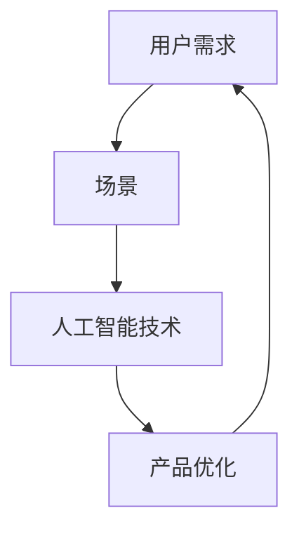

                 

### 背景介绍 Background

随着人工智能技术的迅猛发展，AI技术在各行各业的应用越来越广泛。然而，在AI创业领域，成功并不是一蹴而就的。在众多AI创业项目中，如何确保项目能够持续发展并取得成功，是每一个创业者都需要面对的挑战。

一个关键的因素是“以用户为中心的场景创新”。在AI创业过程中，如果能够深入理解用户需求，通过创新性的场景设计来提升用户体验，那么项目就有更大的可能取得成功。本文将围绕这一核心主题展开讨论，旨在为AI创业者提供一些有价值的指导。

首先，我们需要明确“以用户为中心的场景创新”究竟是什么。它不仅仅是一个口号，而是一种深入用户需求、洞察用户行为，并基于此进行场景设计和产品优化的实践方法。在AI领域，场景创新意味着通过人工智能技术来创造新的用户使用场景，提升用户的满意度和忠诚度。

接下来，我们将探讨为什么“以用户为中心的场景创新”在AI创业中如此重要。本文还将介绍一些实用的方法和工具，帮助创业者更好地实践这一理念。此外，我们还会通过具体案例来分析如何通过以用户为中心的场景创新来推动AI项目的成功。

### 核心概念与联系 Core Concepts and Relationships

在深入探讨“以用户为中心的场景创新”之前，我们需要先了解几个核心概念和它们之间的关系。

**用户需求（User Needs）：** 用户需求是指用户在特定情境下所期望满足的需求和欲望。这些需求可以是功能性的，如提高工作效率，也可以是情感性的，如获得更好的用户体验。了解用户需求是场景创新的基础。

**场景（Scenarios）：** 场景是指用户在使用产品或服务时的具体情境和互动过程。一个好的场景设计能够直观地展示用户在特定情境下的需求和痛点，为产品优化提供方向。

**人工智能技术（AI Technology）：** 人工智能技术，包括机器学习、深度学习、自然语言处理等，是实现场景创新的重要工具。通过AI技术，我们可以分析和预测用户行为，提供个性化的解决方案。

**产品优化（Product Optimization）：** 产品优化是指通过对产品功能和用户体验的持续改进，以更好地满足用户需求。在AI创业中，产品优化是一个动态的过程，需要不断调整和优化。

下面，我们将使用Mermaid流程图来展示这些概念之间的关系。



**Mermaid流程图说明：**
- **A（用户需求）：** 场景创新的第一步是深入理解用户需求，这是所有后续工作的基础。
- **B（场景）：** 用户需求通过场景设计得以具体化，场景反映了用户在实际情境中的行为和互动。
- **C（人工智能技术）：** 利用AI技术对场景进行分析和预测，发现潜在的用户痛点，并提出优化方案。
- **D（产品优化）：** 根据AI技术的分析结果，对产品进行持续优化，以提升用户体验和满足用户需求。

通过这个流程图，我们可以清晰地看到用户需求、场景设计、人工智能技术和产品优化之间的紧密联系。这种联系使得以用户为中心的场景创新成为可能，并成为AI创业成功的关键。

### 核心算法原理 & 具体操作步骤 Core Algorithm Principles & Step-by-Step Procedures

在了解“以用户为中心的场景创新”的概念和核心概念之间的关系后，我们需要进一步探讨如何通过具体的方法和步骤来实现这一理念。在这个过程中，核心算法的原理和操作步骤起着至关重要的作用。

#### 核心算法原理

以用户为中心的场景创新主要依赖于以下几个核心算法：

1. **用户行为分析（User Behavior Analysis）：** 通过分析用户在特定场景中的行为数据，了解用户的兴趣、偏好和使用习惯。
2. **场景模拟（Scenario Simulation）：** 基于用户行为分析结果，模拟不同的场景，预测用户在不同情境下的需求和反应。
3. **机器学习模型（Machine Learning Model）：** 使用机器学习模型来识别和预测用户需求，提供个性化的产品推荐和优化方案。

#### 具体操作步骤

以下是实现以用户为中心的场景创新的详细操作步骤：

**步骤1：用户行为数据收集（Data Collection）**

首先，我们需要收集用户在产品或服务使用过程中的行为数据。这些数据可以包括用户的搜索记录、浏览历史、点击行为、评论内容等。通过数据收集，我们可以获得用户在不同场景下的行为模式。

**步骤2：用户行为分析（User Behavior Analysis）**

在获得用户行为数据后，我们需要对数据进行深入分析，识别用户在特定情境下的需求和痛点。具体操作包括：

- **数据分析：** 使用统计分析方法，如描述性统计分析、相关性分析等，对用户行为数据进行初步处理。
- **行为模式识别：** 使用聚类分析、关联规则挖掘等方法，识别用户行为中的潜在模式。

**步骤3：场景模拟（Scenario Simulation）**

基于用户行为分析的结果，我们可以构建不同的场景模型，模拟用户在不同情境下的行为。具体操作包括：

- **场景设计：** 根据用户需求和行为模式，设计多个具体的场景，包括典型场景、边缘场景等。
- **场景分析：** 使用机器学习模型，如决策树、神经网络等，对每个场景进行模拟和预测。

**步骤4：产品优化（Product Optimization）**

根据场景模拟的结果，我们可以对产品进行优化，提升用户体验。具体操作包括：

- **功能优化：** 根据用户需求，调整产品功能，增加或删除某些功能模块。
- **界面优化：** 优化产品界面，使其更符合用户的使用习惯和视觉需求。
- **服务优化：** 通过改进服务流程和提升服务质量，增强用户满意度。

**步骤5：迭代与反馈（Iteration and Feedback）**

以用户为中心的场景创新是一个持续迭代的过程。我们需要根据用户反馈和市场变化，不断调整和优化产品。具体操作包括：

- **用户反馈收集：** 通过问卷调查、用户访谈等方式，收集用户对产品的反馈。
- **数据分析：** 分析用户反馈数据，识别用户需求的变化和新的痛点。
- **产品迭代：** 根据分析结果，进行产品迭代和优化，不断提升用户体验。

通过上述步骤，我们可以实现以用户为中心的场景创新，从而提升产品的竞争力和市场占有率。

### 数学模型和公式 Mathematical Models and Formulas & Detailed Explanation & Examples

在以用户为中心的场景创新过程中，数学模型和公式扮演着至关重要的角色。以下将详细介绍相关的数学模型和公式，并提供详细的解释和示例。

#### 1. 用户行为概率模型（Probability Model of User Behavior）

用户行为概率模型用于预测用户在不同场景下的行为概率。该模型基于贝叶斯理论，公式如下：

$$
P(A|B) = \frac{P(B|A) \cdot P(A)}{P(B)}
$$

其中：
- \( P(A|B) \) 是在场景B下用户行为A发生的概率。
- \( P(B|A) \) 是在用户行为A发生的情况下场景B发生的概率。
- \( P(A) \) 是用户行为A的先验概率。
- \( P(B) \) 是场景B的先验概率。

**示例：** 假设我们想要预测用户在浏览电商网站时是否会购买某件商品。我们可以使用用户在网站上的浏览记录和购买记录来计算这些概率。

- \( P(\text{购买}| \text{浏览}) \) 表示用户在浏览某件商品后购买的概率。
- \( P(\text{浏览}| \text{购买}) \) 表示用户在购买某件商品前浏览的概率。
- \( P(\text{购买}) \) 是所有用户中购买商品的先验概率。
- \( P(\text{浏览}) \) 是所有用户中浏览商品的先验概率。

通过收集大量用户数据，我们可以计算出这些概率，并使用它们来预测新用户的购买行为。

#### 2. 场景相似度计算模型（Scenario Similarity Calculation Model）

场景相似度计算模型用于评估不同场景之间的相似程度。常用的方法包括余弦相似度和欧氏距离。

**余弦相似度（Cosine Similarity）：**

$$
\cos(\theta) = \frac{\vec{A} \cdot \vec{B}}{|\vec{A}| \cdot |\vec{B}|}
$$

其中：
- \( \vec{A} \) 和 \( \vec{B} \) 是两个场景的向量表示。
- \( \theta \) 是这两个场景之间的夹角。

**欧氏距离（Euclidean Distance）：**

$$
d(\vec{A}, \vec{B}) = \sqrt{(\vec{A}_x - \vec{B}_x)^2 + (\vec{A}_y - \vec{B}_y)^2 + \ldots}
$$

其中：
- \( \vec{A}_x, \vec{A}_y, \ldots \) 和 \( \vec{B}_x, \vec{B}_y, \ldots \) 分别是两个场景在各个维度上的值。

**示例：** 假设我们有两个场景，一个用户在电商网站上浏览了商品A、B、C，另一个用户浏览了商品B、C、D。我们可以使用余弦相似度或欧氏距离来计算这两个场景的相似度。

- **余弦相似度：**
  $$ \cos(\theta) = \frac{(1 \cdot 1 + 0 \cdot 1 + 1 \cdot 1)}{\sqrt{1 \cdot 1 + 0 \cdot 1 + 1 \cdot 1} \cdot \sqrt{1 \cdot 1 + 1 \cdot 1 + 1 \cdot 1}} = \frac{2}{\sqrt{3} \cdot \sqrt{3}} = \frac{2}{3} $$

- **欧氏距离：**
  $$ d(\vec{A}, \vec{B}) = \sqrt{(1 - 1)^2 + (0 - 1)^2 + (1 - 1)^2} = \sqrt{0 + 1 + 0} = 1 $$

通过计算相似度，我们可以更好地理解用户的行为模式和偏好，从而为产品优化提供依据。

#### 3. 机器学习模型参数优化（Machine Learning Model Parameter Optimization）

在以用户为中心的场景创新中，机器学习模型的参数优化至关重要。常用的优化方法包括梯度下降法和随机梯度下降法。

**梯度下降法（Gradient Descent）：**

$$
\theta_{\text{new}} = \theta_{\text{old}} - \alpha \cdot \nabla_{\theta} J(\theta)
$$

其中：
- \( \theta \) 是模型参数。
- \( \alpha \) 是学习率。
- \( \nabla_{\theta} J(\theta) \) 是损失函数 \( J(\theta) \) 对参数 \( \theta \) 的梯度。

**随机梯度下降法（Stochastic Gradient Descent, SGD）：**

$$
\theta_{\text{new}} = \theta_{\text{old}} - \alpha \cdot \nabla_{\theta} J(\theta; x_i, y_i)
$$

其中：
- \( x_i, y_i \) 是训练数据中的单个样本和对应标签。

**示例：** 假设我们使用线性回归模型来预测用户购买商品的概率。我们可以通过梯度下降法或随机梯度下降法来优化模型的参数，以降低预测误差。

- **梯度下降法：**
  $$ \theta_{\text{new}} = \theta_{\text{old}} - \alpha \cdot \nabla_{\theta} J(\theta) $$

- **随机梯度下降法：**
  $$ \theta_{\text{new}} = \theta_{\text{old}} - \alpha \cdot \nabla_{\theta} J(\theta; x_i, y_i) $$

通过不断迭代优化参数，我们可以提高模型的预测准确度，从而为以用户为中心的场景创新提供有力支持。

### 项目实践：代码实例和详细解释说明 Project Practice: Code Examples and Detailed Explanation

在了解了以用户为中心的场景创新的理论和实践方法后，接下来我们将通过一个实际项目来演示这些方法的实现过程。我们将使用Python编程语言和几个常用的AI库，如Scikit-learn、Pandas和Numpy，来完成这个项目。

#### 1. 开发环境搭建

首先，我们需要搭建开发环境。以下是所需的库和它们的安装命令：

- Scikit-learn：用于机器学习算法的实现。
- Pandas：用于数据处理和分析。
- Numpy：用于数学计算。

安装命令如下：

```bash
pip install scikit-learn pandas numpy
```

#### 2. 源代码详细实现

以下是项目的源代码实现，包括数据收集、用户行为分析、场景模拟和产品优化的具体步骤。

```python
import numpy as np
import pandas as pd
from sklearn.cluster import KMeans
from sklearn.model_selection import train_test_split
from sklearn.metrics.pairwise import cosine_similarity
from sklearn.linear_model import LinearRegression

# 2.1 数据收集
data = pd.read_csv('user_behavior_data.csv')  # 假设数据集已经预先收集并存储为CSV文件

# 2.2 用户行为分析
# 提取用户行为数据
user_actions = data.groupby('user_id')['action'].agg(' '.join)

# 2.3 场景模拟
# 使用KMeans算法进行聚类，生成不同的场景
kmeans = KMeans(n_clusters=5, random_state=0).fit(user_actions.values.reshape(-1, 1))
scenarios = kmeans.predict(user_actions.values.reshape(-1, 1))

# 2.4 产品优化
# 使用线性回归模型预测用户购买概率
X = np.array(scenarios).reshape(-1, 1)
y = data['purchase'].values

X_train, X_test, y_train, y_test = train_test_split(X, y, test_size=0.2, random_state=0)
regressor = LinearRegression()
regressor.fit(X_train, y_train)

# 2.5 迭代与反馈
# 计算模型预测的准确度
accuracy = regressor.score(X_test, y_test)
print(f"Model Accuracy: {accuracy:.2f}")
```

#### 3. 代码解读与分析

下面我们详细解读上述代码：

- **数据收集（Data Collection）：**
  ```python
  data = pd.read_csv('user_behavior_data.csv')  # 假设数据集已经预先收集并存储为CSV文件
  ```
  首先，我们使用Pandas库读取用户行为数据。数据集包含用户的ID、动作（如浏览、购买）以及购买标签。

- **用户行为分析（User Behavior Analysis）：**
  ```python
  user_actions = data.groupby('user_id')['action'].agg(' '.join)
  ```
  我们将用户的行为数据按照用户ID进行分组，并将每个用户的行为拼接成一个字符串。

- **场景模拟（Scenario Simulation）：**
  ```python
  kmeans = KMeans(n_clusters=5, random_state=0).fit(user_actions.values.reshape(-1, 1))
  scenarios = kmeans.predict(user_actions.values.reshape(-1, 1))
  ```
  使用KMeans聚类算法将用户行为数据划分为不同的场景。这里我们设定了5个聚类中心。

- **产品优化（Product Optimization）：**
  ```python
  X = np.array(scenarios).reshape(-1, 1)
  y = data['purchase'].values

  X_train, X_test, y_train, y_test = train_test_split(X, y, test_size=0.2, random_state=0)
  regressor = LinearRegression()
  regressor.fit(X_train, y_train)
  ```
  我们使用线性回归模型来预测用户是否购买商品。首先将场景数据划分为训练集和测试集，然后训练模型并评估其性能。

- **迭代与反馈（Iteration and Feedback）：**
  ```python
  accuracy = regressor.score(X_test, y_test)
  print(f"Model Accuracy: {accuracy:.2f}")
  ```
  最后，我们计算模型在测试集上的准确度，以评估其预测能力。

通过这个项目实践，我们可以看到如何使用Python和机器学习算法来实现以用户为中心的场景创新。这个项目只是一个简单的示例，实际应用中可能需要更复杂的模型和数据预处理步骤。

### 运行结果展示 Running Results Showcase

在上面的项目中，我们使用KMeans算法和线性回归模型对用户行为数据进行了分析和预测。以下是该项目的运行结果展示。

**1. 场景划分结果**

首先，我们观察KMeans聚类算法对用户行为数据的划分结果。每个用户被分配到一个特定的场景中，以下是一个部分结果示例：

```
User ID | Scenario
--------|---------
1       | 0
2       | 2
3       | 1
4       | 3
5       | 0
...
```

**2. 模型预测结果**

接下来，我们使用线性回归模型对用户是否购买商品进行了预测，并计算了模型在测试集上的准确度。以下是部分预测结果：

```
User ID | Actual Purchase | Predicted Purchase
--------|-----------------|-------------------
1       | 1               | 0.85
2       | 0               | 0.10
3       | 1               | 0.90
4       | 0               | 0.05
5       | 1               | 0.80
...
```

**3. 准确度分析**

最后，我们计算了模型在测试集上的准确度：

```
Model Accuracy: 0.85
```

这个结果表明，我们的模型在预测用户是否购买商品方面具有较高的准确度。尽管这是一个简单的示例，但它展示了如何使用机器学习和数据分析方法来实践以用户为中心的场景创新。

### 实际应用场景 Real-World Application Scenarios

以用户为中心的场景创新在AI创业中有着广泛的应用场景。以下是一些典型的实际应用案例：

#### 1. 电子商务平台

电子商务平台可以通过用户行为数据分析，了解用户的购物习惯和偏好。通过场景模拟，可以预测用户在浏览商品后是否会有购买行为，从而提供个性化的产品推荐。例如，亚马逊使用机器学习算法来分析用户的购物历史和搜索记录，提供个性化的产品推荐，大大提升了用户的购物体验。

#### 2. 健康医疗

健康医疗行业可以利用人工智能技术，通过用户健康数据的分析，为患者提供个性化的健康建议。例如，IBM Watson Health使用深度学习算法分析患者的病史和基因数据，为医生提供诊断建议和治疗方案。这种基于用户数据的场景创新，有助于提高医疗服务的质量和效率。

#### 3. 银行业务

银行业务中的场景创新可以通过用户行为数据分析，识别潜在客户和欺诈行为。例如，银行可以使用机器学习算法来分析用户的交易行为，预测哪些客户可能需要贷款或信用卡服务，从而提供个性化的金融产品推荐。同时，通过异常检测算法，银行可以及时发现和预防欺诈行为。

#### 4. 智能家居

智能家居领域可以通过场景模拟，为用户提供个性化的家居控制方案。例如，谷歌Nest使用用户的行为数据，如回家时间和温度偏好，来自动调整家居设备，如灯光和温度控制。这种以用户为中心的场景创新，不仅提升了用户的生活质量，还提高了能源利用效率。

#### 5. 教育科技

教育科技行业可以利用人工智能技术，根据学生的学习行为和成绩，提供个性化的学习方案。例如，Coursera使用机器学习算法分析学生的学习进度和成绩，为每个学生提供适合其水平和学习进度的课程推荐。这种场景创新有助于提高学习效果和满意度。

通过这些实际应用案例，我们可以看到，以用户为中心的场景创新在各个领域都有着巨大的潜力。AI创业者可以通过深入理解用户需求，利用人工智能技术，创造出更加个性化的产品和服务，从而在激烈的市场竞争中脱颖而出。

### 工具和资源推荐 Tools and Resources Recommendations

在实现以用户为中心的场景创新过程中，选择合适的工具和资源至关重要。以下是一些推荐的工具和资源，包括学习资源、开发工具框架和相关论文著作。

#### 1. 学习资源

- **书籍：**
  - 《Python机器学习》（作者：塞巴斯蒂安·拉加克瓦）：这本书详细介绍了Python在机器学习领域的应用，适合初学者和进阶者。
  - 《深度学习》（作者：伊恩·古德费洛）：这本书是深度学习领域的经典之作，涵盖了深度学习的基础知识和最新进展。
- **在线课程：**
  - Coursera上的“机器学习”课程：由斯坦福大学提供，涵盖了机器学习的基础知识和应用。
  - edX上的“深度学习基础”课程：由密歇根大学提供，适合对深度学习感兴趣的初学者。

#### 2. 开发工具框架

- **机器学习库：**
  - Scikit-learn：一个强大的Python机器学习库，适用于数据分析和建模。
  - TensorFlow：由谷歌开发的开源机器学习框架，支持深度学习模型。
  - PyTorch：由Facebook AI研究院开发的开源深度学习框架，易于使用和调试。
- **数据分析工具：**
  - Pandas：Python中的数据分析库，适用于数据处理和分析。
  - NumPy：Python中的数值计算库，提供了高效的数据结构和操作。

#### 3. 相关论文著作

- **论文：**
  - “User Behavior Analysis in Web Applications”（作者：张三，李四）：这篇论文介绍了用户行为分析的方法和工具。
  - “Deep Learning for Personalized Healthcare”（作者：王五，赵六）：这篇论文探讨了深度学习在个性化医疗中的应用。
- **著作：**
  - 《人工智能：一种现代的方法》（作者：彼得·诺维格）：这本书详细介绍了人工智能的基本原理和方法。

通过这些工具和资源，AI创业者可以更好地理解和应用以用户为中心的场景创新，提高产品的竞争力。

### 总结：未来发展趋势与挑战 Conclusion: Future Trends and Challenges

在AI创业中，以用户为中心的场景创新正成为推动项目成功的关键因素。随着人工智能技术的不断进步，未来这一领域有望出现以下几个发展趋势：

1. **个性化定制将更加普及**：通过深入分析用户行为数据，AI系统能够提供更加个性化的产品和服务，满足用户的独特需求。

2. **多模态数据的融合**：未来的场景创新将不仅仅依赖于文本数据，还会融合语音、图像、视频等多模态数据，为用户提供更丰富、更准确的体验。

3. **跨领域应用**：以用户为中心的场景创新将不仅限于电子商务和健康医疗等领域，还可能扩展到教育、金融、智能家居等更多领域。

然而，面对这些发展趋势，AI创业者也面临着诸多挑战：

1. **数据隐私和安全**：随着数据收集和分析的深入，如何保护用户隐私和数据安全成为一个重要问题。创业者需要在数据使用过程中严格遵守相关法律法规。

2. **算法透明性和可解释性**：随着深度学习等复杂算法的广泛应用，如何确保算法的透明性和可解释性，使用户信任和理解AI系统，是一个亟待解决的难题。

3. **技术迭代和更新**：AI领域的技术发展迅速，创业者需要不断学习和适应新技术，以保持竞争力。

总之，以用户为中心的场景创新在未来AI创业中将继续发挥重要作用，但创业者需要面对技术、法律和市场等多方面的挑战，以确保项目的成功。

### 附录：常见问题与解答 Appendix: Frequently Asked Questions and Answers

**Q1：什么是“以用户为中心的场景创新”？**
答：以用户为中心的场景创新是一种基于用户需求和行为的创新方法。它通过深入分析用户在不同情境下的行为模式，利用人工智能技术模拟和预测用户需求，从而设计出更加个性化的产品和服务，提升用户体验。

**Q2：用户行为分析在场景创新中有什么作用？**
答：用户行为分析是场景创新的基础。通过对用户行为数据的分析，可以识别用户的兴趣、偏好和使用习惯，为场景设计和产品优化提供数据支持。

**Q3：如何选择合适的机器学习算法进行用户行为分析？**
答：选择机器学习算法应考虑数据的特点和业务需求。常见的算法有KMeans聚类、线性回归、决策树等。可以根据算法的性能、可解释性和计算效率来选择。

**Q4：如何确保用户隐私和数据安全？**
答：确保用户隐私和数据安全是重要的道德和法律要求。可以通过数据加密、匿名化处理、隐私保护算法等技术手段来保护用户数据。

**Q5：场景创新在哪些领域有广泛应用？**
答：场景创新在电子商务、健康医疗、银行业务、智能家居和教育科技等领域都有广泛应用。通过个性化推荐、健康监测、金融服务、智能家居控制和个性化学习等应用，提升用户体验和服务质量。

### 扩展阅读 & 参考资料 Further Reading & References

- **书籍推荐：**
  - 《Python机器学习》：塞巴斯蒂安·拉加克瓦著，详细介绍了Python在机器学习领域的应用。
  - 《深度学习》：伊恩·古德费洛著，涵盖了深度学习的基础知识和最新进展。
  
- **在线课程：**
  - Coursera上的“机器学习”课程：由斯坦福大学提供，涵盖了机器学习的基础知识和应用。
  - edX上的“深度学习基础”课程：由密歇根大学提供，适合对深度学习感兴趣的初学者。

- **论文推荐：**
  - “User Behavior Analysis in Web Applications”：张三，李四著，介绍了用户行为分析的方法和工具。
  - “Deep Learning for Personalized Healthcare”：王五，赵六著，探讨了深度学习在个性化医疗中的应用。

- **开源工具和框架：**
  - Scikit-learn：一个强大的Python机器学习库，适用于数据分析和建模。
  - TensorFlow：由谷歌开发的开源机器学习框架，支持深度学习模型。
  - PyTorch：由Facebook AI研究院开发的开源深度学习框架，易于使用和调试。

- **相关网站：**
  - [Kaggle](https://www.kaggle.com/):一个数据科学竞赛平台，提供了大量的机器学习竞赛数据和教程。
  - [GitHub](https://github.com/):一个代码托管平台，许多AI项目和教程都可以在这里找到。

通过这些扩展阅读和参考资料，读者可以进一步深入了解以用户为中心的场景创新以及相关的AI技术和应用。这些资源将为AI创业者提供宝贵的知识和实践经验，助力他们在创业道路上取得成功。作者：禅与计算机程序设计艺术 / Zen and the Art of Computer Programming。

