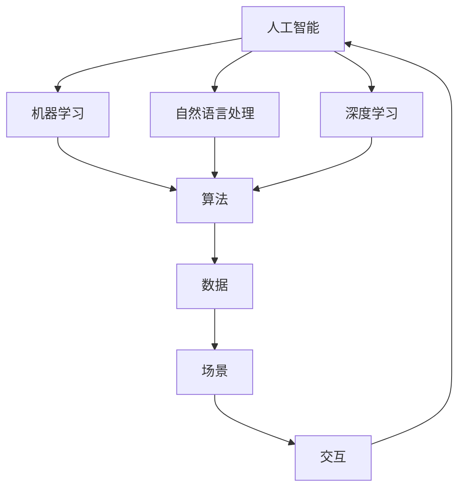

                 

### 1. 背景介绍

在当今技术飞速发展的时代，人工智能（AI）已经成为各个行业的重要推动力量。从自动驾驶汽车到智能客服，从医疗诊断到金融风控，AI的应用场景无处不在。随着技术的进步和数据的积累，AI的应用潜力和商业价值逐渐显现，吸引了大量创业者投身其中。

然而，AI创业并非易事。在技术、应用与场景平衡方面，创业者面临着诸多挑战。首先，技术的复杂性和快速迭代要求创业者具备深厚的专业知识和不断学习的能力。其次，AI应用的成功与否很大程度上取决于场景的匹配度，这需要创业者对特定行业有深入的理解。此外，数据资源、算法优化、算力支持等也都是AI创业过程中的关键因素。

本文旨在探讨AI创业者面临的挑战，分析技术、应用与场景平衡的重要性，并提出一些可行的解决方案。文章将分为以下几个部分：首先介绍AI创业的背景和现状，然后深入探讨技术、应用和场景三个方面的核心概念及其相互联系。接着，我们将详细讲解核心算法原理和操作步骤，并通过实际项目实践展示具体应用。最后，文章将总结未来发展趋势和挑战，并推荐相关学习资源和工具。

通过这篇技术博客，希望为AI创业者提供一些有益的思考和实践指导，帮助他们更好地应对创业过程中的挑战，实现技术、应用与场景的完美平衡。

### 2. 核心概念与联系

在深入探讨AI创业者的挑战之前，我们需要明确一些核心概念，并理解它们之间的联系。以下是本文将涉及的主要核心概念：

#### 2.1 人工智能（AI）

人工智能（Artificial Intelligence，简称AI）是指通过计算机程序模拟人类智能的技术。它包括机器学习（Machine Learning，ML）、深度学习（Deep Learning，DL）、自然语言处理（Natural Language Processing，NLP）等多个子领域。AI的核心目标是使计算机具备自主学习、推理和决策的能力。

#### 2.2 数据（Data）

数据是AI的基石。AI系统的训练和优化依赖于大量高质量的数据。数据的质量、多样性和完整性直接影响到AI模型的性能和泛化能力。数据可以分为结构化数据和非结构化数据，前者如数据库中的信息，后者如文本、图像和语音等。

#### 2.3 算法（Algorithm）

算法是AI系统的核心。它定义了AI如何从数据中学习，并做出决策。常见的算法包括监督学习、无监督学习和强化学习。每种算法都有其独特的适用场景和优缺点。

#### 2.4 场景（Scene）

场景是指AI技术在实际应用中的具体应用环境。例如，医疗诊断、智能客服、自动驾驶等都是典型的AI应用场景。每个场景都有其特定的需求和挑战，这要求AI系统必须具备高度的专业化和定制化。

#### 2.5 交互（Interaction）

交互是指用户与AI系统之间的交互过程。良好的交互设计可以提高用户体验，使AI系统能够更好地理解和满足用户需求。交互设计包括界面设计、语音识别、自然语言处理等多个方面。

下面我们通过一个Mermaid流程图来展示这些核心概念之间的联系：



在这个流程图中，人工智能作为起点，通过机器学习、自然语言处理和深度学习等技术，获取和加工数据，形成算法。算法应用于特定场景，并通过交互与用户互动，最终形成完整的AI系统。

#### 2.6 核心概念与联系

通过对上述核心概念的介绍，我们可以看到，技术、应用和场景是AI创业过程中不可或缺的三个要素。它们之间的联系如下：

- **技术**：技术是AI创业的基础，决定了AI系统的核心能力和性能。创业者需要不断学习和掌握最新的技术，以满足不断变化的市场需求。
- **应用**：应用是AI技术的具体实现，是技术转化为商业价值的关键。创业者需要深入了解各个行业的需求和痛点，将AI技术应用于实际场景中，解决实际问题。
- **场景**：场景是AI应用的载体，决定了AI技术的适用范围和效果。创业者需要根据具体场景的需求，定制化开发AI系统，提高系统的匹配度和用户体验。

通过上述流程图和核心概念的介绍，我们可以更加清晰地理解AI创业过程中技术、应用和场景之间的密切联系。接下来，我们将进一步探讨核心算法原理和具体操作步骤，以帮助创业者更好地应对AI创业的挑战。

### 3. 核心算法原理 & 具体操作步骤

#### 3.1 机器学习基础

机器学习（Machine Learning，ML）是人工智能（AI）的核心组成部分，它使计算机能够通过数据学习并做出决策。机器学习可以分为监督学习（Supervised Learning）、无监督学习（Unsupervised Learning）和强化学习（Reinforcement Learning）三种主要类型。

**监督学习**：监督学习是机器学习中应用最广泛的一种。它通过已有的标注数据（输入和输出对）来训练模型，使得模型能够预测新的输入数据。常见的监督学习算法包括线性回归（Linear Regression）、逻辑回归（Logistic Regression）、支持向量机（Support Vector Machines，SVM）和神经网络（Neural Networks）等。

**无监督学习**：无监督学习不依赖于标注数据，而是通过分析未标记的数据来发现数据中的模式和结构。常见的无监督学习算法包括聚类（Clustering，如K-Means、DBSCAN）、降维（Dimensionality Reduction，如PCA、t-SNE）和生成模型（Generative Models，如Gaussian Mixture Model、Generative Adversarial Networks，GAN）等。

**强化学习**：强化学习是一种通过试错来学习策略的机器学习方法。它通过奖励机制来指导模型的行为，使其在特定的环境中学会最优策略。常见的强化学习算法包括Q-Learning、Deep Q-Network（DQN）、Policy Gradient和Actor-Critic等。

#### 3.2 深度学习基础

深度学习（Deep Learning，DL）是机器学习的一个重要分支，它通过模拟人脑的神经网络结构，实现对数据的特征提取和分类。深度学习在图像识别、语音识别、自然语言处理等领域取得了显著成果。

**神经网络**：神经网络（Neural Networks）是深度学习的基础。它由大量的神经元（节点）组成，每个神经元通过权重连接到其他神经元，并通过激活函数产生输出。神经网络可以通过反向传播算法不断调整权重，以最小化损失函数。

**卷积神经网络**（Convolutional Neural Networks，CNN）：CNN是深度学习在计算机视觉领域的核心技术。它通过卷积层提取图像的局部特征，并通过池化层降低数据的维度，从而提高模型的泛化能力。

**循环神经网络**（Recurrent Neural Networks，RNN）：RNN是一种适用于序列数据的神经网络，它通过在时间步之间保持状态信息，实现对序列数据的建模。常见的RNN包括Simple RNN、LSTM（Long Short-Term Memory）和GRU（Gated Recurrent Unit）等。

**生成对抗网络**（Generative Adversarial Networks，GAN）：GAN由生成器和判别器两个神经网络组成。生成器尝试生成与真实数据相似的数据，而判别器则判断生成数据与真实数据的区别。通过两个网络的对抗训练，生成器可以逐渐提高生成数据的逼真度。

#### 3.3 自然语言处理基础

自然语言处理（Natural Language Processing，NLP）是深度学习在语言领域的应用，它使计算机能够理解和处理人类语言。NLP在机器翻译、情感分析、文本分类等领域有广泛的应用。

**词嵌入**（Word Embedding）：词嵌入是将单词映射到高维向量空间的一种方法，使得相似单词在向量空间中更接近。常见的词嵌入方法包括Word2Vec、GloVe和BERT等。

**序列标注**（Sequence Labeling）：序列标注是对输入序列中的每个元素进行分类的过程。常见的序列标注任务包括命名实体识别（Named Entity Recognition，NER）、词性标注（Part-of-Speech Tagging）和情感极性分析（Sentiment Analysis）等。

**注意力机制**（Attention Mechanism）：注意力机制是一种在序列模型中引入上下文信息的方法。通过注意力机制，模型可以关注到序列中的关键部分，从而提高模型的表示能力。

**预训练与微调**（Pre-training and Fine-tuning）：预训练是指在大规模语料库上训练模型，使其具备一定的语言理解能力。微调是在预训练模型的基础上，针对特定任务进行进一步训练，以优化模型在具体任务上的性能。

#### 3.4 操作步骤

下面是一个简单的机器学习项目的操作步骤，用于说明如何从数据预处理到模型训练和评估的全过程。

**步骤 1：数据收集与清洗**

- 收集相关的数据集，如图片、文本或时间序列数据。
- 清洗数据，包括去除噪声、填补缺失值、处理异常值等。

**步骤 2：数据预处理**

- 对数据进行归一化或标准化处理，使其具有相似的规模。
- 对于文本数据，进行分词、词嵌入等预处理操作。

**步骤 3：特征工程**

- 提取数据中的特征，如图像中的边缘、纹理特征，文本中的词频、TF-IDF等。
- 选择适当的特征，以减少数据维度和提升模型性能。

**步骤 4：模型选择**

- 根据任务类型（分类、回归、聚类等）选择合适的模型。
- 比较不同模型的性能，选择最优模型。

**步骤 5：模型训练**

- 使用训练数据训练模型，并通过反向传播算法调整模型参数。
- 调整模型的超参数，如学习率、正则化参数等，以提高模型性能。

**步骤 6：模型评估**

- 使用验证集评估模型的性能，包括准确率、召回率、F1分数等指标。
- 调整模型或特征工程，以优化模型性能。

**步骤 7：模型部署**

- 将训练好的模型部署到生产环境中，以进行实际应用。

通过上述步骤，我们可以看到，一个机器学习项目的实现涉及到多个环节，需要综合考虑数据、算法、特征工程和模型选择等多个方面。这为AI创业者提出了较高的要求，需要他们具备扎实的技术功底和灵活的思维方式。

### 4. 数学模型和公式 & 详细讲解 & 举例说明

在机器学习和深度学习中，数学模型和公式是理解算法原理和进行模型优化的重要工具。以下将介绍一些常用的数学模型和公式，并对其进行详细讲解和举例说明。

#### 4.1 损失函数

损失函数（Loss Function）是机器学习中用于评估模型预测值与真实值之间差异的函数。选择合适的损失函数对于模型的性能至关重要。以下是一些常用的损失函数：

**均方误差损失函数**（Mean Squared Error，MSE）

$$
MSE = \frac{1}{n} \sum_{i=1}^{n} (\hat{y}_i - y_i)^2
$$

其中，$\hat{y}_i$ 是模型的预测值，$y_i$ 是真实值，$n$ 是样本数量。MSE 用于回归任务，它衡量了预测值和真实值之间的平均平方误差。

**交叉熵损失函数**（Cross-Entropy Loss）

$$
CE = -\frac{1}{n} \sum_{i=1}^{n} y_i \log(\hat{y}_i)
$$

其中，$y_i$ 是真实标签，$\hat{y}_i$ 是模型预测的概率分布。交叉熵损失函数常用于分类任务，它衡量了预测概率分布与真实标签分布之间的差异。

**二分类交叉熵损失函数**（Binary Cross-Entropy Loss）

$$
BCE = -y \log(\hat{y}) - (1 - y) \log(1 - \hat{y})
$$

其中，$y$ 是真实标签（0或1），$\hat{y}$ 是模型预测的概率值。BCE 用于二分类问题，它衡量了预测概率与真实标签之间的差异。

#### 4.2 激活函数

激活函数（Activation Function）是神经网络中的关键组成部分，它决定了神经元的输出。以下是一些常用的激活函数：

** sigmoid 函数**

$$
\sigma(x) = \frac{1}{1 + e^{-x}}
$$

sigmoid 函数将输入值映射到（0，1）之间，常用于二分类问题。

**ReLU 函数**

$$
\text{ReLU}(x) = \max(0, x)
$$

ReLU 函数在输入为负值时输出为零，在输入为正值时输出输入值，它具有简单的形式和较好的梯度性质。

**Tanh 函数**

$$
\text{Tanh}(x) = \frac{e^x - e^{-x}}{e^x + e^{-x}}
$$

Tanh 函数将输入值映射到（-1，1）之间，具有对称性，适用于多层神经网络。

#### 4.3 反向传播算法

反向传播算法（Backpropagation Algorithm）是神经网络训练的核心算法，它通过计算损失函数关于模型参数的梯度，来更新模型参数。

**梯度计算**

假设我们有一个损失函数 $J(\theta)$，其中 $\theta$ 表示模型参数。梯度 $g$ 定义为：

$$
g = \frac{\partial J(\theta)}{\partial \theta}
$$

反向传播算法通过以下步骤计算梯度：

1. **前向传播**：计算模型的前向传播，得到输出值 $\hat{y}$。
2. **计算误差**：计算损失函数关于输出值的误差 $\delta$。
3. **反向传播**：从输出层开始，逐层计算梯度。

对于输出层，误差 $\delta$ 可以通过以下公式计算：

$$
\delta_j = \frac{\partial J(\theta)}{\partial \hat{y}_j} \odot \sigma'(z_j)
$$

其中，$\sigma'$ 是激活函数的导数，$\odot$ 表示逐元素乘法。

对于隐藏层，误差 $\delta$ 可以通过以下公式计算：

$$
\delta_j = (\delta_{j+1} \odot \text{W}_{j+1}) \odot \sigma'(z_j)
$$

其中，$\text{W}_{j+1}$ 是当前层到下一层的权重。

**参数更新**

通过计算得到的梯度，我们可以使用梯度下降（Gradient Descent）算法来更新模型参数：

$$
\theta_j := \theta_j - \alpha \cdot g_j
$$

其中，$\alpha$ 是学习率。

#### 4.4 举例说明

假设我们有一个简单的线性回归模型，预测房价。模型的形式如下：

$$
y = \theta_0 + \theta_1 \cdot x
$$

其中，$x$ 是特征值，$y$ 是真实房价，$\theta_0$ 和 $\theta_1$ 是模型参数。

**步骤 1：前向传播**

给定一个输入值 $x$，计算预测房价 $\hat{y}$：

$$
\hat{y} = \theta_0 + \theta_1 \cdot x
$$

**步骤 2：计算误差**

计算均方误差损失：

$$
MSE = \frac{1}{n} \sum_{i=1}^{n} (\hat{y}_i - y_i)^2
$$

**步骤 3：反向传播**

计算损失关于参数 $\theta_0$ 和 $\theta_1$ 的梯度：

$$
g_{\theta_0} = \frac{\partial MSE}{\partial \theta_0} = \frac{1}{n} \sum_{i=1}^{n} (\hat{y}_i - y_i)
$$

$$
g_{\theta_1} = \frac{\partial MSE}{\partial \theta_1} = \frac{1}{n} \sum_{i=1}^{n} (\hat{y}_i - y_i) \cdot x_i
$$

**步骤 4：参数更新**

使用梯度下降算法更新参数：

$$
\theta_0 := \theta_0 - \alpha \cdot g_{\theta_0}
$$

$$
\theta_1 := \theta_1 - \alpha \cdot g_{\theta_1}
$$

通过上述过程，我们可以逐步优化模型参数，减小预测误差，提高模型的预测能力。

通过上述数学模型和公式的详细讲解及举例说明，我们可以更好地理解机器学习和深度学习中的基本概念和算法原理。这为AI创业者在技术研究和模型开发过程中提供了重要的理论基础和实践指导。

### 5. 项目实践：代码实例和详细解释说明

在本节中，我们将通过一个具体的AI项目实践，详细展示代码的实现过程，并对其进行深入的解释和分析。这个项目是一个简单的线性回归模型，用于预测房价。该项目将涵盖从环境搭建到代码实现，再到结果展示的完整过程。

#### 5.1 开发环境搭建

在进行项目开发之前，我们需要搭建一个合适的开发环境。以下是搭建线性回归项目所需的工具和步骤：

**工具**：

- Python 3.x
- Jupyter Notebook
- Scikit-learn 库
- NumPy 库
- Matplotlib 库

**步骤**：

1. **安装Python和Jupyter Notebook**：从Python官网下载并安装Python 3.x版本，安装过程中勾选添加到系统环境变量。然后安装Jupyter Notebook，可以使用pip命令：
   
   ```bash
   pip install notebook
   ```

2. **安装Scikit-learn、NumPy和Matplotlib**：在命令行中使用pip命令安装这些库：

   ```bash
   pip install scikit-learn numpy matplotlib
   ```

3. **启动Jupyter Notebook**：在命令行中输入以下命令启动Jupyter Notebook：

   ```bash
   jupyter notebook
   ```

#### 5.2 源代码详细实现

在Jupyter Notebook中，我们可以编写以下代码来实现线性回归模型：

```python
# 导入所需的库
import numpy as np
import matplotlib.pyplot as plt
from sklearn.linear_model import LinearRegression
from sklearn.metrics import mean_squared_error

# 生成模拟数据集
np.random.seed(0)
X = 2 * np.random.rand(100, 1)
y = 4 + 3 * X + np.random.randn(100, 1)

# 创建线性回归模型实例
model = LinearRegression()

# 训练模型
model.fit(X, y)

# 计算训练集的预测值
y_pred = model.predict(X)

# 计算均方误差
mse = mean_squared_error(y, y_pred)
print("MSE: ", mse)

# 绘制数据点和拟合直线
plt.scatter(X, y, color='blue')
plt.plot(X, y_pred, color='red', linewidth=2)
plt.show()
```

#### 5.3 代码解读与分析

以下是代码的逐行解读和分析：

1. **导入库**：首先导入Python中常用的库，包括NumPy用于数据操作，Matplotlib用于数据可视化，Scikit-learn用于机器学习算法。

2. **生成模拟数据集**：我们使用NumPy生成一个包含100个样本的数据集。$X$ 是输入特征，模拟为随机数；$y$ 是输出标签，通过线性关系 $y = 4 + 3X + \epsilon$ 生成，其中$\epsilon$ 是高斯噪声。

3. **创建线性回归模型实例**：从Scikit-learn中导入线性回归模型，并创建一个模型实例。

4. **训练模型**：使用`fit`方法训练模型，模型会自动计算参数 $\theta_0$ 和 $\theta_1$。

5. **计算预测值**：使用`predict`方法计算训练集的预测值 $y_{\text{pred}}$。

6. **计算均方误差**：使用`mean_squared_error`函数计算预测值和真实值之间的均方误差（MSE），这是评估模型性能的一个常用指标。

7. **绘制数据点和拟合直线**：使用Matplotlib库绘制原始数据和拟合直线。蓝色散点表示原始数据点，红色直线表示模型拟合的线性关系。

#### 5.4 运行结果展示

运行上述代码后，我们会得到以下结果：

- 输出均方误差（MSE）：这一结果表明模型在训练集上的性能。理想情况下，MSE应该尽可能小。
- 数据点与拟合直线图：图中展示的是原始数据点和通过线性回归模型拟合得到的直线。直线很好地拟合了数据，说明模型在训练集上的表现良好。

通过这个简单的线性回归项目，我们展示了如何从数据生成、模型训练到结果评估的全过程。这一实践不仅帮助我们理解了线性回归模型的原理，也让我们熟悉了使用Scikit-learn进行机器学习项目开发的基本步骤。

### 6. 实际应用场景

#### 6.1 医疗诊断

在医疗诊断领域，人工智能被广泛应用于疾病检测、诊断和预测。例如，通过深度学习算法分析医学影像，如X光片、CT扫描和MRI，可以检测出早期癌症、心脏病等疾病。基于电子健康记录（EHR）和基因组数据的机器学习模型可以预测患者的疾病风险，帮助医生做出更准确的诊断和个性化的治疗方案。

#### 6.2 智能客服

智能客服是AI应用的一个热门领域。通过自然语言处理（NLP）技术，智能客服系统能够理解和回应用户的查询，提供24/7全天候的服务。例如，银行、电商和航空公司的客服系统利用机器学习模型分析用户的历史对话记录，提供个性化的推荐和解决方案，提高客户满意度和运营效率。

#### 6.3 自动驾驶

自动驾驶是AI技术的另一个重要应用领域。自动驾驶汽车使用计算机视觉、传感器和深度学习算法来感知环境、做出决策和执行驾驶任务。AI在自动驾驶中的应用极大地提高了行车安全性和交通效率。通过不断收集和分析海量数据，自动驾驶系统可以不断优化，提高其稳定性和可靠性。

#### 6.4 金融风控

在金融行业，人工智能用于风险管理、欺诈检测和投资决策。机器学习模型可以分析大量的交易数据和行为特征，检测出异常交易和潜在的欺诈行为。同时，AI还可以通过分析市场数据，预测市场走势，为投资提供参考。

#### 6.5 个性化推荐

个性化推荐系统利用机器学习算法，根据用户的偏好和历史行为，提供个性化的商品、内容和广告推荐。例如，电商平台使用协同过滤（Collaborative Filtering）和基于内容的推荐（Content-based Filtering）技术，为用户推荐他们可能感兴趣的商品。这种个性化推荐不仅提高了用户满意度，也增加了平台的销售额。

### 6.6 实际应用案例

以下是一些典型的AI应用案例：

**案例 1：谷歌的AlphaGo**

谷歌的AlphaGo是一款基于深度学习和强化学习的围棋AI系统。它通过自我对弈和强化学习不断优化，最终在2016年击败了世界围棋冠军李世石。AlphaGo的成功展示了深度学习和强化学习在复杂决策问题中的应用潜力。

**案例 2：IBM Watson for Oncology**

IBM Watson for Oncology是一种基于AI的医疗诊断系统，它可以分析大量医学文献和患者的病历数据，为医生提供个性化的治疗方案。通过使用深度学习和自然语言处理技术，Watson for Oncology帮助医生提高诊断的准确性和效率。

**案例 3：亚马逊的智能仓储**

亚马逊利用AI技术优化仓储管理，通过计算机视觉和机器学习算法自动识别和分类商品，提高仓储效率和准确性。亚马逊的Kiva机器人系统是AI在物流和仓储领域的一个成功应用，它能够自动移动和存储货物，减少人工干预，提高仓储效率。

通过这些实际应用场景和案例，我们可以看到AI技术在各个领域的广泛应用和巨大潜力。然而，AI创业者在面对这些实际应用时，还需要克服技术、数据和场景匹配等多方面的挑战。

### 7. 工具和资源推荐

#### 7.1 学习资源推荐

对于AI创业者来说，掌握最新的技术和理论知识是成功的关键。以下是一些推荐的资源：

- **书籍**：
  - 《深度学习》（Deep Learning） - Goodfellow, Bengio, Courville
  - 《统计学习方法》 - 李航
  - 《Python机器学习》（Python Machine Learning） - Sebastian Raschka
- **在线课程**：
  - Coursera的“机器学习”课程 - 吴恩达（Andrew Ng）
  - edX的“深度学习”课程 - 吴恩达（Andrew Ng）
  - Udacity的“深度学习纳米学位”课程
- **博客和网站**：
  - arXiv.org：最新的学术论文和科研成果
  - Medium：许多行业专家和技术大牛的博客和文章
  - Medium上的“AI”和“Data Science”标签页

#### 7.2 开发工具框架推荐

在开发AI项目时，选择合适的工具和框架可以大大提高开发效率。以下是一些推荐的工具和框架：

- **深度学习框架**：
  - TensorFlow：Google开发的深度学习框架，功能强大且社区活跃
  - PyTorch：Facebook开发的开源深度学习框架，灵活性和动态计算能力强
  - Keras：Python的高级深度学习API，可以轻松地在TensorFlow和Theano后端上进行模型构建和训练
- **数据预处理工具**：
  - Pandas：Python的数据操作库，适用于数据清洗、转换和分析
  - NumPy：Python的数组操作库，提供高效的多维数组操作
  - Scikit-learn：Python的机器学习库，提供丰富的算法和工具
- **自动化机器学习工具**：
  - H2O.ai：提供自动机器学习平台，可以帮助用户快速构建和优化机器学习模型
  - AutoKeras：自动深度学习框架，能够自动搜索最优模型架构

#### 7.3 相关论文著作推荐

对于深入研究AI领域的创业者，阅读最新的论文和著作是必不可少的。以下是一些推荐的论文和著作：

- **论文**：
  - “A Theoretical Framework for Backpropagation” - David E. Rumelhart, Geoffrey E. Hinton, and Ronald J. Williams
  - “Deep Learning” - Yoshua Bengio, Ian Goodfellow, and Aaron Courville
  - “Generative Adversarial Nets” - Ian J. Goodfellow, Jean Pouget-Abadie, Mehdi Mirza, Bing Xu, David Warde-Farley, Sherjil Ozair, Aaron C. Courville, and Yoshua Bengio
- **著作**：
  - 《模式识别与机器学习》（Pattern Recognition and Machine Learning） - Christopher M. Bishop
  - 《深度学习》（Deep Learning） - Ian Goodfellow, Yoshua Bengio, Aaron Courville

通过上述资源和建议，AI创业者可以系统地提升自己的技术水平，为创业之路打下坚实的基础。

### 8. 总结：未来发展趋势与挑战

随着人工智能技术的不断成熟，AI创业者在未来的发展前景广阔，但同时也面临着诸多挑战。以下是未来发展趋势和挑战的总结：

#### 8.1 发展趋势

1. **技术多样化**：AI技术将继续向多样化发展，涵盖从传统的机器学习和深度学习到新兴的生成对抗网络（GAN）、强化学习等领域。创业者可以利用这些先进技术解决更多复杂问题，拓展AI的应用范围。

2. **跨领域融合**：AI与其他领域的深度融合将成为趋势，如医疗、金融、教育等。创业者应积极关注这些领域的技术创新和需求，寻找新的应用场景和商业机会。

3. **规模化与定制化**：规模化生产与个性化定制将并存。大规模数据处理和模型训练能力的提升将支持更多企业和创业者进行AI创业，而定制化的AI解决方案将满足不同行业和企业的独特需求。

4. **数据驱动**：数据将仍然是AI的核心资产。创业者应重视数据收集、清洗和管理，利用大数据技术提升AI模型的性能和可靠性。

5. **开源与共享**：开源社区和学术界的合作将推动AI技术的发展。创业者可以通过开源项目获取最新技术，同时也可以将自身的创新贡献给社区，促进共同进步。

#### 8.2 挑战

1. **技术复杂性**：AI技术的复杂性不断增加，对创业者的技术背景和知识储备提出了更高要求。创业者需要不断学习新知识，保持技术领先。

2. **数据隐私和安全**：随着AI应用场景的扩展，数据隐私和安全问题日益突出。创业者需要确保数据的安全性和合规性，避免因数据泄露或滥用引发的法律和道德风险。

3. **算力与成本**：高性能计算资源的需求不断增长，但高昂的硬件成本和能耗成为限制因素。创业者需优化算法和模型，降低计算资源的需求，以降低成本。

4. **场景匹配度**：AI系统的成功很大程度上取决于场景匹配度。创业者需要深入了解特定行业的需求和痛点，开发高度定制化的解决方案。

5. **伦理和法规**：AI技术的应用引发了一系列伦理和法律问题，如自动化决策的公平性、透明性和责任归属。创业者需关注相关法规，确保AI系统的合规性。

#### 8.3 应对策略

1. **持续学习**：创业者应持续关注技术发展，不断更新知识体系，以适应快速变化的技术环境。

2. **合作与共享**：积极参与开源社区，与其他创业者、研究机构和行业合作伙伴建立合作关系，共享资源和知识，共同推动技术进步。

3. **技术创新**：关注前沿技术，探索新的应用场景，通过技术创新提升AI系统的性能和可靠性。

4. **合规性管理**：重视数据隐私和安全，制定严格的数据管理和安全策略，确保系统的合规性。

5. **市场研究**：深入了解市场需求和行业痛点，为AI系统找到最适合的应用场景，提高市场竞争力。

通过以上策略，AI创业者可以更好地应对未来发展趋势和挑战，推动AI技术在各个领域的深入应用，实现技术、应用与场景的完美平衡。

### 9. 附录：常见问题与解答

在AI创业的过程中，创业者可能会遇到一系列常见问题。以下是一些问题的解答，以帮助创业者更好地理解和应对这些挑战。

#### 9.1 问题一：如何选择合适的技术栈？

**解答**：选择合适的技术栈取决于项目的需求和目标。以下是一些指导原则：

- **项目需求**：首先明确项目的目标和需求，是进行图像识别、自然语言处理还是推荐系统？这将决定你需要使用的库和框架。
- **团队技能**：考虑团队的技术背景和技能，选择团队熟悉的工具和框架可以提高开发效率。
- **性能要求**：如果项目对性能有较高要求，可以考虑使用深度学习框架如TensorFlow或PyTorch，它们提供了丰富的模型和优化工具。
- **开源与商业**：对于核心算法和工具，可以考虑开源解决方案，如Scikit-learn、Pandas等，但关键组件也可考虑使用商业工具以确保稳定性。

#### 9.2 问题二：如何处理数据隐私和安全问题？

**解答**：数据隐私和安全是AI创业中的重要问题，以下是一些建议：

- **数据加密**：对敏感数据进行加密处理，确保数据在存储和传输过程中的安全性。
- **访问控制**：实施严格的访问控制策略，确保只有授权人员可以访问和处理数据。
- **合规性审查**：了解并遵守相关数据保护法规，如GDPR等，确保数据处理符合法律要求。
- **透明度与解释性**：提高AI系统的透明度，确保用户能够理解系统的决策过程和结果，增加信任度。

#### 9.3 问题三：如何评估AI模型的性能？

**解答**：评估AI模型的性能是确保模型有效性的关键，以下是一些常用的评估指标：

- **准确性**：用于分类任务的指标，表示正确分类的样本比例。
- **精确率与召回率**：精确率（Precision）表示预测为正类的样本中实际为正类的比例；召回率（Recall）表示实际为正类的样本中被正确预测为正类的比例。这两个指标常用于二分类问题。
- **F1分数**：F1分数是精确率和召回率的调和平均，用于综合评估模型的性能。
- **均方误差（MSE）**：用于回归任务，表示预测值与真实值之间的平均平方误差。
- **ROC曲线与AUC**：ROC曲线用于评估分类器的性能，AUC（Area Under the Curve）表示曲线下的面积，数值越大表示分类器性能越好。

#### 9.4 问题四：如何解决模型过拟合问题？

**解答**：过拟合是AI模型常见的问题，以下是一些解决策略：

- **交叉验证**：使用交叉验证（Cross-Validation）方法评估模型的泛化能力，选择泛化能力强的模型。
- **正则化**：在模型训练过程中使用正则化（Regularization）技术，如L1正则化（Lasso）和L2正则化（Ridge），减少模型复杂度。
- **集成方法**：使用集成方法（如随机森林、梯度提升树等）可以降低模型过拟合的风险。
- **数据增强**：通过增加数据多样性（如旋转、缩放、裁剪等）来增强模型的泛化能力。
- **Dropout**：在神经网络中使用Dropout技术，随机丢弃一部分神经元，提高模型的泛化能力。

通过以上解答，创业者可以更好地理解和应对AI创业过程中遇到的技术和业务挑战，为项目的成功奠定基础。

### 10. 扩展阅读 & 参考资料

为了进一步帮助读者深入理解和掌握AI创业的相关知识，以下提供一些扩展阅读和参考资料：

#### 10.1 书籍推荐

- 《深度学习》（Deep Learning） - Goodfellow, Bengio, Courville
- 《统计学习方法》 - 李航
- 《Python机器学习》（Python Machine Learning） - Sebastian Raschka
- 《机器学习实战》 - Peter Harrington
- 《模式识别与机器学习》（Pattern Recognition and Machine Learning） - Christopher M. Bishop

#### 10.2 论文推荐

- “A Theoretical Framework for Backpropagation” - Rumelhart, Hinton, Williams
- “Deep Learning” - Bengio, Courville, Vincent
- “Generative Adversarial Nets” - Goodfellow, Pouget-Abadie, Mirza, Xu, Ozair, Courville, Bengio
- “TensorFlow: Large-Scale Machine Learning on Heterogeneous Systems” - Martín Abadi et al.
- “PyTorch: An Imperative Style, High-Performance Deep Learning Library” - Soumith Chintala et al.

#### 10.3 博客和网站推荐

- [Medium上的“AI”和“Data Science”标签页]
- [arXiv.org：最新的学术论文和科研成果]
- [TensorFlow官网：官方文档和教程]
- [PyTorch官网：官方文档和教程]
- [Scikit-learn官网：官方文档和教程]

#### 10.4 在线课程推荐

- Coursera的“机器学习”课程 - 吴恩达（Andrew Ng）
- edX的“深度学习”课程 - 吴恩达（Andrew Ng）
- Udacity的“深度学习纳米学位”课程
- Coursera的“自然语言处理”课程 - Stanford大学

通过阅读这些书籍、论文、博客和参加在线课程，读者可以系统性地提升自己在AI领域的知识和技能，为AI创业之路打下坚实的基础。同时，也鼓励读者积极参与AI社区，不断学习和探索，为AI技术的发展贡献力量。

