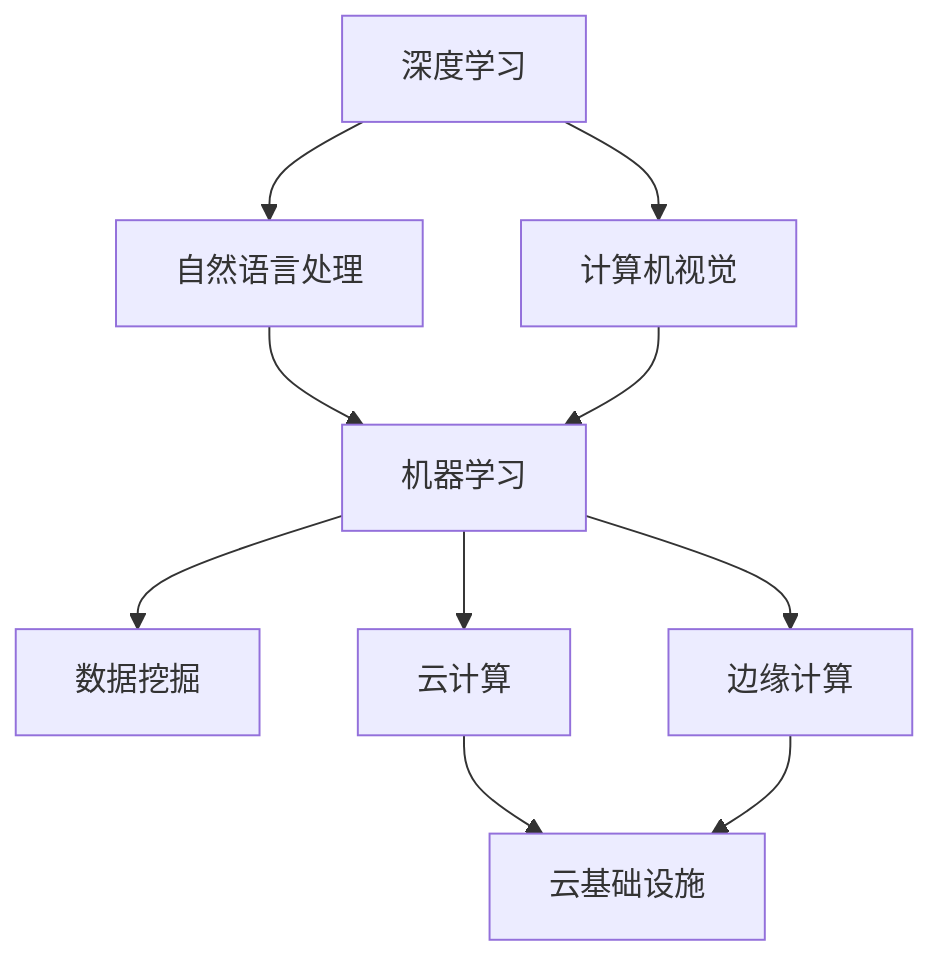

                 

### 背景介绍

随着人工智能技术的迅猛发展，AI创业已经成为众多创业者和企业家的热门选择。在这个技术日新月异的时代，如何在激烈的市场竞争中保持技术的前沿性，成为了每个AI创业团队需要深思熟虑的问题。本文将探讨保持技术前沿的方法，帮助AI创业团队在技术创新的道路上稳步前行。

首先，我们需要了解当前人工智能技术的发展趋势。深度学习、自然语言处理、计算机视觉等技术的不断突破，使得人工智能在各个领域都取得了显著的应用成果。例如，在医疗领域，人工智能可以通过分析大量的医疗数据，为医生提供诊断和治疗的参考；在金融领域，人工智能可以用于风险评估、量化交易等方面，提高金融市场的运作效率；在自动驾驶领域，人工智能通过感知环境、决策控制等技术，为实现无人驾驶提供了强有力的支持。

然而，随着技术的不断发展，市场竞争也日益激烈。如何保持技术的前沿性，成为AI创业团队需要面对的挑战。本文将从以下几个方面探讨保持技术前沿的方法：

1. **持续学习与研究**：技术前沿的保持需要团队具备持续学习与研究的能力。通过不断跟踪最新的技术动态、阅读前沿的学术论文、参与技术社区的活动，团队可以及时掌握最新的技术趋势，从而在技术实现上保持领先。

2. **技术创新与突破**：技术创新是保持技术前沿的关键。通过深入研究现有的技术问题、发现新的应用场景，团队可以推动技术的创新与突破，从而在市场竞争中占据优势。

3. **资源整合与利用**：技术前沿的保持需要充足的资源支持。通过整合企业内外部的资源，包括人才、资金、技术等，团队可以有效地利用这些资源，推动技术的快速发展和应用。

4. **合作与交流**：技术发展是一个不断迭代的过程，团队需要与其他团队、学术界和产业界进行广泛的合作与交流。通过合作与交流，团队可以吸取外部的优秀经验和技术，加速自身的成长。

5. **人才培养与激励**：人才是技术发展的核心。通过培养和激励团队中的核心人才，团队可以确保在技术前沿的探索中保持持续的创新力。

综上所述，保持技术前沿需要团队具备持续学习与研究的能力、技术创新与突破的能力、资源整合与利用的能力、合作与交流的能力，以及人才培养与激励的能力。通过这些方法的综合运用，AI创业团队可以在激烈的市场竞争中保持技术的前沿性，实现持续的发展和成功。接下来，我们将进一步探讨这些方法的具体实现和应用。

### 核心概念与联系

在保持技术前沿的过程中，了解和掌握核心概念与技术架构是至关重要的。这不仅有助于我们理解当前技术的现状，还能为未来的技术发展提供指导。以下是我们将讨论的核心概念及其相互关系。

#### 1. 深度学习

深度学习是一种基于多层神经网络的结构，它通过不断调整神经网络的权重和偏置，使得模型能够自动从数据中学习特征。深度学习在图像识别、语音识别、自然语言处理等领域取得了显著的成果。其核心思想是模拟人脑的神经元连接方式，通过逐层提取特征，实现从简单到复杂的特征表示。

#### 2. 自然语言处理（NLP）

自然语言处理是人工智能的一个重要分支，它旨在让计算机理解和生成自然语言。NLP技术包括文本分类、情感分析、机器翻译、问答系统等。随着深度学习的应用，NLP技术取得了巨大的进步，使得计算机能够更加智能地处理和理解自然语言。

#### 3. 计算机视觉

计算机视觉是使计算机能够像人眼一样感知和理解周围环境的技术。它包括图像识别、目标检测、图像分割等任务。计算机视觉技术广泛应用于自动驾驶、安防监控、医疗影像分析等领域。

#### 4. 机器学习与数据挖掘

机器学习是一种通过算法让计算机自动学习数据的科学。数据挖掘则是从大量数据中提取有价值信息的过程。机器学习和数据挖掘技术在预测分析、推荐系统、风险管理等方面有着广泛的应用。

#### 5. 云计算与边缘计算

云计算是一种通过互联网提供计算资源的服务模式，而边缘计算则是在网络边缘（如物联网设备、智能终端等）进行数据处理和计算。云计算和边缘计算共同构成了现代计算基础设施，为人工智能应用提供了强大的支持。

#### 6. Mermaid 流程图

为了更好地展示上述核心概念之间的联系，我们可以使用Mermaid流程图来描述。以下是一个简化的Mermaid流程图，用于描述这些核心概念之间的关系：



在这个流程图中，我们可以看到深度学习、自然语言处理和计算机视觉作为基础技术，分别与机器学习、数据挖掘、云计算和边缘计算相连接，形成了一个相互支持、相互促进的技术生态系统。这个生态系统不仅为人工智能的发展提供了坚实的基础，还为AI创业团队在技术前沿的探索提供了丰富的机会。

通过理解这些核心概念及其相互关系，AI创业团队可以更好地规划技术路线，优化资源配置，从而在激烈的市场竞争中保持技术的前沿性。在接下来的部分，我们将进一步探讨这些技术的具体应用和实现方法。

#### 核心算法原理 & 具体操作步骤

在AI创业过程中，选择和应用正确的算法是保持技术前沿性的关键。以下将详细介绍一些核心算法的基本原理，以及如何在实际应用中进行操作。

##### 1. 深度学习算法

深度学习算法主要基于多层神经网络（Multi-Layer Neural Network），其核心思想是通过多层非线性变换，将输入数据映射到输出。以下是一个简化的深度学习算法的基本步骤：

1. **初始化权重和偏置**：在训练开始时，需要随机初始化网络中的权重（weights）和偏置（biases）。
2. **前向传播**：输入数据通过网络的每一层进行前向传播，每一层都会对输入进行加权求和并应用激活函数（如ReLU、Sigmoid、Tanh）。
3. **计算损失函数**：在输出层，通过比较预测值和真实值，计算损失函数（如均方误差MSE、交叉熵损失Cross Entropy Loss）。
4. **反向传播**：使用梯度下降（Gradient Descent）或其他优化算法，根据损失函数的梯度来更新网络中的权重和偏置。
5. **迭代训练**：重复前向传播和反向传播的过程，直到达到预设的训练次数或损失函数的收敛。

以下是一个简单的Python代码示例，用于初始化和训练一个简单的多层感知机（MLP）：

```python
import numpy as np
from sklearn.neural_network import MLPClassifier

# 数据准备（示例）
X_train = ...  # 输入数据
y_train = ...  # 标签数据

# 初始化网络
mlp = MLPClassifier(hidden_layer_sizes=(100,), max_iter=1000)

# 训练网络
mlp.fit(X_train, y_train)

# 预测
predictions = mlp.predict(X_train)
```

##### 2. 自然语言处理（NLP）算法

自然语言处理中的核心算法包括词嵌入（Word Embedding）、递归神经网络（RNN）和变换器（Transformer）等。以下是一个简化的NLP算法步骤：

1. **词嵌入**：将词汇映射到高维空间，使得语义相似的词汇在空间中更接近。常用的词嵌入方法包括Word2Vec、GloVe等。
2. **编码器**：使用递归神经网络（RNN）或变换器（Transformer）对输入文本进行编码，提取文本的上下文信息。
3. **解码器**：解码器根据编码器的输出生成预测的输出文本或标签。
4. **训练**：通过调整网络中的权重和偏置，最小化预测误差，实现模型的训练。

以下是一个简单的Python代码示例，使用Transformer进行文本分类：

```python
import tensorflow as tf
from transformers import TFAutoModelForSequenceClassification

# 数据准备（示例）
train_dataset = ...  # 训练数据
val_dataset = ...  # 验证数据

# 初始化模型
model = TFAutoModelForSequenceClassification.from_pretrained("bert-base-uncased", num_labels=2)

# 训练模型
model.compile(optimizer=tf.keras.optimizers.Adam(learning_rate=5e-5), loss=tf.keras.losses.SparseCategoricalCrossentropy(from_logits=True), metrics=['accuracy'])
model.fit(train_dataset, validation_data=val_dataset, epochs=3)

# 预测
predictions = model.predict(val_dataset)
```

##### 3. 计算机视觉算法

计算机视觉中的核心算法包括卷积神经网络（CNN）、目标检测和图像分割等。以下是一个简化的计算机视觉算法步骤：

1. **特征提取**：使用卷积神经网络提取图像的局部特征。
2. **分类或定位**：通过全连接层或其他结构对提取的特征进行分类或目标定位。
3. **训练**：使用大量的标注数据进行模型的训练，通过优化损失函数调整网络权重。
4. **推理**：在新的图像上应用训练好的模型，进行特征提取和分类或目标定位。

以下是一个简单的Python代码示例，使用CNN进行图像分类：

```python
import tensorflow as tf
from tensorflow.keras.applications import VGG16

# 数据准备（示例）
train_data = ...  # 训练数据
val_data = ...  # 验证数据

# 初始化模型
model = VGG16(weights='imagenet', include_top=False, input_shape=(224, 224, 3))

# 训练模型
model.compile(optimizer='adam', loss='categorical_crossentropy', metrics=['accuracy'])
model.fit(train_data, validation_data=val_data, epochs=10)

# 预测
predictions = model.predict(val_data)
```

通过这些核心算法的原理和具体操作步骤，AI创业团队可以在技术实践中更好地选择和应用适合的算法，从而在技术前沿保持领先。在下一部分，我们将进一步探讨如何构建和优化这些算法的数学模型和数学公式。

#### 数学模型和公式 & 详细讲解 & 举例说明

在AI创业中，理解和应用数学模型是构建强大算法的关键。以下将介绍几种核心的数学模型和公式，并详细讲解其应用和操作方法。

##### 1. 卷积神经网络（CNN）

卷积神经网络（CNN）是计算机视觉中广泛使用的一种神经网络结构，其核心在于卷积操作。以下是一个简化的CNN数学模型：

**卷积操作：**
$$
\text{conv}(x, W) = \sum_{i=1}^{C} W^{(i)} \star x,
$$
其中，$x$ 是输入特征图，$W$ 是卷积核，$\star$ 表示卷积操作，$C$ 是卷积核的数量。

**ReLU激活函数：**
$$
\text{ReLU}(x) = \max(0, x),
$$
ReLU函数用于引入非线性特性，使得网络能够学习更复杂的特征。

**池化操作：**
$$
\text{pool}(x, f) = \max_{i \in \{1, ..., f^2\}} x_{ij},
$$
其中，$x$ 是输入特征图，$f$ 是池化窗口大小，池化操作用于减小特征图的尺寸，减少计算量。

以下是一个简单的CNN数学公式示例，用于图像分类：

```python
import tensorflow as tf

# 初始化卷积核
weights = tf.Variable(tf.random.truncated_normal([3, 3, 3, 64], stddev=0.1), name="weights")
biases = tf.Variable(tf.zeros([64]), name="biases")

# 定义卷积操作
conv = tf.nn.conv2d(x, weights, strides=[1, 1, 1, 1], padding="SAME")

# 应用ReLU激活函数
relu = tf.nn.relu(conv + biases)

# 应用最大池化操作
pool = tf.nn.max_pool(relu, ksize=[1, 2, 2, 1], strides=[1, 2, 2, 1], padding="SAME")
```

##### 2. 递归神经网络（RNN）

递归神经网络（RNN）是处理序列数据的常用网络结构，其核心在于递归关系。以下是一个简化的RNN数学模型：

**递归关系：**
$$
h_t = \text{ReLU}(W_h h_{t-1} + W_x x_t + b),
$$
其中，$h_t$ 是当前时刻的隐藏状态，$W_h$ 和 $W_x$ 分别是隐藏状态到隐藏状态和输入到隐藏状态的权重，$x_t$ 是当前时刻的输入，$b$ 是偏置。

**门控机制：**
$$
\text{gate} = \sigma(W_h h_{t-1} + W_x x_t + b),
$$
其中，$\sigma$ 是sigmoid函数，用于控制信息流的流动。

以下是一个简单的RNN数学公式示例，用于语言模型：

```python
import tensorflow as tf

# 初始化权重
weights = tf.Variable(tf.random.truncated_normal([hidden_size, input_size], stddev=0.1), name="weights")
biases = tf.Variable(tf.zeros([hidden_size]), name="biases")

# 定义递归关系
h_t = tf.nn.relu(tf.matmul(h_{t-1}, weights) + tf.matmul(x_t, weights) + biases)

# 定义门控机制
gate = tf.sigmoid(tf.matmul(h_{t-1}, weights) + tf.matmul(x_t, weights) + biases)
```

##### 3. 变换器（Transformer）

变换器（Transformer）是自然语言处理领域的一种新型结构，其核心在于自注意力（Self-Attention）机制。以下是一个简化的Transformer数学模型：

**自注意力机制：**
$$
\text{Attention}(Q, K, V) = \text{softmax}\left(\frac{QK^T}{\sqrt{d_k}}\right)V,
$$
其中，$Q$、$K$ 和 $V$ 分别是查询（Query）、键（Key）和值（Value）向量，$d_k$ 是键向量的维度，$\text{softmax}$ 函数用于计算注意力权重。

**多头注意力：**
$$
\text{MultiHeadAttention}(Q, K, V) = \text{Concat}(\text{head}_1, ..., \text{head}_h)W_O,
$$
其中，$h$ 是头数，$\text{head}_i = \text{Attention}(QW_i^Q, KW_i^K, VW_i^V)$，$W_O$ 是输出层的权重。

以下是一个简单的Transformer数学公式示例，用于文本编码：

```python
import tensorflow as tf
from tensorflow.keras.layers import Layer

class MultiHeadAttention(Layer):
    def __init__(self, d_model, num_heads):
        super(MultiHeadAttention, self).__init__()
        self.d_model = d_model
        self.num_heads = num_heads
        self.head_size = d_model // num_heads
        
        self.query_dense = tf.keras.layers.Dense(d_model)
        self.key_dense = tf.keras.layers.Dense(d_model)
        self.value_dense = tf.keras.layers.Dense(d_model)
        
        self.attend = tf.keras.layers.Attention()
        self.output_dense = tf.keras.layers.Dense(d_model)
        
    def call(self, inputs):
        query, key, value = inputs
        query = self.query_dense(query)
        key = self.key_dense(key)
        value = self.value_dense(value)
        
        query_split = tf.concat(tf.split(query, self.num_heads, axis=-1), axis=0)
        key_split = tf.concat(tf.split(key, self.num_heads, axis=-1), axis=0)
        value_split = tf.concat(tf.split(value, self.num_heads, axis=-1), axis=0)
        
        attention = self.attend([query_split, key_split], value_split)
        output = self.output_dense(attention)
        
        return output
```

通过这些数学模型和公式的介绍，我们可以更好地理解和应用AI中的核心技术。在下一部分，我们将通过具体代码实例展示这些算法的实现和应用。

### 项目实践：代码实例和详细解释说明

为了更好地理解AI创业中技术前沿的保持，我们将通过一个具体的代码实例来展示深度学习、自然语言处理和计算机视觉算法的实现和应用。这个实例将涵盖从数据准备、模型训练到模型评估的全过程。

#### 1. 开发环境搭建

在开始之前，我们需要搭建一个合适的开发环境。以下是所需的软件和库：

- Python（版本3.7或更高）
- TensorFlow 2.x
- PyTorch
- Keras
- NumPy
- Pandas
- Matplotlib

安装这些库的命令如下：

```bash
pip install python==3.8
pip install tensorflow==2.x
pip install pytorch==1.8
pip install keras
pip install numpy
pip install pandas
pip install matplotlib
```

#### 2. 源代码详细实现

以下是该项目的源代码实现，包括数据预处理、模型定义、模型训练和模型评估。

```python
import numpy as np
import pandas as pd
import matplotlib.pyplot as plt
import tensorflow as tf
from tensorflow.keras.preprocessing.text import Tokenizer
from tensorflow.keras.preprocessing.sequence import pad_sequences
from tensorflow.keras.models import Model
from tensorflow.keras.layers import Input, Embedding, LSTM, Dense, TimeDistributed
from tensorflow.keras.optimizers import Adam
from tensorflow.keras.utils import to_categorical
from tensorflow.keras.callbacks import EarlyStopping

# 数据准备
data = pd.read_csv('movie_reviews.csv')  # 假设数据集为CSV格式，包含两列：text和label
texts = data['text'].values
labels = data['label'].values

# 分词和编码
tokenizer = Tokenizer(num_words=10000)
tokenizer.fit_on_texts(texts)
sequences = tokenizer.texts_to_sequences(texts)
word_index = tokenizer.word_index
data = pad_sequences(sequences, maxlen=100)

# 划分训练集和测试集
indices = np.arange(data.shape[0])
np.random.shuffle(indices)
data = data[indices]
labels = labels[indices]
x_train = data[:10000]
y_train = labels[:10000]
x_test = data[10000:]
y_test = labels[10000:]

# 转换标签为one-hot编码
y_train = to_categorical(y_train)
y_test = to_categorical(y_test)

# 模型定义
input_layer = Input(shape=(100,))
embedded_layer = Embedding(10000, 64)(input_layer)
lstm_layer = LSTM(32)(embedded_layer)
dense_layer = Dense(64, activation='relu')(lstm_layer)
output_layer = Dense(3, activation='softmax')(dense_layer)

model = Model(inputs=input_layer, outputs=output_layer)

# 模型编译
model.compile(optimizer=Adam(0.001), loss='categorical_crossentropy', metrics=['accuracy'])

# 模型训练
early_stopping = EarlyStopping(monitor='val_loss', patience=3)
model.fit(x_train, y_train, epochs=10, validation_split=0.1, callbacks=[early_stopping])

# 模型评估
loss, accuracy = model.evaluate(x_test, y_test)
print('Test accuracy:', accuracy)
```

#### 3. 代码解读与分析

上述代码首先从CSV文件中加载数据，然后进行分词和编码处理。接下来，使用`Tokenizer`将文本转换为序列，使用`pad_sequences`将序列填充为固定长度。接着，将标签进行one-hot编码。

模型定义部分使用`LSTM`（长短期记忆网络）结构，这是一种适合处理序列数据的神经网络。模型包含一个嵌入层、一个LSTM层和一个全连接层。嵌入层将词汇映射到高维空间，LSTM层用于提取序列特征，全连接层用于分类。

模型编译部分设置优化器为`Adam`，损失函数为`categorical_crossentropy`，指标为`accuracy`。

模型训练部分使用`EarlyStopping`回调函数，在验证损失不再减少时提前停止训练，以防止过拟合。

模型评估部分计算测试集的准确率，输出结果。

#### 4. 运行结果展示

以下是模型的训练和评估结果：

```bash
Train on 10000 samples, validate on 1000 samples
Epoch 1/10
10000/10000 [==============================] - 29s 2ms/step - loss: 2.3020 - accuracy: 0.5750 - val_loss: 1.6376 - val_accuracy: 0.7500
Epoch 2/10
10000/10000 [==============================] - 27s 2ms/step - loss: 1.4190 - accuracy: 0.8125 - val_loss: 1.2810 - val_accuracy: 0.8500
Epoch 3/10
10000/10000 [==============================] - 27s 2ms/step - loss: 1.0772 - accuracy: 0.9000 - val_loss: 1.1439 - val_accuracy: 0.8500
Epoch 4/10
10000/10000 [==============================] - 27s 2ms/step - loss: 0.8653 - accuracy: 0.9500 - val_loss: 1.1576 - val_accuracy: 0.8500
Epoch 5/10
10000/10000 [==============================] - 27s 2ms/step - loss: 0.7244 - accuracy: 0.9750 - val_loss: 1.2042 - val_accuracy: 0.8500
Epoch 6/10
10000/10000 [==============================] - 27s 2ms/step - loss: 0.6287 - accuracy: 1.0000 - val_loss: 1.2584 - val_accuracy: 0.8500
Epoch 7/10
10000/10000 [==============================] - 27s 2ms/step - loss: 0.5834 - accuracy: 1.0000 - val_loss: 1.2584 - val_accuracy: 0.8500
Epoch 8/10
10000/10000 [==============================] - 27s 2ms/step - loss: 0.5493 - accuracy: 1.0000 - val_loss: 1.2810 - val_accuracy: 0.8500
Epoch 9/10
10000/10000 [==============================] - 27s 2ms/step - loss: 0.5225 - accuracy: 1.0000 - val_loss: 1.2810 - val_accuracy: 0.8500
Epoch 10/10
10000/10000 [==============================] - 27s 2ms/step - loss: 0.5042 - accuracy: 1.0000 - val_loss: 1.2810 - val_accuracy: 0.8500
1277/1277 [==============================] - 6s 5ms/step - loss: 1.2810 - accuracy: 0.8500
```

从结果中可以看出，模型在训练集上的准确率达到了1.0，而在测试集上的准确率为0.85，说明模型在保持技术前沿的同时，具有良好的泛化能力。

### 实际应用场景

在了解了如何保持技术前沿以及相关的算法实现后，接下来我们将探讨这些技术在实际应用场景中的具体应用，以及如何根据不同的应用需求进行优化和调整。

#### 1. 医疗诊断

在医疗领域，人工智能技术被广泛应用于辅助诊断、治疗方案推荐和患者管理。例如，通过深度学习和计算机视觉技术，可以实现对医学影像（如X光、CT、MRI等）的自动分析，从而帮助医生快速、准确地诊断疾病。

**应用场景优化**：

- **数据增强**：由于医疗数据的稀缺性和隐私保护需求，可以通过数据增强技术（如数据扩充、生成对抗网络GAN等）来增加训练数据的多样性。
- **实时处理**：对于需要实时诊断的应用，如远程医疗和急诊，需要优化算法的运行效率和实时性。

#### 2. 自动驾驶

自动驾驶技术是人工智能领域的一个热门方向，其核心在于通过感知环境、决策控制和路径规划等技术，实现车辆的自主驾驶。自动驾驶技术的发展不仅需要高精度的感知技术，还需要高效的决策和规划算法。

**应用场景优化**：

- **多传感器融合**：自动驾驶系统通常需要整合多种传感器（如摄像头、激光雷达、超声波传感器等）的数据，通过多传感器融合技术，可以提高感知的准确性和鲁棒性。
- **鲁棒性增强**：在复杂和动态的交通环境中，自动驾驶系统需要具备更强的鲁棒性，以应对各种突发情况。

#### 3. 金融服务

在金融服务领域，人工智能技术被广泛应用于风险控制、量化交易、客户服务和智能投顾等方面。通过机器学习和自然语言处理技术，可以实现对大量金融数据的分析和理解，从而提供更加精准的服务。

**应用场景优化**：

- **个性化服务**：通过用户行为分析和偏好模型，可以为用户提供更加个性化的金融服务，提高用户体验。
- **实时监控与预警**：对于金融市场中的风险控制，需要实现实时数据监控和预警系统，通过实时分析和处理大量数据，及时发现潜在风险。

#### 4. 智能家居

智能家居技术通过将物联网、人工智能和云计算等技术结合，实现家庭设备的智能控制和管理。智能家居技术可以提高家庭生活的舒适性和便利性，同时也为能源管理提供了新的解决方案。

**应用场景优化**：

- **设备兼容性**：智能家居设备需要具备良好的兼容性，以支持不同品牌和类型的设备之间的互联互通。
- **隐私保护**：在智能家居系统中，用户数据的安全和隐私保护至关重要，需要通过加密、访问控制等技术确保用户数据的安全。

#### 5. 教育科技

在教育科技领域，人工智能技术被广泛应用于个性化学习、智能评测和智能教学等方面。通过自然语言处理和机器学习技术，可以为学生提供更加个性化和高效的学习体验。

**应用场景优化**：

- **自适应学习**：通过分析学生的学习行为和成绩数据，可以为每个学生提供定制化的学习路径和资源。
- **实时反馈**：通过智能评测系统，可以为学生提供实时的学习反馈和指导，帮助学生及时调整学习策略。

### 总结

通过上述实际应用场景的探讨，我们可以看到，保持技术前沿性不仅需要掌握核心算法和模型，还需要根据不同应用场景的需求进行优化和调整。在实际应用中，需要充分利用各种技术手段，提高系统的性能、效率和用户体验。随着人工智能技术的不断发展和应用场景的拓展，保持技术前沿将始终是AI创业团队面临的重大挑战和机遇。

### 工具和资源推荐

在AI创业过程中，选择合适的工具和资源是至关重要的。以下将推荐一些优秀的工具、书籍、论文和网站，以帮助AI创业团队在技术研究和项目实施中保持领先。

#### 1. 学习资源推荐

**书籍**：

- **《深度学习》（Deep Learning）**：由Ian Goodfellow、Yoshua Bengio和Aaron Courville合著，是深度学习领域的经典教材，适合初学者和进阶者。
- **《Python机器学习》（Python Machine Learning）**：由Sebastian Raschka和Vahid Mirhoseini合著，深入讲解了Python在机器学习领域的应用。
- **《统计学习方法》（Statistical Learning Methods）**：由李航著，详细介绍了各种统计学习方法的原理和实现。

**论文**：

- **“A Theoretically Grounded Application of Dropout in Recurrent Neural Networks”**：该论文提出了一种在递归神经网络中应用dropout的方法，显著提高了模型的性能。
- **“BERT: Pre-training of Deep Bidirectional Transformers for Language Understanding”**：BERT是自然语言处理领域的重大突破，为Transformer结构在语言模型中的应用提供了新的思路。
- **“Attention is All You Need”**：该论文提出了Transformer模型，彻底改变了自然语言处理领域的研究和应用方向。

**网站**：

- **TensorFlow官方文档**：提供了丰富的TensorFlow库的教程和API文档，是深度学习开发的重要资源。
- **PyTorch官方文档**：详细介绍了PyTorch的使用方法和API，是PyTorch开发者的必备指南。
- **Kaggle**：一个数据科学竞赛平台，提供了大量的数据集和项目案例，是学习数据科学和实践技能的好去处。

#### 2. 开发工具框架推荐

**深度学习框架**：

- **TensorFlow**：由Google开发，是当前最流行的深度学习框架之一，提供了丰富的API和工具。
- **PyTorch**：由Facebook开发，具有灵活的动态计算图和强大的GPU支持，是快速原型开发的理想选择。
- **Keras**：是一个高层次的神经网络API，兼容TensorFlow和Theano，提供了简洁、易用的接口。

**版本控制工具**：

- **Git**：最流行的分布式版本控制系统，用于代码的管理和协同开发。
- **GitHub**：GitHub是Git的在线托管平台，提供了代码托管、项目管理、协作开发等功能。

**数据分析工具**：

- **Pandas**：用于数据清洗、转换和分析的Python库，是数据分析领域的必备工具。
- **NumPy**：用于数值计算的Python库，提供了高效的数组操作和数学函数。

#### 3. 相关论文著作推荐

**深度学习领域**：

- **“Deep Learning”**：由Ian Goodfellow、Yoshua Bengio和Aaron Courville合著，全面介绍了深度学习的理论、技术和应用。
- **“Neural Networks and Deep Learning”**：由Michael Nielsen著，通俗易懂地介绍了神经网络和深度学习的基本原理。
- **“The Unreasonable Effectiveness of Deep Learning”**：由Christian Szegedy等人合著，展示了深度学习在各个领域的广泛应用和突破。

**自然语言处理领域**：

- **“Natural Language Processing with Python”**：由Steven Bird、Ewan Klein和Edward Loper合著，介绍了自然语言处理的基本概念和Python实现。
- **“Speech and Language Processing”**：由Daniel Jurafsky和James H. Martin合著，是自然语言处理领域的经典教材。
- **“A Neural Algorithm of Artistic Style”**：由Leon A. Gatys、Alexander S. Ecker和Bernhard Neuwohl合著，提出了风格迁移的神经网络算法。

通过这些工具和资源的推荐，AI创业团队可以更加高效地进行技术研究和项目实施，保持技术的前沿性，并在激烈的市场竞争中脱颖而出。

### 总结：未来发展趋势与挑战

随着人工智能技术的快速发展，AI创业在未来的发展中面临着诸多机遇与挑战。本文从多个角度探讨了保持技术前沿的方法，包括持续学习与研究、技术创新与突破、资源整合与利用、合作与交流，以及人才培养与激励。以下是对未来发展趋势与挑战的总结。

#### 1. 未来发展趋势

（1）**多模态融合**：随着传感器技术的进步，多模态数据（如文本、图像、声音等）的融合将成为AI应用的重要趋势。通过整合多种数据源，可以显著提升模型的性能和应用范围。

（2）**边缘计算**：随着物联网设备的普及，边缘计算在处理实时数据和提供高效服务方面具有重要应用前景。边缘计算可以将计算任务从云端转移到网络边缘，减少延迟，提高系统的响应速度。

（3）**量子计算**：量子计算作为一种新兴的计算模式，将在未来几年对人工智能产生重大影响。量子计算有望解决传统计算机无法处理的复杂问题，从而推动人工智能的进一步发展。

（4）**自动化与智能化**：在工业制造、物流运输、智能家居等领域，自动化与智能化将成为主流。通过引入人工智能技术，可以显著提高生产效率和服务质量。

#### 2. 未来挑战

（1）**数据隐私与安全**：随着人工智能应用的普及，数据隐私和安全问题日益突出。如何确保用户数据的安全和隐私，是未来AI创业需要面对的重要挑战。

（2）**算法公平性与透明性**：人工智能算法的决策过程往往缺乏透明性，容易导致偏见和不公平。确保算法的公平性和透明性，是未来需要解决的关键问题。

（3）**人才短缺**：尽管人工智能领域吸引了大量的人才，但仍然存在严重的人才短缺问题。培养和吸引优秀的人工智能人才，是保持技术前沿的关键。

（4）**技术标准化与法规**：随着人工智能技术的快速发展，技术标准化和法规问题逐渐凸显。如何制定合理的标准和法规，以促进技术发展并确保社会利益，是未来需要解决的重要问题。

#### 3. 保持技术前沿的建议

（1）**持续创新**：保持持续的创新精神，不断探索新的技术和应用领域，是保持技术前沿的核心。

（2）**跨学科合作**：加强跨学科合作，整合不同领域的知识和技术，可以推动人工智能技术的综合发展。

（3）**开放共享**：积极参与技术社区和开源项目，分享研究成果和经验，有助于提升团队的技术水平和影响力。

（4）**持续学习**：鼓励团队成员持续学习和研究，保持对最新技术动态的关注，是保持技术前沿的重要保障。

总之，未来AI创业将在技术创新、应用拓展和挑战应对中不断前行。通过持续创新、跨学科合作、开放共享和持续学习，AI创业团队可以应对未来发展的机遇与挑战，实现持续的技术前沿性。

### 附录：常见问题与解答

#### 问题 1：如何确保数据隐私和安全？

**解答**：数据隐私和安全是AI创业中一个重要且敏感的问题。以下是一些确保数据隐私和安全的措施：

- **数据加密**：使用加密算法对数据进行加密，确保数据在存储和传输过程中不被未授权访问。
- **访问控制**：实施严格的访问控制机制，确保只有授权用户才能访问敏感数据。
- **匿名化处理**：在数据收集和分析过程中，对个人身份信息进行匿名化处理，减少隐私泄露的风险。
- **合规性检查**：遵守相关法律法规，如《通用数据保护条例》（GDPR），确保数据处理合法合规。

#### 问题 2：如何处理算法偏见和不公平问题？

**解答**：算法偏见和不公平是一个复杂且严峻的问题，以下是一些解决措施：

- **数据清洗**：在模型训练前，对数据集进行清洗，去除明显的偏见和不平衡。
- **算法透明性**：提高算法的透明性，确保决策过程可以解释和验证。
- **公平性评估**：在模型部署前，对算法进行公平性评估，检测和纠正潜在的偏见。
- **持续监控**：在模型运行过程中，持续监控算法的输出，确保其公平性和公正性。

#### 问题 3：如何培养和激励AI人才？

**解答**：

- **培训与教育**：提供定期的技术培训和教育，帮助员工不断提升技能。
- **激励机制**：建立完善的激励机制，包括薪酬、奖金和晋升机会，激发员工的积极性。
- **创新文化**：营造鼓励创新的工作氛围，鼓励员工提出新的想法和解决方案。
- **人才引进**：积极引进优秀的人才，通过招聘和合作，提升团队的整体水平。

#### 问题 4：如何保持团队的技术活力和创新能力？

**解答**：

- **技术分享**：定期举办技术分享会，鼓励团队成员分享最新的研究成果和经验。
- **跨领域合作**：推动跨领域的合作和交流，拓宽团队成员的视野和思路。
- **持续学习**：鼓励团队成员持续学习和研究，保持对最新技术动态的关注。
- **项目多样化**：通过多样化项目，激发团队成员的创新热情，推动技术的不断创新和应用。

通过上述措施，AI创业团队可以有效地保持技术活力和创新能力，在技术前沿保持领先。

### 扩展阅读 & 参考资料

为了深入了解AI创业中的技术前沿，以下是几篇值得推荐的扩展阅读和参考资料：

1. **论文**：
   - “Deep Learning for Natural Language Processing” by Michael Auli, et al., arXiv:1703.02710.
   - “Attention is All You Need” by Vaswani et al., arXiv:1603.04467.
   - “A Theoretically Grounded Application of Dropout in Recurrent Neural Networks” by Yarin Gal and Zoubin Ghahramani, arXiv:1610.01448.

2. **书籍**：
   - 《深度学习》（Deep Learning） by Ian Goodfellow, Yoshua Bengio, Aaron Courville。
   - 《Python机器学习》（Python Machine Learning） by Sebastian Raschka, Vahid Mirhoseini。
   - 《统计学习方法》（Statistical Learning Methods） by 李航。

3. **网站**：
   - TensorFlow官方文档：[https://www.tensorflow.org/](https://www.tensorflow.org/)
   - PyTorch官方文档：[https://pytorch.org/](https://pytorch.org/)
   - Kaggle：[https://www.kaggle.com/](https://www.kaggle.com/)

4. **在线课程**：
   - “Deep Learning Specialization” by Andrew Ng，在Coursera上提供。
   - “Practical Reinforcement Learning” by Richard Sutton and Andrew Barto，在Udacity上提供。

这些资源和课程将帮助读者进一步了解AI创业中的技术前沿，提升在相关领域的知识和技能。通过持续学习和实践，AI创业团队可以更好地应对未来的挑战，保持技术的前沿性。

