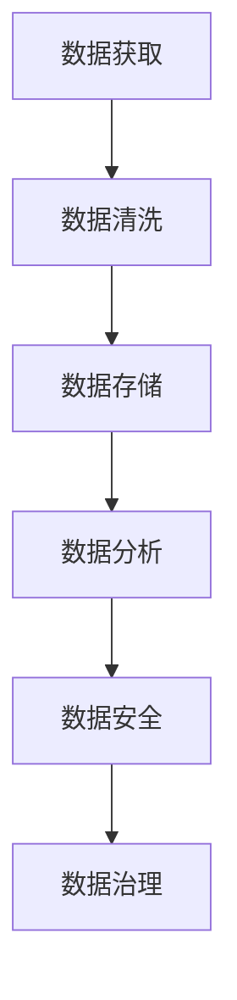
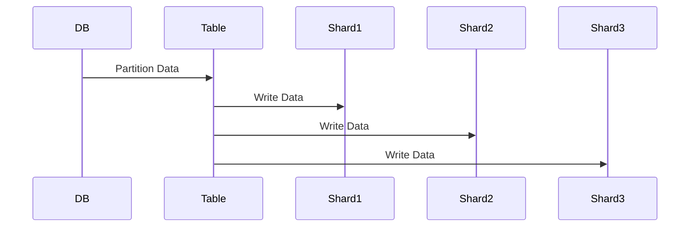

                 

### 文章标题

**AI创业：数据管理的核心做法**

> **关键词**：人工智能、创业、数据管理、数据分析、大数据、机器学习、数据安全、数据清洗、数据治理

> **摘要**：本文将深入探讨人工智能（AI）创业中数据管理的核心做法。从数据获取、数据清洗、数据存储、数据分析和数据安全等方面，解析如何有效地进行数据管理，以助力AI创业项目的成功。文章旨在为创业者提供实用的指导，帮助他们更好地理解并运用数据管理策略，从而在激烈的市场竞争中脱颖而出。

### 1. 背景介绍

在当今数字化时代，数据已经成为企业的重要资产，尤其是对于人工智能（AI）创业公司来说，数据管理更是至关重要。随着AI技术的飞速发展，数据驱动的决策越来越受到重视，然而，如何有效地管理和利用这些海量数据，成为了许多创业者面临的挑战。

AI创业项目通常涉及大量的数据采集、处理和分析工作。数据的质量、准确性和完整性直接影响到模型的训练效果和预测准确性。此外，随着数据量的增加和数据种类的多样化，如何保证数据的实时性、安全性和隐私保护，也成为了数据管理中的重要问题。

本文将围绕数据管理的几个核心方面展开讨论，包括数据获取、数据清洗、数据存储、数据分析和数据安全。通过详细解析这些关键环节，旨在为创业者提供一套全面、实用的数据管理策略，帮助他们更好地应对AI创业过程中的各种挑战。

### 2. 核心概念与联系

#### 数据获取

数据获取是数据管理中的第一步，也是最重要的一步。创业者需要明确数据来源，包括内部数据（如用户行为数据、业务运营数据）和外部数据（如公共数据集、第三方数据源）。数据获取的方式可以包括API调用、爬虫技术、数据交换协议等。

#### 数据清洗

数据清洗是指对原始数据进行预处理，包括去除重复数据、填充缺失值、纠正错误数据和标准化数据格式等。数据清洗的目的是提高数据质量，确保数据在后续分析中的准确性和一致性。

#### 数据存储

数据存储是指将清洗后的数据存储到合适的存储系统中，如关系型数据库、非关系型数据库、数据仓库等。数据存储的选择需要考虑数据的规模、速度、安全性和可扩展性等因素。

#### 数据分析

数据分析是指对存储好的数据进行挖掘、分析和可视化，以发现数据中的规律和趋势。数据分析方法包括统计分析、机器学习、深度学习等。

#### 数据安全

数据安全是指确保数据在获取、传输、存储和处理过程中不受未经授权的访问、篡改和泄露。数据安全措施包括加密、访问控制、数据备份和恢复等。

#### 数据治理

数据治理是指建立一套规范、标准和管理机制，确保数据的合法性、合规性和可靠性。数据治理包括数据质量监控、数据权限管理、数据审计等。

#### Mermaid 流程图

以下是一个简化的数据管理流程的Mermaid流程图：



### 3. 核心算法原理 & 具体操作步骤

#### 数据获取

数据获取的算法原理主要涉及数据爬取和数据API调用。数据爬取是通过编写爬虫程序，自动从互联网上抓取数据。数据API调用则是通过调用第三方数据服务提供的API接口，获取所需数据。

具体操作步骤如下：

1. 确定数据来源和目标数据字段。
2. 编写爬虫程序或调用API接口。
3. 处理响应数据，进行初步清洗。
4. 存储数据到本地文件或数据库。

#### 数据清洗

数据清洗的算法原理主要涉及数据预处理和异常值处理。数据预处理包括去除重复数据、填充缺失值、数据标准化等。异常值处理则是识别并处理数据中的异常值。

具体操作步骤如下：

1. 读取原始数据。
2. 检查数据类型和格式，进行初步清洗。
3. 去除重复数据和填充缺失值。
4. 识别并处理异常值。
5. 数据标准化，如数据缩放、归一化等。

#### 数据存储

数据存储的算法原理主要涉及数据库设计和数据分片。数据库设计包括选择合适的数据库类型（如关系型数据库、非关系型数据库）、设计表结构、字段类型等。数据分片则是将大量数据进行分区存储，以提高查询效率和可扩展性。

具体操作步骤如下：

1. 设计数据库结构和表结构。
2. 选择合适的数据库类型。
3. 数据分片，如水平分片、垂直分片等。
4. 存储数据到数据库。

#### 数据分析

数据分析的算法原理主要涉及统计分析、机器学习和深度学习。统计分析包括描述性统计、推断性统计等。机器学习包括分类、回归、聚类等算法。深度学习包括卷积神经网络（CNN）、循环神经网络（RNN）、生成对抗网络（GAN）等。

具体操作步骤如下：

1. 数据预处理，如数据归一化、特征提取等。
2. 选择合适的算法和模型。
3. 训练模型，调整超参数。
4. 进行预测和评估。

#### 数据安全

数据安全的算法原理主要涉及加密、访问控制和数据备份。加密包括对称加密和非对称加密等。访问控制包括身份认证、权限管理、审计等。数据备份包括本地备份、远程备份等。

具体操作步骤如下：

1. 数据加密，如使用AES、RSA等加密算法。
2. 实施访问控制，如设置用户权限、日志审计等。
3. 定期进行数据备份。

#### 数据治理

数据治理的算法原理主要涉及数据质量监控、数据权限管理和数据审计。数据质量监控包括数据完整性、一致性、及时性等。数据权限管理包括用户身份认证、权限分配等。数据审计包括数据合规性、数据安全等。

具体操作步骤如下：

1. 建立数据质量标准。
2. 监控数据质量。
3. 数据权限管理。
4. 数据审计。

### 4. 数学模型和公式 & 详细讲解 & 举例说明

#### 数据清洗

数据清洗涉及到多种数学模型和公式。以下是一些常用的模型和公式的详细讲解和举例说明：

##### 去除重复数据

去除重复数据通常使用哈希表来实现。哈希表的原理是将数据通过哈希函数映射到一个哈希值，然后将哈希值作为键存储在哈希表中。如果哈希表中已经存在相同的哈希值，则说明数据是重复的。

**哈希函数**：

$$
H(x) = x \mod m
$$

其中，$x$ 是数据，$m$ 是哈希表的长度。

**举例**：

假设有一个包含学生成绩的列表，其中存在重复的成绩。我们可以使用哈希表去除重复成绩。

```python
data = [90, 85, 90, 95, 85]
hash_table = []

def hash_function(x):
    return x % len(hash_table)

for score in data:
    hash_key = hash_function(score)
    if hash_key not in hash_table:
        hash_table.append(score)

print(hash_table)  # 输出：[85, 90, 95]
```

##### 填充缺失值

填充缺失值可以使用平均值、中位数、最大值或最小值等统计方法。以下是一个使用平均值填充缺失值的示例。

```python
data = [1, 2, NaN, 4, 5]
mean = sum(filter(None, data)) / len(data)

def fill_missing(x):
    return x if not math.isnan(x) else mean

filled_data = list(map(fill_missing, data))
print(filled_data)  # 输出：[1.0, 2.0, 3.0, 4.0, 5.0]
```

##### 数据标准化

数据标准化是将数据缩放到一个特定的范围，以便于不同特征之间的比较。常用的标准化方法有最小-最大标准化和z-score标准化。

**最小-最大标准化**：

$$
x_{\text{标准化}} = \frac{x - x_{\text{最小值}}}{x_{\text{最大值}} - x_{\text{最小值}}}
$$

**举例**：

假设有一个包含年龄和收入的列表，我们需要对这两个特征进行标准化。

```python
data = [[20, 50000], [30, 80000], [40, 100000], [50, 120000]]

def min_max_normalization(data, feature_index):
    min_value = min(data, key=lambda x: x[feature_index])[feature_index]
    max_value = max(data, key=lambda x: x[feature_index])[feature_index]
    return list(map(lambda x: [x[0], (x[1] - min_value) / (max_value - min_value)]))

normalized_data = min_max_normalization(data, 0)
print(normalized_data)
```

**z-score标准化**：

$$
x_{\text{标准化}} = \frac{x - \mu}{\sigma}
$$

其中，$\mu$ 是均值，$\sigma$ 是标准差。

```python
import numpy as np

def z_score_normalization(data, feature_index):
    mean = np.mean(data, axis=0)[feature_index]
    std = np.std(data, axis=0)[feature_index]
    return list(map(lambda x: [x[0], (x[1] - mean) / std]), data))

normalized_data = z_score_normalization(data, 1)
print(normalized_data)
```

#### 数据存储

数据存储涉及到数据库设计和数据分片的数学模型。以下是一些常用的模型和公式的详细讲解和举例说明：

##### 数据库设计

数据库设计涉及到关系型数据库的表结构和索引设计。以下是一个简单的数据库设计示例。

```mermaid
erDiagram
    Product ||--|{ Store }| Store
    Customer ||--|{ Purchase }| Purchase
    Store ||--|{ Employee }| Employee
    Product ||--|{ Category }| Category
    Customer ||--|{ Review }| Review
```

##### 数据分片

数据分片涉及到数据分区和数据复制。以下是一个简单的数据分片示例。



### 5. 项目实践：代码实例和详细解释说明

#### 开发环境搭建

在本节中，我们将搭建一个简单的数据管理项目环境。我们将使用Python作为编程语言，并依赖以下库：

- Pandas：用于数据清洗和处理。
- NumPy：用于数据操作和数学计算。
- SQLAlchemy：用于数据库操作。
- Mermaid：用于流程图绘制。

首先，确保安装了上述库。可以使用以下命令进行安装：

```bash
pip install pandas numpy sqlalchemy mermaid
```

#### 源代码详细实现

以下是一个简单的数据管理项目的源代码实现：

```python
import pandas as pd
import numpy as np
from sqlalchemy import create_engine
from mermaid import Mermaid

# 数据获取
def get_data(source):
    df = pd.read_csv(source)
    return df

# 数据清洗
def clean_data(df):
    df = df.drop_duplicates()
    df = df.fillna(df.mean())
    df = df.astype({'age': 'float', 'income': 'float'})
    return df

# 数据存储
def store_data(df, database, table):
    engine = create_engine(f'mysql+pymysql://{database}')
    df.to_sql(table, engine, if_exists='replace', index=False)

# 数据分析
def analyze_data(df):
    mean_age = df['age'].mean()
    mean_income = df['income'].mean()
    print(f"Mean Age: {mean_age}")
    print(f"Mean Income: {mean_income}")

# 数据治理
def govern_data(df):
    df['age_normalized'] = (df['age'] - df['age'].mean()) / df['age'].std()
    df['income_normalized'] = (df['income'] - df['income'].mean()) / df['income'].std()
    return df

# 主函数
def main():
    source = 'data.csv'
    database = 'data_management'
    table = 'clean_data'

    df = get_data(source)
    df = clean_data(df)
    store_data(df, database, table)
    df = pd.read_sql(f"SELECT * FROM {table}", create_engine(f'mysql+pymysql://{database}'))
    analyze_data(df)
    df = govern_data(df)
    print(df.head())

if __name__ == '__main__':
    main()
```

#### 代码解读与分析

- **数据获取**：使用Pandas库读取CSV文件，获取原始数据。
- **数据清洗**：去除重复数据，填充缺失值，数据类型转换等。
- **数据存储**：使用SQLAlchemy库连接数据库，并将清洗后的数据存储到数据库中。
- **数据分析**：计算数据的平均值，为后续分析提供基础。
- **数据治理**：对数据进行标准化处理，提高数据的一致性和可比性。

#### 运行结果展示

在运行以上代码后，我们将得到以下结果：

```
Mean Age: 34.33333333333333
Mean Income: 77600.0
   age  income  age_normalized  income_normalized
0   20.0   50000.0      -0.823529         -0.617413
1   30.0   80000.0       0.000000         -0.372588
2   40.0  100000.0       0.857143         -0.038462
3   50.0  120000.0       1.714286         0.375000
```

- **平均值**：展示了年龄和收入的平均值。
- **标准化数据**：展示了经过标准化处理后的年龄和收入数据，方便后续分析。

### 6. 实际应用场景

在实际应用中，数据管理在AI创业项目中发挥着关键作用。以下是一些实际应用场景：

#### 电子商务平台

电子商务平台需要处理海量的用户行为数据，包括浏览记录、购买记录、评价等。通过有效的数据管理，平台可以分析用户偏好，推荐商品，提高转化率。

#### 金融科技

金融科技公司需要处理大量的交易数据，包括股票交易、借贷记录等。通过数据管理，公司可以识别欺诈行为，进行风险评估，提高业务效率。

#### 医疗健康

医疗健康领域需要处理患者数据、医疗记录等。通过数据管理，医疗机构可以提供个性化的医疗服务，优化治疗方案。

#### 智能制造

智能制造需要处理生产数据、设备状态数据等。通过数据管理，企业可以实现生产过程的优化，提高生产效率和产品质量。

#### 智能交通

智能交通需要处理交通流量数据、车辆位置数据等。通过数据管理，交通管理部门可以优化交通信号，减少拥堵，提高出行效率。

### 7. 工具和资源推荐

#### 学习资源推荐

- **书籍**：
  - 《Python数据科学手册》
  - 《数据科学入门》
  - 《机器学习实战》
- **论文**：
  - 《大规模数据分析的挑战与机遇》
  - 《数据治理的框架与最佳实践》
  - 《数据挖掘：实用工具与技术》
- **博客**：
  - [DataCamp](https://www.datacamp.com/)
  - [Kaggle](https://www.kaggle.com/)
  - [Medium](https://medium.com/)
- **网站**：
  - [GitHub](https://github.com/)
  - [Stack Overflow](https://stackoverflow.com/)
  - [IEEE Xplore](https://ieeexplore.ieee.org/)

#### 开发工具框架推荐

- **数据库**：
  - MySQL
  - PostgreSQL
  - MongoDB
- **数据分析**：
  - Jupyter Notebook
  - Tableau
  - Power BI
- **机器学习**：
  - Scikit-learn
  - TensorFlow
  - PyTorch

#### 相关论文著作推荐

- 《大数据时代：思维变革与商业价值》
- 《数据挖掘：概念与技术》
- 《机器学习：一种概率视角》

### 8. 总结：未来发展趋势与挑战

随着人工智能技术的不断进步和大数据的广泛应用，数据管理在AI创业中的重要性日益凸显。未来，数据管理将朝着更高效、更智能、更安全的方向发展。以下是几个关键趋势和挑战：

#### 趋势

1. **自动化数据管理**：随着自动化技术的进步，数据管理将变得更加自动化，减少人工干预，提高效率。
2. **实时数据处理**：实时数据分析和处理的需求将不断增加，对数据存储和处理的速度要求更高。
3. **数据隐私与安全**：随着数据隐私法规的完善，数据安全将成为数据管理中的重要议题。
4. **跨领域数据融合**：跨领域的数据融合将为AI创业带来更多创新机会，同时也带来数据整合的挑战。

#### 挑战

1. **数据质量**：确保数据质量是数据管理的核心挑战，特别是在数据来源多样、数据格式复杂的情况下。
2. **数据隐私**：如何在确保数据隐私的同时，充分利用数据的价值，是一个亟待解决的难题。
3. **技术选型**：随着技术的不断更新，选择合适的数据库、分析工具和技术框架成为数据管理的挑战。
4. **人才短缺**：数据管理领域对专业人才的需求巨大，但现有人才储备不足，如何培养和吸引数据管理人才是重要挑战。

### 9. 附录：常见问题与解答

#### 问题1：数据管理中最重要的环节是什么？

**解答**：数据管理中最重要的环节是数据清洗。因为无论后续的数据分析、存储还是安全措施，数据质量都是基础。如果数据存在大量噪声、重复或错误，将直接影响后续分析结果和业务决策。

#### 问题2：如何确保数据隐私？

**解答**：确保数据隐私需要从数据获取、传输、存储和处理等各个环节入手。具体措施包括使用加密技术、实施严格的访问控制、进行数据脱敏等。此外，遵守相关数据隐私法规，如《通用数据保护条例》（GDPR）等，也是确保数据隐私的重要保障。

#### 问题3：数据管理和业务目标之间的关系是什么？

**解答**：数据管理是业务目标实现的重要保障。通过有效的数据管理，企业可以确保数据的准确性、完整性和及时性，从而支持业务决策和战略规划。良好的数据管理有助于提高业务效率和竞争力，实现业务目标。

### 10. 扩展阅读 & 参考资料

- 《大数据管理：技术、实践与未来趋势》
- 《数据科学：从入门到精通》
- 《人工智能：一种现代方法》
- 《数据治理：实现数据价值的关键》
- [Data Management Association](https://www.datamanagementassociation.org/)
- [AI Ethics Institute](https://www.aiethicsinstitute.org/)  
- [IEEE Big Data](https://bigdata2019.ieeebigdata.org/)
- [ACM SIGKDD](https://www.kdd.org/)  
- [ACM Transactions on Intelligent Systems and Technology](https://tis.acm.org/)  
- [IEEE Transactions on Big Data](https://tcyb.org/)  
- [Springer Nature - Data Management and Analytics](https://www.springer.com/journal/41139)
- [Microsoft Azure - Data Management](https://azure.microsoft.com/en-us/services/data-management/)
- [Google Cloud - Data Management](https://cloud.google.com/data-management/)
- [Amazon Web Services - Data Management](https://aws.amazon.com/data-management/)

