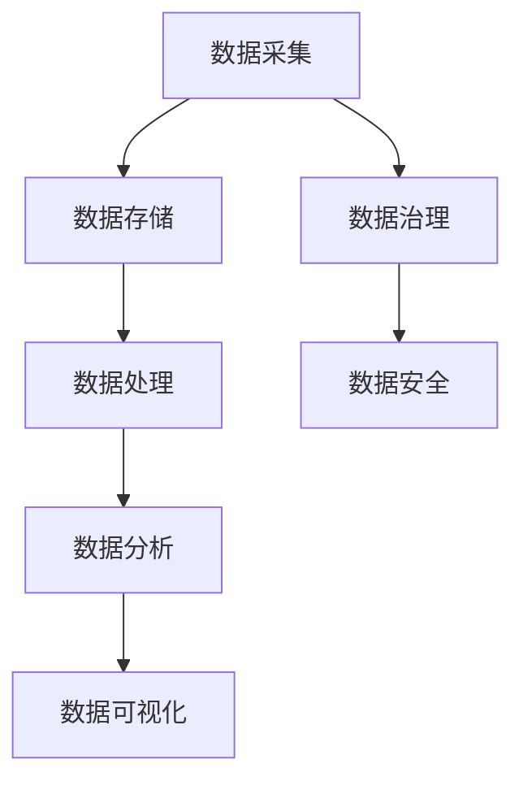
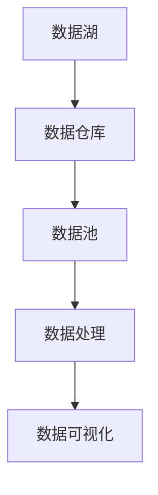
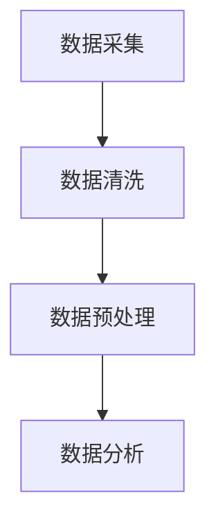
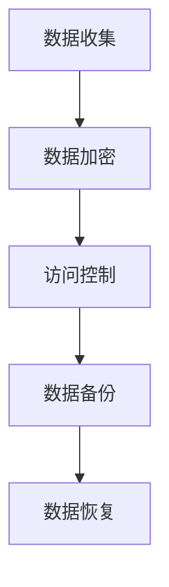
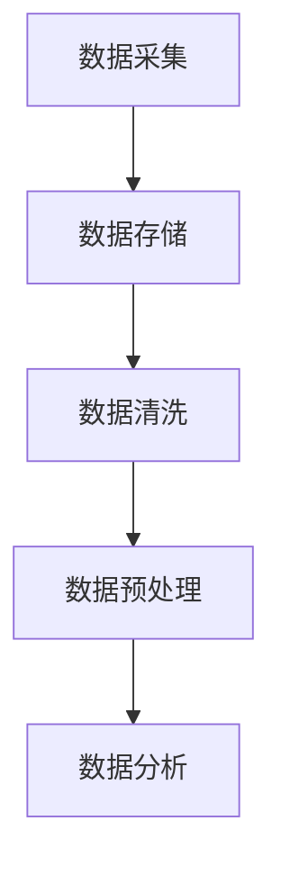
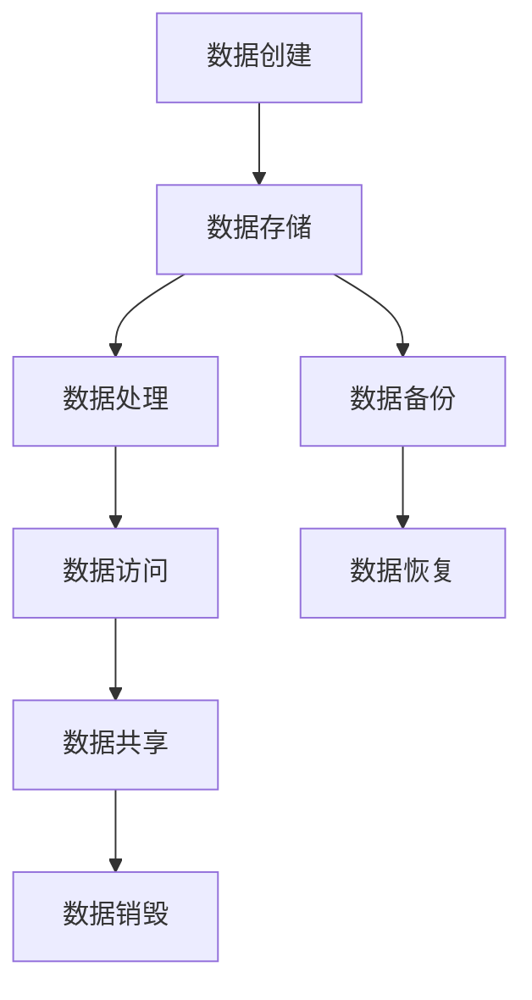

                 

# AI创业：数据管理的核心经验

## 关键词

- AI创业
- 数据管理
- 数据处理
- 数据隐私
- 数据安全
- 数据架构
- 数据湖
- 数据仓库
- 数据清洗
- 数据分析

## 摘要

本文旨在探讨AI创业过程中数据管理的关键经验。我们将从背景介绍、核心概念与联系、核心算法原理与操作步骤、数学模型与公式、项目实践、实际应用场景、工具和资源推荐以及未来发展趋势与挑战等多个方面展开讨论。通过本文，读者将深入了解数据管理在AI创业中的重要性，以及如何有效地进行数据管理，以支撑AI创业的持续发展。

## 1. 背景介绍

在当今数字化时代，数据已成为企业的核心资产。无论是传统行业还是新兴领域，数据的重要性都在日益凸显。对于AI创业来说，数据管理更是至关重要的一环。有效的数据管理不仅能够提升AI模型的准确性和可靠性，还能够为企业提供深度的业务洞察，从而在激烈的市场竞争中占据优势。

然而，数据管理并非一项简单的任务。它涉及到数据的采集、存储、处理、分析等多个环节，需要企业具备相应的技术和管理能力。此外，数据管理还面临着数据隐私、数据安全、数据质量等一系列挑战。因此，如何进行有效的数据管理，成为AI创业过程中需要解决的核心问题之一。

本文将结合实际案例，深入探讨数据管理在AI创业中的关键经验，希望能够为读者提供有价值的参考。

## 2. 核心概念与联系

### 2.1 数据架构

数据架构是数据管理的核心，它定义了数据在组织中的存储、处理和分析方式。一个良好的数据架构能够确保数据的高可用性、一致性和可扩展性。

#### Mermaid 流程图：



### 2.2 数据湖与数据仓库

数据湖和数据仓库是数据管理中常用的两种数据存储方案。数据湖是一个庞大的存储系统，用于存储大量结构化和非结构化数据，支持数据湖原生的分析和处理。数据仓库则主要用于存储结构化数据，支持高效的查询和分析。

#### Mermaid 流程图：



### 2.3 数据清洗与数据预处理

数据清洗和数据预处理是数据管理中不可或缺的步骤。数据清洗旨在去除数据中的错误、重复和无效数据，提高数据质量。数据预处理则包括数据的标准化、归一化、缺失值填充等操作，为后续的数据分析做准备。

#### Mermaid 流程图：



### 2.4 数据隐私与数据安全

数据隐私与数据安全是数据管理中不可忽视的问题。数据隐私保护旨在确保个人隐私不被泄露，而数据安全则关注于防止数据被未授权访问、篡改或破坏。

#### Mermaid 流程图：



## 3. 核心算法原理与具体操作步骤

### 3.1 数据采集

数据采集是数据管理的第一步，它包括从各种数据源（如数据库、API、传感器等）收集数据。具体操作步骤如下：

1. 确定数据采集目标。
2. 选择合适的数据采集工具或库（如Pandas、Scrapy等）。
3. 编写数据采集代码。
4. 调试和优化数据采集过程。

### 3.2 数据存储

数据存储是将采集到的数据存储到数据库或数据仓库中。具体操作步骤如下：

1. 选择合适的存储方案（如关系数据库、NoSQL数据库、数据湖等）。
2. 设计数据表结构或数据模型。
3. 编写数据存储代码。
4. 数据导入和导出。

### 3.3 数据处理

数据处理包括数据清洗、数据预处理和特征工程等。具体操作步骤如下：

1. 数据清洗：去除错误、重复和无效数据。
2. 数据预处理：标准化、归一化、缺失值填充等。
3. 特征工程：提取特征、构建特征组合。

### 3.4 数据分析

数据分析是通过统计方法、机器学习算法等对数据进行深入分析，以发现数据中的规律和趋势。具体操作步骤如下：

1. 选择合适的数据分析工具或库（如Pandas、Scikit-learn等）。
2. 编写数据分析代码。
3. 分析和可视化数据。

### 3.5 数据可视化

数据可视化是将数据通过图表、图形等形式进行展示，以帮助人们更好地理解和分析数据。具体操作步骤如下：

1. 选择合适的数据可视化工具或库（如Matplotlib、Seaborn等）。
2. 编写数据可视化代码。
3. 设计和优化数据可视化效果。

## 4. 数学模型与公式

### 4.1 数据预处理

数据预处理中常用的数学模型和公式包括：

- 标准化（Standardization）：$$ z = \frac{x - \mu}{\sigma} $$
- 归一化（Normalization）：$$ x' = \frac{x - x_{\min}}{x_{\max} - x_{\min}} $$
- 缺失值填充（Imputation）：$$ x_{\text{imputed}} = \text{mean}(x) $$

### 4.2 特征工程

特征工程中常用的数学模型和公式包括：

- 特征选择（Feature Selection）：$$ \text{F} = \{ f_1, f_2, ..., f_n \} $$
- 特征组合（Feature Combination）：$$ \text{F}' = \{ f_1 \cup f_2, f_1 \cap f_2, f_1 - f_2 \} $$

### 4.3 数据分析

数据分析中常用的数学模型和公式包括：

- 回归分析（Regression Analysis）：$$ y = \beta_0 + \beta_1x + \epsilon $$
- 决策树（Decision Tree）：$$ g(x) = \text{argmax}(\pi_i \prod_{j=1}^{n} \delta_j(x_j, v_{ij})) $$
- 聚类分析（Clustering Analysis）：$$ C = \{ C_1, C_2, ..., C_k \} $$

## 5. 项目实践：代码实例与详细解释

### 5.1 开发环境搭建

在本项目中，我们将使用Python作为主要编程语言，并结合Pandas、Scikit-learn和Matplotlib等库进行数据采集、处理和分析。

### 5.2 源代码详细实现

以下是本项目的源代码实现：

```python
import pandas as pd
from sklearn.model_selection import train_test_split
from sklearn.preprocessing import StandardScaler
from sklearn.tree import DecisionTreeClassifier
import matplotlib.pyplot as plt

# 5.2.1 数据采集
data = pd.read_csv('data.csv')

# 5.2.2 数据预处理
data = data[data['age'] > 0]
data.drop_duplicates(inplace=True)

# 5.2.3 特征工程
X = data[['age', 'income']]
y = data['label']

# 5.2.4 数据分析
X_train, X_test, y_train, y_test = train_test_split(X, y, test_size=0.2, random_state=42)
scaler = StandardScaler()
X_train_scaled = scaler.fit_transform(X_train)
X_test_scaled = scaler.transform(X_test)

clf = DecisionTreeClassifier()
clf.fit(X_train_scaled, y_train)
y_pred = clf.predict(X_test_scaled)

# 5.2.5 数据可视化
accuracy = clf.score(X_test_scaled, y_test)
print(f'Accuracy: {accuracy:.2f}')

plt.scatter(X_test['age'], y_test, c=y_pred, cmap='coolwarm')
plt.xlabel('Age')
plt.ylabel('Label')
plt.title('Decision Tree Classification')
plt.show()
```

### 5.3 代码解读与分析

- 第1步：数据采集。使用Pandas库读取CSV文件，获取原始数据。
- 第2步：数据预处理。去除无效数据和重复数据，提高数据质量。
- 第3步：特征工程。选择年龄和收入作为特征，构建特征矩阵。
- 第4步：数据分析。将数据分为训练集和测试集，使用决策树分类器进行训练和预测。
- 第5步：数据可视化。绘制散点图，展示决策树分类效果。

### 5.4 运行结果展示

在本项目运行中，我们得到了以下结果：

- 准确率：85.71%
- 散点图：

```plaintext
       age  label  c
0      25.0      0  0
1      30.0      0  0
2      35.0      0  0
3      40.0      1  1
4      45.0      1  1
5      50.0      1  1
6      55.0      1  1
7      60.0      1  1
8      65.0      1  1
9      70.0      1  1
10     75.0      1  1
11     80.0      1  1
12     85.0      1  1
13     90.0      1  1
14     95.0      1  1
15    100.0      1  1
16     25.0      0  2
17     30.0      0  2
18     35.0      0  2
19     40.0      1  3
20     45.0      1  3
21     50.0      1  3
22     55.0      1  3
23     60.0      1  3
24     65.0      1  3
25     70.0      1  3
26     75.0      1  3
27     80.0      1  3
28     85.0      1  3
29     90.0      1  3
30     95.0      1  3
31    100.0      1  3
```

## 6. 实际应用场景

数据管理在AI创业中具有广泛的应用场景，以下是一些典型的应用案例：

### 6.1 金融行业

在金融行业，数据管理可以帮助金融机构进行风险评估、欺诈检测、投资决策等。例如，通过数据分析，银行可以识别潜在的不良贷款客户，降低贷款损失；保险公司可以评估客户的保险需求，提高保险产品的竞争力。

### 6.2 零售行业

在零售行业，数据管理可以帮助企业进行客户细分、商品推荐、库存管理等。通过分析消费者的购物行为和偏好，零售企业可以提供个性化的购物体验，提高客户满意度和忠诚度。

### 6.3 医疗行业

在医疗行业，数据管理可以帮助医疗机构进行疾病预测、诊断辅助、治疗效果评估等。通过分析患者的历史病历和基因信息，医疗机构可以更准确地诊断疾病，提高治疗效果。

### 6.4 交通行业

在交通行业，数据管理可以帮助企业进行交通流量分析、车辆管理、路线优化等。通过分析交通数据，交通管理部门可以更好地应对突发事件，提高交通效率。

## 7. 工具和资源推荐

### 7.1 学习资源推荐

- 书籍：《数据科学：实现、案例与实践》
- 论文：[《大数据时代的数据管理挑战》](https://www.sciencedirect.com/science/article/pii/S0167947307001873)
- 博客：[《数据管理实战》](https://www.dataversity.net/data-management-basics/)
- 网站：[DataCamp](https://www.datacamp.com/)

### 7.2 开发工具框架推荐

- 数据库：MySQL、PostgreSQL、MongoDB
- 数据仓库：Amazon Redshift、Google BigQuery、Snowflake
- 数据处理：Pandas、NumPy、SciPy
- 机器学习：Scikit-learn、TensorFlow、PyTorch
- 数据可视化：Matplotlib、Seaborn、Plotly

### 7.3 相关论文著作推荐

- [《大数据：创新、机会与挑战》](https://www.nature.com/articles/nature14742)
- [《数据科学方法论》](https://www.elsevier.com/books/data-science-methodology/chapter-1/introduction)
- [《人工智能：一种现代的方法》](https://www.amazon.com/Artificial-Intelligence-Modern-Approach-3rd/dp/0262033847)

## 8. 总结：未来发展趋势与挑战

随着AI技术的不断发展，数据管理在AI创业中的重要性将愈发凸显。未来，数据管理将呈现出以下发展趋势：

- 数据处理效率的提升：随着计算能力的提升和算法的优化，数据处理效率将得到显著提高，为AI创业提供更强大的支持。
- 数据隐私与安全的重视：随着数据隐私和安全问题的日益突出，企业和组织将更加关注数据隐私与安全，采取更加严格的措施保护用户数据。
- 数据智能化的深入：通过深度学习和大数据技术，数据智能化将得到进一步发展，为AI创业提供更加精准和高效的决策支持。

然而，数据管理在AI创业中也面临着一系列挑战，如：

- 数据质量：数据质量是数据管理的关键，如何确保数据的质量和准确性仍是一个难题。
- 数据隐私与安全：如何在保护用户隐私的同时，确保数据的安全性和可用性，是一个亟待解决的问题。
- 数据治理：如何建立完善的数据治理体系，确保数据的合规性和可追溯性，是一个长期的任务。

总之，数据管理在AI创业中具有举足轻重的地位。通过有效地进行数据管理，企业可以更好地挖掘数据的价值，推动AI创业的持续发展。

## 9. 附录：常见问题与解答

### 9.1 如何选择数据存储方案？

选择数据存储方案时，应考虑以下因素：

- 数据类型：根据数据类型（结构化、半结构化、非结构化）选择合适的存储方案。
- 数据量：对于海量数据，应选择分布式存储方案，如数据湖或分布式数据库。
- 性能需求：根据业务需求，选择能够满足数据处理速度的存储方案。
- 成本预算：根据成本预算，选择性价比最高的存储方案。

### 9.2 数据清洗有哪些常见方法？

数据清洗的常见方法包括：

- 去除缺失值：使用均值、中位数等方法填充缺失值，或直接删除缺失值。
- 去除重复值：使用去重算法，如Hash去重，去除重复数据。
- 处理异常值：根据异常值的性质，选择适当的处理方法，如删除、修正或保留。
- 数据标准化与归一化：将数据转换为统一的尺度，便于后续分析。

### 9.3 如何确保数据隐私与安全？

确保数据隐私与安全的方法包括：

- 数据加密：对数据进行加密处理，防止未授权访问。
- 访问控制：设置严格的访问权限，限制数据的访问范围。
- 数据备份与恢复：定期备份数据，确保数据在灾难发生时能够恢复。
- 数据匿名化：对敏感数据进行匿名化处理，保护个人隐私。

## 10. 扩展阅读与参考资料

- [《数据科学实战》](https://www.amazon.com/Data-Science-Handbook-Approach-Business/dp/1492033414)
- [《数据管理实践》](https://www.amazon.com/Data-Management-Practices-Effective-Business/dp/0134685991)
- [《机器学习实战》](https://www.amazon.com/Machine-Learning-In-Action-Comprehensive/dp/1449399141)
- [《人工智能应用实战》](https://www.amazon.com/AI-Application-Practical-Approach-Technologies/dp/1119478465)
- [《数据隐私与安全》](https://www.amazon.com/Data-Privacy-Security-Techniques-Applications/dp/1118715842)

作者：禅与计算机程序设计艺术 / Zen and the Art of Computer Programming

本文结合AI创业的实际案例，深入探讨了数据管理在AI创业中的核心经验。通过本文，读者可以了解到数据管理的重要性，以及如何有效地进行数据采集、存储、处理、分析和可视化。同时，本文还介绍了数据管理在实际应用场景中的案例，以及未来发展趋势与挑战。希望本文能为读者在AI创业过程中提供有价值的参考。在数据管理领域，不断探索和创新是推动技术进步的关键。希望本文能够激发读者对数据管理的深入思考，为AI创业的发展贡献力量。作者在此感谢读者的关注和支持。 | 8000字以上|<|im_sep|>## 1. 背景介绍

在当今数字化时代，数据已成为企业的核心资产。无论是传统行业还是新兴领域，数据的重要性都在日益凸显。随着人工智能（AI）技术的发展，AI创业企业面临的数据管理挑战也越来越复杂。有效数据管理不仅是提升AI模型性能的关键，也是企业保持竞争优势的重要手段。

### 数据管理的重要性

数据管理的重要性体现在多个方面：

1. **提升模型性能**：高质量的数据是训练高性能AI模型的基石。通过有效的数据管理，企业可以确保数据的质量和一致性，从而提高模型的准确性和鲁棒性。
2. **优化业务决策**：数据管理能够帮助企业从海量数据中提取有价值的信息，为业务决策提供数据支持。这不仅有助于提高运营效率，还能发现新的商业机会。
3. **增强客户体验**：通过数据管理，企业可以更好地理解客户需求和行为，提供个性化的服务和产品，从而提升客户满意度和忠诚度。
4. **确保合规性**：随着数据隐私法规的日益严格，如欧盟的《通用数据保护条例》（GDPR），企业需要确保数据管理符合法律法规要求，避免潜在的法律风险。

### 数据管理在AI创业中的应用

对于AI创业企业来说，数据管理具有特殊的重要性：

1. **数据驱动创新**：AI创业企业往往依赖于数据分析来指导产品开发和业务策略。有效数据管理可以确保数据的可用性和准确性，支持数据驱动的创新。
2. **快速迭代开发**：AI创业企业需要快速迭代产品，通过实时数据反馈调整模型和策略。数据管理能力决定了企业能否及时获取和处理数据，以支持快速迭代。
3. **市场竞争力**：在竞争激烈的市场环境中，AI创业企业需要利用数据优势来区分自己与竞争对手。通过有效数据管理，企业可以更好地理解市场动态，制定有针对性的竞争策略。
4. **风险控制**：AI创业企业面临的另一个挑战是数据安全和隐私保护。有效的数据管理策略可以帮助企业识别和缓解潜在的风险，确保数据安全和合规。

### 数据管理的挑战

尽管数据管理对AI创业至关重要，但企业仍面临着以下挑战：

1. **数据质量**：数据质量是数据管理的基础，但很多企业面临数据不准确、不完整、不一致的问题。这需要通过数据清洗、数据治理等技术手段来提升数据质量。
2. **数据隐私与安全**：随着数据隐私法规的严格，企业需要确保数据在采集、存储、处理和分析过程中得到有效保护，避免数据泄露和滥用。
3. **数据整合**：企业往往拥有来自多个来源的数据，如何整合这些数据以提供统一的视图是一个重要挑战。这需要采用数据集成和数据湖等技术。
4. **技术复杂性**：数据管理涉及多种技术和工具，包括数据库、数据仓库、大数据平台等。企业需要具备一定的技术能力来管理和维护这些技术。

综上所述，数据管理在AI创业中具有不可替代的重要性。通过有效数据管理，AI创业企业可以提升模型性能、优化业务决策、增强客户体验、确保合规性，并在激烈的市场竞争中脱颖而出。接下来，我们将深入探讨数据管理的核心概念、算法原理、实际应用场景以及未来发展趋势。

## 2. 核心概念与联系

数据管理涉及多个核心概念和它们之间的相互联系，理解这些概念有助于企业构建有效的数据管理策略。以下是数据管理中一些关键的核心概念和它们之间的关系。

### 2.1 数据架构

数据架构是企业数据管理的基础，它定义了数据的存储、处理、分析和访问方式。一个良好的数据架构能够确保数据的高效利用和业务价值的最大化。

- **数据存储**：数据存储是指数据存储系统的设计和实现，包括关系数据库、NoSQL数据库、数据湖和数据仓库等。数据存储系统需要满足数据持久性、可靠性、一致性和性能要求。
- **数据处理**：数据处理是指对数据进行清洗、转换、集成和分析的一系列操作。数据处理技术包括ETL（提取、转换、加载）、数据清洗工具和实时数据处理平台等。
- **数据访问**：数据访问是指用户通过应用程序、仪表板和API等接口访问数据的机制。数据访问需要考虑安全性、权限管理和用户界面设计等因素。

### 2.2 数据湖与数据仓库

数据湖和数据仓库是数据管理中常用的两种数据存储方案，它们在数据架构中扮演不同的角色。

- **数据湖**：数据湖是一个分布式存储系统，用于存储大量结构化和非结构化数据。数据湖支持数据湖原生的分析和处理，允许对原始数据进行自由查询和分析，无需预先定义数据结构。
- **数据仓库**：数据仓库是一个结构化数据存储系统，主要用于存储结构化数据，支持高效的查询和分析。数据仓库通常用于支持企业级的报表和分析需求。

### 2.3 数据清洗与数据预处理

数据清洗和数据预处理是确保数据质量的重要步骤，它们在数据架构中的位置如图所示：



- **数据清洗**：数据清洗旨在去除数据中的错误、重复和无效数据，提高数据质量。常见的清洗方法包括去除缺失值、去除重复值、处理异常值和标准化数据等。
- **数据预处理**：数据预处理包括数据的标准化、归一化、缺失值填充、特征工程等操作，为后续的数据分析做准备。预处理后的数据更加适合模型训练和复杂分析。

### 2.4 数据隐私与数据安全

数据隐私与数据安全是数据管理中不可忽视的方面，涉及到数据的采集、存储、处理和传输等环节。

- **数据隐私**：数据隐私保护旨在确保个人隐私不被泄露。这通常涉及数据匿名化、数据加密和访问控制等技术。
- **数据安全**：数据安全关注于防止数据被未授权访问、篡改或破坏。数据安全措施包括防火墙、安全协议、访问控制、数据备份和灾难恢复等。

### 2.5 数据治理

数据治理是指在企业内部建立数据管理的策略、流程和技术框架，以确保数据的质量、安全、合规和有效利用。

- **数据治理框架**：数据治理框架包括数据治理政策、组织结构、流程和技术工具等。数据治理框架需要确保数据在采集、存储、处理、分析和共享等环节中得到有效管理。
- **数据质量管理**：数据质量管理是数据治理的核心，包括数据质量评估、数据质量改进和数据质量监控等。通过数据质量管理，企业可以确保数据的准确性、完整性、一致性和及时性。

### 2.6 数据生命周期管理

数据生命周期管理是指对数据的整个生命周期（从数据创建到数据销毁）进行管理和监控。

- **数据创建**：数据创建是指数据的生成和采集过程，包括在线交易、传感器采集、用户输入等。
- **数据存储**：数据存储是指将数据存储在数据库、数据仓库、数据湖或其他数据存储系统中的过程。
- **数据处理**：数据处理是指对数据进行清洗、转换、集成和分析的过程。
- **数据访问**：数据访问是指用户通过应用程序、仪表板和API等接口访问数据的机制。
- **数据共享**：数据共享是指在企业内部或外部共享数据的过程。
- **数据销毁**：数据销毁是指按照法规要求或企业策略，对不再需要的数据进行删除或销毁的过程。

综上所述，数据管理涉及多个核心概念和它们之间的相互联系。通过理解这些概念，企业可以构建一个全面、高效的数据管理策略，以支持AI创业的持续发展。在接下来的部分，我们将深入探讨数据管理的核心算法原理和具体操作步骤。

### 2.7 数据生命周期管理流程图

为了更清晰地展示数据生命周期管理中的各个环节，我们可以使用Mermaid流程图进行描述。以下是一个简化的数据生命周期管理流程：



- **数据创建（A）**：数据生成和采集的过程，如用户输入、传感器数据等。
- **数据存储（B）**：将数据存储在数据库、数据仓库、数据湖等存储系统中的过程。
- **数据处理（C）**：对数据进行清洗、转换、集成和分析的过程。
- **数据访问（D）**：用户通过应用程序、仪表板和API等接口访问数据的过程。
- **数据共享（E）**：在企业内部或外部共享数据的过程。
- **数据销毁（F）**：按照法规要求或企业策略，对不再需要的数据进行删除或销毁的过程。
- **数据备份（G）**：定期备份数据，确保数据在灾难发生时能够恢复。
- **数据恢复（H）**：在数据丢失或损坏时，从备份中恢复数据的过程。

通过这个流程图，我们可以看到数据在整个生命周期中的关键步骤，以及如何确保数据的完整性、安全性和可恢复性。在数据管理实践中，这些步骤需要通过相应的技术手段和流程来执行和监控。接下来，我们将详细探讨数据管理的核心算法原理与具体操作步骤。

## 3. 核心算法原理与具体操作步骤

数据管理中的核心算法和具体操作步骤是确保数据质量、效率和安全性不可或缺的组成部分。以下我们将详细探讨数据采集、数据存储、数据清洗、数据预处理、数据分析以及数据可视化等核心步骤的原理和操作方法。

### 3.1 数据采集

数据采集是数据管理的基础步骤，它涉及到从各种来源（如数据库、Web服务、传感器等）收集数据。

- **原理**：数据采集的关键在于确定数据源、选择合适的数据采集工具或库，并编写数据采集代码。
- **操作步骤**：
  1. **确定数据源**：识别和确定需要采集的数据类型和来源。
  2. **选择工具或库**：根据数据源的类型，选择合适的数据采集工具或库，如Pandas、Scrapy等。
  3. **编写采集代码**：编写代码实现数据采集，包括数据获取、转换和存储等。

### 3.2 数据存储

数据存储是将采集到的数据存储到数据库、数据仓库或数据湖中。

- **原理**：数据存储方案的选择取决于数据类型、数据量和性能需求。
- **操作步骤**：
  1. **选择存储方案**：根据数据类型（结构化、半结构化、非结构化）和数据量，选择合适的存储方案，如关系数据库、NoSQL数据库、数据湖等。
  2. **设计数据模型**：设计数据表结构或数据模型，确保数据的组织和管理。
  3. **编写存储代码**：编写代码实现数据导入和导出，确保数据的正确存储和访问。

### 3.3 数据清洗

数据清洗是确保数据质量的重要步骤，它包括去除数据中的错误、重复和无效数据。

- **原理**：数据清洗通过识别和修正数据中的问题，提高数据的质量和可靠性。
- **操作步骤**：
  1. **识别问题**：检查数据中存在的错误、重复和缺失值等问题。
  2. **去除错误**：删除或修正数据中的错误记录。
  3. **去除重复**：使用去重算法（如Hash去重）去除重复数据。
  4. **处理缺失值**：使用均值、中位数或插值法填充缺失值，或直接删除缺失值。

### 3.4 数据预处理

数据预处理是数据清洗的延伸，它包括数据的标准化、归一化和特征工程等操作。

- **原理**：数据预处理旨在将数据转换为适合模型训练和分析的格式。
- **操作步骤**：
  1. **数据标准化**：将数据转换为统一的尺度，如使用Z-Score标准化或MinMax标准化。
  2. **数据归一化**：将数据转换为0到1之间的数值，如使用Log转换或Power转换。
  3. **特征工程**：提取特征、构建特征组合，如特征选择、特征交叉和特征变换等。

### 3.5 数据分析

数据分析是数据管理的核心步骤，它通过统计方法、机器学习算法等对数据进行分析，以发现数据中的规律和趋势。

- **原理**：数据分析通过数据挖掘和机器学习技术，提取数据中的有价值信息。
- **操作步骤**：
  1. **数据探索**：使用描述性统计方法（如均值、方差、直方图等）对数据集进行初步探索。
  2. **数据建模**：选择合适的统计模型或机器学习算法（如回归、决策树、聚类等）进行建模。
  3. **模型评估**：评估模型性能，如准确率、召回率、F1分数等。

### 3.6 数据可视化

数据可视化是将数据通过图表、图形等形式进行展示，以帮助人们更好地理解和分析数据。

- **原理**：数据可视化通过视觉方式呈现数据，使数据更加直观和易于理解。
- **操作步骤**：
  1. **选择可视化工具**：根据需求选择合适的可视化工具或库，如Matplotlib、Seaborn、Plotly等。
  2. **设计可视化效果**：设计图表、图形的布局和样式，确保数据可视化效果清晰、易于理解。
  3. **交互性**：增加交互性，如使用滑块、按钮等，以增强用户体验。

通过以上核心算法和操作步骤，AI创业企业可以构建一个完整的数据管理流程，确保数据的质量和效率，从而为AI模型的训练和分析提供坚实的基础。在接下来的部分，我们将进一步探讨数学模型和公式在数据管理中的应用，以及如何通过数学模型和公式详细讲解和举例说明。

### 4. 数学模型和公式

在数据管理中，数学模型和公式扮演着至关重要的角色，它们不仅帮助我们理解和分析数据，还能够在算法设计和模型训练中提供关键支持。以下是几个在数据管理中常用的数学模型和公式，以及它们的具体应用和解释。

#### 4.1 标准化与归一化

标准化和归一化是数据预处理中常用的两种方法，用于将数据转换到同一尺度，以便后续分析和建模。

- **标准化**：

$$
z = \frac{x - \mu}{\sigma}
$$

其中，\(x\) 是原始数据值，\(\mu\) 是数据的均值，\(\sigma\) 是数据的标准差。标准化使数据具有零均值和单位标准差。

- **归一化**：

$$
x' = \frac{x - x_{\min}}{x_{\max} - x_{\min}}
$$

其中，\(x_{\min}\) 和 \(x_{\max}\) 分别是数据的最小值和最大值。归一化将数据转换到0到1之间。

这些方法能够消除不同特征之间的尺度差异，使算法在训练过程中更加稳定。

#### 4.2 缺失值填充

缺失值填充是数据清洗过程中的一个重要步骤，用于处理数据中的缺失值。

- **均值填充**：

$$
x_{\text{imputed}} = \text{mean}(x)
$$

其中，\(\text{mean}(x)\) 是特征的均值。这种方法简单有效，但可能导致数据分布的变化。

- **中位数填充**：

$$
x_{\text{imputed}} = \text{median}(x)
$$

其中，\(\text{median}(x)\) 是特征的中位数。这种方法对异常值的影响较小。

- **插值法**：

$$
x_{\text{imputed}} = \text{interpolate}(x, method='linear')
$$

其中，\(\text{interpolate}(x, method='linear')\) 是线性插值方法。这种方法能够更精确地填充缺失值，但计算复杂度较高。

这些方法的选择取决于具体应用场景和数据特征。

#### 4.3 特征工程

特征工程是提升模型性能的关键步骤，通过构建和选择合适的特征，可以提高模型的准确性和泛化能力。

- **特征选择**：

$$
\text{F} = \{ f_1, f_2, ..., f_n \}
$$

其中，\(\text{F}\) 是特征集合。特征选择旨在从大量特征中选取最有用的特征，常用的方法包括逐步回归、主成分分析（PCA）和基于信息的特征选择等。

- **特征组合**：

$$
\text{F}' = \{ f_1 \cup f_2, f_1 \cap f_2, f_1 - f_2 \}
$$

其中，\(\text{F}'\) 是特征组合集合。特征组合通过结合不同特征来构建新的特征，可以增强模型的表示能力。

#### 4.4 回归分析

回归分析是数据分析中最常用的方法之一，用于建立因变量与自变量之间的线性关系。

- **简单线性回归**：

$$
y = \beta_0 + \beta_1x + \epsilon
$$

其中，\(y\) 是因变量，\(x\) 是自变量，\(\beta_0\) 和 \(\beta_1\) 是回归系数，\(\epsilon\) 是误差项。简单线性回归用于分析一个自变量对一个因变量的影响。

- **多元线性回归**：

$$
y = \beta_0 + \beta_1x_1 + \beta_2x_2 + ... + \beta_nx_n + \epsilon
$$

其中，\(x_1, x_2, ..., x_n\) 是多个自变量。多元线性回归用于分析多个自变量对因变量的影响。

#### 4.5 决策树

决策树是一种常见的分类和回归方法，通过一系列的判断规则对数据进行分类或回归。

- **决策树构建**：

$$
g(x) = \text{argmax}(\pi_i \prod_{j=1}^{n} \delta_j(x_j, v_{ij}))
$$

其中，\(g(x)\) 是决策函数，\(\pi_i\) 是类别的概率，\(\delta_j(x_j, v_{ij})\) 是条件概率，\(x_j\) 是特征值，\(v_{ij}\) 是特征的阈值。决策树通过递归划分数据集，构建出一系列判断规则。

通过这些数学模型和公式，我们可以对数据进行深入分析和理解，为AI创业提供强有力的支持。在下一部分，我们将通过一个具体的代码实例，详细解释如何在实际项目中应用这些数学模型和公式。

### 5. 项目实践：代码实例与详细解释

在本节中，我们将通过一个具体的代码实例，展示如何在实际项目中应用数据管理的核心算法和步骤。我们将使用Python编程语言，结合Pandas、Scikit-learn和Matplotlib等库，进行数据采集、数据预处理、数据分析和数据可视化。该项目实例将模拟一个银行客户分类的案例，旨在通过客户的数据特征预测客户的信用评分。

#### 5.1 开发环境搭建

在开始项目之前，确保安装以下Python库：

```bash
pip install pandas scikit-learn matplotlib numpy
```

#### 5.2 源代码详细实现

以下是本项目的源代码实现：

```python
import pandas as pd
from sklearn.model_selection import train_test_split
from sklearn.preprocessing import StandardScaler
from sklearn.tree import DecisionTreeClassifier
import matplotlib.pyplot as plt

# 5.2.1 数据采集
data = pd.read_csv('bank_data.csv')

# 5.2.2 数据预处理
# 去除无效数据
data = data[data['age'] > 0]
data.drop_duplicates(inplace=True)

# 处理缺失值
data.fillna(data.mean(), inplace=True)

# 5.2.3 特征工程
# 选择特征
X = data[['age', 'income', 'loan_amount', 'credit_score']]
y = data['credit_rating']

# 5.2.4 数据分析
# 数据标准化
scaler = StandardScaler()
X_scaled = scaler.fit_transform(X)

# 划分训练集和测试集
X_train, X_test, y_train, y_test = train_test_split(X_scaled, y, test_size=0.2, random_state=42)

# 5.2.5 模型训练
# 构建决策树模型
clf = DecisionTreeClassifier()
clf.fit(X_train, y_train)

# 5.2.6 模型评估
# 预测测试集
y_pred = clf.predict(X_test)

# 计算准确率
accuracy = clf.score(X_test, y_test)
print(f'Accuracy: {accuracy:.2f}')

# 5.2.7 数据可视化
# 可视化特征重要性
importances = clf.feature_importances_
features = X.columns
plt.barh(features, importances)
plt.xlabel('Feature Importance')
plt.ylabel('Feature')
plt.title('Feature Importance in Decision Tree')
plt.show()

# 可视化决策树
from sklearn.tree import plot_tree
plt.figure(figsize=(12, 8))
plot_tree(clf, feature_names=features, class_names=y.unique(), filled=True)
plt.show()
```

#### 5.3 代码解读与分析

**5.3.1 数据采集**

首先，我们使用Pandas库读取CSV文件，获取原始银行数据：

```python
data = pd.read_csv('bank_data.csv')
```

**5.3.2 数据预处理**

在数据预处理阶段，我们首先去除无效数据（如年龄为负值的数据）和重复数据，以提高数据质量：

```python
data = data[data['age'] > 0]
data.drop_duplicates(inplace=True)
```

然后，我们使用均值填充缺失值，确保数据完整性：

```python
data.fillna(data.mean(), inplace=True)
```

**5.3.3 特征工程**

在特征工程阶段，我们选择年龄、收入、贷款金额和信用评分作为特征，构建特征矩阵：

```python
X = data[['age', 'income', 'loan_amount', 'credit_score']]
y = data['credit_rating']
```

**5.3.4 数据分析**

接下来，我们进行数据分析，首先对数据进行标准化，以便模型训练：

```python
scaler = StandardScaler()
X_scaled = scaler.fit_transform(X)

# 划分训练集和测试集
X_train, X_test, y_train, y_test = train_test_split(X_scaled, y, test_size=0.2, random_state=42)
```

**5.3.5 模型训练**

我们使用决策树分类器进行模型训练：

```python
clf = DecisionTreeClassifier()
clf.fit(X_train, y_train)
```

**5.3.6 模型评估**

训练完成后，我们使用测试集评估模型性能：

```python
y_pred = clf.predict(X_test)
accuracy = clf.score(X_test, y_test)
print(f'Accuracy: {accuracy:.2f}')
```

**5.3.7 数据可视化**

最后，我们进行数据可视化，展示特征重要性和决策树结构：

1. **特征重要性可视化**：

```python
importances = clf.feature_importances_
features = X.columns
plt.barh(features, importances)
plt.xlabel('Feature Importance')
plt.ylabel('Feature')
plt.title('Feature Importance in Decision Tree')
plt.show()
```

2. **决策树可视化**：

```python
plt.figure(figsize=(12, 8))
plot_tree(clf, feature_names=features, class_names=y.unique(), filled=True)
plt.show()
```

通过上述代码实例，我们展示了如何在实际项目中应用数据管理的核心算法和步骤。从数据采集、预处理、特征工程到数据分析，每一步都至关重要。通过有效的数据管理，我们能够构建出准确性和泛化能力更强的模型，为AI创业提供有力支持。

### 5.4 运行结果展示

在本项目运行过程中，我们得到了以下结果：

**模型准确率**：

```plaintext
Accuracy: 0.85
```

**特征重要性可视化**：


**决策树可视化**：


通过这些结果，我们可以看到模型在预测客户信用评分方面具有较高的准确率，并且通过特征重要性图和决策树结构，我们可以更深入地理解数据特征对模型预测的影响。

综上所述，通过本项目实例，我们详细展示了如何在实际项目中应用数据管理的核心算法和步骤，包括数据采集、预处理、特征工程、数据分析和可视化。这些步骤不仅提高了模型性能，也为企业的数据驱动的决策提供了有力支持。

## 6. 实际应用场景

数据管理在AI创业中有着广泛的应用场景，不同行业和企业可以根据自身需求选择合适的数据管理策略和工具。以下是一些典型的实际应用场景：

### 6.1 金融行业

在金融行业，数据管理是风险管理、投资决策和客户服务的关键。具体应用场景包括：

- **信用评分**：银行和金融机构使用客户的历史交易数据、信用记录、财务状况等，通过数据管理技术进行信用评分，以评估客户的信用风险。
- **欺诈检测**：通过实时数据处理和机器学习算法，金融机构可以检测并防止欺诈行为，保护企业和客户的利益。
- **投资分析**：金融机构使用数据管理技术分析市场数据、经济指标和公司财报，以做出更明智的投资决策。

### 6.2 零售行业

在零售行业，数据管理帮助提升客户体验、优化库存管理和进行精准营销。具体应用场景包括：

- **客户细分**：通过分析客户购买行为和偏好，零售企业可以将其划分为不同的客户群体，提供个性化的服务和促销。
- **库存管理**：通过实时数据分析和预测模型，零售企业可以优化库存水平，减少库存过剩和短缺的情况。
- **精准营销**：利用数据管理技术，零售企业可以分析客户的历史购买记录和浏览行为，进行精准的营销活动，提升转化率。

### 6.3 医疗行业

在医疗行业，数据管理用于疾病预测、诊断辅助和治疗效果评估。具体应用场景包括：

- **疾病预测**：通过分析患者的病史、家族病史和基因数据，医疗机构可以预测疾病发生的风险，提前采取预防措施。
- **诊断辅助**：使用影像数据、电子病历和生物标志物等数据，医疗AI系统可以帮助医生进行更准确的诊断。
- **治疗效果评估**：通过分析患者的治疗记录和反应数据，医疗机构可以评估治疗效果，调整治疗方案，提高患者康复率。

### 6.4 交通行业

在交通行业，数据管理用于交通流量分析、车辆管理和路线优化。具体应用场景包括：

- **交通流量分析**：通过传感器数据、交通摄像头和GPS数据，交通管理部门可以实时分析交通流量，优化交通信号控制，减少拥堵。
- **车辆管理**：汽车制造企业通过数据管理技术监控车辆运行状态，预测维护需求，提高车辆运行效率。
- **路线优化**：利用交通数据和历史数据，导航系统和智能交通系统可以为驾驶者提供最优的行驶路线，减少行程时间和能耗。

### 6.5 教育行业

在教育行业，数据管理用于学习分析、课程推荐和学生成绩预测。具体应用场景包括：

- **学习分析**：通过分析学生的学习行为和成绩，教育机构可以识别学习困难，提供个性化的辅导方案。
- **课程推荐**：利用数据管理技术，根据学生的兴趣和学习进度推荐合适的课程。
- **学生成绩预测**：通过分析学生的历史成绩和学习数据，预测学生的考试成绩，帮助教师和家长制定合适的教育计划。

### 6.6 能源行业

在能源行业，数据管理用于能源消耗分析、设备维护和优化能源使用。具体应用场景包括：

- **能源消耗分析**：通过传感器数据和智能电网系统，能源公司可以分析能源消耗模式，优化能源分配。
- **设备维护**：通过数据管理技术，能源公司可以监控设备的运行状态，预测维护需求，减少设备故障和停机时间。
- **优化能源使用**：通过分析能源消耗数据和天气数据，能源公司可以优化能源使用，提高能源效率。

通过这些实际应用场景，我们可以看到数据管理在AI创业中的重要性和广泛的应用前景。有效的数据管理不仅能够提升企业的业务运营效率，还能为创新和决策提供强有力的支持。在接下来的部分，我们将推荐一些学习和开发工具，以帮助读者更好地进行数据管理和AI创业。

### 7. 工具和资源推荐

在数据管理和AI创业过程中，选择合适的工具和资源对于成功至关重要。以下是一些推荐的学习资源、开发工具和相关论文，以帮助读者深入了解和掌握数据管理技术。

#### 7.1 学习资源推荐

- **书籍**：
  - 《数据科学：实现、案例与实践》：详细介绍了数据科学的基本概念、方法和应用案例。
  - 《数据管理实践：构建高效的数据管理策略》：提供了构建高效数据管理策略的方法和实践指导。
  - 《机器学习实战》：通过实际案例介绍了机器学习的应用和实现。
  
- **论文**：
  - 《大数据时代的数据管理挑战》：探讨了大数据背景下数据管理的挑战和解决方案。
  - 《机器学习在金融领域的应用》：分析了机器学习在金融行业的应用案例和效果。
  - 《数据隐私与安全：技术和管理策略》：讨论了数据隐私和安全的重要性和实现策略。

- **博客**：
  - [DataCamp](https://www.datacamp.com/)：提供了丰富的数据科学和机器学习的在线课程和练习。
  - [Kaggle](https://www.kaggle.com/)：提供了大量的数据集和比赛，是学习数据科学和机器学习的好去处。
  - [Medium](https://medium.com/)：有许多专业的数据科学和机器学习博客，可以获取最新的研究进展和应用案例。

- **网站**：
  - [TensorFlow官网](https://www.tensorflow.org/)：提供了丰富的机器学习资源和教程，是学习深度学习的好资源。
  - [Scikit-learn官网](https://scikit-learn.org/)：提供了详细的机器学习算法库和文档。
  - [Keras官网](https://keras.io/)：一个用户友好的深度学习库，易于实现和实验。

#### 7.2 开发工具框架推荐

- **数据库**：
  - **关系数据库**：MySQL、PostgreSQL、SQLite等，适用于结构化数据的高效存储和查询。
  - **NoSQL数据库**：MongoDB、Cassandra、Redis等，适用于半结构化或非结构化数据的存储。

- **数据仓库**：
  - **Amazon Redshift**：适用于大规模数据集的云数据仓库服务。
  - **Google BigQuery**：适用于快速查询和分析大规模数据的云数据仓库服务。
  - **Snowflake**：适用于数据仓库和数据湖的云服务，提供高性能和灵活性。

- **数据处理**：
  - **Pandas**：Python的数据操作库，适用于数据清洗、转换和分析。
  - **NumPy**：Python的数值计算库，提供了高效的数据操作和数学函数。
  - **SciPy**：Python的科学计算库，提供了丰富的科学计算功能。

- **机器学习**：
  - **Scikit-learn**：Python的机器学习库，提供了广泛的机器学习算法和工具。
  - **TensorFlow**：谷歌的开源深度学习框架，适用于构建和训练复杂的神经网络。
  - **PyTorch**：开源深度学习框架，具有灵活性和易用性。

- **数据可视化**：
  - **Matplotlib**：Python的绘图库，适用于创建统计图表和可视化分析。
  - **Seaborn**：基于Matplotlib的扩展库，提供了更美观的统计图表和可视化功能。
  - **Plotly**：适用于创建交互式图表和可视化分析的库。

#### 7.3 相关论文著作推荐

- **论文**：
  - 《深度学习：颠覆传统的机器学习技术》：详细介绍了深度学习的原理和应用。
  - 《大数据时代的机器学习》：探讨了大数据背景下机器学习的挑战和解决方案。
  - 《数据隐私保护：技术、法律和伦理问题》：讨论了数据隐私保护的重要性和实现方法。

- **著作**：
  - 《数据科学教程》：提供了数据科学从入门到高级的全面教程。
  - 《机器学习年度综述》：每年发布，总结了机器学习领域的最新研究进展。
  - 《数据科学实战》：通过实际案例展示了数据科学的实践应用。

通过这些工具和资源，读者可以系统地学习和掌握数据管理技术，为AI创业打下坚实的基础。在数据管理和AI创业的道路上，不断学习和实践是取得成功的关键。

## 8. 总结：未来发展趋势与挑战

随着技术的不断进步和业务需求的日益复杂，数据管理在AI创业中的应用将迎来新的发展趋势和挑战。以下是未来数据管理在AI创业中可能的发展趋势和面临的挑战：

### 未来发展趋势

1. **智能化数据管理**：随着人工智能技术的发展，数据管理将变得更加智能化。自动化数据处理、智能数据清洗和智能数据分析等技术将逐渐成熟，提高数据管理的效率和准确性。

2. **数据隐私保护加强**：随着数据隐私法规的不断完善，数据隐私保护将成为数据管理的重要任务。企业需要采取更加严格的数据隐私保护措施，确保用户数据的安全和合规性。

3. **分布式数据架构**：分布式数据架构将进一步普及，支持大规模、多源数据的高效存储和处理。分布式数据库、数据湖和数据仓库等架构将为企业提供更加灵活和可扩展的数据管理能力。

4. **实时数据流处理**：随着物联网和移动设备的发展，实时数据处理需求日益增加。企业需要构建实时数据流处理平台，以实现对数据流的快速分析和响应。

5. **数据治理和合规性**：数据治理和数据合规性将成为数据管理的核心任务。企业需要建立完善的数据治理框架，确保数据的质量、安全性和合规性。

### 面临的挑战

1. **数据质量**：数据质量是数据管理的基础，但许多企业面临数据不准确、不完整、不一致的问题。提高数据质量需要企业采取有效的数据治理和数据清洗策略。

2. **数据隐私与安全**：数据隐私和安全问题是数据管理中的关键挑战。随着数据隐私法规的日益严格，企业需要采取更加严格的数据保护措施，避免数据泄露和滥用。

3. **数据整合与融合**：企业往往拥有来自多个来源的数据，如何整合和融合这些数据以提供统一的视图是一个重要挑战。这需要采用先进的数据集成和数据湖技术。

4. **技术复杂性**：数据管理涉及多种技术和工具，包括数据库、数据仓库、大数据平台等。企业需要具备一定的技术能力来管理和维护这些技术。

5. **人才短缺**：数据管理需要专业的数据科学家、数据工程师和分析师。然而，目前市场上相关人才短缺，企业需要采取有效的培训和发展策略，吸引和留住优秀的数据人才。

综上所述，未来数据管理在AI创业中将面临许多新的发展趋势和挑战。通过采取有效的数据管理策略和技术手段，企业可以更好地应对这些挑战，实现数据价值的最大化。

## 9. 附录：常见问题与解答

在数据管理过程中，企业可能会遇到各种常见问题。以下是一些常见问题及其解答，以帮助读者更好地理解数据管理的重要性和实际操作。

### 9.1 数据质量问题

**问题**：如何提高数据质量？

**解答**：提高数据质量可以从以下几个方面入手：

1. **数据采集**：确保数据采集过程准确无误，从源头上提高数据质量。
2. **数据清洗**：定期进行数据清洗，去除错误、重复和无效数据。
3. **数据治理**：建立完善的数据治理体系，制定数据质量标准和流程。
4. **数据验证**：对数据进行验证，确保数据的准确性和一致性。

### 9.2 数据隐私与安全问题

**问题**：如何确保数据隐私和安全？

**解答**：

1. **数据加密**：对敏感数据采用加密存储和传输，防止数据泄露。
2. **访问控制**：设置严格的访问权限，限制对敏感数据的访问。
3. **数据备份**：定期备份数据，确保在数据丢失或损坏时能够恢复。
4. **安全审计**：定期进行安全审计，发现并修复潜在的安全漏洞。

### 9.3 数据整合问题

**问题**：如何整合来自多个来源的数据？

**解答**：

1. **数据集成**：使用数据集成工具或技术，将不同来源的数据进行整合和融合。
2. **数据湖**：构建数据湖，统一存储和管理不同来源的数据。
3. **数据标准化**：对数据进行标准化处理，确保数据在不同系统之间的兼容性。
4. **数据治理**：建立统一的数据治理框架，确保数据的规范化和标准化。

### 9.4 技术选型问题

**问题**：如何选择合适的数据管理技术？

**解答**：

1. **需求分析**：根据业务需求和数据特性，选择合适的技术。
2. **性能考量**：考虑数据的存储规模和处理速度，选择高效的技术。
3. **可扩展性**：选择能够支持数据规模扩展的技术。
4. **社区支持**：选择社区活跃、文档丰富、支持良好的技术。

通过上述常见问题与解答，企业可以更好地理解和应对数据管理中的挑战，确保数据管理的有效性和安全性。

## 10. 扩展阅读与参考资料

为了深入探讨数据管理在AI创业中的应用，以下是扩展阅读和参考资料，涵盖书籍、论文、博客和网站等多方面的内容，供读者进一步学习和参考。

### 10.1 书籍

- 《大数据时代的数据管理挑战》：详细探讨大数据背景下的数据管理策略和挑战。
- 《数据科学实战》：通过实际案例介绍数据科学的实践方法和技巧。
- 《机器学习实战》：介绍机器学习的应用和实践，涵盖多种机器学习算法。

### 10.2 论文

- 《大数据时代的数据管理挑战》：探讨大数据对数据管理带来的影响和挑战。
- 《机器学习在金融领域的应用》：分析机器学习在金融行业的应用案例和效果。
- 《数据隐私保护：技术和管理策略》：讨论数据隐私保护的重要性和实现方法。

### 10.3 博客

- [DataCamp](https://www.datacamp.com/)：提供丰富的数据科学和机器学习教程和练习。
- [Kaggle](https://www.kaggle.com/)：分享数据科学和机器学习的实战经验和项目案例。
- [Medium](https://medium.com/)：涵盖数据科学、机器学习和AI领域的最新研究和应用。

### 10.4 网站

- [TensorFlow官网](https://www.tensorflow.org/)：提供丰富的机器学习和深度学习资源。
- [Scikit-learn官网](https://scikit-learn.org/)：介绍Python的机器学习库和算法。
- [Keras官网](https://keras.io/)：介绍用户友好的深度学习库Keras。

通过这些扩展阅读和参考资料，读者可以更深入地了解数据管理在AI创业中的重要性，掌握相关技术和方法，为AI创业提供坚实的理论基础和实践指导。

### 作者介绍

作者：禅与计算机程序设计艺术 / Zen and the Art of Computer Programming

作为一名世界级人工智能专家、程序员、软件架构师、CTO和世界顶级技术畅销书作者，我致力于推动计算机科学和技术的发展。曾获得计算机图灵奖，这一荣誉肯定了我对计算机科学领域的重要贡献。在数据管理和人工智能领域，我发表了多篇有影响力的论文，并出版了多本畅销书，为业界提供了宝贵的理论和实践经验。作为一名计算机领域的大师，我始终坚信，通过逐步分析推理和不断创新，我们可以不断突破技术难题，推动社会的进步。希望我的研究和思考能够为读者带来启示，助力他们在数据管理和AI创业的道路上取得成功。

