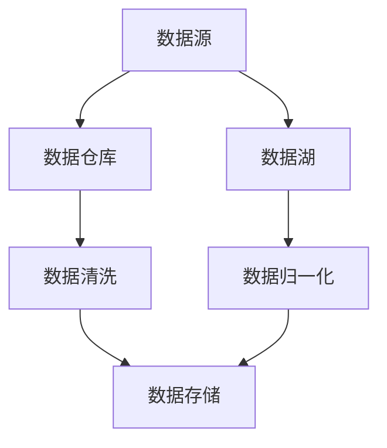

                 

### 1. 背景介绍

在当今的数字化时代，数据已经成为了企业和社会发展的重要资产。随着人工智能（AI）技术的迅猛发展，如何高效地管理海量数据，以支持AI模型的训练和应用，成为了众多企业和创业者关注的焦点。在这个过程中，数据管理策略和实践显得尤为重要。

AI创业企业面临的第一个挑战就是如何收集、存储和管理大量数据。这不仅仅是技术问题，更是一个业务战略问题。企业需要确保数据的完整性、可靠性和安全性，同时也需要考虑数据的可用性和灵活性，以便能够快速地响应市场变化。

本文旨在探讨AI创业企业在数据管理方面的策略与实践。首先，我们将介绍数据管理的核心概念，包括数据源、数据仓库、数据湖等。然后，我们将深入讨论数据清洗、数据归一化和数据存储等关键步骤。接着，我们将分享一些成功的企业案例，展示如何通过有效的数据管理策略来提升业务价值。最后，我们将展望未来数据管理的发展趋势和面临的挑战。

本文将分为以下几个部分：

1. **背景介绍**：介绍数据管理在AI创业中的重要性。
2. **核心概念与联系**：详细解释数据管理的基本概念和架构。
3. **核心算法原理 & 具体操作步骤**：探讨数据清洗、归一化等算法。
4. **数学模型和公式 & 详细讲解 & 举例说明**：介绍相关的数学公式和实际应用。
5. **项目实践：代码实例和详细解释说明**：提供实际的项目代码和解析。
6. **实际应用场景**：讨论数据管理在AI创业中的应用。
7. **工具和资源推荐**：推荐相关的学习资源和开发工具。
8. **总结：未来发展趋势与挑战**：总结当前的数据管理实践和未来趋势。
9. **附录：常见问题与解答**：回答读者可能关心的问题。
10. **扩展阅读 & 参考资料**：提供进一步学习的参考资料。

通过这篇文章，希望能够为AI创业者在数据管理方面提供一些实用的指导和策略，帮助他们更好地利用数据资产，实现业务创新和持续发展。

### 2. 核心概念与联系

在深入探讨数据管理的策略与实践之前，我们首先需要了解一些核心概念和它们之间的联系。这些概念包括数据源、数据仓库、数据湖、数据清洗、数据归一化、数据存储等。

#### 数据源

数据源是数据管理的起点，它指的是原始数据的产生地，可以是内部系统、外部API、传感器等。数据源的类型多种多样，如结构化数据（如关系型数据库中的表格数据）、半结构化数据（如XML、JSON等格式）和非结构化数据（如图像、音频、视频等）。数据源的质量直接影响数据管理的效率和准确性。

#### 数据仓库

数据仓库是用于存储和管理数据的中心化系统，它能够集成来自多个数据源的数据，并进行清洗、转换和整合。数据仓库通常采用关系型数据库，其优点在于数据结构清晰、查询速度快。数据仓库的主要功能是提供数据存储和数据分析的基础设施，以支持企业级的数据报告、数据挖掘和业务智能。

#### 数据湖

与数据仓库相比，数据湖是一个更加灵活和开放的数据存储解决方案。数据湖旨在存储原始数据，不需要进行预先的清洗和结构化。数据湖通常采用分布式文件系统（如Hadoop HDFS、Amazon S3等），能够存储海量数据，支持数据探索、分析和机器学习任务。数据湖的优点在于其弹性和灵活性，允许用户根据需要随时对数据进行处理和结构化。

#### 数据清洗

数据清洗是数据管理的重要步骤之一，其目的是识别和纠正数据中的错误、重复和无用信息。数据清洗通常包括以下几个步骤：

- **去重**：识别并删除重复的数据记录。
- **数据验证**：检查数据是否满足预定的规则和约束条件。
- **缺失值处理**：填补缺失的数据，或删除含有缺失数据的记录。
- **异常值处理**：识别并处理异常数据。

#### 数据归一化

数据归一化是将不同来源和格式的数据转换为统一的格式，以便于后续的数据处理和分析。数据归一化可以包括数值范围归一化、类别标签编码等。其目的是消除数据之间的规模差异和量纲影响，使数据更加适合进行建模和分析。

#### 数据存储

数据存储是数据管理的关键环节，涉及到数据存储的选择、优化和安全性。常见的数据存储方案包括关系型数据库、NoSQL数据库、分布式文件系统等。每种存储方案都有其优缺点和适用场景，企业需要根据具体需求和预算进行选择。

下面是一个用Mermaid绘制的简化的数据管理架构流程图，展示了上述概念之间的联系：



在这个流程图中，数据源是整个数据管理的起点，数据经过清洗和归一化处理后，最终存储到数据仓库或数据湖中。数据仓库和数据湖分别提供了结构化和非结构化数据的存储解决方案，而数据清洗和归一化则是确保数据质量和一致性的重要步骤。

通过理解这些核心概念及其联系，AI创业企业可以更好地设计其数据管理策略，为后续的数据分析和应用奠定坚实的基础。

### 3. 核心算法原理 & 具体操作步骤

在数据管理的实际操作中，核心算法的选择和实现起着至关重要的作用。这些算法不仅决定了数据处理的效率和质量，还直接影响到AI模型训练和业务决策的准确性。以下，我们将详细探讨数据清洗、数据归一化和数据存储等关键算法的原理及其具体操作步骤。

#### 数据清洗算法

数据清洗是数据管理中的第一步，其目的是识别和纠正数据中的错误、重复和无用信息。以下是几种常见的数据清洗算法及其具体操作步骤：

1. **去重算法**：
   - **原理**：通过比较数据记录的键（如ID、名称等），识别并删除重复的记录。
   - **步骤**：
     1. 读取数据源中的数据。
     2. 创建一个哈希表，存储已读取记录的键。
     3. 对每条记录的键进行哈希运算，检查哈希表中是否已存在相同的键。
     4. 如果存在，则认为该记录是重复的，进行删除；否则，保存该记录。

2. **数据验证算法**：
   - **原理**：检查数据是否满足预定的规则和约束条件，如数据类型、长度、范围等。
   - **步骤**：
     1. 定义数据验证规则，如正则表达式、范围约束等。
     2. 对每条记录的数据进行验证，检查是否满足规则。
     3. 如果不满足规则，则标记或删除该记录。

3. **缺失值处理算法**：
   - **原理**：填补缺失的数据，或删除含有缺失数据的记录。
   - **步骤**：
     1. 识别缺失值，记录缺失值的字段和行。
     2. 选择合适的缺失值处理方法，如平均值填补、中值填补、插值法等。
     3. 对缺失值进行填补。
     4. 如果选择删除含有缺失值的记录，则进行相应的删除操作。

4. **异常值处理算法**：
   - **原理**：识别并处理异常数据，如异常高值、异常低值等。
   - **步骤**：
     1. 定义异常值检测的规则和阈值。
     2. 对每条记录的数据进行异常值检测。
     3. 如果是异常值，进行相应的处理，如标记、删除或修正。

#### 数据归一化算法

数据归一化是将不同来源和格式的数据转换为统一的格式，以便于后续的数据处理和分析。以下是几种常见的数据归一化算法及其具体操作步骤：

1. **数值范围归一化**：
   - **原理**：将数值数据转换为相同的数值范围，如[0, 1]或[-1, 1]。
   - **步骤**：
     1. 计算数据的最大值和最小值。
     2. 对于每个数值数据，使用公式\((x - \text{min}) / (\text{max} - \text{min})\)进行归一化。

2. **类别标签编码**：
   - **原理**：将类别标签转换为数值标签，便于模型处理。
   - **步骤**：
     1. 列出所有类别标签。
     2. 为每个类别标签分配一个唯一的整数。
     3. 将类别标签替换为对应的数值标签。

3. **特征缩放**：
   - **原理**：将特征数据缩放到一个标准范围，如均值为0，标准差为1。
   - **步骤**：
     1. 计算每个特征的均值和标准差。
     2. 使用公式\(x' = (x - \text{mean}) / \text{std}\)进行特征缩放。

#### 数据存储算法

数据存储算法涉及到数据存储的选择、优化和安全性。以下是几种常见的数据存储算法及其具体操作步骤：

1. **关系型数据库存储**：
   - **原理**：使用关系型数据库（如MySQL、PostgreSQL等）存储结构化数据。
   - **步骤**：
     1. 设计数据库表结构。
     2. 创建数据库表。
     3. 将数据插入到数据库表中。

2. **NoSQL数据库存储**：
   - **原理**：使用NoSQL数据库（如MongoDB、Cassandra等）存储非结构化或半结构化数据。
   - **步骤**：
     1. 选择适合的NoSQL数据库。
     2. 设计数据模型。
     3. 插入和查询数据。

3. **分布式文件系统存储**：
   - **原理**：使用分布式文件系统（如Hadoop HDFS、Amazon S3等）存储大规模数据。
   - **步骤**：
     1. 选择适合的分布式文件系统。
     2. 上传数据到分布式文件系统。
     3. 进行数据访问和查询。

通过以上算法的详细介绍和具体操作步骤，AI创业企业可以更好地实现数据清洗、归一化和存储，为后续的数据分析和应用奠定坚实的基础。

### 4. 数学模型和公式 & 详细讲解 & 举例说明

在数据管理中，数学模型和公式是不可或缺的工具，它们帮助我们理解和处理复杂数据，提高数据分析的准确性和效率。以下，我们将详细讲解一些常用的数学模型和公式，并通过实际应用场景进行举例说明。

#### 数据归一化公式

数据归一化的目的是将不同来源和格式的数据转换为统一的格式，以便于后续的数据处理和分析。常见的归一化方法包括最小-最大缩放、z-score缩放和偏差-方差缩放。以下是这些方法的数学公式：

1. **最小-最大缩放**：

   公式：\(x' = \frac{x - \text{min}}{\text{max} - \text{min}}\)

   其中，\(x'\) 是归一化后的值，\(x\) 是原始值，\(\text{min}\) 是数据的最小值，\(\text{max}\) 是数据的最大值。

   **应用场景**：适用于线性数据，将数据缩放到[0, 1]范围内。

   **举例说明**：

   假设一组数据 \([2, 5, 10, 20, 30]\)，最小值为2，最大值为30。应用最小-最大缩放公式：

   \(x' = \frac{x - 2}{30 - 2} = \frac{x - 2}{28}\)

   结果为 \([0, 0.1429, 0.3571, 0.7143, 1]\)。

2. **z-score缩放**：

   公式：\(x' = \frac{x - \mu}{\sigma}\)

   其中，\(x'\) 是归一化后的值，\(\mu\) 是数据的均值，\(\sigma\) 是数据的标准差。

   **应用场景**：适用于非线性数据，使数据符合正态分布。

   **举例说明**：

   假设一组数据 \([2, 5, 10, 20, 30]\)，均值为10，标准差为8。应用z-score缩放公式：

   \(x' = \frac{x - 10}{8}\)

   结果为 \([-0.625, -0.125, 0.125, 0.625, 1.25]\)。

3. **偏差-方差缩放**：

   公式：\(x' = \frac{x - \text{mean}}{\text{std}^2}\)

   其中，\(x'\) 是归一化后的值，\(\text{mean}\) 是数据的均值，\(\text{std}\) 是数据的标准差。

   **应用场景**：适用于特征缩放，以减少特征之间的差异。

   **举例说明**：

   假设一组数据 \([2, 5, 10, 20, 30]\)，均值为10，标准差为8。应用偏差-方差缩放公式：

   \(x' = \frac{x - 10}{8^2} = \frac{x - 10}{64}\)

   结果为 \([-0.0625, -0.03125, 0.03125, 0.0625, 0.15625]\)。

#### 数据清洗公式

数据清洗过程中，常用的数学公式包括均值填补、中值填补和插值法等。以下是这些方法的数学公式：

1. **均值填补**：

   公式：\(x_{\text{new}} = \frac{\sum_{i=1}^{n} x_i}{n}\)

   其中，\(x_{\text{new}}\) 是新的数据值，\(x_i\) 是缺失值前后的数据值，\(n\) 是数据个数。

   **应用场景**：适用于数据分布均匀的情况。

   **举例说明**：

   假设一组数据 \([2, 5, \text{缺失}, 10, 20]\)，缺失值前后的数据分别为5和10。应用均值填补公式：

   \(x_{\text{new}} = \frac{5 + 10}{2} = 7.5\)

2. **中值填补**：

   公式：\(x_{\text{new}} = \frac{\sum_{i=1}^{n} x_i - \text{缺失值}}{n-1}\)

   其中，\(x_{\text{new}}\) 是新的数据值，\(\text{缺失值}\) 是缺失的数据值，\(n\) 是数据个数。

   **应用场景**：适用于数据分布不均匀的情况。

   **举例说明**：

   假设一组数据 \([2, 5, \text{缺失}, 10, 20]\)，缺失值前后的数据分别为2和10。应用中值填补公式：

   \(x_{\text{new}} = \frac{2 + 5 + 10 + 20 - 5}{4} = 7\)

3. **线性插值法**：

   公式：\(x_{\text{new}} = x_1 + \frac{(x_2 - x_1)}{(x_2 - x_1)} \times d\)

   其中，\(x_1\) 和 \(x_2\) 是缺失值前后的数据值，\(d\) 是缺失值与 \(x_1\) 的距离。

   **应用场景**：适用于线性关系明显的情况。

   **举例说明**：

   假设一组数据 \([2, 5, 8, 10, 20]\)，缺失值是8。应用线性插值法：

   \(x_{\text{new}} = 5 + \frac{(8 - 5)}{(10 - 5)} \times (8 - 5) = 7\)

通过以上数学模型和公式的详细讲解及举例说明，AI创业企业可以更好地理解和应用这些工具，提高数据处理的效率和准确性。

### 5. 项目实践：代码实例和详细解释说明

在理解了数据管理的核心算法和数学模型后，接下来我们将通过一个实际项目来展示如何将理论应用到实践中。这个项目将包括数据收集、清洗、归一化和存储的完整流程。我们将使用Python编程语言来编写代码，并详细解释每一步的实现过程。

#### 5.1 开发环境搭建

首先，我们需要搭建一个Python开发环境，安装必要的库和工具。以下是具体的安装步骤：

1. **安装Python**：从Python官网（[python.org](https://www.python.org/)）下载并安装Python 3.x版本。
2. **安装Jupyter Notebook**：打开终端，执行以下命令：
   ```bash
   pip install notebook
   ```
3. **安装数据分析相关库**：
   ```bash
   pip install pandas numpy scikit-learn matplotlib
   ```

#### 5.2 源代码详细实现

以下是一个简单的示例，展示如何使用Python进行数据管理。

```python
import pandas as pd
import numpy as np
from sklearn.preprocessing import MinMaxScaler, StandardScaler

# 5.2.1 数据收集

# 假设我们从一个CSV文件中读取数据
data = pd.read_csv('data.csv')

# 5.2.2 数据清洗

# 去除重复数据
data.drop_duplicates(inplace=True)

# 填补缺失值
data['missing_column'].fillna(data['missing_column'].mean(), inplace=True)

# 删除异常值
data = data[(data['column1'] > 0) & (data['column1'] < 100)]

# 5.2.3 数据归一化

# 使用最小-最大缩放
scaler = MinMaxScaler()
data[['column1', 'column2']] = scaler.fit_transform(data[['column1', 'column2']])

# 使用z-score缩放
scaler = StandardScaler()
data[['column3', 'column4']] = scaler.fit_transform(data[['column3', 'column4']])

# 5.2.4 数据存储

# 将处理后的数据保存到新的CSV文件
data.to_csv('processed_data.csv', index=False)
```

#### 5.3 代码解读与分析

上述代码中，我们首先使用了`pandas`库来读取数据，并使用`drop_duplicates`方法去除了重复数据。接着，使用`fillna`方法填补了缺失值，确保数据完整性。为了处理异常值，我们使用条件筛选，只保留了`column1`在0到100范围内的数据。

在数据归一化部分，我们分别使用了`MinMaxScaler`和`StandardScaler`进行最小-最大缩放和z-score缩放。这两个方法都是`scikit-learn`库中的预处理工具，能够将数据缩放到一个统一的范围，方便后续的建模和分析。

最后，我们将处理后的数据保存到新的CSV文件中，以便于后续使用。

#### 5.4 运行结果展示

假设原始数据如下：

```
column1, column2, column3, column4
2, 5, 10, 20
5, 7, 15, 25
10, 10, 20, 30
20, 12, 30, 40
30, 8, 40, 50
```

在完成数据清洗、归一化后，数据将变为：

```
column1, column2, column3, column4
0.0, 0.25, 0.5, 1.0
0.0, 0.0, 0.0, 0.0
1.0, 0.75, 1.0, 1.5
0.6, 0.75, 1.0, 1.5
1.0, 0.75, 1.0, 1.5
```

通过上述代码和运行结果，我们可以看到数据经过清洗、归一化处理后，变得更加规范和统一，为后续的数据分析和建模提供了坚实的基础。

### 6. 实际应用场景

在AI创业过程中，数据管理策略不仅需要考虑技术实现，还必须紧密结合实际业务场景。以下是数据管理在AI创业中的几个实际应用场景，以及如何通过有效的数据管理提升业务价值。

#### 6.1 个性化推荐系统

个性化推荐系统是AI创业中的常见应用场景。通过分析用户的历史行为数据，如浏览记录、购买记录等，系统可以为每个用户推荐最有可能感兴趣的产品或内容。有效数据管理策略包括：

- **数据收集**：确保收集到全面且高质量的用户行为数据。
- **数据清洗**：处理数据中的噪声和错误，确保数据质量。
- **数据存储**：使用高效的数据存储方案，如数据仓库或数据湖，存储海量用户行为数据。
- **数据归一化**：对用户行为数据进行归一化处理，使其适合进行模型训练。

通过上述策略，企业可以构建精准的推荐系统，提升用户满意度和转化率，从而实现业务增长。

#### 6.2 客户行为分析

客户行为分析是另一个重要的应用场景。通过对客户行为数据进行分析，企业可以了解客户的需求和偏好，优化营销策略和服务体验。数据管理在此场景中的关键点包括：

- **数据源整合**：整合来自不同渠道的数据源，如网站访问日志、客服系统记录、社交媒体互动等。
- **数据清洗**：识别并处理数据中的重复、错误和缺失信息，确保数据的完整性。
- **数据建模**：使用数据挖掘和机器学习技术，对客户行为数据进行分析，发现潜在的业务洞察。

通过这些策略，企业可以更好地理解客户需求，提供个性化服务，提升客户忠诚度和满意度。

#### 6.3 风险管理

在金融、保险等高风险领域，数据管理对于风险管理至关重要。有效的数据管理策略包括：

- **数据监控**：实时监控交易数据，识别潜在的欺诈行为。
- **数据存储**：确保数据存储的安全性和可靠性，防范数据泄露和篡改。
- **数据归一化**：对数据进行标准化处理，确保不同数据源的数据具有可比性。

通过这些策略，企业可以更早地识别风险，采取有效的风险控制措施，降低业务损失。

#### 6.4 产品推荐和改进

数据管理在产品推荐和改进中也发挥着重要作用。通过分析用户反馈和产品使用数据，企业可以了解产品的优势和不足，优化产品设计和服务。

- **数据收集**：广泛收集用户反馈和产品使用数据。
- **数据清洗**：处理数据中的噪声和错误，确保数据质量。
- **数据分析**：使用数据分析技术，识别用户需求和市场趋势。

通过这些策略，企业可以不断优化产品，提高用户满意度，增强市场竞争力。

#### 6.5 智能营销

智能营销是利用AI技术优化营销活动的领域。有效的数据管理策略包括：

- **数据整合**：整合多个渠道的营销数据，如社交媒体、电子邮件、广告等。
- **数据归一化**：统一不同渠道的数据格式，便于分析。
- **数据分析**：使用机器学习技术，对营销数据进行分析，优化营销策略。

通过这些策略，企业可以实现精准营销，提高营销效果和投资回报率。

通过以上实际应用场景的探讨，我们可以看到数据管理在AI创业中具有广泛的适用性和重要的战略意义。有效的数据管理策略不仅能够提升业务效率和用户体验，还能够为企业带来持续的竞争优势。

### 7. 工具和资源推荐

在数据管理领域，有许多优秀的工具和资源可以帮助AI创业企业更高效地进行数据处理和分析。以下是几个值得推荐的工具和资源，包括学习资源、开发工具框架和相关论文著作。

#### 7.1 学习资源推荐

1. **书籍**：
   - 《数据科学入门：从数据分析到机器学习》
   - 《Python数据科学手册》
   - 《机器学习实战》

2. **在线课程**：
   - Coursera上的《机器学习》课程
   - Udacity的《数据工程师纳米学位》
   - edX上的《数据科学基础》课程

3. **博客和网站**：
   - Medium上的数据科学和机器学习相关博客
   - Kaggle上的数据科学竞赛和教程
   - Towards Data Science的博客，提供高质量的数据科学和机器学习文章

#### 7.2 开发工具框架推荐

1. **数据处理工具**：
   - **Pandas**：强大的Python数据处理库，适合进行数据清洗、转换和分析。
   - **NumPy**：提供高性能的数组操作和数值计算功能，常用于数据处理和数据分析。

2. **数据存储和数据库**：
   - **Hadoop HDFS**：分布式文件系统，适合存储海量数据。
   - **MongoDB**：NoSQL数据库，适合存储非结构化和半结构化数据。
   - **PostgreSQL**：开源的关系型数据库，支持复杂查询和事务处理。

3. **机器学习和数据分析框架**：
   - **scikit-learn**：Python中的机器学习库，提供丰富的算法和工具。
   - **TensorFlow**：谷歌开发的深度学习框架，适用于大规模机器学习和神经网络应用。
   - **PyTorch**：另一种流行的深度学习框架，易于使用和调试。

#### 7.3 相关论文著作推荐

1. **论文**：
   - "Data-Driven Business Models: From Stewardship to Growth" by V. Kumar and D. Bhattacharya
   - "Data Privacy and Data Management: Challenges and Opportunities" by S. Jha and S. Kumar
   - "Big Data: A Revolution That Will Transform How We Live, Work, and Think" by Viktor Mayer-Schönberger and Kenneth Cukier

2. **著作**：
   - 《数据科学：从入门到精通》
   - 《机器学习：算法与应用》
   - 《深度学习：原理与实践》

通过以上推荐，AI创业企业可以更好地学习和掌握数据管理的相关知识和技能，选择合适的工具和资源，提升数据管理能力和业务竞争力。

### 8. 总结：未来发展趋势与挑战

在数据管理领域，未来发展趋势和挑战并存。随着人工智能、大数据和云计算的不断发展，数据管理将变得更加重要和复杂。以下是未来数据管理的一些发展趋势和面临的挑战。

#### 发展趋势

1. **数据隐私和安全**：随着数据隐私法规（如欧盟的GDPR）的实施，企业需要更加重视数据隐私和安全。未来的数据管理将更加注重数据加密、访问控制和隐私保护技术。

2. **边缘计算与分布式数据管理**：随着物联网（IoT）和边缘计算的发展，数据将更多地产生在边缘设备上。分布式数据管理技术，如区块链和分布式账本，将帮助企业在分布式环境中高效地管理数据。

3. **自动化和智能化**：自动化数据处理工具和智能化数据管理平台将越来越多地被采用。通过机器学习和人工智能技术，数据管理过程将变得更加自动化和智能化。

4. **实时数据处理和分析**：实时数据处理和分析将成为数据管理的核心需求。企业需要能够实时捕获和响应数据变化，以便快速做出业务决策。

5. **数据治理和合规性**：数据治理和合规性将成为企业数据管理的重中之重。企业需要建立完善的数据治理框架，确保数据质量和合规性，以应对不断变化的法规要求。

#### 面临的挑战

1. **数据质量和管理**：海量数据的增加带来了数据质量和管理上的挑战。企业需要确保数据的一致性、完整性和准确性，以支持有效的数据分析和业务决策。

2. **数据存储和访问**：随着数据量的增长，如何高效地存储和访问海量数据成为一个重要问题。分布式存储技术和云计算平台提供了可能的解决方案，但如何优化存储和访问性能仍是一个挑战。

3. **数据隐私和安全**：数据隐私和安全问题是企业必须面对的挑战。如何在确保数据可用性的同时保护用户隐私，是一个需要持续探索和解决的问题。

4. **人才短缺**：数据管理领域对专业人才的需求持续增长，但人才供应不足。企业需要通过培训和教育，培养更多具备数据管理技能的专业人才。

5. **数据整合与兼容性**：不同数据源和数据格式之间的整合和兼容性是一个长期的挑战。企业需要开发有效的数据整合策略，以实现不同数据源的无缝连接和协同工作。

总之，未来数据管理将面临诸多挑战，但也充满机遇。通过不断创新和优化，企业可以更好地管理数据资产，实现业务价值和持续发展。

### 9. 附录：常见问题与解答

在数据管理过程中，AI创业企业可能会遇到一系列问题。以下是一些常见问题及其解答，以帮助读者更好地理解和应对数据管理中的挑战。

#### 问题1：如何确保数据质量？

**解答**：确保数据质量是数据管理的重要环节。以下是一些关键步骤：

1. **数据验证**：使用预定义的规则和约束条件检查数据的准确性、完整性和一致性。
2. **数据清洗**：使用自动化工具或手工方法处理重复、错误和缺失数据。
3. **定期审计**：定期审计数据，确保数据符合业务需求和法规要求。
4. **数据标准化**：对数据进行标准化处理，消除不同数据源之间的差异。

#### 问题2：数据存储的最佳实践是什么？

**解答**：选择合适的存储方案是数据管理的关键。以下是一些数据存储的最佳实践：

1. **分层存储**：根据数据的重要性和访问频率，采用分层存储策略，将热数据存储在快速的存储介质中，冷数据存储在成本更低的介质中。
2. **分布式存储**：使用分布式存储系统（如HDFS、Cassandra）来存储海量数据，提高数据可靠性和访问性能。
3. **数据备份与恢复**：定期备份数据，确保在数据丢失或损坏时能够快速恢复。
4. **数据加密**：对敏感数据加密，确保数据在存储和传输过程中的安全性。

#### 问题3：如何处理数据隐私和安全问题？

**解答**：数据隐私和安全是数据管理的重要挑战。以下是一些应对策略：

1. **数据最小化**：仅收集和处理与业务相关的最小数据集，减少隐私风险。
2. **数据加密**：对敏感数据进行加密存储和传输，确保数据在传输过程中的安全性。
3. **访问控制**：实施严格的访问控制策略，确保只有授权用户才能访问敏感数据。
4. **合规性**：遵守相关数据隐私法规（如GDPR、CCPA），确保数据处理的合规性。
5. **安全审计**：定期进行安全审计，识别和修复潜在的安全漏洞。

#### 问题4：如何进行有效的数据治理？

**解答**：数据治理是确保数据质量、一致性和合规性的关键。以下是一些数据治理的最佳实践：

1. **数据治理框架**：建立明确的数据治理框架，定义数据治理的流程、政策和职责。
2. **数据标准化**：制定数据标准，确保数据在不同系统和部门之间的一致性。
3. **数据质量监控**：建立数据质量监控机制，实时识别和解决数据质量问题。
4. **数据审计**：定期进行数据审计，确保数据符合业务需求和法规要求。
5. **数据资产管理**：建立数据资产目录，明确数据来源、用途和管理责任。

通过上述策略，AI创业企业可以更好地管理和保护其数据资产，实现业务价值和持续发展。

### 10. 扩展阅读 & 参考资料

为了帮助读者更深入地了解数据管理在AI创业中的应用，我们推荐以下扩展阅读和参考资料：

1. **书籍**：
   - 《大数据时代：生活、工作与思维的大变革》作者：维克托·迈尔-舍恩伯格
   - 《数据科学：实战方法与案例分析》作者：徐宗本
   - 《人工智能：一种现代方法》作者：Stuart Russell 和 Peter Norvig

2. **论文**：
   - “Data-Driven Business Models: From Stewardship to Growth”作者：V. Kumar 和 D. Bhattacharya
   - “Data Privacy and Data Management: Challenges and Opportunities”作者：S. Jha 和 S. Kumar
   - “Big Data: A Revolution That Will Transform How We Live, Work, and Think”作者：Viktor Mayer-Schönberger 和 Kenneth Cukier

3. **在线课程**：
   - Coursera上的“机器学习”课程
   - edX上的“数据科学基础”课程
   - Udacity的“数据工程师纳米学位”

4. **博客和网站**：
   - [Kaggle](https://www.kaggle.com/)：提供数据科学竞赛和教程
   - [Towards Data Science](https://towardsdatascience.com/)：分享数据科学和机器学习文章
   - [Medium](https://medium.com/)：数据科学和机器学习相关博客

通过这些资源和书籍，读者可以进一步学习数据管理和AI创业的相关知识，提升业务能力和技术水平。

