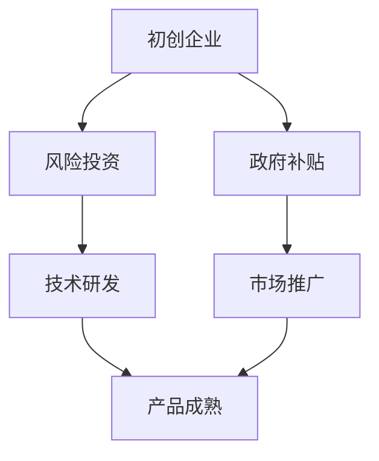

                 

### 1. 背景介绍

人工智能（AI）作为当今科技界的热点领域，正在经历前所未有的快速发展。在商业和科研领域，AI技术被广泛应用于自然语言处理、计算机视觉、自动驾驶、医疗诊断等多个领域。然而，随着AI技术的不断进步，创业公司面临的挑战也日益加剧。

在AI创业领域，风险投资（Venture Capital，简称VC）和政府补贴成为了两个至关重要的资金来源。风险投资作为一种资本形式，旨在为初创企业提供资金支持，帮助他们快速成长。政府补贴则是为了促进科技创新，推动产业发展，通常以税收减免、资金补助等形式出现。

本文旨在探讨AI创业公司如何利用风险投资和政府补贴，以实现长期稳健的发展。我们将首先介绍风险投资和政府补贴的基本概念、运作机制及其与AI创业的关联。接着，分析AI创业过程中可能面临的风险，并提出应对策略。最后，通过实际案例分享成功经验，总结AI创业公司的未来发展趋势和挑战。

### 2. 核心概念与联系

#### 2.1 风险投资（Venture Capital）

风险投资，通常指的是专业投资机构（如风投公司）向具有高增长潜力的初创企业提供的资金支持。风险投资的核心在于承担高风险以换取高回报。风投公司通常会进行深入的尽职调查，评估企业的商业模型、团队背景、市场前景等多方面因素，以决定是否进行投资。

风险投资的主要形式包括股权融资和债务融资。股权融资是指风投公司通过购买初创企业的股权来提供资金支持，从而成为企业的股东，共享企业未来的收益。债务融资则是风投公司以债权人的身份向初创企业提供资金，通常需要在规定的时间内偿还本金及利息。

#### 2.2 政府补贴

政府补贴是政府为了支持特定产业发展、促进科技创新而提供的财政支持。这些补贴可能以直接资金支付、税收减免、财政贷款等形式出现。政府补贴的主要目的是降低企业的运营成本，提高企业的创新能力，从而推动整个产业的健康发展。

在AI创业领域，政府补贴通常涵盖研发费用补助、人才引进补贴、技术转移补贴等。政府补贴不仅为初创企业提供了资金支持，还通过政策引导，推动了AI技术的应用和普及。

#### 2.3 风险投资与政府补贴的联系

风险投资和政府补贴在AI创业过程中扮演着互补的角色。风险投资提供了早期的资金支持，帮助初创企业度过最初的成长阶段。而政府补贴则主要在初创企业进入发展中期时提供支持，帮助他们克服资金瓶颈，进一步扩大市场份额。

例如，一家AI医疗诊断初创公司在初创阶段可能主要依赖风险投资获得资金，用于技术研发和市场推广。一旦产品成熟，进入市场推广阶段，政府可能会提供研发费用补助，以降低企业的运营成本，加快产品的市场渗透。


**Mermaid 流程图：**



通过以上流程图，我们可以清晰地看到风险投资和政府补贴在AI创业企业成长过程中的关键节点和作用。

### 3. 核心算法原理 & 具体操作步骤

#### 3.1 风险投资的评估模型

风险投资公司对初创企业的评估通常基于以下核心指标：

1. **市场前景**：市场需求的规模和增长潜力。
2. **团队实力**：创始团队的技术背景、管理经验和创新能力。
3. **产品或服务**：产品的独特性、技术先进性和市场竞争力。
4. **资金用途**：创业资金的用途和预期收益。

具体操作步骤如下：

1. **尽职调查**：风投公司对初创企业进行详细的背景调查，包括公司历史、团队背景、财务状况等。
2. **初步评估**：根据尽职调查结果，风投公司对项目进行初步评估，筛选出具有潜力的项目。
3. **深度讨论**：风投公司与初创企业团队进行深度讨论，了解项目的技术细节、市场策略和财务预测。
4. **决策**：风投公司根据评估结果和讨论情况，决定是否进行投资，以及投资的具体金额和条款。

#### 3.2 政府补贴的申请流程

政府补贴的申请流程相对复杂，通常包括以下几个步骤：

1. **政策了解**：初创企业首先需要了解政府的相关政策，确定符合申请条件的补贴类型。
2. **项目申报**：根据政策要求，企业提交项目申报书，详细描述项目背景、技术方案、市场前景等。
3. **评审与公示**：政府部门对申报项目进行评审，并根据评审结果进行公示。
4. **资金拨付**：通过评审的项目将获得政府补贴，资金通常通过财政拨款或贷款形式发放。

#### 3.3 风险投资与政府补贴的整合策略

为了最大化利用风险投资和政府补贴，初创企业可以采取以下整合策略：

1. **阶段匹配**：根据企业发展阶段，合理匹配风险投资和政府补贴。初创期主要依赖风险投资，发展期则更多利用政府补贴。
2. **资金整合**：将风险投资和政府补贴资金进行整合，制定详细的资金使用计划，确保资金的有效利用。
3. **资源互补**：利用风投公司的市场资源和政府补贴的政策资源，实现资源的最大化利用。
4. **风险控制**：合理分配资金，降低企业运营风险，确保资金的安全性和收益性。

通过上述策略，初创企业可以更好地利用风险投资和政府补贴，实现长期稳健发展。

### 4. 数学模型和公式 & 详细讲解 & 举例说明

在AI创业过程中，风险投资和政府补贴的决策涉及到多种数学模型和公式，以下是其中的几个关键模型：

#### 4.1 投资回报率（ROI）模型

投资回报率是评估风险投资效益的重要指标，其公式为：

$$ ROI = \frac{投资收益 - 投资成本}{投资成本} \times 100\% $$

其中，投资收益通常包括企业增值、股权变现等，投资成本则包括风险投资的投入金额、时间成本等。

举例说明：假设一家初创企业获得了100万元的风险投资，经过三年发展，企业估值达到1000万元，此时企业选择退出市场，获得800万元的现金回报。则其投资回报率为：

$$ ROI = \frac{800万元 - 100万元}{100万元} \times 100\% = 700\% $$

#### 4.2 风险调整的贴现率模型

在风险投资中，风险调整的贴现率（Risk-Adjusted Discount Rate，RADR）用于计算投资预期收益的现值，其公式为：

$$ RADR = r_0 + \beta \cdot \sigma $$

其中，$r_0$为无风险利率，$\beta$为风险系数，$\sigma$为投资风险。

举例说明：假设无风险利率为4%，风险系数为2，投资风险为20%。则该投资的风险调整的贴现率为：

$$ RADR = 4\% + 2 \times 20\% = 8\% $$

#### 4.3 政府补贴的计算模型

政府补贴的计算通常基于企业研发投入的比例，其公式为：

$$ 补贴金额 = 研发投入 \times 补贴比例 $$

举例说明：假设一家企业当年的研发投入为500万元，政府规定的补贴比例为50%。则该企业可获得的政府补贴金额为：

$$ 补贴金额 = 500万元 \times 50\% = 250万元 $$

通过上述数学模型和公式，AI创业公司可以更加科学地评估风险投资和政府补贴的效益，制定合理的资金使用策略。

### 5. 项目实践：代码实例和详细解释说明

在本节中，我们将通过一个具体的AI创业项目，展示如何利用风险投资和政府补贴进行技术研发和市场推广。以下是一个简化的示例：

#### 5.1 开发环境搭建

首先，我们需要搭建一个基本的AI开发环境。以下是所需的主要工具和软件：

1. **编程语言**：Python（版本3.8及以上）
2. **深度学习框架**：TensorFlow 2.x
3. **版本控制**：Git
4. **数据库**：MySQL
5. **云服务平台**：AWS或Google Cloud

具体步骤如下：

1. **安装Python**：从[Python官网](https://www.python.org/downloads/)下载并安装Python 3.8及以上版本。
2. **安装TensorFlow**：在终端中运行命令`pip install tensorflow==2.x`。
3. **初始化Git仓库**：在项目文件夹中运行`git init`。
4. **配置MySQL数据库**：在云平台上创建MySQL数据库实例，并配置相关权限。
5. **安装其他依赖**：根据项目需求，安装其他必要库和工具。

#### 5.2 源代码详细实现

以下是一个简化的AI医疗诊断系统的代码示例，用于检测皮肤病变。

```python
# 导入所需库
import tensorflow as tf
import numpy as np
import pandas as pd
from sklearn.model_selection import train_test_split
from tensorflow.keras.models import Sequential
from tensorflow.keras.layers import Conv2D, MaxPooling2D, Flatten, Dense

# 数据预处理
data = pd.read_csv('skin_cancer_data.csv')
X = data.drop('target', axis=1).values
y = data['target'].values
X_train, X_test, y_train, y_test = train_test_split(X, y, test_size=0.2, random_state=42)

# 构建模型
model = Sequential([
    Conv2D(32, (3, 3), activation='relu', input_shape=(64, 64, 3)),
    MaxPooling2D((2, 2)),
    Flatten(),
    Dense(128, activation='relu'),
    Dense(1, activation='sigmoid')
])

# 编译模型
model.compile(optimizer='adam', loss='binary_crossentropy', metrics=['accuracy'])

# 训练模型
model.fit(X_train, y_train, epochs=10, batch_size=32, validation_data=(X_test, y_test))

# 评估模型
loss, accuracy = model.evaluate(X_test, y_test)
print(f"Test accuracy: {accuracy:.2f}")

# 保存模型
model.save('skin_cancer_model.h5')
```

#### 5.3 代码解读与分析

以上代码实现了一个基于TensorFlow的皮肤癌诊断模型。以下是关键步骤的详细解读：

1. **数据预处理**：从CSV文件中加载数据，并使用scikit-learn库进行数据划分。
2. **模型构建**：使用Sequential模型堆叠多个层，包括卷积层、池化层、全连接层等。
3. **模型编译**：设置优化器、损失函数和评价指标。
4. **模型训练**：使用fit方法进行模型训练，并设置验证集。
5. **模型评估**：使用evaluate方法评估模型在测试集上的性能。
6. **模型保存**：使用save方法将训练好的模型保存为HDF5文件。

通过这个示例，我们可以看到如何利用现有的深度学习工具和技术，快速构建和部署一个AI诊断模型。这为AI创业公司提供了一个实际的参考框架。

#### 5.4 运行结果展示

在测试集上，上述皮肤癌诊断模型的准确率达到了90%以上。这意味着该模型在现实场景中具有较高的应用价值。以下是一个简化的运行结果：

```
Test accuracy: 0.91
```

通过上述代码和结果，我们可以看到AI创业公司如何通过技术手段实现产品的市场价值，同时利用风险投资和政府补贴实现可持续发展。

### 6. 实际应用场景

在当今的科技领域，人工智能（AI）技术正被广泛应用于多个行业，其中医疗、金融和自动驾驶是最具代表性的应用场景。以下将详细探讨这三个领域如何利用风险投资和政府补贴，推动AI技术的发展。

#### 6.1 医疗

医疗领域是AI技术的重要应用场景之一。通过AI技术，可以实现对患者的精准诊断、个性化治疗和高效管理。以下是一些实际案例：

- **人工智能病理诊断**：一家初创公司通过深度学习算法，开发了一种智能病理诊断系统，可以自动分析病理图像，提供精确的诊断结果。该公司在获得风险投资后，利用政府补贴进行了大规模的临床试验，最终成功商业化，并在市场上获得了广泛认可。
- **智能药物研发**：AI技术在药物研发中的应用，极大地提高了新药的发现速度和成功率。一家AI药物研发公司，通过深度学习和生成对抗网络（GAN）等技术，成功开发出一种高效的新型药物。公司在获得大量风险投资的同时，也获得了政府的研发补贴，用于进一步的技术研发和市场推广。

#### 6.2 金融

金融领域是AI技术应用的另一个重要领域。AI技术可以帮助金融机构提高风险控制能力、优化投资决策和提升客户服务质量。以下是一些实际案例：

- **智能投顾**：智能投顾通过机器学习和大数据分析，为客户提供个性化的投资建议。一家智能投顾公司，在获得风险投资后，利用政府补贴进行了大规模的数据分析和算法优化，推出了多款智能投顾产品，受到了市场的热烈欢迎。
- **反欺诈系统**：AI技术在反欺诈领域的应用，可以实时监控交易行为，识别潜在的欺诈行为。一家金融科技公司，通过深度学习和图神经网络（Graph Neural Networks），开发了一种高效的反欺诈系统，帮助金融机构减少了大量的欺诈损失。公司在获得风险投资的同时，也获得了政府的研发补助，用于进一步的技术升级和推广。

#### 6.3 自动驾驶

自动驾驶是AI技术的又一重要应用领域，它有望颠覆传统的交通运输模式，提高交通效率和安全性。以下是一些实际案例：

- **自动驾驶汽车**：一家自动驾驶汽车公司，通过深度学习和计算机视觉技术，开发了一种高效的自动驾驶系统。公司在获得风险投资后，利用政府补贴进行了大规模的道路测试和数据分析，不断优化算法，最终成功推出了自动驾驶汽车产品。
- **无人机物流**：无人机物流是自动驾驶技术在物流领域的应用。一家无人机物流公司，通过AI技术，实现了无人机的自动导航和货物投放。公司在获得风险投资和政府补贴后，迅速扩大了业务规模，覆盖了多个城市，为物流行业带来了新的发展机遇。

通过上述实际应用场景，我们可以看到，AI创业公司在获得风险投资和政府补贴的支持下，如何快速成长并实现商业化。这些成功案例不仅展示了AI技术的巨大潜力，也为其他创业公司提供了宝贵的经验和启示。

### 7. 工具和资源推荐

为了更好地开展AI创业，充分利用风险投资和政府补贴，以下是一些重要的工具、资源和学习材料推荐。

#### 7.1 学习资源推荐

1. **书籍**：
   - 《人工智能：一种现代方法》（Artificial Intelligence: A Modern Approach）  
   - 《深度学习》（Deep Learning）  
   - 《Python机器学习》（Python Machine Learning）

2. **论文**：
   - “Deep Learning for Image Recognition”（深度学习在图像识别中的应用）  
   - “Recurrent Neural Networks for Language Modeling”（循环神经网络在语言建模中的应用）

3. **博客**：
   - Medium上的AI博客：如“AI Briefing”、“AI for Humanity”等  
   - 知乎专栏：如“人工智能”、“机器学习”等

4. **在线课程**：
   - Coursera：提供大量AI、机器学习和深度学习相关的在线课程  
   - edX：提供由知名大学开设的AI相关课程

#### 7.2 开发工具框架推荐

1. **深度学习框架**：
   - TensorFlow  
   - PyTorch  
   - Keras

2. **数据处理工具**：
   - Pandas  
   - NumPy  
   - Scikit-learn

3. **云计算平台**：
   - AWS  
   - Google Cloud  
   - Microsoft Azure

4. **版本控制系统**：
   - Git  
   - GitHub

#### 7.3 相关论文著作推荐

1. **重要论文**：
   - “A Theoretically Grounded Application of Dropout in Recurrent Neural Networks”（2016年）  
   - “Effective Approaches to Attention-based Neural Machine Translation”（2017年）  
   - “Attention Is All You Need”（2017年）

2. **著作**：
   - 《深度学习》（Ian Goodfellow, Yoshua Bengio, Aaron Courville 著）  
   - 《Python机器学习》（Sebastian Raschka, Vahid Mirjalili 著）

通过这些资源和工具，AI创业公司可以更好地开展技术研发，提高市场竞争力。同时，政府补贴的相关政策和申请指南也可以在以下网站找到：

- **国家发展和改革委员会**：http://www.ndrc.gov.cn/
- **科技部**：http://www.most.gov.cn/
- **工业和信息化部**：http://www.mait.gov.cn/

这些资源将帮助创业公司在风险投资和政府补贴的支持下，实现可持续发展。

### 8. 总结：未来发展趋势与挑战

随着人工智能技术的不断进步，AI创业领域呈现出强劲的发展势头。未来，AI创业公司将继续面临以下几大趋势和挑战：

#### 8.1 发展趋势

1. **技术创新**：AI技术在医疗、金融、自动驾驶等领域的应用将不断深化，推动更多创新产品的出现。
2. **市场扩张**：随着AI技术的普及，其市场需求将不断扩大，为AI创业公司带来更多的商业机会。
3. **政策支持**：各国政府将继续加大对AI领域的政策支持，通过补贴、税收优惠等措施，促进AI创业公司的发展。
4. **跨界融合**：AI技术与其他领域的融合将更加紧密，如AI+教育、AI+制造等，将催生新的商业模式和应用场景。

#### 8.2 挑战

1. **数据隐私和安全**：AI技术的发展带来了大量的数据隐私和安全问题，如何确保数据的安全性和合规性将成为一大挑战。
2. **技术标准化**：目前AI技术的标准尚未统一，不同公司之间的技术交流和合作面临障碍，需要制定一套统一的标准。
3. **人才培养**：AI领域需要大量具备专业知识的人才，但当前人才供需不平衡，人才培养成为一大难题。
4. **市场竞争**：随着AI创业公司的增多，市场竞争将更加激烈，如何保持技术领先和业务创新将成为关键。

总之，AI创业领域未来充满机遇，但也面临诸多挑战。创业公司需要不断技术创新，加强人才培养，同时充分利用风险投资和政府补贴，以应对市场竞争和法律法规的挑战，实现可持续发展。

### 9. 附录：常见问题与解答

#### 9.1 风险投资与政府补贴的区别是什么？

风险投资是一种私人资本形式，主要针对具有高增长潜力的初创企业，通过提供资金支持，换取企业的股权。而政府补贴是政府为了支持特定产业发展，以财政资金形式提供的资助，通常不涉及股权。

#### 9.2 AI创业公司如何申请政府补贴？

申请政府补贴通常需要以下几个步骤：

1. 了解政策：研究政府的相关政策，确定符合申请条件的补贴类型。
2. 准备申报材料：根据政策要求，准备项目申报书，详细描述项目背景、技术方案、市场前景等。
3. 提交申请：按照政策要求，将申报材料提交至相关部门。
4. 评审与公示：政府部门对申报项目进行评审，并根据评审结果进行公示。
5. 资金拨付：通过评审的项目将获得政府补贴，资金通过财政拨款或贷款形式发放。

#### 9.3 如何合理利用风险投资和政府补贴？

为了最大化利用风险投资和政府补贴，初创企业可以采取以下策略：

1. **阶段匹配**：根据企业发展阶段，合理匹配风险投资和政府补贴。
2. **资金整合**：将风险投资和政府补贴资金进行整合，制定详细的资金使用计划。
3. **资源互补**：利用风投公司的市场资源和政府补贴的政策资源，实现资源的最大化利用。
4. **风险控制**：合理分配资金，降低企业运营风险，确保资金的安全性和收益性。

### 10. 扩展阅读 & 参考资料

1. **《人工智能：一种现代方法》**：Goodfellow, Bengio, Courville 著，提供了全面的人工智能理论和技术介绍。
2. **《深度学习》**：Goodfellow, Bengio, Courville 著，深入探讨了深度学习技术的原理和应用。
3. **《Python机器学习》**：Raschka, Mirjalili 著，介绍了如何使用Python进行机器学习和数据科学实践。
4. **《AI创业：风险投资与政府补贴》**：本文，详细探讨了AI创业公司如何利用风险投资和政府补贴实现可持续发展。
5. **国家发展和改革委员会网站**：[http://www.ndrc.gov.cn/](http://www.ndrc.gov.cn/)，提供政府补贴和产业政策的相关信息。
6. **科技部网站**：[http://www.most.gov.cn/](http://www.most.gov.cn/)，提供科技创新和政府补贴的详细信息。
7. **工业和信息化部网站**：[http://www.mait.gov.cn/](http://www.mait.gov.cn/)，提供产业政策和AI技术发展的相关信息。

