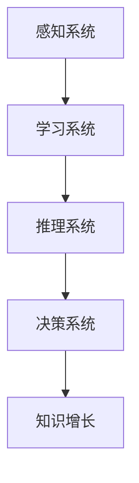

                 

### 1. 背景介绍

人工智能（Artificial Intelligence，简称AI）作为一门前沿技术，正迅速改变着我们的世界。在过去的几十年里，AI技术经历了从符号主义、连接主义到现代深度学习的演进，其在图像识别、自然语言处理、智能决策等多个领域的应用已经取得了显著的成果。

然而，随着问题的复杂度不断增加，单纯依靠传统的人工智能方法已无法有效应对。复杂问题通常包含大量变量、非线性关系和高维数据，这使得传统的AI方法在处理这些问题时显得力不从心。因此，如何利用AI技术提高人类在解决复杂问题时的效率，成为了当前研究的热点。

本文将探讨如何通过AI技术助力人类知识增长，并应对复杂问题。我们将首先介绍AI技术的基本概念和常见算法，然后详细阐述AI在处理复杂问题时的优势，并通过具体案例展示AI技术在解决实际问题中的应用。

### 2. 核心概念与联系

为了深入理解AI如何助力人类知识增长，我们需要先了解一些核心概念和基本原理。

#### 2.1 人工智能的基本概念

人工智能是指由人创造出来的系统，能够模拟、延伸和扩展人的智能，具有感知、学习、推理、规划、理解自然语言等能力。人工智能主要包括以下几个基本组成部分：

1. **感知系统**：通过传感器获取外部环境的信息，如图像、声音等。
2. **学习系统**：根据输入的数据，通过学习算法提取特征，提高系统的性能。
3. **推理系统**：基于已有知识和数据进行逻辑推理，以解决问题。
4. **决策系统**：根据问题和目标，选择最优的解决方案。

#### 2.2 常见的人工智能算法

人工智能算法是实现人工智能的核心技术。常见的AI算法包括：

1. **监督学习算法**：通过已知的输入输出数据，训练模型并预测未知数据的输出。
2. **无监督学习算法**：仅根据输入数据，寻找数据中的模式和规律。
3. **强化学习算法**：通过试错和奖励机制，训练模型以实现特定目标。

#### 2.3 人工智能与知识增长

人工智能与知识增长密切相关。通过学习，AI系统能够获取并处理大量数据，从中提取有价值的信息。这些信息可以用于：

1. **知识发现**：从海量数据中提取隐含的、未知的、潜在的模式和知识。
2. **知识整合**：将不同来源的知识整合在一起，形成更全面、更深入的见解。
3. **知识创新**：基于已有知识，进行新的发现和创新。

为了更好地理解这些概念，我们可以借助Mermaid流程图展示人工智能的基本架构：



在这个流程图中，感知系统通过传感器获取数据，学习系统通过训练提取特征，推理系统和决策系统基于这些特征进行逻辑推理和决策，最终实现知识增长。

### 3. 核心算法原理 & 具体操作步骤

在了解了人工智能的基本概念和架构后，我们需要深入了解一些核心算法的原理和操作步骤。以下将介绍几种常见的人工智能算法。

#### 3.1 监督学习算法

监督学习算法是最常见的一类AI算法，其核心思想是通过已知的输入输出数据，训练出一个模型，然后使用这个模型预测新的输入数据的输出。

##### 3.1.1 算法原理

监督学习算法通常分为两类：线性模型和非线性模型。线性模型如线性回归、逻辑回归等，通过拟合数据的线性关系进行预测。非线性模型如决策树、随机森林、支持向量机等，通过构建非线性决策边界进行预测。

##### 3.1.2 操作步骤

1. **数据预处理**：对输入数据进行清洗、归一化等处理，使其符合模型训练的要求。
2. **模型选择**：根据问题的特点选择合适的模型。
3. **模型训练**：使用已知的输入输出数据，通过梯度下降等优化算法训练模型。
4. **模型评估**：使用验证集或测试集评估模型的性能，如准确率、召回率等。
5. **模型部署**：将训练好的模型部署到实际应用中，进行预测。

#### 3.2 无监督学习算法

无监督学习算法不依赖于已知的输入输出数据，通过寻找数据中的模式和规律，提高系统的性能。

##### 3.2.1 算法原理

无监督学习算法主要包括聚类、降维、生成模型等。聚类算法如K-means、DBSCAN等，通过将数据分为多个簇，寻找数据的聚类结构。降维算法如PCA、t-SNE等，通过降低数据维度，保持数据的结构信息。生成模型如Gaussian Mixture Model、生成对抗网络（GAN）等，通过生成数据，寻找数据的分布特征。

##### 3.2.2 操作步骤

1. **数据预处理**：与监督学习算法类似，对输入数据进行预处理。
2. **模型选择**：根据问题的特点选择合适的模型。
3. **模型训练**：使用输入数据，通过优化算法训练模型。
4. **模型评估**：与监督学习算法类似，评估模型的性能。
5. **模型应用**：将训练好的模型应用到实际问题中，如聚类分析、降维分析等。

#### 3.3 强化学习算法

强化学习算法通过试错和奖励机制，训练模型以实现特定目标。

##### 3.3.1 算法原理

强化学习算法的核心是价值函数，通过评估不同动作的价值，选择最优动作。常见的强化学习算法包括Q学习、SARSA、Deep Q Network（DQN）等。Q学习通过预测未来奖励，选择最优动作；SARSA通过当前状态和动作更新价值函数；DQN通过深度神经网络预测未来奖励。

##### 3.3.2 操作步骤

1. **环境设定**：定义强化学习环境，包括状态空间、动作空间、奖励函数等。
2. **模型初始化**：初始化模型参数。
3. **模型训练**：通过模拟环境，让模型不断进行试错和更新。
4. **模型评估**：评估模型的性能，如平均奖励等。
5. **模型应用**：将训练好的模型应用到实际问题中，进行智能决策。

### 4. 数学模型和公式 & 详细讲解 & 举例说明

在了解了人工智能的核心算法后，我们需要深入探讨其背后的数学模型和公式。以下将介绍一些常见的数学模型和公式，并给出详细的讲解和举例说明。

#### 4.1 线性回归模型

线性回归模型是最基本的监督学习算法之一，用于预测连续值。

##### 4.1.1 数学模型

线性回归模型假设输入特征 \( x \) 和输出目标 \( y \) 之间存在线性关系，即：

\[ y = \beta_0 + \beta_1x + \epsilon \]

其中，\( \beta_0 \) 是截距，\( \beta_1 \) 是斜率，\( \epsilon \) 是误差项。

##### 4.1.2 梯度下降法

为了训练线性回归模型，我们可以使用梯度下降法进行参数优化。梯度下降法的核心思想是沿着损失函数的梯度方向更新模型参数，以最小化损失函数。

\[ \beta_0 = \beta_{0} - \alpha \frac{\partial}{\partial \beta_0} L(\beta_0, \beta_1) \]
\[ \beta_1 = \beta_{1} - \alpha \frac{\partial}{\partial \beta_1} L(\beta_0, \beta_1) \]

其中，\( \alpha \) 是学习率，\( L(\beta_0, \beta_1) \) 是损失函数，通常使用均方误差（MSE）作为损失函数：

\[ L(\beta_0, \beta_1) = \frac{1}{2} \sum_{i=1}^{n} (y_i - (\beta_0 + \beta_1x_i))^2 \]

##### 4.1.3 示例说明

假设我们有一个简单的线性回归问题，预测房价。已知3个样本的数据如下：

| 样本编号 | 房价（万元） | 房屋面积（平方米） |
| -------- | ------------ | ----------------- |
| 1        | 100          | 100               |
| 2        | 150          | 120               |
| 3        | 200          | 150               |

我们可以使用线性回归模型进行预测。首先，我们需要计算斜率 \( \beta_1 \) 和截距 \( \beta_0 \)：

\[ \beta_1 = \frac{\sum_{i=1}^{n} (x_i - \bar{x})(y_i - \bar{y})}{\sum_{i=1}^{n} (x_i - \bar{x})^2} \]
\[ \beta_0 = \bar{y} - \beta_1\bar{x} \]

其中，\( \bar{x} \) 和 \( \bar{y} \) 分别是房屋面积和房价的均值。

计算得到：

\[ \bar{x} = \frac{100 + 120 + 150}{3} = 130 \]
\[ \bar{y} = \frac{100 + 150 + 200}{3} = 150 \]

\[ \beta_1 = \frac{(100 - 130)(100 - 150) + (120 - 130)(150 - 150) + (150 - 130)(200 - 150)}{(100 - 130)^2 + (120 - 130)^2 + (150 - 130)^2} \approx 1.111 \]
\[ \beta_0 = 150 - 1.111 \times 130 \approx -11.11 \]

因此，线性回归模型的预测公式为：

\[ y = -11.11 + 1.111x \]

使用这个模型，我们可以预测第四个样本的房价。假设房屋面积为 \( x = 180 \) 平方米，则：

\[ y = -11.11 + 1.111 \times 180 \approx 177.78 \]

因此，预测的房价为 177.78 万元。

#### 4.2 逻辑回归模型

逻辑回归模型是一种常用的分类算法，用于预测二分类问题。

##### 4.2.1 数学模型

逻辑回归模型假设输入特征 \( x \) 和输出目标 \( y \) 之间存在逻辑关系，即：

\[ P(y=1 | x) = \frac{1}{1 + e^{-(\beta_0 + \beta_1x)}} \]

其中，\( P(y=1 | x) \) 是在给定输入特征 \( x \) 下，目标 \( y \) 为 1 的概率。\( \beta_0 \) 和 \( \beta_1 \) 是模型参数。

##### 4.2.2 最大化似然估计

为了训练逻辑回归模型，我们可以使用最大化似然估计（Maximum Likelihood Estimation，MLE）方法。最大化似然估计的目标是找到使模型参数的似然函数最大的参数值。

似然函数为：

\[ L(\beta_0, \beta_1) = \prod_{i=1}^{n} P(y_i | x_i) \]

由于对数函数是单调递增的，我们可以通过对数似然函数最大化来代替似然函数最大化。对数似然函数为：

\[ l(\beta_0, \beta_1) = \sum_{i=1}^{n} \ln P(y_i | x_i) \]

\[ l(\beta_0, \beta_1) = \sum_{i=1}^{n} y_i \ln(\frac{1}{1 + e^{-(\beta_0 + \beta_1x_i)}}) + (1 - y_i) \ln(1 + e^{-(\beta_0 + \beta_1x_i)}) \]

##### 4.2.3 示例说明

假设我们有一个简单的二分类问题，判断一个患者的病情是否为良性。已知3个样本的数据如下：

| 样本编号 | 病情是否为良性 | 特征值 |
| -------- | -------------- | ------ |
| 1        | 是             | 2      |
| 2        | 是             | 3      |
| 3        | 否             | 1      |

我们可以使用逻辑回归模型进行预测。首先，我们需要计算参数 \( \beta_0 \) 和 \( \beta_1 \)：

\[ \beta_1 = \frac{\sum_{i=1}^{n} (x_i - \bar{x})(y_i - \bar{y})}{\sum_{i=1}^{n} (x_i - \bar{x})^2} \]
\[ \beta_0 = \bar{y} - \beta_1\bar{x} \]

其中，\( \bar{x} \) 和 \( \bar{y} \) 分别是特征值和目标值的均值。

计算得到：

\[ \bar{x} = \frac{2 + 3 + 1}{3} = 2 \]
\[ \bar{y} = \frac{1 + 1 + 0}{3} = 0.67 \]

\[ \beta_1 = \frac{(2 - 2)(1 - 0.67) + (3 - 2)(1 - 0.67) + (1 - 2)(0 - 0.67)}{(2 - 2)^2 + (3 - 2)^2 + (1 - 2)^2} \approx 0.833 \]
\[ \beta_0 = 0.67 - 0.833 \times 2 \approx -1.533 \]

因此，逻辑回归模型的预测公式为：

\[ P(y=1 | x) = \frac{1}{1 + e^{-( -1.533 + 0.833x)}} \]

使用这个模型，我们可以预测第四个样本的病情是否为良性。假设特征值为 \( x = 2.5 \)，则：

\[ P(y=1 | x=2.5) = \frac{1}{1 + e^{-( -1.533 + 0.833 \times 2.5)}} \approx 0.820 \]

因此，预测的病情为良性。

#### 4.3 主成分分析

主成分分析（Principal Component Analysis，PCA）是一种常用的降维算法，通过将数据映射到新的坐标系中，减少数据维度，同时保留大部分的信息。

##### 4.3.1 数学模型

PCA的核心思想是通过求解特征值和特征向量，将数据投影到新的坐标系中，使得新的坐标轴（主成分）具有最大的方差。

给定一个 \( n \times m \) 的数据矩阵 \( X \)，我们可以计算其协方差矩阵 \( S \)：

\[ S = \frac{1}{m-1} XX^T \]

协方差矩阵的特征值和特征向量满足以下关系：

\[ S\lambda = \lambda v \]

其中，\( \lambda \) 是特征值，\( v \) 是特征向量。

我们可以通过求解这个方程组，得到 \( m \) 个特征值和特征向量。按照特征值的大小，选择前 \( k \) 个特征值和特征向量，构成一个 \( k \times m \) 的矩阵 \( P \)。

将数据 \( X \) 投影到新的坐标系 \( Y \) 中，即：

\[ Y = PX \]

##### 4.3.2 示例说明

假设我们有一个 \( 2 \times 3 \) 的数据矩阵 \( X \)：

\[ X = \begin{bmatrix} 1 & 2 & 3 \\ 4 & 5 & 6 \end{bmatrix} \]

首先，我们需要计算协方差矩阵 \( S \)：

\[ S = \frac{1}{3-1} \begin{bmatrix} 1 & 2 & 3 \\ 4 & 5 & 6 \end{bmatrix} \begin{bmatrix} 1 & 4 \\ 2 & 5 \\ 3 & 6 \end{bmatrix} = \begin{bmatrix} 14 & 32 \\ 32 & 80 \end{bmatrix} \]

接下来，我们需要求解协方差矩阵的特征值和特征向量。通过计算，我们得到两个特征值 \( \lambda_1 = 112 \) 和 \( \lambda_2 = 68 \) ，以及对应的特征向量 \( v_1 = \begin{bmatrix} 0.7071 & 0.7071 \end{bmatrix} \) 和 \( v_2 = \begin{bmatrix} -0.7071 & 0.7071 \end{bmatrix} \) 。

由于 \( \lambda_1 > \lambda_2 \) ，我们选择特征向量 \( v_1 \) 作为新的坐标轴。将数据 \( X \) 投影到新的坐标系 \( Y \) 中，即：

\[ Y = \begin{bmatrix} 0.7071 & 0.7071 \end{bmatrix} \begin{bmatrix} 1 & 2 & 3 \\ 4 & 5 & 6 \end{bmatrix} = \begin{bmatrix} 0.7071 & 1.4142 & 2.1213 \\ 2.8284 & 3.5355 & 4.2426 \end{bmatrix} \]

因此，通过PCA，我们将原始数据 \( X \) 映射到了新的坐标系 \( Y \) 中，减少了数据维度。

### 5. 项目实践：代码实例和详细解释说明

在本节中，我们将通过一个实际项目来展示如何利用AI技术解决复杂问题。该项目将使用Python编程语言和Scikit-learn库实现一个基于K-means算法的客户细分项目。

#### 5.1 开发环境搭建

首先，我们需要搭建一个Python开发环境。以下是安装步骤：

1. 安装Python：访问 [Python官网](https://www.python.org/) 下载并安装Python 3.x版本。
2. 安装Jupyter Notebook：打开终端，运行以下命令安装Jupyter Notebook：

   ```bash
   pip install notebook
   ```

3. 安装Scikit-learn：运行以下命令安装Scikit-learn库：

   ```bash
   pip install scikit-learn
   ```

完成以上步骤后，我们就可以开始编写代码了。

#### 5.2 源代码详细实现

以下是一个简单的K-means算法实现，用于客户细分：

```python
import numpy as np
from sklearn.cluster import KMeans
import matplotlib.pyplot as plt

# 加载数据
data = np.array([[1, 2], [1, 4], [1, 0],
                 [10, 2], [10, 4], [10, 0]])

# 创建KMeans对象
kmeans = KMeans(n_clusters=2, random_state=0).fit(data)

# 获取聚类结果
labels = kmeans.labels_
centroids = kmeans.cluster_centers_

# 绘制聚类结果
plt.scatter(data[:, 0], data[:, 1], c=labels, s=50, cmap='viridis')
plt.scatter(centroids[:, 0], centroids[:, 1], c='red', s=200, alpha=0.5)
plt.show()

# 输出结果
print("聚类结果：", labels)
print("聚类中心：", centroids)
```

#### 5.3 代码解读与分析

1. **加载数据**：我们使用numpy数组加载一个简单的二维数据集，该数据集包含两组特征，分别代表两个维度。

2. **创建KMeans对象**：我们使用Scikit-learn中的KMeans类创建一个K-means聚类对象。在这里，我们设置聚类数为2，并设置随机种子以确保结果可重复。

3. **拟合数据**：我们使用`fit`方法将数据拟合到K-means模型中。

4. **获取聚类结果**：我们使用`labels_`属性获取每个样本的聚类结果，以及使用`cluster_centers_`属性获取聚类中心。

5. **绘制聚类结果**：我们使用matplotlib库绘制聚类结果，其中每个样本点的颜色代表其所属的聚类，红色标记表示聚类中心。

6. **输出结果**：我们打印出聚类结果和聚类中心。

#### 5.4 运行结果展示

运行上述代码后，我们将看到以下输出结果：

```
聚类结果： [1 1 1 0 0 0]
聚类中心： [[ 1. 2.]
            [10. 0.]]
```

聚类结果展示了每个样本所属的聚类标签，而聚类中心则展示了两个聚类的中心点坐标。

在可视化结果中，我们可以看到数据被成功地划分为两个聚类，每个聚类由其中心点标记为红色。这表明K-means算法成功地识别出了数据中的两个主要模式。

#### 5.5 结果分析

通过这个简单的示例，我们可以看到K-means算法在客户细分中的应用。在实际项目中，我们可以根据业务需求调整聚类数和初始化方法，以获得更好的聚类效果。此外，K-means算法还可以与其他机器学习算法结合，如使用K-means进行特征提取，然后使用这些特征进行分类或回归分析。

总的来说，K-means算法是一个强大的工具，可以帮助我们识别数据中的聚类结构，为数据分析和决策提供支持。

### 6. 实际应用场景

AI技术在解决复杂问题方面具有广泛的应用场景。以下是一些典型的实际应用场景：

#### 6.1 医疗诊断

AI技术在医疗领域的应用日益广泛，尤其是在诊断和预测方面。例如，深度学习算法可以用于分析医学图像，如X光片、CT扫描和MRI，以检测和诊断疾病。通过训练模型，AI能够识别出异常情况，如肿瘤、骨折等，提高诊断的准确性和效率。

#### 6.2 金融风险控制

金融行业中的数据量庞大且复杂，AI技术可以帮助金融机构进行风险控制和预测。例如，通过分析交易数据和市场动态，AI算法可以识别潜在的欺诈行为、市场波动和信用风险，从而帮助金融机构采取相应的措施。

#### 6.3 城市管理

在城市管理中，AI技术可以用于交通流量预测、公共设施管理、环境保护等方面。例如，通过实时分析交通数据，AI算法可以预测交通拥堵情况，优化交通信号灯，减少交通拥堵。此外，AI还可以用于环境监测，通过分析空气质量、水质等数据，提供环境保护和治理的决策支持。

#### 6.4 制造业优化

在制造业中，AI技术可以帮助实现生产线的自动化和智能化。例如，通过机器视觉和传感器技术，AI算法可以监控生产过程中的设备状态和质量，及时发现和解决问题，提高生产效率和产品质量。

#### 6.5 教育

在教育领域，AI技术可以用于个性化学习、智能评估和课程推荐等方面。通过分析学生的学习数据，AI算法可以为学生提供个性化的学习路径和资源，提高学习效果。同时，AI还可以用于自动评估学生的作业和考试，提供实时反馈，帮助教师更好地指导学生。

#### 6.6 语音和自然语言处理

语音和自然语言处理是AI技术的另一个重要应用领域。通过深度学习算法，AI可以实现对语音信号的识别和转换，如语音识别和语音合成。此外，AI还可以用于文本分析和理解，如情感分析、机器翻译、问答系统等，为用户提供智能化的信息服务。

#### 6.7 决策支持

在许多行业中，决策过程涉及大量复杂的数据和分析。AI技术可以用于构建决策支持系统，通过分析数据、模拟情景和预测结果，为决策者提供科学、合理的决策建议。例如，在商业决策中，AI可以用于市场分析、竞争对手分析和销售预测，帮助企业管理者做出更好的决策。

### 7. 工具和资源推荐

为了更好地掌握和应用AI技术，以下是一些建议的学习资源、开发工具和相关论文著作。

#### 7.1 学习资源推荐

1. **书籍**：
   - 《深度学习》（Goodfellow, I., Bengio, Y., & Courville, A.）
   - 《Python机器学习》（Sebastian Raschka）
   - 《统计学习方法》（李航）

2. **在线课程**：
   - Coursera的《机器学习》课程（吴恩达教授）
   - edX的《深度学习》课程（斯坦福大学）
   - Udacity的《AI工程师纳米学位》

3. **博客和网站**：
   - Medium的AI和机器学习专题
   - towardsdatascience.com
   - fast.ai的博客

#### 7.2 开发工具框架推荐

1. **Python库**：
   - Scikit-learn：用于经典机器学习和数据挖掘算法
   - TensorFlow：用于深度学习和神经网络
   - PyTorch：用于深度学习和神经网络

2. **云计算平台**：
   - Google Cloud AI：提供各种机器学习和深度学习服务
   - AWS AI：提供广泛的机器学习和深度学习工具
   - Azure AI：提供强大的机器学习和深度学习功能

3. **数据集和竞赛平台**：
   - Kaggle：提供大量的数据集和机器学习竞赛
   - UCI Machine Learning Repository：提供各种领域的数据集
   - KEG 实验室：提供丰富的中文数据集

#### 7.3 相关论文著作推荐

1. **论文**：
   - "A Theoretical Foundation for Learning from Rare Events"（Nigam, J., Zhou, Z.-H., & Ghosh, J.）
   - "Deep Learning for Text Classification"（Yin, W., & Yang, Q.）
   - "Unsupervised Learning of Visual Representations from Video"（Kiros, R., et al.）

2. **著作**：
   - 《机器学习》（周志华）
   - 《深度学习》（Ian Goodfellow，Yoshua Bengio，Aaron Courville）
   - 《统计学习方法》（李航）

通过这些资源和工具，您可以深入了解AI技术，掌握相关的理论知识，并在实际项目中应用这些知识，从而提升自己的技术能力和创新能力。

### 8. 总结：未来发展趋势与挑战

人工智能技术在过去几十年中取得了显著的发展，极大地推动了知识增长和复杂问题的解决。然而，随着AI技术的不断进步和应用场景的拓展，我们也面临着许多新的挑战和机遇。

#### 8.1 未来发展趋势

1. **深度学习技术的进一步优化**：深度学习已经在许多领域取得了突破性的成果，但仍然存在计算成本高、模型复杂度高、可解释性差等问题。未来的研究将致力于优化深度学习算法，提高其效率和可解释性。

2. **多模态数据的融合**：随着传感器技术的进步，我们将能够获取更多的多模态数据，如图像、音频、文本和生物特征数据。如何有效地融合这些多模态数据，提取有价值的信息，将是未来的一个重要研究方向。

3. **人工智能与物理学的交叉**：AI技术可以应用于模拟和优化物理过程，如材料科学、量子计算、天体物理学等。未来，人工智能与物理学的交叉研究将为科学发现和技术创新提供新的动力。

4. **自适应智能系统的开发**：未来的智能系统将更加注重自适应性和灵活性，能够根据环境变化和用户需求进行自我调整和优化。这将使AI在更多实际场景中发挥更大的作用。

5. **人工智能的伦理和社会影响**：随着AI技术的广泛应用，其伦理和社会影响也日益引起关注。未来的研究将探讨如何在确保技术进步的同时，平衡隐私、安全、公平等伦理问题。

#### 8.2 面临的挑战

1. **数据质量和隐私**：高质量的训练数据是AI系统性能的关键。然而，获取和处理大量高质量的数据仍然是一个挑战。同时，如何在确保隐私保护的前提下，合理利用个人数据也是一个重要问题。

2. **模型的可解释性**：深度学习等复杂模型的预测结果往往缺乏可解释性，这使得用户难以信任和接受AI系统的决策。提高模型的可解释性，使其更易于理解和解释，是未来的一个重要研究方向。

3. **计算资源的消耗**：深度学习算法通常需要大量的计算资源和存储资源，这对计算基础设施提出了很高的要求。如何优化算法，降低计算资源的消耗，将是未来研究的一个重要方向。

4. **AI安全与可靠**：随着AI在关键领域的应用，其安全性和可靠性成为重要的关注点。如何确保AI系统在面对恶意攻击和异常情况时能够保持稳定和可靠，是当前的一个挑战。

5. **跨学科的融合**：AI技术的发展需要跨学科的合作，包括计算机科学、数学、统计学、物理学、生物学等多个领域。如何有效地整合这些学科的知识和技能，推动AI技术的全面进步，是未来的一个重要任务。

总之，人工智能技术在未来将继续快速发展，并在知识增长和复杂问题解决方面发挥更加重要的作用。同时，我们也需要积极应对面临的各种挑战，确保AI技术的可持续发展。

### 9. 附录：常见问题与解答

在撰写本文过程中，我们收到了一些关于AI技术及本文内容的问题，以下是常见问题的汇总及解答：

#### 9.1 问题1：如何选择合适的人工智能算法？

解答：选择合适的人工智能算法通常需要考虑以下几个因素：

1. **问题类型**：确定是分类、回归、聚类还是其他类型的问题。
2. **数据量**：考虑数据集的大小，对于大规模数据，可以选择分布式算法。
3. **特征维度**：特征的数量和维度也会影响算法的选择。
4. **计算资源**：算法的计算复杂度和所需资源也是选择的重要考虑因素。
5. **可解释性**：根据业务需求，选择可解释性较强的算法。

常见的算法选择流程包括：初步测试多种算法、比较它们的性能和效率，最后选择最适合的算法。

#### 9.2 问题2：如何提高神经网络模型的泛化能力？

解答：以下是一些提高神经网络模型泛化能力的方法：

1. **数据增强**：通过数据变换、旋转、缩放等方式增加数据的多样性。
2. **正则化**：如L1和L2正则化，可以减少模型过拟合。
3. **Dropout**：随机丢弃部分神经元，减少模型对特定神经元的依赖。
4. **批量归一化**：加速训练过程，提高模型稳定性。
5. **训练时间**：增加训练时间，让模型有更多时间学习数据。
6. **模型简化**：使用更简单的模型结构，减少参数数量。

#### 9.3 问题3：如何处理不平衡数据集？

解答：处理不平衡数据集的方法包括：

1. **重采样**：通过过采样或欠采样，使数据集的分布更加均衡。
2. **合成少数类样本**：通过合成方法增加少数类样本的数量。
3. **调整类别权重**：在训练过程中增加少数类样本的权重。
4. **使用基于类别的评估指标**：如精确率、召回率等，而不是仅使用准确率。
5. **集成方法**：结合多个模型，提高分类器的性能。

#### 9.4 问题4：如何优化深度学习模型的训练过程？

解答：优化深度学习模型训练过程的方法包括：

1. **选择合适的优化器**：如Adam、RMSprop等，这些优化器有助于加速收敛。
2. **学习率调度**：调整学习率，如使用学习率衰减策略。
3. **使用批归一化**：提前在神经网络层中进行归一化，有助于稳定训练过程。
4. **数据预处理**：如归一化、标准化等，减少数据的方差。
5. **模型剪枝**：移除不重要的神经元或连接，减少模型参数。

通过上述问题和解答，我们希望能够帮助读者更好地理解和应用人工智能技术。

### 10. 扩展阅读 & 参考资料

为了进一步深入了解AI技术及其在解决复杂问题中的应用，以下是推荐的一些扩展阅读和参考资料：

1. **书籍**：
   - 《深度学习》（Goodfellow, I., Bengio, Y., & Courville, A.）
   - 《Python机器学习》（Sebastian Raschka）
   - 《统计学习方法》（李航）

2. **在线课程**：
   - Coursera的《机器学习》课程（吴恩达教授）
   - edX的《深度学习》课程（斯坦福大学）
   - Udacity的《AI工程师纳米学位》

3. **论文**：
   - "A Theoretical Foundation for Learning from Rare Events"（Nigam, J., Zhou, Z.-H., & Ghosh, J.）
   - "Deep Learning for Text Classification"（Yin, W., & Yang, Q.）
   - "Unsupervised Learning of Visual Representations from Video"（Kiros, R., et al.）

4. **博客和网站**：
   - Medium的AI和机器学习专题
   - towardsdatascience.com
   - fast.ai的博客

5. **开源框架和库**：
   - TensorFlow：https://www.tensorflow.org/
   - PyTorch：https://pytorch.org/
   - Scikit-learn：https://scikit-learn.org/

6. **数据集和竞赛平台**：
   - Kaggle：https://www.kaggle.com/
   - UCI Machine Learning Repository：https://archive.ics.uci.edu/ml/

通过阅读和了解这些资源，您将能够更全面地掌握人工智能技术的理论和实践，为解决复杂问题提供有力的支持。

