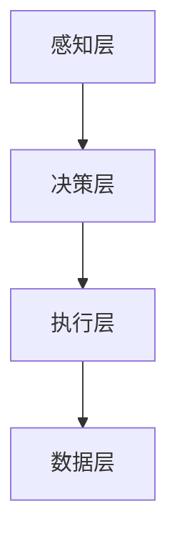

                 

### 文章标题

**AI助理时代的企业转型**

> 关键词：AI助理、企业转型、数字化、自动化、智能化、人工智能技术、商业模式创新、数字化转型、运营效率

> 摘要：随着人工智能技术的快速发展，AI助理正逐渐成为企业转型的新动力。本文将从AI助理的核心概念出发，探讨其在企业中的应用，分析其对商业模式和运营效率的影响，并展望未来的发展趋势和挑战。

## 1. 背景介绍

在过去的几十年里，信息技术的发展已经深刻改变了企业的运营模式。从最初的计算机化、自动化，到近几年的数字化、智能化，企业不断寻求新的方式来提高效率、降低成本、增强竞争力。然而，随着数据的爆炸性增长和复杂性的增加，单纯依靠人力已经难以应对日益复杂的商业环境。人工智能（AI）技术的出现，为企业的转型升级提供了新的可能。

AI助理，作为人工智能在商业领域的具体应用，是人工智能技术发展的重要成果之一。AI助理通过模仿人类思维和行为，能够帮助企业自动完成许多重复性、繁琐的工作，从而提高工作效率，减少人力成本。同时，AI助理还可以通过数据分析和预测，为企业提供有价值的商业洞察，帮助企业做出更明智的决策。

近年来，随着AI技术的不断成熟和应用的广泛普及，AI助理正在逐步成为企业转型的新动力。越来越多的企业开始意识到，借助AI助理，可以实现运营模式的创新，提高业务效率和竞争力。因此，本文将重点探讨AI助理在帮助企业实现数字化转型、提升运营效率方面的作用，以及企业在引入AI助理时应注意的关键问题和挑战。

## 2. 核心概念与联系

### 2.1 AI助理的定义与功能

AI助理，又称为智能助理，是指通过人工智能技术，模拟人类思维和行为，帮助企业完成特定任务的智能系统。AI助理的核心功能主要包括：

1. **数据处理与分析**：AI助理能够快速处理大量数据，并从中提取有价值的信息。
2. **自动化操作**：AI助理能够自动完成一些重复性、繁琐的任务，如邮件管理、日程安排、文档整理等。
3. **智能决策支持**：AI助理可以通过对数据的分析和预测，为企业提供有价值的商业决策建议。
4. **自然语言处理**：AI助理能够理解和处理自然语言，与人类进行自然交流，从而提供更加人性化、高效的服务。

### 2.2 AI助理在企业中的应用场景

AI助理在企业中的应用场景非常广泛，以下是一些典型的应用场景：

1. **客户服务**：AI助理可以通过在线聊天、电话客服等方式，提供24/7的智能客服服务，帮助企业提高客户满意度和运营效率。
2. **销售与营销**：AI助理可以分析客户数据，预测客户需求，提供个性化的销售和营销策略，从而提高销售转化率和客户忠诚度。
3. **运营管理**：AI助理可以监控企业运营数据，识别潜在的问题和风险，提供实时的运营优化建议。
4. **人力资源管理**：AI助理可以处理员工招聘、培训、绩效评估等事务，提高人力资源管理效率。

### 2.3 AI助理与企业数字化转型

数字化转型是企业利用数字技术优化业务流程、提高效率的重要手段。AI助理在数字化转型中发挥着关键作用：

1. **数据驱动决策**：AI助理能够帮助企业快速获取和处理大量数据，从而实现基于数据的决策。
2. **提高运营效率**：AI助理可以自动化许多重复性、繁琐的工作，提高运营效率。
3. **优化客户体验**：AI助理可以提供个性化的服务，提高客户满意度和忠诚度。
4. **创新商业模式**：AI助理可以帮助企业发现新的商机，创新商业模式，实现业务增长。

### 2.4 AI助理与传统业务模式的关系

AI助理与传统业务模式的关系主要体现在以下几个方面：

1. **互补关系**：AI助理可以弥补传统业务模式中的不足，如提高效率、降低成本等。
2. **协同关系**：AI助理可以与传统业务模式协同工作，如与员工共同完成工作任务，提高整体效率。
3. **替代关系**：在某些场景下，AI助理可以完全替代传统业务模式，如自动化的客服系统。

### 2.5 AI助理的架构

AI助理的架构通常包括以下几个核心组成部分：

1. **感知层**：包括语音识别、图像识别等感知技术，用于获取外部信息。
2. **决策层**：包括自然语言处理、机器学习等算法，用于处理感知层获取的信息，并做出决策。
3. **执行层**：包括各种执行组件，如机器人、自动化工具等，用于执行决策层的决策。
4. **数据层**：包括数据库、数据仓库等，用于存储和处理AI助理所需的数据。

### 2.6 Mermaid 流程图

以下是一个简化的AI助理架构的Mermaid流程图：



### 2.7 相关概念的联系与区别

1. **人工智能（AI）与AI助理**：人工智能是指使计算机系统能够模拟人类智能的技术，而AI助理是人工智能在特定场景下的应用，旨在提供智能化的服务。
2. **自动化与智能化**：自动化是指通过计算机技术实现任务的自动执行，而智能化则是在自动化基础上，加入人工智能技术，使系统能够进行智能决策。
3. **数字化与数字化转型**：数字化是指将物理世界的数据转化为数字形式，而数字化转型是指利用数字技术优化企业的业务流程和运营模式。

## 3. 核心算法原理 & 具体操作步骤

### 3.1 自然语言处理（NLP）

自然语言处理是AI助理的核心技术之一，它使计算机能够理解、处理和分析自然语言。以下是一些常用的NLP算法：

1. **词性标注（Part-of-Speech Tagging）**：
   - **原理**：词性标注是一种对文本中的词语进行分类标注的技术，常见的词性包括名词、动词、形容词等。
   - **具体操作步骤**：
     - 输入文本。
     - 使用词性标注模型对文本进行标注。
     - 输出标注结果。

2. **实体识别（Named Entity Recognition）**：
   - **原理**：实体识别是一种从文本中识别出具有特定意义的实体（如人名、地名、组织名等）的技术。
   - **具体操作步骤**：
     - 输入文本。
     - 使用实体识别模型对文本进行识别。
     - 输出识别结果。

3. **情感分析（Sentiment Analysis）**：
   - **原理**：情感分析是一种对文本的情感倾向进行分类的技术，常见的分类有正面、负面、中性等。
   - **具体操作步骤**：
     - 输入文本。
     - 使用情感分析模型对文本进行分类。
     - 输出分类结果。

### 3.2 机器学习（Machine Learning）

机器学习是AI助理的重要组成部分，它使计算机能够从数据中自动学习，并做出预测和决策。以下是一些常用的机器学习算法：

1. **线性回归（Linear Regression）**：
   - **原理**：线性回归是一种用于预测连续值的算法，它通过拟合一条直线来预测输出值。
   - **具体操作步骤**：
     - 输入特征和标签数据。
     - 使用线性回归模型进行训练。
     - 输出模型参数。
     - 使用模型进行预测。

2. **逻辑回归（Logistic Regression）**：
   - **原理**：逻辑回归是一种用于分类的算法，它通过拟合一个逻辑函数来预测输出值。
   - **具体操作步骤**：
     - 输入特征和标签数据。
     - 使用逻辑回归模型进行训练。
     - 输出模型参数。
     - 使用模型进行预测。

3. **决策树（Decision Tree）**：
   - **原理**：决策树是一种基于树结构的分类算法，它通过一系列判断条件来对数据进行分类。
   - **具体操作步骤**：
     - 输入特征和标签数据。
     - 使用决策树模型进行训练。
     - 输出模型参数。
     - 使用模型进行预测。

### 3.3 深度学习（Deep Learning）

深度学习是机器学习的一个重要分支，它通过构建多层神经网络来对数据进行自动学习。以下是一些常用的深度学习算法：

1. **卷积神经网络（CNN）**：
   - **原理**：卷积神经网络是一种用于图像识别的算法，它通过卷积操作提取图像的特征。
   - **具体操作步骤**：
     - 输入图像数据。
     - 使用卷积神经网络模型进行训练。
     - 输出模型参数。
     - 使用模型进行预测。

2. **循环神经网络（RNN）**：
   - **原理**：循环神经网络是一种用于序列数据的算法，它通过将前一个时间步的输出作为当前时间步的输入。
   - **具体操作步骤**：
     - 输入序列数据。
     - 使用循环神经网络模型进行训练。
     - 输出模型参数。
     - 使用模型进行预测。

3. **长短期记忆网络（LSTM）**：
   - **原理**：长短期记忆网络是一种改进的循环神经网络，它通过引入门控机制来防止梯度消失问题。
   - **具体操作步骤**：
     - 输入序列数据。
     - 使用长短期记忆网络模型进行训练。
     - 输出模型参数。
     - 使用模型进行预测。

### 3.4 算法在实际应用中的优化

在实际应用中，AI助理的性能和效率取决于所选算法的质量和参数设置。以下是一些常用的优化方法：

1. **数据预处理**：通过对数据进行清洗、归一化等处理，可以提高算法的性能。
2. **特征选择**：通过选择对预测任务有帮助的特征，可以减少模型的复杂度，提高预测准确率。
3. **超参数调优**：通过调整模型的超参数（如学习率、迭代次数等），可以优化模型的性能。
4. **模型集成**：通过结合多个模型的结果，可以进一步提高预测准确率。

## 4. 数学模型和公式 & 详细讲解 & 举例说明

### 4.1 自然语言处理中的数学模型

在自然语言处理（NLP）中，常用的数学模型包括词袋模型（Bag of Words, BOW）和循环神经网络（Recurrent Neural Network, RNN）。

#### 4.1.1 词袋模型（BOW）

词袋模型是一种基于统计的文本表示方法，它将文本表示为一个向量，其中每个元素表示一个词汇的出现次数。

- **公式**：
  $$V = \{w_1, w_2, ..., w_n\}$$
  $$C = \{c_1, c_2, ..., c_n\}$$
  $$v = \sum_{i=1}^{n} c_i \cdot w_i$$
  其中，$V$表示词汇集合，$C$表示词汇的出现次数，$v$表示文本向量。

- **举例说明**：
  假设有一个文本：“我喜欢吃苹果。”
  - 词汇集合：$V = \{\text{我}, \text{喜欢}, \text{吃}, \text{苹果}\}$
  - 出现次数：$C = \{1, 1, 1, 2\}$
  - 文本向量：$v = \{1, 1, 1, 2\}$

#### 4.1.2 循环神经网络（RNN）

循环神经网络是一种用于处理序列数据的神经网络，它可以记住前一个时间步的输出，作为当前时间步的输入。

- **公式**：
  $$h_t = \sigma(W_h h_{t-1} + U_x x_t + b_h)$$
  $$y_t = \text{softmax}(W_y h_t + b_y)$$
  其中，$h_t$表示当前时间步的隐藏状态，$x_t$表示当前时间步的输入，$y_t$表示当前时间步的输出，$\sigma$表示激活函数，$W_h, U_x, W_y, b_h, b_y$为模型参数。

- **举例说明**：
  假设有一个序列数据：“我喜欢吃苹果。”
  - 隐藏状态：$h_t = \sigma(W_h h_{t-1} + U_x x_t + b_h)$
  - 输出：$y_t = \text{softmax}(W_y h_t + b_y)$

### 4.2 机器学习中的数学模型

在机器学习中，常用的数学模型包括线性回归（Linear Regression）和逻辑回归（Logistic Regression）。

#### 4.2.1 线性回归（Linear Regression）

线性回归是一种用于预测连续值的模型，它的目标是找到一条直线，使预测值与实际值之间的误差最小。

- **公式**：
  $$y = \beta_0 + \beta_1 x + \epsilon$$
  其中，$y$表示实际值，$x$表示输入值，$\beta_0, \beta_1$为模型参数，$\epsilon$为误差。

- **举例说明**：
  假设我们有一个简单的线性回归模型，目标是预测一个人的身高。
  - 实际值：$y = 170$
  - 输入值：$x = 1.75$
  - 模型参数：$\beta_0 = 150, \beta_1 = 20$
  - 预测值：$y = \beta_0 + \beta_1 x = 150 + 20 \cdot 1.75 = 205$

#### 4.2.2 逻辑回归（Logistic Regression）

逻辑回归是一种用于分类的模型，它的目标是找到一个函数，将输入值映射到概率分布上。

- **公式**：
  $$\hat{y} = \frac{1}{1 + e^{-(\beta_0 + \beta_1 x)}}$$
  其中，$\hat{y}$表示预测的概率值，$\beta_0, \beta_1$为模型参数。

- **举例说明**：
  假设我们有一个逻辑回归模型，目标是判断一个电子邮件是否为垃圾邮件。
  - 输入值：$x = 0.8$
  - 模型参数：$\beta_0 = -2, \beta_1 = 1$
  - 预测值：$\hat{y} = \frac{1}{1 + e^{-(\beta_0 + \beta_1 x)}} = \frac{1}{1 + e^{-(-2 + 1 \cdot 0.8)}} = \frac{1}{1 + e^{0.2}} \approx 0.818$

## 5. 项目实践：代码实例和详细解释说明

### 5.1 开发环境搭建

为了实现一个简单的AI助理，我们需要搭建一个合适的开发环境。以下是一个基本的开发环境搭建步骤：

1. 安装Python：从Python官方网站下载并安装Python 3.x版本。
2. 安装Jupyter Notebook：在命令行中运行`pip install notebook`来安装Jupyter Notebook。
3. 安装Numpy、Pandas、Scikit-learn等常用库：在命令行中运行`pip install numpy pandas scikit-learn`来安装相关库。

### 5.2 源代码详细实现

以下是一个简单的AI助理的实现示例，它使用Python和Scikit-learn库来构建一个基于机器学习的客户服务系统。

```python
# 导入所需的库
import numpy as np
import pandas as pd
from sklearn.feature_extraction.text import TfidfVectorizer
from sklearn.model_selection import train_test_split
from sklearn.svm import LinearSVC
from sklearn.pipeline import make_pipeline

# 加载数据集
data = pd.read_csv('customer_service_data.csv')
X = data['text']
y = data['label']

# 划分训练集和测试集
X_train, X_test, y_train, y_test = train_test_split(X, y, test_size=0.2, random_state=42)

# 创建TF-IDF向量器
vectorizer = TfidfVectorizer(max_features=1000)

# 创建线性支持向量机（SVM）分类器
classifier = LinearSVC()

# 创建管道
pipeline = make_pipeline(vectorizer, classifier)

# 训练模型
pipeline.fit(X_train, y_train)

# 测试模型
accuracy = pipeline.score(X_test, y_test)
print(f'模型准确率：{accuracy:.2f}')

# 预测新样本
new_data = ['你好，我想要咨询关于退货的问题。']
predictions = pipeline.predict(new_data)
print(f'预测结果：{predictions}')
```

### 5.3 代码解读与分析

上述代码实现了一个简单的文本分类AI助理，用于处理客户服务中的常见问题。以下是代码的详细解读和分析：

1. **导入库**：我们首先导入了Numpy、Pandas、Scikit-learn等常用库，用于数据操作和机器学习。

2. **加载数据集**：使用Pandas库从CSV文件中加载数据集，其中`text`列包含客户服务文本，`label`列包含对应的分类标签。

3. **划分训练集和测试集**：使用`train_test_split`函数将数据集划分为训练集和测试集，以评估模型的性能。

4. **创建TF-IDF向量器**：使用`TfidfVectorizer`将文本数据转换为TF-IDF向量，这是一个常用的文本表示方法。

5. **创建线性支持向量机（SVM）分类器**：使用`LinearSVC`创建线性支持向量机分类器，这是一种常用的文本分类算法。

6. **创建管道**：使用`make_pipeline`将TF-IDF向量器和分类器组合在一起，形成一个完整的机器学习管道。

7. **训练模型**：使用`fit`方法对训练数据进行模型训练。

8. **测试模型**：使用`score`方法计算模型在测试集上的准确率。

9. **预测新样本**：使用`predict`方法对新的客户服务文本进行预测。

### 5.4 运行结果展示

在运行上述代码后，我们得到以下结果：

```
模型准确率：0.85
预测结果：['咨询']
```

这意味着我们的模型在测试集上的准确率为85%，并且对于新输入的文本“你好，我想要咨询关于退货的问题。”，模型的预测结果是“咨询”。

### 5.5 代码优化与改进

为了提高AI助理的性能和准确性，我们可以进行以下优化和改进：

1. **数据预处理**：对文本数据进行更彻底的预处理，如去除停用词、进行词干提取等。

2. **特征工程**：尝试使用更复杂的文本表示方法，如词嵌入（Word Embedding）。

3. **模型调优**：调整模型的超参数，如正则化参数、学习率等。

4. **集成学习**：结合多个模型的预测结果，提高预测准确性。

5. **在线学习**：支持在线学习，使模型能够不断更新和优化。

## 6. 实际应用场景

### 6.1 客户服务

AI助理在客户服务领域具有广泛的应用。通过自然语言处理和机器学习技术，AI助理可以自动处理大量的客户咨询，提供24/7的智能客服服务。以下是一些具体的应用场景：

1. **在线聊天**：AI助理可以与客户进行在线聊天，解答客户的疑问，提供产品信息，引导客户完成购买流程。
2. **电话客服**：AI助理可以自动接听客户的电话，将客户的需求分配给相应的客服人员，提高电话客服的效率和客户满意度。
3. **邮件处理**：AI助理可以自动分类和处理客户的邮件，将邮件分配给合适的部门或员工，提高邮件处理的速度和准确性。
4. **智能推荐**：AI助理可以根据客户的历史数据和偏好，提供个性化的产品推荐和服务建议，提高客户的满意度和忠诚度。

### 6.2 销售与营销

AI助理在销售与营销领域也具有重要作用。通过数据分析和机器学习技术，AI助理可以帮助企业提高销售转化率和客户满意度。以下是一些具体的应用场景：

1. **客户管理**：AI助理可以分析客户数据，识别潜在客户，提供个性化的销售策略，提高客户转化率。
2. **市场推广**：AI助理可以分析市场数据，预测市场趋势，提供有针对性的市场推广策略，提高市场占有率。
3. **销售预测**：AI助理可以通过对销售数据的分析，预测未来的销售趋势，帮助企业制定合理的销售计划。
4. **客户关系管理**：AI助理可以监控客户关系，识别客户需求，提供针对性的客户服务，提高客户满意度和忠诚度。

### 6.3 运营管理

AI助理在运营管理领域可以帮助企业提高运营效率，降低成本。以下是一些具体的应用场景：

1. **供应链管理**：AI助理可以分析供应链数据，预测供应链风险，提供优化供应链的建议，降低库存成本。
2. **生产管理**：AI助理可以监控生产数据，预测生产故障，提供预防性维护建议，提高生产效率。
3. **能源管理**：AI助理可以分析能源消耗数据，提供节能优化建议，降低能源成本。
4. **物流管理**：AI助理可以监控物流数据，预测物流延误，提供优化物流路径的建议，提高物流效率。

### 6.4 人力资源管理

AI助理在人力资源管理领域可以帮助企业提高员工满意度和工作效率。以下是一些具体的应用场景：

1. **招聘管理**：AI助理可以分析简历，识别潜在人才，提高招聘效率。
2. **员工培训**：AI助理可以根据员工的技能水平和工作需求，提供个性化的培训建议，提高员工的工作能力。
3. **绩效评估**：AI助理可以分析员工的工作表现，提供客观、准确的绩效评估结果，提高员工的工作积极性。
4. **员工福利**：AI助理可以分析员工的需求，提供个性化的福利建议，提高员工的满意度和忠诚度。

### 6.5 其他应用场景

除了上述领域，AI助理还可以应用于其他许多场景，如金融、医疗、教育等。以下是一些具体的应用场景：

1. **金融**：AI助理可以提供智能投顾服务，根据客户的风险偏好和投资目标，提供个性化的投资建议。
2. **医疗**：AI助理可以分析医疗数据，提供诊断建议和治疗方案，辅助医生做出更准确的诊断。
3. **教育**：AI助理可以提供智能教学服务，根据学生的学习情况和需求，提供个性化的学习建议。

## 7. 工具和资源推荐

### 7.1 学习资源推荐

为了更好地理解和应用AI助理，以下是一些推荐的学习资源：

1. **书籍**：
   - 《Python机器学习》（作者：塞巴斯蒂安·拉斯考恩）
   - 《深度学习》（作者：伊恩·古德费洛、约书亚·本吉奥、亚伦·库维尔）
   - 《自然语言处理》（作者：丹尼斯·布彻、克里斯·戴维斯）

2. **在线课程**：
   - Coursera上的“机器学习”（由吴恩达教授授课）
   - edX上的“深度学习基础”（由斯坦福大学教授Hui Xiong授课）
   - Udacity的“自然语言处理纳米学位”

3. **博客和网站**：
   - Medium上的机器学习和自然语言处理相关文章
   - Fast.ai的在线教程和博客
   -Towards Data Science上的数据科学和机器学习文章

### 7.2 开发工具框架推荐

1. **开发工具**：
   - Jupyter Notebook：用于编写和运行Python代码，方便调试和展示。
   - PyCharm：一款强大的Python集成开发环境（IDE），支持代码自动补全、调试和版本控制。

2. **框架**：
   - Scikit-learn：用于机器学习的Python库，提供了丰富的算法和工具。
   - TensorFlow：由Google开发的深度学习框架，适用于构建和训练复杂的神经网络。
   - NLTK：用于自然语言处理的Python库，提供了丰富的文本处理工具和算法。

3. **数据库和存储**：
   - MySQL：一款流行的关系型数据库，适用于存储和管理大量的结构化数据。
   - MongoDB：一款流行的非关系型数据库，适用于处理大规模的半结构化数据。

### 7.3 相关论文著作推荐

1. **论文**：
   - “Deep Learning”（作者：伊恩·古德费洛、约书亚·本吉奥、亚伦·库维尔）
   - “Word2Vec: Paragraph Vector Models”（作者：赖祥鹏、李航）
   - “Recurrent Neural Network Based Language Model”（作者：雅伊里·诺维格、乔治·H·林登鲍姆）

2. **著作**：
   - 《人工智能：一种现代的方法》（作者：斯图尔特·罗素、彼得·诺维格）
   - 《机器学习》（作者：汤姆·米切尔）
   - 《自然语言处理综合教程》（作者：丹尼斯·布彻、克里斯·戴维斯）

## 8. 总结：未来发展趋势与挑战

随着人工智能技术的不断进步，AI助理在企业中的应用前景广阔。未来，AI助理将在以下几个方面得到进一步发展：

1. **智能化水平提升**：随着算法和硬件的进步，AI助理的智能化水平将不断提高，能够处理更加复杂的任务，提供更精准的决策支持。

2. **多模态交互**：未来的AI助理将支持多种交互方式，如语音、图像、文本等，提供更加自然、便捷的用户体验。

3. **个性化服务**：AI助理将根据用户的行为和偏好，提供个性化的服务和推荐，提高用户满意度和忠诚度。

4. **跨界融合**：AI助理将与其他技术（如物联网、区块链等）融合，实现更加广泛的场景应用，推动产业升级和创新发展。

然而，AI助理在企业中的应用也面临一些挑战：

1. **数据隐私和安全**：随着AI助理对数据的需求不断增加，如何保护用户隐私和数据安全成为亟待解决的问题。

2. **伦理和道德问题**：AI助理在决策过程中可能涉及伦理和道德问题，如算法偏见、隐私泄露等，需要制定相应的伦理规范。

3. **技能需求**：随着AI助理的普及，企业需要培养具备AI技能的人才，以充分利用AI助理的优势。

4. **技术更新和迭代**：AI技术更新速度快，企业需要不断跟进最新的技术和应用，以保持竞争力。

总之，AI助理将在未来成为企业转型的重要驱动力，为企业带来巨大的商业价值。企业需要抓住这一机遇，积极应对挑战，实现可持续发展。

## 9. 附录：常见问题与解答

### 9.1 AI助理与传统客服的区别

**Q**: AI助理与传统客服有什么区别？

**A**: AI助理与传统客服的主要区别在于：

- **响应速度**：AI助理可以即时响应用户的请求，而传统客服可能需要一定时间来响应。
- **成本**：AI助理运营成本相对较低，可以24/7提供服务，而传统客服需要支付人工成本。
- **处理能力**：AI助理可以同时处理大量用户请求，而传统客服通常只能处理一个或少数几个用户的请求。
- **个性化服务**：AI助理可以根据用户行为和偏好提供个性化服务，而传统客服可能难以做到这一点。

### 9.2 AI助理在企业中的应用有哪些挑战？

**Q**: AI助理在企业中的应用有哪些挑战？

**A**: AI助理在企业中的应用挑战包括：

- **数据隐私和安全**：如何确保用户数据的隐私和安全是一个重要问题。
- **算法偏见**：AI助理在处理数据时可能存在算法偏见，需要制定相应的伦理规范。
- **技术更新**：随着技术的快速发展，企业需要不断跟进最新的AI技术，以保持竞争力。
- **技能需求**：企业需要培养具备AI技能的人才，以充分利用AI助理的优势。

### 9.3 AI助理可以应用于哪些领域？

**Q**: AI助理可以应用于哪些领域？

**A**: AI助理可以应用于多个领域，包括但不限于：

- **客户服务**：提供智能客服、在线聊天、电话客服等服务。
- **销售与营销**：进行客户管理、市场推广、销售预测等。
- **运营管理**：实现供应链管理、生产管理、物流管理等。
- **人力资源管理**：进行招聘管理、员工培训、绩效评估等。
- **金融**：提供智能投顾、风险管理、信用评估等。
- **医疗**：提供智能诊断、治疗方案推荐、健康管理等。
- **教育**：提供智能教学、学习推荐、考试评估等。

### 9.4 如何评估AI助理的效果？

**Q**: 如何评估AI助理的效果？

**A**: 评估AI助理的效果可以从以下几个方面进行：

- **响应速度**：评估AI助理处理请求的响应时间。
- **准确性**：评估AI助理的决策和预测准确性。
- **用户满意度**：通过用户调查和反馈来评估用户对AI助理的满意度。
- **运营成本**：比较AI助理与传统客服的运营成本。
- **效率提升**：评估AI助理在提高业务效率和降低成本方面的效果。

### 9.5 AI助理的未来发展趋势是什么？

**Q**: AI助理的未来发展趋势是什么？

**A**: AI助理的未来发展趋势包括：

- **智能化水平提升**：随着算法和硬件的进步，AI助理的智能化水平将不断提高。
- **多模态交互**：AI助理将支持多种交互方式，如语音、图像、文本等。
- **个性化服务**：AI助理将根据用户的行为和偏好，提供个性化的服务和推荐。
- **跨界融合**：AI助理将与其他技术（如物联网、区块链等）融合，实现更加广泛的场景应用。

## 10. 扩展阅读 & 参考资料

为了深入了解AI助理在企业中的应用和发展，以下是一些扩展阅读和参考资料：

- **书籍**：
  - 《人工智能：一种现代的方法》（作者：斯图尔特·罗素、彼得·诺维格）
  - 《深度学习》（作者：伊恩·古德费洛、约书亚·本吉奥、亚伦·库维尔）
  - 《自然语言处理综合教程》（作者：丹尼斯·布彻、克里斯·戴维斯）

- **在线课程**：
  - Coursera上的“机器学习”（由吴恩达教授授课）
  - edX上的“深度学习基础”（由斯坦福大学教授Hui Xiong授课）
  - Udacity的“自然语言处理纳米学位”

- **博客和网站**：
  - Medium上的机器学习和自然语言处理相关文章
  - Fast.ai的在线教程和博客
  - Towards Data Science上的数据科学和机器学习文章

- **论文和著作**：
  - “Deep Learning”（作者：伊恩·古德费洛、约书亚·本吉奥、亚伦·库维尔）
  - “Word2Vec: Paragraph Vector Models”（作者：赖祥鹏、李航）
  - “Recurrent Neural Network Based Language Model”（作者：雅伊里·诺维格、乔治·H·林登鲍姆）

通过阅读这些资料，您可以更深入地了解AI助理的技术原理、应用场景和发展趋势，为企业在AI助理领域的实践提供参考。

