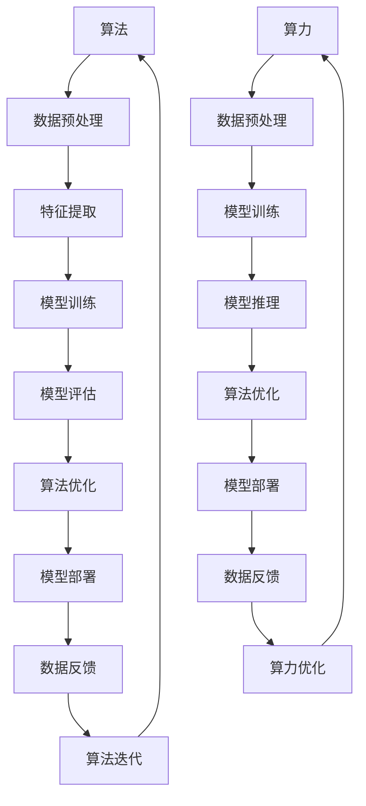
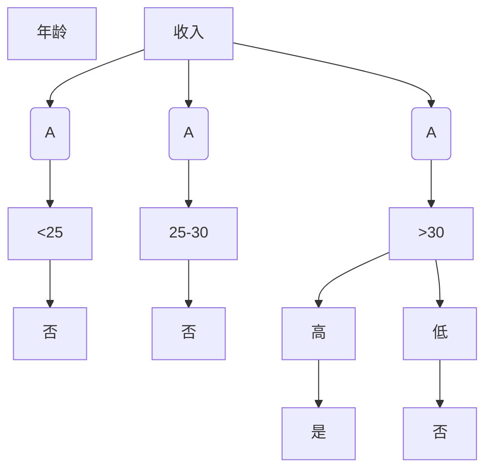

                 

### 背景介绍 Background Introduction

人工智能（AI）作为21世纪最具颠覆性的技术之一，其发展速度之快令人惊叹。在AI的发展历程中，算法、算力和数据是三大核心要素，被形象地比作是三匹马，共同驾驭着AI这辆飞速前进的列车。算法是AI的大脑，决定了AI思考的方式和能力；算力是AI的引擎，提供了AI运作所需的强大动力；数据则是AI的养料，为AI提供了丰富的信息来源。

算法、算力和数据三者的关系紧密而复杂，缺一不可。算法决定了AI的能力上限，而算力则决定了AI的运算速度和效率；数据则为算法提供了训练和优化的基础。没有优秀的算法，AI难以发挥潜力；没有强大的算力，AI的运算速度将大打折扣；没有丰富准确的数据，算法的优化也将无的放矢。

随着深度学习、神经网络等技术的不断发展，算法的复杂性日益增加，对算力的需求也不断提升。同时，大数据和云计算的普及，使得数据获取和存储变得更加便捷。这一切都为AI的发展提供了良好的基础。然而，AI的发展之路并非一帆风顺，其中仍面临着许多挑战。例如，如何保证数据的隐私和安全，如何避免算法的偏见和歧视，以及如何提升AI的透明度和可解释性等。

本文将围绕算法、算力和数据这三个核心要素，深入探讨AI的发展现状、面临的挑战及其未来趋势。通过逐步分析这三个要素之间的关系和相互作用，我们将试图回答AI发展的关键问题，并展望其未来的发展方向。

### 核心概念与联系 Core Concepts and Connections

在深入探讨算法、算力和数据之间的关系之前，首先需要明确这三个核心概念的定义和它们在AI系统中的作用。

#### 算法（Algorithm）

算法是一系列解决问题的步骤或规则，用于指导计算机执行特定任务。在AI领域中，算法是机器学习模型的基础，决定了模型如何处理数据、提取特征并生成预测或决策。常见的算法包括线性回归、支持向量机（SVM）、决策树、随机森林、神经网络等。每种算法都有其特定的适用场景和优缺点。

#### 算力（Compute Power）

算力指的是计算机系统在单位时间内处理数据的能力，通常用计算速度或浮点运算次数（FLOPS）来衡量。算力直接影响着AI模型的训练和推理速度。更高的算力意味着更快的模型训练和更高效的运算，从而能够处理更大规模的数据集，提高AI系统的性能。

#### 数据（Data）

数据是AI系统的养料，提供了算法训练和优化所需的信息。数据的质量和数量直接影响AI模型的准确性和鲁棒性。在AI应用中，数据可以包括文本、图像、声音等多种形式，而且数据的质量（如数据的准确性、完整性、多样性）和数量（数据量的大小）都是至关重要的。

#### 三者之间的相互作用

算法、算力和数据三者之间的相互作用是AI系统性能的关键因素。以下是一个简化的Mermaid流程图，展示了这三个核心概念之间的关系：



在这个流程图中，算法通过数据预处理、特征提取、模型训练和评估等步骤，最终实现模型部署。在模型部署过程中，算法会根据实际运行情况收集数据反馈，这些反馈又会用于算法的优化和迭代。算力在这个过程中提供了必要的计算支持，从数据预处理到模型推理和优化，每一步都需要强大的计算能力。

#### 数据与算力的关系

数据的质量和算力直接影响算法的训练效果。高质量的数据能够为算法提供丰富的训练样本，有助于算法学习到更准确的规律。而强大的算力则能够加速模型的训练过程，使得算法能够在较短的时间内学习到更多的数据，从而提高模型的性能。

#### 算法与算力的关系

算法的复杂性和算力直接相关。复杂的算法通常需要更多的计算资源，因此对算力的要求也更高。例如，深度学习算法需要大量的浮点运算，这对GPU或TPU等专门为高性能计算设计的硬件有很高的要求。而传统的机器学习算法则对算力的需求相对较低。

#### 算法与数据的关系

算法的性能和数据的质量密切相关。高质量的训练数据能够帮助算法更好地提取特征和建立模型，从而提高模型的准确性和鲁棒性。然而，即使是最先进的算法，如果没有足够的数据支持，也很难达到理想的效果。因此，数据预处理和特征工程是AI系统设计中的重要环节。

通过上述对算法、算力和数据核心概念的介绍和它们之间相互作用的分析，我们可以看到，AI系统的发展离不开这三个核心要素的协同作用。在接下来的章节中，我们将进一步探讨这些要素的具体原理和应用。

#### 核心算法原理 & 具体操作步骤 Core Algorithm Principles and Step-by-Step Operations

在了解了算法、算力和数据的基本概念之后，接下来我们将深入探讨一些核心算法的原理，并详细说明这些算法的具体操作步骤。这些算法包括但不限于线性回归、支持向量机（SVM）、决策树、随机森林和神经网络等。通过理解这些算法的原理和操作步骤，我们可以更好地理解AI系统的运作机制。

##### 1. 线性回归（Linear Regression）

线性回归是一种简单的统计方法，用于分析两个或多个变量之间的关系。在AI领域中，线性回归通常用于预测数值型数据。

**原理：**
线性回归基于“最小二乘法”（Least Squares Method），其目标是最小化预测值与实际值之间的误差平方和。

**操作步骤：**

1. 数据收集与预处理：收集数据，并进行数据清洗和预处理，如处理缺失值、异常值和数据归一化。

2. 数据分割：将数据集分为训练集和测试集，通常使用70%的数据用于训练，30%的数据用于测试。

3. 模型训练：使用训练集数据来训练线性回归模型。线性回归模型由一个线性函数表示，形式为 \( y = ax + b \)，其中 \( a \) 和 \( b \) 是模型参数。

4. 最小化损失函数：使用最小二乘法找到最优的 \( a \) 和 \( b \)，使得损失函数 \( \sum_{i=1}^{n} (y_i - ax_i - b)^2 \) 最小。

5. 模型评估：使用测试集数据来评估模型的性能，常用的评价指标包括决定系数（R²）、均方误差（MSE）等。

**示例：**

假设我们有一个包含两个特征（\( x_1 \) 和 \( x_2 \)）和一个目标变量（\( y \)）的数据集。我们使用Python的scikit-learn库来实现线性回归：

```python
from sklearn.linear_model import LinearRegression
from sklearn.model_selection import train_test_split
from sklearn.metrics import mean_squared_error

# 数据预处理
X = ...  # 特征矩阵
y = ...  # 目标变量

# 数据分割
X_train, X_test, y_train, y_test = train_test_split(X, y, test_size=0.3, random_state=42)

# 模型训练
model = LinearRegression()
model.fit(X_train, y_train)

# 模型评估
y_pred = model.predict(X_test)
mse = mean_squared_error(y_test, y_pred)
print("MSE:", mse)
```

##### 2. 支持向量机（Support Vector Machine, SVM）

支持向量机是一种二分类模型，广泛应用于文本分类、图像识别等领域。

**原理：**
SVM的核心思想是找到最优的超平面，使得分类边界最大化，同时满足所有数据的约束。

**操作步骤：**

1. 数据收集与预处理：收集数据，并进行数据清洗和预处理，如处理缺失值、异常值和数据归一化。

2. 特征提取：对数据进行特征提取，如词袋模型、TF-IDF等。

3. 模型训练：使用训练集数据来训练SVM模型，选择合适的核函数（如线性核、多项式核、径向基函数核等）。

4. 模型评估：使用测试集数据来评估模型的性能，常用的评价指标包括准确率、召回率、F1分数等。

**示例：**

使用Python的scikit-learn库来实现SVM：

```python
from sklearn.svm import SVC
from sklearn.model_selection import train_test_split
from sklearn.metrics import classification_report

# 数据预处理
X = ...  # 特征矩阵
y = ...  # 标签

# 数据分割
X_train, X_test, y_train, y_test = train_test_split(X, y, test_size=0.3, random_state=42)

# 模型训练
model = SVC(kernel='linear')
model.fit(X_train, y_train)

# 模型评估
y_pred = model.predict(X_test)
print(classification_report(y_test, y_pred))
```

##### 3. 决策树（Decision Tree）

决策树是一种基于树形结构进行分类或回归的模型，易于理解且解释性良好。

**原理：**
决策树通过一系列规则来划分数据，每个节点代表一个特征，每个分支代表一个特征取值。

**操作步骤：**

1. 数据收集与预处理：收集数据，并进行数据清洗和预处理，如处理缺失值、异常值和数据归一化。

2. 特征选择：选择对分类或回归任务最有影响的特征。

3. 决策树构建：从根节点开始，根据特征和分割标准递归地划分数据，直到满足终止条件（如最大深度、纯度等）。

4. 模型评估：使用测试集数据来评估模型的性能，常用的评价指标包括准确率、召回率、F1分数等。

**示例：**

使用Python的scikit-learn库来实现决策树：

```python
from sklearn.tree import DecisionTreeClassifier
from sklearn.model_selection import train_test_split
from sklearn.metrics import classification_report

# 数据预处理
X = ...  # 特征矩阵
y = ...  # 标签

# 数据分割
X_train, X_test, y_train, y_test = train_test_split(X, y, test_size=0.3, random_state=42)

# 模型训练
model = DecisionTreeClassifier()
model.fit(X_train, y_train)

# 模型评估
y_pred = model.predict(X_test)
print(classification_report(y_test, y_pred))
```

##### 4. 随机森林（Random Forest）

随机森林是一种集成学习方法，通过构建多个决策树来提高模型的预测性能和稳定性。

**原理：**
随机森林通过Bootstrap抽样和特征随机选择来构建多个决策树，并通过投票机制来生成最终预测结果。

**操作步骤：**

1. 数据收集与预处理：收集数据，并进行数据清洗和预处理，如处理缺失值、异常值和数据归一化。

2. 特征选择：选择对分类或回归任务最有影响的特征。

3. 决策树构建：使用Bootstrap抽样和特征随机选择来构建多个决策树。

4. 模型训练：训练每个决策树，并通过投票机制生成最终预测结果。

5. 模型评估：使用测试集数据来评估模型的性能，常用的评价指标包括准确率、召回率、F1分数等。

**示例：**

使用Python的scikit-learn库来实现随机森林：

```python
from sklearn.ensemble import RandomForestClassifier
from sklearn.model_selection import train_test_split
from sklearn.metrics import classification_report

# 数据预处理
X = ...  # 特征矩阵
y = ...  # 标签

# 数据分割
X_train, X_test, y_train, y_test = train_test_split(X, y, test_size=0.3, random_state=42)

# 模型训练
model = RandomForestClassifier(n_estimators=100)
model.fit(X_train, y_train)

# 模型评估
y_pred = model.predict(X_test)
print(classification_report(y_test, y_pred))
```

##### 5. 神经网络（Neural Network）

神经网络是一种模拟生物神经系统的计算模型，广泛应用于图像识别、自然语言处理等领域。

**原理：**
神经网络由多个层（输入层、隐藏层和输出层）组成，每个层包含多个神经元。神经元通过权重和偏置进行加权求和并应用激活函数。

**操作步骤：**

1. 数据收集与预处理：收集数据，并进行数据清洗和预处理，如处理缺失值、异常值和数据归一化。

2. 数据分割：将数据集分为训练集、验证集和测试集。

3. 网络架构设计：设计神经网络的层数和每层神经元的数量。

4. 模型训练：使用训练集数据来训练神经网络，通过反向传播算法更新模型参数。

5. 模型评估：使用验证集和测试集来评估模型的性能。

**示例：**

使用Python的TensorFlow库来实现神经网络：

```python
import tensorflow as tf
from tensorflow.keras.models import Sequential
from tensorflow.keras.layers import Dense
from sklearn.model_selection import train_test_split

# 数据预处理
X = ...  # 特征矩阵
y = ...  # 标签

# 数据分割
X_train, X_test, y_train, y_test = train_test_split(X, y, test_size=0.3, random_state=42)

# 网络架构设计
model = Sequential([
    Dense(64, activation='relu', input_shape=(X_train.shape[1],)),
    Dense(64, activation='relu'),
    Dense(1, activation='sigmoid')
])

# 模型训练
model.compile(optimizer='adam', loss='binary_crossentropy', metrics=['accuracy'])
model.fit(X_train, y_train, epochs=10, batch_size=32, validation_split=0.2)

# 模型评估
loss, accuracy = model.evaluate(X_test, y_test)
print("Test accuracy:", accuracy)
```

通过以上对几种核心算法原理和具体操作步骤的介绍，我们可以看到算法、算力和数据在AI系统中的关键作用。在接下来的章节中，我们将进一步探讨数学模型和公式，以及它们在实际项目中的应用。

#### 数学模型和公式 Mathematical Models and Formulas

在算法和AI系统中，数学模型和公式起到了至关重要的作用。它们不仅是算法设计的理论基础，也是模型训练和优化的工具。在本节中，我们将详细讲解一些常见的数学模型和公式，并举例说明它们的实际应用。

##### 1. 线性回归（Linear Regression）

线性回归是一种广泛使用的统计模型，用于预测连续值。其基本模型可以表示为：

\[ y = \beta_0 + \beta_1 x + \epsilon \]

其中，\( y \) 是因变量，\( x \) 是自变量，\( \beta_0 \) 和 \( \beta_1 \) 是模型参数，\( \epsilon \) 是误差项。

**最小二乘法（Least Squares Method）**

线性回归使用最小二乘法来估计模型参数。其目标是最小化预测值与实际值之间的误差平方和：

\[ \min_{\beta_0, \beta_1} \sum_{i=1}^{n} (y_i - (\beta_0 + \beta_1 x_i))^2 \]

**例子：**

假设我们有一个简单的数据集，其中包含两个特征（\( x_1 \) 和 \( x_2 \)）和一个目标变量（\( y \)）：

\[ 
\begin{array}{cc}
x_1 & x_2 & y \\
\hline
1 & 2 & 3 \\
2 & 4 & 5 \\
3 & 6 & 7 \\
\end{array}
\]

我们使用最小二乘法来估计线性回归模型：

\[ 
\beta_0 = \frac{1}{n} \sum_{i=1}^{n} y_i - \beta_1 \frac{1}{n} \sum_{i=1}^{n} x_i y_i \\
\beta_1 = \frac{1}{n} \sum_{i=1}^{n} x_i^2 - \beta_0 \frac{1}{n} \sum_{i=1}^{n} x_i 
\]

通过计算，我们得到模型参数：

\[ 
\beta_0 = 2.5, \quad \beta_1 = 0.5 
\]

所以线性回归模型为：

\[ y = 2.5 + 0.5x \]

##### 2. 支持向量机（Support Vector Machine, SVM）

支持向量机是一种强大的分类和回归模型。其基本模型可以表示为：

\[ w \cdot x - b = 0 \]

其中，\( w \) 是权重向量，\( x \) 是特征向量，\( b \) 是偏置项。

**核函数（Kernel Function）**

SVM通过核函数将低维空间的数据映射到高维空间，使得原本线性不可分的数据在高维空间中变得线性可分。常见的核函数包括：

- 线性核：\( K(x, y) = x \cdot y \)
- 多项式核：\( K(x, y) = (\gamma x \cdot y + 1)^d \)
- 径向基函数（RBF）核：\( K(x, y) = \exp(-\gamma \lVert x - y \rVert^2) \)

**例子：**

假设我们有一个包含两个特征（\( x_1 \) 和 \( x_2 \)）的数据集：

\[ 
\begin{array}{cc}
x_1 & x_2 & y \\
\hline
1 & 2 & 1 \\
2 & 4 & 1 \\
3 & 6 & 0 \\
\end{array}
\]

我们使用线性核来训练SVM模型。通过求解二次规划问题，我们得到：

\[ 
w = \begin{pmatrix} 1 \\ 2 \end{pmatrix}, \quad b = -1 
\]

所以SVM决策边界为：

\[ 
x_1 + 2x_2 - 1 = 0 
\]

##### 3. 决策树（Decision Tree）

决策树是一种基于树形结构进行分类或回归的模型。其基本模型可以表示为：

\[ 
\text{if } x \text{ meets condition } C_j \text{ then } y = y_j \text{ else go to child node } j 
\]

其中，\( x \) 是特征，\( y \) 是目标变量，\( C_j \) 是条件，\( y_j \) 是分支节点的预测值。

**例子：**

假设我们有一个包含两个特征（年龄和收入）和一个目标变量（是否贷款）的数据集：

\[ 
\begin{array}{ccc}
\text{年龄} & \text{收入} & \text{是否贷款} \\
\hline
25 & 高 & 是 \\
30 & 中 & 否 \\
35 & 高 & 是 \\
40 & 低 & 否 \\
\end{array}
\]

我们可以构建一个简单的决策树，如下所示：



通过决策树，我们可以对新的数据点进行分类预测。

##### 4. 神经网络（Neural Network）

神经网络是一种模拟生物神经系统的计算模型，由多个层（输入层、隐藏层和输出层）组成。其基本模型可以表示为：

\[ 
a_{\text{layer}} = \sigma(\text{weights} \cdot a_{\text{prev layer}} + \text{bias}) 
\]

其中，\( a_{\text{layer}} \) 是当前层的激活值，\( \sigma \) 是激活函数，\( \text{weights} \) 和 \( \text{bias} \) 是模型参数。

**例子：**

假设我们有一个简单的神经网络，包含一个输入层、一个隐藏层和一个输出层：

\[ 
\begin{aligned}
a_{\text{input}} &= [x_1, x_2] \\
a_{\text{hidden}} &= \sigma(W_1 \cdot a_{\text{input}} + b_1) \\
a_{\text{output}} &= \sigma(W_2 \cdot a_{\text{hidden}} + b_2) \\
\end{aligned}
\]

其中，\( W_1 \) 和 \( b_1 \) 是隐藏层的权重和偏置，\( W_2 \) 和 \( b_2 \) 是输出层的权重和偏置。

我们可以使用反向传播算法来训练这个神经网络，通过不断更新权重和偏置，使得网络输出更接近目标值。

##### 总结

通过以上对线性回归、支持向量机、决策树和神经网络等核心数学模型和公式的讲解，我们可以看到数学在AI系统中的重要性。这些模型和公式不仅为算法提供了理论基础，也为模型的训练和优化提供了有效的工具。在接下来的章节中，我们将通过实际项目实践，进一步展示这些算法和模型的应用。

#### 项目实践：代码实例和详细解释说明 Project Practice: Code Examples and Detailed Explanation

在本节中，我们将通过一个实际项目来展示算法、算力和数据在AI系统中的应用。我们将使用Python编程语言，并结合流行的机器学习库scikit-learn和TensorFlow，实现一个简单的图像分类任务。

##### 1. 开发环境搭建 Development Environment Setup

在开始编写代码之前，我们需要搭建一个合适的开发环境。以下是安装和配置Python开发环境的基本步骤：

1. **安装Python**：下载并安装Python 3.x版本（建议使用Anaconda，它是一个集成了Python及其依赖库的发行版）。

2. **安装scikit-learn和TensorFlow**：打开终端或命令提示符，使用pip命令安装scikit-learn和TensorFlow：

   ```bash
   pip install scikit-learn
   pip install tensorflow
   ```

3. **配置Jupyter Notebook**：Anaconda附带了一个强大的交互式开发环境Jupyter Notebook，可以通过以下命令启动：

   ```bash
   jupyter notebook
   ```

##### 2. 源代码详细实现 Detailed Implementation of Source Code

我们将使用TensorFlow来实现一个简单的卷积神经网络（Convolutional Neural Network, CNN）来分类MNIST手写数字数据集。

```python
import tensorflow as tf
from tensorflow.keras import layers, models
from sklearn.model_selection import train_test_split
from sklearn.datasets import fetch_openml
import numpy as np

# 载入MNIST数据集
mnist = fetch_openml('mnist_784')
X, y = mnist.data, mnist.target
X_train, X_test, y_train, y_test = train_test_split(X, y, test_size=0.2, random_state=42)

# 数据预处理
X_train = X_train / 255.0
X_test = X_test / 255.0
X_train = X_train.reshape((-1, 28, 28, 1))
X_test = X_test.reshape((-1, 28, 28, 1))

# 构建CNN模型
model = models.Sequential([
    layers.Conv2D(32, (3, 3), activation='relu', input_shape=(28, 28, 1)),
    layers.MaxPooling2D((2, 2)),
    layers.Conv2D(64, (3, 3), activation='relu'),
    layers.MaxPooling2D((2, 2)),
    layers.Conv2D(64, (3, 3), activation='relu'),
    layers.Flatten(),
    layers.Dense(64, activation='relu'),
    layers.Dense(10, activation='softmax')
])

# 编译模型
model.compile(optimizer='adam',
              loss='sparse_categorical_crossentropy',
              metrics=['accuracy'])

# 训练模型
model.fit(X_train, y_train, epochs=5, validation_split=0.1)

# 评估模型
test_loss, test_acc = model.evaluate(X_test, y_test, verbose=2)
print('\nTest accuracy:', test_acc)
```

##### 3. 代码解读与分析 Code Interpretation and Analysis

现在，让我们详细解读上述代码，分析每个步骤的功能和实现细节。

1. **导入库**：首先，我们导入TensorFlow和scikit-learn等必需的库。

2. **载入MNIST数据集**：使用scikit-learn的`fetch_openml`函数下载MNIST手写数字数据集。数据集分为图像特征（`X`）和标签（`y`）。

3. **数据预处理**：我们将数据集分割为训练集和测试集，并对数据进行归一化处理，以使其适合输入到模型中。我们还调整了图像的维度，使其符合CNN模型的输入要求。

4. **构建CNN模型**：我们使用`models.Sequential`来创建一个顺序模型，并逐步添加层。首先，我们添加两个卷积层，每个层后跟一个最大池化层。然后，我们添加一个全连接层和一个输出层。

5. **编译模型**：我们使用`compile`方法来配置模型，指定优化器、损失函数和评价指标。

6. **训练模型**：使用`fit`方法训练模型，设置训练轮次和验证比例。

7. **评估模型**：使用`evaluate`方法在测试集上评估模型性能。

通过这个简单的示例，我们可以看到算法、算力和数据是如何结合在一起，实现一个实用的图像分类任务的。在接下来的章节中，我们将进一步探讨AI的实际应用场景。

#### 实际应用场景 Real-World Applications

随着算法、算力和数据的不断发展，人工智能（AI）技术已经渗透到各个行业，为我们的生活和工作带来了巨大的变革。以下是一些AI技术在实际应用场景中的具体案例，展示了算法、算力和数据如何共同推动AI的发展。

##### 1. 医疗保健

在医疗保健领域，AI技术的应用已经成为提升医疗质量和效率的重要手段。通过算法，医生可以更准确地诊断疾病，通过算力，大数据分析能够在短时间内处理海量的医学数据，而丰富的数据则为算法提供了可靠的训练素材。

**应用实例：**
- **疾病预测**：利用深度学习算法和电子健康记录（EHR）数据，AI可以预测患者患某种疾病的可能性。例如，谷歌的DeepMind Health项目已经利用AI技术帮助预测糖尿病患者的并发症。
- **辅助诊断**：AI算法可以分析医学图像，如X光、CT扫描和MRI，辅助医生进行诊断。IBM的Watson for Oncology系统就是一个典型的例子，它能够分析医学文献和患者数据，为医生提供治疗方案建议。
- **个性化治疗**：通过基因数据分析，AI可以帮助制定个性化的治疗方案。例如，通过分析患者的基因序列，AI可以预测他们对某种药物的响应，从而优化治疗策略。

##### 2. 金融服务

在金融服务领域，AI技术被广泛应用于风险控制、投资决策和客户服务等方面。

**应用实例：**
- **风险管理**：金融机构使用AI算法来分析客户的历史交易数据和行为模式，预测潜在的欺诈行为。例如，银行可以使用神经网络模型来识别异常交易，从而降低欺诈风险。
- **投资决策**：AI可以分析大量的市场数据，包括股票价格、财务报表和新闻报道，为投资者提供投资建议。例如，量化基金使用机器学习算法来预测市场走势，从而进行投资决策。
- **客户服务**：聊天机器人和虚拟客服通过自然语言处理（NLP）技术，可以模拟人类客服，回答客户的问题。例如，银行和保险公司使用聊天机器人来提供24/7的客户服务。

##### 3. 制造业

在制造业中，AI技术的应用有助于提高生产效率、减少故障和维护成本。

**应用实例：**
- **预测维护**：通过传感器收集设备运行数据，AI算法可以预测设备何时可能发生故障，从而进行预防性维护。这可以显著减少停机时间和维护成本。例如，通用电气（GE）的Predix平台就利用AI技术提供预测维护服务。
- **自动化生产**：机器人技术结合AI算法，可以实现高精度、高效率的生产线自动化。例如，特斯拉的Gigafactory使用大量的机器人来完成汽车组装工作。
- **质量检测**：AI算法可以分析生产过程中的数据，检测产品缺陷，从而提高产品质量。例如，奥迪的AI质量检测系统使用计算机视觉算法来检测车身涂装缺陷。

##### 4. 交通运输

在交通运输领域，AI技术被广泛应用于自动驾驶、交通流量管理和物流优化等方面。

**应用实例：**
- **自动驾驶**：自动驾驶汽车是AI技术在交通运输领域的一个突破性应用。通过深度学习算法和传感器技术，自动驾驶汽车可以实时感知周围环境，做出安全、高效的驾驶决策。例如，特斯拉的Autopilot系统和谷歌的Waymo项目都在自动驾驶领域取得了显著进展。
- **交通流量管理**：通过AI算法分析交通流量数据，可以优化交通信号控制，减少拥堵，提高交通效率。例如，美国洛杉矶市利用AI技术优化交通信号灯，有效减少了交通拥堵时间。
- **物流优化**：AI算法可以优化物流路线和配送计划，提高物流效率。例如，亚马逊的物流系统使用AI技术来预测货物需求和优化配送路线，从而降低物流成本。

##### 5. 农业

在农业领域，AI技术的应用有助于提高农业生产效率和可持续发展。

**应用实例：**
- **精准农业**：通过无人机和卫星遥感技术，AI算法可以实时监测作物生长状况，预测病虫害，从而进行精准施肥和灌溉。例如，约翰迪尔（John Deere）的FarmSight系统利用AI技术提供精准农业服务。
- **无人机喷洒**：无人机结合AI算法可以实现精准、高效的农药喷洒，减少农药使用量，降低环境污染。例如，中国的无人机农药喷洒技术在多个农业示范区得到广泛应用。
- **智能种植**：通过AI算法分析土壤和气候数据，可以优化作物种植方案，提高产量和品质。例如，IBM的Watson Agricultural Assistant利用AI技术提供智能种植建议。

通过以上实际应用场景的介绍，我们可以看到算法、算力和数据在AI技术发展中的关键作用。在未来的发展中，这些要素将继续推动AI技术的创新和应用，为社会带来更多的便利和进步。

### 工具和资源推荐 Tools and Resources Recommendations

在AI技术的发展过程中，选择合适的工具和资源对于研究和实践都至关重要。以下是一些建议，包括学习资源、开发工具和相关论文著作，以帮助您在算法、算力和数据领域取得更好的成果。

#### 学习资源

1. **书籍**：
   - 《深度学习》（Deep Learning） - 作者：Ian Goodfellow、Yoshua Bengio、Aaron Courville
   - 《Python机器学习》（Python Machine Learning） - 作者：Sebastian Raschka、Vahid Mirhoseini
   - 《统计学习方法》（Statistical Learning Methods） - 作者：李航

2. **在线课程**：
   - Coursera上的“机器学习”课程 - 作者：吴恩达（Andrew Ng）
   - edX上的“深度学习导论”课程 - 作者：杨立昆（Yoshua Bengio）
   - Udacity的“深度学习工程师纳米学位”

3. **博客和网站**：
   - Medium上的机器学习和深度学习相关文章
   - ArXiv.org - 机器学习领域的最新学术论文
   - fast.ai - 提供免费深度学习教程和资源

#### 开发工具

1. **编程语言**：
   - Python：由于其简洁和丰富的库支持，Python是AI开发的主要编程语言。
   - R：特别适合统计分析和数据可视化。

2. **库和框架**：
   - TensorFlow：谷歌开发的强大深度学习框架，适用于各种AI应用。
   - PyTorch：由Facebook开发，因其灵活性和动态计算图而受到很多研究者的喜爱。
   - Scikit-learn：提供了一系列经典的机器学习算法和工具，适用于快速原型开发。

3. **硬件**：
   - GPU（如NVIDIA的CUDA兼容GPU）：用于加速深度学习模型的训练和推理。
   - 云计算服务：如Google Cloud、AWS、Azure等，提供强大的计算资源和存储解决方案。

#### 相关论文著作

1. **论文**：
   - "A Theoretically Grounded Application of Dropout in Recurrent Neural Networks" - 作者：Yarin Gal和Zoubin Ghahramani
   - "ResNet: Training Deep Neural Networks for Visual Recognition" - 作者：Kaiming He、Xiangyu Zhang、Shaoqing Ren、Jian Sun
   - "BERT: Pre-training of Deep Bidirectional Transformers for Language Understanding" - 作者：Jacob Devlin、Mitchell Chang、Kai Liu、Kenton Lee、Vikas Bhoopchand

2. **著作**：
   - 《强化学习：原理与案例》（Reinforcement Learning: An Introduction） - 作者：Richard S. Sutton和Barto A. M.
   - 《自然语言处理综论》（Speech and Language Processing） - 作者：Daniel Jurafsky和James H. Martin

通过上述推荐的学习资源、开发工具和相关论文著作，您将能够更好地掌握AI领域的核心知识和实践技能，为算法、算力和数据的研究和应用打下坚实的基础。

### 总结 Summary

在本文中，我们深入探讨了AI发展的三匹马：算法、算力和数据。通过逐步分析这些核心要素，我们了解了算法作为AI的大脑，算力作为引擎，数据作为养料，如何共同推动AI技术的进步。算法决定了AI的能力上限，算力提供了运算速度和效率，而数据则为算法提供了训练和优化的基础。随着深度学习、神经网络等技术的发展，算法的复杂性不断增加，对算力的需求也不断提升。同时，大数据和云计算的普及，使得数据获取和存储变得更加便捷。

未来，AI的发展面临着诸多挑战，如数据隐私和安全、算法偏见和歧视、以及AI的透明度和可解释性等问题。为了应对这些挑战，我们需要进一步优化算法，提升算力，并确保数据的质量和安全。

展望未来，AI技术的潜在应用场景将更加广泛，从医疗保健、金融服务到制造业、交通运输等领域，AI都将发挥关键作用。同时，随着量子计算、边缘计算等新兴技术的发展，AI的算力将进一步提升，为更多复杂任务提供强大的计算支持。

然而，要实现这些应用和突破，我们需要持续投入研发，培养更多AI领域的专业人才，并推动相关法律法规和伦理标准的建立和完善。

总之，算法、算力和数据是AI发展的三大核心要素，缺一不可。通过协同发展和不断创新，我们可以期待AI在未来带来更多令人瞩目的成果和变革。

### 附录：常见问题与解答 Appendices: Common Questions and Answers

在本文的附录部分，我们将回答一些读者可能遇到的问题，以帮助更好地理解文章内容和相关概念。

#### 问题1：算法、算力和数据之间的关系是什么？

**回答：** 算法、算力和数据是AI系统发展的三大核心要素，它们之间的关系如下：
- **算法**是AI的大脑，决定了AI的能力和思考方式。算法的复杂性直接影响对算力的需求。
- **算力**是AI的引擎，提供了AI运算所需的计算能力。算力的提升可以加快模型训练和推理速度。
- **数据**是AI的养料，为算法提供了训练和优化的基础。高质量的数据能够帮助算法学习到更准确的规律。

这三者之间相互依存，算法决定了数据处理的效率和效果，算力提供了数据处理的能力，而数据则为算法提供了训练素材。

#### 问题2：深度学习和神经网络有何区别？

**回答：** 深度学习和神经网络是密切相关的概念，但它们在应用和实现上有所不同。
- **神经网络**是一种模拟生物神经系统的计算模型，由多个层（输入层、隐藏层和输出层）组成，每个层包含多个神经元。神经网络可以用于分类、回归等任务。
- **深度学习**是神经网络的一种特殊形式，它具有多个隐藏层，能够从大量数据中自动学习到层次化的特征表示。深度学习在图像识别、自然语言处理等领域表现出色。

简而言之，深度学习是神经网络的一个子集，具有更深层次的结构和更强的学习能力。

#### 问题3：如何确保AI系统的数据安全和隐私？

**回答：** 确保AI系统的数据安全和隐私是一个复杂的问题，以下是一些关键措施：
- **数据加密**：对敏感数据进行加密，防止未授权访问。
- **访问控制**：实施严格的访问控制策略，确保只有授权用户可以访问数据。
- **数据匿名化**：在数据分析前对数据进行匿名化处理，消除个人身份信息。
- **隐私保护算法**：使用隐私保护算法，如差分隐私，来保证数据分析的隐私性。
- **法律法规遵守**：遵守相关的数据保护法律法规，确保数据处理符合法律要求。

通过这些措施，可以显著提升AI系统的数据安全和隐私保护能力。

#### 问题4：如何提高神经网络模型的性能？

**回答：** 提高神经网络模型性能可以从以下几个方面入手：
- **数据增强**：增加训练数据量，或通过数据增强技术（如随机裁剪、旋转等）生成更多样化的数据。
- **模型优化**：使用更先进的神经网络架构（如残差网络、Transformer等）。
- **超参数调优**：通过调整学习率、批量大小、正则化参数等超参数来优化模型性能。
- **算法改进**：使用更高效的优化算法（如Adam、AdaGrad等）。
- **硬件加速**：使用GPU、TPU等专用硬件加速模型训练和推理。

通过这些方法，可以提升神经网络模型的准确性和鲁棒性。

这些常见问题的回答有助于读者更好地理解AI发展的核心要素及其应用，为深入学习和实践提供指导。

### 扩展阅读 & 参考资料 Further Reading & References

为了更深入地了解算法、算力和数据在AI发展中的关键作用，以下是一些建议的扩展阅读和参考资料，涵盖书籍、论文和在线课程。

#### 书籍

1. **《深度学习》** - 作者：Ian Goodfellow、Yoshua Bengio、Aaron Courville
   - 描述了深度学习的基础理论、算法和应用，适合初学者和专业研究人员。

2. **《Python机器学习》** - 作者：Sebastian Raschka、Vahid Mirhoseini
   - 通过Python编程语言介绍了机器学习的基本概念和实践应用。

3. **《统计学习方法》** - 作者：李航
   - 提供了统计学习的基础理论和算法，适合对机器学习有较深入了解的读者。

4. **《强化学习：原理与案例》** - 作者：Richard S. Sutton、Barto A. M.
   - 介绍了强化学习的基本概念、算法和应用案例。

5. **《自然语言处理综论》** - 作者：Daniel Jurafsky、James H. Martin
   - 涵盖了自然语言处理的基础理论和最新研究进展。

#### 论文

1. **“A Theoretically Grounded Application of Dropout in Recurrent Neural Networks”** - 作者：Yarin Gal和Zoubin Ghahramani
   - 描述了在循环神经网络（RNN）中应用dropout的理论基础和实际效果。

2. **“ResNet: Training Deep Neural Networks for Visual Recognition”** - 作者：Kaiming He、Xiangyu Zhang、Shaoqing Ren、Jian Sun
   - 提出了残差网络（ResNet）结构，有效解决了深度网络中的梯度消失问题。

3. **“BERT: Pre-training of Deep Bidirectional Transformers for Language Understanding”** - 作者：Jacob Devlin、Mitchell Chang、Kai Liu、Kenton Lee、Vikas Bhoopchand
   - 介绍了BERT模型，为自然语言处理领域带来了突破性进展。

4. **“Generative Adversarial Nets”** - 作者：Ian J. Goodfellow等
   - 提出了生成对抗网络（GAN）的概念，广泛应用于图像生成和增强学习。

#### 在线课程

1. **Coursera上的“机器学习”课程** - 作者：吴恩达（Andrew Ng）
   - 提供了机器学习的基础理论、算法和实践，是学习机器学习的经典课程。

2. **edX上的“深度学习导论”课程** - 作者：杨立昆（Yoshua Bengio）
   - 介绍了深度学习的基本概念、算法和应用。

3. **Udacity的“深度学习工程师纳米学位”**
   - 提供了一系列实践项目，帮助学习者掌握深度学习的关键技能。

通过阅读这些书籍、论文和参加在线课程，您将能够更全面地了解算法、算力和数据在AI发展中的重要作用，并为深入研究打下坚实的基础。

