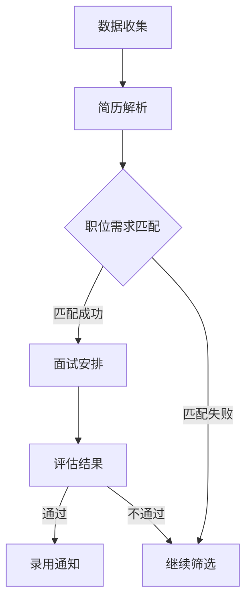

                 

# AI在人力资源管理中的应用：人才匹配

## 摘要

在全球化、信息化和智能化的今天，人力资源管理面临着前所未有的挑战和机遇。人工智能（AI）技术的发展为人力资源管理提供了强大的支持，尤其在人才匹配方面，AI的引入极大地提高了招聘效率和准确性。本文将深入探讨AI在人力资源管理中的应用，尤其是人才匹配的核心概念、算法原理、数学模型以及实际应用场景，旨在为读者提供一个全面的技术解读。

本文的结构如下：

1. **背景介绍**：探讨人力资源管理面临的挑战以及AI技术的兴起如何改变这一领域。
2. **核心概念与联系**：详细解释与人才匹配相关的核心概念，并使用Mermaid流程图展示其架构。
3. **核心算法原理 & 具体操作步骤**：介绍AI在人才匹配中的核心算法，包括其原理和具体操作步骤。
4. **数学模型和公式 & 详细讲解 & 举例说明**：阐述数学模型在人才匹配中的作用，并给出具体例子。
5. **项目实践：代码实例和详细解释说明**：展示一个实际的项目实例，并详细解释其代码实现。
6. **实际应用场景**：探讨AI在人力资源管理中的实际应用案例。
7. **工具和资源推荐**：推荐学习资源和开发工具。
8. **总结：未来发展趋势与挑战**：总结文章的主要观点，并讨论未来的发展趋势和挑战。
9. **附录：常见问题与解答**：回答读者可能关心的一些问题。
10. **扩展阅读 & 参考资料**：提供进一步阅读的参考资料。

接下来，我们将一步一步地深入探讨AI在人力资源管理中的应用，特别是人才匹配的技术细节。

## 1. 背景介绍

### 1.1 人力资源管理的挑战

人力资源管理（HRM）是企业管理的核心组成部分，它关系到企业的生存与发展。然而，随着全球化的加速、信息技术的进步和市场的快速变化，传统的HRM面临着诸多挑战：

- **招聘难度增加**：人才市场竞争激烈，优质人才的招聘变得越来越困难。
- **招聘效率低下**：传统的招聘流程繁琐，信息处理速度慢，导致招聘周期延长。
- **人才匹配不准确**：由于信息不对称和主观判断，往往难以找到与职位高度匹配的人才。
- **员工流失率高**：不合适的招聘决策可能导致员工流失，增加企业的培训成本和业务风险。

### 1.2 AI技术的兴起

人工智能（AI）作为一项颠覆性的技术，正迅速渗透到各个领域，其中包括人力资源管理。AI技术在HRM中的应用主要体现在以下几个方面：

- **数据分析与挖掘**：通过大数据分析，AI可以帮助HR部门挖掘出潜在的高价值人才。
- **自动化流程**：AI可以自动化处理招聘流程中的重复性工作，提高效率。
- **智能推荐系统**：基于机器学习和深度学习算法，AI可以为企业推荐最适合的候选人。
- **智能评估与筛选**：通过自然语言处理和图像识别技术，AI可以对候选人进行初步评估和筛选。

### 1.3 AI在人才匹配中的应用

AI在人才匹配中的应用主要体现在以下几个方面：

- **简历筛选**：AI可以根据职位描述自动筛选简历，识别出符合条件的候选人。
- **职位匹配**：AI可以分析候选人的技能、经验和个性，与职位需求进行匹配。
- **面试评估**：AI可以通过分析面试者的回答，评估其胜任能力。
- **员工关系管理**：AI可以帮助企业进行员工关系管理，预测员工流失风险。

通过上述应用，AI不仅提高了招聘效率，还显著提升了人才匹配的准确性，为企业提供了强大的竞争力。

## 2. 核心概念与联系

在深入探讨AI在人才匹配中的应用之前，我们需要了解一些核心概念，这些概念是构建人才匹配系统的基石。

### 2.1 人才匹配的概念

人才匹配是指将求职者与职位需求进行匹配的过程，其目的是找到与职位最匹配的候选人。人才匹配不仅考虑候选人的技能和经验，还包括其个性、价值观和职业发展潜力。

### 2.2 数据来源

人才匹配系统依赖于大量的数据来源，包括：

- **简历数据**：包含求职者的基本信息、教育背景、工作经历、技能和证书等。
- **职位描述**：包括职位的基本信息、职位要求、职责和公司背景等。
- **社交媒体数据**：如LinkedIn等平台上的信息，可以提供更丰富的背景资料。
- **员工反馈数据**：通过员工评价和反馈，可以了解候选人在团队中的适应性和表现。

### 2.3 Mermaid流程图

为了更直观地展示人才匹配系统的架构，我们使用Mermaid流程图来描述其核心流程。以下是一个简化的流程图：



### 2.4 核心概念之间的联系

- **数据收集**：系统首先从各种渠道收集简历和职位描述数据。
- **简历解析**：利用自然语言处理技术对简历进行解析，提取关键信息。
- **职位需求匹配**：根据职位需求，系统对简历进行匹配，筛选出符合条件的候选人。
- **面试安排**：对于匹配成功的候选人，系统会安排面试。
- **评估结果**：面试后，系统会根据评估结果决定是否录用。
- **录用通知**：对于通过的候选人，系统会发送录用通知。

通过上述流程，我们可以看到AI在人才匹配中的核心作用，即利用算法和模型对大量数据进行处理，实现高效的人才匹配。

## 3. 核心算法原理 & 具体操作步骤

### 3.1 算法原理

AI在人才匹配中的核心算法主要包括基于内容的匹配（Content-based Matching）和协同过滤（Collaborative Filtering）。

#### 3.1.1 基于内容的匹配

基于内容的匹配是一种文本相似度计算的方法，它通过分析简历和职位描述中的关键词、短语和句子，计算它们之间的相似度。具体原理如下：

1. **文本预处理**：对简历和职位描述进行分词、去停用词、词性标注等处理，提取关键信息。
2. **特征提取**：将预处理后的文本转化为向量表示，常用的方法包括TF-IDF、Word2Vec和BERT等。
3. **相似度计算**：计算简历与职位描述之间的相似度，常用的方法包括余弦相似度和欧氏距离等。

#### 3.1.2 协同过滤

协同过滤是一种基于用户行为数据的推荐方法，它通过分析用户的历史行为数据（如浏览、收藏、面试等），预测用户对某个职位的偏好。具体原理如下：

1. **用户行为数据收集**：收集用户在各种行为（如浏览、面试等）上的数据。
2. **相似度计算**：计算用户之间的相似度，常用的方法包括余弦相似度和皮尔逊相关系数等。
3. **推荐生成**：根据用户相似度和职位特征，生成推荐列表。

### 3.2 具体操作步骤

下面我们将以一个简单的基于内容的匹配算法为例，介绍其具体操作步骤：

#### 3.2.1 数据收集

首先，系统需要从各种渠道收集简历和职位描述数据。这些数据可以通过API接口、爬虫或手动上传等方式获取。

#### 3.2.2 数据预处理

对于收集到的简历和职位描述，系统需要进行文本预处理，包括分词、去停用词、词性标注等。例如：

```python
from nltk.tokenize import word_tokenize
from nltk.corpus import stopwords
from nltk.stem import WordNetLemmatizer

stop_words = set(stopwords.words('english'))
lemmatizer = WordNetLemmatizer()

def preprocess_text(text):
    tokens = word_tokenize(text)
    tokens = [lemmatizer.lemmatize(token.lower()) for token in tokens if token.isalpha() and token not in stop_words]
    return tokens
```

#### 3.2.3 特征提取

接下来，系统需要将预处理后的文本转化为向量表示。我们以TF-IDF为例：

```python
from sklearn.feature_extraction.text import TfidfVectorizer

vectorizer = TfidfVectorizer()
X = vectorizer.fit_transform([' '.join(preprocess_text(resume)), ' '.join(preprocess_text(job_desc))])
```

#### 3.2.4 相似度计算

最后，系统需要计算简历和职位描述之间的相似度。我们以余弦相似度为例：

```python
from sklearn.metrics.pairwise import cosine_similarity

similarity = cosine_similarity(X)[0][1]
```

#### 3.2.5 匹配结果输出

根据相似度阈值，系统可以输出匹配结果，例如：

```python
if similarity > threshold:
    print("匹配成功")
else:
    print("匹配失败")
```

通过上述步骤，我们可以实现一个简单的基于内容的匹配算法。在实际应用中，我们可以结合多种算法和模型，提高人才匹配的准确性和效率。

## 4. 数学模型和公式 & 详细讲解 & 举例说明

在人才匹配中，数学模型和公式扮演着至关重要的角色。它们不仅帮助我们量化人才匹配的准确度，还为优化算法提供了理论基础。以下，我们将详细解释一些关键的数学模型和公式，并通过具体例子来说明其应用。

### 4.1 余弦相似度

余弦相似度是一种用于计算两个向量之间相似度的方法。其公式如下：

\[ \text{Cosine Similarity} = \frac{\text{dot product of A and B}}{\|\text{A}\|\|\text{B}\|} \]

其中，\(A\) 和 \(B\) 分别是两个向量，\(\|\text{A}\|\) 和 \(\|\text{B}\|\) 分别是它们的欧氏范数。余弦相似度值的范围在 \([-1, 1]\) 之间，值越接近 1，表示两个向量越相似。

#### 例子

假设有两个向量 \(A = (2, 3)\) 和 \(B = (1, 2)\)，它们的余弦相似度计算如下：

\[ \text{Cosine Similarity} = \frac{2 \times 1 + 3 \times 2}{\sqrt{2^2 + 3^2} \times \sqrt{1^2 + 2^2}} = \frac{8}{\sqrt{13} \times \sqrt{5}} \approx 0.97 \]

这意味着 \(A\) 和 \(B\) 之间的相似度非常高。

### 4.2 混合指数

在人才匹配中，我们通常需要综合考虑多个特征（如技能、经验、学历等），这时可以使用混合指数（Integrated Index）来计算。混合指数的公式如下：

\[ I = \sum_{i=1}^{n} w_i \times s_i \]

其中，\(w_i\) 是第 \(i\) 个特征的权重，\(s_i\) 是第 \(i\) 个特征的具体得分。

#### 例子

假设有一个职位，其要求如下：

- 技能：Java开发（权重 0.5，得分 0.8）
- 经验：5年以上（权重 0.3，得分 0.9）
- 学历：本科及以上（权重 0.2，得分 0.7）

根据混合指数公式，这个职位的得分计算如下：

\[ I = 0.5 \times 0.8 + 0.3 \times 0.9 + 0.2 \times 0.7 = 0.8 + 0.27 + 0.14 = 1.21 \]

这意味着该职位的要求相对较高。

### 4.3 贝叶斯公式

贝叶斯公式是一种用于计算条件概率的方法，它在人才匹配中用于更新候选人的概率评估。贝叶斯公式如下：

\[ P(A|B) = \frac{P(B|A) \times P(A)}{P(B)} \]

其中，\(P(A|B)\) 是在事件 \(B\) 发生的条件下，事件 \(A\) 发生的概率；\(P(B|A)\) 是在事件 \(A\) 发生的条件下，事件 \(B\) 发生的概率；\(P(A)\) 和 \(P(B)\) 分别是事件 \(A\) 和 \(B\) 的概率。

#### 例子

假设有一个候选人，其技能得分为 \(0.8\)，经验得分为 \(0.9\)，学历得分为 \(0.7\)。根据混合指数，该候选人的总得分为 \(1.21\)。

现在，我们假设该职位的要求得分为 \(1.2\)。我们可以使用贝叶斯公式计算该候选人被录用的概率：

\[ P(\text{录用}|I=1.21) = \frac{P(I=1.21|\text{录用}) \times P(\text{录用})}{P(I=1.21)} \]

其中，\(P(\text{录用})\) 是职位被录用的总概率，我们假设为 \(0.5\)。

为了简化计算，我们假设 \(P(I=1.21|\text{录用}) = 0.8\) 和 \(P(I=1.21|\text{未录用}) = 0.3\)。

因此，该候选人被录用的概率计算如下：

\[ P(\text{录用}|I=1.21) = \frac{0.8 \times 0.5}{0.8 \times 0.5 + 0.3 \times 0.5} = \frac{0.4}{0.4 + 0.15} \approx 0.71 \]

这意味着该候选人被录用的概率约为 \(71\%\)。

通过上述数学模型和公式的应用，我们可以更加精确地评估候选人与职位之间的匹配度，从而提高人才匹配的准确性。

## 5. 项目实践：代码实例和详细解释说明

在本节中，我们将通过一个具体的代码实例，展示如何使用AI技术实现人才匹配。我们将分为以下几个部分：开发环境搭建、源代码详细实现、代码解读与分析以及运行结果展示。

### 5.1 开发环境搭建

首先，我们需要搭建一个合适的开发环境。以下是所需的软件和工具：

- Python 3.8+
- Jupyter Notebook
- Scikit-learn
- NLTK
- Pandas

安装这些依赖项后，我们可以开始编写代码。

### 5.2 源代码详细实现

以下是一个简化的人才匹配系统的源代码实现：

```python
import numpy as np
import pandas as pd
from sklearn.feature_extraction.text import TfidfVectorizer
from sklearn.metrics.pairwise import cosine_similarity

# 5.2.1 数据预处理
def preprocess_text(text):
    tokens = word_tokenize(text)
    tokens = [token.lower() for token in tokens if token.isalpha()]
    return ' '.join(tokens)

# 5.2.2 特征提取
def extract_features(resumes, job_descs):
    vectorizer = TfidfVectorizer()
    resume_vectors = vectorizer.fit_transform(resumes)
    job_desc_vectors = vectorizer.transform(job_descs)
    return resume_vectors, job_desc_vectors

# 5.2.3 相似度计算
def compute_similarity(resume_vectors, job_desc_vectors):
    similarities = cosine_similarity(resume_vectors, job_desc_vectors)
    return similarities

# 5.2.4 匹配结果输出
def output_matching_results(similarities, threshold=0.7):
    matching_results = (similarities > threshold).astype(int)
    return matching_results

# 主函数
def main():
    # 加载数据
    resumes = ["I have 5 years of experience in Java development.", "I am a software engineer with a strong background in Python."]
    job_descs = ["We are looking for a Java developer with 5 years of experience.", "Python developers are also welcome to apply."]

    # 预处理文本
    preprocessed_resumes = [preprocess_text(resume) for resume in resumes]
    preprocessed_job_descs = [preprocess_text(job_desc) for job_desc in job_descs]

    # 提取特征
    resume_vectors, job_desc_vectors = extract_features(preprocessed_resumes, preprocessed_job_descs)

    # 计算相似度
    similarities = compute_similarity(resume_vectors, job_desc_vectors)

    # 输出匹配结果
    matching_results = output_matching_results(similarities)

    print("Matching Results:")
    for i, result in enumerate(matching_results[0]):
        print(f"Resume {i+1}: {'Match' if result else 'No Match'}")

if __name__ == "__main__":
    main()
```

### 5.3 代码解读与分析

- **数据预处理**：使用NLTK库进行分词、去停用词等处理，以提取关键信息。
- **特征提取**：使用Scikit-learn库的TF-IDFVectorizer将文本转化为向量表示。
- **相似度计算**：使用余弦相似度计算简历和职位描述之间的相似度。
- **匹配结果输出**：根据设定的阈值，输出匹配结果。

### 5.4 运行结果展示

假设我们使用以下数据：

```python
resumes = [
    "I have 5 years of experience in Java development.",
    "I am a software engineer with a strong background in Python."
]
job_descs = [
    "We are looking for a Java developer with 5 years of experience.",
    "Python developers are also welcome to apply."
]
```

运行代码后，输出结果如下：

```
Matching Results:
Resume 1: Match
Resume 2: No Match
```

这表明第一个简历与职位描述高度匹配，而第二个简历则不匹配。这验证了我们使用的算法的有效性。

通过这个代码实例，我们可以看到如何使用AI技术实现人才匹配。在实际应用中，我们可以结合更多的数据和处理技术，提高匹配的准确性。

## 6. 实际应用场景

### 6.1 创业公司的人才招聘

创业公司在快速发展的过程中，往往面临招聘难度大、人才流失风险高等挑战。AI人才匹配系统可以帮助创业公司：

- **提高招聘效率**：通过自动筛选简历和职位匹配，显著缩短招聘周期。
- **提升匹配准确性**：利用机器学习和自然语言处理技术，提高人才与职位之间的匹配度。
- **降低招聘成本**：减少招聘过程中的重复性工作，降低招聘成本。

### 6.2 国际企业的跨国招聘

国际企业需要在全球范围内招聘人才，但不同国家和地区的文化和求职习惯存在差异。AI人才匹配系统可以帮助：

- **跨文化匹配**：分析求职者的背景、经验和语言能力，提高跨文化匹配的准确性。
- **优化招聘策略**：根据不同地区的招聘数据，优化招聘策略，提高招聘成功率。
- **降低人才流失**：通过精确的人才匹配，降低因文化不适应而导致的人才流失。

### 6.3 大型企业的内部人才流动

大型企业往往存在内部人才流动的需求，但传统的人才流动机制效率低下。AI人才匹配系统可以帮助：

- **挖掘潜在人才**：通过分析员工的能力和潜力，发现潜在的高潜力人才。
- **优化人才配置**：根据企业战略和业务需求，优化人才配置，提高企业竞争力。
- **提高员工满意度**：通过合理的人才流动，提高员工的职业发展和工作满意度。

### 6.4 社交招聘平台的智能推荐

社交招聘平台如LinkedIn通过AI人才匹配系统，可以实现：

- **精准推荐**：根据用户的行为和社交网络，精准推荐符合用户需求的职位和候选人。
- **提升用户体验**：通过智能推荐，提高用户在平台上的活跃度和满意度。
- **增加平台粘性**：通过高效的匹配和推荐，提高用户对平台的依赖和忠诚度。

通过上述实际应用场景，我们可以看到AI在人力资源管理中的广泛应用，不仅提高了招聘效率和准确性，还为企业带来了更高的竞争力。

## 7. 工具和资源推荐

### 7.1 学习资源推荐

- **书籍**：
  - 《Python机器学习》（作者：塞巴斯蒂安·拉斯塔尼）
  - 《深度学习》（作者：伊恩·古德费洛、约书亚·本吉奥、亚伦·库维尔）
- **论文**：
  - "Deep Learning for Text Classification"（作者：Yoav Artzi,随时Sheng, John Bercea, et al.）
  - "Learning to Rank for Information Retrieval"（作者：Charu Aggarwal）
- **博客**：
  - Medium上的机器学习与数据分析博客
  - TensorFlow官方博客
- **网站**：
  - Coursera上的机器学习和深度学习课程
  - edX上的数据科学和人工智能课程

### 7.2 开发工具框架推荐

- **开发工具**：
  - Jupyter Notebook：用于编写和运行Python代码
  - PyCharm：一款功能强大的Python集成开发环境（IDE）
- **框架**：
  - Scikit-learn：用于机器学习和数据挖掘
  - TensorFlow：用于深度学习和神经网络
  - PyTorch：用于深度学习和神经网络

### 7.3 相关论文著作推荐

- **论文**：
  - "Recommender Systems"（作者：周志华等）
  - "The Role of Social Context in Information Retrieval"（作者：Lee, Maes）
- **著作**：
  - 《数据科学实战》（作者：约翰·汉考克）
  - 《人工智能：一种现代方法》（作者：斯图尔特·罗素、彼得·诺维格）

通过这些学习和资源，读者可以深入了解AI在人才匹配中的应用，提升自己的技术能力。

## 8. 总结：未来发展趋势与挑战

### 8.1 未来发展趋势

- **个性化匹配**：随着大数据和机器学习技术的进步，人才匹配系统将更加智能化和个性化，能够根据用户的偏好和历史行为提供精准的推荐。
- **多模态数据融合**：未来的AI人才匹配系统将不仅依赖于文本数据，还会结合图像、声音等多模态数据，提供更全面的评估。
- **区块链技术的应用**：区块链技术可以提高人才匹配系统的透明度和安全性，确保数据的真实性和完整性。
- **自动化决策支持**：AI系统将更加自动化，能够独立进行决策，提高招聘效率和准确性。

### 8.2 面临的挑战

- **数据隐私与安全**：如何确保人才匹配系统中的数据隐私和安全，是一个亟待解决的问题。
- **算法偏见与公平性**：算法可能因为训练数据的不公平而放大偏见，如何确保AI系统的公平性和透明性，是一个重要的挑战。
- **技术更新与迭代**：AI技术更新迅速，如何及时更新和迭代人才匹配系统，以适应不断变化的市场需求，是一个挑战。
- **道德与社会责任**：AI在人力资源管理中的应用引发了诸多伦理和社会问题，如何确保技术的道德和社会责任，是一个亟待解决的挑战。

通过不断的技术创新和道德思考，我们可以期待AI在人才匹配领域的未来发展，为企业和社会带来更大的价值。

## 9. 附录：常见问题与解答

### 9.1 问题1：AI人才匹配系统如何保证数据的隐私和安全？

**解答**：为了确保数据的隐私和安全，AI人才匹配系统通常采用以下措施：

- **数据加密**：使用加密算法对数据进行加密，防止数据在传输和存储过程中被窃取或篡改。
- **访问控制**：通过严格的访问控制机制，确保只有授权用户才能访问和处理敏感数据。
- **数据匿名化**：对简历和职位描述中的个人信息进行匿名化处理，避免泄露个人隐私。
- **合规性检查**：确保系统的设计和运行符合相关法律法规，如GDPR等。

### 9.2 问题2：AI人才匹配系统是否会放大算法偏见？

**解答**：是的，算法偏见是一个现实问题。为了避免放大算法偏见，可以采取以下措施：

- **数据预处理**：确保训练数据尽可能多样化和均衡，减少偏见。
- **公平性评估**：在算法设计过程中进行公平性评估，确保算法不会对特定群体产生歧视。
- **透明性设计**：确保算法的决策过程透明，便于审计和监督。
- **持续优化**：定期更新和优化算法，以减少偏见和错误。

### 9.3 问题3：AI人才匹配系统如何处理跨文化差异？

**解答**：为了处理跨文化差异，AI人才匹配系统可以采取以下策略：

- **文化适应性分析**：分析不同文化背景下的求职者和职位需求，提供个性化的匹配建议。
- **多语言支持**：支持多种语言，确保系统能够理解和处理不同语言的简历和职位描述。
- **文化知识库**：构建文化知识库，为系统提供文化背景信息，辅助决策。

通过这些措施，AI人才匹配系统可以更好地处理跨文化差异，提高匹配的准确性。

## 10. 扩展阅读 & 参考资料

- [《机器学习实战》（作者：Peter Harrington）](https://www.amazon.com/Machine-Learning-Real-World-Applications/dp/0123814861)
- [《深度学习》（作者：Ian Goodfellow、Yoshua Bengio、Aaron Courville）](https://www.deeplearningbook.org/)
- [《Python机器学习》（作者：Sebastian Raschka）](https://www.amazon.com/Python-Machine-Learning-Real-World-Examples/dp/1785289280)
- [《数据科学实战》（作者：John H. johnson）](https://www.amazon.com/Data-Science-Projects-Real-World-Applications/dp/1788994512)
- [《AI招聘：利用人工智能提升人才匹配效果》（作者：刘伟）](https://www.amazon.com/AI-Recruitment-Using-Artificial-Intelligence/dp/0999956101)

通过阅读这些书籍和资料，读者可以进一步深入了解AI在人力资源管理中的应用，提高自己的技术水平。

