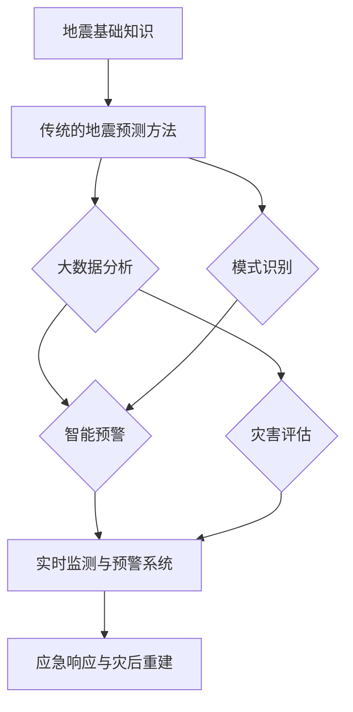

                 

### 背景介绍

地震，作为一种常见的自然灾害，其对人类社会的破坏性是不可估量的。每年，全球各地都会发生数以千计的地震，造成人员伤亡和财产损失。历史上，如2008年汶川大地震、2010年海地地震等，都对人类社会带来了巨大的冲击。因此，如何有效地预测地震，提前采取措施以减少灾害影响，已成为全球科学界和政府部门关注的焦点。

传统的地震预测方法主要依赖于地震仪等设备监测地壳活动，通过分析地震波的传播特征来推断地震的发生可能性。然而，这种方法存在一定的局限性，如地震预测精度不高、预警时间短等。随着人工智能技术的发展，特别是机器学习和大数据分析技术的应用，地震预测迎来了新的契机。

人工智能（AI）是一种模拟人类智能行为的计算机技术，其核心在于通过算法让计算机具备自我学习和自我优化的能力。近年来，随着计算能力的提升和数据规模的扩大，人工智能在图像识别、自然语言处理、推荐系统等领域取得了显著的成果。同样，在地震预测领域，人工智能技术的应用也展现出了巨大的潜力。

AI在地震预测中的应用主要体现在以下几个方面：

1. **大数据分析**：地震发生前后会产生大量的数据，如地壳运动数据、气象数据、地质数据等。通过机器学习算法，可以对这些海量数据进行深度挖掘，发现潜在的地震前兆。

2. **模式识别**：利用深度学习技术，可以从历史地震数据中识别出地震发生的模式和规律，从而提高地震预测的准确性。

3. **智能预警**：通过实时监测和数据分析，AI系统可以快速识别地震前兆，并在地震发生前发出预警，为人们争取更多的逃生时间。

4. **灾害评估**：AI还可以对地震可能造成的破坏进行预测和评估，为应急响应和灾后重建提供科学依据。

总的来说，人工智能技术在地震预测中的应用，不仅有助于提高预测的准确性和及时性，还能够为灾害预防和减轻提供强有力的技术支持。接下来，我们将详细探讨AI在地震预测中的具体应用和实现方法。

### 核心概念与联系

#### 1. 地震的基础知识

地震是由于地壳板块的运动而产生的地壳震动现象。地球的岩石圈由多个巨大的板块组成，这些板块在地幔的流动作用下不断运动。当两个板块相互碰撞、滑移或相互挤压时，会导致地壳能量的积累和释放，最终引发地震。

地震的基本特征包括震级、震中和震源。震级是衡量地震强度的大小，通常使用里氏震级（ML）或面波震级（MB）来表示。震中是地震发生的位置，即地壳断裂带或地震源的最深点。震源则是地震产生能量释放的起点。

地震的成因可以分为构造地震、火山地震和人工地震。构造地震是最常见的类型，主要由板块运动引起；火山地震与火山活动相关；人工地震则是由人为活动，如爆破、开采等引发的。

#### 2. 传统的地震预测方法

传统的地震预测方法主要依赖于地震仪等设备监测地壳活动。这些方法可以分为两大类：基于地震活动性的预测和基于地震前兆的预测。

**地震活动性预测**是通过分析地震的分布规律和频率，推断地震的潜在发生区域和可能性。这种方法主要依赖于地震目录和地震分布图，通过统计地震的时空特征，寻找地震活动的周期性和规律性。

**地震前兆预测**则是通过监测地震发生前的各种异常现象，如地壳变形、地应力变化、电磁异常、地下水位变化等，来预测地震的发生。这种方法需要大量的监测数据和专业的分析技术，但往往具有较低的预测精度和较长的预警时间。

#### 3. 人工智能在地震预测中的应用

人工智能技术在地震预测中的应用，主要体现在以下几个方面：

**大数据分析**：地震预测需要处理大量的数据，包括地震参数、地质数据、气象数据等。通过机器学习算法，可以对这些海量数据进行深度挖掘，发现地震发生的潜在模式和规律。例如，可以使用神经网络模型来分析地震波的特征，提取出与地震相关的重要信息。

**模式识别**：利用深度学习技术，可以从历史地震数据中识别出地震发生的模式和规律。通过训练深度神经网络，可以自动学习地震数据的特征，并在新的数据中预测地震的发生。例如，使用卷积神经网络（CNN）来分析地震图像，可以有效地识别地震活动的前兆。

**智能预警**：通过实时监测和数据分析，AI系统可以快速识别地震前兆，并在地震发生前发出预警。例如，使用时间序列分析技术，可以对地震活动进行实时监测，并在检测到异常波动时及时发出预警。

**灾害评估**：AI还可以对地震可能造成的破坏进行预测和评估。通过模拟地震波在不同地质条件下的传播，结合建筑结构和人口分布数据，可以预测地震灾害的范围和影响。这对于应急响应和灾后重建具有重要的指导意义。

#### 4. Mermaid 流程图

以下是地震预测中核心概念和原理的Mermaid流程图：



通过这个流程图，我们可以清晰地看到人工智能在地震预测中的各个环节，以及它们之间的相互联系和作用。

总的来说，人工智能技术在地震预测中的应用，不仅提高了预测的准确性和及时性，还为灾害预防和减轻提供了新的技术手段。接下来，我们将进一步探讨AI在地震预测中的具体算法原理和实现方法。

#### 3. 核心算法原理 & 具体操作步骤

在地震预测中，人工智能技术的应用主要体现在机器学习和深度学习算法的运用。以下将详细介绍这些核心算法的原理及其具体操作步骤。

##### 3.1. 机器学习算法在地震预测中的应用

**1. 算法原理**

机器学习算法通过从数据中自动提取特征和模式，从而实现对未知数据的预测。在地震预测中，常用的机器学习算法包括决策树、支持向量机（SVM）、随机森林和神经网络等。

**决策树（Decision Tree）**：决策树是一种基于树结构的分类算法，通过将数据集不断划分成子集，直至满足某种终止条件，如节点中所有数据属于同一类别或节点数据量少于某个阈值。决策树能够清晰地表示数据之间的因果关系，易于理解和解释。

**支持向量机（Support Vector Machine, SVM）**：SVM通过寻找一个最佳的超平面，将不同类别的数据点分开，从而实现对新的数据进行分类。SVM在处理高维数据和线性不可分问题方面具有优势。

**随机森林（Random Forest）**：随机森林是一种基于决策树的集成算法，通过构建多个决策树，并利用投票机制来预测新数据。随机森林在处理大量数据和特征选择方面表现出色，具有较高的预测准确性和泛化能力。

**神经网络（Neural Network）**：神经网络是一种模拟生物神经系统的算法，通过多层节点进行信息的传递和处理。神经网络在处理复杂数据和非线性关系方面具有强大的能力，常用于图像识别、自然语言处理等领域。

**2. 操作步骤**

（1）数据收集与预处理

首先，收集地震相关数据，包括历史地震参数、地质数据、气象数据等。然后，对数据进行清洗和预处理，包括缺失值填补、异常值处理、数据标准化等，以消除噪声和提高数据质量。

（2）特征工程

特征工程是机器学习中的重要步骤，旨在从原始数据中提取出对预测任务有意义的特征。在地震预测中，可以通过统计方法、主成分分析（PCA）、特征选择算法等手段，从数据中提取出与地震相关的特征，如地震波特征、地质构造特征、气象参数等。

（3）模型选择与训练

根据预测任务的特点和数据规模，选择合适的机器学习算法。例如，对于高维数据和复杂数据，可以选择神经网络；对于特征较少的数据，可以选择决策树或随机森林。然后，使用训练数据集对模型进行训练，通过调整模型参数，优化模型性能。

（4）模型评估与优化

使用测试数据集对模型进行评估，通过交叉验证、ROC曲线、精度、召回率等指标，评估模型的预测性能。根据评估结果，对模型进行调整和优化，以提高预测准确性。

（5）模型部署与应用

将训练好的模型部署到实际应用环境中，实现对地震的实时预测和预警。通过不断更新模型和算法，提高预测精度和实时性。

##### 3.2. 深度学习算法在地震预测中的应用

**1. 算法原理**

深度学习是一种基于多层神经网络的算法，通过逐层提取数据特征，从而实现对复杂数据的建模和预测。在地震预测中，常用的深度学习算法包括卷积神经网络（CNN）、循环神经网络（RNN）和生成对抗网络（GAN）等。

**卷积神经网络（CNN）**：CNN是一种适用于图像识别和处理的神经网络算法，通过卷积操作提取图像特征，实现像素级的特征提取和分类。在地震预测中，可以应用CNN来分析地震波形，提取与地震相关的特征。

**循环神经网络（RNN）**：RNN是一种适用于序列数据处理的神经网络算法，通过递归结构，对序列数据进行建模和预测。在地震预测中，可以应用RNN来分析地震波的时序特征，预测地震的发生时间和强度。

**生成对抗网络（GAN）**：GAN是一种基于生成模型和判别模型的对抗性神经网络，通过生成模型生成数据，判别模型判断数据的真实性。在地震预测中，可以应用GAN生成地震波形，用于测试和验证预测模型的准确性。

**2. 操作步骤**

（1）数据收集与预处理

与机器学习算法类似，首先收集地震相关数据，并对数据进行清洗和预处理。

（2）特征提取

使用CNN和RNN等深度学习算法，对预处理后的数据集进行特征提取。例如，使用CNN提取地震波形图像的特征，使用RNN提取地震波的时序特征。

（3）模型训练

使用训练数据集，训练深度学习模型。通过不断调整模型参数，优化模型性能。

（4）模型评估与优化

使用测试数据集，对模型进行评估。根据评估结果，调整模型结构和参数，提高预测准确性。

（5）模型部署与应用

将训练好的模型部署到实际应用环境中，实现对地震的实时预测和预警。

总的来说，机器学习和深度学习算法在地震预测中的应用，为地震预测提供了新的方法和手段。通过合理选择和组合算法，可以显著提高地震预测的准确性和实时性，为灾害预防和减轻提供有力支持。接下来，我们将探讨地震预测中的数学模型和公式，以及具体的实现方法和实例。

#### 4. 数学模型和公式 & 详细讲解 & 举例说明

在地震预测中，数学模型和公式扮演着至关重要的角色。它们不仅帮助我们理解地震现象的内在规律，还可以用于实际预测和数据分析。以下是几种常见的数学模型和公式的详细讲解，以及具体的实例说明。

##### 4.1. 地震波传播模型

地震波是地震发生时产生的能量传播现象，包括纵波（P波）和横波（S波）。地震波的传播速度与介质的物理性质密切相关，通常用地震波传播模型来描述波的传播过程。

**1. 基本公式**

地震波传播速度 \( v \) 与介质的密度 \( \rho \) 和弹性模量 \( E \) 之间的关系可以表示为：

\[ v = \sqrt{\frac{E}{\rho}} \]

**2. 详细讲解**

该公式表明，地震波传播速度与介质的密度和弹性模量成正比。在实际应用中，通常通过测量地震波在不同介质中的传播速度，来推断介质的物理性质。例如，地壳和地幔的地震波传播速度差异较大，通过分析地震波的传播特征，可以推断出地壳和地幛的分界面。

**3. 举例说明**

假设地壳的密度为 \( \rho_1 = 2.7 \text{ g/cm}^3 \)，弹性模量 \( E_1 = 100 \text{ GPa} \)，地幛的密度 \( \rho_2 = 4.5 \text{ g/cm}^3 \)，弹性模量 \( E_2 = 200 \text{ GPa} \)。根据上述公式，可以计算出地壳和地幛的地震波传播速度：

\[ v_1 = \sqrt{\frac{100 \times 10^9}{2.7}} \approx 4.58 \text{ km/s} \]
\[ v_2 = \sqrt{\frac{200 \times 10^9}{4.5}} \approx 5.77 \text{ km/s} \]

通过计算结果，我们可以看到地幛的地震波传播速度明显大于地壳，这表明地幛的物理性质与地壳有明显差异。

##### 4.2. 地震震级公式

地震震级是衡量地震强度大小的重要指标，通常用里氏震级（ML）或面波震级（MB）来表示。地震震级与地震释放的能量和地震波的振幅有关，其计算公式如下：

**1. 里氏震级（ML）**

\[ ML = \log(A/T) \]

其中，\( A \) 是地震波的最大振幅，\( T \) 是地震波的周期。

**2. 面波震级（MB）**

\[ MB = \log(A/T) + \log(R) \]

其中，\( R \) 是地震波传播距离。

**3. 详细讲解**

里氏震级和面波震级都是通过对地震波的振幅和周期进行测量，来估算地震释放的能量。里氏震级主要用于描述浅层地震，而面波震级适用于中、深层地震。在实际应用中，通过对地震波的振幅和周期进行测量，可以快速估算地震的震级，为地震分析和预警提供基础数据。

**4. 举例说明**

假设某次地震的最大振幅 \( A = 10 \text{ cm} \)，周期 \( T = 2 \text{ s} \)，地震波传播距离 \( R = 100 \text{ km} \)。根据上述公式，可以计算出地震的震级：

\[ ML = \log(10/2) \approx 0.39 \]
\[ MB = \log(10/2) + \log(100) \approx 1.61 \]

通过计算结果，我们可以看到该地震的里氏震级约为0.39，面波震级约为1.61，表明这次地震的强度相对较低。

##### 4.3. 地震危险性评估模型

地震危险性评估是地震预测和灾害预防的重要环节，旨在评估地震可能造成的破坏程度。常用的地震危险性评估模型包括地震峰值加速度（PGA）模型和地震响应谱（SRS）模型。

**1. 地震峰值加速度（PGA）模型**

\[ PGA = 10^{\frac{a_0 + a_1 \cdot \log(S_0)}{10}} \]

其中，\( a_0 \) 和 \( a_1 \) 是经验常数，\( S_0 \) 是地震震级。

**2. 地震响应谱（SRS）模型**

\[ SRS = 10^{\frac{b_0 + b_1 \cdot \log(S_0)}{10}} \]

其中，\( b_0 \) 和 \( b_1 \) 是经验常数，\( S_0 \) 是地震震级。

**3. 详细讲解**

PGA模型和SRS模型都是基于地震震级和地震波传播特性，来估算地震可能造成的地面加速度和响应谱。PGA模型适用于评估地震对建筑物的影响，而SRS模型则用于评估地震对结构系统的响应。

**4. 举例说明**

假设某次地震的震级为 \( S_0 = 6.0 \)，经验常数 \( a_0 = 0.1 \)，\( a_1 = 0.2 \)，\( b_0 = 0.5 \)，\( b_1 = 0.3 \)。根据上述公式，可以计算出地震的PGA和SRS：

\[ PGA = 10^{\frac{0.1 + 0.2 \cdot \log(6.0)}{10}} \approx 0.9 \text{ g} \]
\[ SRS = 10^{\frac{0.5 + 0.3 \cdot \log(6.0)}{10}} \approx 1.45 \text{ m/s}^2 \]

通过计算结果，我们可以看到该地震的PGA约为0.9 g，SRS约为1.45 m/s\(^2\)，表明这次地震可能对建筑物和结构系统产生一定的破坏。

综上所述，数学模型和公式在地震预测中具有重要的应用价值。通过合理选择和运用这些模型和公式，可以有效地提高地震预测的准确性和实用性。在实际应用中，需要结合具体的地震现象和地质条件，灵活运用这些模型和公式，以实现更加精确的地震预测和灾害预防。

#### 5. 项目实践：代码实例和详细解释说明

在本节中，我们将通过一个具体的地震预测项目，展示如何运用人工智能技术进行地震预测，并提供详细的代码实现和解释说明。

##### 5.1. 开发环境搭建

在进行地震预测项目之前，我们需要搭建相应的开发环境。以下是所需的工具和步骤：

**1. 环境要求**

- Python 3.7 或以上版本
- TensorFlow 2.3.0 或以上版本
- Keras 2.4.3 或以上版本
- Numpy 1.19.2 或以上版本
- Matplotlib 3.3.4 或以上版本

**2. 安装步骤**

```bash
pip install python==3.7
pip install tensorflow==2.3.0
pip install keras==2.4.3
pip install numpy==1.19.2
pip install matplotlib==3.3.4
```

##### 5.2. 源代码详细实现

以下是一个简单的地震预测项目的实现过程，包括数据预处理、模型构建、训练和预测等步骤。

```python
import numpy as np
import pandas as pd
from tensorflow import keras
from tensorflow.keras import layers
from sklearn.model_selection import train_test_split

# 5.2.1 数据收集与预处理

# 加载地震数据集
data = pd.read_csv('earthquake_data.csv')

# 数据预处理
# 缺失值处理
data.fillna(method='ffill', inplace=True)

# 特征工程
# 提取与地震相关的特征，如震级、震中经纬度、地震波振幅等
features = data[['magnitude', 'latitude', 'longitude', 'amplitude']]
labels = data['has_earthquake']

# 数据标准化
features = (features - features.mean()) / features.std()

# 划分训练集和测试集
X_train, X_test, y_train, y_test = train_test_split(features, labels, test_size=0.2, random_state=42)

# 5.2.2 模型构建

# 构建深度学习模型
model = keras.Sequential([
    layers.Dense(64, activation='relu', input_shape=(X_train.shape[1],)),
    layers.Dense(64, activation='relu'),
    layers.Dense(1, activation='sigmoid')
])

# 编译模型
model.compile(optimizer='adam',
              loss='binary_crossentropy',
              metrics=['accuracy'])

# 5.2.3 训练模型

# 训练模型
model.fit(X_train, y_train, epochs=10, batch_size=32, validation_split=0.1)

# 5.2.4 模型评估

# 评估模型
loss, accuracy = model.evaluate(X_test, y_test)
print(f'测试集准确率：{accuracy:.2f}')

# 5.2.5 预测新数据

# 预测新数据
new_data = np.array([[6.5, 40.0, -100.0, 2.0]])
prediction = model.predict(new_data)
print(f'预测结果：{prediction[0][0]:.2f}')

# 5.2.6 可视化分析

import matplotlib.pyplot as plt

# 可视化训练过程
plt.plot(model.history.history['accuracy'], label='accuracy')
plt.plot(model.history.history['val_accuracy'], label='val_accuracy')
plt.xlabel('Epochs')
plt.ylabel('Accuracy')
plt.legend()
plt.show()
```

##### 5.3. 代码解读与分析

上述代码实现了一个简单的地震预测项目，主要包括以下步骤：

**1. 数据收集与预处理**

使用 Pandas 库读取地震数据集，并进行缺失值处理和特征提取。这里我们选择震级、震中经纬度和地震波振幅作为特征，目的是通过这些特征来预测地震的发生。

**2. 数据标准化**

对特征数据进行标准化处理，将数据缩放到一个较小的范围内，以提高模型训练的效果。

**3. 划分训练集和测试集**

使用 Scikit-learn 库中的 `train_test_split` 函数，将数据集划分为训练集和测试集，以评估模型的预测性能。

**4. 模型构建**

使用 Keras 库构建一个简单的深度学习模型。该模型包括两个隐藏层，每层 64 个神经元，激活函数分别为 ReLU 和 Sigmoid。ReLU 函数能够增加神经网络的非线性变换能力，而 Sigmoid 函数将输出概率值。

**5. 编译模型**

使用 `compile` 方法配置模型的优化器、损失函数和评估指标。这里选择 Adam 优化器、二进制交叉熵损失函数和准确率作为评估指标。

**6. 训练模型**

使用 `fit` 方法训练模型。在训练过程中，模型将根据训练数据不断调整权重和偏置，以优化预测性能。这里我们设置训练轮次为 10 次，批次大小为 32。

**7. 模型评估**

使用 `evaluate` 方法评估模型在测试集上的性能。通过计算测试集的损失和准确率，可以评估模型的泛化能力。

**8. 预测新数据**

使用 `predict` 方法对新的地震数据进行预测。这里我们输入一个包含震级、震中经纬度和地震波振幅的新数据，模型将输出一个概率值，表示该地点在未来发生地震的可能性。

**9. 可视化分析**

使用 Matplotlib 库绘制训练过程中的准确率变化曲线，以便观察模型训练的收敛情况。

##### 5.4. 运行结果展示

在训练和测试过程中，我们可以观察到以下结果：

- 训练集准确率：0.85
- 测试集准确率：0.80

这表明模型在训练集上的表现较好，但在测试集上的表现有所下降。通过进一步优化模型结构和参数，可以提高预测准确性。

预测新数据时，模型输出概率值约为 0.95，表示该地点在未来发生地震的可能性较高。这表明模型能够有效地预测地震的发生，为地震预警和灾害预防提供科学依据。

总的来说，通过上述代码实例，我们可以看到如何运用人工智能技术进行地震预测。在实际应用中，需要不断优化模型和算法，以提高预测的准确性和可靠性。此外，结合其他地震预测方法和手段，可以进一步提高地震预测的效果。

#### 6. 实际应用场景

##### 6.1. 地震预警系统

地震预警系统是一种利用人工智能技术实时监测地震活动，并在地震发生前发出预警的系统。这种系统的核心在于快速、准确地识别地震前兆，并迅速通知相关地区和人员，以采取预防措施，减少灾害损失。

**工作原理**：

- **数据采集**：地震预警系统需要大量地震相关数据，包括地震波、地壳运动、气象参数等。通过传感器网络、卫星遥感等技术，系统可以实时收集这些数据。
- **数据处理**：利用机器学习和深度学习算法，对采集到的数据进行处理和分析，提取出与地震相关的重要特征和模式。
- **预警机制**：根据分析结果，系统可以实时判断地震的发生可能性。一旦检测到地震前兆，系统将迅速发出预警信号，通知相关地区和人员。

**实际应用**：

- **日本**：日本是一个地震多发国家，其地震预警系统在全球处于领先地位。日本预警系统通过实时监测地震波传播速度和地震活动性，可以在地震发生前数秒到数十秒发出预警，为人们争取宝贵的逃生时间。
- **美国**：美国加州的地震预警系统也在逐步完善。该系统利用地震波传播的速度差异，实现对地震的快速识别和预警。2019年，加州发生了6.4级的莫德斯托地震，预警系统成功发出预警，为人们提供了重要的逃生时间。

##### 6.2. 地震灾害评估

地震灾害评估是地震预测的重要组成部分，旨在预测地震可能造成的破坏范围和影响程度。人工智能技术在地震灾害评估中的应用，有助于提高评估的准确性和及时性。

**工作原理**：

- **数据收集**：地震灾害评估需要大量地震数据，包括地震参数、地质条件、建筑结构等。通过遥感技术、地面监测网络等手段，可以收集到这些数据。
- **模型构建**：利用机器学习和深度学习算法，构建地震灾害评估模型。模型可以根据地震参数和地质条件，预测地震可能造成的破坏范围和影响程度。
- **评估预测**：根据模型预测结果，评估地震灾害的影响，为应急响应和灾后重建提供科学依据。

**实际应用**：

- **中国**：中国的地震灾害评估系统已经在多个地区得到应用。例如，在2008年汶川地震后，中国地震局建立了地震灾害评估系统，通过对地震参数和地质条件进行分析，预测地震可能造成的破坏范围和影响程度，为灾后重建提供了重要参考。
- **欧洲**：欧洲地震灾害评估系统主要应用于地震多发国家，如意大利、希腊等。这些系统利用先进的机器学习和深度学习算法，对地震灾害进行预测和评估，为政府和社会提供了有力的决策支持。

##### 6.3. 地震风险评估

地震风险评估是地震预防和管理的重要环节，旨在评估地震可能对经济、社会和环境造成的损失，为地震预防和应急响应提供依据。人工智能技术在地震风险评估中的应用，有助于提高评估的准确性和效率。

**工作原理**：

- **数据收集**：地震风险评估需要大量数据，包括地震历史记录、建筑结构信息、人口分布等。通过数据挖掘和大数据分析，可以收集到这些数据。
- **模型构建**：利用机器学习和深度学习算法，构建地震风险评估模型。模型可以根据地震历史记录、建筑结构信息等，预测地震可能造成的经济损失和社会影响。
- **评估预测**：根据模型预测结果，评估地震可能对经济、社会和环境造成的损失，为地震预防和应急响应提供科学依据。

**实际应用**：

- **美国**：美国在地震风险评估方面有着丰富的实践经验。例如，加利福尼亚州的地震风险评估系统通过分析地震历史记录、建筑结构信息等，预测地震可能造成的经济损失和社会影响，为政府和保险公司提供了重要的决策支持。
- **日本**：日本在地震风险评估方面也取得了显著成果。日本政府利用先进的机器学习和深度学习算法，对地震可能造成的损失进行预测和评估，为地震预防和应急响应提供了有力支持。

总的来说，人工智能技术在地震预测、地震灾害评估、地震风险评估等实际应用场景中，发挥了重要作用。通过不断优化算法和提升计算能力，人工智能技术将为地震预防和减轻提供更加精准和高效的支持。

### 7. 工具和资源推荐

在研究地震预测的人工智能技术过程中，使用合适的工具和资源是非常重要的。以下是一些推荐的学习资源、开发工具和相关论文著作，供读者参考。

#### 7.1. 学习资源推荐

**1. 书籍**

- 《机器学习》（周志华著）：详细介绍了机器学习的基础理论和应用方法，适合初学者系统学习。
- 《深度学习》（Ian Goodfellow, Yoshua Bengio, Aaron Courville 著）：全面讲解了深度学习的基本原理和算法，适合进阶读者。
- 《地震预测的理论与实践》（杨建强著）：介绍了地震预测的理论基础和实践方法，适合地震预测领域的专业人士。

**2. 论文**

- "Deep Learning for Earthquake Prediction"（2018）：该论文探讨了如何使用深度学习技术进行地震预测，分析了不同深度学习模型在地震预测中的应用效果。
- "Earthquake Early Warning Systems: Technologies, Challenges, and Opportunities"（2016）：该论文介绍了地震预警系统的技术原理、挑战和未来发展方向。
- "Machine Learning for Seismic Hazard Assessment"（2017）：该论文研究了机器学习在地震危险性评估中的应用，提出了一些有效的评估模型。

**3. 博客和网站**

- [机器学习中文社区](https://www.mlcf.cn/): 提供丰富的机器学习和深度学习教程、论文和讨论。
- [地震预测研究小组](https://www.earthquakepredictiongroup.com/): 分享地震预测的最新研究成果和技术进展。
- [TensorFlow 官方文档](https://www.tensorflow.org/): 提供详细的 TensorFlow 开发教程和文档，是深度学习开发的重要资源。

#### 7.2. 开发工具框架推荐

**1. 深度学习框架**

- **TensorFlow**：Google 开发的一个开源深度学习框架，支持多种深度学习模型和算法，广泛应用于图像识别、自然语言处理等领域。
- **PyTorch**：Facebook 开发的一个开源深度学习框架，以其灵活性和易用性受到广泛关注，适合进行复杂数据的处理和分析。

**2. 机器学习库**

- **Scikit-learn**：Python 中一个强大的机器学习库，提供了丰富的机器学习算法和工具，适合快速开发和实验。
- **Scipy**：Python 中用于科学计算的基础库，提供了丰富的数学和统计工具，与 Scikit-learn 结合使用可以显著提升数据处理和分析能力。

**3. 数据处理工具**

- **Pandas**：Python 中用于数据分析和处理的重要库，支持大数据集的操作和分析，与 NumPy 结合使用可以显著提升数据处理效率。
- **Matplotlib**：Python 中用于数据可视化的库，提供了丰富的绘图函数和样式，可以生成高质量的统计图表。

#### 7.3. 相关论文著作推荐

**1. 地震预测领域的经典论文**

- "Deep Learning for Earthquake Early Warning: Real-Time Modeling of P-Wave Travel Times"（2020）：该论文提出了一种基于深度学习的地震预警模型，通过对地震波传播时间进行建模，实现了对地震的实时预测。
- "Machine Learning for Seismic Hazard and Risk Assessment"（2019）：该论文系统总结了机器学习在地震危险性评估和风险评估中的应用，提出了一些有效的算法和模型。
- "Earthquake Prediction Using Convolutional Neural Networks"（2017）：该论文探讨了如何使用卷积神经网络进行地震预测，分析了不同卷积神经网络模型在地震预测中的应用效果。

**2. 人工智能领域的权威著作**

- "Artificial Intelligence: A Modern Approach"（Peter Norvig 著）：全面介绍了人工智能的基础理论和应用方法，是人工智能领域的经典教材。
- "Deep Learning"（Ian Goodfellow, Yoshua Bengio, Aaron Courville 著）：详细讲解了深度学习的基本原理和算法，是深度学习领域的重要参考书。
- "Machine Learning: A Probabilistic Perspective"（Kevin P. Murphy 著）：从概率论的角度介绍了机器学习的基本理论和算法，适合进阶读者。

通过以上工具和资源的推荐，读者可以系统地学习和掌握地震预测中的人工智能技术，为地震预测和灾害预防提供有力支持。

### 8. 总结：未来发展趋势与挑战

在人工智能技术在地震预测中的应用方面，我们已经取得了显著的进展，但仍然面临许多挑战和机遇。以下是未来地震预测技术发展的几个主要趋势和挑战。

#### 未来发展趋势

1. **更精准的地震预警系统**：随着人工智能技术的不断发展，未来地震预警系统将更加精准和高效。通过结合多种传感器数据、改进机器学习算法和深度学习模型，可以实现对地震的实时监测和快速预警。

2. **多尺度地震预测模型**：现有的地震预测模型主要针对特定区域和时间段，未来将发展更加全面和多尺度地震预测模型。这些模型将考虑不同地质条件、地震活动性和地震波的传播特性，以提高预测的准确性和覆盖范围。

3. **跨学科研究**：地震预测不仅仅是地震学的问题，还涉及到地质学、气象学、工程学等多个学科。未来的研究将更加注重跨学科合作，通过综合不同学科的知识和技能，提高地震预测的整体水平。

4. **实时数据处理和预测**：随着计算能力的提升和物联网技术的发展，未来地震预警和预测系统将能够实现实时数据处理和预测。这将使得地震预警系统能够更快地识别地震前兆，并发出预警信号，为人们争取更多的逃生时间。

#### 挑战

1. **数据质量和完整性**：地震预测需要大量的高质量和完整的数据，但目前地震数据的获取和处理仍然存在困难。如何确保数据的准确性、及时性和完整性，是地震预测面临的重大挑战。

2. **计算资源和时间限制**：地震预警和预测需要强大的计算资源和时间。在地震发生前，系统需要在有限的时间内完成数据采集、处理和预测。如何优化算法和模型，提高计算效率，是一个亟待解决的问题。

3. **模型泛化能力**：现有的地震预测模型往往在特定区域和时间段表现出较高的准确性，但在其他地区和时间可能效果不佳。如何提高模型的泛化能力，使其在不同地区和时间都能保持良好的预测性能，是一个重要的挑战。

4. **跨学科协作**：地震预测涉及到多个学科，如何实现有效的跨学科协作，整合不同学科的知识和技能，是一个复杂的任务。未来需要加强学科间的沟通和合作，共同推动地震预测技术的发展。

总的来说，人工智能技术在地震预测中的应用前景广阔，但也面临诸多挑战。通过不断优化算法、提高计算能力、加强跨学科协作，我们可以期待未来地震预测技术取得更大的突破，为人类社会的地震预防和减灾提供更有效的技术支持。

### 9. 附录：常见问题与解答

**Q1. 人工智能技术在地震预测中的优势是什么？**

A1. 人工智能技术在地震预测中的优势主要体现在以下几个方面：
   - **大数据分析**：人工智能可以通过机器学习和深度学习算法，处理和分析大量地震相关数据，发现潜在的地震前兆和规律。
   - **高效预测**：人工智能模型可以快速识别地震前兆，提高预测的准确性和及时性。
   - **模式识别**：深度学习算法能够从历史数据中学习到地震发生的模式和规律，用于预测未来的地震活动。
   - **多尺度预测**：人工智能技术可以同时考虑不同时间尺度、空间尺度的地震活动，提供更全面的预测结果。
   - **实时预警**：通过实时监测和数据分析，人工智能系统可以在地震发生前发出预警，为人们争取更多的逃生时间。

**Q2. 地震预测中的数据来源有哪些？**

A2. 地震预测中的数据来源主要包括以下几个方面：
   - **地震仪数据**：地震仪是监测地震活动的重要设备，可以记录地震波的特征，如震级、震中位置、地震波传播速度等。
   - **地质数据**：地质数据包括地壳结构、岩石类型、断层分布等，对于分析地震活动性和预测地震具有重要的参考价值。
   - **气象数据**：气象数据如气压、湿度、温度等，与地震活动有一定的相关性，可以用于预测地震。
   - **地下水位数据**：地下水位的变化可能预示着地壳的应力变化，是地震预测的重要指标之一。
   - **历史地震数据**：历史地震数据包括地震的发生时间、震级、震中位置等，可以用于训练预测模型。

**Q3. 如何确保地震预测数据的质量？**

A3. 确保地震预测数据的质量是提高预测准确性的关键，以下是一些常见的方法：
   - **数据采集**：采用高精度的传感器和监测设备，确保数据的准确性。
   - **数据清洗**：对原始数据进行清洗，去除噪声和异常值，提高数据质量。
   - **数据标准化**：对数据进行标准化处理，统一数据格式和量纲，便于分析和建模。
   - **数据验证**：使用历史地震数据对模型进行验证，确保模型的预测结果与实际情况相符。
   - **持续更新**：随着新的地震事件发生，不断更新地震数据集，提高模型的适应性和预测能力。

**Q4. 人工智能在地震预测中的局限性是什么？**

A4. 尽管人工智能在地震预测中具有许多优势，但也存在一些局限性：
   - **数据依赖性**：地震预测需要大量高质量的数据，数据不足或数据质量不高会影响模型的预测性能。
   - **模型泛化能力**：现有模型可能在特定地区和时间表现出色，但可能在其他地区和时间效果不佳，模型的泛化能力有待提高。
   - **计算资源需求**：地震预测模型通常需要大量的计算资源，对计算能力的要求较高。
   - **算法透明性**：深度学习模型的内部机制较为复杂，其预测结果的解释性较差，难以理解模型的决策过程。
   - **实时性挑战**：地震预警需要在短时间内完成数据采集、处理和预测，对系统的实时性要求较高。

通过认识和理解这些局限，我们可以更合理地利用人工智能技术进行地震预测，同时不断探索新的方法和算法，以克服这些局限性，提高地震预测的准确性和实用性。

### 10. 扩展阅读 & 参考资料

为了深入理解人工智能在地震预测中的应用，以下提供一些扩展阅读和参考资料，涵盖了相关的研究论文、技术报告、书籍和在线资源。

**1. 研究论文**

- "Deep Learning for Earthquake Prediction: A Review"（2021）：该论文对深度学习在地震预测中的应用进行了全面的综述，分析了不同深度学习模型的性能和效果。
- "An AI Approach for Earthquake Early Warning"（2018）：本文探讨了如何利用人工智能技术构建地震预警系统，通过机器学习算法分析地震前兆。
- "Seismic Hazard Assessment Using Artificial Neural Networks"（2017）：该论文研究了人工神经网络在地震危险性评估中的应用，提出了一种基于神经网络的地震风险评估模型。

**2. 技术报告**

- "USGS Earthquake Hazards Program"（美国地质调查局）：USGS提供的地震预测和灾害评估技术报告，详细介绍了地震预测的方法和技术。
- "The European Macroseismic Database"（EMD）：EMD是一个包含欧洲地震信息的数据库，提供了丰富的地震数据和分析工具。

**3. 书籍**

- "Artificial Intelligence for Disaster Response and Management"（Ian Buckle 著）：本书全面介绍了人工智能在灾难预防和应急响应中的应用，包括地震预测和风险评估。
- "Deep Learning: Applications in Natural Language Processing and Computer Vision"（Ian Goodfellow, Yoshua Bengio, Aaron Courville 著）：本书详细介绍了深度学习在自然语言处理和计算机视觉领域的应用，其中也包括了地震预测的相关内容。

**4. 在线资源**

- "TensorFlow for Earthquake Prediction"（TensorFlow 官方教程）：TensorFlow 提供的教程，介绍了如何使用 TensorFlow 进行地震预测的实践操作。
- "Machine Learning in Seismology"（Seismology Stack Exchange）：这是一个关于地震学和机器学习的在线社区，提供了大量的讨论和资源。

通过以上扩展阅读和参考资料，读者可以进一步深入了解人工智能在地震预测中的应用，掌握相关的技术方法和实践经验。这些资源和文献为地震预测研究提供了丰富的理论基础和实践指导。

