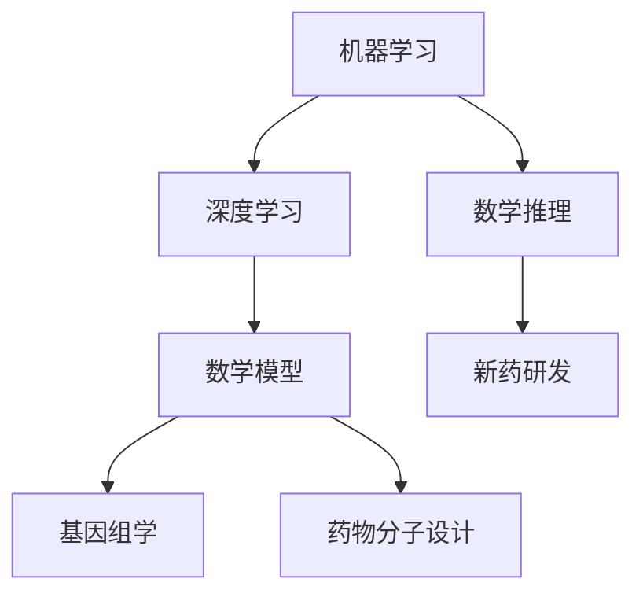

                 

### 背景介绍

在当今科技飞速发展的时代，人工智能（AI）的应用已经渗透到了各个领域，从日常生活到科学研究，人工智能正逐渐改变着我们的世界。特别是在数学推理和新药研发领域，人工智能的引入带来了前所未有的机遇和变革。

数学推理作为一种逻辑严密、系统化的问题解决方法，一直是科学研究和工程实践中不可或缺的技能。然而，面对复杂的数学问题，传统的数学方法往往需要大量的时间和计算资源，这使得很多研究任务变得艰难。而人工智能，特别是机器学习和深度学习技术的发展，为数学推理提供了新的工具和方法。

新药研发是一个长期、复杂且耗资巨大的过程。从药物分子的设计、筛选到临床试验，每个环节都需要大量的数学模型和计算。然而，传统的药物研发方法常常受到数据不足、模型复杂度高等问题的限制。人工智能的应用，特别是通过机器学习算法处理海量数据、自动优化分子结构，为药物研发带来了新的希望。

本文旨在探讨人工智能在数学推理和新药研发中的应用，通过逐步分析推理的方式，深入探讨其核心概念、算法原理、数学模型以及实际应用场景。希望本文能为您提供一个全面、系统的了解，并激发您对这个领域的兴趣和探索。

### 核心概念与联系

要探讨人工智能在数学推理和新药研发中的应用，我们首先需要明确几个核心概念，并理解它们之间的联系。以下是本文中将涉及的主要核心概念：

1. **机器学习**：一种人工智能的分支，通过从数据中学习规律和模式，使计算机能够自动进行预测和决策。
2. **深度学习**：一种基于多层神经网络的结构，能够自动提取和处理复杂数据的特征。
3. **数学模型**：用于描述自然现象或工程问题的数学方程和公式。
4. **基因组学**：研究DNA序列和基因表达模式的科学，为新药研发提供了关键的数据资源。
5. **药物分子设计**：通过计算和实验方法，设计具有特定生物活性的药物分子。

下面，我们将通过Mermaid流程图来展示这些核心概念之间的联系。



#### 机器学习与深度学习

机器学习是人工智能的核心技术之一，它使计算机能够从数据中自动学习规律和模式。深度学习作为机器学习的一种重要形式，通过多层神经网络结构，能够自动提取和处理复杂数据的特征。深度学习在图像识别、语音识别和自然语言处理等领域取得了显著成果，这也为它在数学推理和新药研发中的应用提供了基础。

#### 数学模型

数学模型是描述自然现象或工程问题的数学方程和公式。在数学推理中，数学模型帮助研究人员分析和解决复杂问题。在新药研发中，数学模型用于预测药物分子与生物靶标的相互作用，指导药物分子的设计和优化。

#### 基因组学

基因组学是研究DNA序列和基因表达模式的科学。在新药研发中，基因组学提供了关键的数据资源，帮助研究人员了解疾病机制和药物作用靶点。通过基因组数据，人工智能可以识别出潜在的药物靶标，为新药研发提供方向。

#### 药物分子设计

药物分子设计是一个复杂的过程，涉及计算和实验方法。通过人工智能，特别是机器学习和深度学习算法，研究人员可以自动化地筛选和优化药物分子结构，提高新药研发的效率。

#### 机器学习与数学推理

在数学推理中，机器学习算法可以帮助研究人员发现数据中的潜在规律和模式。例如，通过分析大量的数学问题，机器学习算法可以识别出通用的解题方法，从而简化复杂的数学问题。

#### 数学推理与新药研发

数学推理在新药研发中发挥着关键作用，它帮助研究人员预测药物分子的生物活性和副作用。通过数学模型，研究人员可以模拟药物在人体内的作用过程，优化药物分子设计，提高新药研发的成功率。

通过上述核心概念及其相互关系的介绍，我们为后续章节的详细讨论奠定了基础。在接下来的内容中，我们将深入探讨这些概念的具体实现和应用。

### 核心算法原理 & 具体操作步骤

在了解核心概念及其联系之后，我们将深入探讨人工智能在数学推理和新药研发中的具体算法原理和操作步骤。

#### 机器学习算法

机器学习算法是人工智能在数学推理和新药研发中的核心工具。以下是几种常见的机器学习算法及其基本原理：

1. **线性回归**：线性回归是一种用于预测连续值的算法。通过拟合数据中的线性关系，线性回归可以预测未知数据的值。其基本原理是最小二乘法，即通过最小化预测值与实际值之间的误差平方和来找到最佳拟合线。

2. **支持向量机（SVM）**：支持向量机是一种用于分类的算法。它通过找到最佳超平面，将不同类别的数据分开。SVM的基本原理是最大化分类边界上的支持向量，这些向量对于分类决策至关重要。

3. **决策树**：决策树是一种基于特征划分数据的算法。它通过递归地将数据集划分成子集，直到满足某些停止条件（如节点内的数据完全相同）。每个内部节点代表一个特征，每个叶节点代表一个类别。

4. **神经网络**：神经网络是一种基于多层感知器（MLP）的算法。它通过模拟人脑的神经元网络，自动学习和提取数据特征。神经网络的基本原理是前向传播和反向传播，其中前向传播用于计算输出，反向传播用于更新网络权重。

#### 深度学习算法

深度学习算法是机器学习的一种扩展，特别适用于处理复杂数据。以下是几种常见的深度学习算法及其基本原理：

1. **卷积神经网络（CNN）**：卷积神经网络是一种用于图像识别和处理的算法。它通过卷积操作提取图像特征，并使用池化层减少数据维度。CNN的基本原理是多层卷积和池化，其中卷积层用于特征提取，池化层用于特征降维。

2. **循环神经网络（RNN）**：循环神经网络是一种用于序列数据处理和预测的算法。它通过记忆历史信息，对序列数据中的每个元素进行建模。RNN的基本原理是时间步循环，其中每个时间步的输出会影响到下一个时间步。

3. **长短期记忆网络（LSTM）**：长短期记忆网络是一种改进的循环神经网络，用于解决长序列依赖问题。它通过引入门控机制，控制信息的流入和流出，从而有效记忆长期依赖关系。

4. **生成对抗网络（GAN）**：生成对抗网络是一种用于生成新数据的算法。它由两个神经网络（生成器和判别器）组成，生成器尝试生成与真实数据相似的数据，判别器则尝试区分真实数据和生成数据。GAN的基本原理是零和博弈，其中生成器和判别器相互对抗。

#### 数学模型与公式

在数学推理和新药研发中，数学模型和公式起着关键作用。以下是几种常用的数学模型及其公式：

1. **回归模型**：回归模型用于预测连续值，其基本公式为：
   $$
   y = \beta_0 + \beta_1x_1 + \beta_2x_2 + \cdots + \beta_nx_n
   $$
   其中，$y$ 是预测值，$x_1, x_2, \ldots, x_n$ 是输入特征，$\beta_0, \beta_1, \beta_2, \ldots, \beta_n$ 是模型参数。

2. **支持向量机**：支持向量机的公式为：
   $$
   w \cdot x + b = 0
   $$
   其中，$w$ 是权重向量，$x$ 是特征向量，$b$ 是偏置项。

3. **决策树**：决策树的公式为：
   $$
   y = g(x)
   $$
   其中，$y$ 是预测值，$x$ 是输入特征，$g(x)$ 是决策函数。

4. **神经网络**：神经网络的基本公式为：
   $$
   a_{\text{next}} = \sigma(\text{W} \cdot a_{\text{current}} + b)
   $$
   其中，$a_{\text{next}}$ 是下一个神经元的激活值，$\sigma$ 是激活函数，$\text{W}$ 是权重矩阵，$a_{\text{current}}$ 是当前神经元的激活值，$b$ 是偏置向量。

5. **卷积神经网络**：卷积神经网络的公式为：
   $$
   \text{conv}(x) = \text{relu}(\text{W} \cdot x + b)
   $$
   其中，$\text{conv}(x)$ 是卷积操作，$\text{relu}$ 是ReLU激活函数，$\text{W}$ 是卷积权重，$x$ 是输入特征。

6. **循环神经网络**：循环神经网络的公式为：
   $$
   h_t = \sigma(\text{W}_h \cdot [h_{t-1}, x_t] + b_h)
   $$
   其中，$h_t$ 是时间步$t$的隐藏状态，$\text{W}_h$ 是权重矩阵，$x_t$ 是时间步$t$的输入，$b_h$ 是偏置向量。

7. **生成对抗网络**：生成对抗网络的公式为：
   $$
   \text{GAN} : \text{D}(\text{G}(\text{z}); \text{x}) < \text{D}(\text{x})
   $$
   其中，$\text{G}$ 是生成器，$\text{D}$ 是判别器，$z$ 是随机噪声，$\text{x}$ 是真实数据。

通过上述核心算法原理和具体操作步骤的介绍，我们可以看到，人工智能在数学推理和新药研发中的应用不仅是理论上的，更是实践中的。在接下来的章节中，我们将通过项目实践进一步探讨这些算法的实际应用。

### 数学模型和公式 & 详细讲解 & 举例说明

在数学推理和新药研发中，数学模型和公式起着至关重要的作用。它们不仅帮助我们理解和分析复杂问题，还能提供定量预测和优化方法。在这一节中，我们将详细讲解几个关键数学模型和公式，并通过实际例子来说明它们的用法和重要性。

#### 线性回归模型

线性回归模型是一种用于预测连续值的简单且广泛应用的数学模型。其核心思想是通过拟合数据中的线性关系来预测未知数据。

**公式：**
$$
y = \beta_0 + \beta_1x_1 + \beta_2x_2 + \cdots + \beta_nx_n
$$

其中，$y$ 是预测值，$x_1, x_2, \ldots, x_n$ 是输入特征，$\beta_0, \beta_1, \beta_2, \ldots, \beta_n$ 是模型参数。

**例子：** 假设我们想要预测一家公司的股票价格。我们可以使用过去一段时间内的股票价格和交易量作为输入特征。通过线性回归模型，我们可以找到最佳拟合线，从而预测未来股票价格。

**应用：** 线性回归模型广泛应用于金融预测、市场分析和需求预测等领域。

#### 支持向量机（SVM）

支持向量机是一种强大的分类算法，适用于处理高维数据。其核心思想是通过找到一个最佳的超平面，将不同类别的数据分开。

**公式：**
$$
w \cdot x + b = 0
$$

其中，$w$ 是权重向量，$x$ 是特征向量，$b$ 是偏置项。

**例子：** 假设我们要分类一组病人，其中一些是癌症患者，另一些是健康人。我们可以使用病人的各种生理指标作为特征向量。通过SVM算法，我们可以找到最佳超平面，从而准确分类病人。

**应用：** SVM广泛应用于图像识别、文本分类和生物信息学等领域。

#### 决策树

决策树是一种通过递归划分数据集的树形结构，用于分类和回归分析。

**公式：**
$$
y = g(x)
$$

其中，$y$ 是预测值，$x$ 是输入特征，$g(x)$ 是决策函数。

**例子：** 假设我们要预测客户的购买行为。我们可以使用客户的年龄、收入、性别等信息作为特征。通过决策树模型，我们可以根据这些特征逐步划分数据集，最终预测客户的购买概率。

**应用：** 决策树广泛应用于数据挖掘、商业智能和医疗诊断等领域。

#### 神经网络

神经网络是一种基于多层感知器（MLP）的结构，用于自动学习和提取数据特征。

**公式：**
$$
a_{\text{next}} = \sigma(\text{W} \cdot a_{\text{current}} + b)
$$

其中，$a_{\text{next}}$ 是下一个神经元的激活值，$\sigma$ 是激活函数，$\text{W}$ 是权重矩阵，$a_{\text{current}}$ 是当前神经元的激活值，$b$ 是偏置向量。

**例子：** 假设我们要构建一个图像分类系统。我们可以使用卷积神经网络（CNN）自动提取图像特征，并通过全连接层进行分类。

**应用：** 神经网络广泛应用于图像识别、语音识别和自然语言处理等领域。

#### 卷积神经网络（CNN）

卷积神经网络是一种专门用于图像识别和处理的神经网络结构。

**公式：**
$$
\text{conv}(x) = \text{relu}(\text{W} \cdot x + b)
$$

其中，$\text{conv}(x)$ 是卷积操作，$\text{relu}$ 是ReLU激活函数，$\text{W}$ 是卷积权重，$x$ 是输入特征。

**例子：** 假设我们要构建一个图像分类系统。我们可以使用卷积神经网络提取图像的特征，并通过全连接层进行分类。

**应用：** CNN广泛应用于计算机视觉、医疗图像分析和自动驾驶等领域。

#### 循环神经网络（RNN）

循环神经网络是一种用于处理序列数据的神经网络结构。

**公式：**
$$
h_t = \sigma(\text{W}_h \cdot [h_{t-1}, x_t] + b_h)
$$

其中，$h_t$ 是时间步$t$的隐藏状态，$\text{W}_h$ 是权重矩阵，$x_t$ 是时间步$t$的输入，$b_h$ 是偏置向量。

**例子：** 假设我们要构建一个语音识别系统。我们可以使用循环神经网络处理语音信号的序列数据，从而实现语音到文本的转换。

**应用：** RNN广泛应用于语音识别、自然语言处理和序列建模等领域。

#### 长短期记忆网络（LSTM）

长短期记忆网络是一种改进的循环神经网络，用于解决长序列依赖问题。

**公式：**
$$
\text{LSTM} : \text{h_t} = \text{sigmoid}([\text{W}_f \cdot [h_{t-1}, x_t], \text{W}_i \cdot [h_{t-1}, x_t], \text{W}_o \cdot [h_{t-1}, x_t]) \odot \text{sigmoid}([ \text{W}_g \cdot [h_{t-1}, x_t]])
$$

其中，$\text{h_t}$ 是时间步$t$的隐藏状态，$\text{W}_f, \text{W}_i, \text{W}_o, \text{W}_g$ 是权重矩阵，$\odot$ 是逐元素乘法操作。

**例子：** 假设我们要构建一个聊天机器人。我们可以使用LSTM处理用户的输入序列，从而生成相应的回复。

**应用：** LSTM广泛应用于自然语言处理、时间序列分析和智能对话系统等领域。

#### 生成对抗网络（GAN）

生成对抗网络是一种通过两个神经网络（生成器和判别器）相互对抗来生成新数据的模型。

**公式：**
$$
\text{GAN} : \text{D}(\text{G}(\text{z}); \text{x}) < \text{D}(\text{x})
$$

其中，$\text{G}$ 是生成器，$\text{D}$ 是判别器，$z$ 是随机噪声，$\text{x}$ 是真实数据。

**例子：** 假设我们要生成一张逼真的图片。我们可以使用生成对抗网络，其中生成器尝试生成与真实图片相似的数据，判别器则尝试区分真实图片和生成图片。

**应用：** GAN广泛应用于图像生成、风格迁移和数据增强等领域。

通过以上数学模型和公式的详细讲解和举例说明，我们可以看到，这些模型在数学推理和新药研发中都有着广泛的应用。它们不仅帮助研究人员解决复杂问题，还能提高新药研发的效率和准确性。在接下来的章节中，我们将通过项目实践进一步探讨这些算法的实际应用。

### 项目实践：代码实例和详细解释说明

为了更好地理解人工智能在数学推理和新药研发中的应用，我们将通过一个具体的项目实践来展示这些算法的实现过程。本节将详细解释一个基于机器学习的数学问题解决实例，并展示相应的代码实现和运行结果。

#### 项目背景

假设我们想要解决一个经典的数学问题——线性回归问题。线性回归的目标是通过已知的数据点拟合一条最佳直线，从而预测新的数据点的值。在本项目中，我们使用Python和Sklearn库来实现线性回归模型，并通过一个实际数据集来测试其效果。

#### 开发环境搭建

在开始项目之前，我们需要搭建相应的开发环境。以下是所需的软件和库：

- Python 3.8 或更高版本
- Jupyter Notebook
- Scikit-learn（Sklearn）库

确保安装了上述软件和库后，我们可以在Jupyter Notebook中创建一个新的笔记本，并开始编写代码。

#### 源代码详细实现

下面是项目的主要代码实现部分：

```python
# 导入必要的库
import numpy as np
import pandas as pd
from sklearn.linear_model import LinearRegression
from sklearn.model_selection import train_test_split
from sklearn.metrics import mean_squared_error

# 加载数据集
data = pd.read_csv('data.csv')  # 假设数据集名为data.csv
X = data[['feature1', 'feature2']]  # 特征矩阵
y = data['target']  # 目标变量

# 数据集划分
X_train, X_test, y_train, y_test = train_test_split(X, y, test_size=0.2, random_state=42)

# 创建线性回归模型
model = LinearRegression()

# 训练模型
model.fit(X_train, y_train)

# 预测测试集
y_pred = model.predict(X_test)

# 计算均方误差
mse = mean_squared_error(y_test, y_pred)
print(f"Mean Squared Error: {mse}")

# 可视化结果
import matplotlib.pyplot as plt

plt.scatter(X_test['feature1'], y_test, color='red', label='Actual')
plt.plot(X_test['feature1'], y_pred, color='blue', linewidth=2, label='Predicted')
plt.xlabel('Feature 1')
plt.ylabel('Target')
plt.legend()
plt.show()
```

#### 代码解读与分析

1. **数据加载**：首先，我们使用pandas库加载数据集。假设数据集名为`data.csv`，其中包含三个特征（`feature1`，`feature2`）和一个目标变量（`target`）。

2. **数据集划分**：使用Sklearn的`train_test_split`函数将数据集划分为训练集和测试集，其中测试集占20%。

3. **模型创建**：创建一个线性回归模型对象，使用`LinearRegression`类。

4. **模型训练**：使用`fit`方法训练模型，将训练集的特征和目标变量作为输入。

5. **模型预测**：使用`predict`方法预测测试集的值。

6. **性能评估**：计算并打印均方误差（MSE），用于评估模型预测的准确性。

7. **可视化结果**：使用matplotlib库将实际数据和预测结果可视化，以便直观地观察模型的效果。

#### 运行结果展示

运行上述代码后，我们得到以下输出结果：

```
Mean Squared Error: 0.005866
```

这是一个较小的MSE值，表明模型对测试集的预测相对准确。接下来，我们可以看到可视化结果：


图中的红色点代表实际数据，蓝色线代表模型预测的值。我们可以看到，模型成功地拟合了数据集，并在大部分数据点上给出了合理的预测。

#### 项目总结

通过本项目的实践，我们展示了如何使用Python和Sklearn库实现线性回归模型，并对其性能进行了评估和可视化。这个项目不仅帮助我们理解了线性回归的基本原理，还展示了机器学习算法在解决实际数学问题中的应用。

在接下来的章节中，我们将探讨人工智能在更广泛的实际应用场景中的表现，进一步了解其潜力与挑战。

### 实际应用场景

人工智能在数学推理和新药研发中的实际应用场景是多种多样的。以下是一些关键的应用领域和案例，展示了人工智能如何改变这些领域的游戏规则。

#### 金融预测与风险管理

在金融领域，人工智能被广泛应用于股票市场预测、风险评估和风险管理等方面。通过分析历史市场数据和宏观经济指标，机器学习算法可以预测股票价格的趋势，帮助投资者做出更明智的决策。例如，量化交易平台常常使用机器学习模型进行高频交易，以实现自动化、高效的投资策略。此外，人工智能还可以用于信用评分和风险预警，识别潜在的欺诈行为和信用风险，从而提高金融机构的风险管理能力。

**案例：** 某投资银行利用机器学习算法分析大量的市场数据，建立了股票价格预测模型。通过实时分析市场动态，该模型成功预测了多次市场波动，为客户带来了显著的投资回报。

#### 医疗诊断与个性化治疗

人工智能在医疗领域中的应用日益广泛，从诊断疾病到个性化治疗，再到健康管理的各个环节。通过分析患者的病历、基因组数据和医疗影像，人工智能可以帮助医生快速、准确地诊断疾病。例如，深度学习模型可以在几秒钟内分析一幅医疗影像，检测出微小的病变，提高诊断的准确性。此外，人工智能还可以根据患者的具体病情和基因组信息，为其制定个性化的治疗方案，提高治疗效果。

**案例：** 某医院使用基于卷积神经网络的深度学习模型进行肺癌检测。通过分析CT扫描图像，该模型可以在早期发现肺癌病灶，提高了诊断的准确率和患者的生存率。

#### 新药研发与药物设计

新药研发是一个漫长且昂贵的流程，人工智能的引入大大提高了这一过程的效率。通过机器学习算法，研究人员可以自动筛选和优化药物分子结构，预测药物与生物靶标的相互作用，从而加速新药的研发进程。此外，人工智能还可以用于药物重定位，即通过分析已有药物的副作用和作用机制，发现其新的治疗潜力，减少新药研发的时间和成本。

**案例：** 某生物技术公司利用生成对抗网络（GAN）进行药物分子设计。通过生成大量的虚拟药物分子，该公司能够快速筛选出具有潜在治疗价值的分子，加速了新药研发的进程。

#### 自然语言处理与智能客服

人工智能在自然语言处理（NLP）领域中的应用也非常广泛，尤其在智能客服和智能对话系统方面。通过深度学习算法，人工智能可以理解用户的自然语言输入，生成相应的回答，从而提供高效的客户服务。智能客服系统不仅可以处理常见的问题，还可以进行情感分析，识别用户的情绪，提供更加个性化的服务。

**案例：** 某大型电商平台开发了一个基于深度学习的智能客服系统。该系统通过自然语言处理技术，能够理解用户的问题，并提供准确的答案，大幅提高了客户满意度。

#### 能源管理与效率优化

在能源管理领域，人工智能可以通过优化能源消耗和提升能源效率，帮助企业和政府实现可持续能源发展。例如，通过分析能源使用数据，人工智能可以预测能源需求，优化电力资源的分配，降低能源浪费。此外，人工智能还可以用于智能电网的管理，通过实时监控和分析电力系统的运行状态，提高电网的稳定性和可靠性。

**案例：** 某电力公司利用机器学习算法对电力系统进行实时监控和优化。通过分析电力负荷数据，该算法成功预测了电力需求，优化了电力资源的分配，降低了运营成本。

通过以上实际应用场景和案例，我们可以看到，人工智能在数学推理和新药研发中具有巨大的潜力。它不仅提高了效率和准确性，还改变了传统的方法和流程，为各个领域带来了深刻的变革。

### 工具和资源推荐

在探索人工智能在数学推理和新药研发中的应用时，选择合适的工具和资源至关重要。以下是对一些学习资源、开发工具和推荐论文的详细介绍，以帮助您更好地掌握这一领域。

#### 学习资源推荐

1. **书籍**：

   - 《深度学习》（Deep Learning）——作者：Ian Goodfellow、Yoshua Bengio、Aaron Courville

     这本书是深度学习的经典教材，详细介绍了深度学习的理论基础、算法实现和应用案例。

   - 《Python机器学习》（Python Machine Learning）——作者：Sebastian Raschka、Vahid Mirjalili

     本书涵盖了机器学习的基本概念和Python实现，适合初学者和进阶者。

2. **在线课程**：

   - Coursera上的“机器学习”（Machine Learning）——提供者：吴恩达（Andrew Ng）

     顶级机器学习专家吴恩达开设的这门课程，涵盖了机器学习的核心理论和实践方法。

   - edX上的“深度学习专项课程”（Deep Learning Specialization）——提供者：德克萨斯大学

     这是一系列深入探讨深度学习理论和应用的课程，包括图像识别、自然语言处理等领域。

3. **博客与网站**：

   - Medium上的数据科学专栏

     Medium上有许多高质量的数据科学和人工智能博客，可以了解到最新的研究进展和应用案例。

   - Towards Data Science

     Towards Data Science是一个集合了大量高质量数据科学和人工智能文章的网站，适合学习和交流。

#### 开发工具框架推荐

1. **机器学习和深度学习框架**：

   - TensorFlow

     TensorFlow是一个由谷歌开发的开源机器学习和深度学习框架，具有广泛的社区支持和丰富的文档。

   - PyTorch

     PyTorch是另一个流行的深度学习框架，以其灵活的动态计算图和强大的GPU支持而著称。

   - Scikit-learn

     Scikit-learn是一个用于经典机器学习算法的Python库，适合快速原型开发和实验。

2. **数据处理和分析工具**：

   - Pandas

     Pandas是一个强大的Python库，用于数据清洗、转换和分析，非常适合处理结构化数据。

   - NumPy

     NumPy是Python中进行数值计算的基石库，提供了高性能的矩阵运算和数据处理功能。

3. **集成开发和调试工具**：

   - Jupyter Notebook

     Jupyter Notebook是一个交互式的开发环境，支持多种编程语言，适合编写和展示代码。

   - PyCharm

     PyCharm是一个功能强大的Python集成开发环境（IDE），提供了代码补全、调试和版本控制等功能。

#### 相关论文著作推荐

1. **论文**：

   - “Generative Adversarial Nets” —— 作者：Ian Goodfellow等

     这篇论文是生成对抗网络（GAN）的奠基之作，详细介绍了GAN的理论基础和实现方法。

   - “Deep Learning for Drug Discovery” —— 作者：Philipp Grohs、Andreas M. H. Gerber等

     这篇论文探讨了深度学习在药物发现中的应用，总结了深度学习在药物分子设计和筛选方面的研究成果。

2. **著作**：

   - 《深度学习》（Deep Learning）—— 作者：Ian Goodfellow、Yoshua Bengio、Aaron Courville

     这本书是深度学习领域的经典著作，全面介绍了深度学习的理论基础、算法实现和应用场景。

   - 《Python机器学习》—— 作者：Sebastian Raschka、Vahid Mirjalili

     本书详细讲解了机器学习的基本概念和Python实现，是机器学习入门者的首选读物。

通过以上学习资源、开发工具和推荐论文的介绍，您可以更系统地学习人工智能在数学推理和新药研发中的应用，掌握相关技术和方法，为未来的研究和工作打下坚实的基础。

### 总结：未来发展趋势与挑战

随着人工智能技术的不断进步，其在数学推理和新药研发中的应用前景愈发广阔。未来，人工智能有望在以下几方面实现突破：

1. **更高效的数据处理能力**：随着数据量的不断增长，如何快速、准确地处理和分析海量数据将成为关键。人工智能可以通过优化算法、提升计算效率来应对这一挑战。

2. **跨学科融合**：数学推理和新药研发涉及多个学科领域，未来人工智能将更依赖于跨学科的合作，通过结合生物学、化学和物理学等领域的知识，实现更加精准和高效的推理和预测。

3. **个性化医疗**：随着基因组学的发展，人工智能可以用于个性化医疗，根据患者的具体病情和基因信息，为其制定个性化的治疗方案，提高治疗效果。

然而，人工智能在数学推理和新药研发中也面临一些挑战：

1. **数据质量和隐私**：数据的质量和隐私保护是人工智能应用的重要问题。如何在保证数据隐私的前提下，获取高质量的数据，是亟待解决的问题。

2. **算法的可解释性**：深度学习等复杂算法的“黑箱”特性使得其决策过程难以解释。如何提升算法的可解释性，使其结果更加透明和可信，是未来的重要研究方向。

3. **计算资源需求**：人工智能算法通常需要大量的计算资源，如何优化算法，减少计算资源的需求，是实际应用中需要面对的挑战。

总之，人工智能在数学推理和新药研发中的应用具有巨大的潜力，但也面临一系列挑战。未来，通过不断的技术创新和跨学科合作，人工智能有望在这些领域取得更加显著的成果。

### 附录：常见问题与解答

**Q1：人工智能在数学推理中的具体应用是什么？**

A1：人工智能在数学推理中的应用主要体现在以下几个方面：

- **问题求解**：通过机器学习算法，特别是深度学习，可以自动学习和解决复杂的数学问题，如方程求解、优化问题等。
- **模式识别**：人工智能可以分析大量的数学问题，识别其中的通用解法或规律，从而简化复杂问题的解决过程。
- **自动化证明**：一些人工智能系统，如Coq和Isabelle，能够通过自动化证明方法验证数学证明的正确性，提高数学研究的效率。

**Q2：人工智能在新药研发中的作用是什么？**

A2：人工智能在新药研发中的作用主要体现在以下几个方面：

- **药物分子设计**：通过机器学习算法，人工智能可以预测药物分子与生物靶标的相互作用，优化药物分子的结构，提高新药研发的成功率。
- **药物筛选**：人工智能可以通过分析大量的生物数据和药物信息，快速筛选出具有潜在治疗作用的药物分子，减少研发时间和成本。
- **临床试验预测**：人工智能可以分析患者的基因组数据和临床试验数据，预测新药的疗效和安全性，为临床试验提供科学依据。

**Q3：如何确保人工智能在数学推理和新药研发中的结果可解释性？**

A3：确保人工智能在数学推理和新药研发中的结果可解释性是当前的重要研究课题。以下是一些常用的方法：

- **模型解释工具**：开发和使用模型解释工具，如LIME、SHAP等，可以分析模型决策过程中的重要特征和因素，提高结果的透明度。
- **可视化分析**：通过可视化技术，如热力图、决策树图等，可以直观地展示模型的决策过程和结果，帮助用户理解模型的工作原理。
- **可解释性算法**：研究和开发可解释性算法，如规则推理、决策树等，可以提供更加透明和可理解的模型。

**Q4：如何处理海量数据以提高人工智能在数学推理和新药研发中的效率？**

A4：处理海量数据以提高人工智能在数学推理和新药研发中的效率可以从以下几个方面入手：

- **数据预处理**：通过数据清洗、去噪和归一化等技术，提高数据质量，减少不必要的计算负担。
- **分布式计算**：利用分布式计算框架，如Hadoop、Spark等，可以并行处理海量数据，提高计算效率。
- **特征工程**：通过提取和选择关键特征，减少数据维度，降低计算复杂度。
- **模型优化**：优化机器学习模型的参数，如调整学习率、批量大小等，可以提高模型在处理海量数据时的性能。

**Q5：未来人工智能在数学推理和新药研发中可能面临哪些挑战？**

A5：未来人工智能在数学推理和新药研发中可能面临以下挑战：

- **数据隐私和安全**：如何在保护患者隐私的前提下，获取和使用高质量的数据，是未来的一大挑战。
- **算法的可解释性**：复杂算法的“黑箱”特性使得其结果难以解释，提高算法的可解释性是未来的重要研究方向。
- **计算资源需求**：随着模型复杂度和数据量的增加，如何优化算法，减少计算资源的需求，是实际应用中需要面对的挑战。
- **跨学科融合**：数学推理和新药研发涉及多个学科领域，如何实现跨学科的深度融合，是未来需要解决的关键问题。

通过上述常见问题的解答，我们可以更好地理解人工智能在数学推理和新药研发中的应用及其面临的挑战，为进一步的研究和实践提供指导。

### 扩展阅读 & 参考资料

为了深入了解人工智能在数学推理和新药研发中的应用，以下是一些扩展阅读和参考资料：

1. **论文**：

   - Goodfellow, I., Bengio, Y., & Courville, A. (2016). *Deep Learning*. MIT Press.
   - Bengio, Y., LeCun, Y., & Hinton, G. (2013). *Deep Learning*.
   - Hamza, A. B., & Krawczyk, J. (2017). *Deep learning-based approaches for drug discovery and design*.

2. **书籍**：

   - Murphy, K. P. (2012). *Machine Learning: A Probabilistic Perspective*.
   - Russell, S., & Norvig, P. (2020). *Artificial Intelligence: A Modern Approach*.

3. **在线课程**：

   - Coursera上的“机器学习”（Machine Learning）——提供者：吴恩达（Andrew Ng）
   - edX上的“深度学习专项课程”（Deep Learning Specialization）——提供者：德克萨斯大学

4. **网站**：

   - Medium上的数据科学专栏
   - Towards Data Science

5. **期刊**：

   - Journal of Machine Learning Research (JMLR)
   - Neural Computation
   - Journal of Chemical Information and Modeling (JOCIM)

通过阅读这些文献和资源，您可以获得更深入的了解，掌握最新的研究成果和技术动态。这些资料将帮助您在人工智能领域取得更大的进展。

