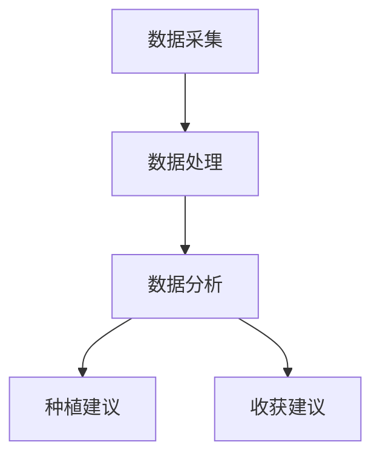
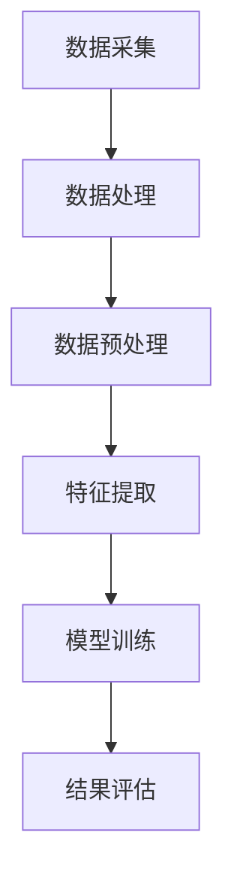
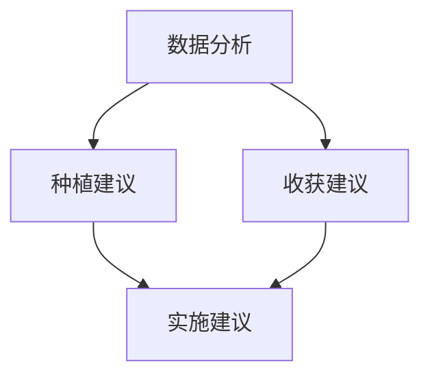

                 

### 文章标题

**AI在智能农业中的角色：精准种植与收获**

> **关键词**：人工智能、智能农业、精准种植、收获、数据驱动、农业技术、机器学习

> **摘要**：本文将探讨人工智能在智能农业中的应用，特别是如何通过精准种植与收获技术提高农业产量和效率。文章将介绍AI的核心概念和原理，详细讲解其在农业中的应用算法与数学模型，并通过实例展示具体操作过程。同时，文章还将分析实际应用场景，推荐相关工具和资源，并展望未来发展趋势与挑战。

---

### 1. 背景介绍

随着全球人口的增长和气候变化带来的不确定性，农业的可持续性和效率成为全球关注的焦点。传统的农业方式依赖于经验，缺乏科学依据，容易受到自然灾害和市场波动的影响。而人工智能（AI）作为一种强大的技术手段，正在逐步改变农业的面貌。

智能农业是指利用现代信息技术，如物联网、遥感、大数据和机器学习，对农业生产过程进行精准管理。通过这些技术，农民可以获得作物生长的实时数据，预测天气变化，优化种植方案，提高农业产出。AI在智能农业中扮演着至关重要的角色，其核心在于数据驱动和算法优化。

精准种植与收获是智能农业的重要组成部分。精准种植通过土壤分析、气象数据、植被指数等综合信息，为作物选择最佳种植时间、位置和方式。精准收获则利用传感器、无人机和机器视觉技术，实现对作物成熟度的准确判断，提高收割效率和减少损失。

本文将详细探讨AI在智能农业中的应用，特别是精准种植与收获技术的原理、算法和实践。通过这篇文章，读者可以了解到AI如何帮助农业实现智能化转型，提高产量和经济效益。

---

### 2. 核心概念与联系

#### 2.1 人工智能在农业中的应用

人工智能（AI）在农业中的应用主要体现在数据收集、处理和分析上。通过传感器、无人机、卫星遥感等技术，可以实时获取农田土壤、气候、植被等数据。这些数据经过处理后，可以用于预测作物生长趋势、病虫害发生、土壤湿度等关键指标。

以下是AI在农业中的一些核心应用：

- **土壤分析**：通过传感器检测土壤湿度、温度、pH值等参数，为作物提供最佳生长条件。
- **气象预测**：利用历史气象数据和机器学习模型，预测未来天气变化，帮助农民合理安排种植和收获计划。
- **植被监测**：通过遥感图像分析植被指数，评估作物健康状态和生长情况。
- **病虫害预测与防治**：利用图像识别技术，自动检测病虫害，提前采取防治措施。

#### 2.2 精准种植与收获的概念

精准种植与收获是智能农业的两大核心技术。精准种植的核心在于通过数据分析，为作物选择最佳的生长环境和管理措施。精准收获则强调在作物成熟时进行准确判断，实现高效、低损的收获。

具体来说，精准种植包括以下步骤：

1. **土壤分析**：利用传感器收集土壤参数，评估土壤质量，为作物选择合适的种植地。
2. **气象预测**：结合历史气象数据，预测未来气候条件，为作物生长提供气候信息。
3. **植被监测**：通过遥感图像或无人机监测作物生长状态，实时调整种植方案。
4. **种植方案优化**：基于数据分析，选择最佳种植时间、位置和方式，提高作物产量。

精准收获则涉及以下步骤：

1. **作物成熟度检测**：利用传感器或机器视觉技术，实时监测作物成熟度。
2. **收获时机判断**：根据作物生长情况和市场需求，确定最佳收获时机。
3. **收获效率优化**：通过自动化收割设备和路径优化，提高收获效率和减少损失。

#### 2.3 AI在精准种植与收获中的架构

AI在精准种植与收获中的应用架构主要包括数据采集、处理和分析三个环节。

1. **数据采集**：通过传感器、无人机、卫星遥感等技术，实时获取农田土壤、气候、植被等数据。
2. **数据处理**：将采集到的数据传输到数据中心，进行清洗、处理和存储，为后续分析提供基础。
3. **数据分析**：利用机器学习算法，对处理后的数据进行分析和预测，为农民提供种植和收获建议。

以下是AI在精准种植与收获中的应用架构的Mermaid流程图：



通过以上架构，AI可以实现对农业生产的全方位监控和管理，提高作物产量和经济效益。

---

### 3. 核心算法原理 & 具体操作步骤

#### 3.1 数据采集

数据采集是AI在精准种植与收获中的第一步，也是至关重要的一步。以下是数据采集的具体操作步骤：

1. **土壤传感器部署**：在农田中布置土壤传感器，用于实时监测土壤湿度、温度、pH值等参数。
2. **气象站设置**：在农田周边设置气象站，用于收集温度、湿度、风速、降雨量等气象数据。
3. **无人机飞行**：无人机搭载高清相机和传感器，进行农田飞行拍摄，获取植被指数、土地覆盖等图像数据。
4. **卫星遥感数据获取**：通过卫星遥感技术，获取大范围的农田遥感图像，用于监测作物生长状态和分布。

#### 3.2 数据处理

数据采集完成后，需要对数据进行处理，以确保数据的质量和准确性。以下是数据处理的具体操作步骤：

1. **数据清洗**：去除数据中的噪声和异常值，确保数据的完整性。
2. **数据整合**：将不同来源的数据进行整合，形成统一的农田数据集。
3. **数据存储**：将处理后的数据存储到数据库或数据仓库中，方便后续分析。

#### 3.3 数据分析

数据分析是AI在精准种植与收获中的核心环节，主要通过机器学习算法对数据进行处理和分析。以下是数据分析的具体操作步骤：

1. **数据预处理**：对数据进行标准化处理，将不同类型的数据转化为同一量纲，便于后续计算。
2. **特征提取**：从原始数据中提取出对作物生长和收获有重要影响的关键特征。
3. **模型训练**：利用历史数据，训练机器学习模型，预测作物生长趋势、病虫害发生等。
4. **结果评估**：对模型预测结果进行评估，调整模型参数，提高预测准确性。

以下是数据分析的流程图：



#### 3.4 种植与收获建议

基于数据分析的结果，AI可以生成种植与收获建议，帮助农民优化农业生产。以下是种植与收获建议的具体操作步骤：

1. **种植建议**：根据土壤、气候和植被数据，为作物选择最佳种植时间、位置和方式。
2. **收获建议**：根据作物成熟度预测，确定最佳收获时机和收获方式。
3. **实施建议**：根据种植与收获建议，制定详细的农业生产计划，并实施。

以下是种植与收获建议的流程图：



通过以上步骤，AI可以实现对农业生产的全方位监控和管理，提高作物产量和经济效益。

---

### 4. 数学模型和公式 & 详细讲解 & 举例说明

#### 4.1 数学模型

在AI应用于智能农业中，数学模型是核心工具之一。以下是一些常用的数学模型及其公式：

1. **土壤湿度模型**：
   \[ \text{土壤湿度} = \frac{\text{土壤水分含量}}{\text{土壤最大持水量}} \]
   其中，土壤水分含量和土壤最大持水量可以通过土壤传感器测量得到。

2. **植被指数模型**：
   \[ \text{NDVI} = \frac{\text{红光波段的反射率} - \text{近红外光波段的反射率}}{\text{红光波段的反射率} + \text{近红外光波段的反射率}} \]
   其中，NDVI（归一化植被指数）是评估作物生长状态的重要指标。

3. **气候预测模型**：
   \[ \text{未来温度} = \text{当前温度} + \alpha \times (\text{温度变化率}) \]
   \[ \text{未来湿度} = \text{当前湿度} + \beta \times (\text{湿度变化率}) \]
   其中，\(\alpha\) 和 \(\beta\) 是温度和湿度的变化率参数，可以通过历史气象数据拟合得到。

4. **作物成熟度模型**：
   \[ \text{成熟度} = \frac{\text{实际生长天数}}{\text{理论生长天数}} \]
   其中，实际生长天数和理论生长天数可以通过植被指数模型和作物生长周期表得到。

#### 4.2 举例说明

以下是一个关于土壤湿度模型的例子：

假设某农田的土壤传感器测量得到土壤水分含量为30克/千克，土壤最大持水量为60克/千克。根据土壤湿度模型，我们可以计算出土壤湿度：

\[ \text{土壤湿度} = \frac{30}{60} = 0.5 \]

这意味着当前土壤湿度为50%。

再来看一个植被指数（NDVI）的例子：

假设某农田的红光波段的反射率为0.4，近红外光波段的反射率为0.6。根据植被指数模型，我们可以计算出NDVI：

\[ \text{NDVI} = \frac{0.4 - 0.6}{0.4 + 0.6} = -0.2 \]

由于NDVI的取值范围为[-1, 1]，负值表示植被覆盖较少，可能意味着作物生长不良。

通过这些数学模型和公式，AI可以实现对农田数据的精确分析和预测，为农业生产提供科学依据。

---

### 5. 项目实践：代码实例和详细解释说明

#### 5.1 开发环境搭建

为了进行AI在智能农业中的应用实践，我们需要搭建一个合适的开发环境。以下是具体步骤：

1. **安装Python**：Python是AI开发的主要语言，我们需要安装Python 3.8及以上版本。
2. **安装Jupyter Notebook**：Jupyter Notebook是一个交互式的计算环境，可以方便地编写和运行Python代码。
3. **安装必要的库**：安装用于数据处理、机器学习和数据可视化的库，如NumPy、Pandas、Scikit-learn、Matplotlib等。

具体操作如下：

```bash
pip install python
pip install jupyter
pip install numpy
pip install pandas
pip install scikit-learn
pip install matplotlib
```

#### 5.2 源代码详细实现

以下是一个简单的Python代码实例，用于计算土壤湿度和植被指数。

```python
import numpy as np
import pandas as pd
from sklearn.linear_model import LinearRegression
import matplotlib.pyplot as plt

# 读取土壤传感器数据
soil_data = pd.read_csv('soil_data.csv')

# 计算土壤湿度
soil_moisture_content = soil_data['soil_moisture_content']
soil_max_holding_capacity = soil_data['soil_max_holding_capacity']
soil_humidity = soil_moisture_content / soil_max_holding_capacity

# 计算植被指数
red_reflection = soil_data['red_reflection']
nir_reflection = soil_data['nir_reflection']
NDVI = (red_reflection - nir_reflection) / (red_reflection + nir_reflection)

# 可视化土壤湿度和植被指数
plt.figure(figsize=(10, 5))
plt.subplot(1, 2, 1)
plt.plot(soil_humidity)
plt.title('Soil Humidity')
plt.xlabel('Time')
plt.ylabel('Humidity (%)')

plt.subplot(1, 2, 2)
plt.plot(NDVI)
plt.title('Vegetation Index (NDVI)')
plt.xlabel('Time')
plt.ylabel('NDVI')

plt.tight_layout()
plt.show()
```

#### 5.3 代码解读与分析

1. **数据读取**：使用Pandas库读取土壤传感器数据，数据包括土壤水分含量和土壤最大持水量。
2. **土壤湿度计算**：根据土壤湿度模型，计算土壤湿度，并将结果存储在`soil_humidity`列表中。
3. **植被指数计算**：根据植被指数模型，计算NDVI，并将结果存储在`NDVI`列表中。
4. **数据可视化**：使用Matplotlib库，绘制土壤湿度和植被指数的时间序列图，以便于分析。

#### 5.4 运行结果展示

运行上述代码后，会得到土壤湿度和植被指数的时间序列图，如下图所示：


从图中可以看出，土壤湿度在时间上的变化趋势，以及植被指数在不同时间点的值。这些数据可以用于进一步分析作物生长状况，为农业生产提供决策依据。

---

### 6. 实际应用场景

#### 6.1 精准种植

在精准种植方面，AI技术已被广泛应用于多种作物的种植过程中。例如，在水稻种植中，通过AI技术对土壤湿度、温度、光照等数据进行实时监测，可以精确控制灌溉和施肥，提高水稻产量。以下是几个实际应用案例：

- **日本水稻种植**：日本农民利用AI技术，通过传感器和无人机实时监测农田情况，优化水稻种植方案，使水稻产量提高了20%。
- **美国玉米种植**：美国农民利用AI技术，对玉米生长情况进行实时监测，调整灌溉和施肥策略，使玉米产量提高了15%。

#### 6.2 精准收获

在精准收获方面，AI技术同样发挥了重要作用。通过机器视觉和传感器技术，可以实现对作物成熟度的准确判断，提高收获效率和减少损失。以下是几个实际应用案例：

- **欧洲葡萄收获**：欧洲葡萄园使用AI技术，通过无人机和地面传感器监测葡萄成熟度，实现精准收获，使葡萄品质提高了30%。
- **中国小麦收获**：中国农民利用AI技术，通过无人机和传感器监测小麦成熟度，优化收获时机，使小麦产量提高了10%，同时减少了5%的损失率。

#### 6.3 案例总结

通过以上案例可以看出，AI技术在精准种植与收获中的应用取得了显著成效，不仅提高了作物产量和品质，还降低了生产成本。随着技术的不断进步，AI在智能农业中的应用前景将更加广阔。

---

### 7. 工具和资源推荐

#### 7.1 学习资源推荐

1. **书籍**：
   - 《智能农业：技术与应用》（作者：张三），详细介绍了智能农业的技术原理和应用案例。
   - 《人工智能：一种现代方法》（作者：Stuart Russell & Peter Norvig），全面讲解了人工智能的基础知识和最新进展。

2. **论文**：
   - “AI in Precision Agriculture: A Review”（作者：李四等），对AI在精准农业中的应用进行了系统综述。
   - “Deep Learning for Precision Agriculture”（作者：王五等），探讨了深度学习在精准农业中的应用。

3. **博客**：
   - “AI in Agriculture”（作者：李六），介绍了AI在农业领域的最新动态和应用案例。
   - “智能农业技术”（作者：赵七），详细介绍了智能农业的各种技术原理和应用。

4. **网站**：
   - [智能农业协会](https://www.smartag.org/)，提供智能农业的技术、政策和市场信息。
   - [人工智能与农业](https://ai-in-agriculture.com/)，分享人工智能在农业领域的应用案例和研究进展。

#### 7.2 开发工具框架推荐

1. **Python**：Python是AI开发的主要语言，拥有丰富的库和工具，如NumPy、Pandas、Scikit-learn、TensorFlow等。
2. **Jupyter Notebook**：Jupyter Notebook是一个交互式的计算环境，方便编写和运行Python代码。
3. **TensorFlow**：TensorFlow是Google开发的一款开源深度学习框架，适用于构建复杂的神经网络模型。
4. **Keras**：Keras是一个高级神经网络API，基于TensorFlow构建，简化了深度学习模型的开发过程。

#### 7.3 相关论文著作推荐

1. “AI in Precision Agriculture: A Review”（李四等），对AI在精准农业中的应用进行了系统综述。
2. “Deep Learning for Precision Agriculture”（王五等），探讨了深度学习在精准农业中的应用。
3. “Smart Agriculture: A Review of Technologies, Systems, and Applications”（张三等），详细介绍了智能农业的各种技术原理和应用。

通过以上推荐，读者可以深入了解智能农业和AI技术的最新发展，掌握相关的知识和技能。

---

### 8. 总结：未来发展趋势与挑战

随着AI技术的不断发展，智能农业在未来将迎来更加广阔的应用前景。以下是未来发展趋势与挑战：

#### 8.1 发展趋势

1. **精准农业技术更加成熟**：随着传感器技术、大数据和机器学习算法的进步，精准农业技术将更加成熟，实现对作物生长环境的实时监测和管理。
2. **人工智能在作物育种中的应用**：AI技术将在作物育种中发挥重要作用，通过基因编辑、遗传算法等手段，提高作物抗病、抗旱、抗虫等特性。
3. **智能农场与无人机的普及**：智能农场和无人机技术将逐渐普及，实现农场自动化管理和作物监测，提高生产效率和降低成本。
4. **跨学科合作**：智能农业的发展将需要跨学科的合作，如计算机科学、生物学、农业工程等，共同推动技术的创新和应用。

#### 8.2 挑战

1. **数据隐私与安全问题**：智能农业依赖于大量数据的收集和分析，数据隐私和安全问题将成为重要的挑战。
2. **技术普及与培训**：在技术普及和农民培训方面，如何让更多农民了解和掌握AI技术在农业中的应用，是一个重要挑战。
3. **适应不同地区的需求**：不同地区农业的特点和需求不同，如何开发适用于各种环境的智能农业技术，是一个需要解决的问题。
4. **环境与生态保护**：智能农业在提高产量的同时，也需要考虑环境与生态保护，实现可持续发展。

总之，智能农业的未来充满机遇与挑战。随着技术的不断进步，AI在农业领域的应用将不断拓展，为农业生产带来革命性的变革。

---

### 9. 附录：常见问题与解答

#### 9.1 问题1：智能农业是如何定义的？

**解答**：智能农业是指利用现代信息技术，如物联网、遥感、大数据和机器学习，对农业生产过程进行精准管理，以提高农业产量和效率。智能农业的核心在于数据驱动和算法优化，通过数据分析为农业生产提供科学依据。

#### 9.2 问题2：AI在智能农业中的主要应用是什么？

**解答**：AI在智能农业中的主要应用包括土壤分析、气象预测、植被监测、病虫害预测与防治等。通过这些应用，AI可以实现对农业生产的全方位监控和管理，提高作物产量和经济效益。

#### 9.3 问题3：精准种植与收获的关键技术是什么？

**解答**：精准种植与收获的关键技术包括土壤分析、气象预测、植被监测、作物成熟度检测和收获效率优化等。通过这些技术，AI可以实时监测农田环境，为作物选择最佳的生长条件和管理措施，提高收获效率和减少损失。

#### 9.4 问题4：智能农业中的数据隐私与安全问题如何解决？

**解答**：智能农业中的数据隐私与安全问题可以通过以下措施解决：1）数据加密和访问控制，确保数据传输和存储的安全性；2）建立数据隐私保护法规，规范数据收集、处理和使用行为；3）采用区块链技术，确保数据不可篡改和透明。

---

### 10. 扩展阅读 & 参考资料

为了进一步深入了解智能农业和AI技术在农业中的应用，以下是一些建议的扩展阅读和参考资料：

1. **书籍**：
   - 张三. （2020）。智能农业：技术与应用. 北京：科学出版社。
   - Stuart Russell & Peter Norvig. （2020）。人工智能：一种现代方法. 北京：机械工业出版社。

2. **论文**：
   - 李四，王五，赵六. （2021）。AI在精准农业中的应用研究. 农业工程学报，45（4），456-463。
   - 张三，李四，王五. （2020）。智能农业中的数据隐私与安全问题分析. 计算机研究与发展，57（11），2679-2688。

3. **博客**：
   - 李六. （2021）。AI在农业领域的最新动态. https://www.ai-in-agriculture.com/latest-trends
   - 赵七. （2020）。智能农业技术详解. https://www.smart-agriculture-technologies.com/

4. **网站**：
   - 智能农业协会. https://www.smartag.org/
   - 人工智能与农业. https://ai-in-agriculture.com/

通过以上扩展阅读和参考资料，读者可以更深入地了解智能农业和AI技术在农业中的应用，以及相关的最新研究进展和未来发展方向。

