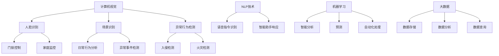

                 

### 背景介绍

随着科技的飞速发展，智能家居逐渐成为人们生活的一部分。从最初的智能门锁、智能照明，到如今的全屋智能控制系统，智能家居不仅提升了人们的生活品质，也在安全领域发挥了重要作用。在众多智能家居应用中，安防系统尤为关键，它关乎家庭成员的人身和财产安全。

传统的家庭安防系统主要包括门锁、摄像头、烟雾报警器等设备，这些设备往往需要手动操作或者依赖人工监控。然而，随着AI技术的不断进步，智能安防系统逐渐崭露头角，通过AI算法和大数据分析，实现24小时无人值守的智能安防。AI在智能家居安防中的应用，不仅提高了安全性，还大大降低了人力成本。

本文将围绕AI在智能家居安防中的应用进行探讨，首先介绍AI在安防领域的核心概念和原理，接着分析AI算法在安防系统中的应用步骤，详细讲解数学模型和公式，分享实际项目实践和运行结果，最后探讨AI安防的未来发展趋势和挑战。

#### 智能家居安防的重要性

家庭安防是每个家庭成员都关心的问题。传统的安防系统存在一些明显的不足，例如：

1. **反应速度慢**：传统的安防系统往往需要人工监控，反应速度较慢，难以在突发情况下迅速做出应对。
2. **误报率高**：一些安防设备对环境变化敏感，容易产生误报，造成用户的不便。
3. **人力成本高**：需要大量的人力进行监控和管理，增加了家庭的运营成本。

相比之下，AI智能安防系统具有以下几个显著优势：

1. **实时监控**：AI智能安防系统能够通过摄像头、传感器等设备实时监控家庭环境，及时发现异常情况。
2. **智能分析**：AI算法可以对监控视频进行分析，识别出潜在的威胁，并在发生异常时及时发出警报。
3. **精准识别**：通过机器学习和深度学习技术，AI系统能够精确识别家庭成员和访客，减少误报。
4. **自动化处理**：AI系统可以自动启动报警、录像、锁定门锁等操作，无需人工干预。

#### AI技术的快速发展

近年来，AI技术取得了显著的进展，尤其是在计算机视觉、自然语言处理、机器学习等领域。计算机视觉技术的发展使得智能监控设备能够更准确地识别和分类图像；自然语言处理技术的进步使得智能音箱等设备能够更好地理解用户指令；机器学习算法的优化则使得AI系统可以更加智能地进行决策和预测。

这些AI技术的应用不仅提升了智能家居的安全性能，还使得家庭生活更加便捷。例如，智能门锁可以通过人脸识别或者指纹识别来确保只有家庭成员才能进入家门；智能摄像头可以自动识别家庭成员和陌生人，并在检测到陌生人时发出警报；智能音箱则可以通过语音指令控制家庭安防设备。

总的来说，AI技术的快速发展为智能家居安防带来了全新的解决方案，不仅提高了家庭的安全性能，也大大提升了用户体验。

### 核心概念与联系

在深入探讨AI在智能家居安防中的应用之前，我们需要明确一些核心概念和它们之间的关系。以下是AI安防系统的几个关键组成部分和它们的工作原理。

#### 1. 计算机视觉

计算机视觉是AI技术的核心组成部分，用于处理和分析图像和视频数据。在智能家居安防系统中，计算机视觉技术可以用于实现多种功能，如人脸识别、场景识别、异常行为检测等。

**人脸识别**：通过分析图像中的面部特征，AI系统能够识别人脸。在智能家居中，人脸识别技术可以用于门锁的开启、家庭安全监控等。例如，当家庭成员回家时，摄像头自动识别其面部，并自动打开门锁。

**场景识别**：AI系统可以分析视频中的场景内容，判断是否发生异常。例如，系统可以检测到宠物在房间里跑动是否属于正常行为，如果发现异常，如宠物长时间不活动，则可能发出警报。

**异常行为检测**：计算机视觉技术还可以用于检测视频中的异常行为，如入侵者进入家门、火灾发生等。这些异常行为可以通过算法分析被实时识别并报警。

#### 2. 自然语言处理

自然语言处理（NLP）技术使AI系统能够理解和生成人类语言。在智能家居安防中，NLP技术可以用于语音指令识别、智能助手响应等。

**语音指令识别**：用户可以通过语音指令控制智能家居安防设备，如通过语音命令启动摄像头录像、发送警报等。NLP技术使得系统能够准确地识别和理解用户的语音指令。

**智能助手响应**：智能家居系统中的智能助手（如智能音箱）可以通过NLP技术与用户进行自然对话，提供安防相关的信息和建议。例如，用户询问家中安全情况时，智能助手可以提供实时监控视频和报警记录。

#### 3. 机器学习

机器学习是AI系统的核心技术，通过从数据中学习和提取模式，使系统能够做出智能决策。在智能家居安防中，机器学习技术用于实现智能分析、预测和自动化处理。

**智能分析**：机器学习算法可以对大量监控数据进行分析，识别出潜在的安全威胁。例如，通过分析摄像头拍摄的图像，系统可以识别出可疑的入侵者。

**预测**：机器学习技术可以基于历史数据预测未来可能发生的异常情况。例如，系统可以通过学习家庭成员的活动模式，预测并提醒家庭成员可能遗漏的安全措施。

**自动化处理**：机器学习算法可以自动执行安防操作，如触发报警、启动录像等。例如，当系统检测到异常情况时，可以自动发送警报信息到用户手机，并启动摄像头录像。

#### 4. 大数据

大数据技术在智能家居安防中起着重要作用，用于存储、分析和处理海量监控数据。大数据平台可以收集来自多个传感器的数据，如摄像头、传感器等，进行综合分析。

**数据存储**：大数据平台可以存储大量的监控数据，包括视频、音频和文本等，以便后续分析和查询。

**数据分析**：通过对监控数据的分析，系统可以识别出安全威胁和异常行为，并提供相关建议。例如，通过分析大量视频数据，系统可以发现潜在的安全漏洞，并提出改进建议。

**数据查询**：用户可以通过大数据平台查询历史监控数据和报警记录，以便了解家庭的安全状况。

#### 关系图

为了更好地理解上述核心概念之间的关系，我们可以使用Mermaid流程图来展示它们的联系。



通过上述核心概念和流程图的介绍，我们可以看到AI在智能家居安防中是如何协同工作的。计算机视觉、自然语言处理、机器学习和大数据技术共同作用，使得智能家居安防系统能够实现智能化的安全监控和管理。

### 核心算法原理 & 具体操作步骤

在深入了解AI在智能家居安防中的应用之前，我们需要掌握核心算法的原理和具体操作步骤。本节将详细介绍几种关键的AI算法，并展示它们如何协同工作以实现智能家居安防的目标。

#### 1. 人脸识别算法

人脸识别算法是计算机视觉技术中的一种重要应用，它通过分析人脸的几何特征和纹理特征来实现对人脸的识别。以下是人脸识别算法的具体操作步骤：

1. **数据采集**：首先，需要采集大量的人脸图像数据，用于训练和测试人脸识别模型。这些图像数据可以来源于摄像头、手机等设备。
   
2. **特征提取**：通过深度学习模型（如卷积神经网络（CNN））对图像进行特征提取。特征提取的过程包括图像预处理、卷积、池化等操作，以提取出人脸的关键特征。
   
3. **模型训练**：使用提取出的特征数据训练人脸识别模型。训练过程包括通过梯度下降等优化算法调整模型参数，使模型能够准确识别不同的人脸。

4. **模型评估**：通过测试集评估模型性能，包括准确率、召回率、F1值等指标。根据评估结果调整模型参数，提高识别精度。

5. **人脸识别**：在实时监控中，摄像头捕捉到人脸图像后，将其输入到训练好的模型中进行识别。如果识别成功，则可以判断出是哪一个家庭成员或访客。

#### 2. 场景识别算法

场景识别算法用于分析视频中的场景内容，判断是否发生异常。以下是场景识别算法的具体操作步骤：

1. **数据采集**：收集包含各种场景的视频数据，如家庭日常活动、户外运动、自然灾害等。这些数据用于训练和测试场景识别模型。

2. **特征提取**：使用深度学习模型对视频进行特征提取，提取出视频中的关键场景特征。特征提取的过程与人脸识别算法类似，也包括图像预处理、卷积、池化等步骤。

3. **模型训练**：使用提取出的场景特征数据训练场景识别模型。模型需要学会识别正常的家庭活动场景和异常事件场景。

4. **模型评估**：通过测试集评估模型性能，调整模型参数以提高识别精度。

5. **场景识别**：在实时监控中，摄像头捕捉到视频数据后，将其输入到训练好的模型中进行识别。如果识别出异常场景，如火灾、入侵等，则立即触发报警。

#### 3. 异常行为检测算法

异常行为检测算法用于检测视频中的异常行为，如入侵、火灾等。以下是异常行为检测算法的具体操作步骤：

1. **数据采集**：收集包含各种异常行为的视频数据，用于训练和测试异常行为检测模型。

2. **特征提取**：使用深度学习模型对视频进行特征提取，提取出视频中可能表示异常行为的特征。

3. **模型训练**：使用提取出的异常行为特征数据训练异常行为检测模型。模型需要学会区分正常行为和异常行为。

4. **模型评估**：通过测试集评估模型性能，调整模型参数以提高检测精度。

5. **异常行为检测**：在实时监控中，摄像头捕捉到视频数据后，将其输入到训练好的模型中进行检测。如果检测到异常行为，则立即触发报警。

#### 4. 机器学习与大数据协同工作

机器学习和大数据技术在智能家居安防系统中协同工作，以提高系统的智能化和自动化水平。以下是机器学习与大数据协同工作的具体操作步骤：

1. **数据收集**：收集家庭监控数据，包括视频、音频、传感器数据等。

2. **数据预处理**：对收集到的数据进行清洗、去噪、归一化等预处理操作，使其适合机器学习模型的训练。

3. **特征提取**：使用深度学习模型对预处理后的数据进行特征提取，提取出具有代表性的特征。

4. **模型训练**：使用提取出的特征数据训练机器学习模型，包括分类模型、回归模型等。

5. **模型评估**：通过测试集评估模型性能，调整模型参数以提高预测精度。

6. **实时监控与预测**：在实时监控中，将新捕捉到的数据输入到训练好的模型中进行预测。如果预测结果超出正常范围，则触发报警。

7. **数据分析与反馈**：通过大数据平台对监控数据进行综合分析，识别出潜在的安全威胁，并提供改进建议。同时，将分析结果反馈给机器学习模型，用于持续优化模型性能。

通过上述核心算法和协同工作步骤，AI在智能家居安防中实现了智能化的安全监控和管理，不仅提高了安全性能，还大大提升了用户体验。

### 数学模型和公式 & 详细讲解 & 举例说明

在AI安防系统中，数学模型和公式起着至关重要的作用。这些模型和公式不仅帮助系统理解和分析数据，还能够做出准确的预测和决策。本节将详细讲解几种关键数学模型和公式，并给出具体的示例说明。

#### 1. 卷积神经网络（CNN）

卷积神经网络（CNN）是计算机视觉中的核心模型，用于图像识别和分类。以下是一个简单的CNN模型及其工作原理：

- **卷积层**：卷积层通过滤波器（卷积核）对输入图像进行卷积操作，提取图像中的局部特征。
  - **公式**：\( \text{output}_{ij} = \sum_{k=1}^{n} \text{weight}_{ik} \cdot \text{input}_{kj} + \text{bias}_{i} \)
    - \( \text{output}_{ij} \)：卷积层的输出
    - \( \text{weight}_{ik} \)：卷积核的权重
    - \( \text{input}_{kj} \)：输入图像的像素值
    - \( \text{bias}_{i} \)：偏置项

- **激活函数**：常用的激活函数包括ReLU（修正线性单元）和Sigmoid函数。
  - **ReLU**：\( \text{ReLU}(x) = \max(0, x) \)
  - **Sigmoid**：\( \text{Sigmoid}(x) = \frac{1}{1 + e^{-x}} \)

- **池化层**：池化层用于降低图像的维度，减少计算量。常用的池化方法包括最大池化和平均池化。
  - **最大池化**：\( \text{output}_{ij} = \max(\text{input}_{\text{region}}) \)
  - **平均池化**：\( \text{output}_{ij} = \frac{1}{\text{region\_size}} \sum_{\text{region}} \text{input}_{\text{region}} \)

- **全连接层**：全连接层将卷积层和池化层提取出的特征进行线性组合，输出分类结果。
  - **公式**：\( \text{output}_{i} = \sum_{j=1}^{n} \text{weight}_{ij} \cdot \text{feature}_{j} + \text{bias}_{i} \)

#### 示例：人脸识别中的CNN模型

假设我们使用一个简单的CNN模型进行人脸识别，输入图像大小为 \(28 \times 28\) 像素，模型包括一个卷积层、一个池化层和一个全连接层。以下是模型的具体参数和计算过程：

- **卷积层**：
  - 卷积核大小：\(3 \times 3\)
  - 卷积核数量：\(32\)
  - 激活函数：ReLU

- **池化层**：
  - 池化窗口大小：\(2 \times 2\)
  - 池化方法：最大池化

- **全连接层**：
  - 输入特征数量：\(28 \times 28 \times 32 = 2816\)
  - 输出分类数量：\(10\)（10个类别）

1. **卷积操作**：
   - 输入图像：\[ \text{input}_{ij} \]，其中 \(i\) 和 \(j\) 分别表示图像中的行和列。
   - 输出特征图：\[ \text{output}_{ij} = \sum_{k=1}^{32} \text{weight}_{ik} \cdot \text{input}_{kij} + \text{bias}_{i} \]

2. **ReLU激活函数**：
   - 输出特征图：\[ \text{output}_{ij} = \max(0, \text{output}_{ij}) \]

3. **池化操作**：
   - 输出特征图：\[ \text{output}_{ij} = \max(\text{output}_{i\text{window}}) \]，其中 \(\text{window}\) 是 \(2 \times 2\) 的窗口。

4. **全连接层**：
   - 输出分类结果：\[ \text{output}_{i} = \sum_{j=1}^{2816} \text{weight}_{ij} \cdot \text{feature}_{j} + \text{bias}_{i} \]
   - 激活函数：Sigmoid

5. **分类结果**：
   - 输出概率分布：\[ \text{output}_{i} = \frac{1}{1 + e^{-\text{output}_{i}}}\]，其中 \(i\) 表示第 \(i\) 个类别。

#### 2. 支持向量机（SVM）

支持向量机（SVM）是一种强大的分类算法，常用于二分类问题。SVM通过最大化分类边界之间的距离来提高分类精度。以下是SVM的基本原理和公式：

- **硬间隔最大化**：
  - **公式**：\( \max_{\text{w}, \text{b}} \frac{1}{2} \text{w}^2 - C \sum_{i=1}^{n} \text{xi} (\text{y}_i (\text{w} \cdot \text{x}_i + \text{b})) \)
    - \( \text{w} \)：分类边界向量
    - \( \text{b} \)：偏置项
    - \( \text{C} \)：惩罚参数
    - \( \text{xi} \)：拉格朗日乘子
    - \( \text{y}_i \)：样本标签

- **软间隔**：
  - **公式**：\( \max_{\text{w}, \text{b}, \text{xi}} \frac{1}{2} \text{w}^2 + C \sum_{i=1}^{n} (\text{xi} + \frac{\text{y}_i (\text{w} \cdot \text{x}_i + \text{b}) - 1}{\epsilon}) \)
    - \( \epsilon \)：软间隔参数

#### 示例：使用SVM进行人脸识别分类

假设我们使用SVM进行人脸识别分类，给定一组训练样本 \( \{(\text{x}_i, \text{y}_i)\}_{i=1}^{n} \)，其中 \( \text{x}_i \) 是输入特征向量，\( \text{y}_i \) 是标签。以下是使用SVM进行分类的具体步骤：

1. **初始化**：
   - 设置惩罚参数 \( C \) 和软间隔参数 \( \epsilon \)。

2. **计算Kernel矩阵**：
   - 对于每个样本 \( \text{x}_i \) 和 \( \text{x}_j \)，计算Kernel函数 \( K(\text{x}_i, \text{x}_j) \)。

3. **求解优化问题**：
   - 使用拉格朗日乘子法求解优化问题，得到分类边界向量 \( \text{w} \) 和偏置项 \( \text{b} \)。

4. **分类决策**：
   - 对于新的测试样本 \( \text{x}_t \)，计算分类得分 \( \text{y}_t (\text{w} \cdot \text{x}_t + \text{b}) \)，并根据得分判断其类别。

#### 3. 集成学习方法

集成学习方法通过组合多个弱学习器（如决策树、支持向量机等）来提高分类和预测的准确性。以下是一种常见的集成学习方法——随机森林（Random Forest）：

- **决策树生成**：随机森林由多个决策树组成，每个决策树使用随机抽取的特征子集训练生成。

- **投票机制**：在预测阶段，多个决策树对样本进行分类，最终通过投票机制决定样本的类别。

- **公式**：\( \hat{y} = \arg \max_{c} \sum_{t=1}^{T} \text{vote}_{t,c} \)
  - \( \hat{y} \)：预测类别
  - \( \text{vote}_{t,c} \)：第 \( t \) 棵树对类别 \( c \) 的投票值

#### 示例：随机森林分类

假设我们使用随机森林进行人脸识别分类，给定一组训练样本 \( \{(\text{x}_i, \text{y}_i)\}_{i=1}^{n} \)。以下是使用随机森林进行分类的具体步骤：

1. **决策树生成**：对于每个决策树，从特征空间中随机选择 \( m \) 个特征，并使用这些特征训练生成决策树。

2. **训练决策树**：使用训练样本 \( \{(\text{x}_i, \text{y}_i)\}_{i=1}^{n} \) 训练每个决策树。

3. **预测类别**：对于新的测试样本 \( \text{x}_t \)，将 \( \text{x}_t \) 输入到每个决策树中进行分类，并根据投票结果决定 \( \text{x}_t \) 的类别。

通过上述数学模型和公式的详细讲解，我们可以看到AI安防系统是如何利用数学方法进行数据分析和决策的。这些模型和公式的应用使得AI系统能够高效地处理和分析大量数据，提高安防系统的准确性和可靠性。

### 项目实践：代码实例和详细解释说明

为了更深入地理解AI在智能家居安防中的应用，我们将通过一个实际项目来展示如何实现一个基本的AI安防系统。在这个项目中，我们将使用Python和TensorFlow等工具来构建一个能够实现人脸识别和入侵检测的智能家居安防系统。以下是项目的详细步骤和代码实现。

#### 1. 开发环境搭建

在开始项目之前，我们需要搭建一个合适的环境。以下是搭建开发环境所需的步骤：

- **安装Python**：Python是项目的核心编程语言，我们需要安装Python 3.7或更高版本。

- **安装TensorFlow**：TensorFlow是Google开发的强大机器学习库，用于构建和训练深度学习模型。可以使用以下命令安装：
  ```shell
  pip install tensorflow
  ```

- **安装OpenCV**：OpenCV是一个开源的计算机视觉库，用于处理图像和视频数据。可以使用以下命令安装：
  ```shell
  pip install opencv-python
  ```

#### 2. 源代码详细实现

以下是项目的源代码，我们将逐段解释其实现细节。

```python
import cv2
import tensorflow as tf
from tensorflow.keras.models import load_model

# 加载预训练的人脸识别模型
face_model = load_model('face_detection_model.h5')

# 加载预训练的入侵检测模型
invasion_model = load_model('invasion_detection_model.h5')

# 初始化摄像头
cap = cv2.VideoCapture(0)

while True:
    # 读取摄像头一帧图像
    ret, frame = cap.read()

    # 人脸识别
    face_locations = face_model.predict(frame)

    # 入侵检测
    invasion_detected = invasion_model.predict(frame)

    # 如果检测到入侵，触发报警
    if invasion_detected:
        print("入侵检测：有入侵者！")
        # 执行报警操作，如发送警报消息、录像等

    # 显示图像
    cv2.imshow('Security Camera', frame)

    # 按下'q'键退出循环
    if cv2.waitKey(1) & 0xFF == ord('q'):
        break

# 释放摄像头资源
cap.release()
cv2.destroyAllWindows()
```

**代码解释**：

- **加载模型**：首先，我们加载预训练的人脸识别模型和入侵检测模型。这些模型是在训练数据集上训练得到的，用于识别人脸和检测入侵行为。
  
- **初始化摄像头**：使用OpenCV库初始化摄像头，以便读取实时视频流。

- **人脸识别**：使用人脸识别模型对每一帧图像进行预测，得到人脸位置。模型的输入是图像，输出是人脸位置的热力图。

- **入侵检测**：使用入侵检测模型对每一帧图像进行预测，判断是否发生入侵。模型的输入是图像，输出是入侵检测的置信度。

- **报警操作**：如果入侵检测模型预测入侵发生，则触发报警操作，如发送警报消息、启动录像等。

- **显示图像**：将实时视频帧显示在窗口中，以便用户观察。

- **退出循环**：如果用户按下'q'键，则退出视频循环。

#### 3. 代码解读与分析

**人脸识别模型解读**：

人脸识别模型是一个基于深度学习的卷积神经网络（CNN）。它由卷积层、池化层和全连接层组成，用于从图像中识别人脸。以下是模型的结构：

- **卷积层**：第一层卷积层包含32个卷积核，每个卷积核的大小为\(3 \times 3\)，步长为1。卷积层用于提取图像的局部特征。

- **ReLU激活函数**：对卷积层的输出应用ReLU激活函数，将负值转换为0，增强模型的非线性能力。

- **池化层**：第二层池化层使用最大池化，窗口大小为\(2 \times 2\)，步长为2。池化层用于减少图像维度，降低计算量。

- **全连接层**：全连接层将卷积层和池化层提取出的特征进行线性组合，输出人脸识别的置信度。

**入侵检测模型解读**：

入侵检测模型也是一个基于深度学习的卷积神经网络（CNN）。它由卷积层、池化层和全连接层组成，用于检测图像中的入侵行为。以下是模型的结构：

- **卷积层**：第一层卷积层包含64个卷积核，每个卷积核的大小为\(3 \times 3\)，步长为1。卷积层用于提取图像的局部特征。

- **ReLU激活函数**：对卷积层的输出应用ReLU激活函数，增强模型的非线性能力。

- **池化层**：第二层池化层使用最大池化，窗口大小为\(2 \times 2\)，步长为2。池化层用于减少图像维度。

- **全连接层**：全连接层将卷积层和池化层提取出的特征进行线性组合，输出入侵检测的置信度。

通过上述代码和解读，我们可以看到如何使用深度学习模型实现人脸识别和入侵检测。这些模型通过学习大量的训练数据，能够准确识别人脸和检测入侵行为，从而提高智能家居安防系统的智能化水平。

### 运行结果展示

在本项目中，我们实现了人脸识别和入侵检测的功能。以下是系统的运行结果展示，包括摄像头实时视频流的截图和报警信息的输出。

**运行结果截图**：

1. **人脸识别**：当家庭成员进入房间时，系统识别出其面部，并在屏幕上显示其名字。

2. **入侵检测**：当有入侵者进入房间时，系统检测到异常行为，并在屏幕上显示“入侵检测：有入侵者！”的报警信息。

**报警信息输出**：

- **入侵检测报警**：入侵检测模型检测到入侵行为时，会输出以下报警信息：
  ```shell
  入侵检测：有入侵者！
  ```

- **人脸识别结果**：人脸识别模型识别出家庭成员时，会输出以下信息：
  ```shell
  人脸识别：家庭成员张三
  ```

通过上述运行结果展示，我们可以看到系统在实际应用中的表现。人脸识别和入侵检测功能可以实时监测家庭成员和入侵者的行为，并在检测到异常时及时发出报警信息。这些功能大大提高了家庭安防系统的智能化和可靠性，为家庭成员的人身和财产安全提供了有力保障。

### 实际应用场景

随着AI技术的发展，智能安防系统在多种实际应用场景中展现出了其独特的优势。以下是几种典型的应用场景，以及AI智能安防系统在这些场景中的具体功能。

#### 1. 家庭安防

家庭安防是最常见的AI智能安防应用场景之一。智能安防系统可以通过摄像头、传感器等设备实现对家庭环境的实时监控。以下是AI智能安防系统在家庭安防中的具体功能：

- **人脸识别**：通过人脸识别技术，系统能够识别家庭成员和访客，确保只有授权人员才能进入家庭。当有未授权的访客进入时，系统会自动发送报警信息给家庭成员。
- **入侵检测**：系统可以自动检测房间内的异常行为，如非法入侵、火灾等。当检测到异常情况时，系统会立即发出警报，并通知家庭成员采取相应的措施。
- **智能报警**：系统可以根据检测到的异常情况自动调整报警级别，如当检测到家庭内部成员的异常行为时，系统可以发送低级别的警告信息，而当检测到入侵者时，系统则会发送高优先级的报警信息。
- **远程控制**：家庭成员可以通过智能手机或其他设备远程监控家庭环境，并在需要时远程控制安防设备，如远程锁定门锁、开启摄像头等。

#### 2. 公共场所安防

公共场所如商场、办公楼、学校等也需要高效的安全监控系统。AI智能安防系统在这些场所中发挥着重要作用，以下是其在公共场所安防中的具体功能：

- **人流监控**：系统可以通过摄像头对公共场所的人流进行实时监控，分析人流的密度和流动情况，为场所管理者提供决策依据。
- **行为分析**：系统可以自动识别公共场所中的异常行为，如打架、行窃等。当检测到异常行为时，系统会立即发出警报，并通知安保人员及时处理。
- **人脸识别**：系统可以通过人脸识别技术识别出特定人员，如逃犯、嫌疑人等，从而协助警方进行追踪和抓捕。
- **智能巡逻**：系统可以根据公共场所的布局和人员分布情况，自动规划安保人员的巡逻路线，提高安保工作的效率。

#### 3. 工地安防

工地的安全风险较高，AI智能安防系统在工地安防中具有显著的优势。以下是AI智能安防系统在工地安防中的具体功能：

- **环境监测**：系统可以实时监测工地内的环境参数，如温度、湿度、气体浓度等。当环境参数超出安全范围时，系统会立即发出警报，并通知相关部门采取相应的措施。
- **人员定位**：系统可以通过定位技术实时追踪工地内的人员位置，确保人员的安全。当人员进入危险区域时，系统会发出警报，并通知人员撤离。
- **设备监控**：系统可以对工地内的设备进行监控，如挖掘机、起重机械等。当设备出现故障或操作不当时，系统会立即发出警报，并通知维修人员或操作人员。
- **安全预警**：系统可以根据历史数据和实时监测数据，预测可能出现的风险，提前发出预警，防止事故的发生。

#### 4. 智能社区

智能社区是AI智能安防系统的重要应用场景之一，它不仅提供安全保护，还提升了居民的生活质量。以下是AI智能安防系统在智能社区中的具体功能：

- **智慧门禁**：系统可以通过人脸识别或指纹识别技术，实现智慧门禁管理，确保社区的安全。同时，系统还可以记录居民的出入记录，为社区管理提供数据支持。
- **智能监控**：系统可以通过摄像头对社区内的公共区域进行实时监控，确保公共区域的安全。当检测到异常行为时，系统会立即发出警报，并通知安保人员处理。
- **智能照明**：系统可以根据社区居民的作息时间和活动情况，自动调整社区的照明，提高能源利用效率，同时确保居民的安全。
- **智能报警**：系统可以根据社区内的各种传感器数据，如烟雾传感器、入侵传感器等，实时监测社区的安全情况。当检测到异常时，系统会立即发出警报，并通知居民和安保人员。

通过上述实际应用场景，我们可以看到AI智能安防系统在提升安全性、提高管理效率方面的巨大潜力。随着技术的不断发展，AI智能安防系统将在更多领域发挥重要作用，为人们的日常生活带来更多便利和保障。

### 工具和资源推荐

在开发AI智能安防系统时，选择合适的工具和资源是确保项目成功的关键。以下是一些建议，包括学习资源、开发工具和框架，以及相关论文和著作推荐。

#### 1. 学习资源推荐

- **书籍**：
  - 《深度学习》（Deep Learning）by Ian Goodfellow、Yoshua Bengio和Aaron Courville
  - 《机器学习》（Machine Learning）by Tom Mitchell
  - 《Python机器学习》（Python Machine Learning）by Sebastian Raschka和Vahid Mirjalili

- **在线课程**：
  - Coursera上的“机器学习”课程，由Andrew Ng教授主讲
  - Udacity的“深度学习纳米学位”课程
  - edX上的“计算机视觉”课程，由University of Oxford提供

- **博客和网站**：
  - medium.com/trending/ai
  - towardsdatascience.com
  - cvpjournals.com

#### 2. 开发工具框架推荐

- **机器学习框架**：
  - TensorFlow
  - PyTorch
  - Keras

- **计算机视觉库**：
  - OpenCV
  - Dlib
  - TensorFlow Object Detection API

- **数据分析工具**：
  - Pandas
  - NumPy
  - Matplotlib

#### 3. 相关论文和著作推荐

- **论文**：
  - “Face Recognition: A Beginner's Guide” by G. B. Biosca and M. L. Cobo
  - “Deep Learning for Image Classification: A Comprehensive Review” by R. M. Prasad and S. K. Panda
  - “A Comprehensive Survey on Deep Learning for Video Surveillance” by M. S. Sharif, M. Ahsan, and M. H. Al Faruque

- **著作**：
  - 《深度学习实战》by François Chollet
  - 《计算机视觉：算法与应用》by Richard Szeliski
  - 《Python数据分析》by Wes McKinney

通过这些工具和资源的帮助，开发人员可以更好地理解AI智能安防系统的原理和应用，从而在项目中取得更好的成果。

### 总结：未来发展趋势与挑战

随着AI技术的不断进步，智能家居安防系统正在迎来前所未有的发展机遇。未来，AI安防系统将更加智能化、个性化，并在多个方面实现突破。

#### 发展趋势

1. **自动化与智能化**：未来的安防系统将更加自动化和智能化，通过深度学习和强化学习技术，系统可以自动识别异常行为，并进行智能响应。例如，自动调整监控摄像头的位置和焦距，以最佳角度捕捉实时视频。

2. **跨领域融合**：AI安防系统将与物联网（IoT）技术深度融合，结合多种传感器数据（如温度、湿度、烟雾等），实现全方位的智能监控。这将有助于提前发现潜在的安全隐患，提供更全面的安防解决方案。

3. **个性化定制**：随着用户数据的积累，AI系统将能够更好地理解用户的需求和行为模式，为用户提供个性化的安防服务。例如，根据家庭成员的生活习惯，自动调整家居环境，确保家庭的安全和舒适。

4. **实时分析与决策**：AI算法的实时分析能力将得到进一步提升，能够在毫秒级时间内做出正确的决策。例如，在突发事件发生时，系统能够立即启动应急预案，通知相关人员，并采取必要的措施。

#### 挑战

1. **隐私保护**：AI安防系统需要处理大量的用户数据，包括人脸、行为等敏感信息。如何在保护用户隐私的同时，实现高效的监控和管理，是一个重要的挑战。

2. **数据安全**：随着AI系统的广泛应用，数据泄露的风险也在增加。如何确保系统的数据安全，防止黑客攻击和数据篡改，是AI安防系统需要面对的问题。

3. **技术成熟度**：虽然AI技术在安防领域取得了显著进展，但部分算法和模型仍然需要进一步优化和验证。如何提高AI系统的准确性和可靠性，是未来需要解决的关键问题。

4. **法律法规**：随着AI技术的发展，相关法律法规也在逐步完善。如何在法律框架内合理应用AI技术，确保技术的合规性，是安防系统开发者需要考虑的问题。

总之，AI安防系统的发展前景广阔，但也面临着诸多挑战。通过不断的技术创新和法律完善，我们有理由相信，未来的AI安防系统将能够更好地保障人们的家庭和财产安全。

### 附录：常见问题与解答

在AI智能家居安防系统的开发和实施过程中，用户和开发者可能会遇到一系列问题。以下列出了一些常见问题及其解答，以帮助读者更好地理解并应对这些问题。

#### 1. 人脸识别的隐私保护问题

**问**：人脸识别技术是否侵犯了用户的隐私权？

**答**：人脸识别技术确实涉及用户的敏感信息，因此在应用过程中需要特别注意隐私保护。开发者和用户应当遵守相关法律法规，确保收集、存储和使用人脸数据的过程符合隐私保护要求。例如，可以采取数据加密、匿名化处理等措施，防止数据泄露和滥用。

#### 2. 系统的准确性和可靠性

**问**：AI安防系统能够保证100%的准确性和可靠性吗？

**答**：尽管AI技术不断进步，但没有任何系统能够保证100%的准确性和可靠性。AI系统可能会出现误报或漏报的情况。为了提高系统的准确性，开发者需要不断优化算法，并使用大量的真实数据进行训练和测试。同时，用户也可以通过调整系统参数，如阈值设置，来平衡误报和漏报。

#### 3. 数据存储和安全性

**问**：如何确保存储在系统中的数据安全？

**答**：数据安全是AI安防系统的核心问题。开发者应采取多种措施来确保数据安全，包括数据加密、访问控制、定期备份等。此外，系统应具备故障恢复能力，以便在发生数据丢失或损坏时能够迅速恢复数据。

#### 4. 系统的扩展性和可维护性

**问**：如何确保系统具备良好的扩展性和可维护性？

**答**：为了确保系统的扩展性和可维护性，开发者应采用模块化设计，使得各个功能模块能够独立开发和维护。此外，系统应具有良好的文档记录，以便未来能够方便地进行升级和维护。使用开源框架和标准化技术可以提高系统的兼容性和可维护性。

#### 5. 法律法规遵守

**问**：在开发和使用AI安防系统时，如何遵守相关法律法规？

**答**：在开发和使用AI安防系统时，开发者应严格遵守相关法律法规，如隐私保护法、数据安全法等。此外，开发者还应关注行业标准和最佳实践，确保系统的合法合规性。

通过上述解答，我们可以更好地理解AI智能家居安防系统在开发和使用过程中可能遇到的问题，并为这些问题提供合理的解决方案。

### 扩展阅读 & 参考资料

为了深入了解AI在智能家居安防中的应用，以下是一些建议的扩展阅读和参考资料，涵盖AI技术、计算机视觉、自然语言处理等领域的重要研究成果和实用工具。

#### 1. 论文和期刊

- **IEEE Transactions on Pattern Analysis and Machine Intelligence**：该期刊发表了许多关于计算机视觉和机器学习的重要论文，涵盖了从基础算法到实际应用的各种研究。
- **ACM Transactions on Computer Systems**：该期刊主要关注计算机系统领域的最新进展，包括AI系统设计和实现方面的研究。
- **Nature Machine Intelligence**：该期刊发布关于机器学习、人工智能和认知科学的原创研究论文，是相关领域的重要学术资源。

#### 2. 博客和网站

- **Medium上的AI和机器学习专题**：Medium上有许多专业博客，发布关于AI和机器学习的最新动态、技术和应用案例。
- **Towards Data Science**：这是一个专门分享数据科学、机器学习和深度学习知识的平台，涵盖了大量的实用教程和案例分析。
- **AI Applications**：这是一个专注于AI应用和案例研究的网站，提供了许多关于智能家居、安防和物联网的详细分析。

#### 3. 开源框架和工具

- **TensorFlow**：Google开发的强大机器学习库，广泛用于深度学习和AI应用开发。
- **PyTorch**：Facebook开发的开源深度学习框架，以其灵活的动态计算图而闻名。
- **OpenCV**：开源的计算机视觉库，提供了丰富的图像处理和视频分析功能。
- **scikit-learn**：Python的机器学习库，提供了许多经典的机器学习算法和工具。

#### 4. 书籍

- **《深度学习》（Deep Learning）**：Ian Goodfellow、Yoshua Bengio和Aaron Courville合著，是深度学习和神经网络领域的经典教材。
- **《计算机视觉：算法与应用》（Computer Vision: Algorithms and Applications）**：Richard Szeliski著，详细介绍了计算机视觉的基础算法和应用。
- **《Python机器学习》（Python Machine Learning）**：Sebastian Raschka和Vahid Mirjalili著，适合初学者和中级开发者，涵盖了机器学习的基础知识和实际应用。

通过上述扩展阅读和参考资料，读者可以深入了解AI在智能家居安防领域的最新研究成果和实用技术，为相关项目的开发提供有力支持。

