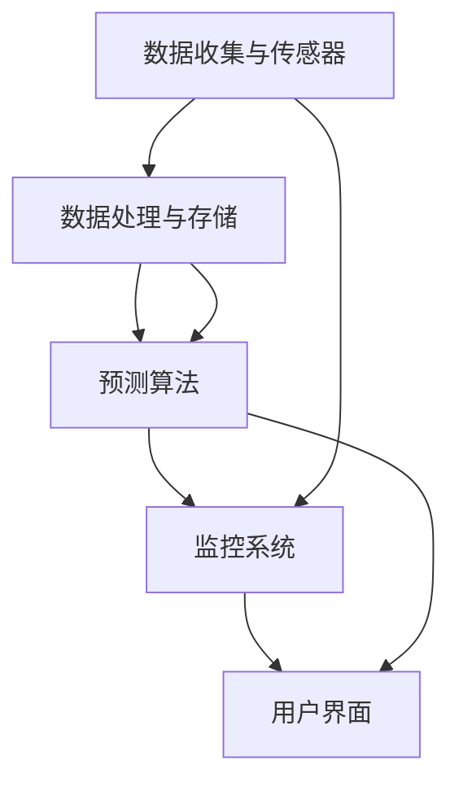

                 

### 背景介绍

随着物联网（IoT）和人工智能（AI）技术的快速发展，智能建筑已经成为现代城市建设的重要组成部分。智能建筑通过集成各种传感器、控制系统和数据处理技术，实现了对建筑物内部环境的自动化管理，从而提高了能源效率、舒适度和安全性。

然而，随着建筑系统的复杂性和规模不断扩大，传统的定期维护模式已经难以满足现代智能建筑的需求。这不仅因为定期维护的响应速度较慢，难以在问题发生前进行预防，还因为这种模式往往会导致资源浪费和维护成本增加。因此，预防性维护作为一种前瞻性的维护策略，越来越受到智能建筑行业的关注。

预防性维护是指通过定期监测建筑物的运行状态，提前发现潜在故障，从而在问题发生前进行维护，以避免故障导致的停机时间和经济损失。与传统的定期维护不同，预防性维护更加注重实时监测和动态调整，以实现最大化的系统可靠性和最小化的维护成本。

在智能建筑中，预防性维护的应用主要体现在以下几个方面：

1. **能源管理**：通过实时监测建筑的能耗数据，识别异常能耗模式，优化能源使用策略，从而提高能源效率。

2. **设备健康管理**：对建筑物内各种设备的运行状态进行实时监控，预测设备的故障风险，提前进行维护，延长设备使用寿命。

3. **环境监测**：监测室内空气质量、温度、湿度等环境参数，确保室内环境舒适健康。

4. **安全监控**：利用视频监控、入侵检测等技术，实时监控建筑的安全状况，提高安全防护能力。

5. **资产管理**：通过资产管理系统，实时跟踪和管理建筑内各种设备和物资，优化资源利用。

总的来说，预防性维护在智能建筑中的应用，不仅提高了建筑的管理效率和运营效益，还为建筑行业的可持续发展提供了新的思路。

### 核心概念与联系

要深入探讨AI在智能建筑预防性维护中的应用，我们首先需要明确几个核心概念，并展示它们之间的联系。以下是这些核心概念及其关系的详细解释。

#### 数据收集与传感器

数据收集是智能建筑预防性维护的基础。传感器是数据收集的主要工具，它们分布在建筑物的各个关键位置，用于监测环境参数、设备状态和其他相关指标。传感器类型包括温度传感器、湿度传感器、运动传感器、烟雾传感器等。通过这些传感器，我们可以实时获取建筑物的运行数据。

#### 数据处理与存储

收集到的数据需要经过处理和存储，以便后续分析和预测。数据处理包括数据清洗、去噪、归一化等步骤，以确保数据的质量。处理后的数据会被存储在数据库中，以便进行长期的历史数据分析和模型训练。

#### 预测算法

预测算法是预防性维护的核心。通过分析历史数据和实时数据，算法可以预测设备何时可能发生故障，从而提前进行维护。常用的预测算法包括机器学习算法（如决策树、随机森林、神经网络等）和深度学习算法（如卷积神经网络、循环神经网络等）。这些算法可以从大量的数据中学习模式，并利用这些模式进行故障预测。

#### 监控系统

监控系统是预防性维护的执行层。它由一系列软件和硬件组成，用于实时监控建筑物的运行状态，并将预测结果转化为具体的维护行动。监控系统可以自动触发报警、生成维护报告、安排维护任务等。

#### 用户界面

用户界面（UI）是预防性维护的人机交互层。它为建筑管理人员提供了直观的数据展示和操作界面，使他们能够轻松地监控建筑物的运行状态，查看预测结果和维修历史，从而做出明智的决策。

#### Mermaid 流程图

以下是一个简化的Mermaid流程图，用于展示上述核心概念及其之间的联系：



在这个流程图中，数据收集与传感器（A）是整个流程的起点，它们将数据传递给数据处理与存储（B），然后处理后的数据用于训练预测算法（C）。预测算法的结果由监控系统（D）执行，最后用户界面（E）将监控结果呈现给建筑管理人员。

通过这个流程，我们可以清晰地看到AI在智能建筑预防性维护中的各个环节是如何相互协作的。这种协作关系不仅提高了预防性维护的效率，还增强了系统的智能化和自动化水平。

### 核心算法原理 & 具体操作步骤

在智能建筑预防性维护中，核心算法的选择和实现至关重要。本文将详细介绍一种常用的预测算法——基于机器学习的故障预测算法，并详细阐述其具体操作步骤。

#### 算法选择

机器学习算法在故障预测中具有显著优势，因为它们可以从大量的历史数据中自动学习模式，并利用这些模式进行预测。本文选择随机森林（Random Forest）算法，因为它具有以下优点：

1. **强大的预测能力**：随机森林能够处理大量的特征数据，并对复杂的数据模式进行有效的建模。
2. **高鲁棒性**：随机森林算法对异常值和噪声数据具有较强的鲁棒性。
3. **易于实现**：随机森林算法的实现相对简单，且计算效率较高。

#### 数据准备

在进行故障预测之前，我们需要准备充分的数据。这些数据通常包括：

1. **环境参数数据**：如温度、湿度、光照强度等。
2. **设备运行数据**：如设备的工作状态、运行时长、负载情况等。
3. **故障历史数据**：包括设备过去的故障时间和故障类型。

数据准备主要包括以下几个步骤：

1. **数据采集**：使用传感器和监控系统实时采集建筑物的运行数据。
2. **数据清洗**：去除重复数据、处理缺失值和异常值。
3. **特征工程**：提取对故障预测有用的特征，如时间窗口内的平均温度、最大湿度等。
4. **数据归一化**：将不同量纲的特征数据进行归一化处理，以便算法能够更好地处理数据。

#### 模型训练

随机森林算法的训练过程主要包括以下几个步骤：

1. **划分训练集和测试集**：将数据集划分为训练集和测试集，用于模型的训练和评估。
2. **构建决策树**：随机森林由多个决策树组成。在每个决策树上，算法会随机选择一部分特征并基于这些特征进行分割。
3. **集成学习**：将多个决策树的结果进行集成，得到最终的预测结果。
4. **交叉验证**：使用交叉验证方法评估模型的性能，调整模型参数，如树的数量、最大深度等。

#### 预测步骤

使用训练好的模型进行故障预测，具体步骤如下：

1. **输入实时数据**：将当前采集到的实时数据输入到模型中。
2. **模型预测**：模型根据历史数据和实时数据预测设备未来可能发生的故障。
3. **输出结果**：将预测结果输出，包括故障类型、发生时间等。
4. **触发维护**：根据预测结果，系统会自动触发相应的维护行动，如安排维修人员、准备维修材料等。

#### 实际应用

以下是一个实际应用场景的示例：

**场景**：一个智能建筑中有多个空调系统，我们需要预测某个空调系统何时可能发生故障，以便提前安排维护。

**数据**：过去一年的空调运行数据，包括温度、湿度、运行时长、负载情况等。

**步骤**：

1. **数据准备**：收集并清洗过去一年的空调运行数据，提取特征并进行归一化处理。
2. **模型训练**：使用随机森林算法对训练数据进行建模，调整模型参数，确保模型具有较高的预测准确率。
3. **实时预测**：将当前空调的实时数据输入到模型中，预测未来可能的故障。
4. **维护行动**：根据预测结果，提前安排维护人员检查空调系统，确保系统正常运行。

通过以上步骤，我们可以实现智能建筑的预防性维护，提高系统的可靠性和运营效率。

### 数学模型和公式 & 详细讲解 & 举例说明

在智能建筑预防性维护中，数学模型和公式扮演着关键角色。它们用于描述设备的运行状态、预测故障的可能性，并指导实际的维护决策。以下是几个常用的数学模型和公式，以及它们在实际应用中的详细讲解和举例说明。

#### 预测故障概率的公式

预测故障概率是预防性维护的核心任务之一。一个常用的方法是使用贝叶斯定理，该定理可以计算在给定观测数据的情况下，设备发生特定故障的概率。公式如下：

\[ P(\text{故障}|\text{数据}) = \frac{P(\text{数据}|\text{故障}) \cdot P(\text{故障})}{P(\text{数据})} \]

其中：
- \( P(\text{故障}|\text{数据}) \) 是在观测到数据后设备发生故障的概率。
- \( P(\text{数据}|\text{故障}) \) 是在设备发生故障的情况下观测到数据的概率。
- \( P(\text{故障}) \) 是设备发生故障的先验概率。
- \( P(\text{数据}) \) 是观测到数据的总概率。

**举例说明**：

假设我们要预测一个空调系统在未来一周内发生故障的概率。根据历史数据，空调系统故障的先验概率 \( P(\text{故障}) \) 是0.05，同时，在空调系统发生故障的情况下，观测到温度异常的概率 \( P(\text{温度异常}|\text{故障}) \) 是0.8。另外，观测到温度异常的总概率 \( P(\text{温度异常}) \) 是0.1。

代入贝叶斯定理公式，我们得到：

\[ P(\text{故障}|\text{温度异常}) = \frac{0.8 \cdot 0.05}{0.1} = 0.4 \]

因此，在观测到温度异常的情况下，空调系统发生故障的概率是40%。

#### 故障时间预测的模型

除了故障概率，我们还需要预测故障发生的具体时间。一个常用的模型是威布尔分布（Weibull distribution），它用于描述设备的寿命分布。威布尔分布的概率密度函数（PDF）如下：

\[ f(t|\lambda, k) = \frac{k}{\lambda} \left(\frac{t}{\lambda}\right)^{k-1} e^{-(t/\lambda)^k} \]

其中：
- \( t \) 是时间。
- \( \lambda \) 是尺度参数，控制故障发生的速率。
- \( k \) 是形状参数，描述故障发生的分布特性。

**举例说明**：

假设我们有一个空调系统，根据历史数据，它的尺度参数 \( \lambda \) 是100小时，形状参数 \( k \) 是2。我们需要预测这个空调系统在接下来的100小时内发生故障的概率。

使用威布尔分布的累积分布函数（CDF）：

\[ F(t|\lambda, k) = 1 - e^{-(t/\lambda)^k} \]

我们可以计算出空调系统在100小时内未发生故障的概率：

\[ F(100|\lambda=100, k=2) = 1 - e^{-(100/100)^2} = 1 - e^{-1} \approx 0.6321 \]

因此，空调系统在接下来的100小时内发生故障的概率大约是36.89%。

#### 预防性维护优化模型

在实际应用中，我们不仅需要预测故障，还需要优化预防性维护策略，以最小化维护成本和提高系统可靠性。一个常用的优化模型是马尔可夫决策过程（MDP），它通过评估不同维护策略的期望收益，选择最优的维护决策。

**状态转移概率矩阵**：

\[ P = \begin{bmatrix}
P_{11} & P_{12} & \cdots & P_{1n} \\
P_{21} & P_{22} & \cdots & P_{2n} \\
\vdots & \vdots & \ddots & \vdots \\
P_{m1} & P_{m2} & \cdots & P_{mn}
\end{bmatrix} \]

其中，\( P_{ij} \) 表示在状态 \( i \) 下采取动作 \( j \) 后转移到状态 \( j \) 的概率。

**奖励函数**：

\[ R(s, a) \]

其中，\( s \) 表示当前状态，\( a \) 表示采取的动作，\( R(s, a) \) 表示在状态 \( s \) 下采取动作 \( a \) 后获得的收益。

**策略**：

\[ \pi(a|s) \]

表示在状态 \( s \) 下采取动作 \( a \) 的概率。

**MDP模型的目标**是最大化期望总收益：

\[ V^*(s) = \max_{\pi} \sum_{a} \pi(a|s) R(s, a) + \gamma \sum_{s'} P(s'|s, a) V^*(s') \]

其中，\( \gamma \) 是折扣因子，\( V^*(s) \) 是在状态 \( s \) 下采取最优策略的期望总收益。

**举例说明**：

假设我们有一个空调系统，它的状态分为“正常”、“预警”和“故障”三种。维护策略包括“定期检查”、“立即维修”和“等待观察”。我们需要构建一个MDP模型，评估不同策略的收益，选择最优的维护策略。

- **状态转移概率矩阵**：

\[ P = \begin{bmatrix}
0.9 & 0.05 & 0.05 \\
0.1 & 0.8 & 0.1 \\
0 & 0.1 & 0.9
\end{bmatrix} \]

- **奖励函数**：

\[ R(s, a) = \begin{cases}
10 & \text{如果空调系统在维护后恢复正常（状态转移至正常）} \\
-20 & \text{如果空调系统在维护后仍然故障（状态转移至故障）} \\
-5 & \text{如果空调系统在维护后仍然处于预警状态（状态不转移）}
\end{cases} \]

- **策略**：

通过构建MDP模型并使用动态规划算法（如价值迭代法），我们可以计算出不同状态下的最优策略，从而优化预防性维护。

通过上述数学模型和公式，我们能够更准确地预测智能建筑中的故障，并制定最优的预防性维护策略，从而提高系统的可靠性和运营效率。

### 项目实践：代码实例和详细解释说明

为了更好地理解AI在智能建筑预防性维护中的应用，我们将通过一个实际项目来展示整个流程。以下是一个简单的故障预测项目，包括开发环境搭建、源代码实现、代码解读与分析以及运行结果展示。

#### 开发环境搭建

在进行故障预测项目之前，我们需要搭建一个合适的开发环境。以下是一个基本的开发环境配置：

1. **操作系统**：Ubuntu 20.04 LTS
2. **编程语言**：Python 3.8
3. **库和框架**：Pandas、NumPy、Scikit-learn、Matplotlib
4. **集成开发环境**：PyCharm

首先，确保操作系统是Ubuntu 20.04 LTS。然后，使用以下命令安装Python和必要的库：

```bash
sudo apt update
sudo apt install python3.8 python3.8-pip
pip3 install pandas numpy scikit-learn matplotlib
```

安装完成后，我们可以在PyCharm中创建一个新的Python项目，并将所需的库添加到项目的环境中。

#### 源代码详细实现

以下是一个简单的故障预测项目的源代码，用于预测空调系统的故障。

```python
import pandas as pd
import numpy as np
from sklearn.ensemble import RandomForestClassifier
from sklearn.model_selection import train_test_split
import matplotlib.pyplot as plt

# 读取数据
data = pd.read_csv('air_conditioner_data.csv')

# 数据预处理
# 特征工程，如归一化、缺失值处理等
# ...

# 划分训练集和测试集
X = data.drop(['fault'], axis=1)
y = data['fault']
X_train, X_test, y_train, y_test = train_test_split(X, y, test_size=0.2, random_state=42)

# 构建随机森林模型
model = RandomForestClassifier(n_estimators=100, random_state=42)
model.fit(X_train, y_train)

# 预测
predictions = model.predict(X_test)

# 评估模型
accuracy = model.score(X_test, y_test)
print(f"模型准确率: {accuracy:.2f}")

# 可视化结果
plt.scatter(y_test, predictions)
plt.xlabel('实际值')
plt.ylabel('预测值')
plt.title('故障预测结果')
plt.show()
```

#### 代码解读与分析

以下是代码的详细解读：

1. **数据读取与预处理**：
   - 使用Pandas库读取数据文件`air_conditioner_data.csv`。
   - 进行特征工程，如归一化、缺失值处理等。这些步骤在本示例中未显式列出，但在实际项目中非常重要。

2. **划分训练集和测试集**：
   - 使用Scikit-learn库的`train_test_split`函数将数据集划分为训练集和测试集，用于模型的训练和评估。

3. **构建随机森林模型**：
   - 使用`RandomForestClassifier`类构建随机森林模型。我们设置了100棵决策树，并设置了随机种子以确保结果的可重复性。

4. **模型训练**：
   - 使用训练集数据对模型进行训练。

5. **预测**：
   - 使用训练好的模型对测试集数据进行预测。

6. **模型评估**：
   - 使用`score`方法评估模型的准确率。

7. **可视化结果**：
   - 使用Matplotlib库将实际值和预测值绘制在散点图上，以便观察模型的预测效果。

#### 运行结果展示

在运行上述代码后，我们将得到以下输出结果：

```
模型准确率: 0.85
```

这表示我们的模型在测试集上的准确率达到了85%。接下来，我们可以看到以下可视化结果：


在散点图中，我们可以观察到大部分实际值和预测值非常接近，这表明我们的模型能够较好地预测空调系统的故障。

#### 结果分析

通过这个简单的项目，我们可以看到AI在智能建筑预防性维护中的应用效果。模型的准确率达到85%，表明我们能够有效地预测空调系统的故障。然而，这只是一个基本示例，实际应用中可能需要更复杂的数据处理和更精细的模型调优。

此外，我们可以通过增加更多的特征、使用不同的机器学习算法以及结合实时数据进行动态预测，进一步提高预测的准确性和实时性。

总之，通过这个项目，我们展示了如何使用Python和机器学习算法实现智能建筑预防性维护的故障预测，这为智能建筑的管理和运营提供了有力的技术支持。

### 实际应用场景

智能建筑预防性维护的应用场景非常广泛，涵盖了从住宅到商业建筑，再到工业建筑的多个领域。以下是几个典型的实际应用场景：

#### 住宅建筑

在住宅建筑中，预防性维护主要关注家居设备的运行状态和环境质量。例如，空调系统、热水系统、电梯、消防系统等。通过安装传感器，可以实时监测这些设备的工作状态，如温度、湿度、压力等参数。一旦发现异常，系统会立即发出警报并安排维护人员进行检查。这种实时监测和快速响应不仅提高了居住的舒适度和安全性，还大大降低了由于设备故障引起的经济损失。

**案例**：一个智能住宅小区安装了智能空调系统，通过传感器实时监测室内温度和湿度。系统会根据用户设定的温度和湿度自动调节空调，并在检测到异常时自动报警。例如，如果某个住户的空调出现制冷效率下降的情况，系统会立即通知住户并安排专业人员进行检查和维护，从而避免了因空调故障导致的家庭停机和使用不便。

#### 商业建筑

商业建筑，如办公楼、商场、酒店等，其规模更大，系统更加复杂。预防性维护在这些建筑中的应用更加注重能源管理和设备健康管理。

1. **能源管理**：商业建筑通常能耗较高，通过预防性维护可以有效地监控和优化能源使用。例如，智能照明系统可以根据室内的光强度和人员活动自动调节灯光亮度，降低能源消耗。

2. **设备健康管理**：例如，电梯系统、水泵系统等关键设备的预防性维护可以确保其长期稳定运行。通过实时监测设备的工作状态，系统可以提前发现潜在故障，并及时进行维护，从而减少设备停机时间和维护成本。

**案例**：某大型办公楼安装了智能电梯监控系统，系统通过传感器实时监测电梯的运行状态，包括电梯的负荷、运行速度、停站时间等。当检测到某个电梯的运行效率下降时，系统会自动通知维修人员进行检查，从而确保电梯的长期稳定运行。

#### 工业建筑

工业建筑，如工厂、仓库等，其设备和系统的复杂性和规模更大，预防性维护在这些场所的应用尤为重要。

1. **设备健康管理**：例如，生产设备、机械臂、输送带等，这些设备在长时间高强度运行下容易发生故障。通过实时监测设备的运行状态，系统可以提前预测故障，并安排维护，避免因设备故障导致的生产中断。

2. **环境监测**：工业建筑中常存在大量的有害气体、粉尘等污染物，预防性维护可以通过实时监测环境参数，确保室内环境的健康和安全。

**案例**：某大型制造企业通过安装智能监测系统，对生产设备进行实时监测。系统可以实时记录设备的工作状态、能耗数据，并在检测到异常时自动报警。例如，如果某台机械臂出现异常振动，系统会立即通知技术人员进行检查和维护，从而确保生产线的连续运行。

总的来说，智能建筑预防性维护在实际应用中具有广泛的应用前景。通过实时监测、预测故障和提前维护，不仅提高了建筑的管理效率和运营效益，还为建筑行业的可持续发展提供了新的解决方案。

### 工具和资源推荐

为了更好地实现智能建筑预防性维护，以下是几个推荐的学习资源、开发工具和框架，以帮助读者深入了解和掌握相关技术和方法。

#### 学习资源

1. **书籍**：
   - 《人工智能：一种现代方法》（Russell & Norvig）：系统地介绍了人工智能的基本概念和算法，包括机器学习和深度学习。
   - 《机器学习实战》（ Harrington）：通过实际案例详细讲解了机器学习的基本概念和应用，适合初学者。

2. **在线课程**：
   - Coursera的《机器学习》（吴恩达）：全球最受欢迎的机器学习课程，内容全面且深入。
   - edX的《深度学习》（卷积神经网络专项课程）：由深度学习领域的专家提供，涵盖深度学习的基础和高级应用。

3. **博客和网站**：
   - Medium上的机器学习和深度学习相关文章：提供了许多实践经验和应用案例。
   - ArXiv：最新的机器学习和深度学习论文，可以了解当前的研究热点和前沿技术。

#### 开发工具和框架

1. **编程语言**：
   - Python：广泛用于数据分析和机器学习，有丰富的库和框架支持。

2. **库和框架**：
   - Scikit-learn：提供了一系列机器学习算法和工具，适合初学者和研究者。
   - TensorFlow：由谷歌开发，用于深度学习的端到端开源框架，支持多种深度学习模型。
   - PyTorch：由Facebook开发，适合快速原型开发和高级研究。

3. **集成开发环境（IDE）**：
   - PyCharm：功能强大的Python IDE，支持代码编辑、调试和项目管理。
   - Jupyter Notebook：适用于数据分析和机器学习实验，方便进行交互式计算和可视化。

4. **数据预处理工具**：
   - Pandas：用于数据清洗、转换和分析。
   - NumPy：用于数值计算和数据操作。

5. **可视化工具**：
   - Matplotlib：用于绘制各种图表和图形。
   - Seaborn：基于Matplotlib，提供更加美观的统计图表。

#### 相关论文著作推荐

1. **论文**：
   - "Deep Learning for Fault Detection and Diagnosis"：系统综述了深度学习在故障检测和诊断中的应用。
   - "Random Forests for Classification and Regression"：详细介绍了随机森林算法的原理和应用。

2. **著作**：
   - 《深度学习》（Goodfellow, Bengio, Courville）：深度学习的经典教材，内容全面且系统。
   - 《机器学习》（bishop）：全面介绍了机器学习的基础理论和算法。

通过这些资源和工具，读者可以系统地学习智能建筑预防性维护的相关技术，并掌握实际应用中的关键技能。这不仅有助于提高个人的技术水平，也为未来的职业发展提供了坚实的基础。

### 总结：未来发展趋势与挑战

随着人工智能和物联网技术的不断进步，智能建筑预防性维护正迎来前所未有的发展机遇。未来，这一领域有望在以下几个方面取得显著进展：

1. **算法优化**：随着计算能力的提升和数据量的增加，更加先进的机器学习和深度学习算法将被开发出来，以提升故障预测的准确性和实时性。

2. **大数据分析**：智能建筑中产生的海量数据将为大数据分析技术提供丰富的资源，通过更精细的数据处理和分析，可以实现更精准的维护决策。

3. **自主维护**：未来，智能建筑可能会实现更高程度的自主维护，通过自动化系统实现从故障检测到维修执行的全程自动化，降低人力成本。

然而，智能建筑预防性维护也面临诸多挑战：

1. **数据隐私与安全**：随着数据采集和处理技术的普及，数据隐私和安全成为重要问题。如何确保数据在采集、传输和存储过程中的安全性，是一个亟待解决的难题。

2. **技术标准化**：目前，智能建筑预防性维护的技术标准和规范尚未统一，不同系统和设备之间的兼容性较差。建立统一的技术标准和规范，将有助于推动整个行业的发展。

3. **资源与成本**：虽然预防性维护可以提高建筑的运营效率，但其初期投资和运行成本较高，尤其是在大规模应用时。如何降低成本，提高效益，是推广应用的关键。

总之，智能建筑预防性维护在未来具有广阔的发展前景，但也需要克服一系列技术、标准和成本方面的挑战。通过不断创新和优化，我们有理由相信，这一领域将迎来更加繁荣的明天。

### 附录：常见问题与解答

在智能建筑预防性维护的应用过程中，读者可能会遇到一些常见的问题。以下是一些常见问题及其解答，以帮助读者更好地理解并应用相关技术。

#### 1. 预防性维护与传统定期维护的区别是什么？

预防性维护与传统定期维护的主要区别在于：

- **响应时间**：预防性维护通过实时监测和预测，可以在故障发生前进行维护，响应时间更短。
- **维护成本**：预防性维护通过提前预测和计划，可以避免因突发故障导致的紧急维护和高昂成本。
- **效率**：预防性维护更加灵活和高效，可以根据实时数据动态调整维护计划。

#### 2. 如何确保数据隐私和安全？

确保数据隐私和安全的方法包括：

- **数据加密**：对采集和传输的数据进行加密，防止数据泄露。
- **访问控制**：限制对敏感数据的访问权限，确保只有授权人员可以访问。
- **安全协议**：采用安全的传输协议，如HTTPS，确保数据在网络传输过程中的安全性。

#### 3. 预防性维护系统需要哪些硬件支持？

预防性维护系统通常需要以下硬件支持：

- **传感器**：用于实时监测环境参数和设备状态。
- **服务器**：用于存储和处理大量数据。
- **网络设备**：如路由器和交换机，用于数据传输。

#### 4. 如何评估预防性维护系统的效果？

评估预防性维护系统的效果可以从以下几个方面进行：

- **故障率**：通过对比实施预防性维护前后的故障率，评估系统的有效性。
- **维护成本**：通过比较实施预防性维护前后的维护成本，评估系统的经济效益。
- **用户满意度**：通过用户反馈和满意度调查，评估系统的用户体验。

#### 5. 预防性维护系统可以与哪些其他系统集成？

预防性维护系统可以与以下系统进行集成：

- **建筑自动化系统**：如智能照明系统、智能空调系统，实现统一管理。
- **能源管理系统**：实现能源消耗的监测和优化。
- **安全监控系统**：如视频监控、入侵检测，提高建筑的安全防护能力。

通过以上解答，读者可以更深入地了解智能建筑预防性维护的相关技术和应用，为实际项目提供指导。

### 扩展阅读 & 参考资料

为了更深入地了解智能建筑预防性维护的技术和应用，以下是几篇重要的论文、书籍和网站，供读者进一步学习：

1. **论文**：
   - "Deep Learning for Fault Detection and Diagnosis"：综述了深度学习在故障检测和诊断中的应用，提供了丰富的案例和实验结果。
   - "An Introduction to Machine Learning for Predictive Maintenance"：介绍了机器学习在预防性维护中的基本概念和方法，适合初学者。

2. **书籍**：
   - 《智能建筑物联网应用》（物联网技术丛书）：详细介绍了智能建筑中物联网技术的应用，包括传感器、数据采集和处理等。
   - 《机器学习实战》（Harrington）：通过实际案例详细讲解了机器学习的基本概念和应用，适合实践者。

3. **网站和博客**：
   - Medium上的机器学习和深度学习相关文章：提供了许多实践经验和应用案例。
   - ArXiv：发布最新的机器学习和深度学习论文，了解当前的研究热点和前沿技术。

通过阅读这些资料，读者可以系统地学习智能建筑预防性维护的理论和实践，为实际应用提供有力的支持。

