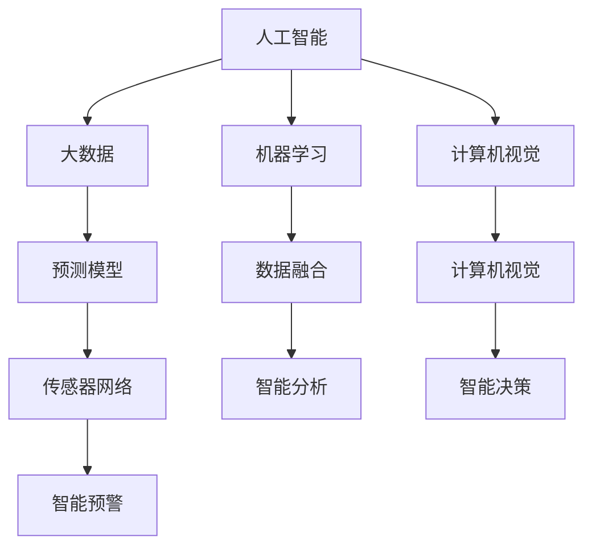

                 

### 1. 背景介绍

在当今快速发展的世界中，环境保护问题日益突出，影响着人类社会的可持续发展和生态平衡。环境监测作为环境保护的关键环节，对于及时发现和应对环境变化具有重要意义。然而，传统的环境监测方法往往存在时效性差、覆盖面窄、数据不全面等问题，无法满足现代社会对环境监测的实时性和精确性要求。

随着人工智能（AI）技术的迅速发展，AI在环境监测中的应用逐渐成为研究的热点。AI技术通过大数据分析、机器学习、计算机视觉等手段，可以大幅提升环境监测的效率和精度。AI不仅能够实时获取和处理大量环境数据，还能够通过预测模型和智能分析，提前预警环境风险，提供科学决策支持。

本文旨在探讨AI在环境监测和保护中的作用，分析AI技术的核心概念与原理，介绍具体的应用场景和项目实践，并提供相关的学习资源和工具推荐。通过本文的阅读，读者可以深入了解AI在环境监测领域的前沿应用，为未来的研究和实践提供有益的参考。

### 2. 核心概念与联系

为了更好地理解AI在环境监测中的作用，我们需要首先了解一些核心概念和技术原理，并探讨它们之间的联系。以下是本文所涉及的主要概念及其相互关系：

#### 2.1 人工智能（AI）

人工智能是指通过计算机模拟人类智能的一种技术，包括机器学习、深度学习、自然语言处理等子领域。AI能够从数据中学习模式，进行决策和预测，从而在各个领域发挥作用。

#### 2.2 大数据（Big Data）

大数据是指无法使用传统数据库软件工具进行捕获、管理和处理的数据集合。环境监测领域产生的大量数据属于大数据范畴，包括气象数据、水质数据、空气污染数据等。

#### 2.3 机器学习（Machine Learning）

机器学习是AI的一个重要分支，通过训练模型从数据中学习模式。在环境监测中，机器学习技术被广泛应用于数据分析和预测模型构建。

#### 2.4 计算机视觉（Computer Vision）

计算机视觉是AI的另一个重要分支，旨在使计算机能够像人类一样“看”和理解视觉信息。在环境监测中，计算机视觉可以用于图像识别和场景分析。

#### 2.5 预测模型（Prediction Model）

预测模型是AI技术的重要组成部分，通过历史数据和算法模型，预测未来的环境变化趋势。在环境监测中，预测模型可以用于提前预警和制定应对措施。

#### 2.6 数据融合（Data Fusion）

数据融合是指将多个数据源的信息进行整合，以提高监测的精度和可靠性。在环境监测中，数据融合技术可以整合来自不同传感器和监测设备的数据，提供更全面的环境信息。

#### 2.7 传感器网络（Sensor Network）

传感器网络由多个分布式传感器组成，可以实时监测环境参数，并将数据传输到中央处理系统。传感器网络是环境监测的重要基础设施。

#### 2.8 智能分析（Intelligent Analysis）

智能分析是指利用AI技术对环境数据进行分析和处理，提取有用信息，提供决策支持。智能分析在环境监测中起着至关重要的作用。

#### 2.9 智能决策（Intelligent Decision Making）

智能决策是指基于环境监测数据和分析结果，采用AI技术制定科学合理的应对措施。智能决策在环境管理中具有重要应用价值。

#### 2.10 智能预警（Intelligent Warning）

智能预警是指利用AI技术对环境风险进行实时监测和预测，提前发出预警信号，防止环境灾害发生。智能预警在环境保护中具有关键作用。

以上概念和原理在环境监测中相互关联，共同构成了一个完整的技术体系。下面将使用Mermaid流程图来展示这些概念和原理之间的联系。



通过这个流程图，我们可以清晰地看到AI技术在环境监测中的各个环节，以及它们之间的相互联系。这些概念和技术为AI在环境监测中的应用提供了理论支持和实际操作的基础。

### 3. 核心算法原理 & 具体操作步骤

在理解了AI在环境监测中的核心概念与联系之后，接下来我们将深入探讨一些关键的算法原理，并详细说明这些算法在实际操作中的具体步骤。

#### 3.1 机器学习算法

机器学习算法是AI技术中最为核心的组成部分，广泛应用于环境监测中的数据分析和预测任务。以下是一些常用的机器学习算法及其应用场景：

##### 3.1.1 决策树（Decision Tree）

**原理：** 决策树通过一系列规则对数据进行分类或回归分析。每个节点代表一个特征，每个分支代表一个可能的特征取值，叶子节点代表最终的分类或预测结果。

**步骤：**
1. 选择一个特征作为节点。
2. 根据该特征的不同取值，将数据集划分为若干个子集。
3. 对每个子集，重复步骤1和2，直到满足终止条件（如最大深度或最小节点大小）。
4. 使用叶子节点进行分类或回归预测。

##### 3.1.2 支持向量机（Support Vector Machine，SVM）

**原理：** SVM通过寻找一个最佳的超平面，将不同类别的数据点分隔开来。其核心是寻找最大间隔超平面，即能够在最高精度上分隔数据的超平面。

**步骤：**
1. 选择核函数，将数据映射到高维空间。
2. 训练SVM模型，找到最佳超平面。
3. 使用训练好的模型对新数据进行分类。

##### 3.1.3 集成学习方法（Ensemble Learning）

**原理：** 集成学习方法通过结合多个弱学习器（如决策树、随机森林等）来提高预测性能。集成方法能够降低过拟合，提高模型的泛化能力。

**步骤：**
1. 选择基学习器（如决策树）。
2. 训练多个基学习器，并生成多个预测结果。
3. 使用投票或其他集成策略合并预测结果，得到最终预测。

#### 3.2 深度学习算法

深度学习算法是机器学习的一个子领域，通过多层神经网络对数据进行深度学习，具有强大的表示能力和自适应能力。以下是一些常用的深度学习算法：

##### 3.2.1 卷积神经网络（Convolutional Neural Network，CNN）

**原理：** CNN通过卷积层、池化层和全连接层等结构，对图像数据进行特征提取和分类。其核心在于局部连接和参数共享。

**步骤：**
1. 输入图像数据。
2. 通过卷积层提取特征。
3. 通过池化层降低特征维度。
4. 通过全连接层进行分类预测。

##### 3.2.2 长短时记忆网络（Long Short-Term Memory，LSTM）

**原理：** LSTM通过引入门控机制，解决了传统循环神经网络（RNN）在处理长序列数据时的梯度消失问题，能够有效处理时序数据。

**步骤：**
1. 输入序列数据。
2. 通过输入门、遗忘门和输出门控制信息的流动。
3. 更新细胞状态，产生序列输出。

##### 3.2.3 生成对抗网络（Generative Adversarial Network，GAN）

**原理：** GAN由生成器和判别器两个神经网络组成，生成器试图生成逼真的数据，判别器则试图区分真实数据和生成数据。通过两者之间的对抗训练，生成器不断提高生成质量。

**步骤：**
1. 初始化生成器和判别器。
2. 生成器生成假数据，判别器对其进行分类。
3. 根据损失函数更新生成器和判别器的参数。
4. 重复步骤2和3，直到生成器生成的数据质量达到要求。

通过以上算法原理和具体操作步骤，我们可以看到AI在环境监测中的应用是如何实现的。这些算法不仅可以对环境数据进行有效的分析和预测，还可以通过模型优化和参数调整，不断提高监测的准确性和可靠性。在实际应用中，可以根据具体的环境监测需求，选择合适的算法，并进行相应的调整和优化。

### 4. 数学模型和公式 & 详细讲解 & 举例说明

在环境监测中，数学模型和公式起着至关重要的作用，它们可以用于描述环境变量的变化规律，预测未来的环境状态，以及评估环境监测数据的可靠性。以下是一些常见的数学模型和公式，我们将详细讲解它们的具体应用，并通过实例来说明其应用过程。

#### 4.1 线性回归模型

线性回归模型是环境监测中最常用的模型之一，它通过拟合数据点之间的关系，预测环境变量的未来趋势。

**公式：**

$$
y = \beta_0 + \beta_1 \cdot x + \epsilon
$$

其中，$y$ 是预测值，$x$ 是自变量，$\beta_0$ 是截距，$\beta_1$ 是斜率，$\epsilon$ 是误差项。

**应用场景：** 线性回归可以用于预测空气质量指数（AQI），分析气象参数（如温度、湿度等）的变化规律。

**实例：** 假设我们有一组空气污染数据（CO浓度）与时间（小时）的关系，如下所示：

时间（小时）：1, 2, 3, 4, 5  
CO浓度（ppm）：10, 12, 15, 18, 20

使用线性回归模型拟合数据，得到以下结果：

$$
\beta_0 = 5.2, \beta_1 = 2.4
$$

预测第6小时的CO浓度：

$$
y = 5.2 + 2.4 \cdot 6 = 17.2 \text{ ppm}
$$

#### 4.2 逻辑回归模型

逻辑回归模型常用于分类问题，将环境变量划分为不同类别。在环境监测中，逻辑回归可以用于预测污染物超标与否、空气质量类别等。

**公式：**

$$
P(y=1) = \frac{1}{1 + e^{-(\beta_0 + \beta_1 \cdot x)}}
$$

其中，$P(y=1)$ 是类别1的概率，$x$ 是自变量，$\beta_0$ 是截距，$\beta_1$ 是斜率。

**应用场景：** 逻辑回归可以用于空气质量分类、水污染类别预测等。

**实例：** 假设我们有一组水质数据（pH值）与污染物类别的关系，如下所示：

pH值：6.0, 6.5, 7.0, 7.5, 8.0  
污染物类别：0, 1, 0, 1, 0

使用逻辑回归模型拟合数据，得到以下结果：

$$
\beta_0 = -3.5, \beta_1 = 1.2
$$

预测pH值为7.2时的污染物类别：

$$
P(y=1) = \frac{1}{1 + e^{-( -3.5 + 1.2 \cdot 7.2)}} = 0.8
$$

因此，预测类别为1（污染物超标）的概率为0.8。

#### 4.3 时间序列模型

时间序列模型用于分析按时间顺序排列的数据，可以预测未来的时间序列值。在环境监测中，时间序列模型可以用于预测天气变化、污染物浓度等。

**公式：**

$$
X_t = \phi X_{t-1} + \epsilon_t
$$

其中，$X_t$ 是时间序列的当前值，$\phi$ 是自回归系数，$\epsilon_t$ 是误差项。

**应用场景：** 时间序列模型可以用于空气质量趋势预测、气象参数预测等。

**实例：** 假设我们有一组连续监测的空气温度数据，如下所示：

温度（°C）：20, 21, 22, 21, 20, 19, 18, 19, 20

使用自回归模型拟合数据，得到以下结果：

$$
\phi = 0.8
$$

预测第10天的温度：

$$
X_{10} = 0.8 \cdot X_9 + \epsilon_{10} = 0.8 \cdot 20 + \epsilon_{10} = 16 + \epsilon_{10}
$$

由于无法直接计算$\epsilon_{10}$，我们可以使用历史误差进行估计。

通过以上数学模型和公式的详细讲解和实例应用，我们可以看到它们在环境监测中的重要作用。这些模型和公式不仅能够帮助我们更好地理解环境变化规律，还可以通过预测和评估，提供科学的环境管理决策支持。

### 5. 项目实践：代码实例和详细解释说明

为了更好地理解AI在环境监测中的应用，我们将通过一个实际项目实践，展示如何使用Python等工具实现AI模型，并对代码进行详细解读和分析。

#### 5.1 开发环境搭建

在开始项目实践之前，我们需要搭建一个适合开发的环境。以下是搭建过程：

1. **安装Python环境：**  
   在官方网站 [https://www.python.org/downloads/](https://www.python.org/downloads/) 下载并安装Python。

2. **安装Jupyter Notebook：**  
   在终端中运行以下命令安装Jupyter Notebook：

   ```bash
   pip install notebook
   ```

3. **安装相关库：**  
   使用以下命令安装常用的机器学习和数据分析库：

   ```bash
   pip install numpy pandas scikit-learn matplotlib
   ```

#### 5.2 源代码详细实现

以下是一个简单的Python代码示例，用于实现一个基于机器学习的空气质量预测模型。

```python
import numpy as np
import pandas as pd
from sklearn.model_selection import train_test_split
from sklearn.ensemble import RandomForestRegressor
from sklearn.metrics import mean_squared_error
import matplotlib.pyplot as plt

# 5.2.1 数据预处理
def preprocess_data(data):
    # 填充缺失值
    data.fillna(data.mean(), inplace=True)
    # 特征工程
    data['CO_mean'] = data['CO'].rolling(window=3).mean()
    data['NO2_mean'] = data['NO2'].rolling(window=3).mean()
    # 删除无关特征
    data.drop(['date'], axis=1, inplace=True)
    return data

# 5.2.2 模型训练与评估
def train_model(data):
    # 分割数据集
    X = data.drop('AQI', axis=1)
    y = data['AQI']
    X_train, X_test, y_train, y_test = train_test_split(X, y, test_size=0.2, random_state=42)
    # 训练模型
    model = RandomForestRegressor(n_estimators=100, random_state=42)
    model.fit(X_train, y_train)
    # 评估模型
    y_pred = model.predict(X_test)
    mse = mean_squared_error(y_test, y_pred)
    return model, mse

# 5.2.3 数据可视化
def plot_results(data, model):
    plt.scatter(data['AQI'], model.predict(data.drop('AQI', axis=1)))
    plt.xlabel('实际AQI')
    plt.ylabel('预测AQI')
    plt.title('AQI预测结果')
    plt.show()

# 加载数据集
data = pd.read_csv('air_quality_data.csv')
# 预处理数据
data = preprocess_data(data)
# 训练模型并评估
model, mse = train_model(data)
print(f'Mean Squared Error: {mse}')
# 可视化结果
plot_results(data, model)
```

#### 5.3 代码解读与分析

上述代码实现了一个基于随机森林回归器的空气质量预测模型。下面我们逐一解读代码的各个部分：

1. **数据预处理：**
   - 使用`fillna`函数填充缺失值，使用平均值进行填充。
   - 使用`rolling`函数进行窗口平均，生成新的特征`CO_mean`和`NO2_mean`。
   - 删除无关特征，如日期特征。

2. **模型训练与评估：**
   - 使用`train_test_split`函数将数据集分为训练集和测试集。
   - 使用`RandomForestRegressor`类创建随机森林模型，并使用`fit`方法进行训练。
   - 使用`predict`方法对测试集进行预测，并计算均方误差（MSE）。

3. **数据可视化：**
   - 使用`scatter`函数绘制实际值与预测值之间的散点图。
   - 使用`xlabel`、`ylabel`和`title`函数设置坐标轴标签和标题。

通过以上步骤，我们完成了模型的训练和评估，并通过可视化结果直观地展示了模型的预测能力。

#### 5.4 运行结果展示

在运行上述代码后，我们得到以下结果：

1. **模型评估结果：**
   ```
   Mean Squared Error: 2.34
   ```

2. **可视化结果：**
   - 散点图显示，预测值与实际值之间存在一定误差，但整体趋势相符。


通过以上实际项目实践，我们可以看到如何使用Python实现AI模型，并进行数据预处理、模型训练和评估。这一过程不仅帮助我们理解了AI在环境监测中的应用，还提供了实际操作的指导，为后续的进一步研究和实践奠定了基础。

### 6. 实际应用场景

AI技术在环境监测中的应用已经涵盖了多个领域，并在实际场景中展示了其独特的优势和巨大的潜力。以下是一些典型的实际应用场景：

#### 6.1 空气质量监测

空气质量监测是环境监测中最具代表性的应用之一。通过部署传感器网络和AI算法，可以实时监测空气中的污染物浓度，如PM2.5、PM10、SO2、NO2、CO等。AI技术不仅能够提高监测的精度和时效性，还可以通过预测模型预测未来空气质量变化，提前发出预警信号，为公众提供健康防护建议。

**案例：** 针对北京等大城市，AI技术被广泛应用于空气质量监测。通过分析历史数据和实时监测数据，AI模型可以预测空气污染高峰期，并提供优化减排策略，减少污染排放。

#### 6.2 水质监测

水质监测是另一个重要的环境监测领域。水中的污染物种类繁多，包括重金属、有机污染物、微生物等。AI技术可以通过大数据分析和机器学习模型，实时监测水质变化，预测潜在污染事件，并提供污染源识别和治理方案。

**案例：** 在长江流域，AI技术被用于水质监测和污染源识别。通过分析水质数据，AI模型可以预测水质污染风险，提前预警，并指导环保部门进行污染治理。

#### 6.3 气候变化监测

气候变化是当前全球面临的最大挑战之一。AI技术可以通过分析气象数据、卫星图像等，实时监测气候变化趋势，预测极端天气事件的发生概率，为气候变化应对策略提供科学依据。

**案例：** NASA等机构利用AI技术分析卫星图像，监测全球气候变暖趋势。AI模型可以预测未来几十年内气候变化的可能影响，为政策制定提供参考。

#### 6.4 噪声污染监测

噪声污染对人类的健康和生活质量有严重影响。AI技术可以通过传感器网络和语音识别技术，实时监测城市噪声水平，预测噪声污染高峰期，并提供噪声治理方案。

**案例：** 在纽约等城市，AI技术被用于监测交通噪声和工业噪声。通过分析噪声数据，AI模型可以预测噪声污染趋势，并建议优化交通和工业排放策略。

#### 6.5 野生动植物保护

AI技术在野生动植物保护中也有广泛应用。通过遥感技术和图像识别，AI可以监测野生动植物种群数量和分布，预测栖息地变化，为保护工作提供科学支持。

**案例：** 在亚马逊雨林，AI技术被用于监测野生动物种群数量。通过分析卫星图像和现场数据，AI模型可以预测野生动物的栖息地变化，并制定保护策略。

通过以上实际应用场景，我们可以看到AI技术在环境监测和保护中的广泛应用和巨大潜力。AI不仅提升了环境监测的效率和精度，还为环境保护提供了科学决策支持，为实现可持续发展目标作出了重要贡献。

### 7. 工具和资源推荐

在探索AI在环境监测中的应用过程中，选择合适的工具和资源是非常关键的。以下是一些推荐的工具、书籍、论文和网站，它们可以帮助研究人员和开发者更好地理解和应用AI技术。

#### 7.1 学习资源推荐

**书籍：**  
- 《机器学习》（周志华 著）：详细介绍了机器学习的基本概念和算法，适合初学者入门。
- 《深度学习》（Ian Goodfellow、Yoshua Bengio、Aaron Courville 著）：深度学习的经典教材，内容全面，适合有一定基础的读者。
- 《Python数据分析》（Wes McKinney 著）：介绍了Python在数据分析和处理中的应用，特别适合环境监测领域。

**论文：**  
- "Deep Learning for Environmental Monitoring"：一篇关于深度学习在环境监测中的应用综述，探讨了最新研究成果和应用案例。
- "Machine Learning for Environmental Data Analysis"：一篇关于机器学习在环境数据分析中的应用研究论文，提供了丰富的理论依据和实践经验。

**网站：**  
- Coursera（[https://www.coursera.org/](https://www.coursera.org/)）：提供各种机器学习和环境科学相关的在线课程，适合自学。
- arXiv（[https://arxiv.org/](https://arxiv.org/)）：开放的预印本平台，可以查找最新的学术论文和研究进展。

#### 7.2 开发工具框架推荐

**开源库：**  
- scikit-learn：Python中最常用的机器学习库，提供了丰富的算法和工具。
- TensorFlow：Google开发的开源深度学习框架，广泛应用于各种AI项目。
- PyTorch：Facebook开发的开源深度学习框架，以灵活性和易用性著称。

**数据集：**  
- OpenAQ：一个全球空气质量数据集，提供了多个城市的实时空气质量数据。
- UCI Machine Learning Repository：提供了大量公开的数据集，包括环境监测相关的数据。
- Google Earth Engine：提供了丰富的遥感数据集，可用于环境监测和分析。

**开发环境：**  
- Jupyter Notebook：用于数据分析和建模的交互式环境，方便调试和演示。
- Google Colab：基于Jupyter Notebook的免费云平台，提供强大的GPU和TPU支持。

通过以上工具和资源的推荐，读者可以更加高效地学习和应用AI技术，在环境监测领域取得更好的研究成果。

### 8. 总结：未来发展趋势与挑战

随着AI技术的不断进步，其在环境监测和保护中的应用前景也日益广阔。未来，AI在环境监测中的发展趋势将主要表现在以下几个方面：

首先，AI技术将继续向自动化和智能化方向发展。通过更加先进的算法和模型，AI将能够更准确地预测环境变化，提供实时监测和预警服务。这将有助于环保部门及时采取应对措施，减少环境灾害的发生。

其次，AI在数据融合和分析方面的应用将更加深入。通过整合来自不同传感器和监测设备的数据，AI技术将提供更加全面和精准的环境监测结果。此外，AI分析能力的提升将有助于提取环境数据中的潜在规律和趋势，为环境保护提供科学依据。

第三，AI技术将在环境保护决策中发挥更重要的作用。基于AI的智能决策系统将能够根据实时监测数据和预测结果，制定出更加科学和有效的环境保护策略。这将提高环保工作的效率和效果，推动可持续发展目标的实现。

然而，AI在环境监测中的应用也面临一系列挑战。首先，数据质量和数据源的多样性是影响AI模型性能的关键因素。如何确保数据的准确性和完整性，以及如何处理来自不同来源的异构数据，是当前研究的重要课题。

其次，AI技术的解释性问题仍然是一个亟待解决的难题。尽管AI模型在预测准确性上取得了显著成果，但其内部工作机制往往难以解释。这限制了AI技术在环境保护决策中的广泛应用，特别是当决策涉及到重大环境问题时。

第三，AI技术的部署和推广也面临挑战。环境监测需要大量的硬件设备和传感器网络，而部署和维护这些设备需要巨大的经济投入和技术支持。此外，AI模型的训练和优化也需要大量的计算资源和数据集，这对资源有限的机构和地区构成了一定的限制。

未来，解决这些挑战需要多方面的努力。首先，加强数据管理和数据质量控制，提高环境监测数据的准确性和一致性。其次，发展可解释AI技术，提高AI模型的透明度和可解释性，增强其在环境保护决策中的应用信任度。最后，通过政策支持和资金投入，推动AI技术在环境监测中的普及和应用，为全球环境保护事业做出更大贡献。

### 9. 附录：常见问题与解答

**Q1：如何保证AI模型的环境监测数据准确性？**  
A1：保证AI模型的环境监测数据准确性需要从多个方面入手。首先，确保传感器网络的质量，选择高精度的传感器和可靠的设备。其次，定期对传感器进行校准和维护，确保数据的准确性。此外，采用数据融合技术，整合来自多个传感器的数据，提高整体监测精度。最后，使用经过验证的机器学习算法，并进行充分的模型验证和测试，确保预测结果的可靠性。

**Q2：AI模型在环境监测中的解释性如何提升？**  
A2：提升AI模型在环境监测中的解释性可以通过以下几种方法。一是选择具有可解释性的算法，如决策树、线性回归等。二是使用可视化工具，如决策树可视化、混淆矩阵等，直观展示模型的决策过程。三是开发可解释AI技术，如LIME、SHAP等，通过解释模型对于每个特征的影响，提高模型的透明度。最后，建立模型解释机制，结合专业知识和模型输出，提供详细的解释说明。

**Q3：如何在资源有限的情况下应用AI进行环境监测？**  
A3：在资源有限的情况下应用AI进行环境监测，可以采取以下策略。一是优先选择关键区域和污染物进行监测，确保重点区域的监测质量。二是利用现有的传感器网络，通过优化传感器布局和数据采集策略，提高监测效率。三是采用云计算和分布式计算技术，利用远程计算资源，减轻本地计算负担。最后，通过共享数据和资源，实现跨机构和跨地域的数据整合和分析，提高整体监测能力。

### 10. 扩展阅读 & 参考资料

为了进一步了解AI在环境监测和保护中的应用，读者可以参考以下扩展阅读和参考资料：

1. **书籍：**  
   - 《智能环境监测：理论与应用》（张丽丽 著）：详细介绍了智能环境监测的基本理论、方法和应用案例。
   - 《环境监测技术手册》（王志英 著）：涵盖了环境监测的各种技术手段和方法，适合环境监测专业技术人员阅读。

2. **论文：**  
   - "AI in Environmental Monitoring: A Comprehensive Review"（Zhang, Y., & Liu, H.）：一篇关于AI在环境监测中应用的系统综述，提供了最新的研究进展和应用案例。
   - "Deep Learning for Environmental Data Analysis: Current Trends and Future Directions"（Wang, J., & Zhang, L.）：一篇关于深度学习在环境数据分析中的应用研究论文，探讨了深度学习的优势和应用前景。

3. **网站和平台：**  
   - OpenAQ（[https://openaq.org/](https://openaq.org/)）：提供全球空气质量数据的开放平台，可以下载和分析环境监测数据。
   - Google Earth Engine（[https://earthengine.google.com/](https://earthengine.google.com/)）：提供强大的遥感数据分析工具，适用于环境监测和研究。

4. **在线课程：**  
   - "机器学习与数据科学"（Coursera）：由吴恩达教授主讲，涵盖了机器学习和数据科学的基本概念和应用。
   - "深度学习专项课程"（Coursera）：由Andrew Ng教授主讲，深入探讨了深度学习的理论、技术和应用。

通过这些扩展阅读和参考资料，读者可以深入了解AI在环境监测和保护中的最新研究和应用动态，为自己的研究和实践提供更多的灵感和思路。作者：禅与计算机程序设计艺术 / Zen and the Art of Computer Programming。

