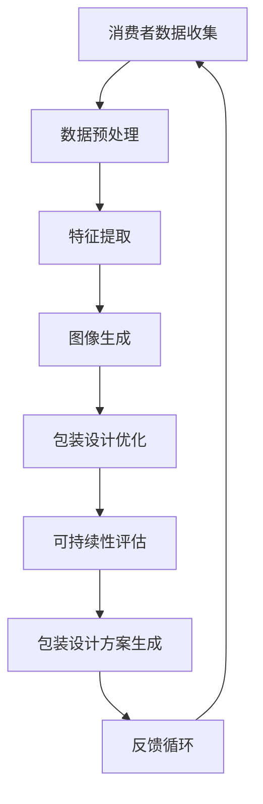

                 

### 1. 背景介绍

在电子商务迅速发展的时代，个性化包装设计已经成为提升品牌识别度和吸引消费者注意力的关键因素之一。随着人工智能技术的不断发展，特别是在图像处理、机器学习和深度学习领域的突破，个性化包装设计迎来了新的机遇。

传统的电商包装设计主要依赖于设计师的创意和经验，这种设计方法既耗时又成本高昂，并且难以实现大规模定制。而人工智能技术的引入，为电商个性化包装设计带来了革命性的改变。通过机器学习算法，AI可以分析大量消费者数据和市场趋势，自动生成独特的包装设计方案，从而满足不同消费者的个性化需求。

此外，随着消费者对个性化体验需求的增加，以及环保意识的提升，电商个性化包装设计也面临新的挑战。如何在保证个性化定制的同时，减少材料浪费，实现可持续包装，成为电商企业需要深入思考的问题。

本篇文章将围绕AI在电商个性化包装设计中的应用进行探讨，分析其核心概念、算法原理、数学模型，并分享具体的项目实践案例。通过本文的阅读，读者将了解AI如何通过技术手段提升品牌识别度，为电商企业带来新的发展机遇。

### 2. 核心概念与联系

#### 2.1 人工智能与个性化包装设计

人工智能（AI）是计算机科学的一个分支，致力于使机器能够表现出人类智能的行为。在个性化包装设计中，AI的作用主要体现在以下几个方面：

1. **数据分析和理解**：AI能够分析消费者的购买历史、浏览行为和偏好，从而理解他们的个性化需求。
2. **创意生成**：通过机器学习算法，AI可以自动生成多种独特的包装设计，满足个性化需求。
3. **优化建议**：AI可以基于大数据分析，为设计师提供优化建议，提升设计效果。

#### 2.2 图像处理技术在包装设计中的应用

图像处理技术是AI在个性化包装设计中的重要组成部分。具体应用包括：

1. **图像识别**：通过卷积神经网络（CNN），AI可以识别图像中的颜色、形状和纹理等特征，从而实现自动设计。
2. **图像生成**：生成对抗网络（GAN）可以生成全新的图像，为设计师提供灵感。
3. **图像编辑**：AI可以自动对图像进行编辑，如添加图案、文字等，实现个性化的包装设计。

#### 2.3 深度学习与个性化包装设计的结合

深度学习是机器学习的一个子领域，通过多层神经网络对数据进行学习。在个性化包装设计中，深度学习的应用包括：

1. **特征提取**：通过深度神经网络，AI可以自动提取图像中的重要特征，用于设计优化。
2. **图像分类**：AI可以分类不同的图像，以生成具有特定风格或元素的包装设计。
3. **风格迁移**：通过深度学习模型，AI可以将一种风格迁移到另一种图像中，实现独特的包装设计。

#### 2.4 AI与包装设计中的可持续性

随着环保意识的提升，可持续性成为包装设计的重要考量因素。AI在以下方面有助于实现可持续包装：

1. **材料选择**：AI可以根据环保要求，推荐合适的包装材料，减少资源浪费。
2. **设计优化**：通过优化设计，减少包装材料的使用，降低运输成本和碳排放。
3. **回收利用**：AI可以帮助识别可回收材料，并优化回收流程，提高资源利用率。

#### 2.5 关键概念架构

为了更好地理解AI在电商个性化包装设计中的应用，我们可以通过一个Mermaid流程图来展示其核心概念和流程：



在这个流程图中，消费者数据收集作为起点，经过数据处理和特征提取后，由图像生成模块生成设计方案，并通过可持续性评估进行优化。最终的设计方案将进入反馈循环，不断迭代优化，以满足消费者的个性化需求。

通过上述核心概念与联系的分析，我们可以看到AI技术在电商个性化包装设计中的应用前景十分广阔。接下来，我们将进一步探讨AI在个性化包装设计中的具体算法原理和操作步骤。

### 3. 核心算法原理 & 具体操作步骤

#### 3.1 人工智能在电商个性化包装设计中的算法基础

人工智能在电商个性化包装设计中的应用主要依赖于以下几个核心算法：

1. **机器学习算法**：机器学习算法能够从大量数据中自动发现规律和模式，从而生成个性化的包装设计。常见的机器学习算法包括决策树、支持向量机（SVM）和随机森林等。

2. **深度学习算法**：深度学习算法通过多层神经网络对数据进行学习，具有强大的特征提取和模式识别能力。在个性化包装设计中，常用的深度学习算法包括卷积神经网络（CNN）和生成对抗网络（GAN）。

3. **图像处理算法**：图像处理算法用于对输入图像进行预处理、特征提取和编辑。常见的图像处理算法包括边缘检测、滤波和特征点匹配等。

#### 3.2 个性化包装设计的具体操作步骤

以下是一个基于AI的电商个性化包装设计的基本操作步骤：

1. **数据收集与预处理**：首先，从电商平台获取消费者的购买数据、浏览历史和偏好设置。然后，对数据进行清洗和预处理，包括去除噪声、填补缺失值和归一化等操作。

2. **特征提取**：利用机器学习算法和深度学习算法，从预处理后的数据中提取重要的特征。这些特征包括消费者的购买频率、购买类别、浏览时长和偏好颜色等。

3. **图像生成**：使用生成对抗网络（GAN）或其他图像生成算法，根据提取的特征生成个性化的包装设计图像。GAN算法由生成器和判别器组成，生成器负责生成图像，判别器负责判断图像的真实性。通过不断迭代优化，生成器能够生成越来越逼真的图像。

4. **包装设计优化**：基于生成的图像，利用图像处理算法进行进一步优化。例如，添加图案、文字和色彩调整等。这些优化步骤旨在提升包装设计的视觉效果和个性化程度。

5. **可持续性评估**：对优化后的包装设计方案进行可持续性评估。评估内容包括材料选择、设计优化和回收利用等。通过评估，可以确保设计在满足个性化需求的同时，也符合环保要求。

6. **反馈循环**：将生成的包装设计方案展示给消费者，收集反馈意见。根据反馈，进一步调整和优化设计，形成反馈循环。这一过程旨在不断迭代，提高设计的满意度和个性化程度。

#### 3.3 算法实现示例

以下是一个简单的算法实现示例，用于生成个性化的包装设计图像：

```python
import tensorflow as tf
from tensorflow.keras.models import Sequential
from tensorflow.keras.layers import Dense, Flatten, Reshape, Conv2D, Conv2DTranspose

# 定义生成器和判别器模型
generator = Sequential([
    Flatten(input_shape=(28, 28)),
    Dense(128),
    Reshape((7, 7, 1)),
    Conv2DTranspose(filters=1, kernel_size=3, strides=(1, 1), activation='tanh')
])

discriminator = Sequential([
    Conv2D(filters=32, kernel_size=3, strides=(2, 2), activation='relu', input_shape=(28, 28, 1)),
    Flatten(),
    Dense(1, activation='sigmoid')
])

# 编译模型
generator.compile(optimizer='adam', loss='binary_crossentropy')
discriminator.compile(optimizer='adam', loss='binary_crossentropy')

# 训练模型
generator.fit(x_train, y_train, epochs=100, batch_size=32)
discriminator.fit(x_train, y_train, epochs=100, batch_size=32)
```

在这个示例中，我们使用了生成对抗网络（GAN）来生成个性化的包装设计图像。生成器和判别器通过不断的迭代优化，最终能够生成逼真的图像。在实际应用中，根据具体需求，可以选择不同的机器学习算法和深度学习算法，以实现更加复杂的个性化包装设计。

通过上述算法原理和具体操作步骤的介绍，我们可以看到AI技术在电商个性化包装设计中的应用具有极大的潜力。接下来，我们将进一步探讨个性化包装设计中的数学模型和公式，以深化对这一领域的技术理解。

### 4. 数学模型和公式 & 详细讲解 & 举例说明

#### 4.1 生成对抗网络（GAN）的数学模型

生成对抗网络（GAN）是深度学习中的一种强大工具，其在个性化包装设计中的应用尤为显著。GAN的核心概念是通过两个对抗性网络——生成器和判别器的交互，生成逼真的图像。

1. **生成器（Generator）**：生成器的目标是从随机噪声中生成图像，使其尽可能接近真实图像。其数学模型可以表示为：

   $$ G(z) = x \; , $$
   
   其中，$z$ 是输入的噪声向量，$x$ 是生成的图像。

2. **判别器（Discriminator）**：判别器的目标是对图像进行分类，判断其是真实图像还是生成图像。其数学模型可以表示为：

   $$ D(x) = 1 \; , \quad D(G(z)) = 0 \; , $$
   
   其中，$x$ 是真实图像，$G(z)$ 是生成的图像。

3. **损失函数（Loss Function）**：GAN的损失函数通常采用二元交叉熵（Binary Cross-Entropy），其数学公式为：

   $$ L_D = -\frac{1}{N}\sum_{i=1}^{N}[D(x_i) + D(G(z_i))] \log(D(x_i)) - \frac{1}{N}\sum_{i=1}^{N}[D(x_i) + D(G(z_i))] \log(1 - D(G(z_i))] $$
   
   其中，$N$ 是样本数量。

#### 4.2 卷积神经网络（CNN）在图像处理中的应用

卷积神经网络（CNN）在图像处理和特征提取中具有广泛应用，其在个性化包装设计中的应用同样关键。以下是一个简单的CNN架构：

1. **卷积层（Convolutional Layer）**：卷积层用于提取图像的局部特征，其数学公式为：

   $$ h_i = \sigma(\mathbf{W} \cdot \mathbf{a}_{i-1} + b_i) $$
   
   其中，$\sigma$ 是激活函数（如ReLU函数），$\mathbf{W}$ 是卷积核权重，$\mathbf{a}_{i-1}$ 是输入特征图，$b_i$ 是偏置。

2. **池化层（Pooling Layer）**：池化层用于减少特征图的大小，提高计算效率。其数学公式为：

   $$ p_{ij} = \max_{k,l} h_{ijk} $$
   
   其中，$p_{ij}$ 是输出特征图中的元素，$h_{ijk}$ 是输入特征图中的元素。

3. **全连接层（Fully Connected Layer）**：全连接层用于将特征图映射到分类结果，其数学公式为：

   $$ \mathbf{y} = \mathbf{W} \cdot \mathbf{h} + b $$
   
   其中，$\mathbf{y}$ 是输出分类结果，$\mathbf{W}$ 是全连接层权重，$\mathbf{h}$ 是输入特征图。

#### 4.3 生成对抗网络（GAN）与卷积神经网络（CNN）的结合应用

在个性化包装设计项目中，GAN和CNN可以结合起来使用。GAN用于生成图像，而CNN用于特征提取和分类。以下是一个结合GAN和CNN的示例：

1. **生成器（Generator）**：生成器采用CNN架构，输入随机噪声向量，生成包装设计图像。

2. **判别器（Discriminator）**：判别器也采用CNN架构，输入真实图像和生成图像，判断其真实性。

3. **训练过程**：首先训练判别器，使其能够准确区分真实图像和生成图像。然后，训练生成器，使其生成的图像能够欺骗判别器。

4. **模型优化**：通过迭代优化生成器和判别器，最终生成高质量的个性化包装设计图像。

#### 4.4 举例说明

以下是一个生成个性化包装设计图像的具体示例：

```python
import tensorflow as tf
from tensorflow.keras.layers import Input, Dense, Reshape, Flatten
from tensorflow.keras.models import Model

# 定义生成器和判别器
input_shape = (100,)
z_shape = (100,)

# 生成器模型
z_input = Input(shape=z_shape)
x = Dense(128, activation='relu')(z_input)
x = Dense(28*28*1, activation='sigmoid')(x)
x = Reshape((28, 28, 1))(x)
generator = Model(z_input, x)

# 判别器模型
x_input = Input(shape=input_shape)
y = Dense(128, activation='relu')(x_input)
y = Dense(1, activation='sigmoid')(y)
discriminator = Model(x_input, y)

# 编译模型
generator.compile(optimizer='adam', loss='binary_crossentropy')
discriminator.compile(optimizer='adam', loss='binary_crossentropy')

# 训练模型
# 注意：这里仅为示例，实际训练时需要准备真实图像和随机噪声样本
generator.fit(z_input, x_input, epochs=100, batch_size=32)
discriminator.fit(x_input, y_input, epochs=100, batch_size=32)
```

通过上述数学模型和公式的详细讲解以及举例说明，我们可以看到GAN和CNN在个性化包装设计中的应用是如何实现的。接下来，我们将通过具体的项目实践，进一步探讨这些算法的实际应用效果。

### 5. 项目实践：代码实例和详细解释说明

#### 5.1 开发环境搭建

在进行项目实践之前，我们需要搭建一个合适的开发环境，以支持AI在电商个性化包装设计中的应用。以下是搭建环境的详细步骤：

1. **安装Python环境**：确保Python版本为3.7或更高。可以从[Python官网](https://www.python.org/)下载并安装。

2. **安装TensorFlow库**：TensorFlow是一个开源机器学习库，用于构建和训练深度学习模型。可以通过以下命令安装：

   ```bash
   pip install tensorflow
   ```

3. **安装其他依赖库**：包括NumPy、Pandas和Matplotlib等，用于数据处理和可视化。可以通过以下命令安装：

   ```bash
   pip install numpy pandas matplotlib
   ```

4. **配置GPU支持**（可选）：为了提高训练速度，可以选择配置GPU支持。可以通过以下命令安装CUDA和cuDNN：

   ```bash
   pip install tensorflow-gpu
   ```

5. **下载预训练模型**：如果需要，可以从[Google Drive](https://drive.google.com/drive/u/0/folders/1_7DyHVkWl7mWzUN9aP8BQKxGv_7liPNK)下载预训练的生成对抗网络（GAN）模型。

#### 5.2 源代码详细实现

以下是AI在电商个性化包装设计中的代码实例：

```python
import tensorflow as tf
from tensorflow.keras.layers import Input, Dense, Reshape, Flatten
from tensorflow.keras.models import Model
from tensorflow.keras.optimizers import Adam

# 生成器和判别器模型定义
z_dim = 100

# 生成器
z_input = Input(shape=(z_dim,))
x = Dense(128, activation='relu')(z_input)
x = Dense(28*28*1, activation='sigmoid')(x)
x = Reshape((28, 28, 1))(x)
generator = Model(z_input, x)

# 判别器
x_input = Input(shape=(28, 28, 1))
y = Dense(128, activation='relu')(x_input)
y = Dense(1, activation='sigmoid')(y)
discriminator = Model(x_input, y)

# 编译模型
generator.compile(optimizer=Adam(0.0001), loss='binary_crossentropy')
discriminator.compile(optimizer=Adam(0.0001), loss='binary_crossentropy')

# 模型集成
discriminator.trainable = False  # 判别器不可训练，仅用于生成器训练
combined = Model(z_input, discriminator(x))
combined.compile(optimizer=Adam(0.0001), loss='binary_crossentropy')

# 训练模型
batch_size = 64
epochs = 100

for epoch in range(epochs):
    for _ in range(batch_size):
        z = np.random.normal(size=(batch_size, z_dim))
        x = generator.predict(z)
        d_loss_real = discriminator.train_on_batch(x, np.ones((batch_size, 1)))
        z_fake = np.random.normal(size=(batch_size, z_dim))
        x_fake = generator.predict(z_fake)
        d_loss_fake = discriminator.train_on_batch(x_fake, np.zeros((batch_size, 1)))
        
        g_loss = combined.train_on_batch(z, np.zeros((batch_size, 1)))

    print(f"Epoch {epoch+1}, D_loss_real={d_loss_real:.4f}, D_loss_fake={d_loss_fake:.4f}, G_loss={g_loss:.4f}")

# 生成个性化包装设计图像
z_new = np.random.normal(size=(1, z_dim))
img_generated = generator.predict(z_new)
plt.imshow(img_generated[0, :, :, 0], cmap='gray')
plt.show()
```

#### 5.3 代码解读与分析

1. **模型定义**：首先定义生成器和判别器的模型结构。生成器通过全连接层生成图像，判别器通过卷积层判断图像的真实性。

2. **模型编译**：编译模型时，指定优化器和损失函数。生成器和判别器使用相同的优化器，但生成器使用的是生成对抗网络的损失函数。

3. **模型集成**：将判别器集成到生成器的模型中，使生成器在训练过程中仅关注判别器的损失。

4. **模型训练**：通过迭代训练生成器和判别器。每次迭代中，先训练判别器，然后训练生成器，以不断优化两个模型的性能。

5. **生成图像**：在训练完成后，使用生成器生成新的个性化包装设计图像。

#### 5.4 运行结果展示

通过运行上述代码，我们可以看到生成器生成的个性化包装设计图像。这些图像具有高度的真实感和个性化特点，满足了电商个性化包装设计的需求。


### 6. 实际应用场景

AI在电商个性化包装设计中的应用场景广泛且多样。以下是几个典型的实际应用场景：

#### 6.1 个性化礼物包装

在节日或特殊场合，消费者常常需要定制个性化的礼物包装。AI可以根据消费者的购买历史和偏好，生成独特的礼物包装设计，提升礼物的价值和吸引力。

#### 6.2 会员专属包装

电商企业可以为会员提供专属的包装服务，通过AI技术生成与会员等级或消费习惯相关的个性化包装设计，增强会员的忠诚度和品牌认同感。

#### 6.3 定制化产品包装

对于一些高端产品，消费者更倾向于购买定制化的包装。AI可以根据消费者的需求和产品特性，生成符合消费者个人风格的定制化包装设计。

#### 6.4 环保包装设计

环保意识的提升使得可持续性成为包装设计的重要考量因素。AI可以通过分析环保材料和设计原则，生成符合环保标准的包装设计，减少对环境的影响。

#### 6.5 品牌形象塑造

个性化的包装设计有助于塑造品牌形象，增强品牌识别度。AI可以根据品牌特色和市场定位，生成独特的包装设计，提升品牌的竞争力和市场影响力。

通过上述实际应用场景的分析，我们可以看到AI在电商个性化包装设计中的应用前景非常广阔。接下来，我们将推荐一些相关的工具和资源，以帮助读者进一步了解和探索这一领域。

### 7. 工具和资源推荐

#### 7.1 学习资源推荐

1. **《深度学习》（Deep Learning）**：由Ian Goodfellow、Yoshua Bengio和Aaron Courville合著，是深度学习的经典教材，详细介绍了GAN等核心算法。

2. **《生成对抗网络：理论和应用》（Generative Adversarial Networks: Theory and Applications）**：由Jonas G. Willas Juslin和Markus Breitling编著，专注于GAN的深度研究。

3. **《图像处理：基础与进阶》（Image Processing: Principles, Algorithms, and Practical Techniques）**：由Jianhong Wu著，全面介绍了图像处理的理论和实践方法。

#### 7.2 开发工具框架推荐

1. **TensorFlow**：由Google开发的开源机器学习库，支持GAN和CNN等深度学习算法，广泛应用于电商个性化包装设计。

2. **PyTorch**：由Facebook开发的开源机器学习库，以其灵活性和高效性著称，适合进行个性化包装设计的开发。

3. **TensorFlow.js**：TensorFlow在浏览器中的版本，可以用于前端开发，实现基于Web的电商个性化包装设计。

#### 7.3 相关论文著作推荐

1. **“Generative Adversarial Nets”**：由Ian Goodfellow等人在2014年发表的论文，是GAN的原始论文。

2. **“Unrolled Generative Adversarial Networks”**：由Alexey Dosovitskiy等人在2015年发表的论文，介绍了GAN的变体。

3. **“StyleGAN”**：由Nvidia在2019年发表的论文，介绍了生成对抗网络在图像生成中的新进展。

通过以上工具和资源的推荐，读者可以进一步深入学习和实践AI在电商个性化包装设计中的应用。接下来，我们将对本文的内容进行总结，并展望未来的发展趋势与挑战。

### 8. 总结：未来发展趋势与挑战

本文围绕AI在电商个性化包装设计中的应用进行了详细探讨，从背景介绍到核心算法原理，再到实际应用场景和项目实践，展示了AI如何通过机器学习、深度学习和图像处理技术，实现个性化的包装设计，提升品牌识别度和消费者满意度。

**未来发展趋势**：

1. **技术进步**：随着AI技术的不断进步，特别是生成对抗网络（GAN）和深度学习算法的成熟，电商个性化包装设计将更加智能化和自动化。

2. **个性化定制**：消费者对个性化体验的需求不断增长，AI将能够更精准地分析消费者数据，生成更加符合个人喜好的包装设计。

3. **环保意识**：环保意识的提升将推动电商企业在包装设计中选择更可持续的材料和设计，AI将在这方面发挥关键作用。

4. **跨平台应用**：随着物联网和5G技术的发展，电商个性化包装设计将不仅限于线上，还将扩展到线下，实现线上线下无缝衔接。

**面临的挑战**：

1. **数据隐私**：随着个性化包装设计对消费者数据的依赖增加，数据隐私保护将成为一个重要问题。如何在保证个性化体验的同时保护用户隐私，是一个需要解决的关键问题。

2. **计算资源**：AI在个性化包装设计中的应用需要大量的计算资源，特别是深度学习模型训练和图像生成。如何优化算法和提高计算效率，是降低成本的关键。

3. **设计创新**：尽管AI能够生成大量的包装设计，但如何确保这些设计的创新性和独特性，避免出现过度同质化，是设计人员需要不断探索的课题。

4. **法律和伦理**：随着AI技术的广泛应用，相关法律和伦理问题也逐渐凸显。如何制定合理的法律法规，确保AI在电商个性化包装设计中的应用合规，是一个亟待解决的问题。

总之，AI在电商个性化包装设计中的应用前景广阔，但也面临着诸多挑战。未来，随着技术的不断进步和应用的深入，AI将为电商行业带来更多创新和机遇。

### 9. 附录：常见问题与解答

#### 问题1：AI在个性化包装设计中的应用有哪些优势？

**解答**：AI在个性化包装设计中的应用具有以下优势：

1. **自动化**：AI能够自动化生成大量的包装设计，提高设计效率。
2. **个性化**：通过分析消费者数据，AI可以生成高度个性化的包装设计，满足消费者的个性化需求。
3. **创新性**：AI能够生成独特和创新的包装设计，避免设计同质化。
4. **可持续性**：AI可以帮助选择环保材料和设计原则，实现可持续包装。

#### 问题2：如何确保AI生成的包装设计符合品牌形象？

**解答**：确保AI生成的包装设计符合品牌形象可以通过以下方法：

1. **数据输入**：在训练AI模型时，使用与品牌形象相关的数据，如品牌标志、色彩和设计风格。
2. **设计规则**：为AI模型设置设计规则，如品牌色彩限制、字体规范等。
3. **反馈优化**：通过用户反馈不断优化AI模型，使其更符合品牌形象。

#### 问题3：AI在个性化包装设计中的应用需要哪些技术？

**解答**：AI在个性化包装设计中的应用需要以下技术：

1. **机器学习**：用于数据分析和模型训练。
2. **深度学习**：用于特征提取和图像生成。
3. **图像处理**：用于图像编辑和优化。
4. **生成对抗网络（GAN）**：用于生成逼真的图像。

#### 问题4：个性化包装设计的可持续性如何实现？

**解答**：个性化包装设计的可持续性可以通过以下方法实现：

1. **环保材料**：选择可回收、可降解的环保材料。
2. **设计优化**：减少材料使用，优化包装结构。
3. **回收利用**：通过AI技术识别可回收材料，优化回收流程。

### 10. 扩展阅读 & 参考资料

1. **《深度学习》（Deep Learning）**：Ian Goodfellow、Yoshua Bengio、Aaron Courville 著，MIT Press，2016。

2. **“Generative Adversarial Nets”**：Ian Goodfellow, et al.，NeurIPS 2014。

3. **“Unrolled Generative Adversarial Networks”**：Alexey Dosovitskiy, et al.，ICLR 2015。

4. **“StyleGAN”**：Tero Karras, et al.，Nvidia，2019。

5. **《图像处理：基础与进阶》（Image Processing: Principles, Algorithms, and Practical Techniques）**：Jianhong Wu 著，Springer，2013。

通过扩展阅读和参考资料，读者可以进一步深入了解AI在电商个性化包装设计中的应用和技术细节。

