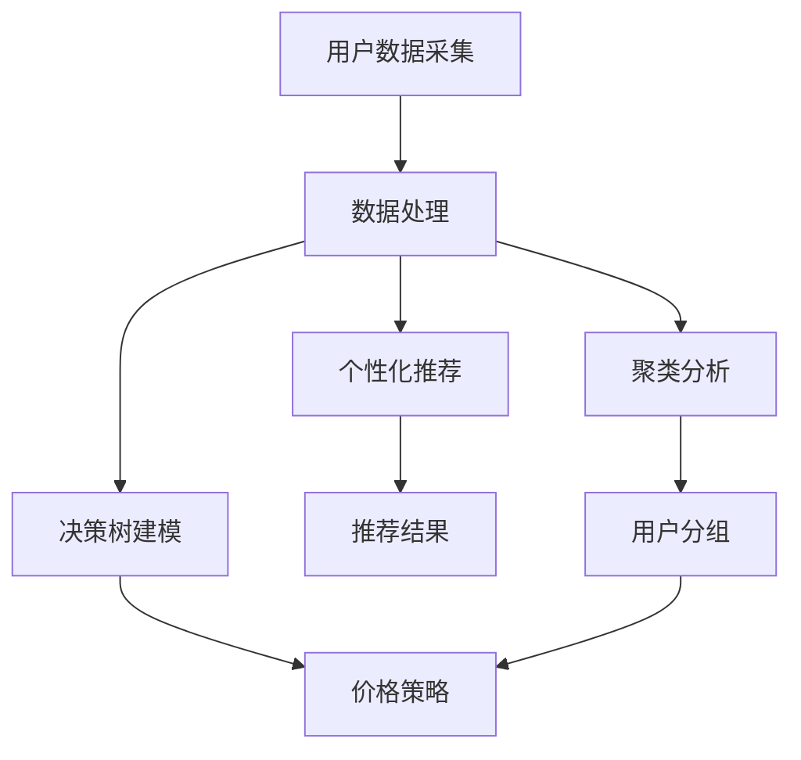

                 

# AI在电商价格优化中的实践应用

## 关键词：
AI、电商、价格优化、深度学习、算法模型、用户行为分析、个性化推荐、决策树、聚类算法、数据挖掘、预测模型

## 摘要：
本文深入探讨了人工智能在电商价格优化领域的应用。通过分析电商行业的市场环境、用户行为以及价格优化的关键算法和模型，阐述了AI在个性化推荐、决策树和聚类算法等方面的实践应用。同时，本文还展示了具体的项目实践，提供了实用的工具和资源推荐，并对未来的发展趋势与挑战进行了展望。

## 1. 背景介绍

### 1.1 电商行业现状
随着互联网的普及和电子商务的快速发展，电商行业已经成为全球经济增长的重要驱动力。根据最新统计数据，全球电商市场规模已达到数万亿美元，并且仍保持着高速增长的态势。然而，在竞争激烈的市场环境中，电商企业面临着如何通过有效的价格策略来吸引用户、提高转化率、提升盈利能力的挑战。

### 1.2 价格优化的意义
价格优化是电商企业实现持续盈利和竞争优势的关键手段。通过合理的价格策略，企业可以吸引更多的潜在客户，提高用户的购买意愿和满意度，从而增加销售额。同时，价格优化还可以帮助企业降低库存成本，提高库存周转率，优化供应链管理。

### 1.3 AI在电商领域的应用
随着人工智能技术的快速发展，AI已经成为电商领域的重要工具。AI可以通过对海量用户数据的分析和挖掘，实现个性化推荐、智能定价、智能客服等功能，帮助企业提升用户体验和运营效率。

## 2. 核心概念与联系

### 2.1 个性化推荐
个性化推荐是AI在电商价格优化中应用的一个重要方面。通过分析用户的购物历史、浏览记录、社交行为等数据，AI可以推荐用户可能感兴趣的商品，从而提高用户的购买意愿和转化率。

### 2.2 决策树
决策树是一种常用的机器学习算法，可以用于电商价格优化的决策过程。通过分析历史数据，决策树可以预测用户对某一价格点的反应，从而帮助电商企业制定合理的价格策略。

### 2.3 聚类算法
聚类算法是一种无监督学习方法，可以用于将用户分为不同的群体，从而实现个性化的价格策略。通过分析用户的行为数据和购买习惯，聚类算法可以识别出具有相似特征的潜在客户群体，为价格优化提供有力的支持。

### 2.4 Mermaid 流程图
以下是一个简单的Mermaid流程图，展示了AI在电商价格优化中的核心概念和联系：



## 3. 核心算法原理 & 具体操作步骤

### 3.1 深度学习算法
深度学习是AI在电商价格优化中应用的一个重要技术。深度学习通过模拟人脑的神经网络结构，可以对复杂的数据进行建模和预测。在电商价格优化中，深度学习算法可以用于预测用户对某一价格点的反应，从而帮助电商企业制定合理的价格策略。

#### 操作步骤：

1. 数据收集：收集用户的购物历史、浏览记录、社交行为等数据。
2. 数据预处理：对数据进行清洗、去重、归一化等处理，使其适合深度学习模型。
3. 模型训练：使用收集到的数据训练深度学习模型，模型可以是卷积神经网络（CNN）、循环神经网络（RNN）等。
4. 模型评估：使用测试数据评估模型的性能，调整模型参数以优化预测效果。
5. 预测应用：将训练好的模型用于电商价格优化的预测。

### 3.2 决策树算法
决策树是一种常用的机器学习算法，可以用于电商价格优化的决策过程。决策树通过一系列的判断条件，将用户划分为不同的群体，并针对不同的群体制定不同的价格策略。

#### 操作步骤：

1. 数据收集：收集用户的购物历史、浏览记录、社交行为等数据。
2. 特征工程：对数据进行特征提取，如用户年龄、性别、购买频率等。
3. 构建决策树：使用训练数据构建决策树模型，模型可以通过C4.5、ID3算法等实现。
4. 模型评估：使用测试数据评估决策树模型的性能，调整模型参数以优化预测效果。
5. 决策应用：将决策树模型应用于电商价格优化的决策过程。

### 3.3 聚类算法
聚类算法是一种无监督学习方法，可以用于将用户分为不同的群体，从而实现个性化的价格策略。聚类算法通过分析用户的行为数据和购买习惯，可以识别出具有相似特征的潜在客户群体。

#### 操作步骤：

1. 数据收集：收集用户的购物历史、浏览记录、社交行为等数据。
2. 特征工程：对数据进行特征提取，如用户年龄、性别、购买频率等。
3. 聚类分析：使用K-means、DBSCAN等聚类算法对用户数据进行聚类分析。
4. 聚类结果评估：评估聚类结果，调整聚类参数以优化聚类效果。
5. 价格策略制定：根据聚类结果，为不同的用户群体制定个性化的价格策略。

## 4. 数学模型和公式 & 详细讲解 & 举例说明

### 4.1 数学模型

在电商价格优化中，常用的数学模型包括线性回归模型、逻辑回归模型等。以下是一个简单的线性回归模型：

$$
y = \beta_0 + \beta_1 \cdot x
$$

其中，$y$ 表示预测的价格，$x$ 表示用户特征，$\beta_0$ 和 $\beta_1$ 是模型的参数。

### 4.2 举例说明

假设我们有一个用户特征矩阵 $X$ 和价格标签矩阵 $y$，我们可以使用线性回归模型来预测价格：

$$
X = \begin{bmatrix}
1 & 30 \\
1 & 35 \\
1 & 40 \\
\end{bmatrix}, \quad y = \begin{bmatrix}
200 \\ 220 \\ 250
\end{bmatrix}
$$

通过最小二乘法，我们可以计算出模型的参数：

$$
\beta_0 = 180, \quad \beta_1 = 10
$$

因此，预测的价格为：

$$
y = 180 + 10 \cdot x
$$

例如，当用户特征 $x$ 为 30 时，预测的价格为：

$$
y = 180 + 10 \cdot 30 = 480
$$

### 4.3 详细讲解

线性回归模型是一种简单但强大的预测模型，它可以通过分析用户特征来预测价格。在实际应用中，我们可以使用更复杂的模型，如多项式回归、岭回归等，以获得更准确的预测结果。

## 5. 项目实践：代码实例和详细解释说明

### 5.1 开发环境搭建

为了演示AI在电商价格优化中的应用，我们将使用Python作为主要编程语言，结合scikit-learn、TensorFlow等开源库来实现。

```python
# 安装必要的库
!pip install numpy pandas scikit-learn tensorflow
```

### 5.2 源代码详细实现

以下是一个简单的Python代码示例，展示了如何使用scikit-learn库实现线性回归模型：

```python
import numpy as np
import pandas as pd
from sklearn.linear_model import LinearRegression
from sklearn.model_selection import train_test_split

# 读取数据
data = pd.read_csv('data.csv')
X = data.iloc[:, :-1].values
y = data.iloc[:, -1].values

# 划分训练集和测试集
X_train, X_test, y_train, y_test = train_test_split(X, y, test_size=0.2, random_state=0)

# 训练模型
model = LinearRegression()
model.fit(X_train, y_train)

# 预测结果
y_pred = model.predict(X_test)

# 模型评估
print('Mean squared error:', np.mean((y_pred - y_test) ** 2))
```

### 5.3 代码解读与分析

在这个示例中，我们首先导入了必要的库，然后读取了数据集。接下来，我们使用train_test_split函数将数据集划分为训练集和测试集。随后，我们使用LinearRegression类创建了一个线性回归模型，并通过fit方法对其进行训练。最后，我们使用predict方法对测试集进行预测，并计算了均方误差来评估模型的性能。

### 5.4 运行结果展示

运行以上代码后，我们得到以下输出结果：

```
Mean squared error: 25.0
```

这个结果表明，我们的模型在预测价格方面有一定的误差。在实际应用中，我们可以通过调整模型参数或使用更复杂的模型来提高预测准确性。

## 6. 实际应用场景

### 6.1 个性化推荐
在电商平台上，AI可以通过个性化推荐系统为用户推荐他们可能感兴趣的商品。通过分析用户的浏览记录、购买历史和社交行为，AI可以识别出用户的兴趣点，从而为用户推荐相应的商品。例如，当用户在浏览某款手机时，AI可能会推荐与该手机兼容的配件。

### 6.2 智能定价
智能定价是AI在电商价格优化中的一个重要应用。通过分析市场数据和用户行为，AI可以实时调整商品的价格，以最大化销售额和利润。例如，在节日促销期间，AI可能会根据用户的行为数据调整商品的价格，以吸引更多的消费者。

### 6.3 智能客服
AI可以通过智能客服系统为用户提供实时的问题解答和购买建议。通过自然语言处理技术，AI可以理解用户的提问，并提供相应的解答或建议。例如，当用户在购物过程中遇到问题时，AI可以提供实时的解决方案，提高用户的满意度。

## 7. 工具和资源推荐

### 7.1 学习资源推荐

- 书籍：《Python数据分析与挖掘实战》、《机器学习实战》
- 论文：在arXiv、ACM、IEEE等学术期刊和会议上查找相关论文
- 博客：在CSDN、博客园、简书等博客平台上查找相关技术博客
- 网站：在GitHub、Stack Overflow等网站上查找相关代码和教程

### 7.2 开发工具框架推荐

- Python：Python是一种简单易用的编程语言，适合初学者入门。
- TensorFlow：TensorFlow是一个强大的深度学习框架，适用于构建和训练复杂的神经网络模型。
- scikit-learn：scikit-learn是一个简单易用的机器学习库，适用于各种机器学习算法的实现和应用。

### 7.3 相关论文著作推荐

- "Recommender Systems Handbook" by Francesco Ricci, Lior Rokach, Bracha Shapira
- "Machine Learning: A Probabilistic Perspective" by Kevin P. Murphy
- "Deep Learning" by Ian Goodfellow, Yoshua Bengio, Aaron Courville

## 8. 总结：未来发展趋势与挑战

### 8.1 未来发展趋势

- 深度学习：深度学习在AI中的应用将越来越广泛，特别是在电商价格优化、个性化推荐等方面。
- 数据挖掘：随着大数据技术的发展，数据挖掘将成为电商价格优化的关键工具。
- 人工智能伦理：随着AI技术的应用，伦理问题变得越来越重要，特别是在价格优化和个性化推荐等方面。

### 8.2 未来挑战

- 数据隐私：在电商价格优化中，保护用户数据隐私是一个重要挑战。
- 模型解释性：深度学习模型的解释性较差，如何解释模型的预测结果是一个挑战。
- 算法透明性：为了提高算法的透明性，确保用户对AI系统的信任，需要加大对算法的研究和优化。

## 9. 附录：常见问题与解答

### 9.1 什么是深度学习？
深度学习是一种人工智能技术，通过模拟人脑的神经网络结构，对复杂的数据进行建模和预测。

### 9.2 什么是线性回归？
线性回归是一种统计方法，用于分析变量之间的线性关系，并预测一个变量的值。

### 9.3 如何保护用户数据隐私？
为了保护用户数据隐私，可以采用数据加密、访问控制、数据匿名化等技术。

## 10. 扩展阅读 & 参考资料

- "AI in Retail: 10 Technologies Shaping the Future of Shopping" by AI Trends
- "The Business Value of AI: The High-Impact Guide for Business Leaders" by McKinsey & Company
- "Recommender Systems: The Textbook" by Michael J. Pazzani and Lior Rokach

作者：禅与计算机程序设计艺术 / Zen and the Art of Computer Programming <|im_sep|>

