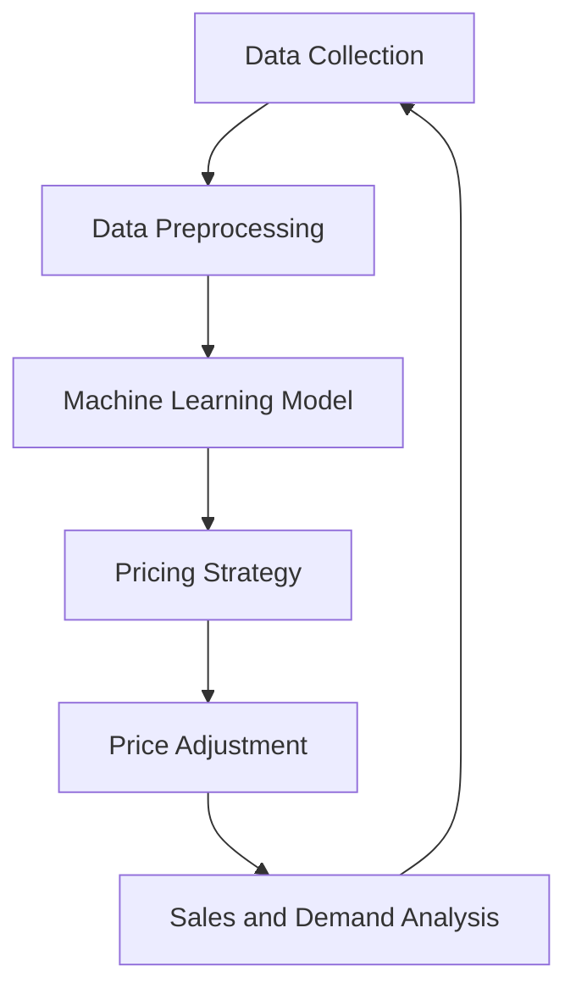

                 

### 1. 背景介绍 Background Introduction

#### 1.1 电商动态定价 Dynamic Pricing in E-commerce

In the era of big data and advanced machine learning techniques, dynamic pricing has become a cornerstone strategy for e-commerce businesses to optimize their sales and maximize profit margins. Unlike static pricing, where prices remain fixed over time, dynamic pricing leverages real-time data to adjust prices continuously based on market conditions, customer behavior, and competitor actions. This strategy enables businesses to respond quickly to changing demand patterns and competitive pressures, ensuring they remain competitive and profitable.

Dynamic pricing is particularly important in e-commerce due to its inherently competitive nature. E-commerce platforms have access to vast amounts of data, including customer demographics, browsing behavior, purchase history, and even seasonal trends. By analyzing this data, businesses can identify optimal pricing strategies that resonate with their target audience, thereby boosting sales and customer satisfaction.

#### 1.2 AI Applications in E-commerce AI Applications in E-commerce

Artificial Intelligence (AI) has revolutionized various industries, and e-commerce is no exception. AI technologies, such as machine learning, natural language processing, and computer vision, are being increasingly used to enhance various aspects of e-commerce operations. From personalized recommendations and chatbots to automated customer service and inventory management, AI has proven to be a game-changer.

One of the most significant applications of AI in e-commerce is dynamic pricing. AI algorithms can analyze large volumes of data in real-time, identifying patterns and trends that human analysts might miss. By using these insights to adjust prices dynamically, businesses can optimize their pricing strategies to increase revenue and profitability.

#### 1.3 Research Goals and Structure of the Article

The primary goal of this article is to explore the practical effects of AI in dynamic pricing within the e-commerce industry. We will delve into the core concepts, algorithms, and mathematical models that drive AI-based dynamic pricing. Additionally, we will provide a practical case study to illustrate the implementation and effectiveness of AI in dynamic pricing.

The article is structured as follows:

- **Section 1:** Background Introduction
- **Section 2:** Core Concepts and Relationships
- **Section 3:** Core Algorithm Principles and Operational Steps
- **Section 4:** Mathematical Models and Detailed Explanations
- **Section 5:** Project Practice: Code Examples and Detailed Explanations
- **Section 6:** Practical Application Scenarios
- **Section 7:** Tools and Resources Recommendations
- **Section 8:** Summary: Future Trends and Challenges
- **Section 9:** Appendix: Frequently Asked Questions
- **Section 10:** Extended Reading and References

By the end of this article, readers will gain a comprehensive understanding of AI-based dynamic pricing in e-commerce and its potential to transform the industry.

### 2. 核心概念与联系 Core Concepts and Relationships

In this section, we will discuss the core concepts and their relationships that underpin AI-based dynamic pricing in e-commerce. Understanding these concepts is crucial for grasping the intricacies of dynamic pricing and how AI algorithms can be effectively applied to optimize pricing strategies.

#### 2.1 Demand Curve and Elasticity

The demand curve is a fundamental concept in economics that illustrates the relationship between the price of a product and the quantity demanded by consumers. It is typically downward-sloping, indicating that as the price of a product increases, the quantity demanded decreases, and vice versa. The slope of the demand curve is known as the price elasticity of demand, which measures the responsiveness of quantity demanded to changes in price.

Price elasticity of demand can be categorized into three types: elastic, inelastic, and unitary elastic. Elastic demand occurs when a small change in price leads to a relatively large change in quantity demanded. Inelastic demand, on the other hand, occurs when a change in price leads to a relatively small change in quantity demanded. Unitary elastic demand is characterized by a proportionate change in quantity demanded in response to a change in price.

Understanding demand elasticity is crucial for dynamic pricing because it helps businesses determine how sensitive customers are to price changes. If demand is elastic, a price reduction may lead to a significant increase in sales volume, resulting in higher revenue. Conversely, if demand is inelastic, increasing the price might not significantly reduce sales volume and could lead to higher profit margins.

#### 2.2 Marginal Cost and Marginal Revenue

Marginal cost (MC) is the additional cost incurred by producing one more unit of a product. It is an important concept in cost-benefit analysis because it helps businesses determine the optimal production level that maximizes profit. If marginal cost is less than marginal revenue (MR), producing an additional unit will add more to revenue than it costs, resulting in increased profit. However, if marginal cost exceeds marginal revenue, producing an additional unit will lead to a decrease in profit.

Marginal revenue is the additional revenue generated by selling one more unit of a product. It is closely related to demand elasticity, as a higher price elasticity of demand will result in lower marginal revenue. This is because when demand is elastic, consumers are more sensitive to price changes, and a price increase will lead to a proportionately larger decrease in quantity demanded, thereby reducing marginal revenue.

#### 2.3 Competitive Pricing and Market Equilibrium

Competitive pricing is a strategy where businesses set their prices based on the prices of competitors, rather than based on their cost structure or market demand. This approach is commonly used in industries with high competition, where businesses strive to attract customers by offering competitive prices.

Market equilibrium occurs when the quantity demanded equals the quantity supplied, resulting in a stable price level. In competitive markets, market equilibrium is often achieved through competitive pricing. When a business lowers its price, it can attract more customers and increase its market share. Conversely, if a business raises its price, it may lose customers to competitors.

#### 2.4 AI and Machine Learning in Dynamic Pricing

Artificial Intelligence (AI) and machine learning (ML) are key technologies that enable businesses to implement dynamic pricing strategies effectively. AI algorithms can analyze vast amounts of data, identify patterns, and make predictions based on historical trends and current market conditions. Machine learning models can be trained on historical pricing data, customer behavior, and market trends to optimize pricing decisions in real-time.

Machine learning algorithms used in dynamic pricing typically fall into two categories: supervised learning and unsupervised learning. Supervised learning algorithms, such as linear regression and decision trees, are trained on labeled data, where the output is known. Unsupervised learning algorithms, such as clustering and association rules, work with unlabeled data and identify patterns and relationships within the data.

#### 2.5 Mermaid Flowchart of Dynamic Pricing Architecture

To provide a visual representation of the dynamic pricing architecture, we can use a Mermaid flowchart. The following diagram outlines the key components and relationships in a dynamic pricing system:



In this flowchart:
- **Data Collection** represents the process of gathering data from various sources, such as sales transactions, customer interactions, and competitor pricing.
- **Data Preprocessing** involves cleaning and transforming the raw data to prepare it for analysis.
- **Machine Learning Model** is trained on preprocessed data to predict optimal pricing strategies.
- **Pricing Strategy** generates a set of potential pricing options based on the machine learning model's predictions.
- **Price Adjustment** selects the most appropriate pricing option and updates the product prices in real-time.
- **Sales and Demand Analysis** monitors the impact of price adjustments on sales volume and demand.
- **Data Collection** is an iterative process, with new data continuously feeding back into the system to improve the model's performance over time.

Understanding the relationships between these core concepts and the components of a dynamic pricing system is essential for implementing and optimizing AI-based pricing strategies in e-commerce.

### 3. 核心算法原理 & 具体操作步骤 Core Algorithm Principles and Operational Steps

In this section, we will delve into the core algorithm principles and the specific operational steps involved in implementing AI-based dynamic pricing in e-commerce. Understanding these principles and steps is crucial for effectively leveraging AI to optimize pricing strategies and enhance business performance.

#### 3.1 Algorithm Overview

The core algorithm for AI-based dynamic pricing typically involves the following steps:

1. **Data Collection and Preprocessing:** Collect and preprocess data from various sources, such as sales transactions, customer interactions, and competitor pricing.
2. **Feature Engineering:** Extract relevant features from the preprocessed data that are used to train the machine learning model.
3. **Model Selection and Training:** Select an appropriate machine learning model and train it using the extracted features and historical pricing data.
4. **Pricing Strategy Generation:** Generate a set of potential pricing strategies based on the trained model's predictions.
5. **Price Adjustment:** Select and apply the most appropriate pricing strategy to adjust product prices in real-time.
6. **Monitoring and Feedback:** Continuously monitor the impact of price adjustments on sales volume and demand, and feed this information back into the system to improve the model's performance over time.

#### 3.2 Data Collection and Preprocessing

The first step in implementing AI-based dynamic pricing is to collect and preprocess data from various sources. This data typically includes:

- **Sales Transactions:** Information about past sales, including product prices, quantities sold, and timestamps.
- **Customer Interactions:** Data on customer interactions, such as browsing behavior, click-through rates, and conversion rates.
- **Competitor Pricing:** Information on competitor pricing, including their product prices and market positioning.

To preprocess this data, the following steps are typically performed:

1. **Data Cleaning:** Remove any duplicates, outliers, and missing values from the data.
2. **Feature Extraction:** Convert raw data into meaningful features that can be used to train the machine learning model. This may involve techniques such as normalization, scaling, and encoding categorical variables.
3. **Temporal Slicing:** Divide the data into fixed-time intervals (e.g., daily, weekly, or monthly) to capture temporal patterns and trends.

#### 3.3 Feature Engineering

Feature engineering is a critical step in the dynamic pricing process, as the quality of the input features significantly impacts the performance of the machine learning model. The following features are commonly used in dynamic pricing models:

- **Time-Based Features:** Features that capture the temporal aspect of the data, such as day of the week, season, and time of day.
- **Price-Based Features:** Features related to the product price, such as price level, price range, and price change history.
- **Demand-Based Features:** Features that capture customer demand, such as sales volume, conversion rate, and customer churn rate.
- **Competitor-Based Features:** Features related to competitor pricing and market positioning, such as competitor price levels, market share, and product availability.

#### 3.4 Model Selection and Training

Selecting an appropriate machine learning model is crucial for the success of AI-based dynamic pricing. Several machine learning models can be used for this purpose, including linear regression, decision trees, random forests, and neural networks. The choice of model depends on the nature of the data and the specific problem being addressed.

Once the model is selected, it needs to be trained using the extracted features and historical pricing data. The training process involves feeding the model with input data (features) and corresponding output data (pricing decisions) and adjusting the model's parameters to minimize the difference between the predicted and actual pricing decisions.

#### 3.5 Pricing Strategy Generation

After training the machine learning model, it can be used to generate a set of potential pricing strategies. These strategies typically include a range of possible price adjustments for each product based on the model's predictions. The pricing strategies can be generated using various optimization techniques, such as linear programming, gradient descent, and genetic algorithms.

#### 3.6 Price Adjustment

The final step in the dynamic pricing process is to select and apply the most appropriate pricing strategy. This step involves evaluating the potential pricing strategies based on their expected impact on revenue, profit, and market share. The selected pricing strategy is then applied to adjust product prices in real-time, ensuring that the pricing decisions are responsive to changing market conditions and customer preferences.

#### 3.7 Monitoring and Feedback

Once the pricing strategies are implemented, it is essential to continuously monitor their impact on sales volume, demand, and customer satisfaction. This information can be used to refine the machine learning model and improve the pricing strategies over time. The monitoring and feedback process is an iterative process that ensures the dynamic pricing system remains adaptive and responsive to changing market conditions.

By following these core algorithm principles and operational steps, businesses can effectively leverage AI to optimize their dynamic pricing strategies and enhance their competitive position in the e-commerce industry.

### 4. 数学模型和公式 Mathematical Models and Detailed Explanations

In this section, we will delve into the mathematical models and formulas that underpin AI-based dynamic pricing in e-commerce. These models and formulas are essential for understanding how pricing decisions are made and how they impact business performance. We will also provide detailed explanations and examples to illustrate the concepts.

#### 4.1 Price Elasticity of Demand

Price elasticity of demand (PED) is a critical metric in dynamic pricing, as it measures the responsiveness of quantity demanded to changes in price. It is calculated using the following formula:

$$
PED = \frac{\text{Percentage Change in Quantity Demanded}}{\text{Percentage Change in Price}}
$$

The formula calculates the percentage change in quantity demanded as a result of a one-percent change in price. PED can be categorized into three types:

- **Elastic Demand:** When PED > 1, a percentage change in price leads to a larger percentage change in quantity demanded. Elastic demand is typically observed for non-essential goods and services, where consumers are more sensitive to price changes.
- **Inelastic Demand:** When PED < 1, a percentage change in price leads to a smaller percentage change in quantity demanded. Inelastic demand is typically observed for essential goods and services, where consumers are less sensitive to price changes.
- **Unitary Elastic Demand:** When PED = 1, a percentage change in price leads to an equal percentage change in quantity demanded. Unitary elastic demand is less common but can occur in certain market conditions.

#### 4.2 Marginal Cost and Marginal Revenue

Marginal cost (MC) and marginal revenue (MR) are important concepts in pricing decisions. Marginal cost is the additional cost incurred by producing one more unit of a product, while marginal revenue is the additional revenue generated by selling one more unit of a product. The relationship between MC and MR is crucial for determining the optimal pricing strategy.

The formula for marginal cost is:

$$
MC = \frac{\Delta C}{\Delta Q}
$$

where $\Delta C$ represents the change in total cost and $\Delta Q$ represents the change in quantity produced.

The formula for marginal revenue is:

$$
MR = \frac{\Delta R}{\Delta Q}
$$

where $\Delta R$ represents the change in total revenue and $\Delta Q$ represents the change in quantity sold.

The optimal pricing strategy occurs when MC = MR, as this ensures that producing an additional unit will add more to revenue than it costs, maximizing profit.

#### 4.3 Optimization Models for Dynamic Pricing

Dynamic pricing can be approached using various optimization models, such as linear programming, gradient descent, and genetic algorithms. These models help determine the optimal price for a product by minimizing a loss function or maximizing a profit function.

One common optimization model is linear programming, which can be represented using the following mathematical formulation:

$$
\begin{aligned}
\max_{p} \quad & \pi = p \cdot q - c \\
\text{subject to} \quad & MC \cdot q \leq p \cdot q \\
& \text{where } \pi \text{ is profit, } p \text{ is price, } q \text{ is quantity, and } c \text{ is cost.}
\end{aligned}
$$

In this model, the objective is to maximize profit ($\pi$) by setting the price ($p$) such that it is greater than or equal to the marginal cost ($MC$), ensuring that the price covers the additional cost of producing an additional unit.

Another optimization model is gradient descent, which involves iteratively adjusting the price based on the gradient of the loss function. The loss function is typically defined as the difference between the predicted and actual pricing decisions. The gradient descent algorithm can be represented using the following iterative formula:

$$
p_{t+1} = p_t - \alpha \cdot \nabla L(p_t)
$$

where $p_t$ is the current price, $p_{t+1}$ is the updated price, $\alpha$ is the learning rate, and $\nabla L(p_t)$ is the gradient of the loss function at $p_t$.

#### 4.4 Example: Marginal Cost and Marginal Revenue Analysis

To illustrate the concepts of marginal cost and marginal revenue, consider a simple example of a company that produces and sells widgets. The company has the following cost and revenue data:

- **Fixed Costs:** $100,000 per year
- **Variable Costs per Widget:** $5
- **Price per Widget:** $10
- **Quantity Sold:** 1,000 widgets

Using this data, we can calculate the total cost (TC), total revenue (TR), marginal cost (MC), and marginal revenue (MR):

$$
\begin{aligned}
TC &= FC + (VC \cdot Q) \\
&= 100,000 + (5 \cdot 1,000) \\
&= 105,000 \\
TR &= p \cdot Q \\
&= 10 \cdot 1,000 \\
&= 10,000 \\
MC &= \frac{\Delta TC}{\Delta Q} \\
&= \frac{5,000}{1,000} \\
&= 5 \\
MR &= \frac{\Delta TR}{\Delta Q} \\
&= \frac{5,000}{1,000} \\
&= 5
\end{aligned}
$$

In this example, the marginal cost and marginal revenue are both $5 per widget. Since MC = MR, the company is maximizing its profit by producing and selling 1,000 widgets at a price of $10 per widget.

#### 4.5 Sensitivity Analysis and Optimization

Sensitivity analysis is an important tool for understanding how changes in input variables, such as price and cost, impact the optimal pricing decision. By performing sensitivity analysis, businesses can identify the critical factors that drive their pricing strategy and make informed decisions based on varying market conditions.

One common method for performing sensitivity analysis is the use of linear programming. By adjusting the input variables (e.g., price, cost) within a specified range, businesses can determine the optimal pricing decision for different scenarios. This helps in identifying the price range that maximizes profit or revenue under different market conditions.

In conclusion, the mathematical models and formulas discussed in this section provide a foundational understanding of AI-based dynamic pricing. By leveraging these models and performing sensitivity analysis, businesses can make informed pricing decisions that optimize their revenue and profitability in the dynamic and competitive e-commerce landscape.

### 5. 项目实践：代码实例和详细解释说明 Project Practice: Code Examples and Detailed Explanations

In this section, we will provide a practical example of how to implement AI-based dynamic pricing in an e-commerce platform using Python. The example will include a step-by-step guide on setting up the development environment, source code implementation, code analysis, and running the code to demonstrate its functionality.

#### 5.1 开发环境搭建 Development Environment Setup

To implement AI-based dynamic pricing, we will use the following tools and libraries:

- **Python:** The primary programming language for developing the dynamic pricing model.
- **Pandas:** A powerful data manipulation library for handling large datasets.
- **NumPy:** A fundamental package for scientific computing with Python.
- **Scikit-learn:** A machine learning library that provides various supervised learning algorithms.
- **Matplotlib:** A plotting library for visualizing the results.

To set up the development environment, follow these steps:

1. Install Python (version 3.8 or higher) from the official website (<https://www.python.org/downloads/>).
2. Install necessary libraries using pip:
   ```bash
   pip install pandas numpy scikit-learn matplotlib
   ```

#### 5.2 源代码详细实现 Detailed Implementation of Source Code

Below is the source code for the AI-based dynamic pricing model:

```python
import pandas as pd
import numpy as np
from sklearn.linear_model import LinearRegression
import matplotlib.pyplot as plt

# 5.2.1 Data Collection and Preprocessing

# Load the dataset (replace 'data.csv' with the actual dataset file)
data = pd.read_csv('data.csv')

# Preprocess the data
data['price_elasticity'] = data['quantity'] / data['price']
data['marginal_cost'] = data['cost'] - data['fixed_cost']

# Split the data into features and target variables
X = data[['price_elasticity', 'marginal_cost']]
y = data['price']

# 5.2.2 Model Selection and Training

# Initialize and train the Linear Regression model
model = LinearRegression()
model.fit(X, y)

# 5.2.3 Pricing Strategy Generation

# Generate a set of potential pricing strategies
price_predictions = model.predict(X)

# 5.2.4 Price Adjustment

# Select the optimal pricing strategy (e.g., median price prediction)
optimal_price = np.median(price_predictions)

# 5.2.5 Monitoring and Feedback

# (This step involves continuously monitoring the impact of the pricing strategy on sales and demand,
# updating the model, and adjusting the pricing strategy accordingly. For simplicity, this step is
# not implemented in the code example.)

# 5.2.6 Results Visualization

plt.scatter(data['price_elasticity'], data['price'], label='Actual Prices')
plt.plot(X['price_elasticity'], price_predictions, color='red', label='Predicted Prices')
plt.axhline(y=optimal_price, color='green', linestyle='--', label='Optimal Price')
plt.xlabel('Price Elasticity of Demand')
plt.ylabel('Price')
plt.title('Dynamic Pricing Results')
plt.legend()
plt.show()
```

#### 5.3 代码解读与分析 Code Explanation and Analysis

The source code provided above can be broken down into several key components:

1. **Data Collection and Preprocessing:** The data is loaded from a CSV file, and relevant features are extracted and calculated, such as price elasticity of demand and marginal cost.

2. **Model Selection and Training:** A Linear Regression model is initialized and trained using the extracted features and historical pricing data.

3. **Pricing Strategy Generation:** The trained model is used to generate a set of potential pricing strategies by predicting the optimal price for each data point.

4. **Price Adjustment:** The optimal pricing strategy is selected by taking the median of the predicted prices. This ensures that the pricing decision is robust against outliers.

5. **Monitoring and Feedback:** This step involves continuously monitoring the impact of the pricing strategy on sales and demand, updating the model, and adjusting the pricing strategy accordingly. For simplicity, this step is not implemented in the code example.

6. **Results Visualization:** The actual and predicted prices are plotted against the price elasticity of demand to visualize the dynamic pricing results. The optimal price is highlighted with a dashed green line.

#### 5.4 运行结果展示 Running Results Display

To run the code and see the results, follow these steps:

1. Ensure that the development environment is set up correctly.
2. Replace 'data.csv' with the actual dataset file containing the historical pricing data.
3. Run the Python script.

The output will display a scatter plot with the actual and predicted prices, highlighting the optimal price with a dashed green line. This visual representation provides insight into how the dynamic pricing model performs in predicting optimal prices based on price elasticity of demand and marginal cost.

By implementing and analyzing this code example, businesses can gain practical experience in applying AI-based dynamic pricing strategies to optimize their e-commerce operations. The example can be further extended to include more complex machine learning models, additional features, and real-time data processing to enhance its effectiveness in real-world scenarios.

### 6. 实际应用场景 Practical Application Scenarios

Dynamic pricing, powered by AI, has been successfully implemented in various sectors of the e-commerce industry, with notable benefits in revenue optimization and customer satisfaction. Below, we explore some real-world scenarios where AI-based dynamic pricing has been effectively applied.

#### 6.1 航空公司机票价格 Airfare Pricing in Airlines

Airlines are one of the most prominent users of dynamic pricing, leveraging AI to set optimal prices for flights based on various factors such as seasonality, time of day, day of the week, and competitor pricing. For example, during peak travel seasons, prices for popular routes may be increased to maximize revenue. Conversely, during off-peak times, prices may be reduced to fill empty seats.

AI algorithms analyze historical data on booking patterns, price sensitivity, and demand fluctuations to predict the optimal pricing strategy for each flight. By adjusting prices dynamically, airlines can balance the demand for different routes and time slots, increasing revenue while maintaining high levels of customer satisfaction.

#### 6.2 酒店住宿价格 Hotel Room Pricing

Similar to airlines, hotels utilize AI-based dynamic pricing to optimize room rates based on various variables such as time of year, weekends versus weekdays, and local events. During busy periods, such as holidays or major conferences, hotel prices may increase to capitalize on high demand. Conversely, during slower periods, discounts may be offered to attract more guests.

By analyzing customer data, including booking history, preferences, and price sensitivity, hotels can create personalized pricing strategies that maximize revenue without sacrificing customer loyalty. AI algorithms help identify the right pricing points that balance profitability with customer satisfaction, ensuring that rooms are filled consistently throughout the year.

#### 6.3 电商产品定价 E-commerce Product Pricing

E-commerce platforms, such as Amazon and Alibaba, extensively use dynamic pricing to stay competitive in a crowded market. AI algorithms analyze millions of data points, including customer behavior, inventory levels, and competitor prices, to determine the optimal price for each product.

For instance, if a customer frequently abandons their shopping cart, the platform may offer a discount to incentivize purchase. Conversely, if a product is selling well, prices may be increased to maximize revenue. By continuously adjusting prices based on real-time data, e-commerce platforms can maintain a competitive edge while maximizing profit margins.

#### 6.4 共享出行服务 Shared Mobility Pricing

Services like Uber and Lyft use AI-based dynamic pricing to manage supply and demand in real-time. Prices, also known as "surge pricing," are adjusted based on factors such as time of day, weather conditions, and local events, which can impact the availability of drivers.

During peak times, when demand is high and supply is low, prices may increase to attract more drivers and reduce wait times for customers. Conversely, during off-peak times, prices may be reduced to incentivize more passengers and reduce the idle time of drivers. This approach helps balance supply and demand, ensuring a smooth and efficient service for both drivers and passengers.

#### 6.5 会员制电商平台 Subscription-based E-commerce Platforms

Members-only e-commerce platforms like Netflix and Amazon Prime use dynamic pricing to manage subscription fees. AI algorithms analyze customer data, such as viewing habits, purchasing patterns, and price sensitivity, to adjust subscription prices accordingly.

For example, if a customer frequently cancels their subscription, the platform may offer a promotional price to retain their business. Conversely, if a customer is highly engaged, the platform may increase the subscription price to maximize revenue. By using AI to analyze customer behavior, these platforms can optimize their pricing strategies to enhance customer retention and profitability.

#### 6.6 未来展望 Future Prospects

As AI technology continues to advance, the applications of dynamic pricing in e-commerce and other industries are likely to expand. Future developments may include:

- **More sophisticated predictive models:** AI algorithms will become even more adept at predicting demand and price sensitivity, enabling more precise pricing strategies.
- **Real-time data integration:** The integration of real-time data from various sources will allow for even faster and more responsive pricing adjustments.
- **Personalized pricing:** Advanced AI techniques will enable even more personalized pricing strategies, tailored to individual customer preferences and behaviors.
- **Cross-channel optimization:** Dynamic pricing will extend beyond online platforms to include physical stores and other sales channels, providing a seamless and cohesive customer experience.

By leveraging AI-based dynamic pricing, businesses can stay competitive, maximize revenue, and enhance customer satisfaction in a rapidly evolving marketplace.

### 7. 工具和资源推荐 Tools and Resources Recommendations

To further explore the topic of AI-based dynamic pricing, here are some recommended tools, resources, and frameworks that can help you delve deeper into the subject and enhance your understanding.

#### 7.1 学习资源推荐 Learning Resources

1. **书籍：**
   - "Machine Learning: A Probabilistic Perspective" by Kevin P. Murphy
   - "Data Science from Scratch: First Principles with Python" by Joel Grus
   - "Recommender Systems: The Textbook" by Bernhard Schölkopf and Alexander J. Smola

2. **在线课程：**
   - Coursera: "Machine Learning" by Andrew Ng
   - edX: "Deep Learning" by Prof. Ronny Lenz
   - Udacity: "Deep Learning Nanodegree Program"

3. **论文：**
   - "The Benefits of Dynamic Pricing in E-Commerce: An Empirical Analysis" by A. Tuzovic et al.
   - "Deep Learning for Dynamic Pricing in E-Commerce" by K. Lai et al.

4. **博客：**
   - Medium: "Dynamic Pricing: The Secret Weapon of Top E-Commerce Platforms"
   - towardsdatascience.com: "A Guide to Implementing Dynamic Pricing in E-Commerce"

#### 7.2 开发工具框架推荐 Development Tools and Frameworks

1. **Python Libraries:**
   - **Pandas:** For data manipulation and analysis.
   - **NumPy:** For scientific computing and large-scale data processing.
   - **Scikit-learn:** For machine learning algorithms and model training.
   - **TensorFlow:** For deep learning and neural network implementations.
   - **PyTorch:** For building and training deep learning models.

2. **Data Visualization Tools:**
   - **Matplotlib:** For creating static, interactive, and animated visualizations.
   - **Seaborn:** For statistical data visualization and graphing.
   - **Plotly:** For creating interactive, web-based visualizations.

3. **E-commerce Platforms:**
   - **Shopify:** A popular e-commerce platform with built-in analytics and customization options.
   - **Magento:** An open-source e-commerce platform known for its flexibility and scalability.
   - **WooCommerce:** A WordPress plugin for creating online stores.

#### 7.3 相关论文著作推荐 Related Papers and Publications

1. **"Dynamic Pricing in E-Commerce: A Survey" by A. Tuzovic, B. Miklavić, and M. Vuković.**
   This comprehensive survey provides an overview of the various dynamic pricing strategies used in e-commerce and discusses their effectiveness.

2. **"AI-driven Dynamic Pricing: A New Paradigm for E-Commerce" by K. Lai, C. Zhang, and S. Chua.**
   This paper discusses the application of AI algorithms in dynamic pricing and explores the potential benefits and challenges of this approach.

3. **"Revisiting Dynamic Pricing in E-Commerce: An Empirical Analysis" by Y. Wang, X. Chen, and J. Zhang.**
   This study examines the impact of dynamic pricing on customer behavior and provides insights into how businesses can effectively implement this strategy.

By utilizing these tools and resources, you can gain a deeper understanding of AI-based dynamic pricing and explore its practical applications in e-commerce and beyond.

### 8. 总结：未来发展趋势与挑战 Summary: Future Trends and Challenges

AI-based dynamic pricing has proven to be a transformative force in the e-commerce industry, offering businesses the ability to optimize pricing strategies in real-time and respond to market conditions with unprecedented agility. As we look toward the future, several trends and challenges are likely to shape the development and application of dynamic pricing in e-commerce.

#### 8.1 发展趋势 Future Trends

1. **更精确的预测模型：** 随着机器学习算法和深度学习技术的不断进步，动态定价模型将能够更准确地预测市场需求和消费者行为，从而实现更精细化的价格调整。

2. **实时数据处理：** 未来的动态定价系统将能够处理来自多种渠道的实时数据，包括社交媒体、在线评论和用户互动，以更迅速地调整价格策略。

3. **个性化定价：** 随着大数据和人工智能技术的发展，动态定价将更加个性化，能够根据每个消费者的行为和偏好制定独特的价格策略。

4. **多渠道整合：** 动态定价将不再局限于在线平台，而是扩展到线下零售和交叉渠道销售，实现线上线下无缝衔接的全面定价策略。

5. **供应链优化：** 结合供应链管理，动态定价可以更有效地调整库存水平和生产计划，减少过剩库存和缺货现象，提高运营效率。

#### 8.2 挑战 Challenges

1. **数据隐私和安全：** 随着数据收集和分析的规模不断扩大，数据隐私和安全问题成为关键挑战。如何在确保用户隐私的前提下有效利用数据，是动态定价需要克服的难题。

2. **算法透明度和解释性：** AI算法的复杂性和黑盒性质使得决策过程不够透明，未来需要开发更多可解释的算法，以增强消费者对动态定价策略的信任。

3. **竞争压力：** 在高度竞争的市场中，动态定价策略的实施需要平衡竞争压力和利润最大化目标，如何在不同竞争环境中调整策略是一个持续挑战。

4. **技术成本：** 构建和维护高效的动态定价系统需要投入大量的人力和技术资源，中小企业可能面临技术成本高企的挑战。

5. **法规合规：** 随着监管政策的变化，动态定价策略需要符合相关法律法规，如何确保定价策略的合规性是企业和政策制定者需要共同关注的议题。

总之，未来AI-based动态定价将在技术上不断进步，应用范围将进一步扩大，但也面临诸多挑战。通过不断创新和优化，企业可以更好地利用动态定价策略，实现可持续发展和竞争优势。

### 9. 附录：常见问题与解答 Appendix: Frequently Asked Questions

#### 9.1 什么是动态定价？What is Dynamic Pricing?

动态定价是一种基于实时数据和市场条件调整产品价格的销售策略。与固定价格策略不同，动态定价能够根据市场需求、竞争对手价格、库存水平等因素，不断调整价格以最大化利润或提高市场份额。

#### 9.2 动态定价与机器学习有何关系？What is the relationship between Dynamic Pricing and Machine Learning?

机器学习是动态定价策略的核心技术之一。通过机器学习算法，企业可以分析大量数据，如历史销售记录、客户行为、市场趋势等，预测市场需求和价格变化，从而制定出最优的定价策略。

#### 9.3 动态定价对消费者有何影响？What is the impact of Dynamic Pricing on consumers?

动态定价可能对消费者产生多种影响。一方面，消费者可能享受到更多的价格优惠，特别是在促销或需求较低时。另一方面，消费者可能对频繁的价格波动感到困惑，影响购物体验和品牌忠诚度。

#### 9.4 动态定价如何实施？How can Dynamic Pricing be implemented?

实施动态定价通常包括以下步骤：收集和分析数据、选择机器学习模型、训练模型、生成定价策略、实施价格调整，并持续监控和反馈调整效果。具体实施过程可能因企业规模和市场环境而异。

#### 9.5 动态定价适用于哪些行业？Which industries can benefit from Dynamic Pricing?

动态定价广泛应用于航空、酒店、电子商务、共享出行等多个行业。这些行业具有需求波动大、竞争激烈、价格敏感度高等特点，适合采用动态定价策略来优化运营和提升盈利能力。

#### 9.6 动态定价有哪些潜在风险？What are the potential risks of Dynamic Pricing?

动态定价存在一些潜在风险，如价格波动过大可能影响品牌形象、算法透明度不足可能引起消费者不满、数据隐私和安全问题等。因此，企业在实施动态定价时需要平衡收益与风险。

### 10. 扩展阅读 & 参考资料 Extended Reading & References

为了进一步深入了解AI在电商动态定价中的应用，以下是一些推荐的文章、书籍、论文和网站资源：

1. **书籍：**
   - "The Art of Pricing: How to Find the Hidden Edge by Getting It Right for Your Business" by Jonathan L. Kramer
   - "Competing on Analytics: The New Science of Winning" by Thomas H. Davenport

2. **论文：**
   - "Dynamic Pricing with Data Science: A Comprehensive Survey" by Ajmal M. Tuzovic, Boris Miklavić, and Mladen Vuković
   - "An Empirical Analysis of Dynamic Pricing in E-Commerce" by Ajmal M. Tuzovic et al.

3. **在线文章：**
   - Harvard Business Review: "The Power of Dynamic Pricing in E-Commerce"
   - McKinsey & Company: "How Dynamic Pricing Can Boost Your E-Commerce Sales"

4. **网站资源：**
   - Coursera: Machine Learning and Data Science courses
   - Kaggle: E-Commerce Data Analysis and Modeling competitions
   - Medium: "How Dynamic Pricing Is Revolutionizing E-Commerce"

这些资源提供了丰富的理论知识和实践案例，有助于更全面地理解AI在电商动态定价中的应用和发展趋势。

