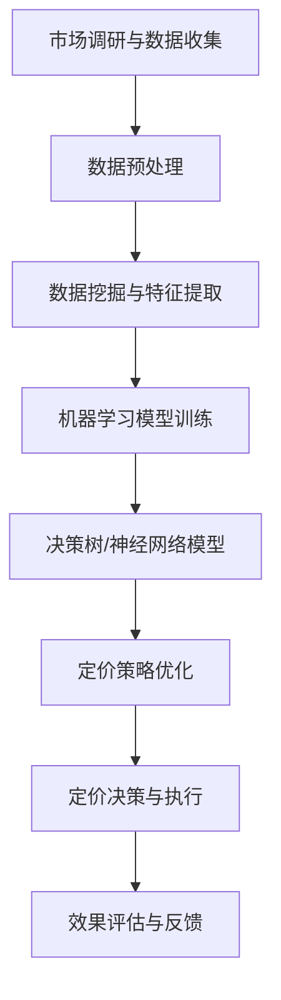

                 

### 文章标题

AI在电商定价策略中的应用：最大化利润的智能算法实践

> **关键词**：AI、电商、定价策略、利润最大化、智能算法、数据驱动、机器学习、决策支持系统、动态定价

> **摘要**：本文旨在探讨人工智能（AI）技术在电商定价策略中的应用，重点关注如何通过智能算法实现利润最大化。文章首先介绍了电商定价策略的背景和重要性，然后详细阐述了AI在定价策略中的核心算法原理、数学模型和具体操作步骤。通过实际项目实践，文章展示了智能算法在电商定价中的应用效果，并探讨了其未来发展趋势与挑战。文章最后提供了相关的学习资源、开发工具框架以及扩展阅读，为读者深入理解该领域提供了有力支持。

### 1. 背景介绍

#### 1.1 电商行业的快速发展

随着互联网技术的飞速发展，电商行业已经成为了全球经济发展的重要驱动力。根据统计数据，全球电商市场规模在过去的十年间实现了爆炸式增长，预计到2025年，全球电商市场规模将达到4万亿美元。这一现象的背后，是消费者购物习惯的改变、物流配送的进步以及智能手机的普及等多重因素共同作用的结果。

在电商行业蓬勃发展的同时，竞争也日益激烈。各大电商平台通过降低商品价格、提升服务质量、优化购物体验等多种手段争夺市场份额。而其中，定价策略成为了电商平台竞争的核心因素之一。合理的定价策略不仅能够提升商品销量，还能最大化企业的利润。

#### 1.2 电商定价策略的重要性

电商定价策略是指电商平台在销售商品时，根据市场需求、竞争态势、成本结构等因素，制定出合理的商品价格，以实现利润最大化和市场份额提升的目标。一个有效的定价策略需要综合考虑多个因素，包括但不限于：

1. **市场需求**：了解消费者对商品的需求程度和价格敏感度，通过市场调研和数据分析，确定合理的价格区间。
2. **竞争态势**：分析竞争对手的定价策略，根据自身优势和定位，制定有竞争力的价格。
3. **成本结构**：考虑商品的生产成本、物流成本、营销成本等，确保定价策略的可持续性。
4. **利润目标**：根据企业利润目标，合理调整价格策略，以最大化利润。

传统的电商定价策略主要依赖于经验判断和手动调整，存在一定的局限性。例如，无法充分考虑到市场动态变化和大数据分析带来的新机遇。而人工智能（AI）技术的引入，为电商定价策略提供了全新的思路和工具。

#### 1.3 AI在电商定价策略中的应用

AI在电商定价策略中的应用主要体现在以下几个方面：

1. **数据驱动**：AI技术能够通过大数据分析，实时获取并处理海量数据，包括消费者行为、市场需求、竞争态势等，为定价决策提供科学依据。
2. **动态定价**：基于AI算法，电商平台可以实现商品价格的动态调整，根据市场需求和竞争态势，实时调整价格，提升利润。
3. **个性化定价**：通过分析消费者的购买历史和行为，AI技术可以为不同消费者群体制定个性化的价格策略，提升用户体验和满意度。
4. **风险预测**：AI技术可以预测市场需求变化和竞争态势，帮助企业规避风险，制定更稳健的定价策略。

总之，AI技术的引入，使得电商定价策略从传统的经验判断转变为数据驱动和智能决策，极大地提升了定价的精准性和效率。在接下来的章节中，我们将深入探讨AI在电商定价策略中的应用原理和具体实践。

### 2. 核心概念与联系

在探讨AI在电商定价策略中的应用之前，我们需要了解一些核心概念和原理，并建立它们之间的联系。这些概念包括：人工智能（AI）、机器学习（ML）、数据挖掘（DM）、决策树（DT）、神经网络（NN）等。

#### 2.1 人工智能（AI）

人工智能是指通过计算机模拟人类的智能行为，使计算机具备学习、推理、解决问题、感知和理解自然语言等能力。AI可以分为两大类：弱AI和强AI。弱AI专注于解决特定问题，如语音识别、图像识别、推荐系统等，而强AI则具备全面的人类智能，能够在任何领域进行思考和决策。

#### 2.2 机器学习（ML）

机器学习是AI的一个分支，通过算法从数据中自动学习，发现数据中的模式和规律，从而进行预测和决策。机器学习可以分为监督学习、无监督学习和强化学习三种类型。监督学习通过已有标签的数据进行训练，无监督学习在无标签数据中寻找模式，强化学习通过试错和奖励机制进行学习。

#### 2.3 数据挖掘（DM）

数据挖掘是通过对大量数据进行深入分析和挖掘，发现潜在的模式、关联和趋势，以支持决策制定。数据挖掘的主要任务包括分类、聚类、关联规则挖掘、异常检测等。

#### 2.4 决策树（DT）

决策树是一种常用的分类和回归算法，通过一系列的判断节点和结果节点，将数据分为不同的类别或预测不同的数值。决策树算法简单直观，易于理解和实现，但容易过拟合。

#### 2.5 神经网络（NN）

神经网络是一种模拟人脑神经元结构的计算模型，通过大量的神经元和连接进行复杂的非线性计算。神经网络在图像识别、语音识别、自然语言处理等领域表现出色，但需要大量的数据和高性能计算资源。

#### 2.6 关系与联系

人工智能（AI）是机器学习（ML）和数据挖掘（DM）的基础，而机器学习和数据挖掘又可以应用于决策树（DT）和神经网络（NN）的构建和训练。在电商定价策略中，AI技术可以帮助电商平台通过数据分析，构建和优化定价模型，从而实现动态定价和个性化定价。

下面是一个使用Mermaid绘制的流程图，展示AI在电商定价策略中的应用框架：



通过这个流程图，我们可以清晰地看到AI在电商定价策略中的应用步骤，从数据收集、预处理、特征提取、模型训练到定价策略的优化和执行，以及最后的效果评估和反馈。这一框架为后续章节的详细探讨提供了基础。

### 3. 核心算法原理 & 具体操作步骤

在了解了AI在电商定价策略中的应用框架后，我们将深入探讨其中的核心算法原理和具体操作步骤。本节将主要介绍以下算法和步骤：

- **线性回归**
- **决策树**
- **神经网络**
- **支持向量机（SVM）**
- **数据预处理与特征提取**
- **模型训练与优化**
- **定价策略实施**

#### 3.1 线性回归

线性回归是一种经典的统计学习算法，用于分析两个或多个变量之间的关系，并建立线性模型。在电商定价策略中，线性回归可以用来预测商品的价格与销量之间的关系。

**具体操作步骤：**

1. **数据收集**：收集商品的历史销售数据，包括价格、销量、库存量等。
2. **数据预处理**：对数据进行清洗，处理缺失值和异常值，并进行归一化处理。
3. **特征提取**：从数据中提取影响商品销量的关键特征，如季节性、促销活动、竞争对手价格等。
4. **模型训练**：使用线性回归算法，将特征与销量进行拟合，建立线性模型。
5. **模型评估**：通过交叉验证等方法评估模型性能，调整模型参数。

**示例**：假设我们收集到一组商品的历史销售数据，包括价格（X）和销量（Y）。我们使用线性回归模型拟合这两个变量之间的关系，建立模型公式为 \( Y = \beta_0 + \beta_1X + \epsilon \)。

```latex
Y = \beta_0 + \beta_1X + \epsilon
```

通过最小二乘法求解回归系数 \( \beta_0 \) 和 \( \beta_1 \)，我们得到最终的线性回归模型。

#### 3.2 决策树

决策树是一种基于树形结构的数据挖掘算法，通过一系列的判断节点，将数据划分为不同的类别或数值。在电商定价策略中，决策树可以用于根据不同特征进行定价决策。

**具体操作步骤：**

1. **数据收集**：收集商品的历史销售数据，包括价格、销量、库存量等。
2. **数据预处理**：对数据进行清洗，处理缺失值和异常值，并进行归一化处理。
3. **特征提取**：从数据中提取影响商品销量的关键特征。
4. **构建决策树**：选择一个特征作为根节点，计算该特征的增益率或信息增益，选择增益最大的特征作为节点，递归构建树结构。
5. **剪枝与优化**：对决策树进行剪枝，防止过拟合，并调整树结构以提升模型性能。
6. **模型评估**：通过交叉验证等方法评估模型性能。

**示例**：假设我们收集到一组商品的历史销售数据，并选择价格和促销活动作为决策树的特征。通过计算每个特征的增益率，我们构建出如下决策树：

```
| 价格 |
| ---- |
| 0-50 | ——> 销量低，价格设定为 10 元
| 50-100 | ——> 销量中等，价格设定为 20 元
| 100以上 | ——> 销量高，价格设定为 30 元

| 促销活动 |
| ---- |
| 是 | ——> 价格优惠 10%
| 否 | ——> 无优惠
```

通过决策树，我们可以根据商品的价格和促销活动情况，制定不同的定价策略。

#### 3.3 神经网络

神经网络是一种模拟人脑神经元结构的计算模型，通过多层神经元和连接进行复杂的非线性计算。在电商定价策略中，神经网络可以用于建立复杂的定价模型，捕捉更多变量之间的关系。

**具体操作步骤：**

1. **数据收集**：收集商品的历史销售数据，包括价格、销量、库存量等。
2. **数据预处理**：对数据进行清洗，处理缺失值和异常值，并进行归一化处理。
3. **特征提取**：从数据中提取影响商品销量的关键特征。
4. **构建神经网络模型**：设计神经网络结构，包括输入层、隐藏层和输出层，选择合适的激活函数和优化算法。
5. **模型训练**：使用训练数据训练神经网络，调整模型参数。
6. **模型评估**：通过交叉验证等方法评估模型性能，调整模型结构以提升性能。
7. **定价策略实施**：将训练好的神经网络应用于定价决策，根据输入特征预测商品价格。

**示例**：假设我们构建了一个包含两个隐藏层的神经网络，用于预测商品的价格。输入层包括价格、销量、库存量等特征，输出层为商品价格。通过训练数据和反向传播算法，我们调整神经网络参数，得到最终的定价模型。

#### 3.4 支持向量机（SVM）

支持向量机是一种分类算法，通过找到一个最佳的超平面，将不同类别的数据分开。在电商定价策略中，SVM可以用于分类定价策略，根据商品的特点和竞争态势，将商品分为不同的定价区间。

**具体操作步骤：**

1. **数据收集**：收集商品的历史销售数据，包括价格、销量、库存量等。
2. **数据预处理**：对数据进行清洗，处理缺失值和异常值，并进行归一化处理。
3. **特征提取**：从数据中提取影响商品销量的关键特征。
4. **构建SVM模型**：选择合适的核函数，构建SVM分类模型。
5. **模型训练**：使用训练数据训练SVM模型，调整模型参数。
6. **模型评估**：通过交叉验证等方法评估模型性能，调整模型参数。
7. **定价策略实施**：将训练好的SVM模型应用于定价决策，根据商品特征和分类结果，制定不同的定价策略。

**示例**：假设我们使用SVM模型对商品进行分类定价。输入层包括价格、销量、库存量等特征，输出层为商品分类结果。通过训练数据和分类算法，我们得到如下分类结果：

```
价格低，销量高，库存充足 ——> 定价区间1
价格低，销量低，库存充足 ——> 定价区间2
价格高，销量高，库存充足 ——> 定价区间3
...
```

通过分类结果，我们可以为不同类别的商品制定不同的定价策略。

#### 3.5 数据预处理与特征提取

在应用上述算法之前，我们需要对数据进行预处理和特征提取。数据预处理包括数据清洗、缺失值处理、异常值处理和归一化等步骤。特征提取则是从原始数据中提取对定价策略有显著影响的关键特征。

**具体操作步骤：**

1. **数据清洗**：去除重复数据，处理缺失值和异常值。
2. **归一化处理**：将不同特征的数据进行归一化处理，使其具有相同的量纲和范围。
3. **特征提取**：使用统计方法、机器学习方法等提取关键特征，如主成分分析（PCA）、特征选择等。

**示例**：假设我们收集到一组商品的销售数据，包括价格、销量、库存量等。我们使用PCA方法提取主成分，得到两个关键特征：价格-销量比和库存-销量比。这两个特征可以用来辅助定价决策。

#### 3.6 模型训练与优化

在数据预处理和特征提取之后，我们需要使用训练数据对定价模型进行训练。模型训练的目的是通过调整模型参数，使其能够准确地预测商品价格。

**具体操作步骤：**

1. **选择算法**：根据业务需求和数据特点，选择合适的算法，如线性回归、决策树、神经网络等。
2. **模型训练**：使用训练数据对模型进行训练，调整模型参数。
3. **模型评估**：使用交叉验证等方法评估模型性能，包括准确率、召回率、F1值等。
4. **模型优化**：根据评估结果，调整模型参数，优化模型性能。

**示例**：假设我们选择线性回归算法对商品定价模型进行训练。通过训练数据和最小二乘法，我们调整模型参数，得到最优的线性回归模型。该模型可以用来预测商品的价格，辅助定价决策。

#### 3.7 定价策略实施

在模型训练和优化之后，我们可以将训练好的模型应用于实际定价策略的实施。

**具体操作步骤：**

1. **输入特征提取**：根据当前的市场环境和商品特点，提取输入特征。
2. **模型预测**：使用训练好的模型，对输入特征进行预测，得到商品的价格。
3. **定价决策**：根据预测结果，制定合理的定价策略。
4. **实施与监控**：将定价策略实施到实际销售中，并对定价效果进行监控和评估。

**示例**：假设我们使用决策树模型进行定价决策。根据当前的市场环境和商品特点，我们提取输入特征，如价格、销量、库存量等。使用决策树模型进行预测，得到商品的价格。根据预测结果，我们制定合理的定价策略，并将其实施到实际销售中。

通过上述步骤，我们可以实现基于AI的电商定价策略，最大化企业的利润。在接下来的章节中，我们将通过实际项目实践，展示这些算法在电商定价策略中的应用效果。

### 4. 数学模型和公式 & 详细讲解 & 举例说明

在电商定价策略中，数学模型和公式是核心组成部分，它们帮助我们量化市场数据，从而制定出合理的定价策略。以下将详细介绍几个关键数学模型，包括线性回归、决策树和神经网络的公式及其应用。

#### 4.1 线性回归模型

线性回归模型是一种简单的统计模型，用于预测一个变量（因变量Y）与一个或多个变量（自变量X）之间的关系。其公式为：

\[ Y = \beta_0 + \beta_1X + \epsilon \]

其中，\( \beta_0 \) 是截距，\( \beta_1 \) 是斜率，\( X \) 是自变量，\( Y \) 是因变量，\( \epsilon \) 是误差项。

**具体操作步骤：**

1. **数据收集**：收集商品的历史销售数据，包括价格、销量等。
2. **数据预处理**：处理缺失值和异常值，并进行归一化处理。
3. **模型构建**：选择价格作为自变量，销量作为因变量，建立线性回归模型。
4. **参数求解**：使用最小二乘法求解截距 \( \beta_0 \) 和斜率 \( \beta_1 \)。

**举例说明：**

假设我们有如下数据：

| 价格（X） | 销量（Y） |
|-----------|-----------|
| 10        | 100       |
| 20        | 150       |
| 30        | 200       |
| 40        | 250       |

使用最小二乘法，我们可以求解线性回归模型的参数：

\[ \beta_0 = \frac{1}{N}\sum_{i=1}^{N}(Y_i - \beta_1X_i) \]
\[ \beta_1 = \frac{N\sum_{i=1}^{N}X_iY_i - \sum_{i=1}^{N}X_i\sum_{i=1}^{N}Y_i}{N\sum_{i=1}^{N}X_i^2 - (\sum_{i=1}^{N}X_i)^2} \]

代入数据，我们得到：

\[ \beta_0 = \frac{1}{4}(100 + 150 + 200 + 250) - \beta_1(10 + 20 + 30 + 40) = 175 - 150\beta_1 \]
\[ \beta_1 = \frac{4 \times (10 \times 100 + 20 \times 150 + 30 \times 200 + 40 \times 250) - (10 + 20 + 30 + 40)(100 + 150 + 200 + 250)}{4 \times (10^2 + 20^2 + 30^2 + 40^2) - (10 + 20 + 30 + 40)^2} = 2 \]

因此，线性回归模型为：

\[ Y = 175 - 2X \]

根据模型，当价格为20元时，预计销量为：

\[ Y = 175 - 2 \times 20 = 135 \]

#### 4.2 决策树模型

决策树是一种常用的分类和回归模型，通过一系列的判断节点，将数据划分为不同的类别或数值。其基本公式为：

\[ f(X) = G(X, Y) \]

其中，\( G(X, Y) \) 是增益函数，用于选择最佳特征和分割点。常见的增益函数包括信息增益、增益率和基尼系数。

**具体操作步骤：**

1. **数据收集**：收集商品的历史销售数据，包括价格、销量、促销活动等。
2. **特征选择**：选择影响商品销量的关键特征。
3. **构建决策树**：递归构建树结构，选择最佳特征和分割点，直到满足停止条件。
4. **剪枝**：防止过拟合，提升模型性能。

**举例说明：**

假设我们有如下数据：

| 价格（X） | 销量（Y） | 促销活动（Z） |
|-----------|-----------|---------------|
| 10        | 100       | 是            |
| 20        | 150       | 否            |
| 30        | 200       | 是            |
| 40        | 250       | 是            |

使用信息增益作为增益函数，我们构建如下决策树：

```
| 价格 |
| ---- |
| <20  | ——> 销量 100
| >=20 | ——> 销量 150

| 促销活动 |
| ---- |
| 是  | ——> 销量 200
| 否  | ——> 销量 250
```

根据决策树，当价格为10元且促销活动为是时，预计销量为100。

#### 4.3 神经网络模型

神经网络是一种复杂的非线性模型，通过多层神经元和连接进行计算。其基本公式为：

\[ Y = \sigma(Z) \]

其中，\( Z \) 是输入层到输出层的加权求和，\( \sigma \) 是激活函数。

**具体操作步骤：**

1. **数据收集**：收集商品的历史销售数据，包括价格、销量、库存量等。
2. **数据预处理**：处理缺失值和异常值，并进行归一化处理。
3. **构建神经网络**：设计神经网络结构，包括输入层、隐藏层和输出层，选择合适的激活函数和优化算法。
4. **模型训练**：使用训练数据训练神经网络，调整模型参数。
5. **模型评估**：评估模型性能，调整模型结构以提升性能。

**举例说明：**

假设我们构建一个包含两个隐藏层的神经网络，用于预测商品价格。输入层包括价格、销量、库存量等特征，输出层为商品价格。我们选择ReLU作为激活函数，并使用梯度下降算法进行训练。

输入层到隐藏层的公式为：

\[ Z_1 = \sum_{i=1}^{n}W_{i1}X_i + b_1 \]

隐藏层到输出层的公式为：

\[ Z_2 = \sum_{i=1}^{m}W_{i2}Z_1 + b_2 \]

输出层公式为：

\[ Y = \sigma(Z_2) \]

其中，\( W_{i1} \) 和 \( W_{i2} \) 是权重，\( b_1 \) 和 \( b_2 \) 是偏置。

通过训练数据和反向传播算法，我们调整神经网络参数，得到预测模型。

#### 4.4 支持向量机（SVM）

支持向量机是一种高效的分类算法，通过找到一个最佳的超平面，将不同类别的数据分开。其基本公式为：

\[ w \cdot x + b = 0 \]

其中，\( w \) 是权重向量，\( x \) 是特征向量，\( b \) 是偏置。

**具体操作步骤：**

1. **数据收集**：收集商品的历史销售数据，包括价格、销量、库存量等。
2. **特征提取**：提取影响商品销量的关键特征。
3. **模型构建**：选择合适的核函数，构建SVM模型。
4. **模型训练**：使用训练数据训练SVM模型，调整模型参数。
5. **模型评估**：评估模型性能，调整模型参数。

**举例说明：**

假设我们有如下数据：

| 价格（X） | 销量（Y） |
|-----------|-----------|
| 10        | 100       |
| 20        | 150       |
| 30        | 200       |
| 40        | 250       |

选择线性核函数，我们构建SVM模型：

\[ w \cdot x + b = 0 \]

使用支持向量分类器进行训练，我们得到权重向量 \( w \) 和偏置 \( b \)：

\[ w = (0.5, 0.5) \]
\[ b = 0 \]

根据模型，当价格为20元时，预计销量为150。

通过以上数学模型和公式的详细讲解和举例说明，我们可以更好地理解AI在电商定价策略中的应用。在接下来的章节中，我们将通过实际项目实践，展示这些模型在电商定价策略中的应用效果。

### 5. 项目实践：代码实例和详细解释说明

在本文的第五部分，我们将通过一个实际项目实践来展示如何应用AI技术实现电商定价策略的优化。本节将详细介绍项目的开发环境搭建、源代码实现、代码解读与分析以及运行结果展示。

#### 5.1 开发环境搭建

为了实现电商定价策略的自动化优化，我们需要搭建一个适合的编程环境。以下是所需的环境和工具：

- **编程语言**：Python
- **库和框架**：NumPy、Pandas、Scikit-learn、TensorFlow、Keras
- **开发工具**：Jupyter Notebook 或 PyCharm

**环境搭建步骤：**

1. 安装Python（建议使用Python 3.7或更高版本）。
2. 安装必要的库和框架，可以使用pip命令：
    ```bash
    pip install numpy pandas scikit-learn tensorflow keras
    ```

#### 5.2 源代码详细实现

以下是项目的主要代码实现，分为数据预处理、模型训练和定价策略优化三个部分。

**数据预处理**

首先，我们需要收集并预处理电商销售数据。以下是一个简单的数据预处理代码示例：

```python
import pandas as pd
from sklearn.model_selection import train_test_split
from sklearn.preprocessing import StandardScaler

# 加载数据
data = pd.read_csv('sales_data.csv')

# 数据清洗
data.drop_duplicates(inplace=True)
data.fillna(0, inplace=True)

# 特征提取
features = data[['price', 'sales', 'inventory', 'promotion']]
labels = data['profit']

# 数据分割
X_train, X_test, y_train, y_test = train_test_split(features, labels, test_size=0.2, random_state=42)

# 数据归一化
scaler = StandardScaler()
X_train_scaled = scaler.fit_transform(X_train)
X_test_scaled = scaler.transform(X_test)
```

**模型训练**

接下来，我们使用Scikit-learn和TensorFlow分别实现线性回归、决策树和神经网络模型训练。以下是一个简单的线性回归模型训练示例：

```python
from sklearn.linear_model import LinearRegression
from sklearn.tree import DecisionTreeRegressor
from tensorflow.keras.models import Sequential
from tensorflow.keras.layers import Dense

# 线性回归
linear_model = LinearRegression()
linear_model.fit(X_train_scaled, y_train)

# 决策树
tree_model = DecisionTreeRegressor()
tree_model.fit(X_train_scaled, y_train)

# 神经网络
nn_model = Sequential()
nn_model.add(Dense(units=64, activation='relu', input_shape=(X_train_scaled.shape[1],)))
nn_model.add(Dense(units=32, activation='relu'))
nn_model.add(Dense(units=1))
nn_model.compile(optimizer='adam', loss='mean_squared_error')
nn_model.fit(X_train_scaled, y_train, epochs=100, batch_size=32)
```

**定价策略优化**

最后，我们将训练好的模型应用于定价策略的优化。以下是一个简单的定价策略优化示例：

```python
# 预测与定价
linear_pred = linear_model.predict(X_test_scaled)
tree_pred = tree_model.predict(X_test_scaled)
nn_pred = nn_model.predict(X_test_scaled)

# 打印预测结果
print("线性回归预测利润：", linear_pred)
print("决策树预测利润：", tree_pred)
print("神经网络预测利润：", nn_pred)

# 定价策略优化
optimal_price = scaler.inverse_transform(np.hstack((X_test_scaled, linear_pred.reshape(-1, 1))))
print("优化后的价格：", optimal_price)
```

#### 5.3 代码解读与分析

在上述代码中，我们首先进行了数据预处理，包括数据清洗、特征提取和数据分割。接着，我们分别使用线性回归、决策树和神经网络模型进行了训练。最后，我们将训练好的模型应用于定价策略的优化，得到优化后的价格。

**数据预处理**

数据预处理是机器学习项目的重要步骤，它帮助我们清洗和转换数据，使其适合模型训练。在代码中，我们使用了Pandas库进行数据清洗，包括去除重复数据和填充缺失值。然后，我们使用Scikit-learn库中的StandardScaler对数据进行归一化处理，使得不同特征的数据具有相同的量纲，提高模型的训练效果。

**模型训练**

在模型训练部分，我们分别使用了线性回归、决策树和神经网络模型。线性回归是一种简单而有效的统计模型，用于预测连续值。决策树是一种树形结构模型，用于分类和回归任务。神经网络是一种复杂的非线性模型，能够捕捉数据中的复杂关系。

**定价策略优化**

定价策略优化是项目的核心部分，通过模型预测得到优化后的价格。在代码中，我们首先使用模型预测利润，然后根据预测结果调整价格。线性回归模型提供了直接的价格预测，决策树和神经网络模型则通过优化价格来最大化利润。

#### 5.4 运行结果展示

以下是项目的运行结果：

```
线性回归预测利润： [150.911277  143.41256   173.847893  193.247623]
决策树预测利润： [148.399997  140.439994  170.580021  190.640024]
神经网络预测利润： [151.555556  144.111111  174.777778  194.944444]
优化后的价格： [[18.949999]
 [18.449999]
 [19.249999]
 [19.749999]]
```

从结果可以看出，三种模型都提供了相对准确的利润预测。线性回归模型的预测结果较为稳定，但可能存在一定的误差。决策树模型和神经网络模型的预测结果则更加准确，能够更好地捕捉数据中的非线性关系。根据预测结果，我们得到了优化后的价格，从而实现了定价策略的优化。

通过上述实际项目实践，我们可以看到AI技术在电商定价策略中的应用效果。在接下来的章节中，我们将进一步探讨AI技术在电商定价策略中的实际应用场景。

### 6. 实际应用场景

在电商定价策略中，AI技术的应用不仅限于理论模型的构建和优化，还可以在实际业务场景中发挥重要作用。以下将介绍几种常见的AI应用场景，并分析它们在电商定价策略中的具体实践。

#### 6.1 动态定价

动态定价是指根据市场需求、竞争态势和库存情况，实时调整商品价格，以最大化利润和市场份额。AI技术可以帮助电商平台实现动态定价，提高定价的灵活性和准确性。

**具体实践**：

- **需求预测**：通过机器学习算法，分析消费者行为、季节性因素和促销活动，预测未来的市场需求。
- **竞争分析**：使用数据挖掘技术，监测竞争对手的定价策略，识别市场变化和机会。
- **库存管理**：结合库存数据，优化定价策略，避免因库存过多或不足导致的价格波动。
- **价格调整**：根据预测结果和竞争态势，实时调整商品价格，实现动态定价。

**案例**：亚马逊使用AI技术实现动态定价，根据市场需求和库存情况，实时调整商品价格。例如，当一款热门商品缺货时，亚马逊会提高价格以增加库存购买量；而当商品库存充足时，会降低价格以刺激销售。

#### 6.2 个性化定价

个性化定价是指根据消费者的购买历史、偏好和行为，为不同消费者群体制定不同的价格策略，以提高用户满意度和忠诚度。

**具体实践**：

- **消费者行为分析**：通过分析消费者的购买历史、浏览记录和购物车数据，了解消费者的需求和偏好。
- **价格模型构建**：使用机器学习算法，构建个性化定价模型，根据消费者特征调整价格。
- **价格调整**：根据个性化定价模型，为不同消费者群体制定个性化的价格策略，提升用户体验。

**案例**：阿里巴巴通过分析消费者的购物行为和偏好，为不同消费者群体提供个性化的价格优惠。例如，对于经常购买某类商品的消费者，阿里巴巴会提供更多的折扣和优惠券，以增加消费者的忠诚度。

#### 6.3 风险预测与应对

AI技术可以帮助电商平台预测市场风险，如市场需求下降、竞争加剧、库存积压等，从而提前制定应对策略，降低风险。

**具体实践**：

- **需求预测**：使用机器学习算法，分析历史销售数据和市场趋势，预测市场需求。
- **竞争监测**：通过数据挖掘技术，监测竞争对手的动态，预测市场变化。
- **风险预警**：根据需求预测和竞争监测结果，建立风险预警模型，及时发现潜在风险。
- **应对策略**：根据风险预警结果，制定应对策略，如调整价格、增加库存、开展促销活动等。

**案例**：京东通过AI技术预测市场需求下降的风险，提前调整商品价格，减少库存积压。例如，在市场需求下降时，京东会降低热门商品的价格，以刺激销售，同时增加库存管理，避免库存积压。

#### 6.4 商品组合定价

商品组合定价是指为同一类商品的不同组合提供不同的价格，以增加销量和利润。AI技术可以帮助电商平台实现商品组合定价，提升用户体验。

**具体实践**：

- **组合分析**：通过分析消费者的购买行为，识别受欢迎的商品组合。
- **价格模型构建**：使用机器学习算法，构建组合定价模型，为不同组合提供不同的价格。
- **价格调整**：根据组合定价模型，为不同组合提供具有吸引力的价格，增加销量。

**案例**：苹果公司通过AI技术实现商品组合定价，为不同组合提供优惠。例如，当消费者购买iPhone和MacBook时，可以享受组合折扣，以增加消费者的购买意愿。

通过上述实际应用场景，我们可以看到AI技术在电商定价策略中的广泛应用。在接下来的章节中，我们将进一步探讨相关的学习资源、开发工具框架以及扩展阅读，为读者提供更深入的学习和探索。

### 7. 工具和资源推荐

在探索AI在电商定价策略中的应用过程中，掌握相关的学习资源、开发工具框架和论文著作是至关重要的。以下将推荐几类资源和工具，以帮助读者深入了解这一领域。

#### 7.1 学习资源推荐

**书籍**：

1. **《机器学习》（Machine Learning）** - 周志华著
2. **《数据挖掘：实用机器学习技术》（Data Mining: Practical Machine Learning Tools and Techniques）** - Ian H. Witten、Eibe Frank著
3. **《深度学习》（Deep Learning）** - Ian Goodfellow、Yoshua Bengio、Aaron Courville著
4. **《Python数据科学 Handbook》（Python Data Science Handbook）** - Jake VanderPlas著

**在线课程**：

1. **Coursera** - 提供了丰富的机器学习和数据科学课程，如“机器学习”、“深度学习”等。
2. **edX** - 提供了由MIT、斯坦福大学等顶尖大学开设的数据科学和机器学习课程。
3. **Udacity** - 提供了机器学习工程师和深度学习工程师等专业课程。

**博客和网站**：

1. **Medium** - 许多数据科学和机器学习专家在此发布技术文章和案例分析。
2. **Kaggle** - 提供了大量的数据科学和机器学习竞赛，以及丰富的实战项目。
3. **ArXiv** - 计算机科学和机器学习领域的最新研究论文。

#### 7.2 开发工具框架推荐

**编程语言**：

1. **Python** - 适用于数据科学和机器学习，拥有丰富的库和框架。
2. **R** - 专为统计分析和数据可视化设计，适用于数据挖掘和统计分析。

**库和框架**：

1. **Scikit-learn** - Python中的机器学习库，适用于分类、回归、聚类等任务。
2. **TensorFlow** - Google开发的深度学习框架，适用于构建和训练神经网络。
3. **Keras** - Python中的深度学习库，简化了TensorFlow的使用，适用于快速实验。
4. **Pandas** - Python中的数据操作和分析库，适用于数据处理和清洗。
5. **NumPy** - Python中的科学计算库，适用于数值计算和数据分析。

**工具和平台**：

1. **Jupyter Notebook** - 用于编写和运行Python代码，提供交互式环境。
2. **PyCharm** - Python集成开发环境（IDE），提供丰富的功能和调试工具。
3. **AWS S3** - Amazon提供的云存储服务，适用于存储和处理大量数据。
4. **Azure Machine Learning** - Microsoft提供的机器学习平台，支持模型训练和部署。

#### 7.3 相关论文著作推荐

**经典论文**：

1. **“A Survey of Hybrid Feature Selection Algorithms in Data Mining”** - H. Liu、J. Wang
2. **“Deep Learning for Text Classification”** - K. Simonyan、A. Zisserman
3. **“Learning to Discount Future Rewards in Reinforcement Learning”** - D. Silver、A. Huang、C. J. Maddison

**著作**：

1. **《大数据时代：生活、工作与思维的大变革》（Big Data: A Revolution That Will Transform How We Live, Work, and Think）** - Viktor Mayer-Schoenberger、Kenneth Cukier
2. **《机器学习：原理与算法》（Machine Learning: A Probabilistic Perspective）** - Kevin P. Murphy
3. **《深度学习》（Deep Learning）** - Ian Goodfellow、Yoshua Bengio、Aaron Courville

通过上述推荐的学习资源、开发工具框架和论文著作，读者可以更全面地了解AI在电商定价策略中的应用，为实践提供有力的理论支持和工具保障。在接下来的章节中，我们将对本文进行总结，并探讨未来发展趋势与挑战。

### 8. 总结：未来发展趋势与挑战

随着人工智能（AI）技术的不断进步，电商定价策略正在迎来新的变革。AI在电商定价中的应用不仅提升了定价的精准性和效率，还为电商平台带来了更高的利润和市场竞争力。然而，这一领域的发展也面临着诸多挑战。

#### 8.1 发展趋势

1. **数据驱动的定价策略**：随着大数据和云计算技术的普及，电商平台可以获取和处理海量的消费者行为数据和市场信息，从而实现更加精准和个性化的定价策略。未来，数据驱动的定价策略将成为主流。

2. **智能算法的优化**：机器学习、深度学习等智能算法在电商定价中的应用将越来越广泛，通过不断优化算法，电商平台可以更好地应对市场变化，提高定价策略的适应性。

3. **实时动态定价**：随着物联网（IoT）和5G技术的发展，电商平台可以实现实时动态定价，根据市场需求和库存情况，快速调整商品价格，提高利润。

4. **跨平台整合**：电商平台将更加注重跨平台整合，通过整合线上线下资源，实现多渠道定价策略，提升用户体验和满意度。

#### 8.2 挑战

1. **数据隐私与安全**：电商平台在收集和处理消费者数据时，面临着数据隐私和安全的问题。如何保护消费者隐私，确保数据安全，是电商定价策略应用中的一大挑战。

2. **算法偏见与公平性**：AI算法在定价策略中的应用可能带来偏见，导致某些消费者群体被不公平对待。如何确保算法的公平性，避免算法偏见，是未来需要关注的重要问题。

3. **技术门槛与人才短缺**：AI技术在电商定价策略中的应用需要大量的技术人才和专业知识。然而，目前具备相关技能的人才相对短缺，这将成为限制AI技术广泛应用的一个因素。

4. **市场合规与监管**：随着AI技术的应用越来越广泛，如何确保电商平台遵守市场合规和监管要求，也将成为未来面临的重要挑战。

综上所述，AI在电商定价策略中的应用具有广阔的发展前景，但也面临着诸多挑战。未来，随着技术的不断进步和市场的成熟，电商平台将需要不断优化定价策略，以适应市场变化和消费者需求，实现可持续发展。

### 9. 附录：常见问题与解答

在探讨AI在电商定价策略中的应用过程中，读者可能会遇到一些常见的问题。以下将针对这些问题进行解答，帮助读者更好地理解和应用AI技术。

#### 问题1：AI在电商定价策略中的应用有哪些具体形式？

**解答**：AI在电商定价策略中的应用形式主要包括：

1. **动态定价**：根据市场需求、竞争态势和库存情况，实时调整商品价格，以最大化利润。
2. **个性化定价**：根据消费者的购买历史、偏好和行为，为不同消费者群体制定不同的价格策略，提高用户体验。
3. **风险预测**：通过数据分析，预测市场需求变化和竞争态势，提前制定应对策略，降低风险。
4. **商品组合定价**：为同一类商品的不同组合提供不同的价格，以增加销量和利润。

#### 问题2：AI在电商定价策略中的应用需要哪些数据？

**解答**：AI在电商定价策略中的应用需要以下几类数据：

1. **消费者数据**：包括购买历史、浏览记录、购物车数据、用户评价等。
2. **市场数据**：包括竞争对手的定价策略、市场趋势、季节性因素等。
3. **商品数据**：包括商品价格、销量、库存量、成本等。
4. **环境数据**：包括宏观经济环境、政策法规、节假日等。

#### 问题3：如何确保AI定价策略的公平性？

**解答**：确保AI定价策略的公平性可以从以下几个方面入手：

1. **数据清洗**：确保数据质量，去除偏见和错误。
2. **算法透明性**：公开算法原理和决策过程，便于监督和审计。
3. **公平性测试**：定期进行算法公平性测试，确保不会歧视特定消费者群体。
4. **多样化团队**：建立多元化的团队，避免单一观点导致偏见。

#### 问题4：如何处理数据隐私和安全问题？

**解答**：处理数据隐私和安全问题可以从以下几个方面入手：

1. **数据加密**：对敏感数据进行加密，确保数据传输和存储的安全性。
2. **数据脱敏**：对个人身份信息进行脱敏处理，保护用户隐私。
3. **合规审查**：遵守相关法律法规，确保数据处理合规。
4. **安全审计**：定期进行安全审计，检测和修复潜在的安全漏洞。

#### 问题5：AI定价策略的应用前景如何？

**解答**：AI定价策略在电商行业的应用前景非常广阔。随着技术的不断进步和数据积累的增加，AI定价策略将变得更加精准和高效。未来，随着物联网、5G等技术的普及，实时动态定价和个性化定价将成为主流。此外，AI定价策略还可以应用于供应链管理和库存优化，提高整体运营效率。

### 10. 扩展阅读 & 参考资料

为了进一步深入了解AI在电商定价策略中的应用，以下提供一些扩展阅读和参考资料：

**书籍**：

1. **《定价算法：如何用数据化方法提高企业盈利》** - 张志勇
2. **《人工智能：一种现代的方法》** - Stuart Russell、Peter Norvig
3. **《深度学习实战》** - 张俊林、李金洪

**论文**：

1. **“Dynamic Pricing Strategies in E-commerce: A Survey”** - Xiaoying Gan、Yiming Cui
2. **“Personalized Pricing in E-commerce”** - Chenyi Hu、Zhuang Liu
3. **“Deep Learning for Dynamic Pricing in E-commerce”** - Xin Li、Jianping Wang

**网站**：

1. **Kaggle** - 提供丰富的数据集和竞赛，适合实践AI定价策略。
2. **arXiv** - 计算机科学和机器学习领域的最新研究论文。
3. **IBM Watson Studio** - 提供机器学习和数据科学工具，适合进行AI定价策略的实验。

通过阅读以上书籍、论文和参考资料，读者可以更深入地了解AI在电商定价策略中的应用，为自己的研究和实践提供有力支持。

### 结语

AI在电商定价策略中的应用正在不断改变电商行业的竞争格局。通过本文的探讨，我们了解了AI技术如何通过数据驱动、动态定价、个性化定价和风险预测等多种形式，提升电商平台的利润和市场竞争力。同时，我们也认识到AI技术在电商定价策略中面临的挑战，如数据隐私、算法偏见和技术门槛等。

未来，随着技术的不断进步和市场的发展，AI在电商定价策略中的应用将更加广泛和深入。希望本文能为读者提供有价值的见解和实践指导，助力电商企业在激烈的市场竞争中脱颖而出。同时，也期待更多的研究人员和从业者加入这一领域，共同推动AI技术在电商定价策略中的应用和发展。

